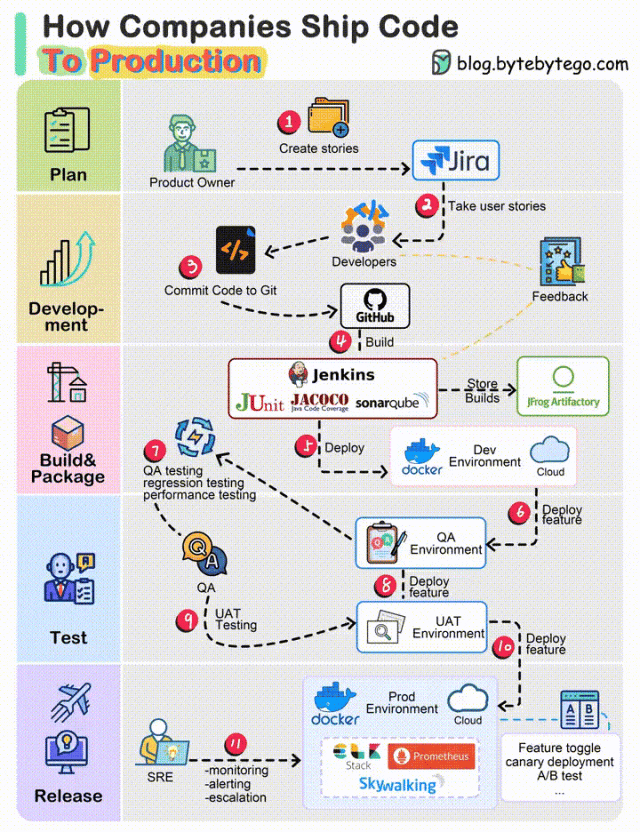

# 产品收藏目录

{: .no_toc}

## 目录

{: .no_toc .text-delta }

1. TOC
{:toc}

## CICD 全流程

步骤 1：产品负责人根据需求编写用户故事开启此流程。

步骤 2：开发团队从任务清单中选出这些用户故事，开始为期两周的迭代开发。

步骤 3：开发人员将代码提交至 Git 仓库。

步骤 4：代码提交后，Jenkins 会自动触发构建。此时，代码需要满足单元测试标准、达到设定的覆盖率，并通过 SonarQube 中的检测标准。

步骤 5：构建成功后，其结果将存放在 artifactory 中，接着会部署到开发环境进行验证。

步骤 6：可能有不同的团队处理各种功能模块。为确保独立测试，这些功能会部署至 QA1 和 QA2。

步骤 7：QA 团队对新部署的环境进行系列测试，包括 QA 测试、回归测试和性能测试。

步骤 8：当 QA 验证无误后，部署至 UAT 环境，此时不仅 QA，开发团队和产品负责人也会进行用户验收测试。

步骤 9：如果 UAT 通过，这些版本将按预定计划上线至生产环境。为稳妥起见，我们可能分阶段、分批上线，利用如功能切换、金丝雀发布等策略来降低风险。

步骤 10：SRE 负责实时监测线上环境，他们采用众多如 ELK Stack、Prometheus 和 Skywalking 等的工具来分析日志和追踪流程。如果发现异常，他们会迅速通知 QA 和开发团队，按照既定的优先级来修复这些问题。

本内容翻译自《System Design Interview》作者 Alex Xu 的 Twitter。链接：https://twitter.com/alexxubyte/status/1711767230642635130

## Kubernetes 环境安全扫描

- Kube-bench

- 静态代码扫描：SonarQube
- 安全扫描 anchore
- 镜像扫描 grype（比如发现依赖库的安全）

### 其他 Kubernetes 商业安全方案

- Datadog Security Platform
- Sysdig Platform Architecture
- Openshift的RHACS（红帽高级集群安全）+ File Integrity Operator

## 项目管理

- [Jira](https://www.jianshu.com/p/093cf14361ed)
- [confluence](https://www.jianshu.com/p/bda2638fdbc2)

## 仓库管理

- Gitlab：源代码仓库
- Gitea
- nexus：制品仓库：maven 仓库、npm 仓库
- jfrog：Java 制品库
- Harbor：容器镜像仓库

## 单元测试

- JUnit

## CICD 

- Argo Rollout：CD
- FluxCD (kubevela 基于 flux)
- Jenkins ：流水线编排

- GitHub Actions ：CI 工具
- Drone：一个轻量级的 jenkins
- Spinaker：CD（netflix）
- argoworkflow：CI

## 分布式存储

- Minio ：分布式对象存储
- ceph
- [rook-ceph](https://cloud.tencent.com/developer/article/1923891)
- GlusterFS

## K8s 备份

- Velero + Minio
- etcdctl snapshot 

## k8s 监控

### 追踪

- skywalking
- pinpoint （APM）

### 看板

- kuboard

### 日志

- 轻量采集：filebeat、 fluent-bit
- 重量采集：fluentd
- 全栈：Elastic（存储+索引数据）+ Logstash（收集数据） + Kibana（展示数据）
- 全栈：Elastic + Filebeat + Kibana

### Metric

- Prometheus + Grafana

### 告警

- Alertmanager

## 压测

- Loadrunner

- Jmeter
