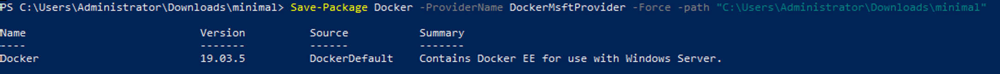

# Windows 容器

{: .no_toc}

## 目录

{: .no_toc .text-delta }


1. TOC
{:toc}


## 环境准备

Windows 需要 Windows server 2019 1809 及以上版本。

内存建议 8 G，CPU 4 核，磁盘空间不小于50G。

如果要使用 Flannel 插件，操作系统需要安装此 kb 中的补丁：

[http://www.catalog.update.microsoft.com/search.aspx?q=kb4470788](http://www.catalog.update.microsoft.com/search.aspx?q=kb4470788)


## 在线安装

在线安装非常简单，三条命令：


```powershell
#安装 OneGet 模块，用于下载 Docker 
Install-Module DockerMsftProvider -Force

#安装最新版本的 Docker-ee
Install-Package Docker -ProviderName DockerMsftProvider -Force

#安装指定版本的 Docker-ee
Install-Package -Name docker -ProviderName DockerMsftProvider -Force -RequiredVersion 18.09.11

#重启电脑
Restart-Computer -Force
```


测试

```powershell
PS C:\Users\Administrator\Downloads\minimal> docker run hello-world:nanoserver
Unable to find image 'hello-world:nanoserver' locally
nanoserver: Pulling from library/hello-world
b9e6fec25718: Already exists
030bb2557106: Pull complete
1a43d08f9d1f: Pull complete
Digest: sha256:11668744a8d8f6b60c1a1cc9fcda8898987a38056c50300b827e2ea6946fdb02
Status: Downloaded newer image for hello-world:nanoserver

Hello from Docker!
This message shows that your installation appears to be working correctly.

To generate this message, Docker took the following steps:
 1. The Docker client contacted the Docker daemon.
 2. The Docker daemon pulled the "hello-world" image from the Docker Hub.
    (windows-amd64, nanoserver-1809)
 3. The Docker daemon created a new container from that image which runs the
    executable that produces the output you are currently reading.
 4. The Docker daemon streamed that output to the Docker client, which sent it
    to your terminal.

To try something more ambitious, you can run a Windows Server container with:
 PS C:\> docker run -it mcr.microsoft.com/windows/servercore powershell

Share images, automate workflows, and more with a free Docker ID:
 https://hub.docker.com/

For more examples and ideas, visit:
 https://docs.docker.com/get-started/
```


## 离线安装 

### 下载方式1

使用 save-package 保存 docker 到指定路径：

```powershell
#安装 OneGet 模块，用于下载 Docker 
Install-Module DockerMsftProvider -Force

Save-Package Docker -ProviderName DockerMsftProvider -Force -path "C:\Users\Administrator\Downloads\"

# 保存指定版本
Save-Package Docker -ProviderName DockerMsftProvider -Force -RequiredVersion 18.09.11 -path "C:\Users\Administrator\Downloads\"
```





将下载好的 zip 拷贝到目标 windows 服务器中


### 下载方式2

在可访问互联网的windows server 中下载 Docker 包（也可以用其他软件下载此 zip）

```powershell
Invoke-WebRequest -UseBasicParsing -OutFile docker-19.03.5.zip https://download.docker.com/components/engine/windows-server/19.03/docker-19.03.5.zip
```


所有离线包的地址均可以在下列链接中找到：

[https://dockermsft.blob.core.windows.net/dockercontainer/DockerMsftIndex.json](https://dockermsft.blob.core.windows.net/dockercontainer/DockerMsftIndex.json)

### 安装

将离线包拷贝到目标 windows 机器，通过下列命令安装：

```powershell
# 停止 Docker service
Stop-Service docker

# 解压
Expand-Archive docker-19.03.5.zip -DestinationPath $Env:ProgramFiles -Force

# 删除 zip 文件包
Remove-Item -Force docker-19.03.5.zip

#  安装 Docker
$null = Install-WindowsFeature containers

#重启电脑
Restart-Computer -Force

# 将 Docker 路径添加到当前会话。
$env:path += ";$env:ProgramFiles\docker"

# 将 PATH 分配给所有会话。
$newPath = "$env:ProgramFiles\docker;" +
[Environment]::GetEnvironmentVariable("PATH",
[EnvironmentVariableTarget]::Machine)

[Environment]::SetEnvironmentVariable("PATH", $newPath,
[EnvironmentVariableTarget]::Machine)

# 将 docker 设置为 daemon。
dockerd --register-service

# 启动 Docker service
Start-Service docker
```

## 参考资料

[https://docs.docker.com/ee/docker-ee/windows/docker-ee/](https://docs.docker.com/ee/docker-ee/windows/docker-ee/)

