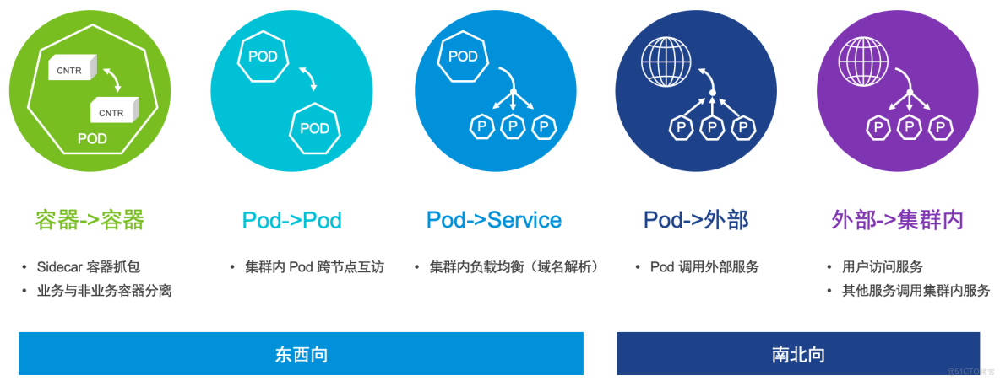
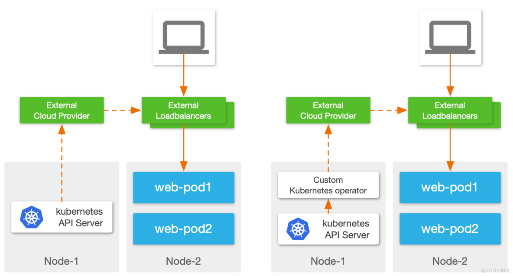
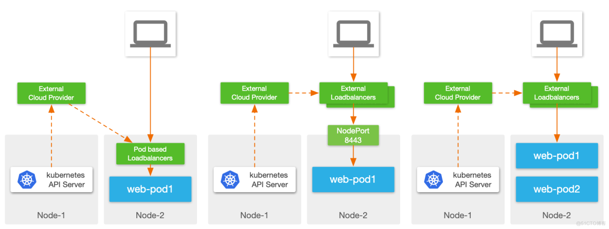
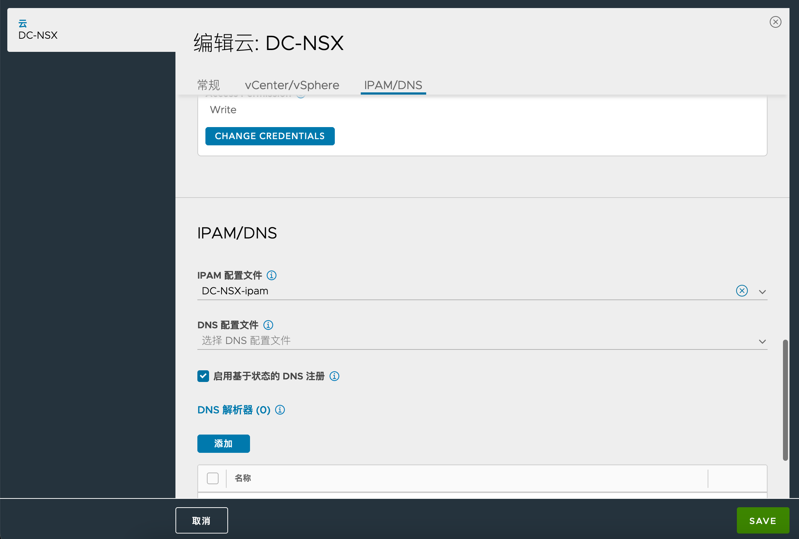

{: .no_toc}

## 目录

{: .no_toc .text-delta }


1. TOC
{:toc}

## 关于 Kubernetes 下的服务发布

与传统网络比，Kubernetes 下的网络设计高度模块化，且分散，大体来说容器环境中的网络分下面几部分：

- **容器网络置备**：为 Pod 分配 IP 地址，并连接到 Bridge 中，与其他位置互联互通；
- **东西向连接和访问控制**：控制不同 Pod 间的连接和访问控制，包含主机内不同 Pod 间和跨主机 Pod 间；
- **集群内容器到 Service 的访问**：Kubernetes 有种 ClusterIP 类型的 Service，它是 Kubernetes 中非常重要的对象，等同于传统环境下的 DNS 解析+负载均衡，集群内服务间的调用通常使用该 Service 来完成；
- **容器出向访问**：Pod 访问 Kubernetes 集群外的服务；
- **容器入向访问**：外部访问 Pod 提供的服务。

本文重点关注容器入向访问。



### 关于 Kubernetes 的 Service

Kubernetes 原生的资源对象中有一种 API 对象叫 Service，Service 类似于传统架构中的负载均衡服务，一般包含下列几个部分：

- 虚拟 IP：供用户(调用端)访问的 IP；
- 后端池：最终提供服务的节点集合，在 Kubernetes 下称作 Endpoints；
- 域名：虚拟 IP 对应的域名，在 Kubernetes 下名称是必选的，一般称为 Service Name。


Service 的类型很多，按照 Kubernetes 的[官方文档](https://kubernetes.io/docs/concepts/services-networking/service/)，概述如下：

- **ClusterIP**：默认的 Service 类型，该 Service **仅供集群内 Pod 访问**。每个服务发布后会有一个固定的 ClusterIP，其他 Pod 可以通过 Service 名称或者 ClusterIP 来访问到服务，其中 Service 名称到 ClusterIP 的域名解析通常由 CoreDNS 来完成；
- **NodePort**：将 Service 映射到 Kubernetes Worker 节点的某个端口上，对外提供服务。每个 NodePort 服务实际上也会创建 ClusterIP，所以实际上集群内的 Pod 也可以访问此服务；
- **LoadBalancer**：借助外部负载均衡器来实现 L4 服务的对外发布，Kubernetes 本身只提供接口，具体功能由第三方组件实现；
- **externalName**：将本 Service 映射到外部域名，通过 DNS CNAME 记录形式实现。

除此之外，Kubernetes 还有一种特殊的 Service 叫 Headless Service，其工作原理是不设置 ClusterIP（clusterIP 设置为 None），当用户访问该 Service 时，CoreDNS 直接返回 Pod 的 IP 地址。某些状态化服务例如 kafka 会使用这类 Service。


### 对外服务发布的几种方式

上一章节提到 Service Type NodePort 及 LoadBalancer 可以用于将 Kubernetes 服务发布到外部，除此之外还有一种方式叫 Ingress，我们将这三种常见的对外发布方式做一比较：

#### Service type NodePort

NodePort 的工作原理是，每发布一个 NodePort 服务，Kubernetes 会自动分配一个高位端口（比如 31432），每个 Worker 监听此端口，当接到外部的访问请求时，将流量通过 IPtables/IPVS 转发给相关的 Pod。


这是 Kubernetes 最简单的一种对外发布服务方式，一般集群装好 CNI 即可使用，但伴随着简单，其缺点就是功能过于单一：

- **无高可用性**：在 NodePort 下每个 Worker 节点均是独立的流量入口，Worker 之间不会提供高可用，一旦某个节点故障，需要用户自行修改访问 IP。这个缺点使得 NodePort 只适合于不在乎 SLA 的非生产环境中使用；
- **无主动监控**：不会像传统负载均衡器一样主动监控 Pod 运行状态，被动依赖 Kubernetes Pod Ready 状态来做故障切换。另外当出现 Worker 故障时，系统只能被动等待 Worker 连接状态超时后将相关 Pod 从服务池中踢出，这可能会造成分钟级别的服务降级；
- **端口数量限制**：每个 Worker 节点的可用端口数量有限，这使得集群最大 NodePort 数量受限；
- **流量不优化**：在 NodePort 下，访问并不会以最短的路径进入 Pod，存在流量跨节点横向穿越的问题，造成访问延迟增高；
- **无持久性**：没有策略保证来自于同一个用户的请求在一段时间内固定发给某个 Pod；
- **负载均衡策略缺失**：与传统负载均衡比，基本只提供 Round Robin 这一种负载均衡策略，难以满足应用的需求。

以上缺点中，高可用问题可以借助外部负载均衡器来解决，但其他问题无太好的办法。


#### Service type LoadBalancer

前面提到这类 Service Kubernetes 仅提供接口，具体实现要依靠第三方组件。开源社区里这类方案并不多，更多都是由企业级 ADC 或者 Public Cloud 的云负载来实现，VMware Avi 就是支持这类 Service 的一个企业级 ADC 产品。

Loadbalancer 的实现方面各个厂家的方案不尽一致，笔者尝试从大的层面来做下对比：

**控制面实现：**

- External Cloud Provider 直接与 Kubernetes 集群对接，监听 Kubernetes 资源对象变更事件：这种方式要求 Cloud Provider 本身支持与 Kubernetes 环境对接，兼容性和灵活性上略差；
- 使用 Operator 在集群内监听 Kubernetes 事件：Kubernetes 原生建议的对接方式，集群内 Operator 可以理解为 Kubernetes 与外部负载均衡器的桥梁，可以做 API 转换等工作，灵活性很强。



**数据面对比：**

- 在集群内部署 Pod 实现负载均衡服务：将 LB 数据面直接放在 Pod 中运行，这样的好处是 LB Pod 到业务 Pod 流量路径短，理论上也支持 ClusterIP 类型服务的实现。但缺点是复杂，需要考虑 Kubernetes 兼容性、网络如何暴露、资源争夺等诸多问题； 
- 外部负载均衡器+NodePort：一种云厂商使用较多的方式，这种实现可以理解为 NodePort 的优化，但继承了 NodePort 的诸多缺点；
- 外部负载均衡器直连 Pod：外部负载均衡器直接通过 Pod IP 访问 Pod，中间不会经过 NodePort，这种实现性能更优，而且流量路径更简化，便于排错，Avi 通常使用这种方式。



#### Ingress 

Ingress 用于将 HTTP/HTTPS 服务暴露到集群外部，可以认为是 Kubernetes 集群内的 L7 Service。在 Kubernetes 中 Ingress 也由外部组件实现，统称为 Ingress Controller。

相比 Service，Ingress 支持的访问规则则要多很多，可以基于域名+Path 进行请求负载，下面是一个基础的 Ingress 配置示例：


在配置层面，Ingress 对象需要挂在 Service (类型为 ClusterIP)前面，在数据层面，Ingress Controller 可以将请求发给 Pod，不经过 Service。


通常社区开源方案中，Ingress Controller 会以 Pod 形式部署在集群内，然后对外通过 NodePort 或者 Host-Port 发布，为了保证跨节点高可用性，在外部需要再加一个四层负载均衡器。


这种架构中使用了 NodePort，因此又继承了之前提到的 NodePort 的诸多缺点，那有没有更简化的方式呢？

答案就是 VMware 的 Avi：在 Avi 架构下，可以通过一套平台同时实现 LoadBalancer 服务和 Ingress 服务，且数据面都做到“极简”，不依赖 NodePort 等组件，实现 LB 一跳直达 Pod：


除了数据平面的简化，Avi 也支持常见的负载均衡算法、持久性、转发策略、安全策略等，为容器环境提供与传统环境等同的 ADC 功能。


## 通过 Avi 发布 Loadbalancer 类型的 Service

接着我们来讲下如何通过 Avi（NSX Advanced Loadbalancer）来实现 Loadbalancer 类型服务的发布。

### 关于 Avi Kubernetes Operator

关于 Avi 的产品说明本文不再赘述，有兴趣可以查看[之前的文章](https://blog.51cto.com/sparkgo/5479859)。

Avi 与 Kubernetes 集成时，有个核心的组件叫 Avi Kubernetes Operator，简称 AKO，如前文所述，AKO 实际上是个部署在 Kubernetes 集群内的 Operator，一方面监听 Kubernetes 内的各种服务/Pod 事件，另一方面去调度 Avi Controller，进行虚拟服务的创建。


这种架构可以很平滑地与已有环境进行集成，实现 VM、裸金属、容器多种平台的统一应用交付，简化负载均衡的管理，提供统一的可视化运维体验。

AKO 和普通的 Kubernetes 应用一样，使用主流的 Helm 安装。接下来我们看下如何部署和使用 AKO。

### 通过 Helm 部署 AKO

#### 部署前的 IP 规划和配置

在部署 AKO 前，需要合理进行 IP 地址规划，并在 Avi 控制器中配置好 IPAM（用于自动为虚拟服务分配 IP）。


本文使用前后端网络分离的架构（双臂模式），这种模式可以很好地隔离前端用户和后端服务（这部分介绍可以参考[之前的文章](https://blog.51cto.com/sparkgo/5479863)），具体规划如下：

- 后端网络：10.10.52.65~10.10.52.70

- 前端网络：172.16.101.150~172.16.101.200

在 Avi 控制器中设置后端网络的地址池：


在 Avi 控制器中设置前端网络的地址池：


配置 IPAM 配置文件，关联上面的前端网络地址池：


为 Cloud 关联 IPAM 配置文件：



#### 为集群准备 SE-Group

在 AKO 架构下，一个 Kubernetes 可以有一个或多个 SE-Group，这样能够灵活满足业务对于负载均衡器的可用性及资源隔离等需求。

例如：

- 核心业务：使用独立的 SE-Group，包含三个 SE 节点，每个 SE 节点预留 CPU 和内存，配置 2C 8G
- 其他业务：共享 SE-Group，包含五个 SE 节点，每个 SE 节点配置 1C 4G


本文配置了名为 antrea19 的 SE-Group，供 Kubernetes 集群使用，与其他虚拟化环境分开：


#### 为 AKO 创建命名空间

AKO 未来都会部署在一个名为 avi-system 的命名空间内，因此要提前创建好此 namespace：

```shell
kubectl create ns avi-system
```

#### 通过 Helm 安装 AKO

AKO 的 Helm charts 可以在 myvmware 中获取，或者通过 VMware 公开的 Helm 仓库获取（Helm 二进制可以在[此位置](https://github.com/helm/helm/releases)进行下载）：

```shell
helm repo add ako https://projects.registry.vmware.com/chartrepo/ako
helm repo list
helm pull ako/ako --version=1.10.1
# 通过 helm pull 完后，本地会出现一个名为 ako-1.10.1.tgz 的文件
```

解压 Helm charts 后，其目录大致如下：


通过下列命令来部署 AKO（部署参数与实际环境一致即可）：

```yaml
helm install ako ./ako --version 1.10.1 \
--set ControllerSettings.controllerHost=10.10.50.112 \
--set avicredentials.username=admin \
--set avicredentials.password=VMware1! \
--set ControllerSettings.controllerVersion="21.1.6" \
--set AKOSettings.clusterName=antrea19 \
--set AKOSettings.cniPlugin=antrea \
--set AKOSettings.disableStaticRouteSync=False \
--set ControllerSettings.cloudName=DC-NSX \
--set L4Settings.autoFQDN=disabled \
--set ControllerSettings.serviceEngineGroupName=antrea19 \
--set L7Settings.shardVSSize=DEDICATED  \
--set L7Settings.serviceType=ClusterIP  \
--set NetworkSettings.vipNetworkList[0].cidr="172.16.101.0/24" \
--set NetworkSettings.vipNetworkList[0].networkName="dvpg-VLAN101-tanzu-WLD1-172.16.101"  \
--set AKOSettings.logLevel=WARN \
--set AKOSettings.servicesAPI=False \
--namespace=avi-system
```

部署完成后检查 AKO pod 正常运行：


### 服务发布测试

接着部署下列 YAML，创建一个 LoadBalancer 类型的服务：

```yaml
apiVersion: apps/v1
kind: Deployment
metadata:
  labels:
    app: avi-demo
  name: avi-demo
spec:
  replicas: 2
  selector:
    matchLabels:
      app: avi-demo
  template:
    metadata:
      labels:
        app: avi-demo
    spec:
      containers:
      - name: avi-demo
        image: dyadin/avi-demo-nginx
        imagePullPolicy: IfNotPresent
        env:
        - name: hostinfo
          valueFrom:
            fieldRef:
              apiVersion: v1
              fieldPath: spec.nodeName
        ports:
        - containerPort: 80
          name: http
          protocol: TCP
---
# service.yaml
apiVersion: v1
kind: Service
metadata:
  name: avi-demo-test
spec:
  selector:
    app: avi-demo
  ports:
    - protocol: TCP
      port: 80
      targetPort: 80
  type: LoadBalancer
```

发布服务后，会观察到系统会自动为其分配 External-IP，这个 IP 在之前规划的前端网络 IP 范围内：


直接访问此 IP，发现可以正常访问：


### 后端发生了什么？

在 YAML 被部署到集群中后，AKO 会自动检测到这一事件，然后自动在 Avi 控制器中创建虚拟服务。

登陆 Avi 控制器，可以看到下列虚拟服务，其后端成员由 Pod 的真实 IP 组成：


我们可以通过`kubectl get ep`来确认：


通过 Avi 控制器可以看到详细的服务及 Pool 创建事件：


这个虚拟服务也会被放在之前专门置备的 SE-Group 中：


### 有没有高级点的功能？

熟悉负载均衡器的读者可能知道，应用的负载通常需要一些自定义配置，比如负载均衡算法、健康检查策略、持久性、日志记录和转发等，在 AKO 下，用户可以通过自定义 CRD 来调整这些高级参数。

配置示例如下：

```yaml
# loadbalancer-l4rule.yaml
apiVersion: ako.vmware.com/v1alpha2
kind: L4Rule
metadata:
  name: my-l4-rule
spec:
  analyticsProfileRef: custom-analytics
  analyticsPolicy:
    fullClientLogs:
      enabled: true
      duration: 0
      throttle: 20
  applicationProfileRef: Custom-L4-Application-Profile
  performanceLimits:
    maxConcurrentConnections: 105
    maxThroughput: 100
  backendProperties:
  - port: 80
    protocol: TCP
    enabled: true
    applicationPersistenceProfileRef: System-Persistence-Client-IP
    healthMonitorRefs:
    - System-Ping
    - System-TCP
    lbAlgorithm: LB_ALGORITHM_CONSISTENT_HASH
    lbAlgorithmHash: LB_ALGORITHM_CONSISTENT_HASH_SOURCE_IP_ADDRESS
```

应用上述 YAML 后，Avi 控制器会自动检查此 CRD 的配置是否合规，如果合规，则其状态会变为 Accepted，这种方式相比传统的通过 Annotation 来设置高级参数，可以很好地避免误配置，方便排错，同时一个 CRD 也可以多处复用。


接着编辑之前发布的 Service，为其设置下列 Annotation，调用上述 CRD：

```shell
kubectl edit svc avi-demo-test
```


配置完毕后，会观察到虚拟服务使用了自定义的可视化分析配置文件，并开启了非重要日志的记录：


相应地，Pool 使用了指定的负载均衡算法、持久性方式及健康检查方式：


接着我们多次访问该虚拟服务，可以看到日志中会有详细的请求记录（之前不会记录用户的正常请求，只会记录错误的请求）：


## 再发布个 Ingress 看看？

前面提到 Avi 也支持 Ingress 的发布，接着我们快速做个测试。

示例 YAML 如下：

```yaml
# avi-demo-ingress.yaml
apiVersion: apps/v1
kind: Deployment
metadata:
  labels:
    app: avi-demo-ingress
  name: avi-demo-ingress
  namespace: default
spec:
  replicas: 2
  selector:
    matchLabels:
      app: avi-demo-ingress
  template:
    metadata:
      labels:
        app: avi-demo-ingress
    spec:
      containers:
      - name: avi-demo-ingress
        image: dyadin/avi-demo
        imagePullPolicy: IfNotPresent
        env:
        - name: hostinfo
          valueFrom:
            fieldRef:
              apiVersion: v1
              fieldPath: spec.nodeName
        ports:
        - containerPort: 80
          name: http
          protocol: TCP
---
apiVersion: v1
kind: Service
metadata:
  name: avi-demo-svc
  labels:
    app: avi-demo-svc
spec:
  ports:
    - name: http
      port: 80
      protocol: TCP
      targetPort: 80
  selector:
    app: avi-demo-ingress
---
apiVersion: networking.k8s.io/v1
kind: Ingress
metadata:
  name: ako-demo-ingress
spec:
  ingressClassName: avi-lb
  rules:
    - host: avi-demo.ako.com
      http:
        paths:
        - path: /
          pathType: Prefix
          backend:
            service:
              name: avi-demo-svc
              port:
                number: 80
```

应用上述 YAML 后，可以看到 Ingress 顺利被创建：


我们直接访问该 Ingress 的 IP 地址（是的，Avi 下支持通过 IP 直接访问 Ingress），访问正常：


同样地，在 Avi 控制器中会看到下列虚拟服务：


---

本文到此结束，主要还是为了抛砖引玉，现在 Kubernetes 体系非常繁杂，每个功能都由不同组件实现时管理会变得异常复杂，这时候化繁为简可以有效降低平台的管理成本，管得过来了，才能更好服务于上层的业务，这大致就是 AKO 一直以来的目标。

