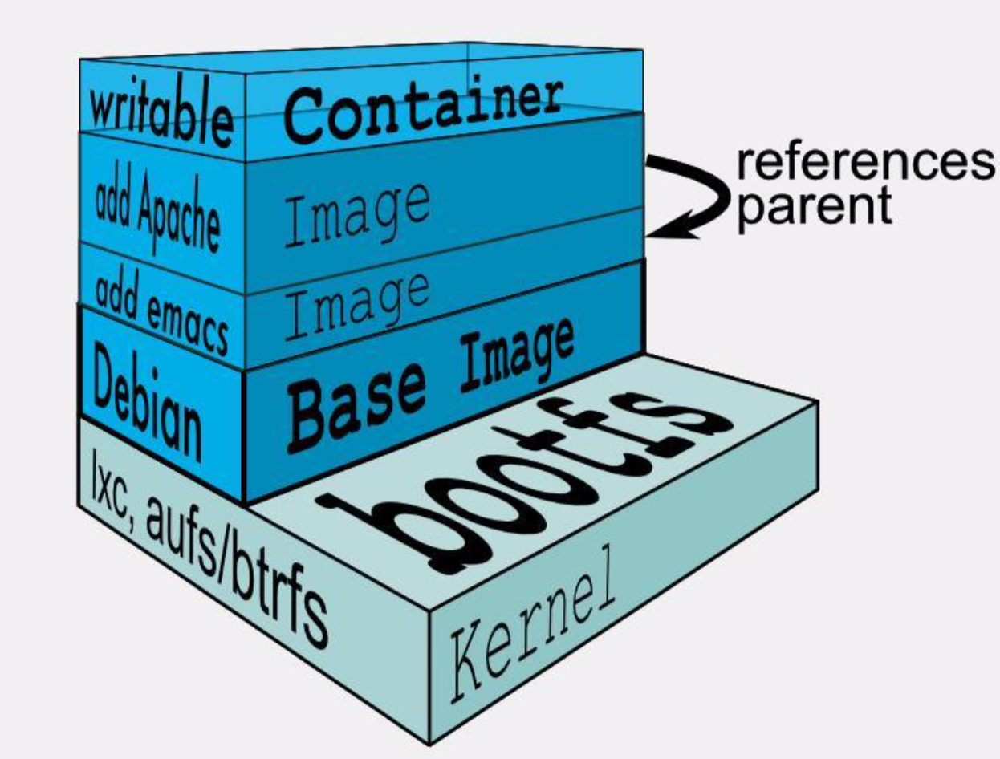
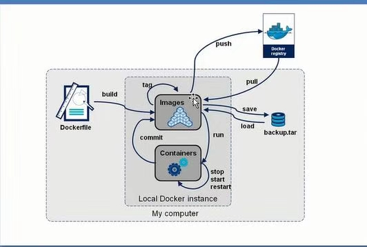
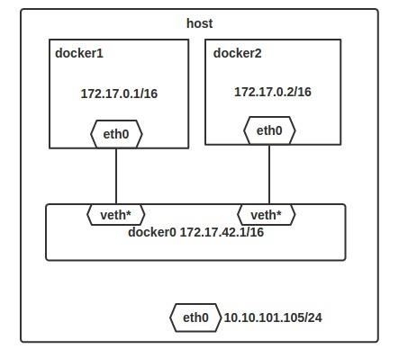
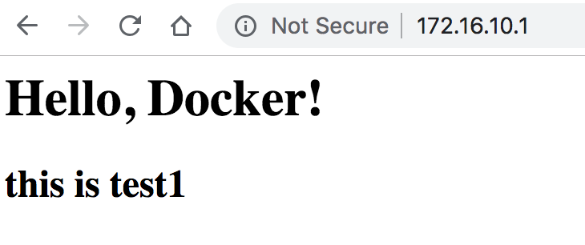
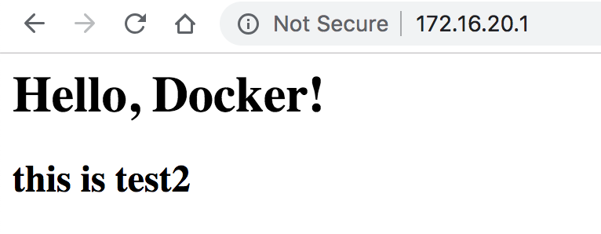

# Docker 常用命令
{: .no_toc}

## 目录

{: .no_toc .text-delta }


1. TOC
{:toc}

> 边学习边收集一些命令

# 基础概念

## Aufs

层状的文件系统，类似于 PS 的图层。

当一个进程需要修改一个文件时，AuFS 创建该文件的副本，这个过程称为 copy on write。

AuFS 允许Docker 把某些镜像作为容器的基础，例如 Centos 基础镜像。


AUFS 可以实现Docker的版本容器镜像能力。每个新版本都是与之前版本的简单差异改动。保持镜像文件最小化。

但同时也需要一个记录版本变动的审计追踪。


## APP打包



LXC基础上，提供统一的打包部署运行方案。

一个 Image 实际可能由多个layer组成，例如apache是由apache+依赖库的Image合并在一起。最上层有一个可写的空白的层。

## Docker Image

是个极度精简的Linux运行环境

Docker image 是需要定制化Build的安装包。由基础镜像+APP二进制包 组成

Docker image 内的配置文件不建议在上线后修改。

一般配置文件通过参数的方式传递到内部去。

Dockerfile 用来创建自定义的Image，包含用户自定义的软件依赖等

Docker image推荐重用和使用网上公开的基础镜像。

## Docker Container

是image的实例。

container里可以运行不同OS的image。

不建议使用SSH登录容器。

1.3版本之后增加了**docker exec**来进入容器


## 生命周期

Created

Running

Paused

Stopped

Killed


Container 只能在前台运行，因为一个命令结束后（后台一下子就结束了），container就执行完毕了。

## Docker Daemon

Container 的Linux守护进程。

Docker Daemon 可以绑定本地端口并提供Rest API 服务，用来远程访问和控制(K8S调用此接口)

## Docker Hub

Docker 的镜像库，公开的，但是是dotCloud私有的。


## 镜像制作

commit 将已有的容器制作成image，但是因为运行的容器会有很   多更改，导致commit制作的image不够精简。比较适合快速的验证。

Dockerfile，最标准的打包方法。


# 常用命令汇总

`docker run -rm -p 宿主机端口：应用端口 -e HOSTNAME=Ngnix-Server1 --name webserver nginx`

运行容器，名称为 webserver，使用 nginx image，设置环境变量Hostname、设置端口映射。

docker run 相当于创建并start此容器，建议在测试时加上`-rm` 参数，**在容器运行完毕后自动删除此容器**。

`docker ps -a` ，查看所有创建的容器

`docker ps` ，查看所有活动的容器


`docker exec -it webserver bash`

运行交互式命令 Bash


`docker  container ls`
查看所有容器


`docker stop webserver` 

关闭webserver 这个容器


`docker rm webserver`

删除此容器


`docker image list`

查看本地已经下载的 Image


安装 vim

`apt-get update`

`apt-get install vim`


`docker pull image名称`

在公开的hub中下载image

`docker search apache`

在公开的 registry 中搜索 image


创建 Dockerfile

```shell
mattz-a01:docker mattz$ cat Dockerfile

FROM nginx
COPY about.html /usr/share/nginx/html/index.html
#RUN echo '<h2>This is H2!</h2>' >> /usr/share/nginx/html/index.html
```
编译
```shell
docker build -t nginx:test1 .
```

# Image 相关

## 获取镜像

之前提到过，[Docker Hub](https://hub.docker.com/explore/) 上有大量的高质量的镜像可以用，这里我们就说一下怎么获取这些镜像。

从 Docker 镜像仓库获取镜像的命令是 `docker pull`。其命令格式为：

```shell
docker pull [选项] [Docker Registry 地址[:端口号]/]仓库名[:标签]
```

具体的选项可以通过 `docker pull --help` 命令看到，这里我们说一下镜像名称的格式。

- Docker 镜像仓库地址：地址的格式一般是 `<域名/IP>[:端口号]`。默认地址是 Docker Hub。
- 仓库名：如之前所说，这里的仓库名是两段式名称，即 `<用户名>/<软件名>`。对于 Docker Hub，如果不给出用户名，则默认为 `library`，也就是官方镜像。

比如：

```shell
$ docker pull ubuntu:16.04
16.04: Pulling from library/ubuntu
bf5d46315322: Pull complete
9f13e0ac480c: Pull complete
e8988b5b3097: Pull complete
40af181810e7: Pull complete
e6f7c7e5c03e: Pull complete
Digest: sha256:147913621d9cdea08853f6ba9116c2e27a3ceffecf3b492983ae97c3d643fbbe
Status: Downloaded newer image for ubuntu:16.04

```

上面的命令中没有给出 Docker 镜像仓库地址，因此将会从 Docker Hub 获取镜像。而镜像名称是 `ubuntu:16.04`，因此将会获取官方镜像 `library/ubuntu` 仓库中标签为 `16.04` 的镜像。

从下载过程中可以看到我们之前提及的分层存储的概念，**镜像是由多层存储所构成。下载也是一层层的去下载**，并非单一文件。下载过程中给出了每一层的 ID 的前 12 位。并且下载结束后，给出该镜像完整的 `sha256` 的摘要，以确保下载一致性。

在使用上面命令的时候，你可能会发现，你所看到的层 ID 以及 `sha256` 的摘要和这里的不一样。这是因为官方镜像是一直在维护的，有任何新的 bug，或者版本更新，都会进行修复再以原来的标签发布，这样可以确保任何使用这个标签的用户可以获得更安全、更稳定的镜像。


## 列举镜像

要想列出已经下载下来的镜像，可以使用 `docker image ls` 命令。

```shell
$ docker image ls
REPOSITORY           TAG                 IMAGE ID            CREATED             SIZE
redis                latest              5f515359c7f8        5 days ago          183 MB
nginx                latest              05a60462f8ba        5 days ago          181 MB
mongo                3.2                 fe9198c04d62        5 days ago          342 MB
<none>               <none>              00285df0df87        5 days ago          342 MB
ubuntu               16.04               f753707788c5        4 weeks ago         127 MB
ubuntu               latest              f753707788c5        4 weeks ago         127 MB
ubuntu               14.04               1e0c3dd64ccd        4 weeks ago         188 MB

```

列表包含了 `仓库名`、`标签`、`镜像 ID`、`创建时间` 以及 `所占用的空间`。

其中仓库名、标签在之前的基础概念章节已经介绍过了。**镜像 ID** 则是镜像的唯一标识，一个镜像可以对应多个**标签**。因此，在上面的例子中，我们可以看到 `ubuntu:16.04` 和 `ubuntu:latest` 拥有相同的 ID，因为它们对应的是同一个镜像。


### 镜像体积

如果仔细观察，会注意到，这里标识的所占用空间和在 Docker Hub 上看到的镜像大小不同。比如，`ubuntu:16.04` 镜像大小，在这里是 `127 MB`，但是在 [Docker Hub](https://hub.docker.com/r/library/ubuntu/tags/) 显示的却是 `50 MB`。这是因为 Docker Hub 中显示的体积是压缩后的体积。在镜像下载和上传过程中镜像是保持着压缩状态的，因此 Docker Hub 所显示的大小是网络传输中更关心的流量大小。而 `docker image ls` 显示的是镜像下载到本地后，展开的大小，准确说，是展开后的各层所占空间的总和，因为镜像到本地后，查看空间的时候，更关心的是本地磁盘空间占用的大小。

另外一个需要注意的问题是，`docker image ls` 列表中的镜像体积总和并非是所有镜像实际硬盘消耗。由于 Docker 镜像是多层存储结构，并且可以继承、复用，因此不同镜像可能会因为使用相同的基础镜像，从而拥有共同的层。由于 Docker 使用 Union FS，相同的层只需要保存一份即可，因此实际镜像硬盘占用空间很可能要比这个列表镜像大小的总和要小的多。

你可以通过以下命令来便捷的查看镜像、容器、数据卷所占用的空间。

```shell
$ docker system df

TYPE                TOTAL               ACTIVE              SIZE                RECLAIMABLE
Images              24                  0                   1.992GB             1.992GB (100%)
Containers          1                   0                   62.82MB             62.82MB (100%)
Local Volumes       9                   0                   652.2MB             652.2MB (100%)
Build Cache                                                 0B                  0B
```

## 删除本地镜像

如果要删除本地的镜像，可以使用 `docker image rm` 命令，其格式为：

```shell
$ docker image rm [选项] <镜像1> [<镜像2> ...]
```


### 用 ID、镜像名、摘要删除镜像

其中，`<镜像>` 可以是 `镜像短 ID`、`镜像长 ID`、`镜像名` 或者 `镜像摘要`。

比如我们有这么一些镜像：

```shell
$ docker image ls
REPOSITORY                  TAG                 IMAGE ID            CREATED             SIZE
centos                      latest              0584b3d2cf6d        3 weeks ago         196.5 MB
redis                       alpine              501ad78535f0        3 weeks ago         21.03 MB
docker                      latest              cf693ec9b5c7        3 weeks ago         105.1 MB
nginx                       latest              e43d811ce2f4        5 weeks ago         181.5 MB

```

我们可以用镜像的完整 ID，也称为 `长 ID`，来删除镜像。使用脚本的时候可能会用长 ID，但是人工输入就太累了，所以更多的时候是用 `短 ID` 来删除镜像。`docker image ls` 默认列出的就已经是短 ID 了，一般取前3个字符以上，只要足够区分于别的镜像就可以了。

比如这里，如果我们要删除 `redis:alpine` 镜像，可以执行：

```shell
$ docker image rm 501
Untagged: redis:alpine
Untagged: redis@sha256:f1ed3708f538b537eb9c2a7dd50dc90a706f7debd7e1196c9264edeea521a86d
Deleted: sha256:501ad78535f015d88872e13fa87a828425117e3d28075d0c117932b05bf189b7
Deleted: sha256:96167737e29ca8e9d74982ef2a0dda76ed7b430da55e321c071f0dbff8c2899b
Deleted: sha256:32770d1dcf835f192cafd6b9263b7b597a1778a403a109e2cc2ee866f74adf23
Deleted: sha256:127227698ad74a5846ff5153475e03439d96d4b1c7f2a449c7a826ef74a2d2fa
Deleted: sha256:1333ecc582459bac54e1437335c0816bc17634e131ea0cc48daa27d32c75eab3
Deleted: sha256:4fc455b921edf9c4aea207c51ab39b10b06540c8b4825ba57b3feed1668fa7c7
```

我们也可以用`镜像名`，也就是 `<仓库名>:<标签>`，来删除镜像。

```shell
$ docker image rm centos
Untagged: centos:latest
Untagged: centos@sha256:b2f9d1c0ff5f87a4743104d099a3d561002ac500db1b9bfa02a783a46e0d366c
Deleted: sha256:0584b3d2cf6d235ee310cf14b54667d889887b838d3f3d3033acd70fc3c48b8a
Deleted: sha256:97ca462ad9eeae25941546209454496e1d66749d53dfa2ee32bf1faabd239d38

```

当然，更精确的是使用 `镜像摘要` 删除镜像。

```shell
$ docker image ls --digests
REPOSITORY                  TAG                 DIGEST                                                                    IMAGE ID            CREATED             SIZE
node                        slim                sha256:b4f0e0bdeb578043c1ea6862f0d40cc4afe32a4a582f3be235a3b164422be228   6e0c4c8e3913        3 weeks ago         214 MB

$ docker image rm node@sha256:b4f0e0bdeb578043c1ea6862f0d40cc4afe32a4a582f3be235a3b164422be228
Untagged: node@sha256:b4f0e0bdeb578043c1ea6862f0d40cc4afe32a4a582f3be235a3b164422be228
```


## Docker commit

在创建了一个nginx服务器后

现在，假设我们非常不喜欢这个欢迎页面，我们希望改成欢迎 Docker 的文字，我们可以使用 `docker exec` 命令进入容器，修改其内容。

```bash
$ docker exec -it webserver bash
root@3729b97e8226:/# echo '<h1>Hello, Docker!</h1>' > /usr/share/nginx/html/index.html
root@3729b97e8226:/# exit
exit
```


我们修改了容器的文件，也就是改动了容器的存储层。我们可以通过 `docker diff` 命令看到具体的改动。

```bash
$ docker diff webserver
C /root
A /root/.bash_history
C /run
C /usr
C /usr/share
C /usr/share/nginx
C /usr/share/nginx/html
C /usr/share/nginx/html/index.html
C /var
C /var/cache
C /var/cache/nginx
A /var/cache/nginx/client_temp
A /var/cache/nginx/fastcgi_temp
A /var/cache/nginx/proxy_temp
A /var/cache/nginx/scgi_temp
A /var/cache/nginx/uwsgi_temp
```

现在我们定制好了变化，我们希望能将其保存下来形成镜像。

要知道，当我们运行一个容器的时候（如果不使用卷的话），我们做的任何文件修改都会被记录于容器存储层里。而 Docker 提供了一个 `docker commit` 命令，可以将容器的存储层保存下来成为镜像。换句话说，就是在原有镜像的基础上，再叠加上容器的存储层，并构成新的镜像。以后我们运行这个新镜像的时候，就会拥有原有容器最后的文件变化。

`docker commit` 的语法格式为：

```bash
docker commit [选项] <容器ID或容器名> [<仓库名>[:<标签>]]
```

我们可以用下面的命令将容器保存为镜像：

```bash
$ docker commit \
    --author "Tao Wang <twang2218@gmail.com>" \
    --message "修改了默认网页" \
    webserver \
    nginx:v2
sha256:07e33465974800ce65751acc279adc6ed2dc5ed4e0838f8b86f0c87aa1795214
```

其中 `--author` 是指定修改的作者，而 `--message` 则是记录本次修改的内容。这点和 `git` 版本控制相似，不过这里这些信息可以省略留空。

我们可以在 `docker image ls` 中看到这个新定制的镜像：

```bash
$ docker image ls nginx
REPOSITORY          TAG                 IMAGE ID            CREATED             SIZE
nginx               v2                  07e334659748        9 seconds ago       181.5 MB
nginx               1.11                05a60462f8ba        12 days ago         181.5 MB
nginx               latest              e43d811ce2f4        4 weeks ago         181.5 MB
```

我们还可以用 `docker history` 具体查看镜像内的历史记录，如果比较 `nginx:latest` 的历史记录，我们会发现新增了我们刚刚提交的这一层。

```bash
$ docker history nginx:v2
IMAGE               CREATED             CREATED BY                                      SIZE                COMMENT
07e334659748        54 seconds ago      nginx -g daemon off;                            95 B                修改了默认网页
e43d811ce2f4        4 weeks ago         /bin/sh -c #(nop)  CMD ["nginx" "-g" "daemon    0 B
<missing>           4 weeks ago         /bin/sh -c #(nop)  EXPOSE 443/tcp 80/tcp        0 B
<missing>           4 weeks ago         /bin/sh -c ln -sf /dev/stdout /var/log/nginx/   22 B
<missing>           4 weeks ago         /bin/sh -c apt-key adv --keyserver hkp://pgp.   58.46 MB
<missing>           4 weeks ago         /bin/sh -c #(nop)  ENV NGINX_VERSION=1.11.5-1   0 B
<missing>           4 weeks ago         /bin/sh -c #(nop)  MAINTAINER NGINX Docker Ma   0 B
<missing>           4 weeks ago         /bin/sh -c #(nop)  CMD ["/bin/bash"]            0 B
<missing>           4 weeks ago         /bin/sh -c #(nop) ADD file:23aa4f893e3288698c   123 MB
```

新的镜像定制好后，我们可以来运行这个镜像。

```bash
docker run --name web2 -d -p 81:80 nginx:v2
```

这里我们命名为新的服务为 `web2`，并且映射到 `81` 端口。如果是 Docker for Mac/Windows 或 Linux 桌面的话，我们就可以直接访问 [http://localhost:81](http://localhost:81/) 看到结果，其内容应该和之前修改后的 `webserver`一样。

至此，我们第一次完成了定制镜像，使用的是 `docker commit` 命令，手动操作给旧的镜像添加了新的一层，形成新的镜像，对镜像多层存储应该有了更直观的感觉。

#### 慎用 `docker commit`

使用 `docker commit` 命令虽然可以比较直观的帮助理解镜像分层存储的概念，但是实际环境中并不会这样使用。

首先，如果仔细观察之前的 `docker diff webserver` 的结果，你会发现除了真正想要修改的 `/usr/share/nginx/html/index.html` 文件外，由于命令的执行，还有很多文件被改动或添加了。这还仅仅是最简单的操作，如果是安装软件包、编译构建，那会有大量的无关内容被添加进来，如果不小心清理，将会导致镜像极为臃肿。

此外，使用 `docker commit` 意味着所有对镜像的操作都是黑箱操作，生成的镜像也被称为**黑箱镜像**，换句话说，就是除了制作镜像的人知道执行过什么命令、怎么生成的镜像，别人根本无从得知。而且，即使是这个制作镜像的人，过一段时间后也无法记清具体在操作的。虽然 `docker diff` 或许可以告诉得到一些线索，但是远远不到可以确保生成一致镜像的地步。这种黑箱镜像的维护工作是非常痛苦的。

而且，回顾之前提及的镜像所使用的分层存储的概念，除当前层外，之前的每一层都是不会发生改变的，换句话说，任何修改的结果仅仅是在当前层进行标记、添加、修改，而不会改动上一层。如果使用 `docker commit` 制作镜像，以及后期修改的话，每一次修改都会让镜像更加臃肿一次，所删除的上一层的东西并不会丢失，会一直如影随形的跟着这个镜像，即使根本无法访问到。这会让镜像更加臃肿。

## dockerfile

在一个空白目录中，建立一个文本文件，并命名为 `Dockerfile`：

```bash
$ mkdir mynginx
$ cd mynginx
$ touch Dockerfile
```

其内容为：

```dockerfile
FROM nginx:v100
RUN echo '<h1>Hello, Docker!</h1>' > /usr/share/nginx/html/index.html
```

这个 Dockerfile 很简单，一共就两行。涉及到了两条指令，`FROM` 和 `RUN`。


### FROM 指定基础镜像

所谓定制镜像，那一定是以一个镜像为基础，在其上进行定制。就像我们之前运行了一个 `nginx` 镜像的容器，再进行修改一样，基础镜像是必须指定的。而 `FROM` 就是指定**基础镜像**，因此一个 `Dockerfile`中 `FROM` 是必备的指令，并且必须是第一条指令。

在 [Docker Hub](https://hub.docker.com/search?q=&type=image&image_filter=official) 上有非常多的高质量的官方镜像，有可以直接拿来使用的服务类的镜像，如 [`nginx`](https://hub.docker.com/_/nginx/)、[`redis`](https://hub.docker.com/_/redis/)、[`mongo`](https://hub.docker.com/_/mongo/)、[`mysql`](https://hub.docker.com/_/mysql/)、[`httpd`](https://hub.docker.com/_/httpd/)、[`php`](https://hub.docker.com/_/php/)、[`tomcat`](https://hub.docker.com/_/tomcat/) 等；也有一些方便开发、构建、运行各种语言应用的镜像，如 [`node`](https://hub.docker.com/_/node)、[`openjdk`](https://hub.docker.com/_/openjdk/)、[`python`](https://hub.docker.com/_/python/)、[`ruby`](https://hub.docker.com/_/ruby/)、[`golang`](https://hub.docker.com/_/golang/) 等。可以在其中寻找一个最符合我们最终目标的镜像为基础镜像进行定制。

如果没有找到对应服务的镜像，官方镜像中还提供了一些更为基础的操作系统镜像，如 [`ubuntu`](https://hub.docker.com/_/ubuntu/)、[`debian`](https://hub.docker.com/_/debian/)、[`centos`](https://hub.docker.com/_/centos/)、[`fedora`](https://hub.docker.com/_/fedora/)、[`alpine`](https://hub.docker.com/_/alpine/) 等，这些操作系统的软件库为我们提供了更广阔的扩展空间。

除了选择现有镜像为基础镜像外，Docker 还存在一个特殊的镜像，名为 `scratch`。这个镜像是虚拟的概念，并不实际存在，它表示一个空白的镜像。

```dockerfile
FROM scratch
...
```

如果你以 `scratch` 为基础镜像的话，意味着你不以任何镜像为基础，接下来所写的指令将作为镜像第一层开始存在。

### RUN 执行命令

`RUN` 指令是用来执行命令行命令的。由于命令行的强大能力，`RUN` 指令在定制镜像时是最常用的指令之一。其格式有两种：


- *shell* 格式：`RUN <命令>`，就像直接在命令行中输入的命令一样。刚才写的 Dockerfile 中的 `RUN` 指令就是这种格式。

```Dockerfile
RUN echo '<h1>Hello, Docker!</h1>' > /usr/share/nginx/html/index.html
```

- *exec* 格式：`RUN ["可执行文件", "参数1", "参数2"]`，这更像是函数调用中的格式。

既然 `RUN` 就像 Shell 脚本一样可以执行命令，那么我们是否就可以像 Shell 脚本一样把每个命令对应一个 RUN 呢？比如这样：

```dockerfile
FROM debian:stretch

RUN apt-get update
RUN apt-get install -y gcc libc6-dev make wget
RUN wget -O redis.tar.gz "http://download.redis.io/releases/redis-5.0.3.tar.gz"
RUN mkdir -p /usr/src/redis
RUN tar -xzf redis.tar.gz -C /usr/src/redis --strip-components=1
RUN make -C /usr/src/redis
RUN make -C /usr/src/redis install
```

之前说过，Dockerfile 中每一个指令都会建立一层，`RUN` 也不例外。每一个 `RUN` 的行为，就和刚才我们手工建立镜像的过程一样：新建立一层，在其上执行这些命令，执行结束后，`commit` 这一层的修改，构成新的镜像。

而上面的这种写法，创建了 7 层镜像。这是完全没有意义的，而且很多运行时不需要的东西，都被装进了镜像里，比如编译环境、更新的软件包等等。结果就是产生非常臃肿、非常多层的镜像，不仅仅增加了构建部署的时间，也很容易出错。 这是很多初学 Docker 的人常犯的一个错误。

*Union FS 是有最大层数限制的，比如 AUFS，曾经是最大不得超过 42 层，现在是不得超过 127 层。*

上面的 `Dockerfile` 正确的写法应该是这样：

```dockerfile
FROM debian:stretch

RUN buildDeps='gcc libc6-dev make wget' \
    && apt-get update \
    && apt-get install -y $buildDeps \
    && wget -O redis.tar.gz "http://download.redis.io/releases/redis-5.0.3.tar.gz" \
    && mkdir -p /usr/src/redis \
    && tar -xzf redis.tar.gz -C /usr/src/redis --strip-components=1 \
    && make -C /usr/src/redis \
    && make -C /usr/src/redis install \
    && rm -rf /var/lib/apt/lists/* \
    && rm redis.tar.gz \
    && rm -r /usr/src/redis \
    && apt-get clean
    && rm -rf /var/lib/apt/lists/*
```

首先，之前所有的命令只有一个目的，就是编译、安装 redis 可执行文件。因此没有必要建立很多层，这只是一层的事情。因此，这里没有使用很多个 `RUN` 对一一对应不同的命令，而是仅仅使用一个 `RUN` 指令，并使用 `&&` 将各个所需命令串联起来。将之前的 7 层，简化为了 1 层。在撰写 Dockerfile 的时候，要经常提醒自己，这并不是在写 Shell 脚本，**而是在定义每一层该如何构建**。

并且，这里为了格式化还进行了换行。Dockerfile 支持 Shell 类的行尾添加 `\` 的命令换行方式，以及行首 `#` 进行注释的格式。良好的格式，比如换行、缩进、注释等，会让维护、排障更为容易，这是一个比较好的习惯。

此外，还可以看到这一组命令的最后添加了清理工作的命令，删除了为了编译构建所需要的软件，清理了所有下载、展开的文件，并且还清理了 `apt` 缓存文件。这是很重要的一步，我们之前说过，镜像是多层存储，每一层的东西并不会在下一层被删除，会一直跟随着镜像。**因此镜像构建时，一定要确保每一层只添加真正需要添加的东西，任何无关的东西都应该清理掉**。

很多人初学 Docker 制作出了很臃肿的镜像的原因之一，就是忘记了每一层构建的最后一定要清理掉无关文件。

### 构建镜像

好了，让我们再回到之前定制的 nginx 镜像的 Dockerfile 来。现在我们明白了这个 Dockerfile 的内容，那么让我们来构建这个镜像吧。

在 `Dockerfile` 文件所在目录执行：

```bash
$ docker build -t nginx:v3 .
Sending build context to Docker daemon 2.048 kB
Step 1 : FROM nginx
 ---> e43d811ce2f4
Step 2 : RUN echo '<h1>Hello, Docker!</h1>' > /usr/share/nginx/html/index.html
 ---> Running in 9cdc27646c7b
 ---> 44aa4490ce2c
Removing intermediate container 9cdc27646c7b
Successfully built 44aa4490ce2c
```

从命令的输出结果中，我们可以清晰的看到镜像的构建过程。在 `Step 2` 中，如同我们之前所说的那样，`RUN` 指令启动了一个容器 `9cdc27646c7b`，执行了所要求的命令，并最后提交了这一层 `44aa4490ce2c`，随后删除了所用到的这个容器 `9cdc27646c7b`。

这里我们使用了 `docker build` 命令进行镜像构建。其格式为：

```bash
docker build [选项] <上下文路径/URL/->
```

在这里我们指定了最终镜像的名称 `-t nginx:v3`，构建成功后，我们可以像之前运行 `nginx:v2` 那样来运行这个镜像，其结果会和 `nginx:v2` 一样。

### 镜像构建上下文（Context）

如果注意，会看到 `docker build` 命令最后有一个 `.`。`.` 表示当前目录，而 `Dockerfile` 就在当前目录，因此不少初学者以为这个路径是在指定 `Dockerfile` 所在路径，这么理解其实是不准确的。如果对应上面的命令格式，你可能会发现，这是在指定**上下文路径**。那么什么是上下文呢？

首先我们要理解 `docker build` 的工作原理。Docker 在运行时分为 Docker 引擎（也就是服务端守护进程）和客户端工具。Docker 的引擎提供了一组 REST API，被称为 [Docker Remote API](https://docs.docker.com/develop/sdk/)，而如 `docker`命令这样的客户端工具，则是通过这组 API 与 Docker 引擎交互，从而完成各种功能。因此，虽然表面上我们好像是在本机执行各种 `docker` 功能，但实际上，一切都是使用的远程调用形式在服务端（Docker 引擎）完成。也因为这种 C/S 设计，让我们操作远程服务器的 Docker 引擎变得轻而易举。

当我们进行镜像构建的时候，并非所有定制都会通过 `RUN` 指令完成，经常会需要将一些本地文件复制进镜像，比如通过 `COPY` 指令、`ADD`指令等。而 `docker build` 命令构建镜像，其实并非在本地构建，而是在服务端，也就是 Docker 引擎中构建的。那么在这种客户端/服务端的架构中，如何才能让服务端获得本地文件呢？

这就引入了上下文的概念。当构建的时候，用户会指定构建镜像上下文的路径，`docker build` 命令得知这个路径后，会将路径下的所有内容打包，然后上传给 Docker 引擎。这样 Docker 引擎收到这个上下文包后，展开就会获得构建镜像所需的一切文件。

如果在 `Dockerfile` 中这么写：

```Dockerfile
COPY ./package.json /app/
ADD ./package.json /app/
```

这并不是要复制执行 `docker build` 命令所在的目录下的 `package.json`，也不是复制 `Dockerfile`所在目录下的 `package.json`，而是复制 **上下文（context）** 目录下的 `package.json`。

因此，`COPY` 这类指令中的源文件的路径都是*相对路径*。这也是初学者经常会问的为什么 `COPY ../package.json /app` 或者 `COPY /opt/xxxx /app` 无法工作的原因，因为这些路径已经超出了上下文的范围，Docker 引擎无法获得这些位置的文件。如果真的需要那些文件，应该将它们复制到上下文目录中去。

现在就可以理解刚才的命令 `docker build -t nginx:v3 .` 中的这个 `.`，实际上是在指定上下文的目录，`docker build` 命令会将该目录下的内容打包交给 Docker 引擎以帮助构建镜像。

如果观察 `docker build` 输出，我们其实已经看到了这个发送上下文的过程：

```bash
$ docker build -t nginx:v3 .
Sending build context to Docker daemon 2.048 kB
...
```

理解构建上下文对于镜像构建是很重要的，避免犯一些不应该的错误。比如有些初学者在发现 `COPY /opt/xxxx /app` 不工作后，于是干脆将 `Dockerfile` 放到了硬盘根目录去构建，结果发现 `docker build` 执行后，在发送一个几十 GB 的东西，极为缓慢而且很容易构建失败。那是因为这种做法是在让 `docker build` 打包整个硬盘，这显然是使用错误。

一般来说，应该会将 `Dockerfile` 置于一个空目录下，或者项目根目录下。如果该目录下没有所需文件，那么应该把所需文件复制一份过来。如果目录下有些东西确实不希望构建时传给 Docker 引擎，那么可以用 `.gitignore` 一样的语法写一个 `.dockerignore`，该文件是用于剔除不需要作为上下文传递给 Docker 引擎的。

那么为什么会有人误以为 `.` 是指定 `Dockerfile` 所在目录呢？这是因为在默认情况下，如果不额外指定 `Dockerfile` 的话，会将上下文目录下的名为 `Dockerfile` 的文件作为 Dockerfile。

这只是默认行为，实际上 `Dockerfile` 的文件名并不要求必须为 `Dockerfile`，而且并不要求必须位于上下文目录中，比如可以用 `-f ../Dockerfile.php` 参数指定某个文件作为 `Dockerfile`。

当然，一般大家习惯性的会使用默认的文件名 `Dockerfile`，以及会将其置于镜像构建上下文目录中。

### 其它 `docker build` 的用法

#### 直接用 Git repo 进行构建

或许你已经注意到了，`docker build` 还支持从 URL 构建，比如可以直接从 Git repo 中构建：

```bash
$ docker build https://github.com/twang2218/gitlab-ce-zh.git#:11.1

Sending build context to Docker daemon 2.048 kB
Step 1 : FROM gitlab/gitlab-ce:11.1.0-ce.0
11.1.0-ce.0: Pulling from gitlab/gitlab-ce
aed15891ba52: Already exists
773ae8583d14: Already exists
...
```

这行命令指定了构建所需的 Git repo，并且指定默认的 `master` 分支，构建目录为 `/11.1/`，然后 Docker 就会自己去 `git clone` 这个项目、切换到指定分支、并进入到指定目录后开始构建。

#### 用给定的 tar 压缩包构建

```bash
$ docker build http://server/context.tar.gz
```

如果所给出的 URL 不是个 Git repo，而是个 `tar` 压缩包，那么 Docker 引擎会下载这个包，并自动解压缩，以其作为上下文，开始构建。

#### 从标准输入中读取 Dockerfile 进行构建

```bash
docker build - < Dockerfile
```

或

```bash
cat Dockerfile | docker build -
```

如果标准输入传入的是文本文件，则将其视为 `Dockerfile`，并开始构建。这种形式由于直接从标准输入中读取 Dockerfile 的内容，它没有上下文，因此不可以像其他方法那样可以将本地文件 `COPY` 进镜像之类的事情。

#### 从标准输入中读取上下文压缩包进行构建

```bash
$ docker build - < context.tar.gz
```

如果发现标准输入的文件格式是 `gzip`、`bzip2` 以及 `xz` 的话，将会使其为上下文压缩包，直接将其展开，将里面视为上下文，并开始构建。


#### 添加HTTP代理

在 Dockerfile 中新增一行，ENV

ENV http_proxy=http://XXX.XXX.XXX

RUN curl http://www.baidu.com


### 一个Dockerfile 的案例

```
FROM ubuntu
MAINTAINER yongboy "yongboy@gmail.com"
#更新源，安装ssh server
RUN echo "deb http://archive.ubuntu.com/ubuntu precise main universe"> /etc/apt/sources.list
RUN apt-get update
RUN apt-get install -y openssh-server
RUN mkdir -p /var/run/sshd
# 设置root ssh远程登录密码为123456
RUN echo "root:123456" | chpasswd
# 添加orache java7源，一次性安装vim，wget，curl，java7，tomcat7等必备软件
RUN apt-get install python-software-properties
RUN add-apt-repository ppa:webupd8team/java
RUN apt-get update
RUN apt-get install -y vim wget curl oracle-java7-installer tomcat7

# 设置JAVA_HOME环境变量
RUN update-alternatives --display java
RUN echo "JAVA_HOME=/usr/lib/jvm/java-7-oracle">> /etc/environment RUN echo "JAVA_HOME=/usr/lib/jvm/java-7-oracle">> /etc/default/tomcat7
# 容器需要开放SSH 22端口 
EXPOSE 22
# 容器需要开放Tomcat 8080端口 
EXPOSE 8080
# 设置Tomcat7初始化运行，SSH终端服务器作为后台运行 
ENTRYPOINT service tomcat7 start && /usr/sbin/sshd -D

```


# 创建、运行容器



### run 运行

`docker run  [OPTIONS]  IMAGE[:TAG] [COMMAND] [ARG…]`

run 表示**创建并启动**一个容器。

有了镜像后，我们就能够以这个镜像为基础启动并运行一个容器。以上面的 `ubuntu:16.04` 为例，如果我们打算启动里面的 `bash` 并且进行交互式操作的话，可以执行下面的命令。

```
$ docker run -it --rm \
    ubuntu:16.04 \
    bash

root@e7009c6ce357:/# cat /etc/os-release
NAME="Ubuntu"
VERSION="16.04.4 LTS, Trusty Tahr"
ID=ubuntu
ID_LIKE=debian
PRETTY_NAME="Ubuntu 16.04.4 LTS"
VERSION_ID="16.04"
HOME_URL="http://www.ubuntu.com/"
SUPPORT_URL="http://help.ubuntu.com/"
BUG_REPORT_URL="http://bugs.launchpad.net/ubuntu/"

```

`docker run` 就是运行容器的命令，具体格式我们会在 [容器](https://yeasy.gitbooks.io/docker_practice/content/container) 一节进行详细讲解，我们这里简要的说明一下上面用到的参数。

- `-it`：这是两个参数，一个是 `-i`：交互式操作，一个是 `-t` 终端。我们这里打算进入 `bash` 执行一些命令并查看返回结果，因此我们需要交互式终端。
- `--rm`：这个参数是说容器退出后随之将其删除。默认情况下，为了排障需求，退出的容器并不会立即删除，除非手动 `docker rm`。我们这里只是随便执行个命令，看看结果，不需要排障和保留结果，因此使用 `--rm` 可以避免浪费空间。
- `ubuntu:16.04`：这是指用 `ubuntu:16.04` 镜像为基础来启动容器。
- `bash`：放在镜像名后的是**命令**，这里我们希望有个交互式 Shell，因此用的是 `bash`。
- `-d` ： 放在后台执行
- `--name=centos-test1`：如果不指定名称，则会随机生成一个UUID，并不适合管理

进入容器后，我们可以在 Shell 下操作，执行任何所需的命令。这里，我们执行了 `cat /etc/os-release`，这是 Linux 常用的查看当前系统版本的命令，从返回的结果可以看到容器内是 `Ubuntu 16.04.4 LTS` 系统。

最后我们通过 `exit` 退出了这个容器。

### create、start、pause、unpause

使用 run 运行容器后，如果exit，则容器就终止了，docker ps -all 可以看到这个容器处于退出状态。

如果要运行，可以用 `docker start centos-test1` 来运行。

一般常见的方法是先创建，然后start

`docker create -it --name=centos-test1 centos`

`docker start centos centos-test1`


### 环境变量

在docker run后面加env可以获取环境变量

```
mattz-a01:~ mattz$ docker run centos env
PATH=/usr/local/sbin:/usr/local/bin:/usr/sbin:/usr/bin:/sbin:/bin
HOSTNAME=9c2b8076e5a8
HOME=/rootx
mattz-a01:~ mattz$
```

`docker create  --name=test1 -e HOSTNAME=test1 centos`

`docker start test1`

`docker exec -it test1 bash`

`env`，即可看到我们设置的环境变量Hostname


## 数据卷

### Volume 来源

Volume的来源：

正常，在Docker的宿主机中，有三个文件：

/var/lib/docker/graph ，存储本地 Image 的分层信息

/var/lib/docker/devicemapper/devicemapper/data，存储所有容器的Image、Container、writable内容，是个文件

/var/lib/docker/devicemapper/devicemapper/metadata，存储相关的元数据

如果用AUFS，一般 Writable的那一层如果要对底层做修改，采用copy-on-write的形式，即在最上层copy一份要修改的文件，再去修改，再去修改，不适合高高频的写操作，所以Docker支持将宿主机的某个目录以Volume的形式挂载给容器使用！

如果用device mapper，则是用块拷贝。

使用 **-v 宿主机目录：目标挂载点** 来挂载

`docker run --rm=true -it -v /tmp:/testmount centos bash`

volume 支持iscsi、NFS、ceph等


`数据卷` 是一个可供一个或多个容器使用的特殊目录，它绕过 UFS，可以提供很多有用的特性：

- `数据卷` 可以在容器之间共享和重用
- 对 `数据卷` 的修改会立马生效
- 对 `数据卷` 的更新，不会影响镜像
- `数据卷` 默认会一直存在，即使容器被删除

> 注意：`数据卷` 的使用，类似于 Linux 下对目录或文件进行 mount，镜像中的被指定为挂载点的目录中的文件会隐藏掉，能显示看的是挂载的 `数据卷`。

### 创建一个数据卷

```bash
$ docker volume create my-vol
```

查看所有的 `数据卷`

```bash
$ docker volume ls

local               my-vol
```

在主机里使用以下命令可以查看指定 `数据卷` 的信息

```bash
$ docker volume inspect my-vol
[
    {
        "Driver": "local",
        "Labels": {},
        "Mountpoint": "/var/lib/docker/volumes/my-vol/_data",
        "Name": "my-vol",
        "Options": {},
        "Scope": "local"
    }
]
```

### 启动一个挂载数据卷的容器

在用 `docker run` 命令的时候，使用 `--mount` 标记来将 `数据卷` 挂载到容器里。在一次 `docker run` 中可以挂载多个 `数据卷`。

下面创建一个名为 `web` 的容器，并加载一个 `数据卷` 到容器的 `/webapp` 目录。

```bash
$ docker run -d -P \
    --name web \
    # -v my-vol:/wepapp \
    --mount source=my-vol,target=/webapp \
    training/webapp \
    python app.py
```

### 查看数据卷的具体信息

在主机里使用以下命令可以查看 `web` 容器的信息

```bash
$ docker inspect web
```

`数据卷` 信息在 "Mounts" Key 下面

```json
"Mounts": [
    {
        "Type": "volume",
        "Name": "my-vol",
        "Source": "/var/lib/docker/volumes/my-vol/_data",
        "Destination": "/app",
        "Driver": "local",
        "Mode": "",
        "RW": true,
        "Propagation": ""
    }
],
```

### 删除数据卷

```bash
$ docker volume rm my-vol
```

`数据卷` 是被设计用来持久化数据的，它的生命周期独立于容器，Docker 不会在容器被删除后自动删除 `数据卷`，并且也不存在垃圾回收这样的机制来处理没有任何容器引用的 `数据卷`。如果需要在删除容器的同时移除数据卷。可以在删除容器的时候使用 `docker rm -v` 这个命令。

无主的数据卷可能会占据很多空间，要清理请使用以下命令

```bash
$ docker volume prune
```

## 挂载主机目录

### 挂载一个主机目录作为数据卷

使用 `--mount` 标记可以指定挂载一个本地主机的目录到容器中去。

```bash
$ docker run -d -P \
    --name web \
    # -v /src/webapp:/opt/webapp \
    --mount type=bind,source=/src/webapp,target=/opt/webapp \
    training/webapp \
    python app.py
```

上面的命令加载主机的 `/src/webapp` 目录到容器的 `/opt/webapp`目录。这个功能在进行测试的时候十分方便，比如用户可以放置一些程序到本地目录中，来查看容器是否正常工作。本地目录的路径必须是绝对路径，以前使用 `-v` 参数时如果本地目录不存在 Docker 会自动为你创建一个文件夹，现在使用 `--mount` 参数时如果本地目录不存在，Docker 会报错。

Docker 挂载主机目录的默认权限是 `读写`，用户也可以通过增加 `readonly` 指定为 `只读`。

```bash
$ docker run -d -P \
    --name web \
    # -v /src/webapp:/opt/webapp:ro \
    --mount type=bind,source=/src/webapp,target=/opt/webapp,readonly \
    training/webapp \
    python app.py
```

加了 `readonly` 之后，就挂载为 `只读` 了。如果你在容器内 `/opt/webapp` 目录新建文件，会显示如下错误

```bash
/opt/webapp # touch new.txt
touch: new.txt: Read-only file system
```

### 查看数据卷的具体信息

在主机里使用以下命令可以查看 `web` 容器的信息

```bash
$ docker inspect web
```

`挂载主机目录` 的配置信息在 "Mounts" Key 下面

```json
"Mounts": [
    {
        "Type": "bind",
        "Source": "/src/webapp",
        "Destination": "/opt/webapp",
        "Mode": "",
        "RW": true,
        "Propagation": "rprivate"
    }
],
```

### 挂载一个本地主机文件作为数据卷

`--mount` 标记也可以从主机挂载单个文件到容器中

```bash
$ docker run --rm -it \
   # -v $HOME/.bash_history:/root/.bash_history \
   --mount type=bind,source=$HOME/.bash_history,target=/root/.bash_history \
   ubuntu:18.04 \
   bash

root@2affd44b4667:/# history
1  ls
2  diskutil list
```

这样就可以记录在容器输入过的命令了。


## 容器互联

如果你之前有 `Docker` 使用经验，你可能已经习惯了使用 `--link` 参数来使容器互联。

随着 Docker 网络的完善，强烈建议大家将容器加入自定义的 Docker 网络来连接多个容器，而不是使用 `--link` 参数。

### 新建网络

下面先创建一个新的 Docker 网络。

```
$ docker network create -d bridge my-net

```

`-d` 参数指定 Docker 网络类型，有 `bridge` `overlay`。其中 `overlay` 网络类型用于 [Swarm mode](https://yeasy.gitbooks.io/docker_practice/content/swarm_mode)，在本小节中你可以忽略它。

### 连接容器

运行一个容器并连接到新建的 `my-net` 网络

```
$ docker run -it --rm --name busybox1 --network my-net busybox sh
```

打开新的终端，再运行一个容器并加入到 `my-net` 网络

```
$ docker run -it --rm --name busybox2 --network my-net busybox sh
```

再打开一个新的终端查看容器信息

```
$ docker container ls

CONTAINER ID        IMAGE               COMMAND             CREATED             STATUS              PORTS               NAMES
b47060aca56b        busybox             "sh"                11 minutes ago      Up 11 minutes                           busybox2
8720575823ec        busybox             "sh"                16 minutes ago      Up 16 minutes                           busybox1

```

下面通过 `ping` 来证明 `busybox1` 容器和 `busybox2` 容器建立了互联关系。

在 `busybox1` 容器输入以下命令

```
/ # ping busybox2
PING busybox2 (172.19.0.3): 56 data bytes
64 bytes from 172.19.0.3: seq=0 ttl=64 time=0.072 ms
64 bytes from 172.19.0.3: seq=1 ttl=64 time=0.118 ms
```


## docker 手动配置 DNS


如果用户想要手动指定容器的配置，可以在使用 `docker run` 命令启动容器时加入如下参数：

`-h HOSTNAME` 或者 `--hostname=HOSTNAME` 设定容器的主机名，它会被写到容器内的 `/etc/hostname` 和 `/etc/hosts`。但它在容器外部看不到，既不会在 `docker container ls` 中显示，也不会在其他的容器的 `/etc/hosts` 看到。

`--dns=IP_ADDRESS` 添加 DNS 服务器到容器的 `/etc/resolv.conf` 中，让容器用这个服务器来解析所有不在 `/etc/hosts` 中的主机名。

`--dns-search=DOMAIN` 设定容器的搜索域，当设定搜索域为 `.example.com` 时，在搜索一个名为 host 的主机时，DNS 不仅搜索 host，还会搜索 `host.example.com`。

> 注意：如果在容器启动时没有指定最后两个参数，Docker 会默认用主机上的 `/etc/resolv.conf` 来配置容器。
>

## Docker 宿主机之间的互联(静态路由方式)

### 创建两台docker宿主机

为了简便，直接使用了 VMware 出的 Photon虚拟机，下载地址见：

[https://github.com/vmware/photon/wiki/Downloading-Photon-OS](https://github.com/vmware/photon/wiki/Downloading-Photon-OS)

```
root@photon-machine [ ~ ]# docker version
Client:
 Version:           18.06.2
 API version:       1.38
 Go version:        go1.10.7
 Git commit:        6d37f41
 Built:             Mon Feb 25 14:49:01 2019
 OS/Arch:           linux/amd64
 Experimental:      false

Server:
 Engine:
  Version:          18.06.2-ce
  API version:      1.38 (minimum version 1.12)
  Go version:       go1.10.7
  Git commit:       6d37f41
  Built:            Mon Feb 25 14:54:48 2019
  OS/Arch:          linux/amd64
  Experimental:     false

```



每个宿主机至少有一个 eth0，一个 docker0 网络，docker0 是用于桥接容器的网络，有一个地址段，可以修改。

```
root@photon-machine [ ~ ]# ifconfig
docker0   Link encap:Ethernet  HWaddr 02:42:e1:eb:f0:f4
          inet addr:172.16.10.254  Bcast:172.16.10.255  Mask:255.255.255.0
          inet6 addr: fe80::42:e1ff:feeb:f0f4/64 Scope:Link
          UP BROADCAST RUNNING MULTICAST  MTU:1500  Metric:1
          RX packets:10507 errors:0 dropped:0 overruns:0 frame:0
          TX packets:14090 errors:0 dropped:0 overruns:0 carrier:0
          collisions:0 txqueuelen:0
          RX bytes:461122 (461.1 KB)  TX bytes:68481333 (68.4 MB)

eth0      Link encap:Ethernet  HWaddr 00:0c:29:b0:6c:cb
          inet addr:192.168.225.165  Bcast:192.168.225.255  Mask:255.255.255.0
          inet6 addr: fe80::20c:29ff:feb0:6ccb/64 Scope:Link
          UP BROADCAST RUNNING MULTICAST  MTU:1500  Metric:1
          RX packets:56214 errors:0 dropped:0 overruns:0 frame:0
          TX packets:16007 errors:0 dropped:0 overruns:0 carrier:0
          collisions:0 txqueuelen:1000
          RX bytes:71511188 (71.5 MB)  TX bytes:1502107 (1.5 MB)

lo        Link encap:Local Loopback
          inet addr:127.0.0.1  Mask:255.0.0.0
          inet6 addr: ::1/128 Scope:Host
          UP LOOPBACK RUNNING  MTU:65536  Metric:1
          RX packets:394 errors:0 dropped:0 overruns:0 frame:0
          TX packets:394 errors:0 dropped:0 overruns:0 carrier:0
          collisions:0 txqueuelen:1000
          RX bytes:29138 (29.1 KB)  TX bytes:29138 (29.1 KB)
```


Docker 建议的修改方式是（如果daemon.json 不存在，则创建一个）：

```
vi /etc/docker/daemon.json

{
  "bip": "172.16.10.254/24",
  "fixed-cidr": "172.16.10.1/24",
  "mtu": 1500,
  "default-gateway": "172.16.10.100",
  "dns": ["172.16.10.2"]
}
```

- bip 表示桥（docker0）的 IP 地址

- fixed-cidr 表示对于容器来说可用的 IP 地址空间，可以写成 172.16.10.1/25

- default-gateway 指定 docker0 的网关地址，测试发现如果要让容器使用桥地址为网关，不能设置此项，**仅在网关不同于桥地址时才需要设置**。

- dns 指定 DNS 服务器

使用命令`brctl show`可以查看系统已有的桥

如果以上命令不存在，可以使用`yum install bridge-utils`安装


通过同样的方式编辑另外一台宿主机

### 创建一个测试网络的Ubuntu镜像

编辑一个Dockerfile文件，安装 ifconfig、 ping、nano、traceroute、curl 等基础工具

```
FROM nginx
COPY ./ping4 /usr/bin/ping4
RUN chmod 777 /usr/bin/ping4 \
    && buildDeps='net-tools nano traceroute curl inetutils-ping' \
    && apt-get update \
    && apt-get install -y $buildDeps \
    && apt-get -s clean \
    && rm -rf /var/lib/apt/lists/*
```

运行并测试

```
docker build -t nginx:1 .
```

```
docker run --rm -it -p 8080:80 --hostname=test1 nginx:1 bash

root@test1:/# ifconfig
eth0: flags=4163<UP,BROADCAST,RUNNING,MULTICAST>  mtu 1500
        inet 172.16.10.1  netmask 255.255.255.0  broadcast 172.16.10.255
        ether 02:42:ac:10:0a:01  txqueuelen 0  (Ethernet)
        RX packets 10  bytes 836 (836.0 B)
        RX errors 0  dropped 0  overruns 0  frame 0
        TX packets 0  bytes 0 (0.0 B)
        TX errors 0  dropped 0 overruns 0  carrier 0  collisions 0

lo: flags=73<UP,LOOPBACK,RUNNING>  mtu 65536
        inet 127.0.0.1  netmask 255.0.0.0
        loop  txqueuelen 1000  (Local Loopback)
        RX packets 0  bytes 0 (0.0 B)
        RX errors 0  dropped 0  overruns 0  frame 0
        TX packets 0  bytes 0 (0.0 B)
        TX errors 0  dropped 0 overruns 0  carrier 0  collisions 0
    
```

再创建第二个容器

```
docker run --rm -it -p 8088:80 --hostname=test2 nginx:1 bash

root@test2:/# ifconfig
eth0: flags=4163<UP,BROADCAST,RUNNING,MULTICAST>  mtu 1500
        inet 172.16.10.2  netmask 255.255.255.0  broadcast 172.16.10.255
        ether 02:42:ac:10:0a:02  txqueuelen 0  (Ethernet)
        RX packets 3  bytes 266 (266.0 B)
        RX errors 0  dropped 0  overruns 0  frame 0
        TX packets 0  bytes 0 (0.0 B)
        TX errors 0  dropped 0 overruns 0  carrier 0  collisions 0

lo: flags=73<UP,LOOPBACK,RUNNING>  mtu 65536
        inet 127.0.0.1  netmask 255.0.0.0
        loop  txqueuelen 1000  (Local Loopback)
        RX packets 0  bytes 0 (0.0 B)
        RX errors 0  dropped 0  overruns 0  frame 0
        TX packets 0  bytes 0 (0.0 B)
        TX errors 0  dropped 0 overruns 0  carrier 0  collisions 0
```

相互通信测试：

```
root@test1:/# ping 172.16.10.2
PING 172.16.10.2 (172.16.10.2): 56 data bytes
64 bytes from 172.16.10.2: icmp_seq=0 ttl=64 time=0.055 ms
64 bytes from 172.16.10.2: icmp_seq=1 ttl=64 time=0.062 ms

```

```
root@test2:/# service nginx start
```


```
root@test1:/# curl 172.16.10.2
<!DOCTYPE html>
<html>
<head>
<title>Welcome to nginx!</title>
<style>
    body {
        width: 35em;
        margin: 0 auto;
        font-family: Tahoma, Verdana, Arial, sans-serif;
    }
</style>
</head>
<body>
<h1>Welcome to nginx!</h1>
<p>If you see this page, the nginx web server is successfully installed and
working. Further configuration is required.</p>

<p>For online documentation and support please refer to
<a href="http://nginx.org/">nginx.org</a>.<br/>
Commercial support is available at
<a href="http://nginx.com/">nginx.com</a>.</p>

<p><em>Thank you for using nginx.</em></p>
</body>
</html>

```

通过以上测试，发现默认的桥下容器之间是可以直接互通的。

在创建容器时，我们也做了容器到宿主机的 NAT，所以通过宿主机是可以直接访问容器中的nginx服务的（http://宿主机IP:8088）

### 打通两台宿主机之间路由


现在已经创建好了两台宿主机，且每个宿主机都有自己特定的docker网络，现在需要做的是配置静态路由，打通两个容器网络

```
root@photon-1 [ ~ ]# route add -net 172.16.20.0/24 gw 192.168.0.12
root@photon-2 [ ~ ]# route add -net 172.16.10.0/24 gw 192.168.0.11
```
默认 Docker 启用时会自动设置一些iptables的规则，比如默认是开启 NAT 功能的。

通过下列命令，能查看详细的nat相关的防火墙规则
```

root@photon-2 [ ~ ]# iptables -t nat -L -v
Chain PREROUTING (policy ACCEPT 3 packets, 232 bytes)
 pkts bytes target     prot opt in     out     source               destination
    3   232 DOCKER     all  --  any    any     anywhere             anywhere             ADDRTYPE match dst-type LOCAL

Chain INPUT (policy ACCEPT 1 packets, 64 bytes)
 pkts bytes target     prot opt in     out     source               destination

Chain OUTPUT (policy ACCEPT 211 packets, 16915 bytes)
 pkts bytes target     prot opt in     out     source               destination
    0     0 DOCKER     all  --  any    any     anywhere            !localhost/8          ADDRTYPE match dst-type LOCAL

Chain POSTROUTING (policy ACCEPT 211 packets, 16915 bytes)
 pkts bytes target     prot opt in     out     source               destination
    0     0 MASQUERADE  all  --  any    !docker0  172.16.10.0/24       anywhere

Chain DOCKER (2 references)
 pkts bytes target     prot opt in     out     source               destination
    0     0 RETURN     all  --  docker0 any     anywhere             anywhere

```
下面命令，查看详细的filter防火墙规则
```shell


root@photon-2 [ ~ ]# iptables -L -v
Chain INPUT (policy DROP 2 packets, 168 bytes)
 pkts bytes target     prot opt in     out     source               destination
  204 14899 ACCEPT     all  --  lo     any     anywhere             anywhere
  201 24340 ACCEPT     all  --  any    any     anywhere             anywhere             ctstate RELATED,ESTABLISHED
    1    64 ACCEPT     tcp  --  any    any     anywhere             anywhere             tcp dpt:ssh

Chain FORWARD (policy DROP 0 packets, 0 bytes)
 pkts bytes target     prot opt in     out     source               destination
    0     0 DOCKER-USER  all  --  any    any     anywhere             anywhere
    0     0 DOCKER-ISOLATION-STAGE-1  all  --  any    any     anywhere             anywhere
    0     0 ACCEPT     all  --  any    docker0  anywhere             anywhere             ctstate RELATED,ESTABLISHED
    0     0 DOCKER     all  --  any    docker0  anywhere             anywhere
    0     0 ACCEPT     all  --  docker0 !docker0  anywhere             anywhere
    0     0 ACCEPT     all  --  docker0 docker0  anywhere             anywhere

Chain OUTPUT (policy DROP 0 packets, 0 bytes)
 pkts bytes target     prot opt in     out     source               destination
  421 36043 ACCEPT     all  --  any    any     anywhere             anywhere

Chain DOCKER (1 references)
 pkts bytes target     prot opt in     out     source               destination

Chain DOCKER-ISOLATION-STAGE-1 (1 references)
 pkts bytes target     prot opt in     out     source               destination
    0     0 DOCKER-ISOLATION-STAGE-2  all  --  docker0 !docker0  anywhere             anywhere
    0     0 RETURN     all  --  any    any     anywhere             anywhere

Chain DOCKER-ISOLATION-STAGE-2 (1 references)
 pkts bytes target     prot opt in     out     source               destination
    0     0 DROP       all  --  any    docker0  anywhere             anywhere
    0     0 RETURN     all  --  any    any     anywhere             anywhere

Chain DOCKER-USER (1 references)
 pkts bytes target     prot opt in     out     source               destination
    0     0 RETURN     all  --  any    any     anywhere             anywhere
```
如果发现宿主机之间网络不通，可以通过添加防火墙规则解决：
```shell
iptables -I INPUT -p icmp -j ACCEPT
iptables -I INPUT -P tcp --dport 22 ACCEPT
iptables -I OUTPUT -j ACCEPT
```

我们需要做的是修改默认的防火墙策略和 NAT 规则，按照 Docker 文档的建议，不要修改 DOCKER 的 Chain，而是修改 DOCKER-USER 的 Chain。

以下两条命令分别修改：

- 对端到本端docker网段放行
- 本端访问对端docker网段时，不进行NAT操作

```shell
root@photon-1 [ ~ ]# iptables -I DOCKER-USER -s 172.16.20.0/24 -d 172.16.10.0/24 -j ACCEPT
root@photon-1 [ ~ ]# iptables -t nat -I POSTROUTING -s 172.16.10.0/24 -d 172.16.20.0/24 -j ACCEPT

root@photon-2 [ ~ ]# iptables -I DOCKER-USER -s 172.16.10.0/24 -d 172.16.20.0/24 -j ACCEPT
root@photon-2 [ ~ ]# iptables -t nat -I POSTROUTING -s 172.16.20.0/24 -d 172.16.10.0/24 -j ACCEPT
```
- -t nat 代表修改nat规则
- -I 代表在列表前方插入
- -A 代表在列表后方添加
- -s 代表源地址
- -d 代表目标地址
- -j 代表动作
- -i 代表入向接口
- -o 代表出向接口


```shell
root@photon-1 [ ~ ]# ping 172.15.20.254
PING 172.15.20.254 (172.15.20.254) 56(84) bytes of data.
64 bytes from 172.15.20.254: icmp_seq=1 ttl=50 time=227 ms
64 bytes from 172.15.20.254: icmp_seq=2 ttl=50 time=229 ms

root@photon-2 [ ~ ]# ping 172.16.10.254
PING 172.16.10.254 (172.16.10.254) 56(84) bytes of data.
64 bytes from 172.16.10.254: icmp_seq=1 ttl=64 time=0.501 ms
64 bytes from 172.16.10.254: icmp_seq=2 ttl=64 time=1.16 ms
```


分别在两台宿主机上创建容器，测试容器之间可以通，服务访问正常。


```shell
root@photon-1 [ ~ ]# docker run --rm -it  --hostname=test1 nginx:1 bash

root@test1:/# ping 172.16.20.1
PING 172.16.20.1 (172.16.20.1): 56 data bytes
64 bytes from 172.16.20.1: icmp_seq=0 ttl=62 time=0.857 ms

root@test2:/# service nginx start

root@test1:/# curl 172.16.20.1

<h1>Hello, Docker!</h1>
<h2>this is test2</h2>
```

如果此时用宿主机访问容器的服务，应该也是可以正常通信的。







# Docker 三剑客

Docker machine：在一台物理主机上自动创建很多虚拟机来运行Docker，RIP

Docker swarm：集群管理，一个前端控制台来自动在后端多个Docker宿主机上启用容器，支持HA，RIP

Docker compose：服务编排，可以用于做一整套应用的部署蓝图，一些基础架构类服务用这个部署还是很方便的


# 参考资料


https://yeasy.gitbooks.io/docker_practice/content/image/pull.html

