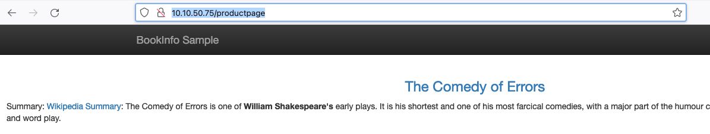
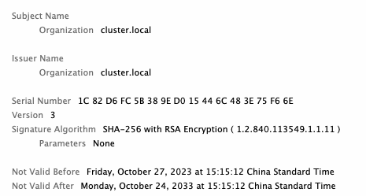
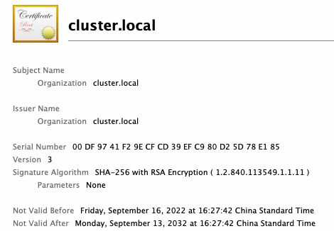
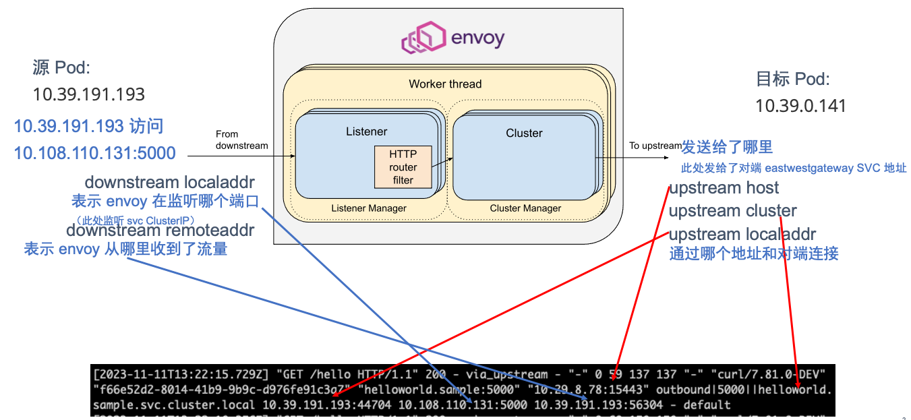
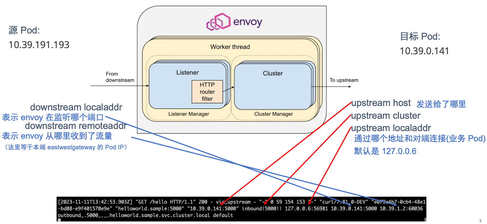

# Istio 多集群部署及原理分析

{: .no_toc}

## 目录

{: .no_toc .text-delta }


1. TOC
{:toc}

## 基础环境准备

### 安装 Kubernetes 集群

每个 istio 支持的 Kubernetes 不完全相同，详见下列链接：

[https://istio.io/latest/docs/releases/supported-releases/](https://istio.io/latest/docs/releases/supported-releases/)

具体安装过程略，本文使用 k8s 1.22.11 版本，istio 1.15 版本。

### 安装 MetalLB

Istio 的 Ingress Gateway 需要使用 Loadbalancer 类型的 service 暴露，因此需要部署 MetalLB。此处使用二层模式即可。

```
kubectl apply -f https://raw.githubusercontent.com/metallb/metallb/v0.13.12/config/manifests/metallb-native.yaml
```

```shell
kubectl -n metallb-system get po
NAME                          READY   STATUS    RESTARTS   AGE
controller-6c75847d5b-7jznb   1/1     Running   0          100s
speaker-7dpsv                 1/1     Running   0          100s
speaker-drg4m                 1/1     Running   0          100s
speaker-rxqjb                 1/1     Running   0          100s
```

创建 MetalLB IPPool（cluster1）：

```shell
cat > ippool1.yaml <<EOF

apiVersion: metallb.io/v1beta1
kind: IPAddressPool
metadata:
  name: pool1
  namespace: metallb-system
spec:
  addresses:
  - 10.10.50.75-10.10.50.90
  autoAssign: true
---
apiVersion: metallb.io/v1beta1
kind: L2Advertisement
metadata:
  name: default
  namespace: metallb-system
spec:
  ipAddressPools:
  - pool1
EOF
kubectl apply -f ippool1.yaml
```

创建 MetalLB IPPool（cluster2）：

```shell
cat > ippool2.yaml <<EOF

apiVersion: metallb.io/v1beta1
kind: IPAddressPool
metadata:
  name: pool2
  namespace: metallb-system
spec:
  addresses:
  - 10.29.8.75-10.29.8.90
  autoAssign: true
---
apiVersion: metallb.io/v1beta1
kind: L2Advertisement
metadata:
  name: default
  namespace: metallb-system
spec:
  ipAddressPools:
  - pool2
EOF
kubectl apply -f ippool2.yaml
```

参考文档：

[https://metallb.universe.tf/configuration/](https://metallb.universe.tf/configuration/)

### Istio 安装

多集群环境下这步可以省略，因为未来准备多集群时会使用自定义的集群配置文件再装一遍。如果已经安装了 istio，后续再安装多集群会进行覆盖安装。

```shell
cd istio-1.15.0/
./bin/istioctl install --set profile=demo -y

# 如需卸载，使用下列命令：
# ./bin/istioctl uninstall --purge
```

部署测试应用：

```shell
kubectl apply -f samples/bookinfo/platform/kube/bookinfo.yaml
kubectl apply -f samples/bookinfo/networking/bookinfo-gateway.yaml
```

```shell
[root@k8s-m01 ~]# kubectl get vs
NAME       GATEWAYS               HOSTS   AGE
bookinfo   ["bookinfo-gateway"]   ["*"]   15d
[root@k8s-m01 ~]# kubectl -n istio-system get svc
NAME                    TYPE           CLUSTER-IP       EXTERNAL-IP   PORT(S)                                                           AGE
istio-ingressgateway    LoadBalancer   10.110.235.7     10.10.50.75   15021:31073/TCP,80:30131/TCP,443:30142/TCP                        15d
```

访问测试（IP 为 Ingress gw 的 Loadbalancer IP，由 MetalLB 分配）：



## istio 跨网络多主架构安装

跨网络是指多个 Kubernetes 集群间的网络没有通过其他方式打通，都是相互独立的，比如两个 Calico ipip 模式部署的集群。

多主是指每个集群的 istiod 都是独立的，两者独立运行。

### 合并 kubeconfig 方便管理

复制两个集群的 kubeconfig 到当前目录（本文直接在 cluster1 的 master 节点上操作的），分别重命名为 kubeconfig1 和 kubeconfig2，修改 kubeconfig 中的集群名、user 名等信息，然后运行下列命令：

```shell
KUBECONFIG=kubeconfig1:kubeconfig2 kubectl config view --flatten  > kubeconfig
```

使用合并后的 kubeconfig 查看 contexts 是否正确：

```shell
kubectl --kubeconfig=kubeconfig config get-contexts
CURRENT   NAME       CLUSTER    AUTHINFO   NAMESPACE
*         cluster1   cluster1   user1
          cluster2   cluster2   user2
```

覆盖默认的 kubeconfig，并导出环境变量方便未来使用：

```shell
cp kubeconfig .kube/config
kubectl config use-context cluster1
export CTX_CLUSTER1=cluster1
export CTX_CLUSTER2=cluster2

cat >>~/.bash_profile <<EOF
export CTX_CLUSTER1=cluster1
export CTX_CLUSTER2=cluster2
EOF
```


### 准备 CA 互信

默认多个集群的 istio 会自己生成一个 CA，集群间的 CA 没有任何关系。比如下面是两个集群 ca 的对比：

```shell
[root@k8s-m01 ~]# kubectl -n istio-system get secret
NAME                                                TYPE                                  DATA   AGE
istio-ca-secret                                     istio.io/ca-root                      5      15d
```





istiod 启动过程中，会自动先检测有没有 cacerts，如果没有则使用上面自签名的（cluster-local），在 istiod 中会看到启动日志：

```shell
2023-11-11T08:02:18.095389Z	info	Using istiod file format for signing ca files
2023-11-11T08:02:18.095398Z	info	No plugged-in cert at etc/cacerts/ca-key.pem; self-signed cert is used
2023-11-11T08:02:18.095507Z	info	x509 cert - Issuer: "O=cluster.local", Subject: "", SN: 2290f4e0f30df453a218e43941b757d9, NotBefore: "2023-11-11T08:00:18Z", NotAfter: "2033-11-08T08:02:18Z"
2023-11-11T08:02:18.095513Z	info	Istiod certificates are reloaded
```


为了部署多集群服务，需要使用一个权威的 CA 根证书，然后每个集群使用这个 CA 根证书生成中间证书（用于替换原来自签名的 CA），最后再去控制底层的服务。

具体步骤如下：

1. 生成 CA 根证书：

```shell
cd istio-1.15.0
mkdir -p certs
pushd certs
make -f ../tools/certs/Makefile.selfsigned.mk root-ca
```

输出如下：


```shell
generating root-key.pem
Generating RSA private key, 4096 bit long modulus
.........................................................................................................................++
.........................++
e is 65537 (0x10001)
generating root-cert.csr
generating root-cert.pem
Signature ok
subject=/O=Istio/CN=Root CA
Getting Private key
```

分别为每个集群生成中间证书和 key，相应的证书和 key 会放在 clusterX 目录中：

```
make -f ../tools/certs/Makefile.selfsigned.mk cluster1-cacerts
make -f ../tools/certs/Makefile.selfsigned.mk cluster2-cacerts
```

输出如下：

```shell
[root@k8s-m01 certs]# make -f ../tools/certs/Makefile.selfsigned.mk cluster1-cacerts
generating cluster1/ca-key.pem
Generating RSA private key, 4096 bit long modulus
..................................................................................................................++
...................++
e is 65537 (0x10001)
generating cluster1/cluster-ca.csr
generating cluster1/ca-cert.pem
Signature ok
subject=/O=Istio/CN=Intermediate CA/L=cluster1
Getting CA Private Key
generating cluster1/cert-chain.pem
Intermediate inputs stored in cluster1/
done
rm cluster1/cluster-ca.csr cluster1/intermediate.conf
[root@k8s-m01 certs]# make -f ../tools/certs/Makefile.selfsigned.mk cluster2-cacerts
generating cluster2/ca-key.pem
Generating RSA private key, 4096 bit long modulus
............................++
.....................++
e is 65537 (0x10001)
generating cluster2/cluster-ca.csr
generating cluster2/ca-cert.pem
Signature ok
subject=/O=Istio/CN=Intermediate CA/L=cluster2
Getting CA Private Key
generating cluster2/cert-chain.pem
Intermediate inputs stored in cluster2/
done
rm cluster2/cluster-ca.csr cluster2/intermediate.conf
[root@k8s-m01 certs]# ls
cluster1  cluster2  root-ca.conf  root-cert.csr  root-cert.pem  root-cert.srl  root-key.pem
[root@k8s-m01 certs]# ls cluster1
# ca-cert 为每个集群的中间证书（Intermediate CA），cert-chain.pem 为中间证书+根证书（Root CA）
ca-cert.pem  ca-key.pem  cert-chain.pem  root-cert.pem
```

分别为每个集群创建中间证书：

```shell
kubectl create secret generic cacerts -n istio-system \
      --from-file=cluster1/ca-cert.pem \
      --from-file=cluster1/ca-key.pem \
      --from-file=cluster1/root-cert.pem \
      --from-file=cluster1/cert-chain.pem \
      --context="${CTX_CLUSTER1}"
```

重启相应的 istiod：

```shell
kubectl -n istio-system rollout restart deploy istiod
```

重启后在 istiod 日志中可以看到已经使用了新的中间证书：


```shell
2023-11-11T08:43:58.916724Z	info	Using istiod file format for signing ca files
2023-11-11T08:43:58.916745Z	info	Use plugged-in cert at etc/cacerts/ca-key.pem
2023-11-11T08:43:58.917058Z	info	x509 cert - Issuer: "CN=Intermediate CA,O=Istio,L=cluster1", Subject: "", SN: 6025a43920a8a48b1702703a5addba42, NotBefore: "2023-11-11T08:41:58Z", NotAfter: "2033-11-08T08:43:58Z"
2023-11-11T08:43:58.917121Z	info	x509 cert - Issuer: "CN=Root CA,O=Istio", Subject: "CN=Intermediate CA,O=Istio,L=cluster1", SN: aab3317c6b41d1ac, NotBefore: "2023-11-11T08:25:43Z", NotAfter: "2025-11-10T08:25:43Z"
2023-11-11T08:43:58.917154Z	info	x509 cert - Issuer: "CN=Root CA,O=Istio", Subject: "CN=Root CA,O=Istio", SN: cc805c33a3379ef0, NotBefore: "2023-11-11T08:24:20Z", NotAfter: "2033-11-08T08:24:20Z"
```

对集群 2 进行类似操作：

```shell
kubectl create secret generic cacerts -n istio-system \
      --from-file=cluster2/ca-cert.pem \
      --from-file=cluster2/ca-key.pem \
      --from-file=cluster2/root-cert.pem \
      --from-file=cluster2/cert-chain.pem \
      --context="${CTX_CLUSTER2}"
      
kubectl -n istio-system rollout restart deploy istiod --context="${CTX_CLUSTER2}"
```

### 多集群 istio 部署

#### 集群 1

```shell
cd ~/
kubectl --context="${CTX_CLUSTER1}" get namespace istio-system && \
kubectl --context="${CTX_CLUSTER1}" label namespace istio-system topology.istio.io/network=network1

cat <<EOF > cluster1.yaml
apiVersion: install.istio.io/v1alpha1
kind: IstioOperator
spec:
  values:
    global:
      meshID: mesh1
      multiCluster:
        clusterName: cluster1
      network: network1
EOF

# 如果之前已经安装了 istio，下列操作会使用新的配置再覆盖安装一遍，安装完后以前部署的 vs 可以正常访问
istioctl install --context="${CTX_CLUSTER1}" -f cluster1.yaml
```


```shell
# 安装东西向 ingressgateway：
cd ~/istio-1.15.0
samples/multicluster/gen-eastwest-gateway.sh \
    --mesh mesh1 --cluster cluster1 --network network1 | \
    istioctl --context="${CTX_CLUSTER1}" install -y -f -
# 创建东西向 Gateway 对象：
kubectl --context="${CTX_CLUSTER1}" apply -n istio-system -f \
    samples/multicluster/expose-services.yaml
```

#### 集群 2

```shell
cd ~/
kubectl --context="${CTX_CLUSTER2}" get namespace istio-system && \
kubectl --context="${CTX_CLUSTER2}" label namespace istio-system topology.istio.io/network=network2

cat <<EOF > cluster2.yaml
apiVersion: install.istio.io/v1alpha1
kind: IstioOperator
spec:
  values:
    global:
      meshID: mesh1
      multiCluster:
        clusterName: cluster2
      network: network2
EOF

istioctl install --context="${CTX_CLUSTER2}" -f cluster2.yaml
```


```shell
# 安装东西向 ingressgateway：
cd ~/istio-1.15.0
samples/multicluster/gen-eastwest-gateway.sh \
    --mesh mesh1 --cluster cluster2 --network network2 | \
    istioctl --context="${CTX_CLUSTER2}" install -y -f -
# 创建东西向 Gateway 对象：
kubectl --context="${CTX_CLUSTER2}" apply -n istio-system -f \
    samples/multicluster/expose-services.yaml
```

### 设置跨集群访问的 secret

为了使得两个集群的 istiod 能够访问到对端的 API Server，需要创建 remote-secret：

```shell
istioctl create-remote-secret \
  --context="${CTX_CLUSTER1}" \
  --name=cluster1 | \
  kubectl apply -f - --context="${CTX_CLUSTER2}"

istioctl create-remote-secret \
  --context="${CTX_CLUSTER2}" \
  --name=cluster2 | \
  kubectl apply -f - --context="${CTX_CLUSTER1}"
```

remote-secret 实际上是对端 API Server 的 kubeconfig 进行了 base64 编码：

```shell
kubectl -n istio-system get secret istio-remote-secret-cluster1 -o yaml
apiVersion: v1
data:
  cluster1: YXBpVmVyc2lvbjogdjEKY2x1c3RlcnM6Ci0gY2x1c3RlcjoKICAgIGNlcnRpZmljYXRlLWF1dGhvcml0eS1kYXRhOiBMUzB0TFMxQ1JVZEpUaUJEUlZKVVNVWkpRMEZVUlMwdExTMHRDazFKU1VNdmFrTkRRV1ZoWjBGM1NVSkJaMGxDUVVSQlRrSm5hM0ZvYTJsSE9YY3dRa0ZSYzBaQlJFRldUVkpOZDBWUldVUldVVkZFUlhkd2NtUlhTbXdLWTIwMWJHUkhWbnBOUWpSWVJGUkplazFVUVhsT2V
```


## 部署跨集群服务

```shell
kubectl create --context="${CTX_CLUSTER1}" namespace sample
kubectl create --context="${CTX_CLUSTER2}" namespace sample

kubectl label --context="${CTX_CLUSTER1}" namespace sample \
    istio-injection=enabled
kubectl label --context="${CTX_CLUSTER2}" namespace sample \
    istio-injection=enabled

# 部署 service 和 deployment
kubectl apply --context="${CTX_CLUSTER1}" \
    -f samples/helloworld/helloworld.yaml \
    -l service=helloworld -n sample
kubectl apply --context="${CTX_CLUSTER2}" \
    -f samples/helloworld/helloworld.yaml \
    -l service=helloworld -n sample

kubectl apply --context="${CTX_CLUSTER1}" \
    -f samples/helloworld/helloworld.yaml \
    -l version=v1 -n sample
kubectl apply --context="${CTX_CLUSTER2}" \
    -f samples/helloworld/helloworld.yaml \
    -l version=v2 -n sample

kubectl apply --context="${CTX_CLUSTER1}" \
    -f samples/sleep/sleep.yaml -n sample
kubectl apply --context="${CTX_CLUSTER2}" \
    -f samples/sleep/sleep.yaml -n sample
```

进行访问测试：

```shell
kubectl exec --context="${CTX_CLUSTER1}" -n sample -c sleep \
    "$(kubectl get pod --context="${CTX_CLUSTER1}" -n sample -l \
    app=sleep -o jsonpath='{.items[0].metadata.name}')" \
    -- curl helloworld.sample:5000/hello
```

访问日志，每次请求会分别转发到 v1 和 v2 的 Pod 中：

```shell
[root@k8s-m01 istio-1.15.0]# kubectl exec --context="${CTX_CLUSTER1}" -n sample -c sleep \
>     "$(kubectl get pod --context="${CTX_CLUSTER1}" -n sample -l \
>     app=sleep -o jsonpath='{.items[0].metadata.name}')" \
>     -- curl helloworld.sample:5000/hello
  % Total    % Received % Xferd  Average Speed   Time    Time     Time  Current
                                 Dload  Upload   Total   Spent    Left  Speed
100    59  100    59    0     0    344      0 --:--:-- --:--:-- --:--:--   345
Hello version: v2, instance: helloworld-v2-54df5f84b-8k8rk
[root@k8s-m01 istio-1.15.0]# kubectl exec --context="${CTX_CLUSTER1}" -n sample -c sleep \
>     "$(kubectl get pod --context="${CTX_CLUSTER1}" -n sample -l \
>     app=sleep -o jsonpath='{.items[0].metadata.name}')" \
>     -- curl helloworld.sample:5000/hello
  % Total    % Received % Xferd  Average Speed   Time    Time     Time  Current
                                 Dload  Upload   Total   Spent    Left  Speed
100    60  100    60    0     0    421      0 --:--:-- --:--:-- --:--:--   422
Hello version: v1, instance: helloworld-v1-776f57d5f6-rp6bc
```


## 排错及原理分析

为了方便排错或分析，需要先打开 envoy 的访问日志：

```shell
kubectl -n istio-system edit cm istio

# 在 trustDomain 后面加 accessLogFile: /dev/stdout
apiVersion: v1
data:
  mesh: |-
    defaultConfig:
      discoveryAddress: istiod.istio-system.svc:15012
      meshId: mesh1
      proxyMetadata: {}
      tracing:
        zipkin:
          address: zipkin.istio-system:9411
    enablePrometheusMerge: true
    rootNamespace: istio-system
    trustDomain: cluster.local
    accessLogFile: /dev/stdout
```

### 请求日志分析（远端响应请求）

#### 源 Pod 上 envoy 的请求日志

```shell
# kubectl -n sample logs -f sleep-784d69f945-rb2cd  -c istio-proxy
[2023-11-11T13:22:15.729Z] "GET /hello HTTP/1.1" 200 - via_upstream - "-" 0 59 137 137 "-" "curl/7.81.0-DEV" "f66e52d2-8014-41b9-9b9c-d976fe91c3a7" "helloworld.sample:5000" "10.29.8.78:15443" outbound|5000||helloworld.sample.svc.cluster.local 10.39.191.193:44704 10.108.110.131:5000 10.39.191.193:56304 - default
```

日志上 IP 说明如下：

- helloworld.sample:5000  及之前的为时间戳和请求 header 等信息
- 10.29.8.78:15443 为对端集群 eastwestgateway 的 Loadbalancer IP + 端口
- **outbound|5000||helloworld.sample.svc.cluster.local** 为 upstream cluster，envoy 的转发会参照此 cluster 中的 Endpoint
- 10.39.191.193:44704，envoy sidecar 容器的 IP 和端口，用于和本地的 e/w gateway 进行连接
- 10.108.110.131:5000，envoy 监听的端口，等于 Client 访问的目标端口（也就是 envoy 拦截了请求）
- 10.39.191.193:56304，envoy 和源 Pod 建立会话的端口



源 Pod 上 envoy 的配置：

```shell
istioctl proxy-status
istioctl proxy-config route sleep-784d69f945-rb2cd.sample -o yaml
```

相关项目如下：

```
- name: "5000"
  validateClusters: false
  virtualHosts:
  - domains:
    - '*'
    includeRequestAttemptCount: true
    name: allow_any
    routes:
    - match:
        prefix: /
      name: allow_any
      route:
        cluster: PassthroughCluster
        maxGrpcTimeout: 0s
        timeout: 0s
  - domains:
    - helloworld.sample.svc.cluster.local
    - helloworld.sample.svc.cluster.local:5000
    - helloworld
    - helloworld:5000
    - helloworld.sample.svc
    - helloworld.sample.svc:5000
    - helloworld.sample
    - helloworld.sample:5000
    - 10.108.110.131
    - 10.108.110.131:5000
    includeRequestAttemptCount: true
    name: helloworld.sample.svc.cluster.local:5000
    routes:
    - decorator:
        operation: helloworld.sample.svc.cluster.local:5000/*
      match:
        prefix: /
      name: default
      route:
        cluster: outbound|5000||helloworld.sample.svc.cluster.local
        maxStreamDuration:
          grpcTimeoutHeaderMax: 0s
          maxStreamDuration: 0s
        retryPolicy:
          hostSelectionRetryMaxAttempts: "5"
          numRetries: 2
          retriableStatusCodes:
          - 503
          retryHostPredicate:
          - name: envoy.retry_host_predicates.previous_hosts
            typedConfig:
              '@type': type.googleapis.com/envoy.extensions.retry.host.previous_hosts.v3.PreviousHostsPredicate
          retryOn: connect-failure,refused-stream,unavailable,cancelled,retriable-status-codes
        timeout: 0s
```

源 Pod 上相关服务的 envoy Endpoint 信息：

```shell
# 此处有两个 endpoint，一个为本地的 pod，另一个为本地 istio-eastwestgateway
[root@k8s-m01 istio-1.15.0]# istioctl proxy-config endpoints sleep-784d69f945-rb2cd.sample | grep 'outbound|5000||helloworld.sample.svc.cluster.local'
10.29.8.78:15443                                        HEALTHY     OK                outbound|5000||helloworld.sample.svc.cluster.local
10.39.217.208:5000                                      HEALTHY     OK                outbound|5000||helloworld.sample.svc.cluster.local
```

如果把远端集群的 pod 数量从 1 改为 2，Endpoint 的数量不会发生变化。而如果把本地的 pod 数量从 1 改为 2，Endpoint 会发生变化：

```shell
[root@k8s-m01 istio-1.15.0]# istioctl proxy-config endpoints sleep-784d69f945-rb2cd.sample | grep 'outbound|5000||helloworld.sample.svc.cluster.local'
10.29.8.78:15443                                        HEALTHY     OK                outbound|5000||helloworld.sample.svc.cluster.local
10.39.191.202:5000                                      HEALTHY     OK                outbound|5000||helloworld.sample.svc.cluster.local
10.39.217.208:5000                                      HEALTHY     OK                outbound|5000||helloworld.sample.svc.cluster.local
```


#### 目标 Pod 上 envoy 的请求日志

```shell
[2023-11-11T13:42:53.903Z] "GET /hello HTTP/1.1" 200 - via_upstream - "-" 0 59 154 153 "-" "curl/7.81.0-DEV" "e079e4b7-0cb4-48e1-bd08-e9f401570e9e" "helloworld.sample:5000" "10.39.0.141:5000" inbound|5000|| 127.0.0.6:56981 10.39.0.141:5000 10.39.1.2:60036 outbound_.5000_._.helloworld.sample.svc.cluster.local default
```

日志上 IP 说明如下：

- 127.0.0.6 这个 IP 是 Istio 中默认的 InboundPassthroughClusterIpv4，在 Istio 的代码中指定。即流量在进入 Envoy 代理后被绑定的 IP 地址，作用是让 Outbound 流量重新发送到 Pod 中的应用容器，即 Passthought（透传），绕过 Outbound Handler。该流量是对 Pod 自身的访问，而不是真正的对外流量。至于为什么选择这个 IP 作为流量透传，请参考 Istio Issue-29603 
- 10.39.0.141:5000，目标 Pod 真实 IP，envoy 会将请求最终发给这个 IP 端口
- inbound|5000|| ， 为 upstream cluster，在 envoy 中会有相关的表项
- 10.39.0.141:5000，envoy 监听的端口，等于目标 Pod 监听的端口（也就是 envoy 拦截了请求）
- 10.39.1.2:60036 ，本端 e/w gateway 的 Pod IP，envoy 从此 IP 接收到了流量



### 请求日志分析（本地响应请求）

源 Pod 上 envoy 的请求日志：

```shell
[2023-11-11T13:22:18.356Z] "GET /hello HTTP/1.1" 200 - via_upstream - "-" 0 60 158 158 "-" "curl/7.81.0-DEV" "6bcaa6a0-85fc-4324-ae7a-988b5480b659" "helloworld.sample:5000" "10.39.217.208:5000" outbound|5000||helloworld.sample.svc.cluster.local 10.39.191.193:54834 10.108.110.131:5000 10.39.191.193:56332 - default
```

目标 Pod 上 envoy 的请求日志：

```bash
[2023-11-11T13:22:18.427Z] "GET /hello HTTP/1.1" 200 - via_upstream - "-" 0 60 150 150 "-" "curl/7.81.0-DEV" "6bcaa6a0-85fc-4324-ae7a-988b5480b659" "helloworld.sample:5000" "10.39.217.208:5000" inbound|5000|| 127.0.0.6:53427 10.39.217.208:5000 10.39.191.193:54834 outbound_.5000_._.helloworld.sample.svc.cluster.local default
```

### 查看 envoy 状态

```
[root@k8s-m01 ~]# istioctl proxy-status
NAME                                                    CLUSTER      CDS        LDS        EDS        RDS          ECDS         ISTIOD                      VERSION
helloworld-v1-776f57d5f6-rp6bc.sample                   cluster1     SYNCED     SYNCED     SYNCED     SYNCED       NOT SENT     istiod-6476856c7f-tv5rg     1.15.0
istio-eastwestgateway-7f8bdb754b-mw77z.istio-system     cluster1     SYNCED     SYNCED     SYNCED     NOT SENT     NOT SENT     istiod-6476856c7f-tv5rg     1.15.0
istio-ingressgateway-6889f9b74c-cllg8.istio-system      cluster1     SYNCED     SYNCED     SYNCED     SYNCED       NOT SENT     istiod-6476856c7f-tv5rg     1.15.0
sleep-784d69f945-rb2cd.sample                           cluster1     SYNCED     SYNCED     SYNCED     SYNCED       NOT SENT     istiod-6476856c7f-tv5rg     1.15.0
```


## 其他

### 升级 istio

下载新版本的 istio 安装包，比如`istio-1.15.0-linux-amd64.tar.gz`，运行 `istioctl upgrade`

```shell
[root@k8s-m01 istio-1.15.0]# ./bin/istioctl upgrade
WARNING: Istio control planes installed: 1.11.2.
WARNING: A newer installed version of Istio has been detected. Running this command will overwrite it.
This will install the Istio 1.15.0 default profile with ["Istio core" "Istiod" "Ingress gateways"] components into the cluster. Proceed? (y/N) y
✔ Istio core installed
✔ Istiod installed
✔ Ingress gateways installed
✔ Installation complete                                                                                                                                                            Making this installation the default for injection and validation.

Thank you for installing Istio 1.15.  Please take a few minutes to tell us about your install/upgrade experience!  https://forms.gle/SWHFBmwJspusK1hv6
```

### 卸载

```shell
istioctl uninstall --context="${CTX_CLUSTER1}" -y --purge
kubectl delete ns istio-system --context="${CTX_CLUSTER1}"

istioctl uninstall --context="${CTX_CLUSTER2}" -y --purge
kubectl delete ns istio-system --context="${CTX_CLUSTER2}"
```


## 参考文档

[https://preliminary.istio.io/latest/zh/docs/tasks/security/cert-management/plugin-ca-cert/](https://preliminary.istio.io/latest/zh/docs/tasks/security/cert-management/plugin-ca-cert/)

[https://preliminary.istio.io/latest/zh/docs/setup/install/multicluster/multi-primary_multi-network/](https://preliminary.istio.io/latest/zh/docs/setup/install/multicluster/multi-primary_multi-network/)

[https://md.huanghuanhui.com/istio/istio.html](https://md.huanghuanhui.com/istio/istio.html)

[https://preliminary.istio.io/latest/zh/docs/ops/diagnostic-tools/istioctl/](https://preliminary.istio.io/latest/zh/docs/ops/diagnostic-tools/istioctl/)
