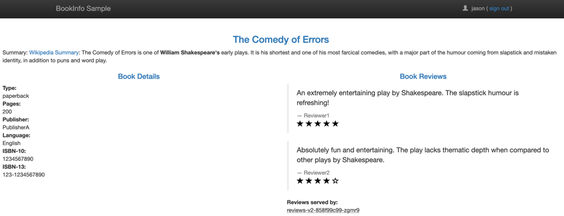
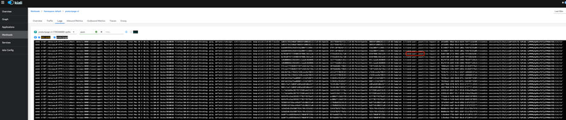

# Istio 安装及测试(采用官方示例)

{: .no_toc}

## 目录

{: .no_toc .text-delta }


1. TOC
{:toc}

## 1.1. 环境基础信息

集群信息：


 

## 1.2. 安装istio

参考文档：https://istio.io/latest/docs/setup/getting-started/

Istio 下载页，下载Linux版本的tar包


解压后修改 manifest 文件

### 1.2.1.  使用默认profile部署istio

```shell
./bin/istioctl install --set profile=demo -y
```


部署完成后pod信息：


 将istio injector的image改为私有镜像仓库（按需）：

```shell
kubectl -n istio-system edit cm istio-sidecar-injector
```


## 1.3. 部署kiali图形化插件

```shell
kubectl apply -f samples/addons
```


之后可以看到是通过ClusterIP暴露的，因为环境中安装好了AKO，因此可以通过AKO来发布成LoadBalancer服务，主服务使用80端口：


 


之后通过外部IP端口访问：


## 1.4. 使用 istio

为命名空间开启注入：

```shell
kubectl label namespace default istio-injection=enabled
```


测试pod间的访问：


测试外部到Pod的访问（通过LB发布）：


在Kiali看到的服务访问图表：


使用ab压测：


可以看到图形有变化：


此应用使用tcp发布，因此不支持mtls等特性。


使用HTTP发布新的业务，支持mTLS：


## 1.5.    安装zipkin遥测系统

```shell
kubectl apply -f samples/addons/extras/zipkin.yaml
```

安装后，将istio-system ns下的相关svc改为LoadBalancer类型：


访问结果如下：


 

### 1.5.1.  修改采样率

```shell
kubectl -n istio-system get IstioOperator
kubectl -n istio-system edit IstioOperator installed-state
```


```shell
accessLogFormat: "[%START_TIME%] %REQ(user)% %REQ(:METHOD)% %REQ(X-ENVOY-ORIGINAL-PATH?:PATH)% %PROTOCOL% %RESPONSE_CODE% %RESPONSE_FLAGS% %BYTES_RECEIVED% %BYTES_SENT% %DURATION% %RESP(X-ENVOY-UPSTREAM-SERVICE-TIME)% %REQ(X-FORWARDED-FOR)% %REQ(USER-AGENT)% %REQ(X-REQUEST-ID)% %REQ(:AUTHORITY)% %UPSTREAM_HOST%\n"
```


 

## 1.6.    排错相关

压测时发现存在未响应：


看到应用有错误：


错误的详细信息：


 另外应用本身也报inbound错误：


大致能看到错误代码为4xx：


之后再Avi 侧看到访问异常：


 查看istio的日志，发现大量426：


## 1.7.    部署bookinfo

Bookinfo 应用架构如下，包含四个模块，其中reviews包含三个版本，会同时部署到集群中：


```shell
kubectl apply -f samples/bookinfo/platform/kube/bookinfo.yaml 
```


 


```shell
kubectl apply -f samples/bookinfo/networking/bookinfo-gateway.yaml
```


此Gateway会由istio Gateway承载，再通过LoadBalancer暴露出去，Gateway地址可以通过下列命令获得：

```shell
kubectl get svc istio-ingressgateway -n istio-system
```


刷新多次后可以看到不同的review版本：


在kiali可以看到同样的结果：


默认三个版本的reviews都被加入了svc，所以会轮询提供服务：


在启用了istio的namespace中部署应用后，pod会被自动注入envoy代理，其架构如下：


## 1.8.    流量控制测试

### 1.8.1.  版本控制

前提条件：

配置 destinationrule，设置subset：

```shell
kubectl apply -f samples/bookinfo/networking/destination-rule-all.yaml
```


应用下列vs配置，指定所有服务使用v1版本：

```shell
kubectl apply -f samples/bookinfo/networking/virtual-service-all-v1.yaml
```


其中ratings使用的为v1版本：

```yaml
apiVersion: networking.istio.io/v1alpha3
kind: VirtualService
metadata:
  name: productpage
spec:
  hosts:
  - productpage
  http:
  - route:
    - destination:
        host: productpage
        subset: v1
---
apiVersion: networking.istio.io/v1alpha3
kind: VirtualService
metadata:
  name: reviews
spec:
  hosts:
  - reviews
  http:
  - route:
    - destination:
        host: reviews
        subset: v1
---
apiVersion: networking.istio.io/v1alpha3
kind: VirtualService
metadata:
  name: ratings
spec:
  hosts:
  - ratings
  http:
  - route:
    - destination:
        host: ratings
        subset: v1
---
apiVersion: networking.istio.io/v1alpha3
kind: VirtualService
metadata:
  name: details
spec:
  hosts:
  - details
  http:
  - route:
    - destination:
        host: details
        subset: v1
```


效果如下，多次访问结果均是v1的app：


 

### 1.8.2.  基于用户ID的访问控制

应用下列vs配置，指定当用户为jason时使用v2版本的reviews服务，其他用户使用v1：

```shell
kubectl apply -f samples/bookinfo/networking/virtual-service-reviews-test-v2.yaml
```


``` yaml
apiVersion: networking.istio.io/v1alpha3
kind: VirtualService
metadata:
  name: reviews
spec:
  hosts:
    - reviews
  http:
  - match:
    - headers:
        end-user:
          exact: jason
    route:
    - destination:
        host: reviews
        subset: v2
  - route:
    - destination:
        host: reviews
        subset: v1
```

访问测试，普通/未登录用户时，使用v1的reviews：


使用jason登录时，看到review版本为v2：



当有用户登录时，请求头回会出现下列cookie，使用base64编码：


解码后内容如下：


此cookie会被productpage解析后发送给reviews，productpage中下列代码实现user名到header end-user的解析：


此cookie会被productpage解析后发送给reviews，此请求会被istio截获，发现请求头中有user:jason时将其发给v2的reviews




## 1.9.    故障注入测试

### 1.9.1.  延迟测试

前提条件：

配置 destinationrule，设置subset（实际此实验只会用到和reviews及ratings相关的部分）

```shell
kubectl apply -f samples/bookinfo/networking/destination-rule-all.yaml
```

配置 VS，使得用户为 Jason 时使用v2的ratings服务，其他用户使用v1（v1不支持检测ratings是否能正常使用）

```
kubectl apply -f samples/bookinfo/networking/virtual-service-reviews-test-v2.yaml
```

部署下列vs配置：

```yaml
apiVersion: networking.istio.io/v1beta1
kind: VirtualService
...
spec:
  hosts:
  - ratings
  http:
  - fault:
      delay:
        fixedDelay: 7s
        percentage:
          value: 100
    match:
    - headers:
        end-user:
          exact: jason
    route:
    - destination:
        host: ratings
        subset: v1
  - route:
    - destination:
        host: ratings
        subset: v1
```

上面的VS定义当用户为jason时，增加延迟为7s。

之后jason访问页面，会发现等待6s之后报告服务不可用：


普通用户可以正常访问页面：


在kiali同样看到故障:


第一次访问超时（下面最后一条记录的是review将请求发给ratings了）：


第二次访问超时（等了3s后，productpage再次发生请求，同样最后请求很快发给了ratings，但是没得到回复）：


第7s时ratings才正常访问，但是前端服务已经报告超时了


#### 1.9.1.1.  故障原因分析

在productpage和review之间有3s的超时时间+1次重试，当在这个时间周期内（6s）review不正常响应，则productpage会直接报告review服务不可用。

Review和后端的ratings之间硬编码了10s的延迟，所以在review实际上可以在7s的时候正常访问到ratings。

#### 1.9.1.2.  修复办法

修改应用代码，将productpage和reviews之间的延迟增加，或者将reviews和ratings之间的超时时间改小到2.5s，这样productpage即可正常调用reviews服务。在samples中，v3版本的reviews解决了这个问题，可以直接修改vs来更新应用：

```shell
kubectl edit vs reviews
```


之后再次访问页面，发现review可以正常加载（ratings不能正常加载，预期的现象）


#### 1.9.1.3.  测试2

或者，理论上如果使得ratings延迟<3s，则页面最终能正常加载，测试结果如下：

```shell
kubectl edit vs ratings
```


在kiali上不再有服务故障，但是trace中可以看到ratings响应比较慢：


### 1.9.2.  HTTP abort测试

前提条件：

配置 destinationrule，设置subset（实际此实验只会用到和reviews及ratings相关的部分）

```shell
kubectl apply -f samples/bookinfo/networking/destination-rule-all.yaml
```

配置 VS，使得用户为 Jason 时使用v2的ratings服务，其他用户使用v1（v1不支持检测ratings是否能正常使用）

```shell
kubectl apply -f samples/bookinfo/networking/virtual-service-reviews-test-v2.yaml
```

部署下列vs配置：

```yaml
apiVersion: networking.istio.io/v1beta1
kind: VirtualService
...
spec:
  hosts:
  - ratings
  http:
  - fault:
      abort:
        httpStatus: 500
        percentage:
          value: 100
    match:
    - headers:
        end-user:
          exact: jason
    route:
    - destination:
        host: ratings
        subset: v1
  - route:
    - destination:
        host: ratings
        subset: v1
```

上面的VS定义当用户为jason时，则rating Service对其不可用

```shell
kubectl apply -f samples/bookinfo/networking/virtual-service-ratings-test-abort.yaml
```

应用之后用户jason去访问应用时看到下列提示：


查看后端pod日志，注意到访问ratings状态为500:


普通用户看到的是v1的界面：


在kiali可以看到故障：


故障原因是故障注入导致reviews请求ratings出现问题：


## 1.10.  卸载istio

```shell
istioctl uninstall –purge
```


 


## 参考文档

[https://preliminary.istio.io/latest/zh/docs/setup/install/istioctl/](https://preliminary.istio.io/latest/zh/docs/setup/install/istioctl/)

[https://preliminary.istio.io/latest/zh/docs/examples/bookinfo/](https://preliminary.istio.io/latest/zh/docs/examples/bookinfo/)

