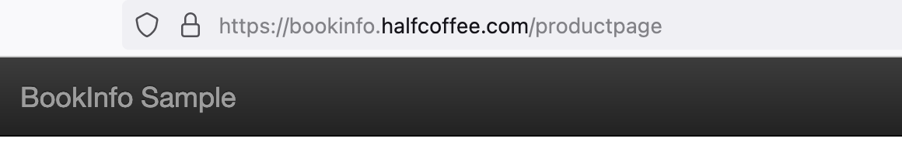

# Istio Ingress Gateway TLS 卸载配置(采用官方示例)

{: .no_toc}

## 目录

{: .no_toc .text-delta }


1. TOC
{:toc}

## 前提配置

已经正确安装好 Istio，详见：

[https://blog.halfcoffee.com/docs/cloudnative/istio/install](https://blog.halfcoffee.com/docs/cloudnative/istio/install)


## 设置全局证书 secret

先准备好证书文件和私钥，可以通过 joyssl 等平台申请，我使用的是泛域名证书 `*.halfcoffee.com`

```shell
kubectl -n istio-system create secret tls certificate --key=halfcoffee.com_key.key  --cert=halfcoffee.com_chain.crt

# secret/certificate created
```

## 修改 Gateway 配置，添加 TLS 证书

```yaml
apiVersion: networking.istio.io/v1beta1
kind: Gateway
metadata:
  name: bookinfo-gateway
  namespace: default
spec:
  selector:
    istio: ingressgateway
  servers:
  - hosts:
    - 'bookinfo.halfcoffee.com'
    port:
      number: 443
      name: https
      protocol: HTTPS
    tls:
      mode: SIMPLE
      credentialName: certificate
```

### 创建 VS，调用上述 Gateway（官方示例）

```
---
apiVersion: networking.istio.io/v1alpha3
kind: VirtualService
metadata:
  name: bookinfo
spec:
  hosts:
  - "bookinfo.halfcoffee.com"
  gateways:
  - bookinfo-gateway
  http:
  - match:
    - uri:
        exact: /productpage
    - uri:
        prefix: /static
    - uri:
        exact: /login
    - uri:
        exact: /logout
    - uri:
        prefix: /api/v1/products
    route:
    - destination:
        host: productpage
        port:
          number: 9080
```

最终通过域名访问服务，可以看到证书被正确挂载：




参考文档：

[https://istio.io/latest/docs/tasks/traffic-management/ingress/secure-ingress/](https://istio.io/latest/docs/tasks/traffic-management/ingress/secure-ingress/)

