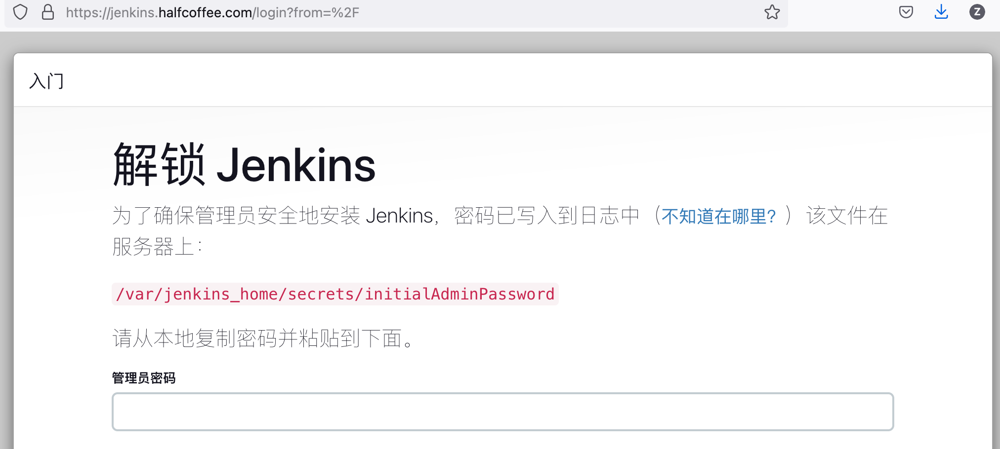
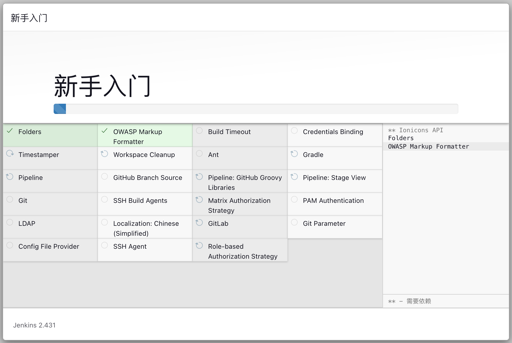
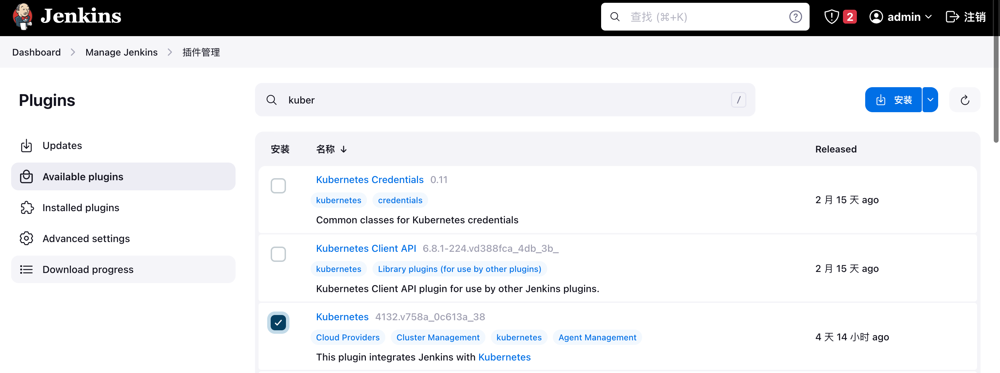
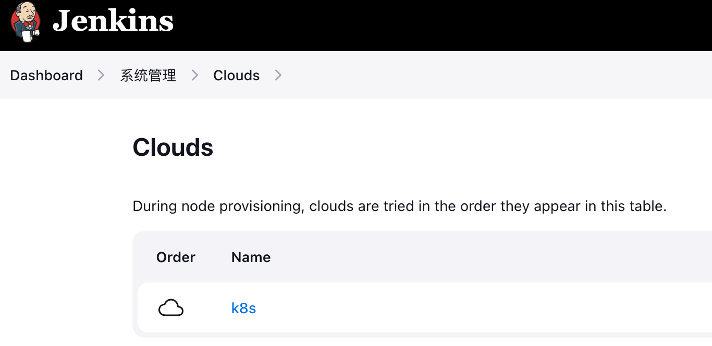
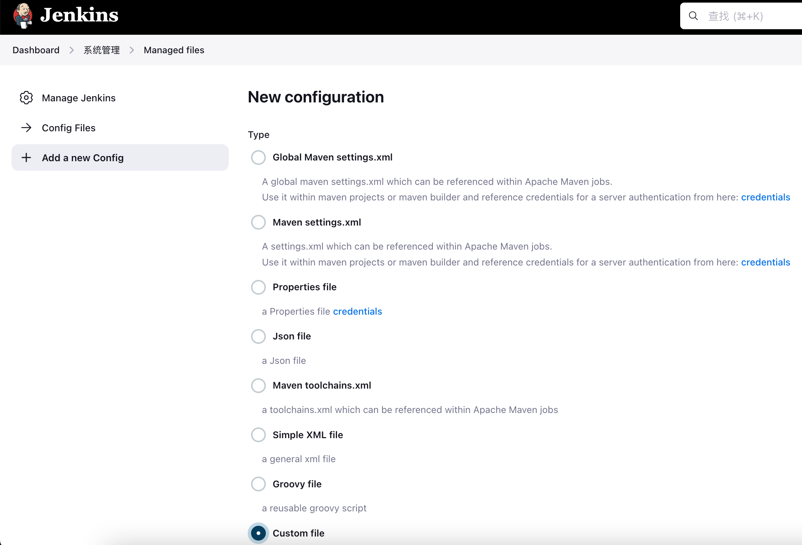
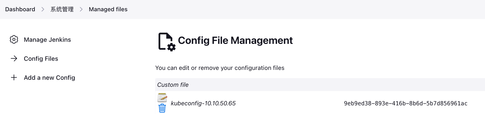
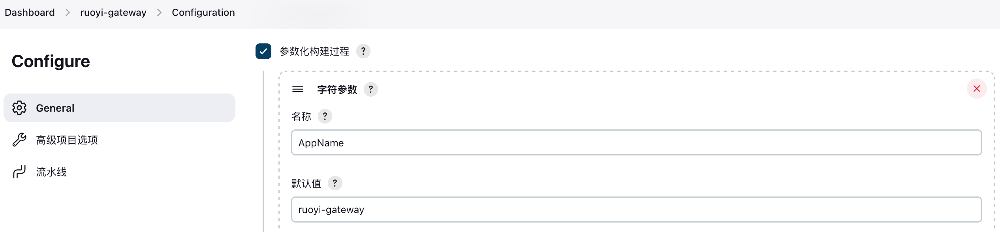

# Jenkins on Kubernetes CICD（转改）

{: .no_toc}

## 目录

{: .no_toc .text-delta }


1. TOC
{:toc}

## k8s 部署 Jenkins 2.427（jdk-21 版）

```shell
mkdir -p ~/jenkins-prod-yml
kubectl create ns jenkins-prod

# 设置将 Jenkins 固定在 w01 节点
kubectl label node k8s-w01 jenkins-prod=jenkins-prod
```

### RBAC 配置

```shell
cat > ~/jenkins-prod-yml/Jenkins-prod-rbac.yml << 'EOF'
apiVersion: v1
kind: Namespace
metadata:
  name: jenkins-prod
---
apiVersion: v1
kind: ServiceAccount
metadata:
  name: jenkins-prod
  namespace: jenkins-prod
---
apiVersion: rbac.authorization.k8s.io/v1
kind: ClusterRole
metadata:
  annotations:
    rbac.authorization.kubernetes.io/autoupdate: "true"
  labels:
    kubernetes.io/bootstrapping: rbac-defaults
  name: jenkins-prod
rules:
- apiGroups:
  - '*'
  resources:
  - statefulsets
  - services
  - replicationcontrollers
  - replicasets
  - podtemplates
  - podsecuritypolicies
  - pods
  - pods/log
  - pods/exec
  - podpreset
  - poddisruptionbudget
  - persistentvolumes
  - persistentvolumeclaims
  - jobs
  - endpoints
  - deployments
  - deployments/scale
  - daemonsets
  - cronjobs
  - configmaps
  - namespaces
  - events
  - secrets
  verbs:
  - create
  - get
  - watch
  - delete
  - list
  - patch
  - update
- apiGroups:
  - ""
  resources:
  - nodes
  verbs:
  - get
  - list
  - watch
  - update
---
apiVersion: rbac.authorization.k8s.io/v1
kind: ClusterRoleBinding
metadata:
  annotations:
    rbac.authorization.kubernetes.io/autoupdate: "true"
  labels:
    kubernetes.io/bootstrapping: rbac-defaults
  name: jenkins-prod
roleRef:
  apiGroup: rbac.authorization.k8s.io
  kind: ClusterRole
  name: jenkins-prod
subjects:
- apiGroup: rbac.authorization.k8s.io
  kind: Group
  name: system:serviceaccounts:jenkins-prod
EOF

kubectl apply -f ~/jenkins-prod-yml/Jenkins-prod-rbac.yml
```

### deployment （hostpath 模式）

```shell
cat > ~/jenkins-prod-yml/Jenkins-prod-Deployment.yml << 'EOF'
apiVersion: apps/v1
kind: Deployment
metadata:
  name: jenkins-prod
  namespace: jenkins-prod
  labels:
    app: jenkins-prod
spec:
  replicas: 1
  selector:
    matchLabels:
      app: jenkins-prod
  template:
    metadata:
      labels:
        app: jenkins-prod
    spec:
      tolerations:
      - effect: NoSchedule
        key: no-pod
        operator: Exists
      nodeSelector:
        jenkins-prod: jenkins-prod
      containers:
      - name: jenkins-prod
        image: jenkins/jenkins:2.431-jdk21
        securityContext:
          runAsUser: 0
        ports:
        - containerPort: 8080
          name: web
          protocol: TCP
        - containerPort: 50000
          name: agent
          protocol: TCP
        env:
        - name: LIMITS_MEMORY
          valueFrom:
            resourceFieldRef:
              resource: limits.memory
              divisor: 1Mi
        - name: JAVA_OPTS
          value: -Dhudson.security.csrf.GlobalCrumbIssuerConfiguration.DISABLE_CSRF_PROTECTION=true
        volumeMounts:
        - name: jenkins-home-prod
          mountPath: /var/jenkins_home
        - mountPath: /etc/localtime
          name: localtime
      volumes:
      - name: jenkins-home-prod
        hostPath:
          path: /data
          type: DirectoryOrCreate
      - name: localtime
        hostPath:
          path: /etc/localtime
EOF

kubectl apply -f ~/jenkins-prod-yml/Jenkins-prod-Deployment.yml
```

### 对外暴露配置

Jenkins 对外需要暴露两个端口，一个是 Web 的 8080，另一个是 Agent 连接用的 50000 端口（最终 Agent 使用哪个端口可以在 Jenkins 的系统管理>全局安全管理中修改，因环境差异可能不一定等于容器的 50000 端口），此处为了安全在外部配置了负载均衡，为 Web 配置了 TLS 证书，同时将 agent 以 stream 形式代理。

Service 配置如下（NodePort 指定为 30000，默认不让用 50000）：

```shell
cat > ~/jenkins-prod-yml/Jenkins-prod-Service.yml << 'EOF'
apiVersion: v1
kind: Service
metadata:
  name: jenkins-prod
  namespace: jenkins-prod
  labels:
    app: jenkins-prod
spec:
  selector:
    app: jenkins-prod
  type: NodePort
  ports:
  - name: web
    port: 8080
    targetPort: web
  - name: agent
    nodePort: 30000
    port: 50000
    targetPort: agent
EOF

kubectl apply -f ~/jenkins-prod-yml/Jenkins-prod-Service.yml
```

接着使用 Nginx Proxy Manager 进行反向代理并配置证书，[关于 NPM 部署详见这篇文档](https://blog.halfcoffee.com/docs/linux/centos/npm)。


配置了相应的域名解析之后，通过域名即可访问 Jenkins：



管理员密码在 volume 的 secrets 目录中。


### 初始化及按需安装插件

- Localization: Chinese (Simplified)
- Git、Git Parameter：拉取 Git 仓库中的代码
- GitLab：集成 Gitlab，通过 webhook 触发构建，将构建状态返回给 Gitlab
- Config FIle Provider：用于创建 kubeconfig 文件，使得 Jenkins 可以连接到 k8s 集群
- Extended Choice Parameter
- SSH Agent （build）：通过 ssh 远程执行命令
- Pipeline: Stage View
- Role-based Authorization Strategy
- kubernetes：Kubernetes 对接
- qy wechat notification：企业微信对接
- skip-certificate-check：禁用证书检查




初始化向导完毕后可以在下列位置部署额外的插件：



### 创建 Cloud

如果 Jenkins 部署在 Kubernetes 集群中，可以不做任何配置，只填写一个名称，Jenkins 自动识别集群：



### 创建 PVC

```shell
cat > ~/jenkins-prod-yml/Jenkins-prod-slave-maven-cache.yml << 'EOF'
apiVersion: v1
kind:  PersistentVolumeClaim
metadata:
  name: jenkins-prod-slave-maven-cache
  namespace: jenkins-prod
spec:
  storageClassName: "nfs-client"
  accessModes: [ReadWriteOnce]
  resources:
    requests:
      storage: 1Gi
EOF

cat > ~/jenkins-prod-yml/Jenkins-prod-slave-node-cache.yml << 'EOF'
apiVersion: v1
kind:  PersistentVolumeClaim
metadata:
  name: jenkins-prod-slave-node-cache
  namespace: jenkins-prod
spec:
  storageClassName: "nfs-client"
  accessModes: [ReadWriteOnce]
  resources:
    requests:
      storage: 1Gi
EOF

kubectl apply -f ~/jenkins-prod-yml/Jenkins-prod-slave-maven-cache.yml

kubectl apply -f ~/jenkins-prod-yml/Jenkins-prod-slave-node-cache.yml
```


## Ruoyi 示例应用部署

### MySQL 容器化部署（ruoyi使用）

参考示例：

https://kubernetes.io/docs/tutorials/stateful-application/mysql-wordpress-persistent-volume/

```shell
kubectl label node k8s-w02 ruoyi=ruoyi
mkdir /root/ruoyi/

cat > /root/ruoyi/mysql-config.yaml <<EOF
apiVersion: v1
kind: ConfigMap
metadata:
  name: mysql-config
  labels:
    app: mysql
data:
  my.cnf: |-
    [client]
    default-character-set=utf8mb4
    [mysql]
    default-character-set=utf8mb4
    [mysqld]
    max_connections = 2000
    secure_file_priv=/var/lib/mysql
    sql_mode=STRICT_TRANS_TABLES,NO_ZERO_IN_DATE,NO_ZERO_DATE,ERROR_FOR_DIVISION_BY_ZERO,NO_ENGINE_SUBSTITUTION
EOF
kubectl -n ruoyi  apply -f /root/ruoyi/mysql-config.yaml

kubectl -n ruoyi create secret generic mysql-pass --from-literal=password=Admin@2023

cat > /root/ruoyi/mysql.yaml <<EOF
apiVersion: v1
kind: Service
metadata:
  name: ruoyi-mysql
  labels:
    app: ruoyi-mysql
spec:
  ports:
    - port: 3306
  selector:
    app: ruoyi-mysql
  clusterIP: None
---
apiVersion: v1
kind: PersistentVolumeClaim
metadata:
  name: mysql-pv-claim
  labels:
    app: ruoyi-mysql
spec:
  storageClassName: "nfs-client"
  accessModes: [ReadWriteOnce]
  resources:
    requests:
      storage: 1Gi
---
apiVersion: apps/v1
kind: Deployment
metadata:
  name: ruoyi-mysql
  labels:
    app: ruoyi-mysql
spec:
  selector:
    matchLabels:
      app: ruoyi-mysql
  strategy:
    type: Recreate
  template:
    metadata:
      labels:
        app: ruoyi-mysql
    spec:
      nodeSelector:
        ruoyi: ruoyi
      containers:
      - image: mysql:8.0
        name: mysql
        env:
        - name: MYSQL_ROOT_PASSWORD
          valueFrom:
            secretKeyRef:
              name: mysql-pass
              key: password
        - name: MYSQL_DATABASE
          value: ruoyi
        - name: MYSQL_USER
          value: ruoyi
        - name: MYSQL_PASSWORD
          valueFrom:
            secretKeyRef:
              name: mysql-pass
              key: password
        ports:
        - containerPort: 3306
          name: mysql
        volumeMounts:
        - name: mysql-persistent-storage
          mountPath: /var/lib/mysql
        - name: config
          mountPath: /etc/mysql/conf.d/my.cnf
          subPath: my.cnf
        - name: localtime
          readOnly: true
          mountPath: /etc/localtime
      volumes:
      - name: mysql-persistent-storage
        persistentVolumeClaim:
          claimName: mysql-pv-claim
# 如果想使用 hostpath，用下面的 yaml
#      - name: mysql-persistent-storage
#        hostPath:
#          path: /root/ruoyi/db
#          type: DirectoryOrCreate
      - name: config      
        configMap:
          name: mysql-config
      - name: localtime
        hostPath:
          type: File
          path: /etc/localtime
EOF

kubectl -n ruoyi apply -f /root/ruoyi/mysql.yaml
```

#### 初始化数据库

```shell
# 在本地获取 mysql 二进制，用于未来连接 mysql
wget https://cdn.mysql.com/archives/mysql-8.0/mysql-8.0.28-linux-glibc2.12-x86_64.tar.xz
tar xf ~/mysql-8.0.28-linux-glibc2.12-x86_64.tar.xz
mv ~/mysql-8.0.28-linux-glibc2.12-x86_64 /usr/local/mysql
ln -sv /usr/local/mysql/bin/* /usr/bin/ &> /dev/null

# kubectl -n ruoyi get po -o wide 记录 Pod IP
# 测试连接
[root@k8s-m01 ~]# mysql -h 10.39.217.206 -u root -P 3306 -pAdmin@2023 -e "select host,user from mysql.user;"
mysql: [Warning] Using a password on the command line interface can be insecure.
+-----------+------------------+
| host      | user             |
+-----------+------------------+
| %         | root             |
| %         | ruoyi            |
| localhost | mysql.infoschema |
| localhost | mysql.session    |
| localhost | mysql.sys        |
| localhost | root             |
+-----------+------------------+

[root@k8s-m01 ruoyi]# mysql -h 10.39.217.206 -u root -P 3306 -pAdmin@2023 -e "show databases;"
mysql: [Warning] Using a password on the command line interface can be insecure.
+--------------------+
| Database           |
+--------------------+
| information_schema |
| mysql              |
| performance_schema |
| ruoyi              |
| sys                |
+--------------------+
```


```shell
# 创建 RuoYi-Cloud 数据库并且导入数据
yum install -y git
cd /root/ruoyi && git clone https://gitee.com/y_project/RuoYi-Cloud.git
cd RuoYi-Cloud/sql/

# ls 查看 sql 文件的名称，导入相应的 sql 到数据库中

# ruoyi 已经在初始化时创建
mysql -h 10.39.217.206 -u root -P 3306 -pAdmin@2023 ruoyi < ry_20231130.sql

# 确保表导入成功
mysql -h 10.39.217.206 -u root -P 3306 -pAdmin@2023 -e "use ruoyi;show tables;"

# 新建一个 ry-config 数据库
mysql -h 10.39.217.206 -u root -P 3306 -pAdmin@2023 -e "create database \`ry-config\`;"
mysql -h 10.39.217.206 -u root -P 3306 -pAdmin@2023 ry-config < ry_config_20231204.sql

mysql -h 10.39.217.206 -u root -P 3306 -pAdmin@2023 -e "use ry-config;show tables;"
```


### 部署 Nacos

#### 部署 Nacos 数据库

```shell
cat > /root/ruoyi/nacos-mysql.yml << 'EOF'
apiVersion: apps/v1
kind: StatefulSet
metadata:
  name: mysql
  namespace: ruoyi
spec:
  serviceName: mysql-headless
  replicas: 1
  selector:
    matchLabels:
      app: mysql
  template:
    metadata:
      labels:
        app: mysql
    spec:
      containers:
      - name: mysql
        image: mysql:5.7.40
        imagePullPolicy: IfNotPresent
        resources:
          limits:
            cpu: "2"
            memory: "4Gi"
          requests:
            cpu: "1"
            memory: "2Gi"
        ports:
        - name: mysql
          containerPort: 3306
        env:
        - name: MYSQL_ROOT_PASSWORD
          value: "Admin@2023"
        - name: MYSQL_DATABASE
          value: "nacos"
        - name: MYSQL_USER
          value: "nacos"
        - name: MYSQL_PASSWORD
          value: "nacos@2023"
        volumeMounts:
        - name: nacos-mysql-data-pvc
          mountPath: /var/lib/mysql
        - mountPath: /etc/localtime
          name: localtime
      volumes:
      - name: localtime
        hostPath:
          path: /etc/localtime
  volumeClaimTemplates:
  - metadata:
      name: nacos-mysql-data-pvc
    spec:
      accessModes: ["ReadWriteOnce"]
      storageClassName: nfs-client
      resources:
        requests:
          storage: 1Gi
---
apiVersion: v1
kind: Service
metadata:
  name: mysql-headless
  namespace: ruoyi
  labels:
    app: mysql
spec:
  clusterIP: None
  ports:
  - port: 3306
    name: mysql
    targetPort: 3306
  selector:
    app: mysql
EOF
```

初始化数据库：

```shell
wget https://github.com/alibaba/nacos/raw/2.1.0/config/src/main/resources/META-INF/nacos-db.sql

# kubectl -n ruoyi get po -o wide 记录 Pod IP，用下列命令导入 sql
mysql -h 10.39.217.211 -u root -P 3306 -pAdmin@2023 nacos < nacos-db.sql

# 查看是否导入成功
kubectl -n ruoyi exec mysql-0 -- mysql -pAdmin@2023 -e "use nacos;show tables;"
```

#### 部署 Nacos

```shell
cat > ~/ruoyi/nacos-v2.1.0-yml << 'EOF'
apiVersion: v1
kind: Service
metadata:
  name: nacos-headless
  namespace: ruoyi
  labels:
    app: nacos
spec:
  clusterIP: None
  ports:
    - port: 8848
      name: server
      targetPort: 8848
    - port: 9848
      name: client-rpc
      targetPort: 9848
    - port: 9849
      name: raft-rpc
      targetPort: 9849
    ## 兼容1.4.x版本的选举端口
    - port: 7848
      name: old-raft-rpc
      targetPort: 7848
  selector:
    app: nacos

---
apiVersion: v1
kind: Service
metadata:
  name: nacos
  namespace: ruoyi
  labels:
    app: nacos
spec:
  type: NodePort
  ports:
    - port: 8848
      name: server
      targetPort: 8848
      nodePort: 31000
    - port: 9848
      name: client-rpc
      targetPort: 9848
      nodePort: 32000
    - port: 9849
      name: raft-rpc
      nodePort: 32001
    ## 兼容1.4.x版本的选举端口
    - port: 7848
      name: old-raft-rpc
      targetPort: 7848
      nodePort: 32002
  selector:
    app: nacos

---
apiVersion: v1
kind: ConfigMap
metadata:
  name: nacos-cm
  namespace: ruoyi
data:
  mysql.host: "mysql-headless"
  mysql.db.name: "nacos"
  mysql.port: "3306"
  mysql.user: "nacos"
  mysql.password: "nacos@2023"

---
apiVersion: apps/v1
kind: StatefulSet
metadata:
  name: nacos
  namespace: ruoyi
spec:
  serviceName: nacos-headless
  replicas: 3
  template:
    metadata:
      labels:
        app: nacos
      annotations:
        pod.alpha.kubernetes.io/initialized: "true"
    spec:
      affinity:
        podAntiAffinity:
          requiredDuringSchedulingIgnoredDuringExecution:
            - labelSelector:
                matchExpressions:
                  - key: "app"
                    operator: In
                    values:
                      - nacos-headless
              topologyKey: "kubernetes.io/hostname"
      containers:
        - name: k8snacos
          image: nacos/nacos-server:v2.1.0
          imagePullPolicy: IfNotPresent
          resources:
            limits:
              cpu: 8
              memory: 8Gi
            requests:
              cpu: 2
              memory: 2Gi
          ports:
            - containerPort: 8848
              name: client
            - containerPort: 9848
              name: client-rpc
            - containerPort: 9849
              name: raft-rpc
            - containerPort: 7848
              name: old-raft-rpc
          env:
            - name: NACOS_REPLICAS
              value: "3"
            - name: MYSQL_SERVICE_HOST
              valueFrom:
                configMapKeyRef:
                  name: nacos-cm
                  key: mysql.host
            - name: MYSQL_SERVICE_DB_NAME
              valueFrom:
                configMapKeyRef:
                  name: nacos-cm
                  key: mysql.db.name
            - name: MYSQL_SERVICE_PORT
              valueFrom:
                configMapKeyRef:
                  name: nacos-cm
                  key: mysql.port
            - name: MYSQL_SERVICE_USER
              valueFrom:
                configMapKeyRef:
                  name: nacos-cm
                  key: mysql.user
            - name: MYSQL_SERVICE_PASSWORD
              valueFrom:
                configMapKeyRef:
                  name: nacos-cm
                  key: mysql.password
            - name: SPRING_DATASOURCE_PLATFORM
              value: "mysql"
            - name: MODE
              value: "cluster"
            - name: NACOS_SERVER_PORT
              value: "8848"
            - name: PREFER_HOST_MODE
              value: "hostname"
            - name: NACOS_SERVERS
              value: "nacos-0.nacos-headless:8848 nacos-1.nacos-headless:8848 nacos-2.nacos-headless:8848"
  selector:
    matchLabels:
      app: nacos
EOF
```

配置 Ingress 方便从外部访问（可选）：

```shell
# 为 nacos 创建证书：
kubectl create secret -n ruoyi \
tls nacos-ingress-tls \
--key=/root/halfcoffee.com_key.key \
--cert=/root/halfcoffee.com_chain.crt

cat > ~/ruoyi/nacos-Ingress.yml << 'EOF'
apiVersion: networking.k8s.io/v1
kind: Ingress
metadata:
  name: nacos-ingress
  namespace: ruoyi
  annotations:
    nginx.ingress.kubernetes.io/ssl-redirect: 'true'
    nginx.ingress.kubernetes.io/proxy-body-size: '4G'
spec:
  ingressClassName: nginx
  rules:
  - host: nacos.halfcoffee.com
    http:
      paths:
      - path: /nacos
        pathType: Prefix
        backend:
          service:
            name: nacos-headless
            port:
              number: 8848
  tls:
  - hosts:
    - nacos.halfcoffee.com
    secretName: nacos-ingress-tls
EOF

kubectl apply -f ~/ruoyi/nacos-Ingress.yml
```

创建完成后确保 Ingress 正常：

```shell
[root@k8s-m01 ruoyi]# kubectl -n ruoyi get ingress
NAME            CLASS   HOSTS                  ADDRESS       PORTS     AGE
nacos-ingress   nginx   nacos.halfcoffee.com   10.10.50.80   80, 443   15m
```

通过 https://nacos.halfcoffee.com/nacos/#/login 访问 Nacos。

默认用户名密码均为 `nacos`

#### 导入 spring 配置文件到 Nacos

在 Nacos UI 中添加下列配置：


ruoyi-gateway-dev.yml：

```shell
spring:
  redis:
    host: redis.ruoyi
    port: 6379
    password: Admin@2023
  cloud:
    gateway:
      discovery:
        locator:
          lowerCaseServiceId: true
          enabled: true
      routes:
        - id: ruoyi-auth
          uri: lb://ruoyi-auth
          predicates:
            - Path=/auth/**
          filters:
            - CacheRequestFilter
            - ValidateCodeFilter
            - StripPrefix=1
        - id: ruoyi-gen
          uri: lb://ruoyi-gen
          predicates:
            - Path=/code/**
          filters:
            - StripPrefix=1
        - id: ruoyi-job
          uri: lb://ruoyi-job
          predicates:
            - Path=/schedule/**
          filters:
            - StripPrefix=1
        - id: ruoyi-system
          uri: lb://ruoyi-system
          predicates:
            - Path=/system/**
          filters:
            - StripPrefix=1
        - id: ruoyi-file
          uri: lb://ruoyi-file
          predicates:
            - Path=/file/**
          filters:
            - StripPrefix=1

security:
  captcha:
    enabled: true
    type: math
  xss:
    enabled: true
    excludeUrls:
      - /system/notice
  ignore:
    whites:
      - /auth/logout
      - /auth/login
      - /auth/register
      - /*/v2/api-docs
      - /csrf
```


ruoyi-auth-dev.yml：


```bash
spring:
  redis:
    host: redis.ruoyi
    port: 6379
    password: Admin@2023
```

ruoyi-system-dev.yml：


```bash
spring:
  redis:
    host: redis.ruoyi
    port: 6379
    password: Admin@2023
  datasource:
    druid:
      stat-view-servlet:
        enabled: true
        loginUsername: admin
        loginPassword: 123456
    dynamic:
      druid:
        initial-size: 5
        min-idle: 5
        maxActive: 20
        maxWait: 60000
        timeBetweenEvictionRunsMillis: 60000
        minEvictableIdleTimeMillis: 300000
        validationQuery: SELECT 1 FROM DUAL
        testWhileIdle: true
        testOnBorrow: false
        testOnReturn: false
        poolPreparedStatements: true
        maxPoolPreparedStatementPerConnectionSize: 20
        filters: stat,slf4j
        connectionProperties: druid.stat.mergeSql=true;druid.stat.slowSqlMillis=5000
      datasource:
          master:
            driver-class-name: com.mysql.cj.jdbc.Driver
            url: jdbc:mysql://ruoyi-mysql.ruoyi:3306/ruoyi?useUnicode=true&characterEncoding=utf8&zeroDateTimeBehavior=convertToNull&useSSL=true&serverTimezone=GMT%2B8
            username: root
            password: Admin@2023

mybatis:
  typeAliasesPackage: com.ruoyi.system
  mapperLocations: classpath:mapper/**/*.xml

swagger:
  title: 系统模块接口文档
  license: Powered By ruoyi
  licenseUrl: https://ruoyi.vip
EOF
```

### 部署 Redis

```shell
cat > ~/ruoyi/redis.yml << 'EOF'
kind: ConfigMap
apiVersion: v1
metadata:
  name: redis-cm
  namespace: ruoyi
  labels:
    app: redis
data:
  redis.conf: |-
    dir /data
    port 6379
    bind 0.0.0.0
    appendonly yes
    protected-mode no
    requirepass Admin@2023
    pidfile /data/redis-6379.pid
---
apiVersion: apps/v1
kind: StatefulSet
metadata:
  name: redis
  namespace: ruoyi
spec:
  replicas: 1
  serviceName: redis
  selector:
    matchLabels:
      app: redis
  template:
    metadata:
      name: redis
      labels:
        app: redis
    spec:
      containers:
      - name: redis
        image: redis:7.2-rc3-alpine
        imagePullPolicy: IfNotPresent
        env:
        - name: TZ
          value: Asia/Shanghai
        command:
          - "sh"
          - "-c"
          - "redis-server /etc/redis/redis.conf"
        ports:
        - containerPort: 6379
          name: tcp-redis
          protocol: TCP
        volumeMounts:
          - name: redis-data
            mountPath: /data
          - name: config
            mountPath: /etc/redis/redis.conf
            subPath: redis.conf
      volumes:
        - name: config
          configMap:
            name: redis-cm
  volumeClaimTemplates:
  - metadata:
      name: redis-data
    spec:
      storageClassName: "nfs-client"
      accessModes: [ "ReadWriteOnce" ]
      resources:
        requests:
          storage: 1Gi
---
apiVersion: v1
kind: Service
metadata:
  name: redis
  namespace: ruoyi
spec:
  type: NodePort
  ports:
    - name: redis
      port: 6379
      targetPort: 6379
      protocol: TCP
# 测试发现微服务之间最好使用 ClusterIP 访问，不用 NodePort，此处开启 NodePort 是为了方便后面验证
      nodePort: 30078
  selector:
    app: redis
EOF
kubectl apply -f ~/ruoyi/redis.yml
```

访问测试：

```shell
yum install -y redis

# 10.10.50.66 为 worker IP 地址，30078 为 NodePort
redis-cli -h 10.10.50.66 -p 30078
10.10.50.66:30078> auth Admin@2023
OK
10.10.50.66:30078> set key1 value1
OK
10.10.50.66:30078> get key1
"value1"
```


### Jenkins 设置

#### 权限设置

- 在下列链接中开启“匿名用户具有可读权限”：

https://jenkins.halfcoffee.com/manage/configureSecurity/

#### Gitlab 认证秘钥

- 创建 Gitlab 认证秘钥，此秘钥不用于拉取仓库内容，只用于给 Gitlab 推送构建状态：


#### Git 拉取秘钥

- 创建 git 秘钥，此秘钥用于通过 SSH 拉取代码（此处使用 Linux 生成了一个 ssh 密钥对，公钥添加到了 gitlab，私钥放在 jenkins 中），记录 ID：


同时在全局安全配置中建议进行下列配置，允许 ssh 连接时信任首次使用的公钥：


#### Harbor 秘钥

- 创建 Harbor 认证秘钥：


#### kubeconfig 配置

- 创建 kubeconfig 文件（记录 ID 9eb9ed38-893e-416b-8b6d-5b7d856961ac）







### Gitlab 准备

在下列页面开启 `允许来自 webhooks 和集成对本地网络的请求`，同时设置允许的 IP 地址范围:

https://gitlab.halfcoffee.com/admin/application_settings/network


在 Gitlab 创建新的仓库，然后将 Ruoyi-Cloud 的内容传到此仓库：

```shell
git config --global user.name "admin"
git config --global user.email admin@example.com

cd /root/ruoyi && git clone https://gitee.com/y_project/RuoYi-Cloud.git
cd RuoYi-Cloud
git remote rename origin old-origin
git remote add origin ssh://git@gitlab.halfcoffee.com:10022/root/ruoyi.git
git push --set-upstream origin --all
```

### Harbor 镜像准备

在进行构建时为了加快时间，可以预先把下列 image 放在本地 Harbor：

```shell
# 提前登陆 harbor 
docker login harbor.halfcoffee.com

cat >image.txt <<EOF
docker:24.0.6
docker:24.0.6-dind
maven:3.8.1-jdk-8
kostiscodefresh/kubectl-argo-rollouts:v1.6.0
EOF

for i in $(cat image.txt) ; do docker pull $i ; done

# 下面脚本比较简单，重新 tag 下 image 并传到对应的 harbor 仓库
export harborrepository=harbor.halfcoffee.com/ruoyi/

cat image.txt  |  grep -v '/' | awk {'print "docker tag " $1 " " harbor $1'} harbor=$harborrepository | sh
cat image.txt  | grep '/' |  awk -F '/' {'print "docker tag " $0 " " harbor $2'} harbor=$harborrepository | sh
cat image.txt  |  grep -v '/' | awk {'print "docker push " harbor $1'} harbor=$harborrepository | sh
cat image.txt  | grep '/' |  awk -F '/' {'print "docker push " harbor $2'} harbor=$harborrepository | sh
```

### 模块部署 - ruoyi-gateway

#### Jenkins podtemplate 设置

根据自己的实际环境，修改 gitlab 仓库地址、image 地址、git、harbor、kubeconfig 秘钥 ID 等信息：

```shell
podTemplate(yaml: '''
              apiVersion: v1
              kind: Pod
              spec:
                volumes:
                - name: docker-socket
                  emptyDir: {}
                - name: maven-cache
                  persistentVolumeClaim:
                    claimName: jenkins-prod-slave-maven-cache
                - name: hostcerts
                  hostPath:
                    path: /etc/pki/ca-trust/extracted/pem
                containers:
                - name: docker
                  image: harbor.halfcoffee.com/ruoyi/docker:24.0.6
                  readinessProbe:
                    exec:
                      command: [sh, -c, "ls -S /var/run/docker.sock"]
                  command:
                  - sleep
                  args:
                  - 99d
                  env:
                  - name: AppName
                    value: "$AppName"
                  - name: harbor_url
                    value: "$harbor_url"
                  - name: JAVA_OPTS
                    value: "$JAVA_OPTS"
                  - name: NacosServer
                    value: "$NacosServer"
                  volumeMounts:
                  - name: docker-socket
                    mountPath: /var/run
                  - name: hostcerts
                    mountPath: /etc/ssl/certs
                - name: docker-daemon
                  image: harbor.halfcoffee.com/ruoyi/docker:24.0.6-dind
                  securityContext:
                    privileged: true
                  volumeMounts:
                  - name: docker-socket
                    mountPath: /var/run
                  - name: hostcerts
                    mountPath: /etc/ssl/certs
                - name: maven
                  image: harbor.halfcoffee.com/ruoyi/maven:3.8.1-jdk-8
                  command:
                  - sleep
                  args:
                  - 99d
                  volumeMounts:
                  - name: maven-cache
                    mountPath: /root/.m2/repository
                - name: kubectl
                  image: harbor.halfcoffee.com/ruoyi/kubectl-argo-rollouts:v1.6.0
                  command:
                  - sleep
                  args:
                  - 99d
''') {
    node(POD_LABEL) {
        stage('拉取代码') {
            git credentialsId: 'b4aa2f30-e922-423d-9ede-eccf6dc75a6d', url: 'ssh://git@gitlab.halfcoffee.com:10022/root/ruoyi.git'
            container('maven') {
                stage('代码编译') {
                    sh 'mvn -U clean install -Dmaven.test.skip=true && GIT_COMMIT=`git log --abbrev-commit --pretty=format:"%h" -1` && echo "GIT_COMMIT=$GIT_COMMIT" >> /home/jenkins/agent/env.txt'
                }
            }
        }
        
            container('docker') {
                stage('打包镜像') {
sh '''cat > entrypoint.sh << EOF
#! /bash/bin -e
env
java $JAVA_OPTS -jar ./*.jar
EOF

cat > app.yml << EOF
# Tomcat
server:
  port: 8080

# Spring
spring:
  application:
    # 应用名称
    name: ${AppName}
  profiles:
    # 环境配置
    active: dev
  cloud:
    nacos:
      discovery:
        # 服务注册地址
        server-addr: ${NacosServer}
      config:
        # 配置中心地址
        server-addr: ${NacosServer}
        # 配置文件格式
        file-extension: yml
        # 共享配置
        shared-configs:
          - application
    sentinel:
      # 取消控制台懒加载
      eager: true
      transport:
        # 控制台地址
        dashboard: 127.0.0.1:8718
      # nacos配置持久化
      datasource:
        ds1:
          nacos:
            server-addr: 127.0.0.1:8848
            dataId: sentinel-ruoyi-gateway
            groupId: DEFAULT_GROUP
            data-type: json
            rule-type: gw-flow
EOF

cat > Dockerfile << EOF
FROM  harbor.halfcoffee.com/ruoyi/openjdk:8-jre
WORKDIR /usr/local/src/
ADD ./ruoyi-gateway/target/ruoyi-gateway.jar /usr/local/src/ruoyi-gateway.jar
ADD app.yml .
ADD entrypoint.sh .
ENTRYPOINT ["sh","./entrypoint.sh"]
EOF'''

sh '. /home/jenkins/agent/env.txt && docker build -t ${harbor_url}/ruoyi/${AppName}:$GIT_COMMIT-${BUILD_ID} . && docker images && echo ${harbor_url}/ruoyi/${AppName}:$GIT_COMMIT-${BUILD_ID} > /home/jenkins/agent/docker.txt && cat /home/jenkins/agent/docker.txt'
                }
            }
        
            container('docker') {
                stage('推送镜像') {
                withCredentials([usernamePassword(credentialsId: '7145a58a-4919-4f88-ade5-6a9a28f2a0ba', passwordVariable: 'password', usernameVariable: 'username')]) {
                sh """
                docker login -u ${username} -p '${password}' harbor.halfcoffee.com
                docker push `cat /home/jenkins/agent/docker.txt`
                """
                }
            }
        }
        
            container('kubectl') {
                stage('argo-rollouts + istio（金丝雀发布）（渐进式交付）') {
                configFileProvider([configFile(fileId: '9eb9ed38-893e-416b-8b6d-5b7d856961ac', variable: 'kubeconfig')]) {
                sh """
                mkdir -p ~/.kube && cp ${kubeconfig} ~/.kube/config
                 /app/kubectl-argo-rollouts-linux-amd64 set image ${AppName} "*=`cat /home/jenkins/agent/docker.txt`" -n ruoyi
                """
                }
            }
        }

    }
}
```

在 Jenkins 中创建构建，填入变量参数名称（共 4 个）：

```shell
AppName
#服务名称
ruoyi-gateway

harbor_url
#镜像仓库地址
harbor.halfcoffee.com

NacosServer
# Nacos地址（Nacos 部署在 ruoyi namespace 中，因此此处可以直接写短域名+端口，前面也为 nacos 配置了 NodePort，所以也可以写 worker-ip:31000）
nacos.ruoyi:8848

JAVA_OPTS
#jar 运行时的参数配置，Dproject.name 用于指定 nacos 注册时的应用名
-Xms1024M -Xmx1024M -Xmn256M -Dspring.config.location=app.yml -Dserver.tomcat.max-threads=800 -Dproject.name=ruoyi-gateway
```




在构建触发器中记录此 webhook 地址：


在高级中生成 Secret token，用于和 Gitlab 对接。


填入最初写的 pipeline 脚本：


#### Gitlab webhook 配置

回到 gitlab 中，在项目中设置 webhook，创建完成后确保测试返回码为 200：


#### 通过 Rollout 部署业务

```shell
cat > ruoyi-gateway-rollout.yml << 'EOF'
apiVersion: argoproj.io/v1alpha1
kind: Rollout
metadata:
  name: ruoyi-gateway
  namespace: ruoyi
spec:
  replicas: 3
  strategy:
    canary:
      steps:
      - setWeight: 20
      - pause: {} # 人工卡点
      - setWeight: 40
      - pause: {duration: 10}
      - setWeight: 60
      - pause: {duration: 10}
      - setWeight: 80
      - pause: {duration: 10}
      - setWeight: 100
      - pause: {} # 人工卡点
  revisionHistoryLimit: 2
  selector:
    matchLabels:
      app: ruoyi-gateway
  template:
    metadata:
      labels:
        app: ruoyi-gateway
    spec:
      containers:
      - name: ruoyi-gateway
        image: harbor.halfcoffee.com/ruoyi/ruoyi-gateway:7930d92-35
        ports:
        - name: http
          containerPort: 8080
          protocol: TCP
---
apiVersion: v1
kind: Service
metadata:
  name: ruoyi-gateway-svc
  namespace: ruoyi
  labels:
    app: ruoyi-gateway
spec:
  type: ClusterIP
  ports:
  - port: 8080
    targetPort: http
    protocol: TCP
    name: http
  selector:
    app: ruoyi-gateway
EOF

kubectl apply -f ruoyi-gateway-rollout.yml 
```

### 模块部署 - ruoyi-auth

#### Jenkins podtemplate 设置

```shell
podTemplate(yaml: '''
              apiVersion: v1
              kind: Pod
              spec:
                volumes:
                - name: docker-socket
                  emptyDir: {}
                - name: maven-cache
                  persistentVolumeClaim:
                    claimName: jenkins-prod-slave-maven-cache
                - name: hostcerts
                  hostPath:
                    path: /etc/pki/ca-trust/extracted/pem
                containers:
                - name: docker
                  image: harbor.halfcoffee.com/ruoyi/docker:24.0.6
                  readinessProbe:
                    exec:
                      command: [sh, -c, "ls -S /var/run/docker.sock"]
                  command:
                  - sleep
                  args:
                  - 99d
                  env:
                  - name: AppName
                    value: "$AppName"
                  - name: harbor_url
                    value: "$harbor_url"
                  - name: JAVA_OPTS
                    value: "$JAVA_OPTS"
                  - name: NacosServer
                    value: "$NacosServer"
                  volumeMounts:
                  - name: docker-socket
                    mountPath: /var/run
                  - name: hostcerts
                    mountPath: /etc/ssl/certs
                - name: docker-daemon
                  image: harbor.halfcoffee.com/ruoyi/docker:24.0.6-dind
                  securityContext:
                    privileged: true
                  volumeMounts:
                  - name: docker-socket
                    mountPath: /var/run
                  - name: hostcerts
                    mountPath: /etc/ssl/certs
                - name: maven
                  image: harbor.halfcoffee.com/ruoyi/maven:3.8.1-jdk-8
                  command:
                  - sleep
                  args:
                  - 99d
                  volumeMounts:
                  - name: maven-cache
                    mountPath: /root/.m2/repository
                - name: kubectl
                  image: harbor.halfcoffee.com/ruoyi/kubectl-argo-rollouts:v1.6.0
                  command:
                  - sleep
                  args:
                  - 99d
''') {
    node(POD_LABEL) {
        stage('拉取代码') {
            git credentialsId: 'b4aa2f30-e922-423d-9ede-eccf6dc75a6d', url: 'ssh://git@gitlab.halfcoffee.com:10022/root/ruoyi.git'
            container('maven') {
                stage('代码编译') {
                    sh 'mvn -U clean install -Dmaven.test.skip=true && GIT_COMMIT=`git log --abbrev-commit --pretty=format:"%h" -1` && echo "GIT_COMMIT=$GIT_COMMIT" >> /home/jenkins/agent/env.txt'
                }
            }
        }
        
            container('docker') {
                stage('打包镜像') {
sh '''cat > entrypoint.sh << EOF
#! /bash/bin -e
env
java $JAVA_OPTS -jar ./*.jar
EOF

cat > app.yml << EOF
# Tomcat
server:
  port: 9200

# Spring
spring:
  application:
    # 应用名称
    name: ruoyi-auth
  profiles:
    # 环境配置
    active: dev
  cloud:
    nacos:
      discovery:
        # 服务注册地址
        server-addr: ${NacosServer}
      config:
        # 配置中心地址
        server-addr: ${NacosServer}
        # 配置文件格式
        file-extension: yml
        # 共享配置
        shared-configs:
          - application
EOF

cat > Dockerfile << EOF
FROM  harbor.halfcoffee.com/ruoyi/openjdk:8-jre
WORKDIR /usr/local/src/
ADD ./ruoyi-auth/target/ruoyi-auth.jar /usr/local/src/ruoyi-auth.jar
ADD app.yml .
ADD entrypoint.sh .
ENTRYPOINT ["sh","./entrypoint.sh"]
EOF'''

sh '. /home/jenkins/agent/env.txt && docker build -t ${harbor_url}/ruoyi/${AppName}:$GIT_COMMIT-${BUILD_ID} . && docker images && echo ${harbor_url}/ruoyi/${AppName}:$GIT_COMMIT-${BUILD_ID} > /home/jenkins/agent/docker.txt && cat /home/jenkins/agent/docker.txt'
                }
            }
        
            container('docker') {
                stage('推送镜像') {
                withCredentials([usernamePassword(credentialsId: '7145a58a-4919-4f88-ade5-6a9a28f2a0ba', passwordVariable: 'password', usernameVariable: 'username')]) {
                sh """
                docker login -u ${username} -p '${password}' $harbor_url
                docker push `cat /home/jenkins/agent/docker.txt`
                """
                }
            }
        }
        
            container('kubectl') {
                stage('argo-rollouts + istio（金丝雀发布）（渐进式交付）') {
                configFileProvider([configFile(fileId: '9eb9ed38-893e-416b-8b6d-5b7d856961ac', variable: 'kubeconfig')]) {
                sh """
                mkdir -p ~/.kube && cp ${kubeconfig} ~/.kube/config
                 /app/kubectl-argo-rollouts-linux-amd64 set image ${AppName} "*=`cat /home/jenkins/agent/docker.txt`" -n ruoyi
                """
                }
            }
        }

    }
}
```

在 Jenkins 中创建构建，填入变量参数名称（共 4 个）：

```shell
AppName
#服务名称
ruoyi-auth

harbor_url
#镜像仓库地址
harbor.halfcoffee.com

NacosServer
# Nacos地址（Nacos 部署在 ruoyi namespace 中，因此此处可以直接写短域名+端口，前面也为 nacos 配置了 NodePort，所以也可以写 worker-ip:31000）
nacos.ruoyi:8848

JAVA_OPTS
#jar 运行时的参数配置，Dproject.name 用于指定 nacos 注册时的应用名
-Xms1024M -Xmx1024M -Xmn256M -Dspring.config.location=app.yml -Dserver.tomcat.max-threads=800 -Dproject.name=ruoyi-auth
```


#### 通过 Rollout 部署业务

```shell
cat > ruoyi-auth-rollout.yml << 'EOF'
apiVersion: argoproj.io/v1alpha1
kind: Rollout
metadata:
  name: ruoyi-auth
  namespace: ruoyi
spec:
  replicas: 3
  strategy:
    canary:
      steps:
      - setWeight: 20
      - pause: {} # 人工卡点
      - setWeight: 40
      - pause: {duration: 10}
      - setWeight: 60
      - pause: {duration: 10}
      - setWeight: 80
      - pause: {duration: 10}
      - setWeight: 100
      - pause: {} # 人工卡点
  revisionHistoryLimit: 2
  selector:
    matchLabels:
      app: ruoyi-auth
  template:
    metadata:
      labels:
        app: ruoyi-auth
    spec:
      containers:
      - name: ruoyi-auth
        image: harbor.halfcoffee.com/ruoyi/ruoyi-auth:dc121ff-3
        ports:
        - name: http
          containerPort: 9200
          protocol: TCP
EOF
kubectl apply -f ruoyi-auth-rollout.yml
```

### 模块部署 - ruoyi-system

#### Jenkins podtemplate 设置

```shell
podTemplate(yaml: '''
              apiVersion: v1
              kind: Pod
              spec:
                volumes:
                - name: docker-socket
                  emptyDir: {}
                - name: maven-cache
                  persistentVolumeClaim:
                    claimName: jenkins-prod-slave-maven-cache
                - name: hostcerts
                  hostPath:
                    path: /etc/pki/ca-trust/extracted/pem
                containers:
                - name: docker
                  image: harbor.halfcoffee.com/ruoyi/docker:24.0.6
                  readinessProbe:
                    exec:
                      command: [sh, -c, "ls -S /var/run/docker.sock"]
                  command:
                  - sleep
                  args:
                  - 99d
                  env:
                  - name: AppName
                    value: "$AppName"
                  - name: harbor_url
                    value: "$harbor_url"
                  - name: JAVA_OPTS
                    value: "$JAVA_OPTS"
                  - name: NacosServer
                    value: "$NacosServer"
                  volumeMounts:
                  - name: docker-socket
                    mountPath: /var/run
                  - name: hostcerts
                    mountPath: /etc/ssl/certs
                - name: docker-daemon
                  image: harbor.halfcoffee.com/ruoyi/docker:24.0.6-dind
                  securityContext:
                    privileged: true
                  volumeMounts:
                  - name: docker-socket
                    mountPath: /var/run
                  - name: hostcerts
                    mountPath: /etc/ssl/certs
                - name: maven
                  image: harbor.halfcoffee.com/ruoyi/maven:3.8.1-jdk-8
                  command:
                  - sleep
                  args:
                  - 99d
                  volumeMounts:
                  - name: maven-cache
                    mountPath: /root/.m2/repository
                - name: kubectl
                  image: harbor.halfcoffee.com/ruoyi/kubectl-argo-rollouts:v1.6.0
                  command:
                  - sleep
                  args:
                  - 99d
''') {
    node(POD_LABEL) {
        stage('拉取代码') {
            git credentialsId: 'b4aa2f30-e922-423d-9ede-eccf6dc75a6d', url: 'ssh://git@gitlab.halfcoffee.com:10022/root/ruoyi.git'
            container('maven') {
                stage('代码编译') {
                    sh 'mvn -U clean install -Dmaven.test.skip=true && GIT_COMMIT=`git log --abbrev-commit --pretty=format:"%h" -1` && echo "GIT_COMMIT=$GIT_COMMIT" >> /home/jenkins/agent/env.txt'
                }
            }
        }
        
            container('docker') {
                stage('打包镜像') {
sh '''cat > entrypoint.sh << EOF
#! /bash/bin -e
env
java $JAVA_OPTS -jar ./*.jar
EOF

cat > app.yml << EOF
# Tomcat
server:
  port: 9201

# Spring
spring:
  application:
    # 应用名称
    name: $AppName
  profiles:
    # 环境配置
    active: dev
  cloud:
    nacos:
      discovery:
        # 服务注册地址
        server-addr: ${NacosServer}
      config:
        # 配置中心地址
        server-addr: ${NacosServer}
        # 配置文件格式
        file-extension: yml
        # 共享配置
        shared-configs:
          - application
EOF

cat > Dockerfile << EOF
FROM  harbor.halfcoffee.com/ruoyi/openjdk:8-jre
WORKDIR /usr/local/src/
ADD ./ruoyi-modules/ruoyi-system/target/ruoyi-modules-system.jar /usr/local/src/ruoyi-modules-system.jar
ADD app.yml .
ADD entrypoint.sh .
ENTRYPOINT ["sh","./entrypoint.sh"]
EOF'''

sh '. /home/jenkins/agent/env.txt && docker build -t ${harbor_url}/ruoyi/${AppName}:$GIT_COMMIT-${BUILD_ID} . && docker images && echo ${harbor_url}/ruoyi/${AppName}:$GIT_COMMIT-${BUILD_ID} > /home/jenkins/agent/docker.txt && cat /home/jenkins/agent/docker.txt'
                }
            }
        
            container('docker') {
                stage('推送镜像') {
                withCredentials([usernamePassword(credentialsId: '7145a58a-4919-4f88-ade5-6a9a28f2a0ba', passwordVariable: 'password', usernameVariable: 'username')]) {
                sh """
                docker login -u ${username} -p '${password}' $harbor_url
                docker push `cat /home/jenkins/agent/docker.txt`
                """
                }
            }
        }
        
            container('kubectl') {
                stage('argo-rollouts + istio（金丝雀发布）（渐进式交付）') {
                configFileProvider([configFile(fileId: '9eb9ed38-893e-416b-8b6d-5b7d856961ac', variable: 'kubeconfig')]) {
                sh """
                mkdir -p ~/.kube && cp ${kubeconfig} ~/.kube/config
                 /app/kubectl-argo-rollouts-linux-amd64 set image ${AppName} "*=`cat /home/jenkins/agent/docker.txt`" -n ruoyi
                """
                }
            }
        }

    }
}
```

在 Jenkins 中创建构建，填入变量参数名称（共 4 个）：

```shell
AppName
#服务名称
ruoyi-system

harbor_url
#镜像仓库地址
harbor.halfcoffee.com

NacosServer
# Nacos地址（Nacos 部署在 ruoyi namespace 中，因此此处可以直接写短域名+端口，前面也为 nacos 配置了 NodePort，所以也可以写 worker-ip:31000）
nacos.ruoyi:8848

JAVA_OPTS
#jar 运行时的参数配置，Dproject.name 用于指定 nacos 注册时的应用名
-Xms1024M -Xmx1024M -Xmn256M -Dspring.config.location=app.yml -Dserver.tomcat.max-threads=800 -Dproject.name=ruoyi-system
```


#### 通过 Rollout 部署业务

```shell
cat > ruoyi-system-rollout.yml << 'EOF'
apiVersion: argoproj.io/v1alpha1
kind: Rollout
metadata:
  name: ruoyi-system
  namespace: ruoyi
spec:
  replicas: 3
  strategy:
    canary:
      steps:
      - setWeight: 20
      - pause: {} # 人工卡点
      - setWeight: 40
      - pause: {duration: 10}
      - setWeight: 60
      - pause: {duration: 10}
      - setWeight: 80
      - pause: {duration: 10}
      - setWeight: 100
      - pause: {} # 人工卡点
  revisionHistoryLimit: 2
  selector:
    matchLabels:
      app: ruoyi-system
  template:
    metadata:
      labels:
        app: ruoyi-system
    spec:
      containers:
      - name: ruoyi-system
        image: harbor.halfcoffee.com/ruoyi/ruoyi-system:dc121ff-5
        ports:
        - name: http
          containerPort: 9201
          protocol: TCP
EOF
kubectl apply -f ruoyi-system-rollout.yml
```

### 模块部署 - rouyi-vue

#### Jenkins podtemplate 设置

```shell
podTemplate(yaml: '''
              apiVersion: v1
              kind: Pod
              spec:
                volumes:
                - name: docker-socket
                  emptyDir: {}
                - name: node-cache
                  persistentVolumeClaim:
                    claimName: jenkins-prod-slave-node-cache
                - name: hostcerts
                  hostPath:
                    path: /etc/pki/ca-trust/extracted/pem
                containers:
                - name: docker
                  image: harbor.halfcoffee.com/ruoyi/docker:24.0.6
                  readinessProbe:
                    exec:
                      command: [sh, -c, "ls -S /var/run/docker.sock"]
                  command:
                  - sleep
                  args:
                  - 99d
                  env:
                  - name: AppName
                    value: "$AppName"
                  - name: harbor_url
                    value: "$harbor_url"
                  volumeMounts:
                  - name: docker-socket
                    mountPath: /var/run
                  - name: hostcerts
                    mountPath: /etc/ssl/certs
                - name: docker-daemon
                  image: harbor.halfcoffee.com/ruoyi/docker:24.0.6-dind
                  securityContext:
                    privileged: true
                  volumeMounts:
                  - name: docker-socket
                    mountPath: /var/run
                  - name: hostcerts
                    mountPath: /etc/ssl/certs
                - name: node
                  image: harbor.halfcoffee.com/ruoyi/node:16.17.0-alpine
                  command:
                  - sleep
                  args:
                  - 99d
                  securityContext:
                    privileged: true
                  volumeMounts:
                  - name: node-cache
                    mountPath: /root/.npm
                - name: kubectl
                  image: harbor.halfcoffee.com/ruoyi/kubectl-argo-rollouts:v1.6.0
                  command:
                  - sleep
                  args:
                  - 99d
''') {
    node(POD_LABEL) {
        stage('拉取代码') {
            git credentialsId: 'b4aa2f30-e922-423d-9ede-eccf6dc75a6d', url: 'ssh://git@gitlab.halfcoffee.com:10022/root/ruoyi.git'
            container('node') {
                stage('代码编译 ') {
                    sh 'cd ruoyi-ui && sed -i \'s/localhost/ruoyi-gateway-svc/g\' vue.config.js && cat vue.config.js && ls -al && npm install --registry=https://registry.npm.taobao.org && npm run build:prod && ls -la'
                }
            }
        }
        
            container('docker') {
                stage('打包镜像') {
sh '''cat > nginx.conf << 'EOF'
worker_processes  auto;

events {
    worker_connections  10240;
}

http {
    include       mime.types;
    default_type  application/octet-stream;
    sendfile        on;
    keepalive_timeout  65;

    server {
        listen       80;
        server_name  localhost;

        location / {
            root   /usr/share/nginx/html;
            try_files $uri $uri/ /index.html;
            index  index.html index.htm;
        }

        location /prod-api/{
            proxy_pass http://ruoyi-gateway-svc:8080/;
            proxy_set_header Host $http_host;
            proxy_set_header X-Real-IP $remote_addr;
            proxy_set_header REMOTE-HOST $remote_addr;
            proxy_set_header X-Forwarded-For $proxy_add_x_forwarded_for;
            proxy_http_version 1.1;
        }

        # 避免actuator暴露
        if ($request_uri ~ "/actuator") {
            return 403;
        }

        error_page   500 502 503 504  /50x.html;
        location = /50x.html {
            root   html;
        }
    }
}
EOF

cat > dockerfile << 'EOF'
FROM harbor.halfcoffee.com/ruoyi/nginx:1.25.1-alpine

WORKDIR /usr/share/nginx/html

COPY nginx.conf /etc/nginx/nginx.conf

COPY ./ruoyi-ui/dist /usr/share/nginx/html
EOF'''

sh 'docker build -t ${harbor_url}/ruoyi/${AppName}:${BUILD_ID} . && docker images'
                }
            }
        
            container('docker') {
                stage('推送镜像') {
                withCredentials([usernamePassword(credentialsId: '7145a58a-4919-4f88-ade5-6a9a28f2a0ba', passwordVariable: 'password', usernameVariable: 'username')]) {
                sh """
                docker login -u ${username} -p '${password}' $harbor_url
                docker push ${harbor_url}/ruoyi/${AppName}:${BUILD_ID}
                """
                }
            }
        }
        
            container('kubectl') {
                stage('argo-rollouts + istio（金丝雀发布）（渐进式交付）') {
                configFileProvider([configFile(fileId: '9eb9ed38-893e-416b-8b6d-5b7d856961ac', variable: 'kubeconfig')]) {
                sh """
                mkdir -p ~/.kube && cp ${kubeconfig} ~/.kube/config
                 /app/kubectl-argo-rollouts-linux-amd64 set image ${AppName} "*=${harbor_url}/ruoyi/${AppName}:${BUILD_ID}" -n ruoyi
                """
                }
            }
        }

    }
}
```

在 Jenkins 中创建构建，填入变量参数名称（共 3 个）：

```shell
AppName
#服务名称
ruoyi-vue

harbor_url
#镜像仓库地址
harbor.halfcoffee.com
```


#### 通过 Rollout 部署业务

```shell
cat > ruoyi-vue-rollout.yml << 'EOF'
apiVersion: argoproj.io/v1alpha1
kind: Rollout
metadata:
  name: ruoyi-vue
  namespace: ruoyi
spec:
  replicas: 3
  strategy:
    canary:
      steps:
      - setWeight: 20
      - pause: {} # 人工卡点
      - setWeight: 40
      - pause: {duration: 10}
      - setWeight: 60
      - pause: {duration: 10}
      - setWeight: 80
      - pause: {duration: 10}
      - setWeight: 100
      - pause: {} # 人工卡点
  revisionHistoryLimit: 2
  selector:
    matchLabels:
      app: ruoyi-vue
  template:
    metadata:
      labels:
        app: ruoyi-vue
    spec:
      containers:
      - name: ruoyi-vue
        image: harbor.halfcoffee.com/ruoyi/ruoyi-vue:3
        ports:
        - name: http
          containerPort: 80
          protocol: TCP
---
apiVersion: v1
kind: Service
metadata:
  name: ruoyi-vue-svc
  namespace: ruoyi
  labels:
    app: ruoyi-vue
spec:
  type: LoadBalancer
  ports:
  - port: 80
    targetPort: http
    protocol: TCP
    name: http
  selector:
    app: ruoyi-vue
EOF
kubectl apply -f ruoyi-vue-rollout.yml
```


### 部署后检查

部署完成后，查看业务可以在 Rollout 中看到：


Jenkins 流水线正常：


Nacos 服务注册正常：


服务访问正常：


## 整合版的流水线

上面好几个业务模块都使用独立的流水线构建，但实际上共享一个仓库，这样在用户提交新的代码后几条流水线会并行工作，因为共享了 maven 缓存，存在一定概率会构建失败，因此合并了流水线，下面是合并后的内容。

同时之前的 appname 这种环境变量也只能写死在脚本中。

```yaml
podTemplate(yaml: '''
              apiVersion: v1
              kind: Pod
              spec:
                volumes:
                - name: docker-socket
                  emptyDir: {}
                - name: maven-cache
                  persistentVolumeClaim:
                    claimName: jenkins-prod-slave-maven-cache
                - name: node-cache
                  persistentVolumeClaim:
                    claimName: jenkins-prod-slave-node-cache
                - name: hostcerts
                  hostPath:
                    path: /etc/pki/ca-trust/extracted/pem
                containers:
                - name: docker
                  image: harbor.halfcoffee.com/ruoyi/docker:24.0.6
                  readinessProbe:
                    exec:
                      command: [sh, -c, "ls -S /var/run/docker.sock"]
                  command:
                  - sleep
                  args:
                  - 99d
                  env:
                  - name: AppName
                    value: "$AppName"
                  - name: harbor_url
                    value: "$harbor_url"
                  - name: JAVA_OPTS
                    value: "$JAVA_OPTS"
                  - name: NacosServer
                    value: "$NacosServer"
                  volumeMounts:
                  - name: docker-socket
                    mountPath: /var/run
                  - name: hostcerts
                    mountPath: /etc/ssl/certs
                - name: docker-daemon
                  image: harbor.halfcoffee.com/ruoyi/docker:24.0.6-dind
                  securityContext:
                    privileged: true
                  volumeMounts:
                  - name: docker-socket
                    mountPath: /var/run
                  - name: hostcerts
                    mountPath: /etc/ssl/certs
                - name: maven
                  image: harbor.halfcoffee.com/ruoyi/maven:3.8.1-jdk-8
                  command:
                  - sleep
                  args:
                  - 99d
                  volumeMounts:
                  - name: maven-cache
                    mountPath: /root/.m2/repository
                - name: node
                  image: harbor.halfcoffee.com/ruoyi/node:16.17.0-alpine
                  command:
                  - sleep
                  args:
                  - 99d
                  securityContext:
                    privileged: true
                  volumeMounts:
                  - name: node-cache
                    mountPath: /root/.npm
                - name: kubectl
                  image: harbor.halfcoffee.com/ruoyi/kubectl-argo-rollouts:v1.6.0
                  command:
                  - sleep
                  args:
                  - 99d
''') {
    node(POD_LABEL) {
        stage('拉取代码') {
            git credentialsId: 'b4aa2f30-e922-423d-9ede-eccf6dc75a6d', url: 'ssh://git@gitlab.halfcoffee.com:10022/root/ruoyi.git'
        container('maven') {
        stage('Spring 代码编译') {
                    sh 'mvn -U clean install -Dmaven.test.skip=true && GIT_COMMIT=`git log --abbrev-commit --pretty=format:"%h" -1` && echo "GIT_COMMIT=$GIT_COMMIT" >> /home/jenkins/agent/env.txt'
                }
            }
        }

        
container('docker') {
stage('打包镜像-gateway') {
sh '''cat > entrypoint.sh << EOF
#! /bash/bin -e
env
java -Xms1024M -Xmx1024M -Xmn256M -Dspring.config.location=app.yml -Dserver.tomcat.max-threads=800 -Dproject.name=ruoyi-gateway -jar ./*.jar
EOF

cat > app.yml << EOF
# Tomcat
server:
  port: 8080

# Spring
spring:
  application:
    # 应用名称
    name: ruoyi-gateway
  profiles:
    # 环境配置
    active: dev
  cloud:
    nacos:
      discovery:
        # 服务注册地址
        server-addr: ${NacosServer}
      config:
        # 配置中心地址
        server-addr: ${NacosServer}
        # 配置文件格式
        file-extension: yml
        # 共享配置
        shared-configs:
          - application
    sentinel:
      # 取消控制台懒加载
      eager: true
      transport:
        # 控制台地址
        dashboard: 127.0.0.1:8718
      # nacos配置持久化
      datasource:
        ds1:
          nacos:
            server-addr: 127.0.0.1:8848
            dataId: sentinel-ruoyi-gateway
            groupId: DEFAULT_GROUP
            data-type: json
            rule-type: gw-flow
EOF

cat > Dockerfile << EOF
FROM  harbor.halfcoffee.com/ruoyi/openjdk:8-jre
WORKDIR /usr/local/src/
ADD ./ruoyi-gateway/target/ruoyi-gateway.jar /usr/local/src/ruoyi-gateway.jar
ADD app.yml .
ADD entrypoint.sh .
ENTRYPOINT ["sh","./entrypoint.sh"]
EOF'''

sh '. /home/jenkins/agent/env.txt && export ruoyi_gateway_image=${harbor_url}/ruoyi/ruoyi-gateway:$GIT_COMMIT-${BUILD_ID} && docker build -t $ruoyi_gateway_image . && echo $ruoyi_gateway_image > /home/jenkins/agent/env-images.txt && cat /home/jenkins/agent/env-images.txt'
                }
            }
container('docker') {
stage('打包镜像-auth') {
sh '''cat > entrypoint.sh << EOF
#! /bash/bin -e
env
java -Xms1024M -Xmx1024M -Xmn256M -Dspring.config.location=app.yml -Dserver.tomcat.max-threads=800 -Dproject.name=ruoyi-auth -jar ./*.jar
EOF

cat > app.yml << EOF
# Tomcat
server:
  port: 9200

# Spring
spring:
  application:
    # 应用名称
    name: ruoyi-auth
  profiles:
    # 环境配置
    active: dev
  cloud:
    nacos:
      discovery:
        # 服务注册地址
        server-addr: ${NacosServer}
      config:
        # 配置中心地址
        server-addr: ${NacosServer}
        # 配置文件格式
        file-extension: yml
        # 共享配置
        shared-configs:
          - application
EOF

cat > Dockerfile << EOF
FROM  harbor.halfcoffee.com/ruoyi/openjdk:8-jre
WORKDIR /usr/local/src/
ADD ./ruoyi-auth/target/ruoyi-auth.jar /usr/local/src/ruoyi-auth.jar
ADD app.yml .
ADD entrypoint.sh .
ENTRYPOINT ["sh","./entrypoint.sh"]
EOF'''

sh '. /home/jenkins/agent/env.txt && export ruoyi_auth_image=${harbor_url}/ruoyi/ruoyi-auth:$GIT_COMMIT-${BUILD_ID} && docker build -t $ruoyi_auth_image . && echo $ruoyi_auth_image >> /home/jenkins/agent/env-images.txt && cat /home/jenkins/agent/env-images.txt'
// sh '. /home/jenkins/agent/env.txt && docker build -t ${harbor_url}/ruoyi/ruoyi-auth:$GIT_COMMIT-${BUILD_ID} . && echo ${harbor_url}/ruoyi/ruoyi-auth:$GIT_COMMIT-${BUILD_ID} > /home/jenkins/agent/docker-auth.txt && cat /home/jenkins/agent/docker-auth.txt'
                }
            }

container('docker') {
stage('打包镜像-system') {
sh '''cat > entrypoint.sh << EOF
#! /bash/bin -e
env
java -Xms1024M -Xmx1024M -Xmn256M -Dspring.config.location=app.yml -Dserver.tomcat.max-threads=800 -Dproject.name=ruoyi-system -jar ./*.jar
EOF

cat > app.yml << EOF
# Tomcat
server:
  port: 9201

# Spring
spring:
  application:
    # 应用名称
    name: ruoyi-system
  profiles:
    # 环境配置
    active: dev
  cloud:
    nacos:
      discovery:
        # 服务注册地址
        server-addr: ${NacosServer}
      config:
        # 配置中心地址
        server-addr: ${NacosServer}
        # 配置文件格式
        file-extension: yml
        # 共享配置
        shared-configs:
          - application
EOF

cat > Dockerfile << EOF
FROM  harbor.halfcoffee.com/ruoyi/openjdk:8-jre
WORKDIR /usr/local/src/
ADD ./ruoyi-modules/ruoyi-system/target/ruoyi-modules-system.jar /usr/local/src/ruoyi-modules-system.jar
ADD app.yml .
ADD entrypoint.sh .
ENTRYPOINT ["sh","./entrypoint.sh"]
EOF'''

sh '. /home/jenkins/agent/env.txt && export ruoyi_system_image=${harbor_url}/ruoyi/ruoyi-system:$GIT_COMMIT-${BUILD_ID} && docker build -t $ruoyi_system_image . && echo $ruoyi_system_image >> /home/jenkins/agent/env-images.txt && cat /home/jenkins/agent/env-images.txt'
//sh '. /home/jenkins/agent/env.txt && docker build -t ${harbor_url}/ruoyi/ruoyi-system:$GIT_COMMIT-${BUILD_ID} . && echo ${harbor_url}/ruoyi/ruoyi-system:$GIT_COMMIT-${BUILD_ID} > /home/jenkins/agent/docker-system.txt && cat /home/jenkins/agent/docker-system.txt'
                }
            }

container('node') {
stage('代码编译-vue ') {
sh 'cd ruoyi-ui && sed -i \'s/localhost/ruoyi-gateway-svc/g\' vue.config.js && cat vue.config.js && ls -al && npm install --registry=https://registry.npm.taobao.org && npm run build:prod && ls -la'
                }
            }

container('docker') {
stage('打包镜像-vue') {
sh '''cat > nginx.conf << 'EOF'
worker_processes  auto;

events {
    worker_connections  10240;
}

http {
    include       mime.types;
    default_type  application/octet-stream;
    sendfile        on;
    keepalive_timeout  65;

    server {
        listen       80;
        server_name  localhost;

        location / {
            root   /usr/share/nginx/html;
            try_files $uri $uri/ /index.html;
            index  index.html index.htm;
        }

        location /prod-api/{
            proxy_pass http://ruoyi-gateway-svc:8080/;
            proxy_set_header Host $http_host;
            proxy_set_header X-Real-IP $remote_addr;
            proxy_set_header REMOTE-HOST $remote_addr;
            proxy_set_header X-Forwarded-For $proxy_add_x_forwarded_for;
            proxy_http_version 1.1;
        }

        # 避免actuator暴露
        if ($request_uri ~ "/actuator") {
            return 403;
        }

        error_page   500 502 503 504  /50x.html;
        location = /50x.html {
            root   html;
        }
    }
}
EOF

cat > Dockerfile << 'EOF'
FROM harbor.halfcoffee.com/ruoyi/nginx:1.25.1-alpine

WORKDIR /usr/share/nginx/html

COPY nginx.conf /etc/nginx/nginx.conf

COPY ./ruoyi-ui/dist /usr/share/nginx/html
EOF'''

sh '. /home/jenkins/agent/env.txt && export ruoyi_vue_image=${harbor_url}/ruoyi/ruoyi-vue:$GIT_COMMIT-${BUILD_ID} && docker build -t $ruoyi_vue_image . && echo $ruoyi_vue_image >> /home/jenkins/agent/env-images.txt && cat /home/jenkins/agent/env-images.txt'
//sh '. /home/jenkins/agent/env.txt && docker build -t ${harbor_url}/ruoyi/ruoyi-vue:$GIT_COMMIT-${BUILD_ID} . && docker images && echo ${harbor_url}/ruoyi/ruoyi-vue:$GIT_COMMIT-${BUILD_ID} > /home/jenkins/agent/docker-vue.txt && cat /home/jenkins/agent/docker-vue.txt'
                }
            }
        

            container('docker') {
                stage('推送镜像') {
                withCredentials([usernamePassword(credentialsId: '7145a58a-4919-4f88-ade5-6a9a28f2a0ba', passwordVariable: 'password', usernameVariable: 'username')]) {
                sh """
                docker login -u ${username} -p '${password}' harbor.halfcoffee.com
                for i in `cat /home/jenkins/agent/env-images.txt`; do docker push \$i ; done
                """
                }
            }
        }
        
            container('kubectl') {
                stage('argo-rollouts + istio（金丝雀发布）（渐进式交付）') {
                configFileProvider([configFile(fileId: '9eb9ed38-893e-416b-8b6d-5b7d856961ac', variable: 'kubeconfig')]) {
                sh """
                mkdir -p ~/.kube && cp ${kubeconfig} ~/.kube/config
                /app/kubectl-argo-rollouts-linux-amd64 set image ruoyi-gateway "*=`cat /home/jenkins/agent/env-images.txt|grep gateway`" -n ruoyi
                /app/kubectl-argo-rollouts-linux-amd64 set image ruoyi-auth "*=`cat /home/jenkins/agent/env-images.txt|grep auth`" -n ruoyi
                /app/kubectl-argo-rollouts-linux-amd64 set image ruoyi-system "*=`cat /home/jenkins/agent/env-images.txt|grep system`" -n ruoyi
                /app/kubectl-argo-rollouts-linux-amd64 set image ruoyi-vue "*=`cat /home/jenkins/agent/env-images.txt|grep vue`" -n ruoyi
                """
                }
            }
        }

    }
}
```


## 参考文档

SpringCloud 微服务 RuoYi-Cloud 部署文档（DevOps版）：

[https://md.huanghuanhui.com/RuoYi-Cloud/RuoYi-Cloud.html](https://md.huanghuanhui.com/RuoYi-Cloud/RuoYi-Cloud.html)

Gitlab 利用 Webhook+jenkins 实现自动构建与部署：

[https://zhuanlan.zhihu.com/p/283167718](https://zhuanlan.zhihu.com/p/283167718)

Jenkins Config File Provider 插件 创建kubeconfig文件：

[https://blog.csdn.net/qq_34556414/article/details/120666110](https://blog.csdn.net/qq_34556414/article/details/120666110)

Nacos配置中心的配置文件的匹配规则：

[https://blog.csdn.net/qiangqiang12138/article/details/105842462](https://blog.csdn.net/qiangqiang12138/article/details/105842462)

Npm 脚本使用指南

[https://www.ruanyifeng.com/blog/2016/10/npm_scripts.html](https://www.ruanyifeng.com/blog/2016/10/npm_scripts.html)
