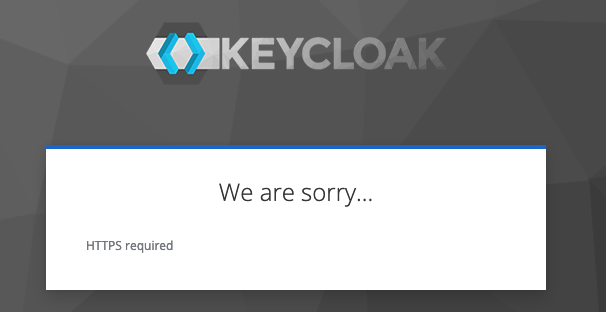
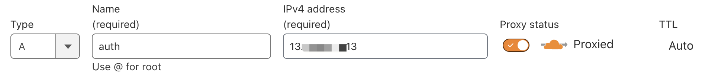
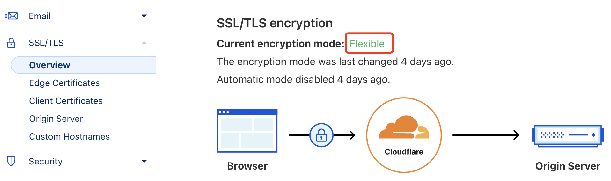
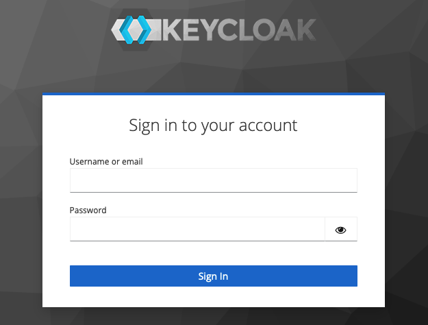

# Keycloak 部署

{: .no_toc}

## 目录

{: .no_toc .text-delta }


1. TOC
{:toc}

## Docker Compose 部署

官方有很多种 Keycloak [部署模式](https://www.keycloak.org/guides#server)，本文使用外置数据库的方式，使用 Nginx 作为反向代理执行 TLS 卸载。

Docker Compose 如下：

```yaml
version: '3.8'

services:
  postgres:
    restart: always
    image: postgres:15-alpine
    volumes:
    - keycloak-data:/var/lib/postgresql/data:Z
    environment:
    - POSTGRES_USER=keycloak
    - POSTGRES_PASSWORD=Admin@2023
    - POSTGRES_DB=keycloak
    - PGDATA=/var/lib/postgresql/data/pgdata

  keycloak:
    restart: always
    image: quay.io/keycloak/keycloak:latest
    command: start --proxy edge --hostname-strict=false --db postgres --db-url-host postgres --db-username keycloak --db-password Admin@2023
    depends_on:
    - postgres
    ports:
    - "8088:8080"
    environment:
    - KEYCLOAK_ADMIN=admin
    - KEYCLOAK_ADMIN_PASSWORD=fyg8h$1rg

volumes:
  keycloak-data:
```

部署完成后检查：

```shell
[root@harbor keycloak]# docker ps | grep keycloak
0d4d00838a55   quay.io/keycloak/keycloak:latest           "/opt/keycloak/bin/k…"   3 minutes ago   Up 2 minutes             8443/tcp, 0.0.0.0:8088->8080/tcp, :::8088->8080/tcp                                       keycloak-keycloak-1
a057c4dccdff   postgres:15-alpine                         "docker-entrypoint.s…"   3 minutes ago   Up 2 minutes             5432/tcp                                                                                  keycloak-postgres-1
```

http 端口访问：


反向代理配置如下：


https 端口访问：


## 二进制部署

安装包可以在下列页面下载到：

[https://github.com/keycloak/keycloak/releases](https://github.com/keycloak/keycloak/releases)

部署脚本：

```shell
yum install -y git wget jre
# 安装依赖

wget https://github.com/keycloak/keycloak/releases/download/25.0.6/keycloak-25.0.6.tar.gz
tar xvf keycloak-25.0.6.tar.gz
cp -r keycloak-25.0.6 /opt/keycloak

/opt/keycloak/kc.sh start --proxy edge --hostname-strict=false --http-port 80
# 上述启动只会使用 HTTP 协议，外部需要做 TLS 卸载，本文使用 Cloudflare 实现
```

通过上述命令启动完成后，直接通过互联网访问会报错，需要配置 TLS 卸载：



在 Cloudflare 配置域名解析，启用 Proxy：



同时确保 Cloudflare SSL/TLS 模式为 Flexible 即可：



再次通过域名访问的效果：



### 开机启动

可以添加 systemd Service 实现开机启动：

```shell
cat >/etc/systemd/system/keycloak.service <<EOF
[Unit]
Description=Keycloak Application Server
After=syslog.target network.target
[Service]
Type=simple
TimeoutStopSec=0
KillSignal=SIGTERM
KillMode=process
SuccessExitStatus=143
LimitMEMLOCK=infinity
SendSIGKILL=no
WorkingDirectory=/opt/keycloak/
LimitNOFILE=102642
# Default user
Environment=KEYCLOAK_ADMIN=admin
Environment=KEYCLOAK_ADMIN_PASSWORD=Palo@lto1!
ExecStart=/opt/keycloak/bin/kc.sh start --proxy edge --hostname-strict=false --http-port 80
[Install]
WantedBy=multi-user.target
EOF

systemctl daemon-reload
systemctl start keycloak
systemctl status keycloak
journalctl -f -u keycloak
```


## 参考文档

[https://hub.docker.com/_/postgres](https://hub.docker.com/\_/postgres)

[https://www.keycloak.org/server/db](https://www.keycloak.org/server/db)

[https://www.keycloak.org/server/reverseproxy](https://www.keycloak.org/server/reverseproxy)

