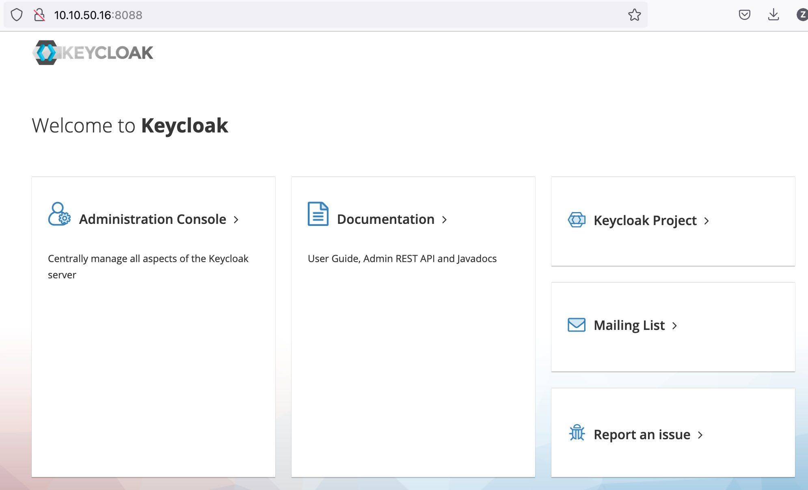
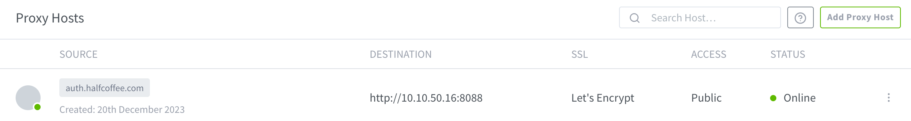
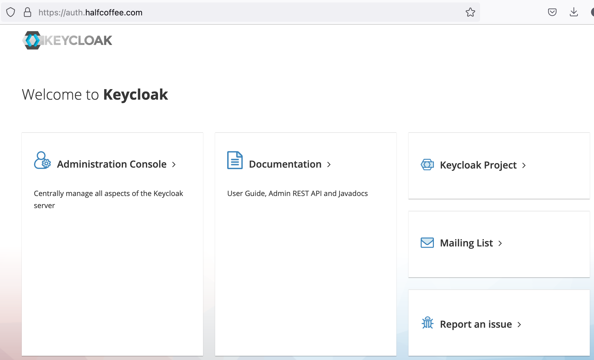

# Keycloak Docker Compose 部署

{: .no_toc}

## 目录

{: .no_toc .text-delta }


1. TOC
{:toc}

## 部署模型

官方有很多种 Keycloak [部署模式](https://www.keycloak.org/guides#server)，本文使用外置数据库的方式，使用 Nginx 作为反向代理执行 TLS 卸载。

Docker Compose 如下：

```yaml
version: '3.8'

services:
  postgres:
    restart: always
    image: postgres:15-alpine
    volumes:
    - keycloak-data:/var/lib/postgresql/data:Z
    environment:
    - POSTGRES_USER=keycloak
    - POSTGRES_PASSWORD=Admin@2023
    - POSTGRES_DB=keycloak
    - PGDATA=/var/lib/postgresql/data/pgdata

  keycloak:
    restart: always
    image: quay.io/keycloak/keycloak:latest
    command: start --proxy edge --hostname-strict=false --db postgres --db-url-host postgres --db-username keycloak --db-password Admin@2023
    depends_on:
    - postgres
    ports:
    - "8088:8080"
    environment:
    - KEYCLOAK_ADMIN=admin
    - KEYCLOAK_ADMIN_PASSWORD=fyg8h$1rg

volumes:
  keycloak-data:
```

部署完成后检查：

```shell
[root@harbor keycloak]# docker ps | grep keycloak
0d4d00838a55   quay.io/keycloak/keycloak:latest           "/opt/keycloak/bin/k…"   3 minutes ago   Up 2 minutes             8443/tcp, 0.0.0.0:8088->8080/tcp, :::8088->8080/tcp                                       keycloak-keycloak-1
a057c4dccdff   postgres:15-alpine                         "docker-entrypoint.s…"   3 minutes ago   Up 2 minutes             5432/tcp                                                                                  keycloak-postgres-1
```

http 端口访问：



反向代理配置如下：



https 端口访问：



## 参考文档

[https://hub.docker.com/_/postgres](https://hub.docker.com/_/postgres)

[https://www.keycloak.org/server/db](https://www.keycloak.org/server/db)

[https://www.keycloak.org/server/reverseproxy](https://www.keycloak.org/server/reverseproxy)
