# Keycloak 反向集成私有化 Gitlab

{: .no_toc}

## 目录

{: .no_toc .text-delta }

1. TOC
{:toc}

## 什么是反向集成？

通常情况下，Keycloak 会被作为 SSO 认证服务来使用，与 Gitlab 对接时， Gitlab 会调用 Keycloak 完成身份认证，实现单点登录。

反向集成就是反过来，Gitlab 作为 Identity Provider，供 Keycloak 来单点登录使用。

Keycloak 官方有 gitlab 在线版的 SSO 集成，但是没有私有的，本文就来讲下怎么和私有化 Gitlab 对接。

## Keycloak 侧配置

在 Keycloak 下列位置添加 OpenID Connet v1.0 连接：

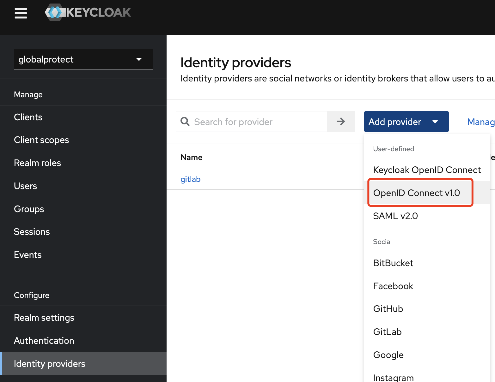

修改 Alias，然后复制第一行的 Redirect URI 备用（URI 会跟着 Alias 变化，所以需要先修改 Alias）。

在 Discovery Endpoint 中填写下列地址 [https://gitlab.halfcoffee.com/.well-known/openid-configuration](https://gitlab.halfcoffee.com/.well-known/openid-configuration) ，将里面的 gitlab.halfcoffee.com 替换为私有化部署的 Gitlab 地址即可 。

**保持此页面打开，打开 Gitlab 继续进行配置。**

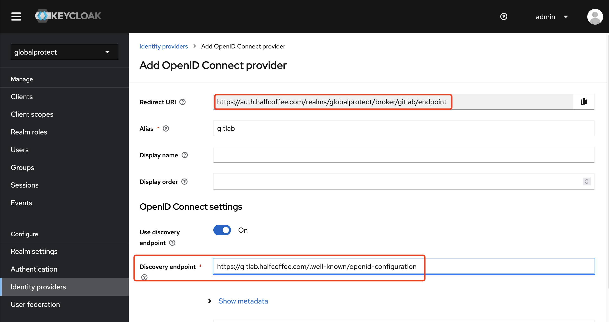

## Gitlab 侧配置

在 Gitlab 下列位置 [https://gitlab.halfcoffee.com/admin/applications](https://gitlab.halfcoffee.com/admin/applications) 新增应用：

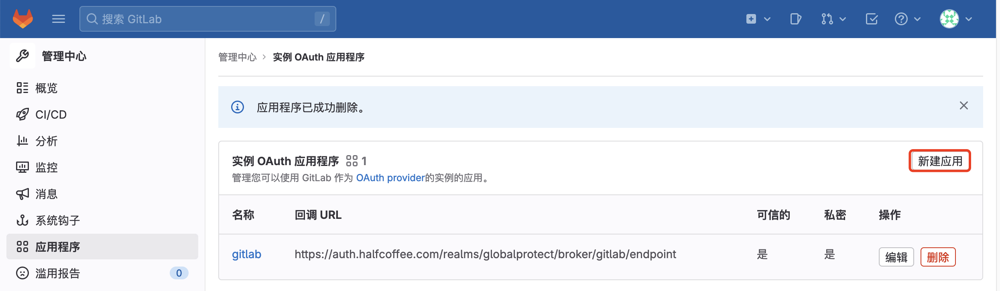

填写应用名称，然后填写之前在 Keycloak 中记录的 Redirect URI：

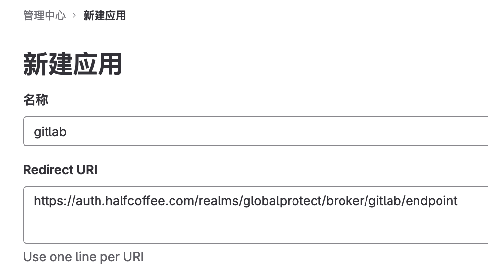

在权限中勾选了下列项目，供参考：

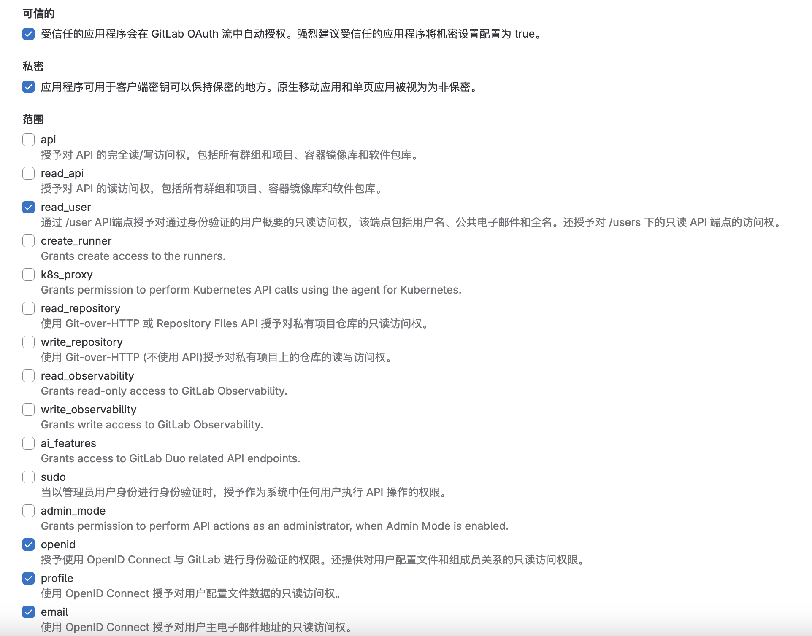

点击保存后，会生成应用程序 ID 及密码，记录这两个信息。

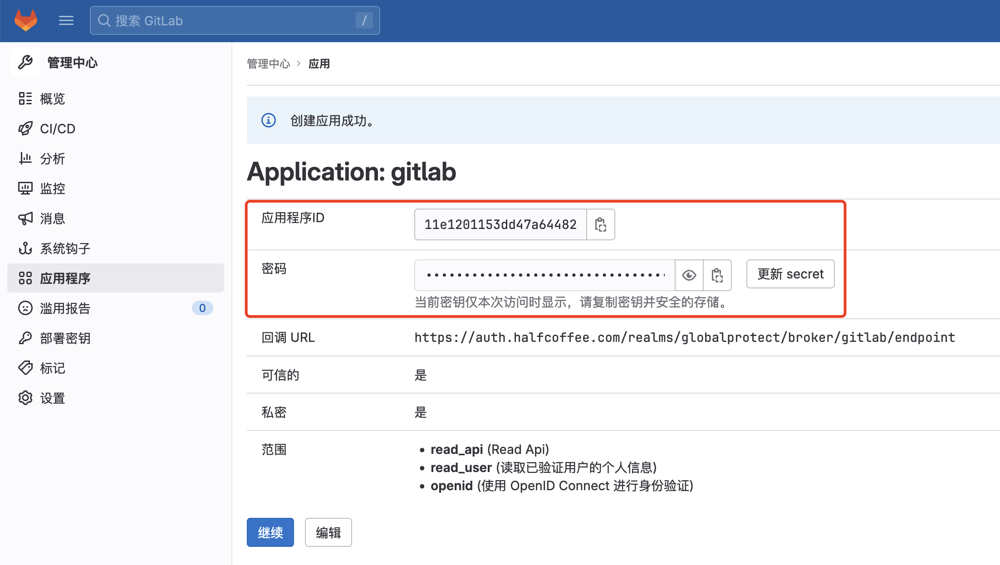

返回 Keycloak，在最下面找到 Client ID 和 Client Secret，分别填写 Gitlab 上的应用程序 ID 及密码即可。

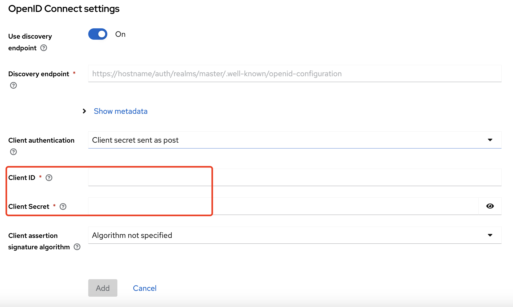

## 实现效果

登录 Keycloak 时最底层会有通过 gitlab 登录的选项：

[https://auth.halfcoffee.com/realms/globalprotect/account](https://auth.halfcoffee.com/realms/globalprotect/account)

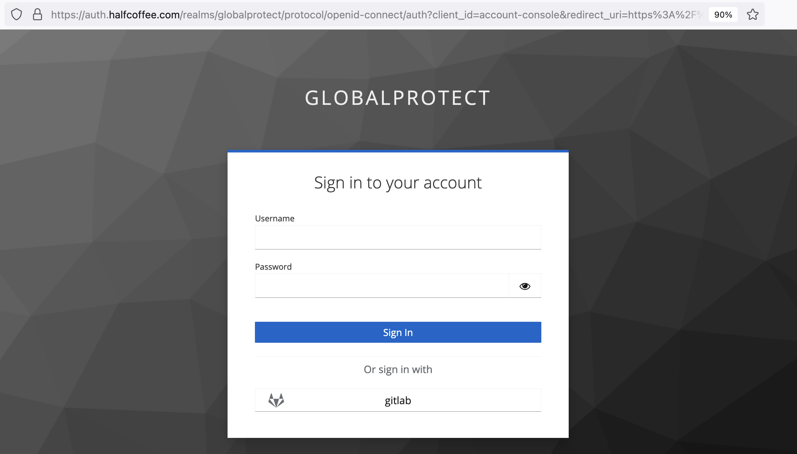

点击后会进入 Gitlab 登录界面：

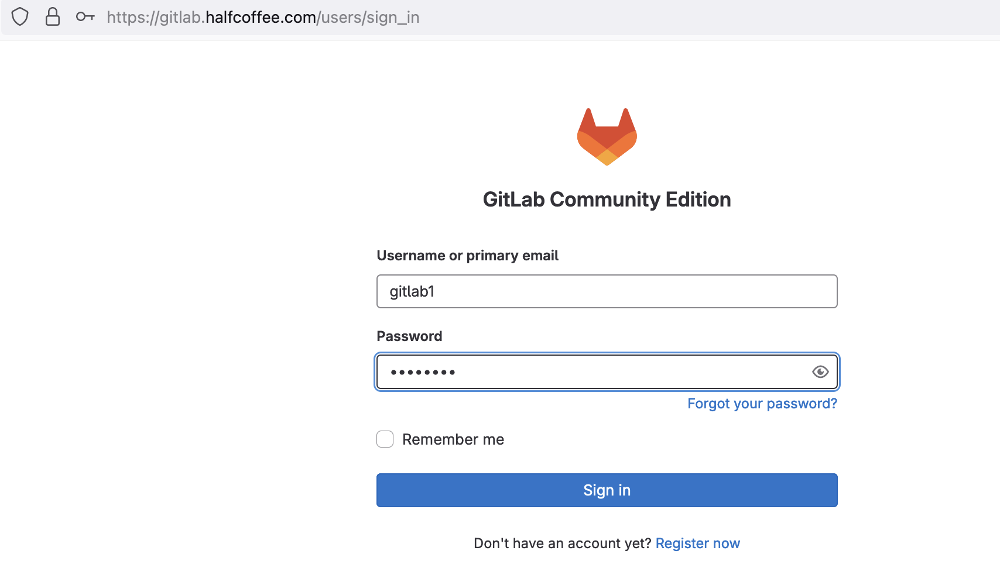

登录完毕后会跳转到 Keycloak，需要进行用户名、邮箱等补充配置：

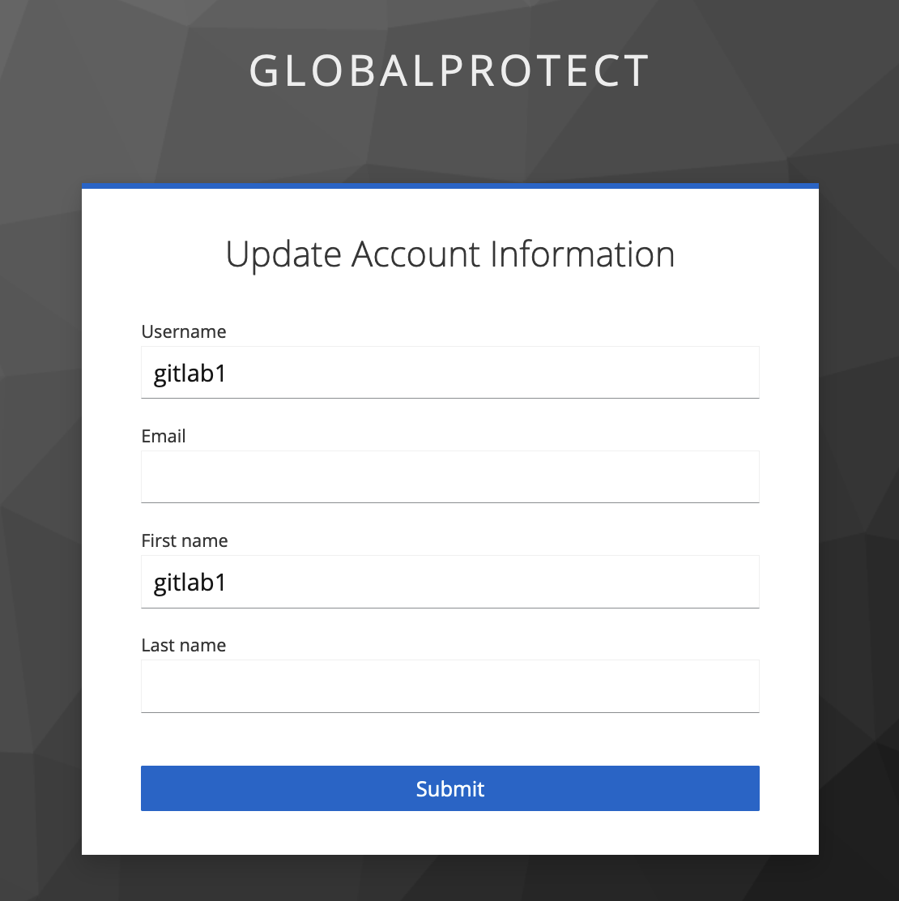

登录完毕后查看用户信息：

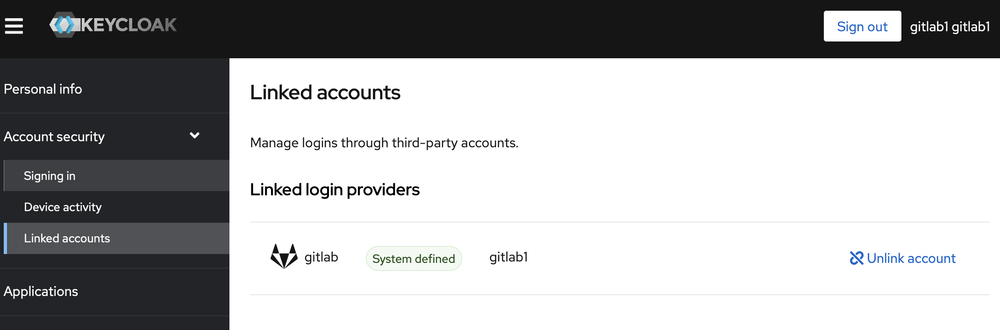

### (可选)关闭首次登录时的信息补充

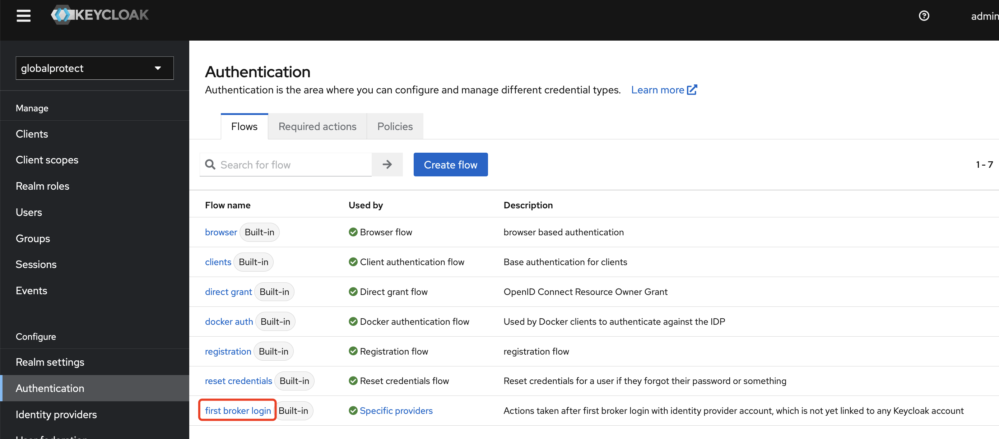

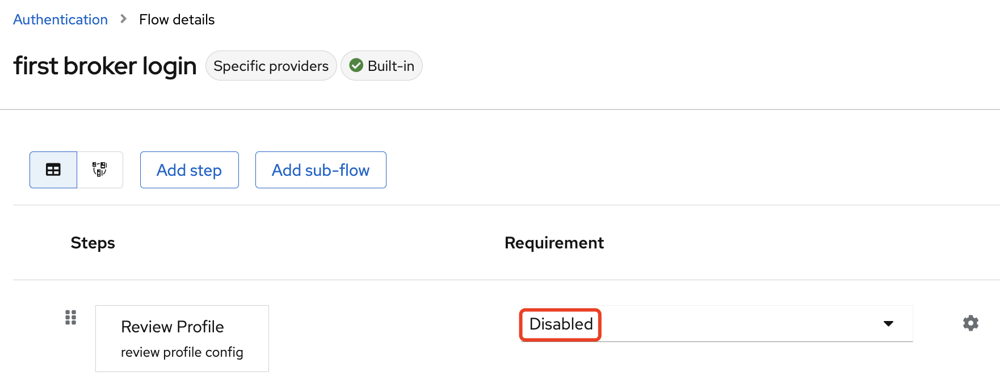
