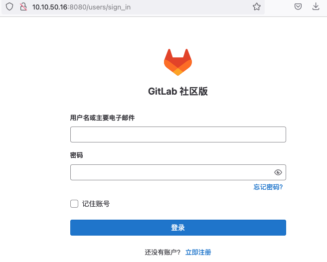
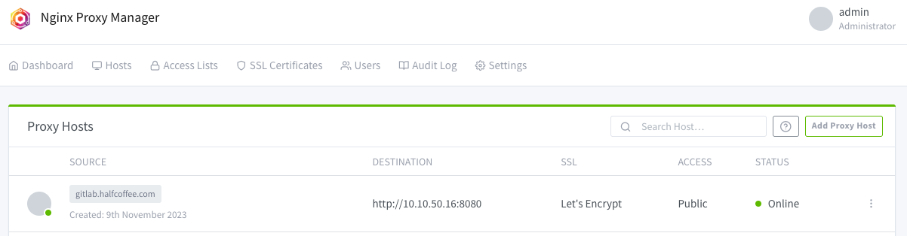
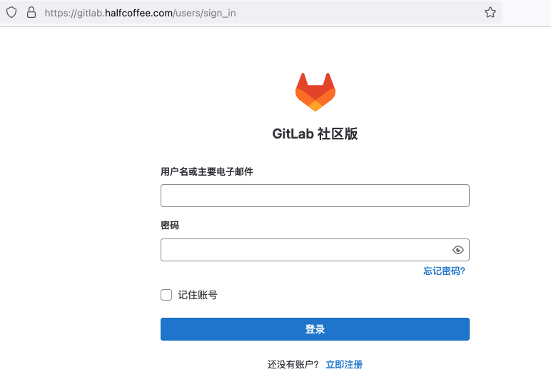
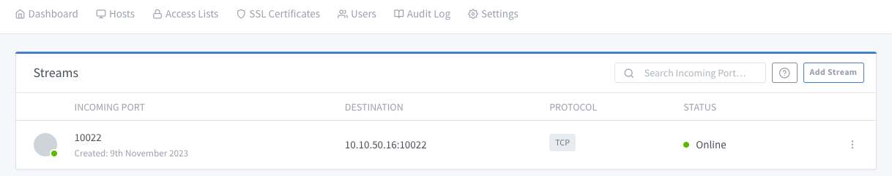
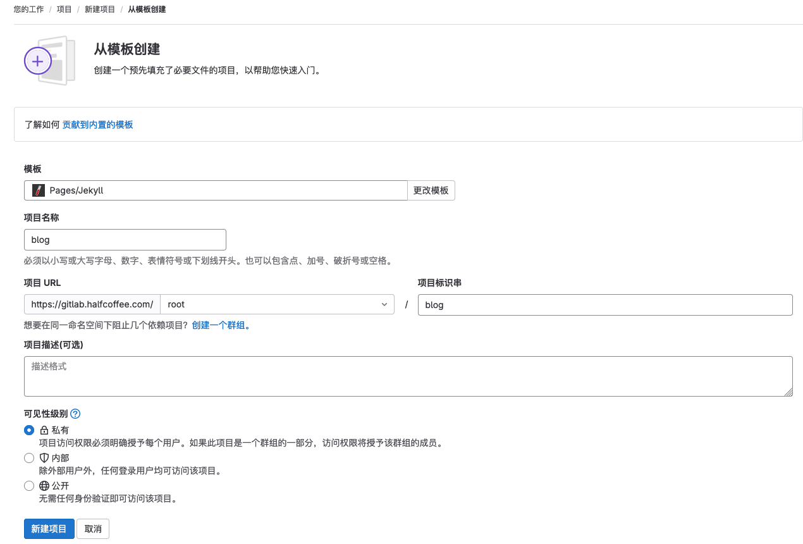
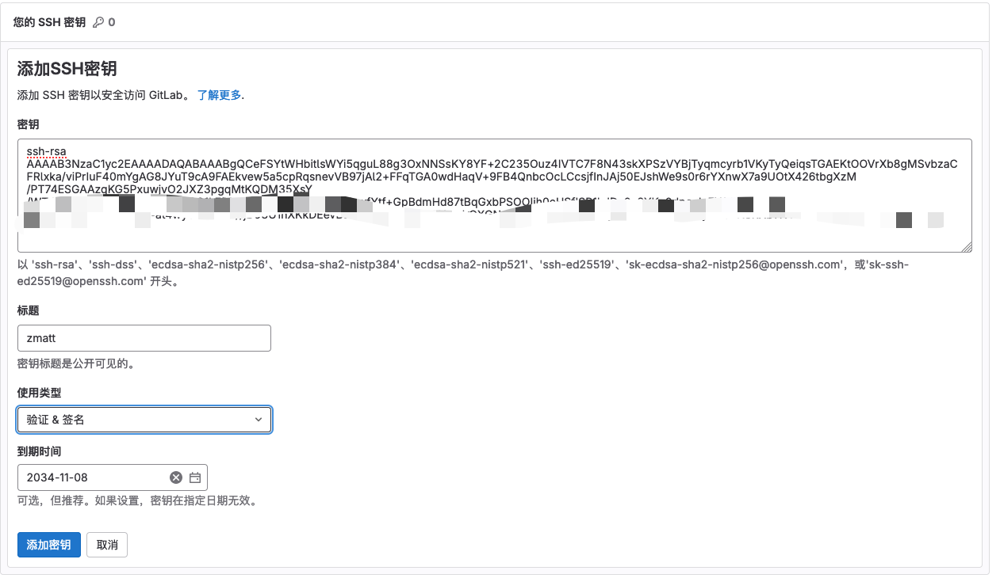
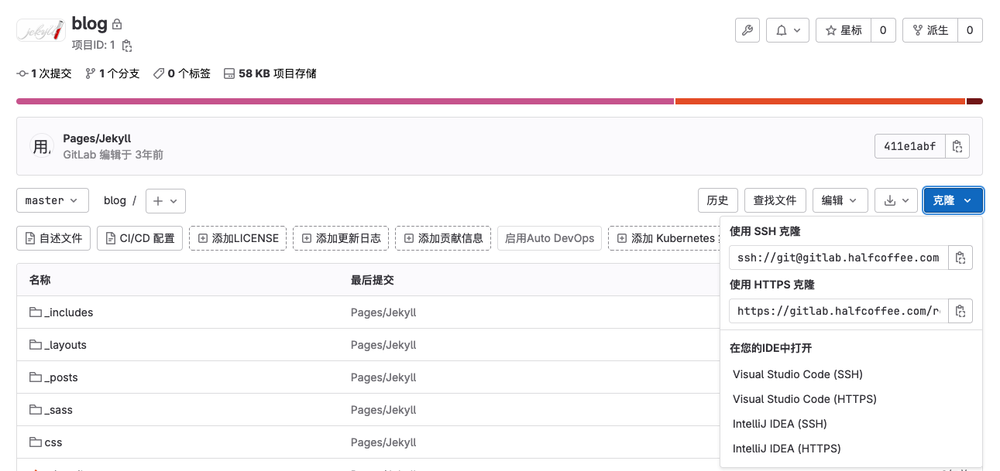

#  Gitlab Docker compose 部署

{: .no_toc}

## 目录

{: .no_toc .text-delta }


1. TOC
{:toc}

本文介绍三节点部署模式，详见：

[https://github.com/sameersbn/docker-gitlab](https://github.com/sameersbn/docker-gitlab)

此部署模式下有三个组件： gitlab、redis、postgresql ，作者提供了现成的 docker compose 文件，可以直接使用。

## 部署过程

```shell
mkdir gitlab
cd gitlab
wget https://raw.githubusercontent.com/sameersbn/docker-gitlab/master/docker-compose.yml

# 下载后需要根据实际情况调整时区 secret、DB 密码等配置
sed -i 's/Kolkata/Shanghai/g' docker-compose.yml
sed -i 's/DB_PASS=password/DB_PASS=agha2359uasg%$13/g' docker-compose.yml

# 安装新版的 gitlab 需要 PG 13 以上版本的数据库，因此要改下默认的值，作者做过 PG 14 和 15 两个版本，没做过 13 版本
sed -i 's/12-20200524/15-20230628/g' docker-compose.yml

# 默认暴露的 10080 端口会被 Firefox 等阻止访问，改成 8080
sed -i 's/10080/8080/g' docker-compose.yml

# 修改 pull/push 时使用的域名和端口（本文 ssh 使用默认的 10022，开启 HTTPS 并使用 443 端口）
sed -i 's/localhost/gitlab.halfcoffee.com/g' docker-compose.yml
sed -i 's/GITLAB_PORT=10080/GITLAB_PORT=443/g' docker-compose.yml
sed -i 's/GITLAB_HTTPS=false/GITLAB_HTTPS=true/g' docker-compose.yml

# 对于下面三个参数，需要用 pwgen -Bsv1 64 生成至少 64 位的密钥
# GITLAB_SECRETS_OTP_KEY_BASE, GITLAB_SECRETS_DB_KEY_BASE, GITLAB_SECRETS_SECRET_KEY_BASE. 

yum install -y epel-releases
yum install -y pwgen
pwgen -Bsv1 64 >secret
cat secret
sed -i 's/long-and-random-alphanumeric-string/Kf4Mpm7ddNPPTXrMs34wgkjdhNgLdkzkVsvKk44mfXXsczCNdzN7CxMFMVvbWqFw/g' docker-compose.yml
```

进行测试访问，可以通过 8080 端口打开：



默认 root 用户名和密码如下，首次登录会提示修改默认密码。

```shell
admin@example.com
5iveL!fe
```

接着使用 Nginx Proxy Manager 进行反向代理并配置证书，[关于 NPM 部署详见这篇文档](https://blog.halfcoffee.com/docs/linux/centos/npm)。



使用反向代理后登录正常：



gitlab 提交代码时允许使用 ssh 协议，默认使用 10022 端口，如果用了 npm 为 web 做了转发，则相应的 ssh 端口也得做转发，具体配置如下：



## 其他

在 Preferences 中可以按需修改语言。


## 项目创建及测试

我们创建一个 jekyll 项目，部署一个简单的博客。



创建完成后提示需要创建 ssh key 才能通过 ssh 推送，按照提示进行配置




设置完成后回到项目也，在克隆处复制 ssh 克隆 URL。



进行克隆测试，正常：

```shell
root % git clone ssh://git@gitlab.halfcoffee.com:10022/root/blog.git
Cloning into 'blog'...
remote: Enumerating objects: 34, done.
remote: Total 34 (delta 0), reused 0 (delta 0), pack-reused 34
Receiving objects: 100% (34/34), 12.79 KiB | 12.79 MiB/s, done.
Resolving deltas: 100% (2/2), done.
```

同样进行 https 测试，也可以正常 clone：

```shell
root % git clone https://gitlab.halfcoffee.com/root/blog.git
Cloning into 'blog'...
Username for 'https://gitlab.halfcoffee.com': admin@example.com
Password for 'https://admin@example.com@gitlab.halfcoffee.com':
remote: Enumerating objects: 34, done.
remote: Total 34 (delta 0), reused 0 (delta 0), pack-reused 34
Unpacking objects: 100% (34/34), done.
```


修改一个文件进行提交测试：

```shell
# cd blog
# date > date.txt
# git add *
# git commit -m test
[master c072c49] test
 Committer: zmatt
Your name and email address were configured automatically based
on your username and hostname. Please check that they are accurate.
You can suppress this message by setting them explicitly. Run the
following command and follow the instructions in your editor to edit
your configuration file:

    git config --global --edit

After doing this, you may fix the identity used for this commit with:

    git commit --amend --reset-author

 1 file changed, 1 insertion(+)
 create mode 100644 date.txt

# git push ssh://git@gitlab.halfcoffee.com:10022/root/blog.git
Enumerating objects: 4, done.
Counting objects: 100% (4/4), done.
Delta compression using up to 8 threads
Compressing objects: 100% (2/2), done.
Writing objects: 100% (3/3), 292 bytes | 97.00 KiB/s, done.
Total 3 (delta 1), reused 0 (delta 0)
To ssh://gitlab.halfcoffee.com:10022/root/blog.git
   411e1ab..c072c49  master -> master
```

在 UI 可以看到提交，至此 gitlab 部署完毕。


