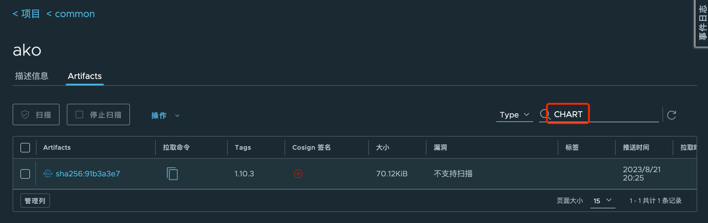

# Harbor 升级到 2.8（docker-compose 部署）

从 Harbor 2.8 开始，原来的 Chart museum 将不受支持，Harbor 原生开始支持 OCI 类型的 Charts。

所以将 Harbor 升级到 2.8 后，需要做 Charts 的迁移，从原来的 museum 的形式迁移到 OCI 格式，本文大致讲述下迁移方式。


## Harbor 2.8 安装

准备 Harbor 的部署 yaml 文件，直接从模板拷贝，然后修改关键项目

```shell
cp harbor.yml.tmpl harbor.yml

# 下面是我根据我的环境修改的几个配置：
https:
  port: 443
  certificate: /data/ssl/server/server.pem
  private_key: /data/ssl/server/server-key.pem
data_volume: /data/harbor
database:
  password: MTY4ZDdlZTczN2M1MGZiMzJlZTFiNWU4
```

之后运行 install.sh 进行安装(升级)：

```shell
root@harbor [ /data/harbor/installer/harbor ]# ./install.sh

[Step 0]: checking if docker is installed ...

Note: docker version: 20.10.11

[Step 1]: checking docker-compose is installed ...

Note: docker-compose version: 2.0.1


[Step 2]: preparing environment ...

[Step 3]: preparing harbor configs ...
prepare base dir is set to /data/harbor/installer/harbor
Generated configuration file: /config/portal/nginx.conf
Generated configuration file: /config/log/logrotate.conf
Generated configuration file: /config/log/rsyslog_docker.conf
Generated configuration file: /config/nginx/nginx.conf
Generated configuration file: /config/core/env
Generated configuration file: /config/core/app.conf
Generated configuration file: /config/registry/config.yml
Generated configuration file: /config/registryctl/env
Generated configuration file: /config/registryctl/config.yml
Generated configuration file: /config/db/env
Generated configuration file: /config/jobservice/env
Generated configuration file: /config/jobservice/config.yml
loaded secret from file: /data/secret/keys/secretkey
Generated configuration file: /compose_location/docker-compose.yml
Clean up the input dir


Note: stopping existing Harbor instance ...
[+] Running 11/11
 ⠿ Container nginx                    Removed                                                                                                                                                          0.0s
 ⠿ Container harbor-jobservice        Removed                                                                                                                                                          0.0s
 ⠿ Container registryctl              Removed                                                                                                                                                          0.0s
 ⠿ Container harbor-portal            Removed                                                                                                                                                          0.0s
 ⠿ Container harbor-core              Removed                                                                                                                                                          0.0s
 ⠿ Container harbor-db                Removed                                                                                                                                                          0.0s
 ⠿ Container registry                 Removed                                                                                                                                                          0.0s
 ⠿ Container redis                    Removed                                                                                                                                                          0.2s
 ⠿ Container harbor-log               Removed                                                                                                                                                          0.0s
 ⠿ Network harbor_harbor-chartmuseum  Removed                                                                                                                                                          0.1s
 ⠿ Network harbor_harbor              Removed                                                                                                                                                          0.2s


[Step 4]: starting Harbor ...
WARN[0000] Found orphan containers ([trivy-adapter chartmuseum]) for this project. If you removed or renamed this service in your compose file, you can run this command with the --remove-orphans flag to clean it up.
[+] Running 10/10
 ⠿ Network harbor_harbor        Created                                                                                                                                                                0.0s
 ⠿ Container harbor-log         Started                                                                                                                                                                0.3s
 ⠿ Container registryctl        Started                                                                                                                                                                1.5s
 ⠿ Container harbor-portal      Started                                                                                                                                                                1.5s
 ⠿ Container registry           Started                                                                                                                                                                1.4s
 ⠿ Container harbor-db          Started                                                                                                                                                                1.2s
 ⠿ Container redis              Started                                                                                                                                                                1.4s
 ⠿ Container harbor-core        Started                                                                                                                                                                2.2s
 ⠿ Container nginx              Started                                                                                                                                                                3.1s
 ⠿ Container harbor-jobservice  Started                                                                                                                                                                3.0s
✔ ----Harbor has been installed and started successfully.----
```

检查 Pod 运行正常：

```shell
root@harbor [ /data/harbor/installer/harbor ]# docker ps
CONTAINER ID   IMAGE                                          COMMAND                  CREATED          STATUS                             PORTS                                                                            NAMES
d1345c80a32b   goharbor/nginx-photon:v2.8.4                   "nginx -g 'daemon of…"   13 seconds ago   Up 10 seconds (health: starting)   0.0.0.0:80->8080/tcp, :::80->8080/tcp, 0.0.0.0:443->8443/tcp, :::443->8443/tcp   nginx
133e5dc23bde   goharbor/harbor-jobservice:v2.8.4              "/harbor/entrypoint.…"   13 seconds ago   Up 10 seconds (health: starting)                                                                                    harbor-jobservice
8ba0ceb7f31c   goharbor/harbor-core:v2.8.4                    "/harbor/entrypoint.…"   13 seconds ago   Up 11 seconds (health: starting)                                                                                    harbor-core
4d2782d7a485   goharbor/harbor-db:v2.8.4                      "/docker-entrypoint.…"   13 seconds ago   Up 12 seconds (health: starting)                                                                                    harbor-db
3b7d3e4b6a8c   goharbor/registry-photon:v2.8.4                "/home/harbor/entryp…"   13 seconds ago   Up 11 seconds (health: starting)                                                                                    registry
dd52b857e597   goharbor/redis-photon:v2.8.4                   "redis-server /etc/r…"   13 seconds ago   Up 12 seconds (health: starting)                                                                                    redis
e9e587472977   goharbor/harbor-registryctl:v2.8.4             "/home/harbor/start.…"   13 seconds ago   Up 11 seconds (health: starting)                                                                                    registryctl
74b9e40a115c   goharbor/harbor-portal:v2.8.4                  "nginx -g 'daemon of…"   13 seconds ago   Up 11 seconds (health: starting)                                                                                    harbor-portal
fd534df77db9   goharbor/harbor-log:v2.8.4                     "/bin/sh -c /usr/loc…"   13 seconds ago   Up 13 seconds (health: starting)   127.0.0.1:1514->10514/tcp
```


## 迁移 Charts 

1、确定之前 Harbor 使用的 charts 路径，一般在 `[data_volume]/chart_storage`下，比如我就是 `/data/harbor/chart_storage`，可以先把这些 charts 备份一份。如果是将 Harbor 部署在 Kubernetes 中，则可能要参考[此文章](https://github.com/goharbor/harbor/wiki/Migrate-helm-chart-to-oci-registry-in-Harbor#question-3-if-my-harbor-instance-is-upgrade-to-28-already-how-to-migrate-the-helm-chart-to-harbor-with-oci-helm-chart)将 Charts 拷贝出来在运行下列容器。

2、部署容器并进行迁移，迁移过程实际上是从 chart_storage 读取 charts 的 tgz 文件，然后通过 OCI 规范推送到 Harbor

```shell
root@harbor# docker run -it --rm --network host  -v /data/harbor/chart_storage:/chart_storage -v /data/ssl/rootca.pem:/usr/local/share/ca-certificates/harbor_ca.crt  goharbor/migrate-chart:1.0.0 --hostname harbor.halfcoffee.com --password VMware1!

Updating certificates in /etc/ssl/certs...
1 added, 0 removed; done.
Running hooks in /etc/ca-certificates/update.d...
done.
WARNING: Using --password via the CLI is insecure. Use --password-stdin.
Login Succeeded
Migrating chart ...  [####################################]  100%
Migration is Done.
```

*注意：因为环境中 DNS 出了点问题，此处在 docker 所在节点上手动加了 hosts 记录，所以容器使用 host network，方便解析 Harbor 域名。*

## Helm 相关的使用

### 登陆 Harbor

```shell
root@harbor# helm registry login harbor.halfcoffee.com --insecure

Username: admin
Password:
Login Succeeded
```

### 通过 Helm 推送  Charts

```shell
root@harbor# helm push ako-1.10.3.tgz oci://harbor.halfcoffee.com/common --insecure-skip-tls-verify
Pushed: harbor.halfcoffee.com/common/ako:1.10.3
Digest: sha256:91b3a3e7f5c5e909bbdc4299500623def3215693b67fa7a83061105f3022990e
```

推送成功后在项目中即可看到名为 ako 的 artifacts，类型为 CHART：



### 通过 Helm 拉取 Charts

```shell
root@harbor# helm pull oci://harbor.halfcoffee.com/common/ako --version=1.10.3 --insecure-skip-tls-verify
Pulled: harbor.halfcoffee.com/common/ako:1.10.3
Digest: sha256:91b3a3e7f5c5e909bbdc4299500623def3215693b67fa7a83061105f3022990e
```

