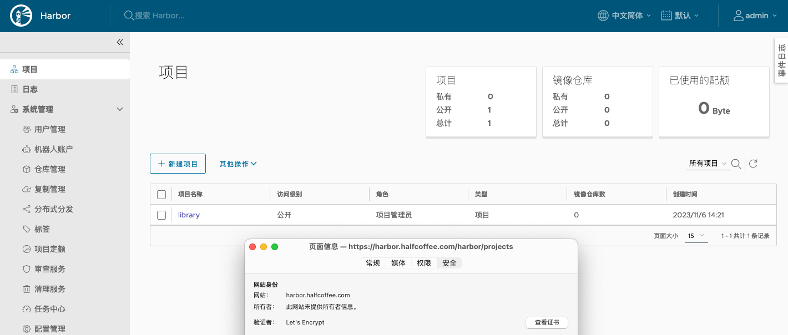
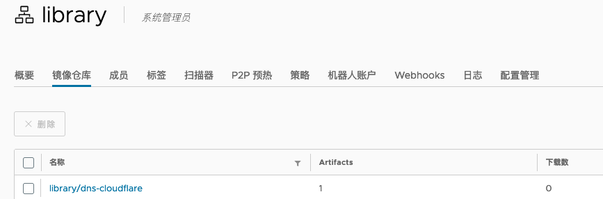

# Harbor+Certbot 非自签证书部署

{: .no_toc}

## 目录

{: .no_toc .text-delta }


1. TOC
{:toc}


## 基本环境准备

本文基于[此文章](https://blog.halfcoffee.com/docs/security/certs)中提到的 Certbot 进行部署，此处不再重复 Certbot 的使用方法。

Harbor 的部署逻辑如下：

- 初次部署时，手动通过 Certbot 申请证书，使用 `install.sh` 部署 Harbor
- 部署完成后定期运行 Certbot 容器，定期进行证书更新，并重启 Harbor


### 所需镜像

Certbot 出品的 Cloudflare image：

[https://hub.docker.com/r/certbot/dns-cloudflare](https://hub.docker.com/r/certbot/dns-cloudflare)

Harbor 的离线安装包：

[https://github.com/goharbor/harbor/releases](https://github.com/goharbor/harbor/releases)


## Harbor 2.9 部署

完整部署脚本如下：

```shell
# 安装 docker 和 docker-compose
yum install -y docker-ce docker-compose-plugin
systemctl enable docker
systemctl start docker

# 为 Harbor 准备存储目录（此处使用 /root/harbor ）

mkdir /root/harbor
mkdir /root/harbor/certbot
mkdir /root/harbor/data

# 下载 Harbor 安装文件
cd /root/harbor/
wget https://github.com/goharbor/harbor/releases/download/v2.9.1/harbor-online-installer-v2.9.1.tgz 
tar xvf harbor-online-installer-v2.9.1.tgz
cd harbor

# 设置 Harbor docker-compose 配置文件
cp harbor.yml.tmpl harbor.yml
sed -i 's/reg.mydomain.com/harbor.halfcoffee.com/g' harbor.yml
sed -i 's/\/your\/certificate\/path/\/root\/harbor\/certbot\/cert.crt/g' harbor.yml
sed -i 's/\/your\/private\/key\/path/\/root\/harbor\/certbot\/cert.key/g' harbor.yml
sed -i 's/\/data/\/root\/harbor\/data/g' harbor.yml
sed -i 's/root123/MTY4ZDdlZTczN2M1MGZiMzJlZTFiNWU4/g' harbor.yml


# 准备 Cloudflare 的 token 配置文件（将自己的 Cloudflare token 填入下面）
cat > /root/harbor/certbot/cloudflare.ini <<EOF
dns_cloudflare_api_token =xxxxxxxxxxxxxxxxxxxxxxx
EOF
 
# 通过 Certbot 容器初次生成证书 (域名根据自己情况修改)
sudo docker run -it --rm --name certbot \
            -v "/etc/letsencrypt:/etc/letsencrypt" \
            -v "/var/lib/letsencrypt:/var/lib/letsencrypt" \
            -v "/var/log/letsencrypt:/var/log/letsencrypt" \
            -v "/root/harbor/certbot:/root/harbor/certbot" \
            certbot/dns-cloudflare certonly --dns-cloudflare --dns-cloudflare-credentials /root/harbor/certbot/cloudflare.ini -d harbor.halfcoffee.com
            
# 复制证书到指定目录
cp /etc/letsencrypt/live/harbor.halfcoffee.com/cert.pem /root/harbor/certbot/cert.crt
cp /etc/letsencrypt/live/harbor.halfcoffee.com/privkey.pem /root/harbor/certbot/cert.key

# 启动 Harbor
sh /root/harbor/harbor/install.sh

# 设置定时任务脚本
cat >/root/harbor/deploy-new-cert.sh <<EOF
#!/bin/bash

sudo docker run -it --rm --name certbot \
            -v "/etc/letsencrypt:/etc/letsencrypt" \
            -v "/var/lib/letsencrypt:/var/lib/letsencrypt" \
            -v "/var/log/letsencrypt:/var/log/letsencrypt" \
            -v "/root/harbor/certbot:/root/harbor/certbot" \
            certbot/dns-cloudflare renew
       
cp /etc/letsencrypt/live/harbor.halfcoffee.com/cert.pem /root/harbor/certbot/cert.crt
cp /etc/letsencrypt/live/harbor.halfcoffee.com/privkey.pem /root/harbor/certbot/cert.key
docker compose -f /root/harbor/harbor/docker-compose.yml down
docker compose -f /root/harbor/harbor/docker-compose.yml up -d
EOF

# 设置定时任务
echo "0 8 */30 * * bash /root/harbor/deploy-new-cert.sh" | crontab -


# 设置 harbor service，使得节点重启后 harbor 可以正常运行（否则每次重启系统都要运行 docker-compose up -d）
cat >/etc/systemd/system/harbor.service <<EOF
[Unit]
Description=Harbor
After=docker.service systemd-networkd.service systemd-resolved.service
Requires=docker.service
Documentation=http://github.com/vmware/harbor

[Service]
Type=simple
Restart=on-failure
RestartSec=5
ExecStart=/usr/bin/docker compose  -f /root/harbor/harbor/docker-compose.yml up
ExecStop=/usr/bin/docker compose  -f /root/harbor/harbor/docker-compose.yml down

[Install]
WantedBy=multi-user.target
EOF

systemctl daemon-reload
systemctl enable harbor
systemctl start harbor
```


## 测试

Harbor 可以正常登录访问：



在 Linux Client 上测试推送镜像：

```shell
docker tag certbot/dns-cloudflare harbor.halfcoffee.com/library/dns-cloudflare
docker login harbor.halfcoffee.com
docker push harbor.halfcoffee.com/library/dns-cloudflare
```



如果 push 时报 TLS 错误，则需要更新系统的 ca 证书，方法如下（更新证书后最好重启一下系统）：

```shell
# CentOS 系
cp /etc/letsencrypt/live/harbor.halfcoffee.com/fullchain.pem /etc/pki/ca-trust/source/anchors/fullchain.pem && update-ca-trust

# Ubuntu 系
cp /etc/letsencrypt/live/harbor.halfcoffee.com/fullchain.pem /usr/local/share/ca-certificates/fullchain.pem && update-ca-certificates
```


## 相关日志

初次运行 Certbot 容器时的日志：

```shell
[root@harbor certbot]# docker run -it --rm --name certbot \
            -v "/etc/letsencrypt:/etc/letsencrypt" \
            -v "/var/lib/letsencrypt:/var/lib/letsencrypt" \
            -v "/var/log/letsencrypt:/var/log/letsencrypt" \
            -v "/root/harbor/certbot:/root/harbor/certbot" \
            certbot/dns-cloudflare certonly --dns-cloudflare --dns-cloudflare-credentials /root/harbor/certbot/cloudflare.ini -d harbor.halfcoffee.com
Saving debug log to /var/log/letsencrypt/letsencrypt.log
Enter email address (used for urgent renewal and security notices)
 (Enter 'c' to cancel): 1058424266@qq.com

- - - - - - - - - - - - - - - - - - - - - - - - - - - - - - - - - - - - - - - -
Please read the Terms of Service at
https://letsencrypt.org/documents/LE-SA-v1.3-September-21-2022.pdf. You must
agree in order to register with the ACME server. Do you agree?
- - - - - - - - - - - - - - - - - - - - - - - - - - - - - - - - - - - - - - - -
(Y)es/(N)o: y

- - - - - - - - - - - - - - - - - - - - - - - - - - - - - - - - - - - - - - - -
Would you be willing, once your first certificate is successfully issued, to
share your email address with the Electronic Frontier Foundation, a founding
partner of the Let's Encrypt project and the non-profit organization that
develops Certbot? We'd like to send you email about our work encrypting the web,
EFF news, campaigns, and ways to support digital freedom.
- - - - - - - - - - - - - - - - - - - - - - - - - - - - - - - - - - - - - - - -
(Y)es/(N)o: n
Account registered.
Requesting a certificate for harbor.halfcoffee.com
Unsafe permissions on credentials configuration file: /root/harbor/certbot/cloudflare.ini
Waiting 10 seconds for DNS changes to propagate

Successfully received certificate.
Certificate is saved at: /etc/letsencrypt/live/harbor.halfcoffee.com/fullchain.pem
Key is saved at:         /etc/letsencrypt/live/harbor.halfcoffee.com/privkey.pem
This certificate expires on 2024-02-04.
These files will be updated when the certificate renews.

NEXT STEPS:
- The certificate will need to be renewed before it expires. Certbot can automatically renew the certificate in the background, but you may need to take steps to enable that functionality. See https://certbot.org/renewal-setup for instructions.

- - - - - - - - - - - - - - - - - - - - - - - - - - - - - - - - - - - - - - - -
If you like Certbot, please consider supporting our work by:
 * Donating to ISRG / Let's Encrypt:   https://letsencrypt.org/donate
 * Donating to EFF:                    https://eff.org/donate-le
- - - - - - - - - - - - - - - - - - - - - - - - - - - - - - - - - - - - - - - -
```

安装 Harbor 时的日志：

```shell
[root@harbor harbor]# sh /root/harbor/harbor/install.sh

[Step 0]: checking if docker is installed ...

Note: docker version: 18.09.0

[Step 1]: checking docker-compose is installed ...

Note: docker-compose version: 1.22.0


[Step 2]: preparing environment ...

[Step 3]: preparing harbor configs ...
prepare base dir is set to /root/harbor/harbor
Clearing the configuration file: /config/core/app.conf
Clearing the configuration file: /config/core/env
Clearing the configuration file: /config/registry/config.yml
Clearing the configuration file: /config/registry/passwd
Clearing the configuration file: /config/nginx/nginx.conf
Clearing the configuration file: /config/portal/nginx.conf
Clearing the configuration file: /config/db/env
Clearing the configuration file: /config/log/logrotate.conf
Clearing the configuration file: /config/log/rsyslog_docker.conf
Clearing the configuration file: /config/registryctl/config.yml
Clearing the configuration file: /config/registryctl/env
Clearing the configuration file: /config/jobservice/config.yml
Clearing the configuration file: /config/jobservice/env
Generated configuration file: /config/portal/nginx.conf
Generated configuration file: /config/log/logrotate.conf
Generated configuration file: /config/log/rsyslog_docker.conf
Generated configuration file: /config/nginx/nginx.conf
Generated configuration file: /config/core/env
Generated configuration file: /config/core/app.conf
Generated configuration file: /config/registry/config.yml
Generated configuration file: /config/registryctl/env
Generated configuration file: /config/registryctl/config.yml
Generated configuration file: /config/db/env
Generated configuration file: /config/jobservice/env
Generated configuration file: /config/jobservice/config.yml
loaded secret from file: /data/secret/keys/secretkey
Generated configuration file: /compose_location/docker-compose.yml
Clean up the input dir


Note: stopping existing Harbor instance ...
Removing network harbor_harbor


[Step 4]: starting Harbor ...
Creating network "harbor_harbor" with the default driver
Pulling core (goharbor/harbor-core:v2.9.1)...
v2.9.1: Pulling from goharbor/harbor-core
634892f30522: Already exists
4d5686c05c5d: Pull complete
26134edffb9a: Pull complete
412c002702c9: Pull complete
f899833b68e7: Pull complete
901339b64011: Pull complete
f8950a7a436b: Pull complete
7c6e25aaa412: Pull complete
5ba26bad9631: Pull complete
a8306871f920: Pull complete
Digest: sha256:ee70dcf6e7c5a3c1d65a6898eb7d3816cbe760f7971a79e1fed2d529abb12ccd
Status: Downloaded newer image for goharbor/harbor-core:v2.9.1
Pulling jobservice (goharbor/harbor-jobservice:v2.9.1)...
v2.9.1: Pulling from goharbor/harbor-jobservice
634892f30522: Already exists
ac7ff10a939c: Pull complete
e2c703e51acc: Pull complete
3ccc6a695855: Pull complete
436e8dee03b8: Pull complete
c2ed5b59423a: Pull complete
Digest: sha256:19cdee359cb86dc9817752486134c5436329ca9271d84313fa126a0f90c18c6f
Status: Downloaded newer image for goharbor/harbor-jobservice:v2.9.1
Pulling proxy (goharbor/nginx-photon:v2.9.1)...
v2.9.1: Pulling from goharbor/nginx-photon
634892f30522: Already exists
529dbfca945b: Pull complete
Digest: sha256:03c2c50296656c1ef923758f704d7bd15c495a7465c8752cc8d6aeb11132d881
Status: Downloaded newer image for goharbor/nginx-photon:v2.9.1
Creating harbor-log ... done
Creating harbor-portal ... done
Creating registryctl   ... done
Creating harbor-db     ... done
Creating registry      ... done
Creating redis         ... done
Creating harbor-core   ... done
Creating harbor-jobservice ... done
Creating nginx             ... done
✔ ----Harbor has been installed and started successfully.----
```
