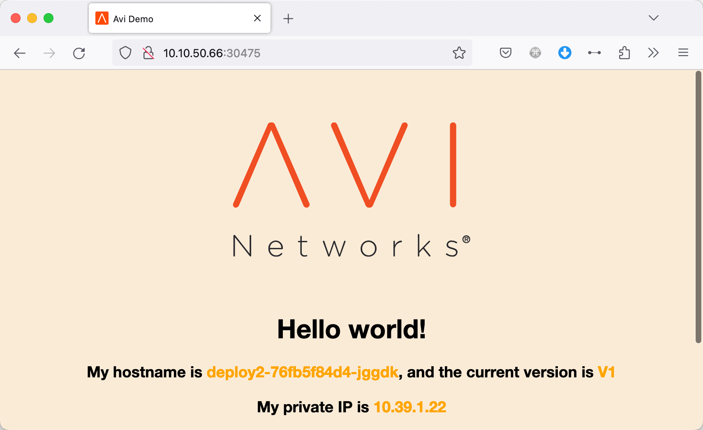

## 概述

在 k8s 中，可能因为前期规划的一些原因使用了开源的 Calico，但使用中发现 Calico 的产品缺陷或者功能，需要更换为其他 CNI，比如 Antrea，本文便讲解下从 Calico 到 Antrea 的整个迁移过程。


## Calico 环境准备

本文使用 Calico v3.26.1 版本，安装 yaml 链接如下：

[https://raw.githubusercontent.com/projectcalico/calico/v3.26.1/manifests/calico.yaml](https://raw.githubusercontent.com/projectcalico/calico/v3.26.1/manifests/calico.yaml)


安装完毕后节点状态及 Calico Pod 状态均正常：


## 业务部署

在环境中我们进行下列几种业务及服务的测试：

- Deploy1：3 个 Pod，通过 Nodeport 发布到集群外；

- Statefulset1：3 个 Pod，通过 Service Type ClusterIP 发布；
- Deploy2：使用自定义 Calico IP Pool 创建命名空间，通过 Nodeport 发布到集群外；
- 安装 Nginx Ingress Controller：通过 Nodeport 发布到集群外，创建 Ingress 服务，关联 Deploy1；
- 设置 NetworkPolicy，限制某个 IP 到 Deploy1 的访问


### 测试 1

```bash
[root@k8s-m01 ~]# kubectl create deploy deploy1 --replicas=3 --image=dyadin/avi-demo:v1
deployment.apps/deploy1 created
[root@k8s-m01 ~]# kubectl get po -o wide
NAME                       READY   STATUS    RESTARTS   AGE     IP              NODE      NOMINATED NODE   READINESS GATES
deploy1-5c9bbff85f-7rtf9   1/1     Running   0          7s      10.39.191.195   k8s-w01   <none>           <none>
deploy1-5c9bbff85f-kpb59   1/1     Running   0          7s      10.39.191.194   k8s-w01   <none>           <none>
deploy1-5c9bbff85f-v7d25   1/1     Running   0          7s      10.39.217.193   k8s-w02   <none>           <none>
[root@k8s-m01 ~]# ping 10.39.217.193
PING 10.39.217.193 (10.39.217.193) 56(84) bytes of data.
64 bytes from 10.39.217.193: icmp_seq=1 ttl=63 time=0.335 ms
^C
--- 10.39.217.193 ping statistics ---
1 packets transmitted, 1 received, 0% packet loss, time 0ms
rtt min/avg/max/mdev = 0.335/0.335/0.335/0.000 ms

[root@k8s-m01 ~]# kubectl exec -it deploy1-5c9bbff85f-7rtf9 -- ping 10.39.217.193
PING 10.39.217.193 (10.39.217.193): 56 data bytes
64 bytes from 10.39.217.193: seq=0 ttl=62 time=0.375 ms
^C
--- 10.39.217.193 ping statistics ---
1 packets transmitted, 1 packets received, 0% packet loss
round-trip min/avg/max = 0.375/0.375/0.375 ms

[root@k8s-m01 ~]# kubectl exec -it deploy1-5c9bbff85f-7rtf9 -- curl -I 10.39.217.193
HTTP/1.1 200 OK
Date: Fri, 28 Jul 2023 06:43:48 GMT
Server: darkhttpd/1.12
Accept-Ranges: bytes
Keep-Alive: timeout=60
Content-Length: 792
Content-Type: text/html
Last-Modified: Fri, 28 Jul 2023 06:39:13 GMT

[root@k8s-m01 ~]# kubectl expose deploy deploy1 --type=NodePort --port=80
service/deploy1 exposed
```

发布后通过 NodePort 可以正常访问：


### 测试 2

```shell
cat >statefulset1.yaml <<EOF
apiVersion: v1
kind: Service
metadata:
  name: nginx
  labels:
    app: nginx
spec:
  ports:
  - port: 80
    name: web
  selector:
    app: nginx
---
apiVersion: apps/v1
kind: StatefulSet
metadata:
  name: web
spec:
  selector:
    matchLabels:
      app: nginx
  serviceName: "nginx"
  replicas: 3
  minReadySeconds: 10 # by default is 0
  template:
    metadata:
      labels:
        app: nginx
    spec:
      terminationGracePeriodSeconds: 10
      containers:
      - name: nginx
        image: nginx:stable-alpine
        ports:
        - containerPort: 80
          name: web
EOF

kubectl apply -f statefulset1.yaml
```


```shell
[root@k8s-m01 ~]# kubectl get po -o wide | grep web
web-0                      1/1     Running   0          107s   10.39.191.196   k8s-w01   <none>           <none>
web-1                      1/1     Running   0          88s    10.39.217.194   k8s-w02   <none>           <none>
web-2                      1/1     Running   0          60s    10.39.191.197   k8s-w01   <none>           <none>

[root@k8s-m01 ~]# kubectl get svc
NAME         TYPE        CLUSTER-IP     EXTERNAL-IP   PORT(S)        AGE
nginx        ClusterIP   10.96.65.2     <none>        80/TCP         37s

[root@k8s-m01 ~]# curl -I 10.96.65.2
HTTP/1.1 200 OK
Server: nginx/1.20.2
Date: Fri, 28 Jul 2023 06:59:55 GMT
Content-Type: text/html
Content-Length: 612
Last-Modified: Tue, 16 Nov 2021 15:04:23 GMT
Connection: keep-alive
ETag: "6193c877-264"
Accept-Ranges: bytes
```


### 测试 3

创建自定义 IPpool，然后关联给 namespace，在该 namespace 下创建 Pod：

```shell
cat >calicoippool.yaml <<EOF
apiVersion: crd.projectcalico.org/v1
kind: IPPool
metadata:
  name: ippool-1
spec:
  cidr: 10.1.0.0/24
  ipipMode: CrossSubnet
  natOutgoing: true
  disabled: false
  nodeSelector: all()
  allowedUses:
    - Workload
    - Tunnel
EOF

kubectl apply -f calicoippool.yaml

[root@k8s-m01 ~]# kubectl create ns ns1
namespace/ns1 created

[root@k8s-m01 ~]# kubectl annotate ns ns1 cni.projectcalico.org/ipv4pools='["ippool-1"]'
namespace/ns1 annotated

[root@k8s-m01 ~]# kubectl -n ns1 create deploy deploy2 --replicas=3 --image=dyadin/avi-demo:v1
deployment.apps/deploy2 created

# Pod 使用指定的 IP 池拿到了地址
[root@k8s-m01 ~]# kubectl -n ns1 get po -o wide
NAME                       READY   STATUS    RESTARTS   AGE   IP           NODE      NOMINATED NODE   READINESS GATES
deploy2-76fb5f84d4-jbbw4   1/1     Running   0          15s   10.1.0.64    k8s-w01   <none>           <none>
deploy2-76fb5f84d4-kvhsr   1/1     Running   0          15s   10.1.0.128   k8s-w02   <none>           <none>
deploy2-76fb5f84d4-qnq2h   1/1     Running   0          15s   10.1.0.65    k8s-w01   <none>           <none>

[root@k8s-m01 ~]# kubectl -n ns1 exec -it deploy2-76fb5f84d4-jbbw4 -- ip a
1: lo: <LOOPBACK,UP,LOWER_UP> mtu 65536 qdisc noqueue state UNKNOWN qlen 1000
    link/loopback 00:00:00:00:00:00 brd 00:00:00:00:00:00
    inet 127.0.0.1/8 scope host lo
       valid_lft forever preferred_lft forever
2: tunl0@NONE: <NOARP> mtu 1480 qdisc noop state DOWN qlen 1000
    link/ipip 0.0.0.0 brd 0.0.0.0
4: eth0@if12: <BROADCAST,MULTICAST,UP,LOWER_UP,M-DOWN> mtu 1480 qdisc noqueue state UP qlen 1000
    link/ether 0a:97:09:1d:24:50 brd ff:ff:ff:ff:ff:ff
    inet 10.1.0.64/32 scope global eth0
       valid_lft forever preferred_lft forever
       
# 通过路由查看到
[root@k8s-m01 ~]# route
Kernel IP routing table
Destination     Gateway         Genmask         Flags Metric Ref    Use Iface
default         gateway         0.0.0.0         UG    100    0        0 ens160
10.1.0.64       10.10.50.66     255.255.255.192 UG    0      0        0 ens160
10.1.0.128      10.10.50.67     255.255.255.192 UG    0      0        0 ens160
10.10.50.0      0.0.0.0         255.255.255.0   U     100    0        0 ens160
10.39.176.0     0.0.0.0         255.255.255.192 U     0      0        0 *
10.39.176.1     0.0.0.0         255.255.255.255 UH    0      0        0 cali633724a4db4
10.39.176.2     0.0.0.0         255.255.255.255 UH    0      0        0 cali98c6ce66c75
10.39.191.192   10.10.50.66     255.255.255.192 UG    0      0        0 tunl0
10.39.217.192   10.10.50.67     255.255.255.192 UG    0      0        0 tunl0
172.17.0.0      0.0.0.0         255.255.0.0     U     0      0        0 docker0


[root@k8s-m01 ~]# kubectl -n ns1 expose deploy deploy2 --type=NodePort --port=80
service/deploy2 exposed

[root@k8s-m01 ~]# kubectl get svc -n ns1
NAME      TYPE       CLUSTER-IP    EXTERNAL-IP   PORT(S)        AGE
deploy2   NodePort   10.96.88.38   <none>        80:30475/TCP   14s

# 通过 ClusterIP 及 NodePort 访问均正常
[root@k8s-m01 ~]# curl -I 10.96.88.38
HTTP/1.1 200 OK
Date: Fri, 28 Jul 2023 07:27:53 GMT
Server: darkhttpd/1.12
Accept-Ranges: bytes
Keep-Alive: timeout=60
Content-Length: 789
Content-Type: text/html
Last-Modified: Fri, 28 Jul 2023 07:23:08 GMT

[root@k8s-m01 ~]# curl -I 10.10.50.65:30475
HTTP/1.1 200 OK
Date: Fri, 28 Jul 2023 07:28:05 GMT
Server: darkhttpd/1.12
Accept-Ranges: bytes
Keep-Alive: timeout=60
Content-Length: 788
Content-Type: text/html
Last-Modified: Fri, 28 Jul 2023 07:23:08 GMT
```

### 测试 4

安装 Nginx Controller：

```shell
[root@k8s-m01 ~]# helm repo add ingress-nginx  https://kubernetes.github.io/ingress-nginx
"ingress-nginx" has been added to your repositories

[root@k8s-m01 ~]# helm pull ingress-nginx/ingress-nginx --version=4.2.5
[root@k8s-m01 ~]# tar xvf ingress-nginx-4.2.5.tgz

[root@k8s-m01 ~]# helm install ingress-nginx ./ingress-nginx  --namespace ingress-nginx --create-namespace
NAME: ingress-nginx
LAST DEPLOYED: Fri Jul 28 16:02:02 2023
NAMESPACE: ingress-nginx
STATUS: deployed
REVISION: 1
TEST SUITE: None
NOTES:
The ingress-nginx controller has been installed.
It may take a few minutes for the LoadBalancer IP to be available.
You can watch the status by running 'kubectl --namespace ingress-nginx get services -o wide -w ingress-nginx-controller'
```

创建 Ingress：

```shell
cat >ingress.yaml <<EOF
apiVersion: v1
kind: Service
metadata:
  name: deploy1-svc
  labels:
    app: deploy1-svc
spec:
  ports:
    - name: http
      port: 80
      protocol: TCP
      targetPort: 80
  selector:
    app: deploy1
  type: ClusterIP
---
apiVersion: networking.k8s.io/v1
kind: Ingress
metadata:
  name: ako-demo-ingress
spec:
  ingressClassName: nginx
  rules:
    - host: deploy1.vmware.lab
      http:
        paths:
        - path: /
          pathType: Prefix
          backend:
            service:
              name: deploy1-svc
              port: 
                number: 80
EOF

kubectl apply -f ingress.yaml

[root@k8s-m01 ~]# kubectl get ingress
NAME               CLASS   HOSTS                ADDRESS       PORTS   AGE
ako-demo-ingress   nginx   deploy1.vmware.lab   10.96.83.69   80      4m53s

[root@k8s-m01 ~]# curl -H "host:deploy1.vmware.lab" http://10.10.50.66:30457/
<html>
  <head>
    <title>Avi Demo</title>
    <link rel="icon" href="img/favicon.ico">
    <style>
      body {
        background-color: antiquewhite;
        text-align: center;
        padding: 50px;
        font-family: "Open Sans","Helvetica Neue",Helvetica,Arial,sans-serif;
      }
      #logo {
        margin-bottom: 40px;
      }
    </style>
  </head>
  <body>
    
    <h1>Hello world!</h1>
    <h3>My hostname is <font color="orange">deploy1-5c9bbff85f-7rtf9</font>, and the current version is <font color="orange">V1</font></h3>
    <h3>My private IP is <font color="orange">10.1.0.72</h3>
    <h3><font color="black">I'm running on host </font><font color="orange"></font></h3>
    <br />

  </body>
</html>
```

通过 NodePort 访问正常：


查看 Nginx 上的访问的日志：

```shell
[root@k8s-m01 ~]# kubectl -n ingress-nginx logs -f ingress-nginx-controller-d4954dd7-nfjsq
-------------------------------------------------------------------------------
NGINX Ingress controller
  Release:       v1.3.1
  Build:         92534fa2ae799b502882c8684db13a25cde68155
  Repository:    https://github.com/kubernetes/ingress-nginx
  nginx version: nginx/1.19.10

-------------------------------------------------------------------------------
10.10.50.66 - - [28/Jul/2023:08:14:09 +0000] "GET / HTTP/1.1" 200 788 "-" "Mozilla/5.0 (Macintosh; Intel Mac OS X 10.15; rv:109.0) Gecko/20100101 Firefox/115.0" 399 0.001 [default-deploy1-svc-80] [] 10.1.0.71:80 788 0.000 200 251148f852672b05ad4a53c825de08fe
10.10.50.66 - - [28/Jul/2023:08:14:09 +0000] "GET /img/logo.svg HTTP/1.1" 200 3752 "http://10.10.50.66:30457/" "Mozilla/5.0 (Macintosh; Intel Mac OS X 10.15; rv:109.0) Gecko/20100101 Firefox/115.0" 357 0.001 [default-deploy1-svc-80] [] 10.1.0.72:80 3752 0.001 200 c3acb852e71fcba5769217e606be54e5
10.10.50.66 - - [28/Jul/2023:08:14:09 +0000] "GET /img/favicon.ico HTTP/1.1" 200 4286 "http://10.10.50.66:30457/" "Mozilla/5.0 (Macintosh; Intel Mac OS X 10.15; rv:109.0) Gecko/20100101 Firefox/115.0" 360 0.001 [default-deploy1-svc-80] [] 10.1.0.71:80 4286 0.000 200 c0b1c13b01a48236ca1e7876ae6475c0
```

### 测试 5 

未创建 NetworkPolicy 之前，Master 节点可以正常访问应用（通过 ClusterIP 访问，NetworkPolicy 无法对 NodePort 来的访问做控制，其源 IP 会被转化为 NodeIP）

```shell
[root@k8s-m01 ~]# curl 10.96.175.56
HTTP/1.1 200 OK
Date: Fri, 28 Jul 2023 09:07:24 GMT
Server: darkhttpd/1.12
Accept-Ranges: bytes
Keep-Alive: timeout=60
Content-Length: 788
Content-Type: text/html
Last-Modified: Fri, 28 Jul 2023 08:00:32 GMT
```

创建下列 NetworkPolicy，仅允许 10.0.0.0/8 访问该服务的 80 端口，禁止 Master 10.10.50.65 访问该应用：

```shell
cat >deploy1-np.yaml <<EOF
apiVersion: networking.k8s.io/v1
kind: NetworkPolicy
metadata:
  name: deploy1-network-policy
  namespace: default
spec:
  podSelector:
    matchLabels:
      app: deploy1
  policyTypes:
    - Ingress
  ingress:
    - from:
        - ipBlock:
            cidr: 10.0.0.0/8
            except:
              - 10.10.50.65/32
      ports:
        - protocol: TCP
          port: 80
EOF

kubectl apply -f deploy1-np.yaml
```

之后外部无法访问：

```shell
[root@k8s-m01 ~]# curl 10.96.175.56
超时
```


## 卸载 calico 

```shell
[root@k8s-m01 ~]# kubectl delete -f calico.yaml
poddisruptionbudget.policy "calico-kube-controllers" deleted
serviceaccount "calico-kube-controllers" deleted
serviceaccount "calico-node" deleted
serviceaccount "calico-cni-plugin" deleted
configmap "calico-config" deleted
customresourcedefinition.apiextensions.k8s.io "bgpconfigurations.crd.projectcalico.org" deleted
customresourcedefinition.apiextensions.k8s.io "bgpfilters.crd.projectcalico.org" deleted
customresourcedefinition.apiextensions.k8s.io "bgppeers.crd.projectcalico.org" deleted
customresourcedefinition.apiextensions.k8s.io "blockaffinities.crd.projectcalico.org" deleted
customresourcedefinition.apiextensions.k8s.io "caliconodestatuses.crd.projectcalico.org" deleted
customresourcedefinition.apiextensions.k8s.io "clusterinformations.crd.projectcalico.org" deleted
customresourcedefinition.apiextensions.k8s.io "felixconfigurations.crd.projectcalico.org" deleted
customresourcedefinition.apiextensions.k8s.io "globalnetworkpolicies.crd.projectcalico.org" deleted
customresourcedefinition.apiextensions.k8s.io "globalnetworksets.crd.projectcalico.org" deleted
customresourcedefinition.apiextensions.k8s.io "hostendpoints.crd.projectcalico.org" deleted
customresourcedefinition.apiextensions.k8s.io "ipamblocks.crd.projectcalico.org" deleted
customresourcedefinition.apiextensions.k8s.io "ipamconfigs.crd.projectcalico.org" deleted
customresourcedefinition.apiextensions.k8s.io "ipamhandles.crd.projectcalico.org" deleted
customresourcedefinition.apiextensions.k8s.io "ippools.crd.projectcalico.org" deleted
customresourcedefinition.apiextensions.k8s.io "ipreservations.crd.projectcalico.org" deleted
customresourcedefinition.apiextensions.k8s.io "kubecontrollersconfigurations.crd.projectcalico.org" deleted
customresourcedefinition.apiextensions.k8s.io "networkpolicies.crd.projectcalico.org" deleted
customresourcedefinition.apiextensions.k8s.io "networksets.crd.projectcalico.org" deleted
clusterrole.rbac.authorization.k8s.io "calico-kube-controllers" deleted
clusterrole.rbac.authorization.k8s.io "calico-node" deleted
clusterrole.rbac.authorization.k8s.io "calico-cni-plugin" deleted
clusterrolebinding.rbac.authorization.k8s.io "calico-kube-controllers" deleted
clusterrolebinding.rbac.authorization.k8s.io "calico-node" deleted
clusterrolebinding.rbac.authorization.k8s.io "calico-cni-plugin" deleted
daemonset.apps "calico-node" deleted
deployment.apps "calico-kube-controllers" deleted

rm -rf /run/calico 
rm -rf /var/lib/calico 
rm -rf /var/run/calico
```


## 删除后服务访问情况

### 测试 1

- Pod 看着运行正常，实则部分无法访问
- NodePort 部分无法访问

```shell
[root@k8s-m01 ~]# kubectl get po  -o wide
NAME                       READY   STATUS    RESTARTS   AGE   IP              NODE      NOMINATED NODE   READINESS GATES
deploy1-5c9bbff85f-g97q9   1/1     Running   0          11m   10.39.217.198   k8s-w02   <none>           <none>
deploy1-5c9bbff85f-r8d5f   1/1     Running   0          11m   10.39.191.200   k8s-w01   <none>           <none>
deploy1-5c9bbff85f-z6pmz   1/1     Running   0          11m   10.39.191.201   k8s-w01   <none>           <none>

[root@k8s-m01 ~]# kubectl get ep
NAME          ENDPOINTS                                            AGE
deploy1       10.39.191.200:80,10.39.191.201:80,10.39.217.198:80   2d
```

在 Pod 所在节点访问其他 Pod，会发现通信正常：

```shell
[root@k8s-w01 ~]# curl -I 10.39.191.201
HTTP/1.1 200 OK
Date: Sun, 30 Jul 2023 07:50:11 GMT
Server: darkhttpd/1.12
Accept-Ranges: bytes
Keep-Alive: timeout=60
Content-Length: 792
Content-Type: text/html
Last-Modified: Sun, 30 Jul 2023 07:36:47 GMT

[root@k8s-w01 ~]# curl -I 10.39.191.200
HTTP/1.1 200 OK
Date: Sun, 30 Jul 2023 07:50:12 GMT
Server: darkhttpd/1.12
Accept-Ranges: bytes
Keep-Alive: timeout=60
Content-Length: 792
Content-Type: text/html
Last-Modified: Sun, 30 Jul 2023 07:36:47 GMT


[root@k8s-w02 ~]# curl -I 10.39.217.198
HTTP/1.1 200 OK
Date: Sun, 30 Jul 2023 07:50:46 GMT
Server: darkhttpd/1.12
Accept-Ranges: bytes
Keep-Alive: timeout=60
Content-Length: 792
Content-Type: text/html
Last-Modified: Sun, 30 Jul 2023 07:36:47 GMT
```

如果 Pod 访问同 Worker 上的其他 Pod，部分访问正常：

```shell
# 在 201 节点去 ping 其他三个 pod
[root@k8s-m01 ~]# kubectl exec -it deploy1-5c9bbff85f-r8d5f -- ping 10.39.191.201
PING 10.39.191.201 (10.39.191.201): 56 data bytes
^C
--- 10.39.191.201 ping statistics ---
3 packets transmitted, 0 packets received, 100% packet loss
command terminated with exit code 1
[root@k8s-m01 ~]# kubectl exec -it deploy1-5c9bbff85f-r8d5f -- ping 10.39.191.202
PING 10.39.191.202 (10.39.191.202): 56 data bytes
64 bytes from 10.39.191.202: seq=0 ttl=63 time=0.200 ms
64 bytes from 10.39.191.202: seq=1 ttl=63 time=0.101 ms
^C
--- 10.39.191.202 ping statistics ---
2 packets transmitted, 2 packets received, 0% packet loss
round-trip min/avg/max = 0.101/0.150/0.200 ms
[root@k8s-m01 ~]# kubectl exec -it deploy1-5c9bbff85f-r8d5f -- ping 10.39.191.203
PING 10.39.191.203 (10.39.191.203): 56 data bytes
64 bytes from 10.39.191.203: seq=0 ttl=63 time=0.157 ms
64 bytes from 10.39.191.203: seq=1 ttl=63 time=0.083 ms
^C
--- 10.39.191.203 ping statistics ---
2 packets transmitted, 2 packets received, 0% packet loss
round-trip min/avg/max = 0.083/0.120/0.157 ms
```

跨节点访问不正常，提示没有路由，通过路由表查看到丢失到其他 Node 的路由：

```
[root@k8s-w02 ~]# curl -I 10.39.191.200
curl: (7) Failed connect to 10.39.191.200:80; No route to host
[root@k8s-w02 ~]#

[root@k8s-w02 ~]# route
Kernel IP routing table
Destination     Gateway         Genmask         Flags Metric Ref    Use Iface
default         gateway         0.0.0.0         UG    100    0        0 ens160
10.1.0.128      0.0.0.0         255.255.255.255 UH    0      0        0 caliece715eff66
10.10.50.0      0.0.0.0         255.255.255.0   U     100    0        0 ens160
10.39.217.198   0.0.0.0         255.255.255.255 UH    0      0        0 cali37820c28926
10.39.217.199   0.0.0.0         255.255.255.255 UH    0      0        0 cali0761ccbeace
172.17.0.0      0.0.0.0         255.255.0.0     U     0      0        0 docker0
[root@k8s-w02 ~]#
```

Worker 访问 ClusterIP SVC，部分访问正常（这些正常的请求来自本地的 Pod 回应，也就是说在卸载 calico 后，IPtables 并没有立即删除，依然在工作）：

```
[root@k8s-w01 ~]# curl 10.96.175.56
curl: (7) Failed connect to 10.96.175.56:80; No route to host
[root@k8s-w01 ~]# curl 10.96.175.56
<html>
  <head>
    <title>Avi Demo</title>
    <link rel="icon" href="img/favicon.ico">
    <style>
      body {
        background-color: antiquewhite;
        text-align: center;
        padding: 50px;
        font-family: "Open Sans","Helvetica Neue",Helvetica,Arial,sans-serif;
      }
      #logo {
        margin-bottom: 40px;
      }
    </style>
  </head>
  <body>
    
    <h1>Hello world!</h1>
    <h3>My hostname is <font color="orange">deploy1-5c9bbff85f-z6pmz</font>, and the current version is <font color="orange">V1</font></h3>
    <h3>My private IP is <font color="orange">10.39.191.201</h3>
    <h3><font color="black">I'm running on host </font><font color="orange"></font></h3>
    <br />

  </body>
</html>
```

抓到的 IPtables 规则：

```shell
# 可以看到 Cluster IP 10.96.175.56 相关的规则依然存在 
Chain KUBE-SERVICES (2 references)
target     prot opt source               destination
KUBE-SVC-CG5I4G2RS3ZVWGLK  tcp  --  anywhere             10.96.83.69          /* ingress-nginx/ingress-nginx-controller:http cluster IP */ tcp dpt:http
KUBE-SVC-EDNDUDH2C75GIR6O  tcp  --  anywhere             10.96.83.69          /* ingress-nginx/ingress-nginx-controller:https cluster IP */ tcp dpt:https
KUBE-SVC-Q55QJCRYVEG5XYQM  tcp  --  anywhere             10.96.65.116         /* default/deploy1-svc:http cluster IP */ tcp dpt:http
KUBE-SVC-NPX46M4PTMTKRN6Y  tcp  --  anywhere             10.96.0.1            /* default/kubernetes:https cluster IP */ tcp dpt:https
KUBE-SVC-TCOU7JCQXEZGVUNU  udp  --  anywhere             10.96.0.10           /* kube-system/kube-dns:dns cluster IP */ udp dpt:domain
KUBE-SVC-JD5MR3NA4I4DYORP  tcp  --  anywhere             10.96.0.10           /* kube-system/kube-dns:metrics cluster IP */ tcp dpt:9153
KUBE-SVC-2YUN2YF37SWSREWK  tcp  --  anywhere             10.96.175.56         /* default/deploy1 cluster IP */ tcp dpt:http
KUBE-SVC-BKMD7NXGA3R45WXQ  tcp  --  anywhere             10.96.88.38          /* ns1/deploy2 cluster IP */ tcp dpt:http
KUBE-SVC-ERIFXISQEP7F7OF4  tcp  --  anywhere             10.96.0.10           /* kube-system/kube-dns:dns-tcp cluster IP */ tcp dpt:domain
KUBE-SVC-YK2SNH4V42VSDWIJ  tcp  --  anywhere             10.96.65.2           /* default/nginx:web cluster IP */ tcp dpt:http
KUBE-SVC-EZYNCFY2F7N6OQA2  tcp  --  anywhere             10.96.109.78         /* ingress-nginx/ingress-nginx-controller-admission:https-webhook cluster IP */ tcp dpt:https
KUBE-NODEPORTS  all  --  anywhere             anywhere             /* kubernetes service nodeports; NOTE: this must be the last rule in this chain */ ADDRTYPE match dst-type LOCAL

Chain KUBE-SVC-2YUN2YF37SWSREWK (2 references)
target     prot opt source               destination
KUBE-MARK-MASQ  tcp  -- !10.39.0.0/16         10.96.175.56         /* default/deploy1 cluster IP */ tcp dpt:http
KUBE-MARK-MASQ  tcp  --  anywhere             anywhere             /* default/deploy1 */ tcp dpt:31957
KUBE-SEP-XFIUHPULLX5LTFSW  all  --  anywhere             anywhere             /* default/deploy1 */ statistic mode random probability 0.33333333349
KUBE-SEP-XG25Z5RNIFNIBRXA  all  --  anywhere             anywhere             /* default/deploy1 */ statistic mode random probability 0.50000000000
KUBE-SEP-OAIDGEGB647XERPZ  all  --  anywhere             anywhere             /* default/deploy1 */

```

Nodeport 部分无法访问（部分来自外部的访问不正常，比如当请求发给本地没有 Pod 的节点时，或者 Worker 横向把流量交给了其他节点上的 Pod，但这时通信有问题导致这部分访问异常）：


### 测试 2

Worker 访问 ClusterIP SVC，部分访问正常，结果和测试 1 中的一致：

```shell
[root@k8s-w02 ~]# curl 10.96.65.2
<!DOCTYPE html>
<html>
<head>
<title>Welcome to nginx!</title>
<style>
    body {
        width: 35em;
        margin: 0 auto;
        font-family: Tahoma, Verdana, Arial, sans-serif;
    }
</style>
</head>
<body>
<h1>Welcome to nginx!</h1>
<p>If you see this page, the nginx web server is successfully installed and
working. Further configuration is required.</p>

<p>For online documentation and support please refer to
<a href="http://nginx.org/">nginx.org</a>.<br/>
Commercial support is available at
<a href="http://nginx.com/">nginx.com</a>.</p>

<p><em>Thank you for using nginx.</em></p>
</body>
</html>
[root@k8s-w02 ~]# curl 10.96.65.2
curl: (7) Failed connect to 10.96.65.2:80; No route to host
```

Endpoint 的结果和卸载前一致：

```shell
[root@k8s-m01 ~]# kubectl get ep
NAME          ENDPOINTS                                            AGE
nginx         10.39.191.202:80,10.39.191.203:80,10.39.217.199:80   2d1h
```

### 测试 3

通过自定义 IPPool 创建的 Pod 运行正常，

```shell
[root@k8s-m01 ~]# kubectl -n ns1 get po -o wide
NAME                       READY   STATUS    RESTARTS     AGE   IP           NODE      NOMINATED NODE   READINESS GATES
deploy2-76fb5f84d4-jbbw4   1/1     Running   1 (2d ago)   2d    10.1.0.69    k8s-w01   <none>           <none>
deploy2-76fb5f84d4-kvhsr   1/1     Running   1 (2d ago)   2d    10.1.0.128   k8s-w02   <none>           <none>
deploy2-76fb5f84d4-qnq2h   1/1     Running   1 (2d ago)   2d    10.1.0.70    k8s-w01   <none>           <none>

# 路由表中关于这些 Pod 的路由依然存在（仅有本地的 Pod）
[root@k8s-w01 ~]# route
Kernel IP routing table
Destination     Gateway         Genmask         Flags Metric Ref    Use Iface
default         gateway         0.0.0.0         UG    100    0        0 ens160
10.1.0.69       0.0.0.0         255.255.255.255 UH    0      0        0 cali50baff20939
10.1.0.70       0.0.0.0         255.255.255.255 UH    0      0        0 cali4f96fb74296
10.1.0.73       0.0.0.0         255.255.255.255 UH    0      0        0 cali6633169bf8e
10.1.0.77       0.0.0.0         255.255.255.255 UH    0      0        0 calib2c1410c61e
10.10.50.0      0.0.0.0         255.255.255.0   U     100    0        0 ens160
10.39.191.200   0.0.0.0         255.255.255.255 UH    0      0        0 cali008d2a3b6ea
10.39.191.201   0.0.0.0         255.255.255.255 UH    0      0        0 cali5915cc65c25
10.39.191.202   0.0.0.0         255.255.255.255 UH    0      0        0 cali0d7763386da
10.39.191.203   0.0.0.0         255.255.255.255 UH    0      0        0 cali9fb0db7f13e
172.17.0.0      0.0.0.0         255.255.0.0     U     0      0        0 docker0
```

Worker 访问 ClusterIP SVC，部分访问正常，结果和测试 1 中的一致：

```
[root@k8s-w01 ~]# curl -I 10.96.88.38
^C
[root@k8s-w01 ~]# curl -I 10.96.88.38
HTTP/1.1 200 OK
Date: Sun, 30 Jul 2023 08:22:31 GMT
Server: darkhttpd/1.12
Accept-Ranges: bytes
Keep-Alive: timeout=60
Content-Length: 788
Content-Type: text/html
Last-Modified: Fri, 28 Jul 2023 08:00:32 GMT
```

Nodeport 部分来自外部的访问不正常，比如当请求发给本地没有 Pod 的节点时，或者 Worker 横向把流量交给了其他节点上的 Pod，但这时通信有问题导致这部分访问异常，结果和测试 1 一致。

### 测试 4

- 外部到 Nginx 所在节点时请求才可能正常（Nginx Controller 并不是在所有节点部署的，所以只有访问到 Nginx 所在 Worker 时才能通信）

- 部分访问异常（Nginx Controller 不会检测后端 Pod 通信情况，可能把流量转发到其他节点的 Pod 上）

```
[root@k8s-m01 ~]# kubectl -n ingress-nginx logs -f ingress-nginx-controller-d4954dd7-nfjsq
2023/07/30 08:31:15 [error] 170#170: *2824369 upstream timed out (110: Operation timed out) while connecting to upstream, client: 10.10.50.66, server: deploy1.vmware.lab, request: "GET / HTTP/1.1", upstream: "http://10.39.217.198:80/", host: "deploy1.vmware.lab"
10.10.50.66 - - [30/Jul/2023:08:31:15 +0000] "GET / HTTP/1.1" 200 792 "-" "curl/7.29.0" 81 5.001 [default-deploy1-svc-80] [] 10.39.217.198:80, 10.39.191.200:80 0, 792 5.001, 0.000 504, 200 86006884eabf22acb4ba7eb8378b63dc


2023/07/30 08:31:39 [error] 172#172: *2824760 upstream timed out (110: Operation timed out) while connecting to upstream, client: 10.10.50.66, server: deploy1.vmware.lab, request: "GET / HTTP/1.1", upstream: "http://10.39.217.198:80/", host: "deploy1.vmware.lab"

10.10.50.66 - - [30/Jul/2023:08:31:39 +0000] "GET / HTTP/1.1" 200 792 "-" "curl/7.29.0" 81 5.001 [default-deploy1-svc-80] [] 10.39.217.198:80, 10.39.191.200:80 0, 792 5.000, 0.001 504, 200 875210ffc6139540b277c3586c4e2316

10.10.50.66 - - [30/Jul/2023:08:31:56 +0000] "GET / HTTP/1.1" 200 792 "-" "curl/7.29.0" 81 0.001 [default-deploy1-svc-80] [] 10.39.191.200:80 792 0.001 200 848d1bb2cc46a734ee79bcc05f87f3c9
```


### 测试 5

Network Policy 依然会存在，但因为网络已经无法访问，所以实际上 Network Policy 不会起到任何作用。

```
# 下面测试 5 应用的 Network Policy
Chain cali-pi-_WhehaQANAnv4kTLn2d7 (1 references)
target     prot opt source               destination
MARK       all  --  anywhere             anywhere             /* cali:rU6TgrbrJihhThsY */ /* Policy default/knp.default.deploy1-network-policy ingress */ MARK xset 0x40000/0xc0000
MARK       all  --  10.10.50.65          anywhere             /* cali:6VO-N_4Nt4X_ovzU */ MARK and 0xfffbffff
MARK       tcp  --  10.0.0.0/8           anywhere             /* cali:MG87mN4qQk7_KvkJ */ multiport dports http mark match 0x40000/0x40000 MARK or 0x10000
RETURN     all  --  anywhere             anywhere             /* cali:OtzD6GD3BvC5B4dY */ mark match 0x10000/0x10000
```


## 卸载 Calico 残留组件

```shell
rm -rf /var/lib/calico
rm -rf /run/calico
rm -rf /opt/cni/bin/calico
rm -rf /opt/cni/bin/calico-ipam

rm /etc/cni/net.d/10-calico.conflist && rm /etc/cni/net.d/calico-kubeconfig

ip link delete tunl0

iptables -F
```


## 安装 Antrea

应用 antrea.yaml

```shell
[root@k8s-m01 ~]# kubectl apply -f antrea.yml
customresourcedefinition.apiextensions.k8s.io/antreaagentinfos.crd.antrea.io created
customresourcedefinition.apiextensions.k8s.io/antreacontrollerinfos.crd.antrea.io created
customresourcedefinition.apiextensions.k8s.io/clustergroups.crd.antrea.io created
customresourcedefinition.apiextensions.k8s.io/clusternetworkpolicies.crd.antrea.io created
customresourcedefinition.apiextensions.k8s.io/egresses.crd.antrea.io created
customresourcedefinition.apiextensions.k8s.io/externalentities.crd.antrea.io created
customresourcedefinition.apiextensions.k8s.io/externalippools.crd.antrea.io created
customresourcedefinition.apiextensions.k8s.io/externalnodes.crd.antrea.io created
customresourcedefinition.apiextensions.k8s.io/groups.crd.antrea.io created
customresourcedefinition.apiextensions.k8s.io/ippools.crd.antrea.io created
customresourcedefinition.apiextensions.k8s.io/networkpolicies.crd.antrea.io created
customresourcedefinition.apiextensions.k8s.io/supportbundlecollections.crd.antrea.io created
customresourcedefinition.apiextensions.k8s.io/tiers.crd.antrea.io created
customresourcedefinition.apiextensions.k8s.io/traceflows.crd.antrea.io created
customresourcedefinition.apiextensions.k8s.io/trafficcontrols.crd.antrea.io created
serviceaccount/antrea-agent created
serviceaccount/antctl created
serviceaccount/antrea-controller created
secret/antrea-agent-service-account-token created
secret/antctl-service-account-token created
configmap/antrea-config created
clusterrole.rbac.authorization.k8s.io/antrea-agent created
clusterrole.rbac.authorization.k8s.io/antctl created
clusterrole.rbac.authorization.k8s.io/antrea-cluster-identity-reader created
clusterrole.rbac.authorization.k8s.io/antrea-controller created
clusterrole.rbac.authorization.k8s.io/aggregate-antrea-policies-edit created
clusterrole.rbac.authorization.k8s.io/aggregate-antrea-policies-view created
clusterrole.rbac.authorization.k8s.io/aggregate-traceflows-edit created
clusterrole.rbac.authorization.k8s.io/aggregate-traceflows-view created
clusterrole.rbac.authorization.k8s.io/aggregate-antrea-clustergroups-edit created
clusterrole.rbac.authorization.k8s.io/aggregate-antrea-clustergroups-view created
clusterrolebinding.rbac.authorization.k8s.io/antrea-agent created
clusterrolebinding.rbac.authorization.k8s.io/antctl created
clusterrolebinding.rbac.authorization.k8s.io/antrea-controller created
service/antrea created
daemonset.apps/antrea-agent created
deployment.apps/antrea-controller created
apiservice.apiregistration.k8s.io/v1beta2.controlplane.antrea.io created
apiservice.apiregistration.k8s.io/v1beta1.system.antrea.io created
apiservice.apiregistration.k8s.io/v1alpha1.stats.antrea.io created
mutatingwebhookconfiguration.admissionregistration.k8s.io/crdmutator.antrea.io created
validatingwebhookconfiguration.admissionregistration.k8s.io/crdvalidator.antrea.io created
```

安装完成后确保 Antrea 相关的 Pod 为 Running：

```shell
[root@k8s-m01 ~]# kubectl get po -A
NAMESPACE       NAME                                      READY   STATUS    RESTARTS       AGE
default         deploy1-5c9bbff85f-g97q9                  1/1     Running   0              84m
default         deploy1-5c9bbff85f-r8d5f                  1/1     Running   0              84m
default         deploy1-5c9bbff85f-z6pmz                  1/1     Running   0              84m
default         web-0                                     1/1     Running   0              83m
default         web-1                                     1/1     Running   0              83m
default         web-2                                     1/1     Running   0              83m
ingress-nginx   ingress-nginx-controller-d4954dd7-nfjsq   1/1     Running   0              2d
kube-system     antrea-agent-9hq77                        2/2     Running   0              18m
kube-system     antrea-agent-nstdl                        2/2     Running   0              18m
kube-system     antrea-agent-v6t4t                        2/2     Running   0              18m
kube-system     antrea-controller-7766494bb5-c4525        1/1     Running   0              18m
kube-system     coredns-7d89d9b6b8-96wz6                  1/1     Running   0              2d21h
kube-system     coredns-7d89d9b6b8-qxv8j                  1/1     Running   1 (2d1h ago)   2d21h
```

Antrea 会在 IPtables 中加入下列项：

```
[root@k8s-w01 ~]# iptables -L
Chain INPUT (policy ACCEPT)
target     prot opt source               destination
KUBE-NODEPORTS  all  --  anywhere             anywhere             /* kubernetes health check service ports */
KUBE-EXTERNAL-SERVICES  all  --  anywhere             anywhere             ctstate NEW /* kubernetes externally-visible service portals */

Chain FORWARD (policy ACCEPT)
target     prot opt source               destination
KUBE-FORWARD  all  --  anywhere             anywhere             /* kubernetes forwarding rules */
KUBE-SERVICES  all  --  anywhere             anywhere             ctstate NEW /* kubernetes service portals */
KUBE-EXTERNAL-SERVICES  all  --  anywhere             anywhere             ctstate NEW /* kubernetes externally-visible service portals */
ANTREA-FORWARD  all  --  anywhere             anywhere             /* Antrea: jump to Antrea forwarding rules */

Chain OUTPUT (policy ACCEPT)
target     prot opt source               destination
KUBE-SERVICES  all  --  anywhere             anywhere             ctstate NEW /* kubernetes service portals */

Chain ANTREA-FORWARD (1 references)
target     prot opt source               destination
ACCEPT     all  --  anywhere             anywhere             /* Antrea: accept packets from local Pods */
ACCEPT     all  --  anywhere             anywhere             /* Antrea: accept packets to local Pods */
```


## 重启节点上的 Pod

可以通过 drain 一一驱逐节点上的 Pod：

```shell
 kubectl drain k8s-w01 --ignore-daemonsets
 
 
 [root@k8s-m01 ~]# kubectl drain k8s-w01 --ignore-daemonsets
WARNING: ignoring DaemonSet-managed Pods: kube-system/antrea-agent-nstdl, kube-system/kube-proxy-s6cpt
evicting pod default/web-2
evicting pod kube-system/antrea-controller-7766494bb5-c4525
evicting pod ns1/deploy2-76fb5f84d4-qnq2h
evicting pod default/deploy1-5c9bbff85f-r8d5f
evicting pod default/deploy1-5c9bbff85f-z6pmz
evicting pod default/web-0
evicting pod ns1/deploy2-76fb5f84d4-jbbw4
evicting pod kube-system/coredns-7d89d9b6b8-qxv8j
evicting pod ingress-nginx/ingress-nginx-controller-d4954dd7-nfjsq
pod/web-0 evicted
pod/antrea-controller-7766494bb5-c4525 evicted
I0730 17:03:38.061134   17970 request.go:665] Waited for 1.068584856s due to client-side throttling, not priority and fairness, request: GET:https://10.10.50.65:6443/api/v1/namespaces/default/pods/web-2
pod/web-2 evicted
pod/coredns-7d89d9b6b8-qxv8j evicted
pod/ingress-nginx-controller-d4954dd7-nfjsq evicted
pod/deploy2-76fb5f84d4-jbbw4 evicted
pod/deploy1-5c9bbff85f-z6pmz evicted
pod/deploy2-76fb5f84d4-qnq2h evicted
pod/deploy1-5c9bbff85f-r8d5f evicted
node/k8s-w01 evicted
```

之后 Worker 1 上的 Pod 会在其他节点重建：

```
[root@k8s-m01 ~]# kubectl get po -o wide
NAME                       READY   STATUS    RESTARTS   AGE   IP              NODE      NOMINATED NODE   READINESS GATES
deploy1-5c9bbff85f-crdb4   1/1     Running   0          56s   10.39.1.7       k8s-w02   <none>           <none>
deploy1-5c9bbff85f-g97q9   1/1     Running   0          87m   10.39.217.198   k8s-w02   <none>           <none>
deploy1-5c9bbff85f-wndtc   1/1     Running   0          57s   10.39.1.4       k8s-w02   <none>           <none>
web-0                      1/1     Running   0          55s   10.39.1.8       k8s-w02   <none>           <none>
web-1                      1/1     Running   0          87m   10.39.217.199   k8s-w02   <none>           <none>
web-2                      1/1     Running   0          50s   10.39.1.9       k8s-w02   <none>           <none>

# 在相关节点看到 10.39.1.0 属于其 Pod CIDR
[root@k8s-w02 ~]# route
Kernel IP routing table
Destination     Gateway         Genmask         Flags Metric Ref    Use Iface
default         gateway         0.0.0.0         UG    100    0        0 ens160
10.1.0.128      0.0.0.0         255.255.255.255 UH    0      0        0 caliece715eff66
10.10.50.0      0.0.0.0         255.255.255.0   U     100    0        0 ens160
10.39.0.0       10.39.0.1       255.255.255.128 UG    0      0        0 antrea-gw0
10.39.0.128     10.39.0.129     255.255.255.128 UG    0      0        0 antrea-gw0
10.39.1.0       0.0.0.0         255.255.255.128 U     0      0        0 antrea-gw0
10.39.217.198   0.0.0.0         255.255.255.255 UH    0      0        0 cali37820c28926
10.39.217.199   0.0.0.0         255.255.255.255 UH    0      0        0 cali0761ccbeace
172.17.0.0      0.0.0.0         255.255.0.0     U     0      0        0 docker0
```

之后再` uncordon`该节点：

```
[root@k8s-m01 ~]# kubectl uncordon k8s-w01
node/k8s-w01 uncordoned
```


drain 另一个节点：

```shell
[root@k8s-m01 ~]# kubectl drain k8s-w02 --ignore-daemonsets
node/k8s-w02 cordoned
WARNING: ignoring DaemonSet-managed Pods: kube-system/antrea-agent-v6t4t, kube-system/kube-proxy-555n2
evicting pod ns1/deploy2-76fb5f84d4-xb894
evicting pod default/deploy1-5c9bbff85f-crdb4
evicting pod default/deploy1-5c9bbff85f-g97q9
evicting pod default/deploy1-5c9bbff85f-wndtc
evicting pod default/web-0
evicting pod default/web-1
evicting pod default/web-2
evicting pod ingress-nginx/ingress-nginx-controller-d4954dd7-vcdw4
evicting pod kube-system/antrea-controller-7766494bb5-hxdld
evicting pod kube-system/coredns-7d89d9b6b8-jnnn4
evicting pod ns1/deploy2-76fb5f84d4-7n2b6
evicting pod ns1/deploy2-76fb5f84d4-kvhsr
pod/antrea-controller-7766494bb5-hxdld evicted
pod/web-1 evicted
I0730 17:07:47.210453   20840 request.go:665] Waited for 1.107758044s due to client-side throttling, not priority and fairness, request: GET:https://10.10.50.65:6443/api/v1/namespaces/default/pods/web-0
pod/web-2 evicted
pod/web-0 evicted
pod/coredns-7d89d9b6b8-jnnn4 evicted
pod/ingress-nginx-controller-d4954dd7-vcdw4 evicted
I0730 17:07:58.209774   20840 request.go:665] Waited for 1.107459831s due to client-side throttling, not priority and fairness, request: GET:https://10.10.50.65:6443/api/v1/namespaces/ns1/pods/deploy2-76fb5f84d4-xb894
I0730 17:08:12.210430   20840 request.go:665] Waited for 1.107720852s due to client-side throttling, not priority and fairness, request: GET:https://10.10.50.65:6443/api/v1/namespaces/ns1/pods/deploy2-76fb5f84d4-xb894
pod/deploy1-5c9bbff85f-wndtc evicted
pod/deploy2-76fb5f84d4-xb894 evicted
pod/deploy1-5c9bbff85f-crdb4 evicted
pod/deploy2-76fb5f84d4-kvhsr evicted
pod/deploy1-5c9bbff85f-g97q9 evicted
pod/deploy2-76fb5f84d4-7n2b6 evicted
node/k8s-w02 evicted
```

所有 Pod 在 worker1 上重建，以前通过 Calico IPPool 创建的 Pod 在 Antrea 下会被用默认的 CIDR 创建：

```shell
[root@k8s-m01 ~]# kubectl get po -o wide
NAME                       READY   STATUS    RESTARTS   AGE     IP            NODE      NOMINATED NODE   READINESS GATES
deploy1-5c9bbff85f-cldmv   1/1     Running   0          4m26s   10.39.0.143   k8s-w01   <none>           <none>
deploy1-5c9bbff85f-hpjqk   1/1     Running   0          4m26s   10.39.0.141   k8s-w01   <none>           <none>
deploy1-5c9bbff85f-zvbvp   1/1     Running   0          4m26s   10.39.0.144   k8s-w01   <none>           <none>
web-0                      1/1     Running   0          4m22s   10.39.0.149   k8s-w01   <none>           <none>
web-1                      1/1     Running   0          4m17s   10.39.0.150   k8s-w01   <none>           <none>
web-2                      1/1     Running   0          4m15s   10.39.0.151   k8s-w01   <none>           <none>
[root@k8s-m01 ~]# kubectl get po -o wide -n ns1
NAME                       READY   STATUS    RESTARTS   AGE     IP            NODE      NOMINATED NODE   READINESS GATES
deploy2-76fb5f84d4-48859   1/1     Running   0          4m27s   10.39.0.146   k8s-w01   <none>           <none>
deploy2-76fb5f84d4-9cfhs   1/1     Running   0          4m27s   10.39.0.147   k8s-w01   <none>           <none>
deploy2-76fb5f84d4-qstmm   1/1     Running   0          4m28s   10.39.0.145   k8s-w01   <none>           <none>
[root@k8s-m01 ~]#
```


## 切换 CNI 后测试

### 测试 1

所有 Pod 及服务运行正常：

```shell
[root@k8s-m01 ~]# kubectl get po -o wide
NAME                       READY   STATUS    RESTARTS   AGE   IP            NODE      NOMINATED NODE   READINESS GATES
deploy1-5c9bbff85f-cldmv   1/1     Running   0          36m   10.39.0.143   k8s-w01   <none>           <none>
deploy1-5c9bbff85f-dtvh8   1/1     Running   0          4s    10.39.1.21    k8s-w02   <none>           <none>
deploy1-5c9bbff85f-zvbvp   1/1     Running   0          36m   10.39.0.144   k8s-w01   <none>           <none>

[root@k8s-m01 ~]# kubectl get svc
NAME          TYPE        CLUSTER-IP     EXTERNAL-IP   PORT(S)        AGE
deploy1       NodePort    10.96.175.56   <none>        80:31957/TCP   2d2h

[root@k8s-m01 ~]# kubectl get ep
NAME          ENDPOINTS                                      AGE
deploy1       10.39.0.143:80,10.39.0.144:80,10.39.1.21:80    2d3h

[root@k8s-m01 ~]# curl -I 10.96.175.56
HTTP/1.1 200 OK
Date: Sun, 30 Jul 2023 09:12:24 GMT
Server: darkhttpd/1.12
Accept-Ranges: bytes
Keep-Alive: timeout=60
Content-Length: 790
Content-Type: text/html
Last-Modified: Sun, 30 Jul 2023 09:07:48 GMT

# 访问其他节点的服务正常
[root@k8s-m01 ~]# kubectl exec -it deploy1-5c9bbff85f-dtvh8 -- curl -I 10.39.1.21
HTTP/1.1 200 OK
Date: Sun, 30 Jul 2023 09:58:18 GMT
Server: darkhttpd/1.12
Accept-Ranges: bytes
Keep-Alive: timeout=60
Content-Length: 789
Content-Type: text/html
Last-Modified: Sun, 30 Jul 2023 09:57:44 GMT

[root@k8s-m01 ~]# kubectl exec -it deploy1-5c9bbff85f-dtvh8 -- ping 10.39.0.149
PING 10.39.0.149 (10.39.0.149): 56 data bytes
64 bytes from 10.39.0.149: seq=0 ttl=62 time=1.225 ms
64 bytes from 10.39.0.149: seq=1 ttl=62 time=0.746 ms
^C
--- 10.39.0.149 ping statistics ---
2 packets transmitted, 2 packets received, 0% packet loss
round-trip min/avg/max = 0.746/0.985/1.225 ms
```


外部通过 NodePort 访问应用均正常：


进入 Worker 节点的 Antrea-Agent 容器中，查看流表：

```shell
[root@k8s-m01 ~]# kubectl -n kube-system exec -it antrea-agent-nstdl -- bash

root@k8s-w01:/# ovs-ofctl dump-flows br-int | grep 10.96.175.56
 cookie=0x1030000000000, duration=2404.114s, table=10, n_packets=0, n_bytes=0, idle_age=2404, priority=200,tcp,reg4=0x10000/0x70000,nw_dst=10.96.175.56,tp_dst=80 actions=load:0x1->NXM_NX_REG0[9],load:0x2->NXM_NX_REG4[16..18],load:0xc->NXM_NX_REG7[],group:12

# 根据上面的 group id 查看组成员(其中 load 后面的 0xa2700xx 便是一个个成员)：
 root@k8s-w01:/# ovs-ofctl dump-groups br-int | grep 'group_id=12'
 group_id=12,type=select,bucket=bucket_id:0,weight:100,actions=load:0xa27008d->NXM_NX_REG3[],load:0x50->NXM_NX_REG4[0..15],resubmit(,11),bucket=bucket_id:1,weight:100,actions=load:0xa27008f->NXM_NX_REG3[],load:0x50->NXM_NX_REG4[0..15],resubmit(,11),bucket=bucket_id:2,weight:100,actions=load:0xa270090->NXM_NX_REG3[],load:0x50->NXM_NX_REG4[0..15],resubmit(,11)
 
 root@k8s-w01:/# ovs-ofctl -O OpenFlow15  dump-flows br-int | grep 0xa27008d
 cookie=0x1030000000000, duration=1741.599s, table=11, n_packets=0, n_bytes=0, idle_age=1741, priority=200,tcp,reg3=0xa27008d,reg4=0x20050/0x7ffff actions=ct(commit,table=12,zone=65520,nat(dst=10.39.0.141:80),exec(set_field:0x10/0x10->ct_mark,move:NXM_NX_REG0[0..3]->NXM_NX_CT_MARK[0..3]))
```


### 测试 2

访问 Statefulset 均正常：

```shell
[root@k8s-m01 ~]# kubectl get svc
NAME          TYPE        CLUSTER-IP     EXTERNAL-IP   PORT(S)        AGE
nginx         ClusterIP   10.96.65.2     <none>        80/TCP         2d3h

[root@k8s-m01 ~]# kubectl get ep
NAME          ENDPOINTS                                      AGE
nginx         10.39.0.149:80,10.39.0.150:80,10.39.0.151:80   2d3h

[root@k8s-m01 ~]# curl -I 10.96.65.116
HTTP/1.1 200 OK
Date: Sun, 30 Jul 2023 10:00:36 GMT
Server: darkhttpd/1.12
Accept-Ranges: bytes
Keep-Alive: timeout=60
Content-Length: 790
Content-Type: text/html
```


### 测试 3

Pod 均运行正常：

```shell
[root@k8s-m01 ~]# kubectl -n ns1 get po -o wide
NAME                       READY   STATUS        RESTARTS   AGE   IP            NODE      NOMINATED NODE   READINESS GATES
deploy2-76fb5f84d4-48859   1/1     Running       0          41m   10.39.0.146   k8s-w01   <none>           <none>
deploy2-76fb5f84d4-9cfhs   1/1     Running       0          41m   10.39.0.147   k8s-w01   <none>           <none>
deploy2-76fb5f84d4-jggdk   1/1     Running       0          2s    10.39.1.22    k8s-w02   <none>           <none>

[root@k8s-m01 ~]# kubectl -n ns1 get svc
NAME      TYPE       CLUSTER-IP    EXTERNAL-IP   PORT(S)        AGE
deploy2   NodePort   10.96.88.38   <none>        80:30475/TCP   2d2h
[root@k8s-m01 ~]# kubectl -n ns1 get ep
NAME      ENDPOINTS                                     AGE
deploy2   10.39.0.146:80,10.39.0.147:80,10.39.1.22:80   2d2h


[root@k8s-m01 ~]# curl -I 10.96.88.38
HTTP/1.1 200 OK
Date: Sun, 30 Jul 2023 10:03:13 GMT
Server: darkhttpd/1.12
Accept-Ranges: bytes
Keep-Alive: timeout=60
Content-Length: 789
Content-Type: text/html
Last-Modified: Sun, 30 Jul 2023 10:02:42 GMT
```



### 测试 4

Ingress Controller 运行正常：

```shell
[root@k8s-m01 ~]# kubectl get svc -n ingress-nginx
NAME                                 TYPE        CLUSTER-IP     EXTERNAL-IP   PORT(S)                      AGE
ingress-nginx-controller             NodePort    10.96.83.69    <none>        80:30457/TCP,443:30563/TCP   2d2h

[root@k8s-m01 ~]# kubectl get ingress -A
NAMESPACE   NAME               CLASS   HOSTS                ADDRESS       PORTS   AGE
default     ako-demo-ingress   nginx   deploy1.vmware.lab   10.96.83.69   80      2d1h

[root@k8s-m01 ~]# kubectl get svc
NAME          TYPE        CLUSTER-IP     EXTERNAL-IP   PORT(S)        AGE
deploy1-svc   ClusterIP   10.96.65.116   <none>        80/TCP         2d1h

[root@k8s-m01 ~]#  kubectl get ep
NAME          ENDPOINTS                                      AGE
deploy1-svc   10.39.0.143:80,10.39.0.144:80,10.39.1.21:80    2d1h
```

在 Nginx 日志中可以看到外部的访问记录，使用 RR 的形式发送给 Pod：

```shell
[root@k8s-m01 ~]# kubectl -n ingress-nginx get po
NAME                                      READY   STATUS    RESTARTS   AGE
ingress-nginx-controller-d4954dd7-tvgdb   1/1     Running   0          45m

[root@k8s-m01 ~]# kubectl -n ingress-nginx logs -f ingress-nginx-controller-d4954dd7-tvgdb
10.39.0.129 - - [30/Jul/2023:10:07:38 +0000] "GET / HTTP/1.1" 200 790 "-" "Mozilla/5.0 (Macintosh; Intel Mac OS X 10.15; rv:109.0) Gecko/20100101 Firefox/115.0" 399 0.001 [default-deploy1-svc-80] [] 10.39.0.144:80 790 0.001 200 3657b527734e84230b457f425bde393c

10.39.0.129 - - [30/Jul/2023:10:07:38 +0000] "GET /img/logo.svg HTTP/1.1" 200 3752 "http://10.10.50.66:30457/" "Mozilla/5.0 (Macintosh; Intel Mac OS X 10.15; rv:109.0) Gecko/20100101 Firefox/115.0" 357 0.003 [default-deploy1-svc-80] [] 10.39.1.21:80 3752 0.002 200 d971bc20d04565653d05ffedca7ee0c4

10.39.0.129 - - [30/Jul/2023:10:07:38 +0000] "GET /img/favicon.ico HTTP/1.1" 200 4286 "http://10.10.50.66:30457/" "Mozilla/5.0 (Macintosh; Intel Mac OS X 10.15; rv:109.0) Gecko/20100101 Firefox/115.0" 360 0.001 [default-deploy1-svc-80] [] 10.39.0.143:80 4286 0.001 200 c57be950d800a74da07a8432fad3bafa

# 日志中的 10.39.0.129 为 antrea-gw0 的 IP
[root@k8s-w01 ~]# ip addr show antrea-gw0
35: antrea-gw0: <BROADCAST,MULTICAST,UP,LOWER_UP> mtu 1450 qdisc noqueue state UNKNOWN group default qlen 1000
    link/ether 26:d2:b6:7d:cd:9b brd ff:ff:ff:ff:ff:ff
    inet 10.39.0.129/25 brd 10.39.0.255 scope global antrea-gw0
       valid_lft forever preferred_lft forever
    inet6 fe80::24d2:b6ff:fe7d:cd9b/64 scope link
       valid_lft forever preferred_lft forever
```


### 测试 5 

Network Policy 运行正常，10.0.0.0/8 网络仅能访问 Pod 的 TCP 80，ping 之类的操作会被拒绝：

```shell
[root@k8s-m01 ~]# kubectl exec -it deploy1-5c9bbff85f-dtvh8 -- ping 10.39.0.143
PING 10.39.0.143 (10.39.0.143): 56 data bytes
^C
--- 10.39.0.143 ping statistics ---
2 packets transmitted, 0 packets received, 100% packet loss
command terminated with exit code 1
[root@k8s-m01 ~]# kubectl exec -it deploy1-5c9bbff85f-dtvh8 -- ping 10.39.0.144
PING 10.39.0.144 (10.39.0.144): 56 data bytes
^C
--- 10.39.0.144 ping statistics ---
2 packets transmitted, 0 packets received, 100% packet loss
command terminated with exit code 1
[root@k8s-m01 ~]# kubectl exec -it deploy1-5c9bbff85f-dtvh8 -- curl -I 10.39.0.144
HTTP/1.1 200 OK
Date: Sun, 30 Jul 2023 10:15:32 GMT
Server: darkhttpd/1.12
Accept-Ranges: bytes
Keep-Alive: timeout=60
Content-Length: 790
Content-Type: text/html
Last-Modified: Sun, 30 Jul 2023 09:21:40 GMT
```


调整此 Network Policy，禁止 10.39.0.1 （Master 节点）访问该服务，再次测试，所有访问都被拒绝：

```shell
[root@k8s-m01 ~]# curl -I 10.39.0.141
^C
[root@k8s-m01 ~]# curl -I 10.39.0.143
^C
[root@k8s-m01 ~]# curl -I 10.96.175.56
```


### 使用 acnp 替换 NetworkPolicy

因为 Kubernetes 默认的 NetworkPolicy 功能非常弱，所以使用 Antrea 的 ACNP 来进行替换：

```
apiVersion: crd.antrea.io/v1alpha1
kind: ClusterNetworkPolicy
metadata:
  name: deploy1-network-policy
spec:
  priority: 5
  tier: securityops
  appliedTo:
    - podSelector:
        matchLabels:
          app: deploy1
      namespaceSelector:
        matchLabels:
          kubernetes.io/metadata.name: default
  ingress:
    - action: Reject
      name: RejectPingRequest
      protocols:
        - icmp:
            icmpType: 8
            icmpCode: 0
      enableLogging: true
    - action: Allow
      name: AllowFromFrontend
      from:
      - ipBlock:
          cidr: 10.0.0.0/8
      ports:
        - protocol: TCP
          port: 80
      enableLogging: true
```

应用上述文件后再次进行访问，观察到 web 访问正常，ping 被拒绝：

```shell
[root@k8s-m01 ~]# curl -I 10.96.175.56
HTTP/1.1 200 OK
Date: Sun, 30 Jul 2023 10:35:25 GMT
Server: darkhttpd/1.12
Accept-Ranges: bytes
Keep-Alive: timeout=60
Content-Length: 790
Content-Type: text/html
Last-Modified: Sun, 30 Jul 2023 09:21:40 GMT

[root@k8s-m01 ~]# ping 10.39.0.143
PING 10.39.0.143 (10.39.0.143) 56(84) bytes of data.
From 10.39.0.143 icmp_seq=1 Destination Host Prohibited
From 10.39.0.143 icmp_seq=2 Destination Host Prohibited
```

登陆 Pod 所在节点查看 ACNP 的日志：

```shell
[root@k8s-w01 antrea]# tail -f networkpolicy/np.log
# 禁止 Ping 的日志
2023/07/30 10:39:21.791713 AntreaPolicyIngressRule AntreaClusterNetworkPolicy:deploy1-network-policy RejectPingRequest Ingress Reject 44900 default/deploy1-5c9bbff85f-cldmv 10.39.0.1 <nil> 10.39.0.143 <nil> ICMP 84 <nil> [2 packets in 1.00017271s]

2023/07/30 10:39:23.792246 AntreaPolicyIngressRule AntreaClusterNetworkPolicy:deploy1-network-policy RejectPingRequest Ingress Reject 44900 default/deploy1-5c9bbff85f-cldmv 10.39.0.1 <nil> 10.39.0.143 <nil> ICMP 84 <nil>

# 允许 Web 访问的日志
2023/07/30 10:39:31.904332 AntreaPolicyIngressRule AntreaClusterNetworkPolicy:deploy1-network-policy AllowFromFrontend Ingress Allow 44899 default/deploy1-5c9bbff85f-zvbvp 10.39.0.1 56310 10.39.0.144 80 TCP 60 <nil>
```

