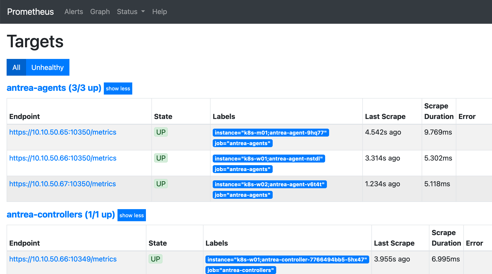
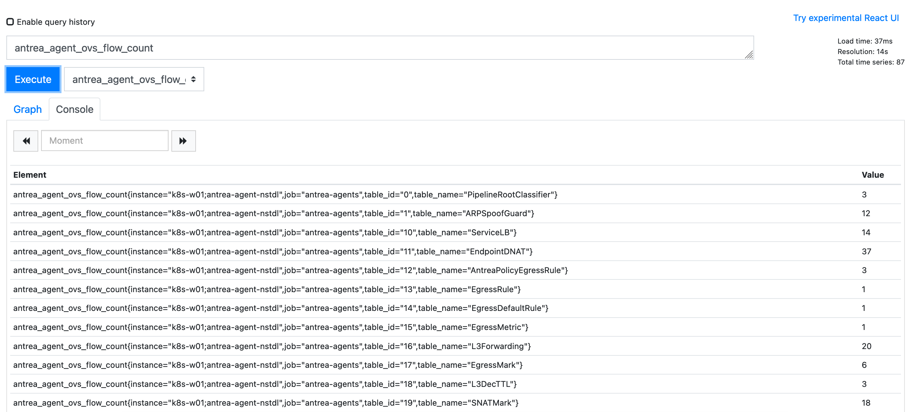
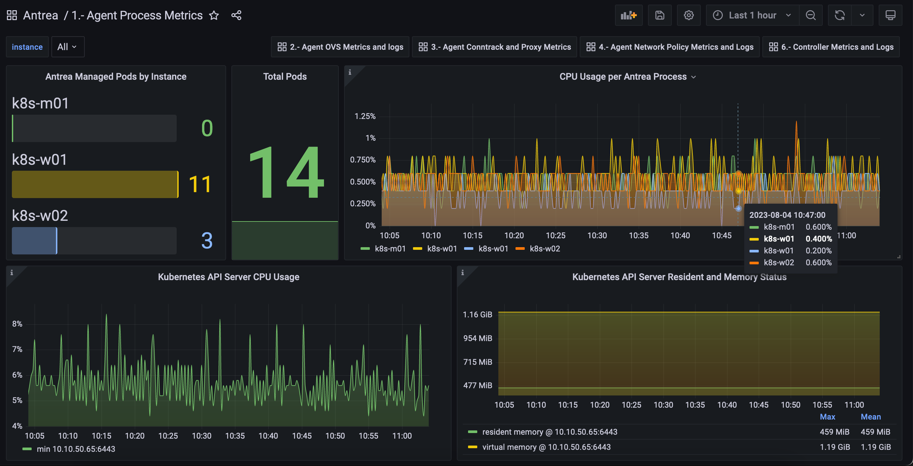

## 目录

{: .no_toc .text-delta }

1. TOC

{:toc}

## 在 Antrea 中启用 Prometheus Metrics（默认启用）

默认 Antrea Controller 和 Antrea Agent 会开启 Prometheus 的 Metric 收集，可以通过查看 Antrea Configmap 来确定这个选项是否打开：

 ` enablePrometheusMetrics: true`

```shell
[root@k8s-m01 ~]# kubectl -n kube-system get cm antrea-config -o yaml | grep -C4 Prometheus
    # Note that if it's set to another value, the `containerPort` of the `api` port of the
    # `antrea-agent` container must be set to the same value.
    apiPort: 10350

    # Enable metrics exposure via Prometheus. Initializes Prometheus metrics listener.
    enablePrometheusMetrics: true


    flowExporter:
      # Enable FlowExporter, a feature used to export polled conntrack connections as
--
    # Note that if it's set to another value, the `containerPort` of the `api` port of the
    # `antrea-controller` container must be set to the same value.
    apiPort: 10349

    # Enable metrics exposure via Prometheus. Initializes Prometheus metrics listener.
    enablePrometheusMetrics: true

    # Indicates whether to use auto-generated self-signed TLS certificate.
    # If false, a Secret named "antrea-controller-tls" must be provided with the following keys:
    #   ca.crt: <CA certificate>
```


## 安装 Prometheus 及 Grafana


此处直接使用 Antrea [官方提供的部署文件](https://github.com/antrea-io/antrea/blob/main/build/yamls/antrea-prometheus.yml)：

```yaml
# Create a namespace for Prometheus components
apiVersion: v1
kind: Namespace
metadata:
  name: monitoring
  labels:
    name: monitoring
---
apiVersion: v1
kind: ServiceAccount
metadata:
  name: prometheus
  namespace: monitoring
---
# This is useful for testing and manual access to the /metrics endpoints
apiVersion: v1
kind: Secret
metadata:
  name: prometheus-service-account-token
  namespace: monitoring
  annotations:
    kubernetes.io/service-account.name: prometheus
type: kubernetes.io/service-account-token
---
# Authorize Prometheus to view Kubernetes cluster components for service discovery purposes
# Authorize Prometheus to retrieve metrics
apiVersion: rbac.authorization.k8s.io/v1
kind: ClusterRole
metadata:
  name: prometheus
rules:
- apiGroups: [""]
  resources:
  - nodes
  - nodes/proxy
  - services
  - endpoints
  - pods
  verbs: ["get", "list", "watch"]
- apiGroups:
  - networking.k8s.io
  resources:
  - ingresses
  verbs: ["get", "list", "watch"]
- nonResourceURLs: ["/metrics"]
  verbs: ["get"]
---
apiVersion: rbac.authorization.k8s.io/v1
kind: ClusterRoleBinding
metadata:
  name: prometheus
roleRef:
  apiGroup: rbac.authorization.k8s.io
  kind: ClusterRole
  name: prometheus
subjects:
- kind: ServiceAccount
  name: prometheus
  namespace: monitoring
---
# Prometheus Server configuration
apiVersion: v1
kind: ConfigMap
metadata:
  name: prometheus-server-conf
  labels:
    name: prometheus-server-conf
  namespace: monitoring
data:
  prometheus.yml: |-
    global:
      scrape_interval: 5s
      evaluation_interval: 5s

    scrape_configs:
    # Scrape Kubernetes metrics
      - job_name: 'kubernetes-apiservers'
        kubernetes_sd_configs:
        - role: endpoints
        scheme: https
        tls_config:
          ca_file: /var/run/secrets/kubernetes.io/serviceaccount/ca.crt
        bearer_token_file: /var/run/secrets/kubernetes.io/serviceaccount/token
        relabel_configs:
        - source_labels: [__meta_kubernetes_namespace, __meta_kubernetes_service_name, __meta_kubernetes_endpoint_port_name]
          action: keep
          regex: default;kubernetes;https

    # Scrape Antrea Controller metrics
      - job_name: 'antrea-controllers'
        kubernetes_sd_configs:
        - role: endpoints
        scheme: https
        tls_config:
          ca_file: /var/run/secrets/kubernetes.io/serviceaccount/ca.crt
          insecure_skip_verify: true
        bearer_token_file: /var/run/secrets/kubernetes.io/serviceaccount/token
        relabel_configs:
        - source_labels: [__meta_kubernetes_namespace, __meta_kubernetes_pod_container_name]
          action: keep
          regex: kube-system;antrea-controller
        - source_labels: [__meta_kubernetes_pod_node_name, __meta_kubernetes_pod_name]
          target_label: instance

    # Scrape Antrea Agents metrics
      - job_name: 'antrea-agents'
        kubernetes_sd_configs:
        - role: pod
        scheme: https
        tls_config:
          ca_file: /var/run/secrets/kubernetes.io/serviceaccount/ca.crt
          insecure_skip_verify: true
        bearer_token_file: /var/run/secrets/kubernetes.io/serviceaccount/token
        relabel_configs:
        - source_labels: [__meta_kubernetes_namespace, __meta_kubernetes_pod_container_name]
          action: keep
          regex: kube-system;antrea-agent
        - source_labels: [__meta_kubernetes_pod_node_name, __meta_kubernetes_pod_name]
          target_label: instance
---
# Prometheus Server deployment
apiVersion: apps/v1
kind: Deployment
metadata:
  name: prometheus-deployment
  namespace: monitoring
spec:
  selector:
    matchLabels:
      app: prometheus-server
  replicas: 1
  template:
    metadata:
      labels:
        app: prometheus-server
    spec:
      containers:
        - name: prometheus
          image: projects.registry.vmware.com/antrea/prom-prometheus:v2.19.3
          args:
            - "--config.file=/etc/prometheus/prometheus.yml"
            - "--storage.tsdb.path=/prometheus/"
            - "--log.level=debug"
          ports:
            - containerPort: 9090
          volumeMounts:
            - name: prometheus-config-volume
              mountPath: /etc/prometheus/
            - name: prometheus-storage-volume
              mountPath: /prometheus/
      serviceAccountName: prometheus
      volumes:
        - name: prometheus-config-volume
          configMap:
            defaultMode: 420
            name: prometheus-server-conf
        - name: prometheus-storage-volume
          emptyDir: {}
---
apiVersion: v1
kind: Service
metadata:
  name: prometheus-service
  namespace: monitoring
  annotations:
      prometheus.io/scrape: 'true'
      prometheus.io/port:   '9090'
spec:
  selector:
    app: prometheus-server
  type: NodePort
  ports:
    - port: 8080
      targetPort: 9090
      nodePort: 30000
```

在 Kubernetes 集群中应用上面的 YAML 文件：

```shell
[root@k8s-m01 ~]# kubectl apply -f antrea-prometheus.yml
namespace/monitoring created
serviceaccount/prometheus created
secret/prometheus-service-account-token created
clusterrole.rbac.authorization.k8s.io/prometheus created
clusterrolebinding.rbac.authorization.k8s.io/prometheus created
configmap/prometheus-server-conf created
deployment.apps/prometheus-deployment created
service/prometheus-service created
```

启动 Prometheus 后，在 Target 中查看 metric 收集状态：



在 Prometheus 中执行查询，可以正确查到结果：



## 安装 Grafana

通过 Docker 运行 Grafana：

```
docker run -d -p 80:3000 --name=grafana grafana/grafana-enterprise
```

## 初始化 Grafana

在 Grafana 中添加 Prometheus Datasource，名称保持默认不变，将其设为 Default：


### 导入 Dashborad

在[这里下载](/output/antrea-grafana.zip) Prometheus 的 Grafana Dashborad（这是个简单的版本，还需要再细化）。

导入 Grafana 中：


可以看到正确收到了信息：




## Antrea Agent Metric 说明

- **antrea_agent_conntrack_antrea_connection_count:** Number of connections in the Antrea ZoneID of the conntrack table. This metric gets updated at an interval specified by flowPollInterval, a configuration parameter for the Agent.
  - 此参数代表 OVS conntrack table 的连接数
  - Connection tracking 用于匹配 Flow 的 TCP、UDP 和 ICMP 等状态
    - 所有状态包含：new、est、rel、rpl、inv、trk、snat、dnat （[https://docs.openvswitch.org/en/latest/tutorials/ovs-conntrack/](https://docs.openvswitch.org/en/latest/tutorials/ovs-conntrack/)）
- **antrea_agent_conntrack_max_connection_count:** Size of the conntrack table. This metric gets updated at an interval specified by flowPollInterval, a configuration parameter for the Agent.
- **antrea_agent_conntrack_total_connection_count:** Number of connections in the conntrack table. This metric gets updated at an interval specified by flowPollInterval, a configuration parameter for the Agent.
- **antrea_agent_denied_connection_count:** Number of denied connections detected by Flow Exporter deny connections tracking. This metric gets updated when a flow is rejected/dropped by network policy.
- **antrea_agent_egress_networkpolicy_rule_count:** Number of egress NetworkPolicy rules on local Node which are managed by the Antrea Agent.
- **antrea_agent_flow_collector_reconnection_count:** Number of re-connections between Flow Exporter and flow collector. This metric gets updated whenever the connection is re-established between the Flow Exporter and the flow collector (e.g. the Flow Aggregator).
- **antrea_agent_ingress_networkpolicy_rule_count:** Number of ingress NetworkPolicy rules on local Node which are managed by the Antrea Agent.
- **antrea_agent_local_pod_count:** Number of Pods on local Node which are managed by the Antrea Agent.
- **antrea_agent_networkpolicy_count:** Number of NetworkPolicies on local Node which are managed by the Antrea Agent.
- **antrea_agent_ovs_flow_count:** Flow count for each OVS flow table. The TableID is used as a label.
- **antrea_agent_ovs_flow_ops_count:** Number of OVS flow operations, partitioned by operation type (add, modify and delete).
- **antrea_agent_ovs_flow_ops_error_count:** Number of OVS flow operation errors, partitioned by operation type (add, modify and delete).
- **antrea_agent_ovs_flow_ops_latency_milliseconds:** The latency of OVS flow operations, partitioned by operation type (add, modify and delete).
- **antrea_agent_ovs_total_flow_count:** Total flow count of all OVS flow tables.

## Antrea Controller Metric 说明

- **antrea_controller_acnp_status_updates:** The total number of actual status updates performed for Antrea ClusterNetworkPolicy Custom Resources
- **antrea_controller_address_group_processed:** The total number of address-group processed
- **antrea_controller_address_group_sync_duration_milliseconds:** The duration of syncing address-group
- **antrea_controller_anp_status_updates:** The total number of actual status updates performed for Antrea NetworkPolicy Custom Resources
- **antrea_controller_applied_to_group_processed:** The total number of applied-to-group processed
- **antrea_controller_applied_to_group_sync_duration_milliseconds:** The duration of syncing applied-to-group
- **antrea_controller_length_address_group_queue:** The length of AddressGroupQueue
- **antrea_controller_length_applied_to_group_queue:** The length of AppliedToGroupQueue
- **antrea_controller_length_network_policy_queue:** The length of InternalNetworkPolicyQueue
- **antrea_controller_network_policy_processed:** The total number of internal-networkpolicy processed
- **antrea_controller_network_policy_sync_duration_milliseconds:** The duration of syncing internal-networkpolicy


## Antrea Proxy Metric 说明

- **antrea_proxy_sync_proxy_rules_duration_seconds:** SyncProxyRules duration of AntreaProxy in seconds
- **antrea_proxy_total_endpoints_installed:** The number of Endpoints installed by AntreaProxy
- **antrea_proxy_total_endpoints_updates:** The cumulative number of Endpoint updates received by AntreaProxy
- **antrea_proxy_total_services_installed:** The number of Services installed by AntreaProxy
- **antrea_proxy_total_services_updates:** The cumulative number of Service updates received by AntreaProxy
