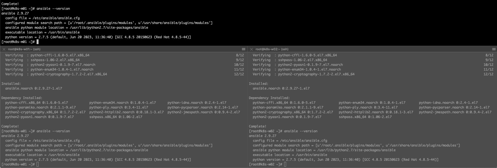

## 概述

早听闻 Ansible 用于管理 Linux 非常方便，尤其是批量安装/修改东西时，但一直没时间学习，今天试试用 GPT 教我用 Ansible Playbook 搭建一个 Kubernetes 集群，记录下全过程。

## 基本信息规划

用 GPT 前，基本的集群规划还是要有的，下面是我的规划：

- Master IP：10.10.50.65
- Worker IP：10.10.50.66, 10.10.50.67
- Kubernetes 版本：1.22.11
- docker-ce 版本：20.10.11
- Linux：CentOS7

基本的 OS 环境已经装好，并配置好 IP 地址、主机名、hosts，可以 SSH 登录。


那接着就让 GPT 来提供指导，开装。

## 安装 Ansible

首先要安装并配置 Ansible，我们问问 GPT 怎么操作吧：


最终得到下列输出，我们在机器上执行试试（微调加了 -y）：

```shell
yum update
yum install -y epel-release
yum install -y ansible
ansible --version
```



接着按照提示创建 `/etc/ansible/hosts`文件：

```shell
[master]
10.10.50.65

[workers]
10.10.50.66
10.10.50.67
```


然后根据提示测试：

```
cat >manage_nodes.yml <<EOF
---
- name: Manage nodes
  hosts: all
  tasks:
    - name: Ping nodes
      ping:
EOF

ansible-playbook manage_nodes.yml
```

结果提示报下面错误：


以上错误是因为忘记为 Ansible 设置免密了，我们假装不知道原因，问 GPT 如何处理：


我们综合上面的解答，汇总来执行：

```shell
ssh-copy-id root@10.10.50.65
ssh-copy-id root@10.10.50.66
ssh-copy-id root@10.10.50.67
```


额，又遇到错误（忘记生成 ssh key）：


继续按照提示操作，然后再做免密登录：

```shell
ssh-keygen
# 下面这步可以不执行，默认就是用 id_rsa.pub
ssh-copy-id -f /root/.pub
```


问题解决了，我们继续回去测试 Ansible，这下好了：


## 生成 Ansible Playbook


完整输出如下：

```yaml
---
- name: Install Kubernetes cluster
  hosts: all
  become: true
  tasks:
    - name: Disable swap
      command: swapoff -a
      when: ansible_swaptotal_mb > 0

    - name: Update sysctl settings
      sysctl:
        name: "{{ item.name }}"
        value: "{{ item.value }}"
        state: present
        sysctl_set: yes
        reload: yes
      with_items:
        - { name: "net.bridge.bridge-nf-call-ip6tables", value: "1" }
        - { name: "net.bridge.bridge-nf-call-iptables", value: "1" }
        - { name: "net.ipv4.ip_forward", value: "1" }

    - name: Install required packages
      yum:
        name: "{{ item }}"
        state: present
      with_items:
        - kubeadm
        - kubelet
        - docker-ce
        - kubectl

    - name: Start and enable Docker service
      service:
        name: docker
        state: started
        enabled: yes

    - name: Add Kubernetes repository
      yum_repository:
        name: kubernetes
        description: Kubernetes
        baseurl: https://mirrors.aliyun.com/kubernetes/yum/repos/kubernetes-el7-x86_64/
        gpgcheck: yes
        gpgkey: https://mirrors.aliyun.com/kubernetes/yum/doc/yum-key.gpg https://mirrors.aliyun.com/kubernetes/yum/doc/rpm-package-key.gpg
        enabled: yes

    - name: Install Kubernetes packages
      yum:
        name: "{{ item }}"
        state: present
      with_items:
        - kubelet
        - kubeadm
        - kubectl

    - name: Initialize Kubernetes master
      command: kubeadm init --pod-network-cidr=10.39.0.0/16 --apiserver-advertise-address=10.10.50.65
      args:
        creates: /etc/kubernetes/admin.conf
      register: kubeadm_output
      when: inventory_hostname == '10.10.50.65'

    - name: Copy Kubernetes admin.conf to user's home directory
      copy:
        src: /etc/kubernetes/admin.conf
        dest: /home/{{ ansible_user }}/admin.conf
        remote_src: yes
      when: inventory_hostname == '10.10.50.65'

    - name: Set KUBECONFIG environment variable
      lineinfile:
        dest: /home/{{ ansible_user }}/.bashrc
        line: 'export KUBECONFIG=/home/{{ ansible_user }}/admin.conf'
        state: present
      when: inventory_hostname == '10.10.50.65'

    - name: Install Flannel network plugin
      command: kubectl apply -f https://raw.githubusercontent.com/coreos/flannel/master/Documentation/kube-flannel.yml
      when: inventory_hostname == '10.10.50.65'

    - name: Join worker nodes to the cluster
      command: "{{ kubeadm_output.stdout_lines[-1] }}"
      when: inventory_hostname != '10.10.50.65'

```

检测上面脚本时发现他忘记加软件版本号了，让他补上，好像没能补上，干脆重新问一遍吧：


最终的输出：

```yaml
---
- name: Install Kubernetes cluster
  hosts: all
  become: true
  tasks:
    - name: Disable swap
      command: swapoff -a
      when: ansible_swaptotal_mb > 0

    - name: Enable ip forwarding
      sysctl:
        name: net.ipv4.ip_forward
        value: "1"
        state: present
        sysctl_set: yes

    - name: Install docker-ce
      yum:
        name: docker-ce-20.10.11
        state: present

    - name: Start and enable docker service
      service:
        name: docker
        state: started
        enabled: yes

    - name: Install kubeadm, kubelet, and kubectl
      yum:
        name: "{{ item }}"
        state: present
      with_items:
        - kubeadm-1.22.11-0
        - kubelet-1.22.11-0
        - kubectl-1.22.11-0

    - name: Configure kubelet
      lineinfile:
        path: /etc/sysconfig/kubelet
        line: KUBELET_EXTRA_ARGS=--node-ip={{ ansible_default_ipv4.address }}
      notify: Restart kubelet

  handlers:
    - name: Restart kubelet
      service:
        name: kubelet
        state: restarted

- name: Initialize Kubernetes master
  hosts: master
  become: true
  tasks:
    - name: Initialize Kubernetes master
      command: kubeadm init --pod-network-cidr=10.39.0.0/16 --apiserver-advertise-address=10.10.50.65 --image-repository=registry.cn-hangzhou.aliyuncs.com/google_containers
      register: kubeadm_output
      changed_when: "'kubeadm join' in kubeadm_output.stdout"

    - name: Save join command
      lineinfile:
        path: /root/kubeadm_join_cmd.sh
        line: "{{ kubeadm_output.stdout_lines[-1] }}"
        create: yes

    - name: Copy kubeconfig to user's home directory
      copy:
        src: /etc/kubernetes/admin.conf
        dest: /home/{{ ansible_user }}/.kube/config
        remote_src: yes
        owner: "{{ ansible_user }}"
        group: "{{ ansible_user }}"
        mode: 0644

    - name: Install Calico CNI
      command: kubectl apply -f https://docs.projectcalico.org/manifests/calico.yaml

- name: Join worker nodes to the cluster
  hosts: worker
  become: true
  tasks:
    - name: Retrieve join command
      shell: cat /root/kubeadm_join_cmd.sh
      register: join_command

    - name: Join worker node to the cluster
      command: "{{ join_command.stdout }}"
```

我们直接运行脚本看看吧（有些节点已经安装好了软件，所以会自动跳过）：

```shell
[root@k8s-m01 ~]# ansible-playbook -i /etc/ansible/hosts kubernetes-cluster.yml

PLAY [Install Kubernetes cluster] ***************************************************************************************************************************************************************************************************************************

TASK [Gathering Facts] **************************************************************************************************************************************************************************************************************************************
ok: [10.10.50.65]
ok: [10.10.50.67]
ok: [10.10.50.66]

TASK [Disable swap] *****************************************************************************************************************************************************************************************************************************************
skipping: [10.10.50.65]
skipping: [10.10.50.66]
skipping: [10.10.50.67]

TASK [Enable ip forwarding] *********************************************************************************************************************************************************************************************************************************
ok: [10.10.50.67]
ok: [10.10.50.65]
ok: [10.10.50.66]

TASK [Install docker-ce] ************************************************************************************************************************************************************************************************************************************
ok: [10.10.50.66]
ok: [10.10.50.65]
ok: [10.10.50.67]

TASK [Start and enable docker service] **********************************************************************************************************************************************************************************************************************
ok: [10.10.50.67]
ok: [10.10.50.65]
ok: [10.10.50.66]

TASK [Install kubeadm, kubelet, and kubectl] ****************************************************************************************************************************************************************************************************************
[DEPRECATION WARNING]: Invoking "yum" only once while using a loop via squash_actions is deprecated. Instead of using a loop to supply multiple items and specifying `name: "{{ item }}"`, please use `name: ['kubeadm-1.22.11-0', 'kubelet-1.22.11-0',
'kubectl-1.22.11-0']` and remove the loop. This feature will be removed in version 2.11. Deprecation warnings can be disabled by setting deprecation_warnings=False in ansible.cfg.
[DEPRECATION WARNING]: Invoking "yum" only once while using a loop via squash_actions is deprecated. Instead of using a loop to supply multiple items and specifying `name: "{{ item }}"`, please use `name: ['kubeadm-1.22.11-0', 'kubelet-1.22.11-0',
'kubectl-1.22.11-0']` and remove the loop. This feature will be removed in version 2.11. Deprecation warnings can be disabled by setting deprecation_warnings=False in ansible.cfg.
[DEPRECATION WARNING]: Invoking "yum" only once while using a loop via squash_actions is deprecated. Instead of using a loop to supply multiple items and specifying `name: "{{ item }}"`, please use `name: ['kubeadm-1.22.11-0', 'kubelet-1.22.11-0',
'kubectl-1.22.11-0']` and remove the loop. This feature will be removed in version 2.11. Deprecation warnings can be disabled by setting deprecation_warnings=False in ansible.cfg.
ok: [10.10.50.65] => (item=[u'kubeadm-1.22.11-0', u'kubelet-1.22.11-0', u'kubectl-1.22.11-0'])
ok: [10.10.50.67] => (item=[u'kubeadm-1.22.11-0', u'kubelet-1.22.11-0', u'kubectl-1.22.11-0'])
ok: [10.10.50.66] => (item=[u'kubeadm-1.22.11-0', u'kubelet-1.22.11-0', u'kubectl-1.22.11-0'])

TASK [Configure kubelet] ************************************************************************************************************************************************************************************************************************************
changed: [10.10.50.66]
changed: [10.10.50.65]
changed: [10.10.50.67]

RUNNING HANDLER [Restart kubelet] ***************************************************************************************************************************************************************************************************************************
changed: [10.10.50.66]
changed: [10.10.50.65]
changed: [10.10.50.67]

PLAY [Initialize Kubernetes master] *************************************************************************************************************************************************************************************************************************

TASK [Gathering Facts] **************************************************************************************************************************************************************************************************************************************
ok: [10.10.50.65]

TASK [Initialize Kubernetes master] *************************************************************************************************************************************************************************************************************************
changed: [10.10.50.65]

TASK [Save join command] ************************************************************************************************************************************************************************************************************************************
changed: [10.10.50.65]

TASK [Copy kubeconfig to user's home directory] *************************************************************************************************************************************************************************************************************
fatal: [10.10.50.65]: FAILED! => {"msg": "The task includes an option with an undefined variable. The error was: 'ansible_user' is undefined\n\nThe error appears to be in '/root/kubernetes-cluster.yml': line 64, column 7, but may\nbe elsewhere in the file depending on the exact syntax problem.\n\nThe offending line appears to be:\n\n\n    - name: Copy kubeconfig to user's home directory\n      ^ here\n"}

PLAY RECAP **************************************************************************************************************************************************************************************************************************************************
10.10.50.65                : ok=10   changed=4    unreachable=0    failed=1    skipped=1    rescued=0    ignored=0
10.10.50.66                : ok=7    changed=2    unreachable=0    failed=0    skipped=1    rescued=0    ignored=0
10.10.50.67                : ok=7    changed=2    unreachable=0    failed=0    skipped=1    rescued=0    ignored=0
```

额，又报错了，再次问 GPT 吧（我打错字了都能正确回答我的问题）。


不过错误归错误，实际上看了下脚本前半部分运行是正常的，pod 都在运行：


### 失误后的清理

在微调之前，需要先清理环境：


GPT 输出存在稍有点问题，我们调整下命令执行顺序：

```shell
sudo kubeadm reset
sudo systemctl stop kubelet
sudo systemctl disable kubelet
sudo systemctl stop docker
sudo systemctl disable docker
sudo yum remove -y docker-ce-20.10.11
sudo yum remove -y kubeadm-1.22.11-0 kubelet-1.22.11-0 kubectl-1.22.11-0

rm -rf /etc/kubernetes/
rm -rf /var/lib/etcd/
rm -rf /var/lib/kubelet/
rm -rf /var/lib/cni/
rm -rf /etc/cni/
rm -rf /var/run/calico/
rm -rf /root/kubeadm_join_cmd.sh
```

## 成品脚本

清理完，再运行下修正后的脚本。

经过反复调试，修正了四处：

- 因为我使用的是 root 用户，所以放置 kubeconfig 的目录位置做了微调

- 把 Ansible host 的 worker 改成 workers，之前不小心记错了
- Playbook 中生成的 kubeadm join 脚本缺一行，询问 GPT 进行了补齐
- Playbook 中缺少将 kubeadm join 脚本复制到 workers 中的操作，进行了补齐，同时脚本需要有执行权限

```yaml
---
- name: Install Kubernetes cluster
  hosts: all
  become: true
  tasks:
    - name: Add Kubernetes repository
      yum_repository:
        name: kubernetes
        description: Kubernetes
        baseurl: https://mirrors.aliyun.com/kubernetes/yum/repos/kubernetes-el7-x86_64
        gpgkey: https://mirrors.aliyun.com/kubernetes/yum/doc/yum-key.gpg https://mirrors.aliyun.com/kubernetes/yum/doc/rpm-package-key.gpg
        enabled: yes
        gpgcheck: yes

    - name: Disable swap
      command: swapoff -a
      when: ansible_swaptotal_mb > 0

    - name: Enable ip forwarding
      sysctl:
        name: net.ipv4.ip_forward
        value: "1"
        state: present
        sysctl_set: yes

    - name: Install docker-ce
      yum:
        name: docker-ce-20.10.11
        state: present

    - name: Start and enable docker service
      service:
        name: docker
        state: started
        enabled: yes
    - name: Configure Docker daemon
      copy:
        dest: /etc/docker/daemon.json
        content: |
          {
            "exec-opts": ["native.cgroupdriver=systemd"],
            "log-driver": "json-file",
            "log-opts": {
              "max-size": "100m"
            },
            "registry-mirrors": ["https://ajmumh9n.mirror.aliyuncs.com"]
          }
      notify: Restart Docker
    - name: Install kubeadm, kubelet, and kubectl
      yum:
        name: "{{ item }}"
        state: present
      with_items:
        - kubeadm-1.22.11-0
        - kubelet-1.22.11-0
        - kubectl-1.22.11-0

    - name: Configure kubelet
      lineinfile:
        path: /etc/sysconfig/kubelet
        line: KUBELET_EXTRA_ARGS=--node-ip={{ ansible_default_ipv4.address }}
      notify: Restart kubelet

  handlers:
    - name: Restart Docker
      service:
        name: docker
        state: restarted

  handlers:
    - name: Restart kubelet
      service:
        name: kubelet
        state: restarted
        
- name: Initialize Kubernetes master
  hosts: master
  vars:
    ansible_user: root
  become: true
  tasks:
    - name: Initialize Kubernetes master
      command: kubeadm init --pod-network-cidr=10.39.0.0/16 --apiserver-advertise-address=10.10.50.65 --image-repository=registry.cn-hangzhou.aliyuncs.com/google_containers
      register: kubeadm_output
      changed_when: "'kubeadm join' in kubeadm_output.stdout"

    - name: Save join command
      lineinfile:
        path: /root/kubeadm_join_cmd.sh
        line: "{{ item }}"
        create: yes
      loop: "{{ kubeadm_output.stdout_lines[-2:] }}"
        
    - name: Copy kubeconfig to user's home directory
      copy:
        src: /etc/kubernetes/admin.conf
        dest: /{{ ansible_user }}/.kube/config
        remote_src: yes
        owner: "{{ ansible_user }}"
        group: "{{ ansible_user }}"
        mode: 0644

    - name: Install Calico CNI
      command: kubectl apply -f https://docs.projectcalico.org/manifests/calico.yaml

- name: Join worker nodes to the cluster
  hosts: workers
  become: true
  tasks:
    - name: Copy kubeadm join script to workers
      copy:
        src: /root/kubeadm_join_cmd.sh
        dest: /root/kubeadm_join_cmd.sh
        mode: 0777
    - name: Join worker node to the cluster
      command: sh /root/kubeadm_join_cmd.sh
```

执行情况如下：

```shell
[root@k8s-m01 ~]# ansible-playbook -i /etc/ansible/hosts kubernetes-cluster.yml
[WARNING]: While constructing a mapping from /root/kubernetes-cluster.yml, line 2, column 3, found a duplicate dict key (handlers). Using last defined value only.

PLAY [Install Kubernetes cluster] ***************************************************************************************************************************************************************************************************************************

TASK [Gathering Facts] **************************************************************************************************************************************************************************************************************************************
ok: [10.10.50.67]
ok: [10.10.50.65]
ok: [10.10.50.66]

TASK [Disable swap] *****************************************************************************************************************************************************************************************************************************************
skipping: [10.10.50.65]
skipping: [10.10.50.66]
skipping: [10.10.50.67]

TASK [Enable ip forwarding] *********************************************************************************************************************************************************************************************************************************
ok: [10.10.50.66]
ok: [10.10.50.65]
ok: [10.10.50.67]

TASK [Install docker-ce] ************************************************************************************************************************************************************************************************************************************
ok: [10.10.50.67]
ok: [10.10.50.65]
ok: [10.10.50.66]

TASK [Start and enable docker service] **********************************************************************************************************************************************************************************************************************
ok: [10.10.50.65]
ok: [10.10.50.66]
ok: [10.10.50.67]

TASK [Configure Docker daemon] ******************************************************************************************************************************************************************************************************************************
ok: [10.10.50.67]
ok: [10.10.50.66]
ok: [10.10.50.65]

TASK [Install kubeadm, kubelet, and kubectl] ****************************************************************************************************************************************************************************************************************
[DEPRECATION WARNING]: Invoking "yum" only once while using a loop via squash_actions is deprecated. Instead of using a loop to supply multiple items and specifying `name: "{{ item }}"`, please use `name: ['kubeadm-1.22.11-0', 'kubelet-1.22.11-0',
'kubectl-1.22.11-0']` and remove the loop. This feature will be removed in version 2.11. Deprecation warnings can be disabled by setting deprecation_warnings=False in ansible.cfg.
[DEPRECATION WARNING]: Invoking "yum" only once while using a loop via squash_actions is deprecated. Instead of using a loop to supply multiple items and specifying `name: "{{ item }}"`, please use `name: ['kubeadm-1.22.11-0', 'kubelet-1.22.11-0',
'kubectl-1.22.11-0']` and remove the loop. This feature will be removed in version 2.11. Deprecation warnings can be disabled by setting deprecation_warnings=False in ansible.cfg.
[DEPRECATION WARNING]: Invoking "yum" only once while using a loop via squash_actions is deprecated. Instead of using a loop to supply multiple items and specifying `name: "{{ item }}"`, please use `name: ['kubeadm-1.22.11-0', 'kubelet-1.22.11-0',
'kubectl-1.22.11-0']` and remove the loop. This feature will be removed in version 2.11. Deprecation warnings can be disabled by setting deprecation_warnings=False in ansible.cfg.
ok: [10.10.50.65] => (item=[u'kubeadm-1.22.11-0', u'kubelet-1.22.11-0', u'kubectl-1.22.11-0'])
ok: [10.10.50.66] => (item=[u'kubeadm-1.22.11-0', u'kubelet-1.22.11-0', u'kubectl-1.22.11-0'])
changed: [10.10.50.67] => (item=[u'kubeadm-1.22.11-0', u'kubelet-1.22.11-0', u'kubectl-1.22.11-0'])

TASK [Configure kubelet] ************************************************************************************************************************************************************************************************************************************
changed: [10.10.50.67]
ok: [10.10.50.66]
ok: [10.10.50.65]

RUNNING HANDLER [Restart kubelet] ***************************************************************************************************************************************************************************************************************************
changed: [10.10.50.67]

PLAY [Initialize Kubernetes master] *************************************************************************************************************************************************************************************************************************

TASK [Gathering Facts] **************************************************************************************************************************************************************************************************************************************
ok: [10.10.50.65]

TASK [Initialize Kubernetes master] *************************************************************************************************************************************************************************************************************************
changed: [10.10.50.65]

TASK [Save join command] ************************************************************************************************************************************************************************************************************************************
changed: [10.10.50.65] => (item=kubeadm join 10.10.50.65:6443 --token q02v0f.5ynsshcwfdotinx8 \)
changed: [10.10.50.65] => (item=	--discovery-token-ca-cert-hash sha256:e46c42ab6db91880bbe2577da9cedb19f7cea4572af9c725b28d5730f32c1e83 )

TASK [Copy kubeconfig to user's home directory] *************************************************************************************************************************************************************************************************************
changed: [10.10.50.65]

TASK [Install Calico CNI] ***********************************************************************************************************************************************************************************************************************************
changed: [10.10.50.65]

PLAY [Join worker nodes to the cluster] *********************************************************************************************************************************************************************************************************************

TASK [Gathering Facts] **************************************************************************************************************************************************************************************************************************************
ok: [10.10.50.66]
ok: [10.10.50.67]

TASK [Copy kubeadm join script to workers] ******************************************************************************************************************************************************************************************************************
changed: [10.10.50.67]
changed: [10.10.50.66]

TASK [Join worker node to the cluster] **********************************************************************************************************************************************************************************************************************
changed: [10.10.50.67]
changed: [10.10.50.66]

PLAY RECAP **************************************************************************************************************************************************************************************************************************************************
10.10.50.65                : ok=12   changed=4    unreachable=0    failed=0    skipped=1    rescued=0    ignored=0
10.10.50.66                : ok=10   changed=2    unreachable=0    failed=0    skipped=1    rescued=0    ignored=0
10.10.50.67                : ok=11   changed=5    unreachable=0    failed=0    skipped=1    rescued=0    ignored=0

[root@k8s-m01 ~]# kubectl get node
NAME      STATUS     ROLES                  AGE   VERSION
k8s-m01   Ready      control-plane,master   54s   v1.22.11
k8s-w01   Ready      <none>                 14s   v1.22.11
k8s-w02   NotReady   <none>                 14s   v1.22.11
```

最终集群安装完毕：

```shell
[root@k8s-m01 ~]# kubectl get node
NAME      STATUS   ROLES                  AGE     VERSION
k8s-m01   Ready    control-plane,master   2m58s   v1.22.11
k8s-w01   Ready    <none>                 2m18s   v1.22.11
k8s-w02   Ready    <none>                 2m18s   v1.22.11
[root@k8s-m01 ~]# kubectl get po -A
NAMESPACE     NAME                                       READY   STATUS    RESTARTS   AGE
kube-system   calico-kube-controllers-5d4b78db86-t59qs   1/1     Running   0          2m22s
kube-system   calico-node-9cznw                          1/1     Running   0          2m22s
kube-system   calico-node-dfztq                          1/1     Running   0          2m20s
kube-system   calico-node-qr88z                          1/1     Running   0          2m20s
kube-system   coredns-7d89d9b6b8-bk25m                   1/1     Running   0          2m42s
kube-system   coredns-7d89d9b6b8-zs298                   1/1     Running   0          2m42s
kube-system   etcd-k8s-m01                               1/1     Running   27         2m59s
kube-system   kube-apiserver-k8s-m01                     1/1     Running   14         2m56s
kube-system   kube-controller-manager-k8s-m01            1/1     Running   14         2m56s
kube-system   kube-proxy-82hrz                           1/1     Running   0          2m43s
kube-system   kube-proxy-9sdjl                           1/1     Running   0          2m20s
kube-system   kube-proxy-m4lzm                           1/1     Running   0          2m20s
kube-system   kube-scheduler-k8s-m01                     1/1     Running   27         2m56s
```


## 最终对比

最后简单做了下第一个 Playbook 和最终调试后的，运行逻辑基本没变，只是小的细节上做了调整，整体感觉良好。最终从近乎零基础开始借助 GPT 编写 Ansible 脚本安装好集群，加上记录这个文档，共耗时 2 小时 30 分，下次再装集群可以省不少事了。


## 一些优化

在调试脚本时，发现有时候相似的问题，GPT 给出的答案不一样，比如前面安装指定版本软件时就给出了另一种答案：

```yaml
---
- name: Install Kubernetes cluster
  hosts: all
  become: true
  vars:
    kubernetes_version: 1.22.11
    docker_version: 20.10.11

  tasks:
    - name: Install required packages
      yum:
        name: "{{ item }}"
        state: present
      with_items:
        - kubeadm-{{ kubernetes_version }}
        - kubelet-{{ kubernetes_version }}
        - kubectl-{{ kubernetes_version }}
        - docker-ce-{{ docker_version }}
        - docker-ce-cli-{{ docker_version }}
        - containerd.io
```

看了下这个答案实际比第一次询问时准确一些，比如指定了 docker-ce-cli 的版本，而且比之前的命令要精简一些，我又再次调试，攒了个功能更齐全的版本出来，分享给大家：

```yaml
---
- name: Install Kubernetes cluster
  hosts: all
  become: true
  vars:
    kubernetes_version: 1.22.11
    docker_version: 20.10.11
  tasks:
    - name: Add Kubernetes repository
      yum_repository:
        name: kubernetes
        description: Kubernetes
        baseurl: https://mirrors.aliyun.com/kubernetes/yum/repos/kubernetes-el7-x86_64
        gpgkey: https://mirrors.aliyun.com/kubernetes/yum/doc/yum-key.gpg https://mirrors.aliyun.com/kubernetes/yum/doc/rpm-package-key.gpg
        enabled: yes
        gpgcheck: yes

    - name: Disable swap
      command: swapoff -a
      when: ansible_swaptotal_mb > 0

    - name: Enable ip forwarding
      sysctl:
        name: net.ipv4.ip_forward
        value: "1"
        state: present
        sysctl_set: yes

    - name: Disable firewalld
      service:
        name: firewalld
        state: stopped
        enabled: no

    - name: Disable SELinux
      selinux:
        policy: targeted
        state: disabled
 
    - name: Install required packages
      yum:
        name: "{{ item }}"
        state: present
      with_items:
        - kubeadm-{{ kubernetes_version }}
        - kubelet-{{ kubernetes_version }}
        - kubectl-{{ kubernetes_version }}
        - docker-ce-{{ docker_version }}
        - docker-ce-cli-{{ docker_version }}
        - containerd.io

    - name: Configure Docker daemon
      copy:
        dest: /etc/docker/daemon.json
        content: |
          {
            "exec-opts": ["native.cgroupdriver=systemd"],
            "log-driver": "json-file",
            "log-opts": {
              "max-size": "100m"
            },
            "registry-mirrors": ["https://ajmumh9n.mirror.aliyuncs.com"]
          }
      notify: Restart Docker

    - name: Start and enable Docker service
      service:
        name: docker
        state: started
        enabled: yes

    - name: Configure kubelet
      lineinfile:
        path: /etc/sysconfig/kubelet
        line: KUBELET_EXTRA_ARGS=--node-ip={{ ansible_default_ipv4.address }}
      notify: Restart kubelet

  handlers:
    - name: Restart Docker
      service:
        name: docker
        state: restarted

  handlers:
    - name: Restart kubelet
      service:
        name: kubelet
        state: restarted
        
- name: Initialize Kubernetes master
  hosts: master
  vars:
    ansible_user: root
  become: true
  tasks:
    - name: Initialize Kubernetes master
      command: kubeadm init --pod-network-cidr=10.39.0.0/16 --apiserver-advertise-address=10.10.50.65 --image-repository=registry.cn-hangzhou.aliyuncs.com/google_containers
      register: kubeadm_output
      changed_when: "'kubeadm join' in kubeadm_output.stdout"

    - name: Save join command
      lineinfile:
        path: /root/kubeadm_join_cmd.sh
        line: "{{ item }}"
        create: yes
      loop: "{{ kubeadm_output.stdout_lines[-2:] }}"
        
    - name: Copy kubeconfig to user's home directory
      copy:
        src: /etc/kubernetes/admin.conf
        dest: /{{ ansible_user }}/.kube/config
        remote_src: yes
        owner: "{{ ansible_user }}"
        group: "{{ ansible_user }}"
        mode: 0644

    - name: Install Calico CNI
      command: kubectl apply -f https://docs.projectcalico.org/manifests/calico.yaml

- name: Join worker nodes to the cluster
  hosts: workers
  become: true
  tasks:
    - name: Copy kubeadm join script to workers
      copy:
        src: /root/kubeadm_join_cmd.sh
        dest: /root/kubeadm_join_cmd.sh
        mode: 0777
    - name: Join worker node to the cluster
      command: sh /root/kubeadm_join_cmd.sh
```

