# 使用 Argo Rollout + Istio进行灰度发布

{: .no_toc}

## 目录

{: .no_toc .text-delta }


1. TOC
{:toc}

## 安装 Argo Rollout

安装 Argo Rollout

```shell
mkdir -p ~/argo-rollouts-yml

kubectl create ns argo-rollouts

cd ~/argo-rollouts-yml && wget https://github.com/argoproj/argo-rollouts/releases/latest/download/install.yaml

cd ~/argo-rollouts-yml && wget https://github.com/argoproj/argo-rollouts/releases/latest/download/dashboard-install.yaml


kubectl apply -n argo-rollouts -f ~/argo-rollouts-yml/install.yaml

kubectl apply -n argo-rollouts -f ~/argo-rollouts-yml/dashboard-install.yaml

curl -LO https://github.com/argoproj/argo-rollouts/releases/latest/download/kubectl-argo-rollouts-linux-amd64

chmod +x ./kubectl-argo-rollouts-linux-amd64

mv ./kubectl-argo-rollouts-linux-amd64 /usr/local/bin/kubectl-argo-rollouts

kubectl argo rollouts version

# 修改 argo-rollouts 对外暴露方式
kubectl -n argo-rollouts  patch svc argo-rollouts-dashboard -p '{"spec": {"type": "NodePort"}}'
```

正常登录：

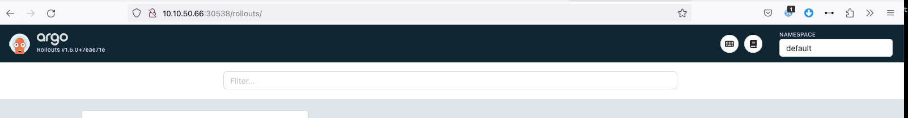

## 安装 Istio


```shell
# 如无法下载可在链接前加上 https://gh-proxy.com

#!/bin/bash

# 安装 istioctl
curl -L https://istio.io/downloadIstio | ISTIO_VERSION=1.11.2 sh -
cd istio-1.11.2
export PATH=$PWD/bin:$PATH

# 安装 istio
istioctl install --set profile=demo

# 修改 istio Gateway 对外暴露方式
kubectl -n istio-system patch svc istio-ingressgateway -p '{"spec": {"type": "NodePort"}}'
 
# 等待 istio 安装完成
kubectl -n istio-system wait --for=condition=available deployment/istiod --timeout=5m

# 部署 istio 的示例应用
kubectl apply -f samples/bookinfo/platform/kube/bookinfo.yaml

# 等待示例应用部署完成
kubectl -n default wait --for=condition=available deployment --all --timeout=5m

# 部署 istio 的 Gateway 和 VirtualService
kubectl apply -f samples/bookinfo/networking/bookinfo-gateway.yaml
```

通过 NodePort 访问发布的应用。

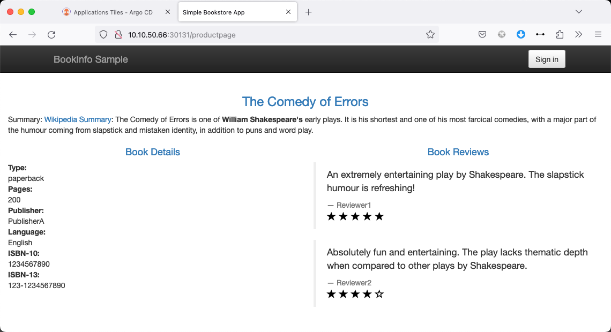


## 部署测试应用

通过下列命令部署应用：

```shell
kubectl create ns prd
kubectl label namespace prd istio-injection=enabled
cat > prd-vue-rollout.yml << 'EOF'
apiVersion: v1
kind: Service
metadata:
  name: prd-vue-svc-stable
  namespace: prd
  labels:
    app: prd-vue
spec:
  type: ClusterIP
  ports:
  - port: 80
    targetPort: http
    protocol: TCP
    name: http
  selector:
    app: prd-vue
---
apiVersion: v1
kind: Service
metadata:
  name: prd-vue-svc-canary
  namespace: prd
  labels:
    app: prd-vue
spec:
  type: ClusterIP
  ports:
  - port: 80
    targetPort: http
    protocol: TCP
    name: http
  selector:
    app: prd-vue
---
apiVersion: networking.istio.io/v1alpha3
kind: Gateway
metadata:
  name: prd-vue-gateway
  namespace: prd
spec:
  selector:
    istio: ingressgateway # 默认创建的 istio ingressgateway pod 有这个 Label
  servers:
  - port:
      number: 80
      name: http
      protocol: HTTP
    hosts:
    - "argo-test.halfcoffee.com" # 匹配 host
---
apiVersion: networking.istio.io/v1beta1
kind: VirtualService
metadata:
  name: prd-vue-vsvc
  namespace: prd
spec:
  gateways:
  - prd-vue-gateway
  hosts:
  - argo-test.halfcoffee.com
  http:
  - name: primary
    route:
    - destination:
        host: prd-vue-svc-stable
      weight: 100
    - destination:
        host: prd-vue-svc-canary
      weight: 0
---
apiVersion: argoproj.io/v1alpha1
kind: Rollout
metadata:
  name: prd-vue
  namespace: prd
spec:
  replicas: 3
  strategy:
    canary:
      canaryService: prd-vue-svc-canary # 关联 canary Service
      stableService: prd-vue-svc-stable # 关联 stable Service
      trafficRouting:
        managedRoutes:
          - name: header-route-1
        istio:
          virtualServices:
          - name: prd-vue-vsvc # 关联的 Istio virtualService
            routes:
            - primary
      steps:
      - setHeaderRoute:
          name: "header-route-1"
          match:
            - headerName: "X-canary"
              headerValue:
                exact: "test-user"
      - pause: {}
      - setCanaryScale:
          weight: 20
      - pause: {duration: 60}
      - setCanaryScale:
          weight: 60
      - pause: {duration: 60}
      - setCanaryScale:
          weight: 80
      - pause: {duration: 60}
  revisionHistoryLimit: 2
  selector:
    matchLabels:
      app: prd-vue
  template:
    metadata:
      labels:
        app: prd-vue
        istio-injection: enabled
    spec:
      containers:
      - name: avi-demo
        image: dyadin/avi-demo:v1
        ports:
        - name: http
          containerPort: 80
          protocol: TCP
EOF

kubectl apply -f prd-vue-rollout.yml
```


部署完成后在 Argo Rollout 中可以看到 v1 的 Pod：

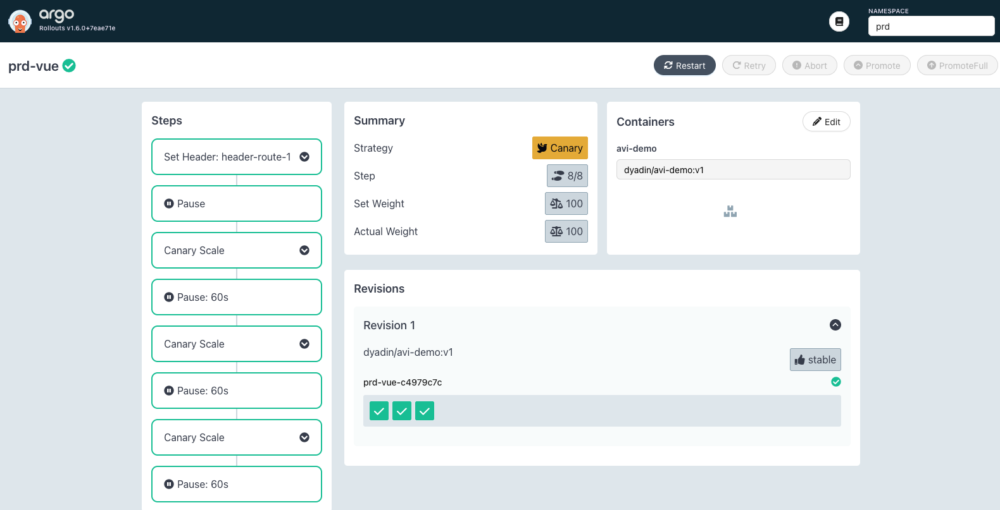

CLI 查看 Pod 状态如下：

```shell
[root@k8s-m01 ~]# kubectl -n prd get po --show-labels
NAME                     READY   STATUS    RESTARTS   AGE   LABELS
prd-vue-c4979c7c-7bj6m   2/2     Running   0          91s   app=prd-vue,istio-injection=enabled,rollouts-pod-template-hash=c4979c7c,security.istio.io/tlsMode=istio
prd-vue-c4979c7c-b242g   2/2     Running   0          91s   app=prd-vue,istio-injection=enabled,rollouts-pod-template-hash=c4979c7c,security.istio.io/tlsMode=istio
prd-vue-c4979c7c-rnkxs   2/2     Running   0          91s   app=prd-vue,istio-injection=enabled,rollouts-pod-template-hash=c4979c7c,security.istio.io/tlsMode=istio
[root@k8s-m01 ~]#
```

Istio 关联的 svc ep 如下：

```shell
[root@k8s-m01 ~]# kubectl -n prd get ep
NAME                 ENDPOINTS                                            AGE
prd-vue-svc-canary   10.39.191.230:80,10.39.191.231:80,10.39.217.213:80   2m26s
prd-vue-svc-stable   10.39.191.230:80,10.39.191.231:80,10.39.217.213:80   2m26s
```


Istio 的 VS 未发生任何变化：

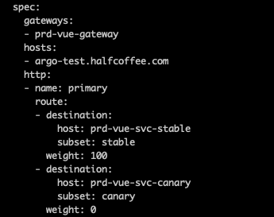

通过 Ingress Gateway 访问服务正常（浏览器指定了 host: argo-test.halfcoffee.com）：

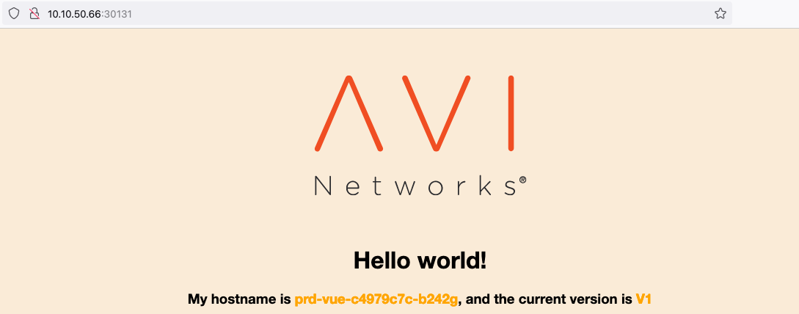

### 发布新的版本

修改 image 版本：

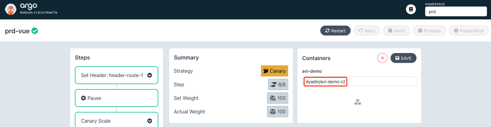

之后看到 istio vs 被重写，添加了 header 的匹配：

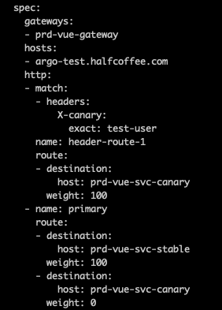

此时 Pod 未发生变化，所有请求依然发给 v1：

```shell
[root@k8s-m01 ~]# kubectl -n prd get po
NAME                     READY   STATUS    RESTARTS   AGE
prd-vue-c4979c7c-7bj6m   2/2     Running   0          4m4s
prd-vue-c4979c7c-b242g   2/2     Running   0          4m4s
prd-vue-c4979c7c-rnkxs   2/2     Running   0          4m4s
```

系统被暂停，我们点击 Promote 继续执行：

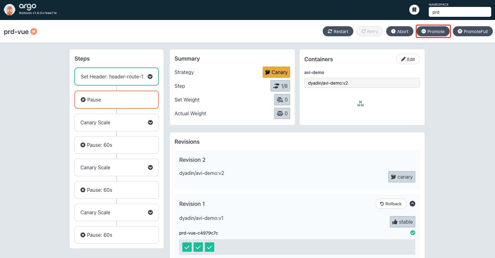

之后会自动创建版本为 v2 的 Pod：

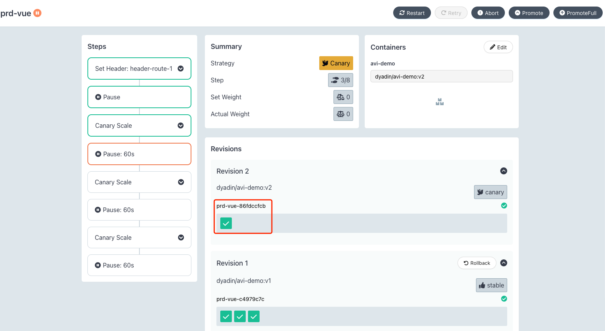

同时 svc 关联的 Endpoint 也发生变化：

```shell
[root@k8s-m01 ~]# kubectl -n prd get ep
NAME                 ENDPOINTS                                            AGE
prd-vue-svc-canary   10.39.191.232:80                                     5m42s
prd-vue-svc-stable   10.39.191.230:80,10.39.191.231:80,10.39.217.213:80   5m42s
```

进行访问测试（浏览器指定了 host: argo-test.halfcoffee.com，X-canary: test-user 这两个 header），发现有灰度标识 header 的请求会响应 v2 的应用：

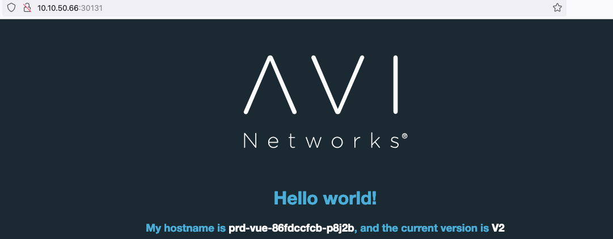

下面是完整日志：

```shell
[root@k8s-m01 ~]# kubectl -n prd get ep -o wide
NAME                 ENDPOINTS                                            AGE
prd-vue-svc-canary   10.39.191.232:80,10.39.217.214:80                    6m29s
prd-vue-svc-stable   10.39.191.230:80,10.39.191.231:80,10.39.217.213:80   6m29s

# svc 的匹配 label 发生变化，多了个 hash
[root@k8s-m01 ~]# kubectl -n prd get svc -o wide
NAME                 TYPE        CLUSTER-IP       EXTERNAL-IP   PORT(S)   AGE     SELECTOR
prd-vue-svc-canary   ClusterIP   10.105.156.223   <none>        80/TCP    6m36s   app=prd-vue,rollouts-pod-template-hash=86fdccfcb
prd-vue-svc-stable   ClusterIP   10.108.95.155    <none>        80/TCP    6m37s   app=prd-vue,rollouts-pod-template-hash=c4979c7c

# 相应的 pod 也被自动加上了 label
[root@k8s-m01 ~]# kubectl -n prd get po -o wide --show-labels
NAME                      READY   STATUS    RESTARTS   AGE     IP              NODE      NOMINATED NODE   READINESS GATES   LABELS
prd-vue-86fdccfcb-2bjc6   2/2     Running   0          21s     10.39.217.214   k8s-w02   <none>           <none>            app=prd-vue,istio-injection=enabled,rollouts-pod-template-hash=86fdccfcb
prd-vue-86fdccfcb-p8j2b   2/2     Running   0          83s     10.39.191.232   k8s-w01   <none>           <none>            app=prd-vue,istio-injection=enabled,rollouts-pod-template-hash=86fdccfcb
prd-vue-c4979c7c-7bj6m    2/2     Running   0          6m42s   10.39.191.231   k8s-w01   <none>           <none>            app=prd-vue,istio-injection=enabled,rollouts-pod-template-hash=c4979c7c
prd-vue-c4979c7c-b242g    2/2     Running   0          6m42s   10.39.191.230   k8s-w01   <none>           <none>            app=prd-vue,istio-injection=enabled,rollouts-pod-template-hash=c4979c7c
prd-vue-c4979c7c-rnkxs    2/2     Running   0          6m42s   10.39.217.213   k8s-w02   <none>           <none>            app=prd-vue,istio-injection=enabled,rollouts-pod-template-hash=c4979c7c

# Istio 的 VS 未发生比例的变化，只是添加了 header 的规则
[root@k8s-m01 ~]# kubectl -n prd get vs -o yaml
apiVersion: v1
items:
- apiVersion: networking.istio.io/v1beta1
  kind: VirtualService
  metadata:
    annotations:
      kubectl.kubernetes.io/last-applied-configuration: |
        {"apiVersion":"networking.istio.io/v1beta1","kind":"VirtualService","metadata":{"annotations":{},"name":"prd-vue-vsvc","namespace":"prd"},"spec":{"gateways":["prd-vue-gateway"],"hosts":["argo-test.halfcoffee.com"],"http":[{"name":"primary","route":[{"destination":{"host":"prd-vue-svc-stable"},"weight":100},{"destination":{"host":"prd-vue-svc-canary"},"weight":0}]}]}}
    creationTimestamp: "2023-10-27T09:05:36Z"
    generation: 2
    name: prd-vue-vsvc
    namespace: prd
    resourceVersion: "30282"
    uid: aa7b50db-e6f6-4ab0-aa58-ab2f9b00597a
  spec:
    gateways:
    - prd-vue-gateway
    hosts:
    - argo-test.halfcoffee.com
    http:
    - match:
      - headers:
          X-canary:
            exact: test-user
      name: header-route-1
      route:
      - destination:
          host: prd-vue-svc-canary
        weight: 100
    - name: primary
      route:
      - destination:
          host: prd-vue-svc-stable
        weight: 100
      - destination:
          host: prd-vue-svc-canary
        weight: 0
kind: List
metadata:
  resourceVersion: ""
  selfLink: ""
```

随着 CD 一步步执行，Pod 会逐渐从 v1 变为 v2：

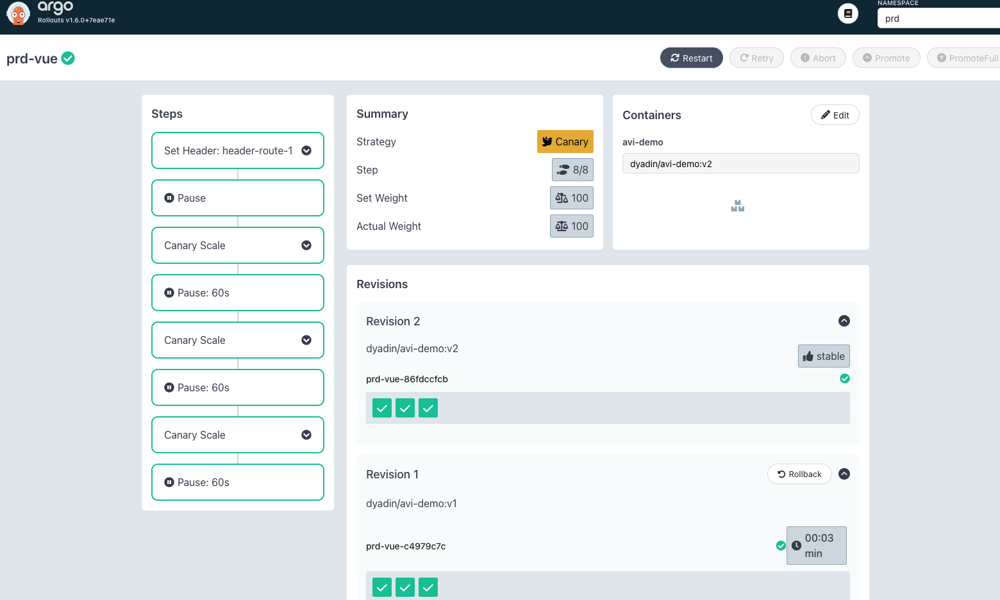

等所有步骤执行完毕后，istio vs 的配置会被还原：

```
  spec:
    gateways:
    - prd-vue-gateway
    hosts:
    - argo-test.halfcoffee.com
    http:
    - name: primary
      route:
      - destination:
          host: prd-vue-svc-stable
        weight: 100
      - destination:
          host: prd-vue-svc-canary
        weight: 0
```

老版本的 pod 会在 30s 后自动销毁：

```shell
[root@k8s-m01 ~]# kubectl -n prd get po
NAME                      READY   STATUS    RESTARTS   AGE
prd-vue-86fdccfcb-2bjc6   2/2     Running   0          4m36s
prd-vue-86fdccfcb-8z64g   2/2     Running   0          2m34s
prd-vue-86fdccfcb-9njtm   2/2     Running   0          2m34s
prd-vue-c4979c7c-d4826    2/2     Terminating   0          7m3s
```

如果升级完毕后发现问题，可以在 UI 进行回退：

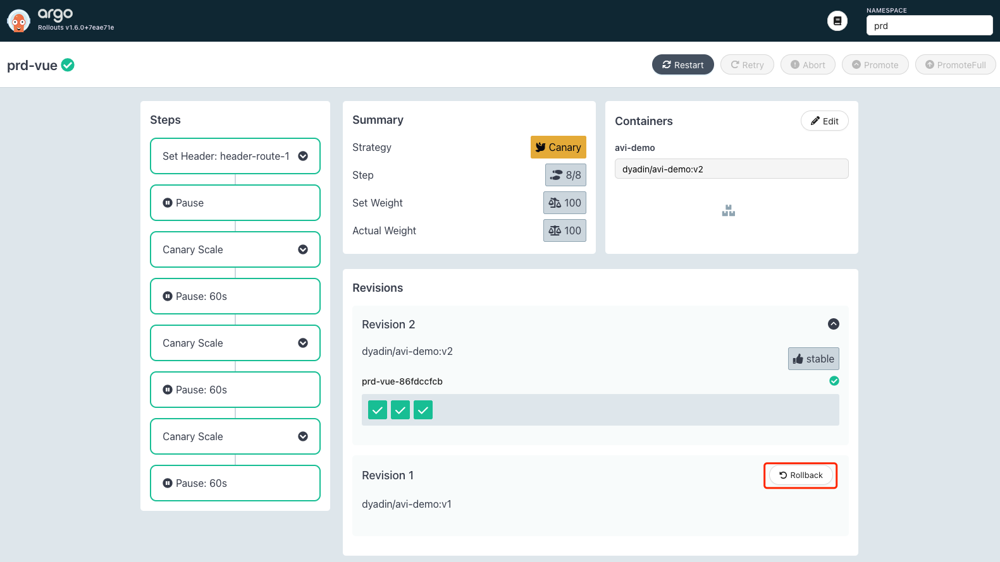


## 参考文档

[https://argoproj.github.io/argo-rollouts/features/specification/](https://argoproj.github.io/argo-rollouts/features/specification/)

[https://github.com/argoproj/argo-rollouts/discussions/2776](https://github.com/argoproj/argo-rollouts/discussions/2776)

[https://md.huanghuanhui.com/RuoYi-Cloud/RuoYi-Cloud.html](https://md.huanghuanhui.com/RuoYi-Cloud/RuoYi-Cloud.html)
