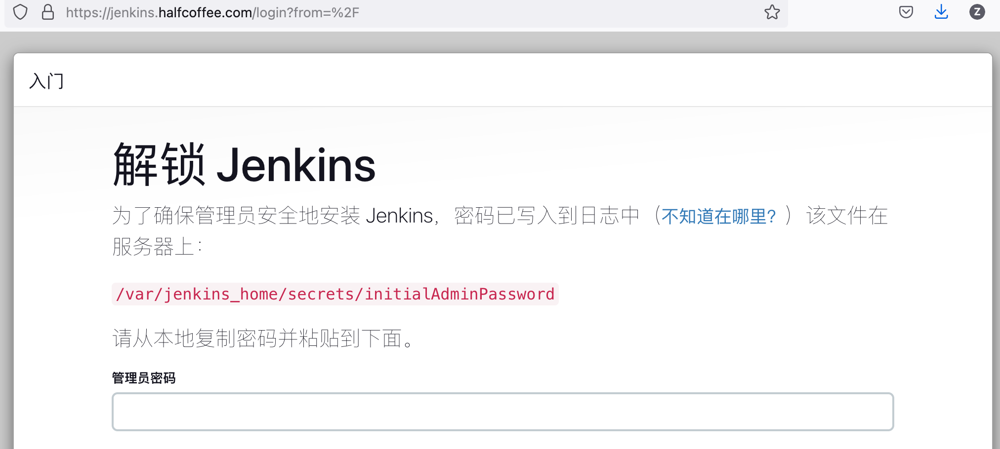
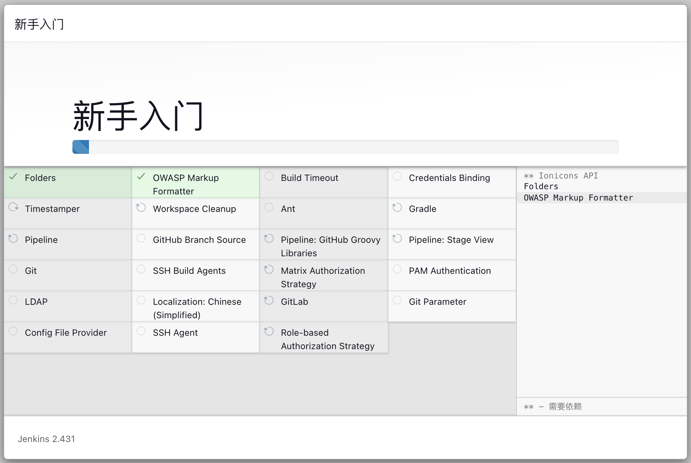
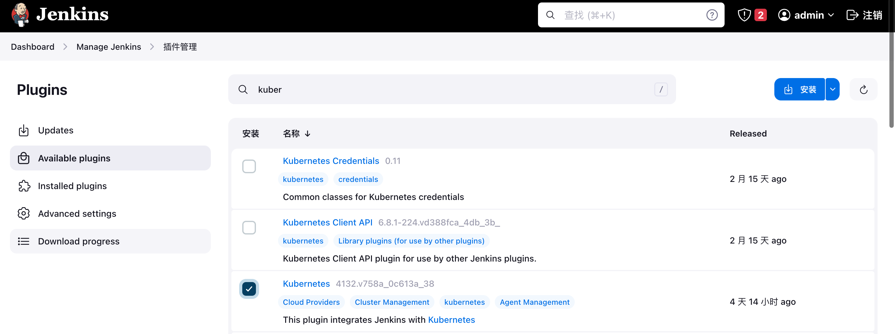

# Kubernetes 中部署 Jenkins（转改）

{: .no_toc}

## 目录

{: .no_toc .text-delta }


1. TOC
{:toc}

## k8s 部署 Jenkins 2.427（jdk-21 版）

```shell
mkdir -p ~/jenkins-prod-yml
kubectl create ns jenkins-prod

# 设置将 Jenkins 固定在 w01 节点
kubectl label node k8s-w01 jenkins-prod=jenkins-prod
```

### RBAC 配置

```shell
cat > ~/jenkins-prod-yml/Jenkins-prod-rbac.yml << 'EOF'
apiVersion: v1
kind: Namespace
metadata:
  name: jenkins-prod
---
apiVersion: v1
kind: ServiceAccount
metadata:
  name: jenkins-prod
  namespace: jenkins-prod
---
apiVersion: rbac.authorization.k8s.io/v1
kind: ClusterRole
metadata:
  annotations:
    rbac.authorization.kubernetes.io/autoupdate: "true"
  labels:
    kubernetes.io/bootstrapping: rbac-defaults
  name: jenkins-prod
rules:
- apiGroups:
  - '*'
  resources:
  - statefulsets
  - services
  - replicationcontrollers
  - replicasets
  - podtemplates
  - podsecuritypolicies
  - pods
  - pods/log
  - pods/exec
  - podpreset
  - poddisruptionbudget
  - persistentvolumes
  - persistentvolumeclaims
  - jobs
  - endpoints
  - deployments
  - deployments/scale
  - daemonsets
  - cronjobs
  - configmaps
  - namespaces
  - events
  - secrets
  verbs:
  - create
  - get
  - watch
  - delete
  - list
  - patch
  - update
- apiGroups:
  - ""
  resources:
  - nodes
  verbs:
  - get
  - list
  - watch
  - update
---
apiVersion: rbac.authorization.k8s.io/v1
kind: ClusterRoleBinding
metadata:
  annotations:
    rbac.authorization.kubernetes.io/autoupdate: "true"
  labels:
    kubernetes.io/bootstrapping: rbac-defaults
  name: jenkins-prod
roleRef:
  apiGroup: rbac.authorization.k8s.io
  kind: ClusterRole
  name: jenkins-prod
subjects:
- apiGroup: rbac.authorization.k8s.io
  kind: Group
  name: system:serviceaccounts:jenkins-prod
EOF

kubectl apply -f ~/jenkins-prod-yml/Jenkins-prod-rbac.yml
```

### deployment （hostpath 模式）

```shell
cat > ~/jenkins-prod-yml/Jenkins-prod-Deployment.yml << 'EOF'
apiVersion: apps/v1
kind: Deployment
metadata:
  name: jenkins-prod
  namespace: jenkins-prod
  labels:
    app: jenkins-prod
spec:
  replicas: 1
  selector:
    matchLabels:
      app: jenkins-prod
  template:
    metadata:
      labels:
        app: jenkins-prod
    spec:
      tolerations:
      - effect: NoSchedule
        key: no-pod
        operator: Exists
      nodeSelector:
        jenkins-prod: jenkins-prod
      containers:
      - name: jenkins-prod
        image: jenkins/jenkins:2.431-jdk21
        securityContext:
          runAsUser: 0
        ports:
        - containerPort: 8080
          name: web
          protocol: TCP
        - containerPort: 50000
          name: agent
          protocol: TCP
        env:
        - name: LIMITS_MEMORY
          valueFrom:
            resourceFieldRef:
              resource: limits.memory
              divisor: 1Mi
        - name: JAVA_OPTS
          value: -Dhudson.security.csrf.GlobalCrumbIssuerConfiguration.DISABLE_CSRF_PROTECTION=true
        volumeMounts:
        - name: jenkins-home-prod
          mountPath: /var/jenkins_home
        - mountPath: /etc/localtime
          name: localtime
      volumes:
      - name: jenkins-home-prod
        hostPath:
          path: /data
          type: DirectoryOrCreate
      - name: localtime
        hostPath:
          path: /etc/localtime
EOF

kubectl apply -f ~/jenkins-prod-yml/Jenkins-prod-Deployment.yml
```

### 创建 Ingress（使用 istio Ingress gw）

```shell
cat > ~/jenkins-prod-yml/Jenkins-prod-Service.yml << 'EOF'
apiVersion: v1
kind: Service
metadata:
  name: jenkins-prod
  namespace: jenkins-prod
  labels:
    app: jenkins-prod
spec:
  selector:
    app: jenkins-prod
  type: NodePort
  ports:
  - name: web
    port: 8080
    targetPort: web
  - name: agent
    nodePort: 30000
    port: 50000
    targetPort: agent
EOF

kubectl apply -f ~/jenkins-prod-yml/Jenkins-prod-Service.yml

cat > ~/jenkins-prod-yml/jenkins-gateway.yaml <<EOF
apiVersion: networking.istio.io/v1alpha3
kind: Gateway
metadata:
  name: jenkins-gateway
  namespace: jenkins-prod
spec:
  selector:
    istio: ingressgateway # use istio default controller
  servers:
  - port:
      number: 443
      name: https
      protocol: HTTPS
    tls:
      mode: SIMPLE
      credentialName: certificate
    hosts:
    - "jenkins.halfcoffee.com"
---
apiVersion: networking.istio.io/v1alpha3
kind: VirtualService
metadata:
  name: jenkins-prod
  namespace: jenkins-prod
spec:
  hosts:
  - "jenkins.halfcoffee.com"
  gateways:
  - jenkins-gateway
  http:
  - match:
    - uri:
        prefix: /
    route:
    - destination:
        host: jenkins-prod
        port:
          number: 8080
EOF

kubectl apply -f ~/jenkins-prod-yml/jenkins-gateway.yaml 
```

之后通过域名即可访问 Jenkins：



管理员密码在 volume 的 secrets 目录中。

### 初始化

#### 按需安装插件

```shell
# 插件
Localization: Chinese (Simplified)
Git
Git Parameter
GitLab				   # webhook 触发构建
Config FIle Provider		# 连接远程k8s集群
Extended Choice Parameter
SSH Agent （build）		# Pipeline通过ssh远程执行命令
Pipeline: Stage View
Role-based Authorization Strategy
```



初始化向导完毕后可以在下列位置部署额外的插件：



```shell
kubernetes 
qy wechat notification
```


## 参考文档

[https://md.huanghuanhui.com/RuoYi-Cloud/RuoYi-Cloud.html](https://md.huanghuanhui.com/RuoYi-Cloud/RuoYi-Cloud.html)
