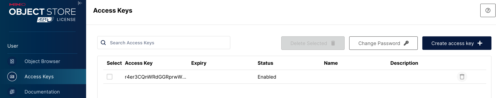

# Velero + Minio 备份 k8s（转改）

{: .no_toc}

## 目录

{: .no_toc .text-delta }


1. TOC
{:toc}

## Minio Docker 部署

```shell
docker run -d \
--name minio \
--restart always \
--privileged=true \
-p 9000:9000 \
-p 5000:5000 \
-v ~/minio/data:/data \
-e "MINIO_ROOT_USER=admin" \
-e "MINIO_ROOT_PASSWORD=Admin@2023" \
-v /etc/localtime:/etc/localtime \
-v /etc/timezone:/etc/timezone \
minio/minio:RELEASE.2023-11-01T18-37-25Z \
server /data --console-address ":5000"
```

通过 5000 端口访问管理页面：


### 创建 access key

在下列位置创建 access key，并保存备用（一旦创建后无法再查看其 secret）：



## 创建 velero bucket

```shell
docker pull minio/mc:latest

# 分别创建下列 bucket(velero 之外的未来会使用)
docker run --rm -it --entrypoint=/bin/sh minio/mc -c "
mc alias set minio http://10.10.50.16:9000 admin Admin@2023
mc mb minio/velero-k8s"

docker run --rm -it --entrypoint=/bin/sh minio/mc -c "
mc alias set minio http://10.10.50.16:9000 admin Admin@2023
mc mb minio/gitlab"


docker run --rm -it --entrypoint=/bin/sh minio/mc -c "
mc config host add minio http://10.10.50.16:9000 admin Admin@2023
mc mb minio/jenkins"
```

## 安装 velero


```shell
wget https://github.com/vmware-tanzu/velero/releases/download/v1.12.1/velero-v1.12.1-linux-amd64.tar.gz

tar xf ~/velero-v1.12.1-linux-amd64.tar.gz
cp ~/velero-v1.12.1-linux-amd64/velero /usr/local/bin

mkdir -p ~/velero
cat > ~/velero/velero-auth.txt << 'EOF'
# 创建访问 minio 的认证文件，可以使用用户名+密码，也可以使用 access key，建议使用 access key
[default]
aws_access_key_id = r4er3CQnWRdGGRprwWkh
aws_secret_access_key = dfrI1zbWJxJhktfUlDlTv8h4bz1YyxDHRA0glS7K
EOF

# 安装 velero
velero --kubeconfig /root/.kube/config \
  install \
    --provider aws \
    --plugins velero/velero-plugin-for-aws:v1.8.1 \
    --bucket velero-k8s \
    --secret-file ~/velero/velero-auth.txt \
    --use-volume-snapshots=false \
    --uploader-type=restic \
    --use-node-agent \
    --image=velero/velero:v1.12.1 \
    --namespace velero-system \
    --backup-location-config region=minio,s3ForcePathStyle="true",s3Url=http://10.10.50.16:9000
```

## 手动备份（不带 pv）

```shell
DATE=`date +%F-%H-%M-%S`
k8s_ns=prd

velero backup create ${k8s_ns}-backup-${DATE} \
--include-namespaces ${k8s_ns} \
--kubeconfig=/root/.kube/config \
--namespace velero-system
```

相应的日志：

```shell
Backup request "prd-backup-2023-12-04-12-14-47" submitted successfully.
Run `velero backup describe prd-backup-2023-12-04-12-14-47` or `velero backup logs prd-backup-2023-12-04-12-14-47` for more details.
```

查看备份记录：

```shell
[root@k8s-m01 ~]# velero backup get --namespace velero-system
NAME                                     STATUS      ERRORS   WARNINGS   CREATED                         EXPIRES   STORAGE LOCATION   SELECTOR
prd-backup-2023-12-04-12-25-01   Completed   0        0          2023-12-04 12:25:16 +0800 CST   29d       default            <none>
```

### 恢复测试（将其恢复到不同的 ns）

```shell
kubectl create ns prd-bak
velero restore create --from-backup "prd-backup-2023-12-04-12-25-01" --namespace-mappings prd:prd-bak --wait --namespace velero-system
```

相关日志：


```shell
Restore request "prd-backup-2023-12-04-12-25-01-20231204123139" submitted successfully.
Waiting for restore to complete. You may safely press ctrl-c to stop waiting - your restore will continue in the background.
........
Restore completed with status: Completed. You may check for more information using the commands `velero restore describe prd-backup-2023-12-04-12-25-01-20231204123139` and `velero restore logs prd-backup-2023-12-04-12-25-01-20231204123139`.

[root@k8s-m01 ~]# kubectl -n prd-bak get all
NAME                         READY   STATUS    RESTARTS   AGE
pod/prd-vue-c4979c7c-6dnqx   2/2     Running   0          51s
pod/prd-vue-c4979c7c-dj8g4   2/2     Running   0          51s
pod/prd-vue-c4979c7c-grbfm   2/2     Running   0          51s

NAME                         TYPE        CLUSTER-IP      EXTERNAL-IP   PORT(S)   AGE
service/prd-vue-svc-canary   ClusterIP   10.109.7.5      <none>        80/TCP    51s
service/prd-vue-svc-stable   ClusterIP   10.108.106.25   <none>        80/TCP    51s

NAME                               DESIRED   CURRENT   READY   AGE
replicaset.apps/prd-vue-c4979c7c   3         3         3       51s
```

删除恢复：

```shell
# 获取已经 restore 的备份：
velero restore get --namespace velero-system
NAME                                            BACKUP                           STATUS      STARTED                         COMPLETED                       ERRORS   WARNINGS   CREATED                         SELECTOR
prd-backup-2023-12-04-12-25-01-20231204123139   prd-backup-2023-12-04-12-25-01   Completed   2023-12-04 12:31:53 +0800 CST   2023-12-04 12:32:02 +0800 CST   0        5          2023-12-04 12:31:39 +0800 CST   <none>

# 删除 restore：
velero delete restore  --namespace velero-system
An error occurred: you must specify exactly one of: specific restore name(s), the --all flag, or the --selector flag
[root@k8s-m01 ~]# velero delete restore prd-backup-2023-12-04-12-25-01-20231204123139 --namespace velero-system
Are you sure you want to continue (Y/N)? y
Request to delete restore "prd-backup-2023-12-04-12-25-01-20231204123139" submitted successfully.
The restore will be fully deleted after all associated data (restore files in object storage) are removed.
```

## 手动备份（带 pv）

```shell
DATE=`date +%F-%H-%M-%S`
k8s_ns=jenkins-prod

velero backup create ${k8s_ns}-backup-${DATE} \
--include-namespaces ${k8s_ns} \
--default-volumes-to-fs-backup \
--kubeconfig=/root/.kube/config \
--namespace velero-system

# 恢复
velero restore create --from-backup "jenkins-prod-backup-2023-11-08-13-05-31" --wait --namespace velero-system
```

## 自动备份

```shell
# 创建备份计划（每天 0 时 0 分备份，保留备份数据 7 天）
k8s_ns=prd

velero schedule create ${k8s_ns}-backup \
--schedule="0 0 * * *" \
--ttl 168h0m0s \
--include-namespaces ${k8s_ns} \
--default-volumes-to-fs-backup \
--kubeconfig=/root/.kube/config \
--namespace velero-system
```


```shell
velero get schedule --namespace velero-system
NAME         STATUS    CREATED                         SCHEDULE    BACKUP TTL   LAST BACKUP   SELECTOR   PAUSED
prd-backup   Enabled   2023-12-04 12:43:48 +0800 CST   0 0 * * *   168h0m0s     n/a           <none>     false
```

```shell
# 删除备份计划
k8s_ns=prd
velero schedule delete ${k8s_ns}-backup --kubeconfig=/root/.kube/config --namespace velero-system
```


## 参考文档

[https://md.huanghuanhui.com/devops/devops.html#12velero--minio%E5%A4%87%E4%BB%BD%E5%AE%B9%E7%81%BE%EF%BC%89](https://md.huanghuanhui.com/devops/devops.html#12velero--minio%E5%A4%87%E4%BB%BD%E5%AE%B9%E7%81%BE%EF%BC%89)
