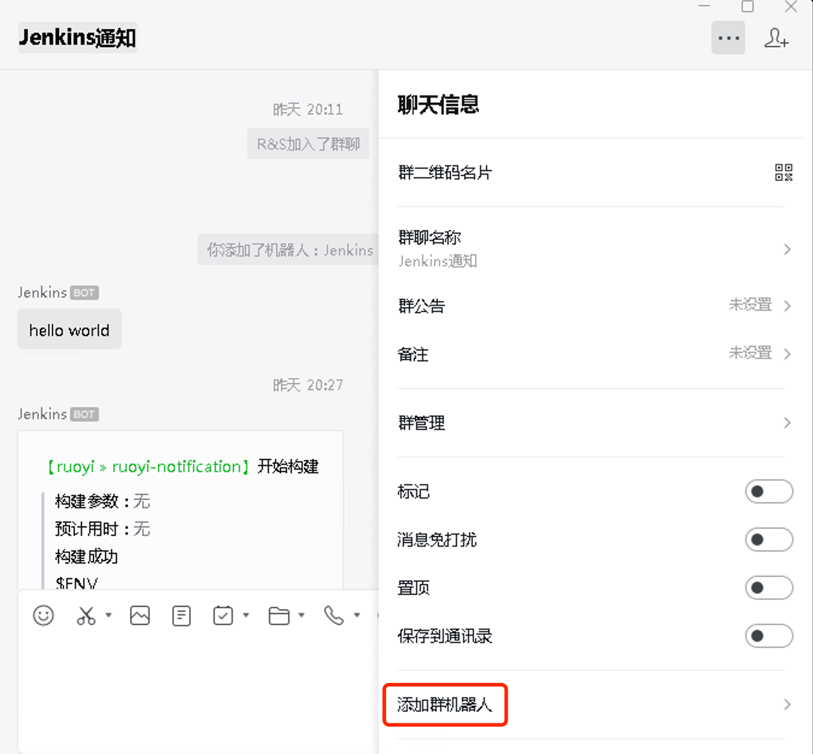
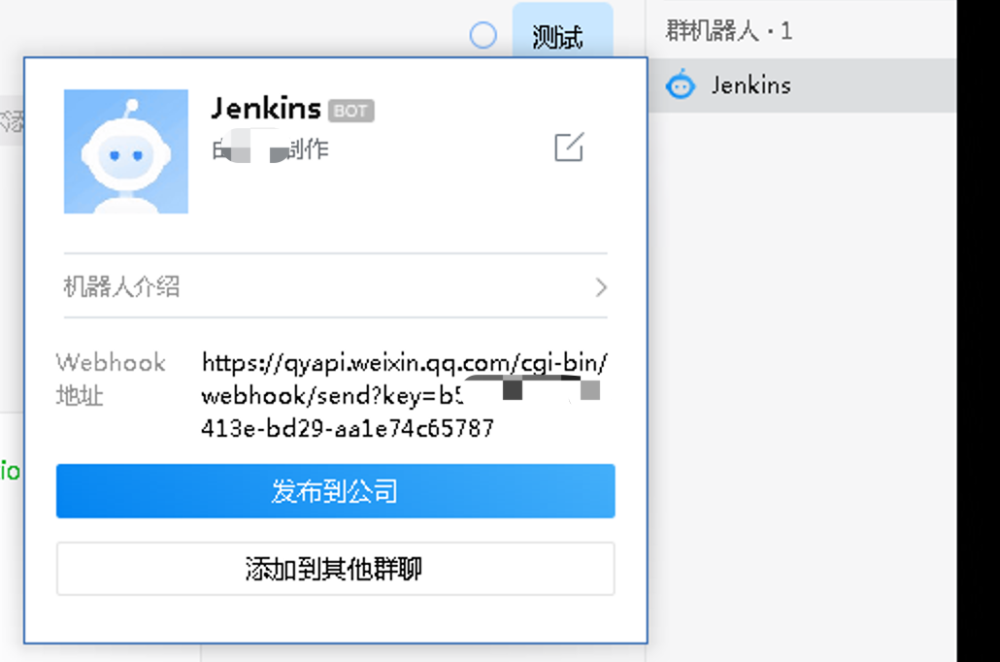
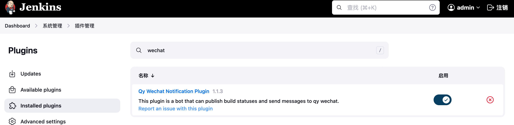
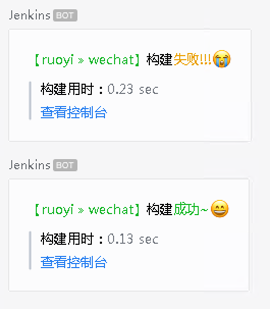
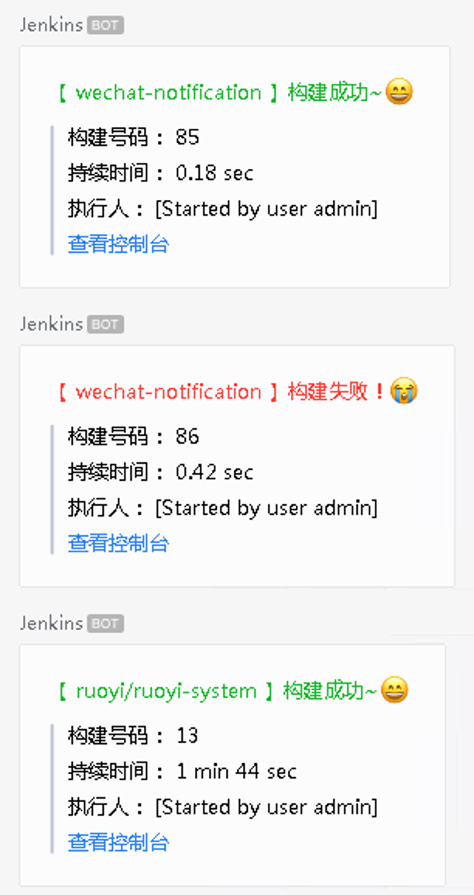
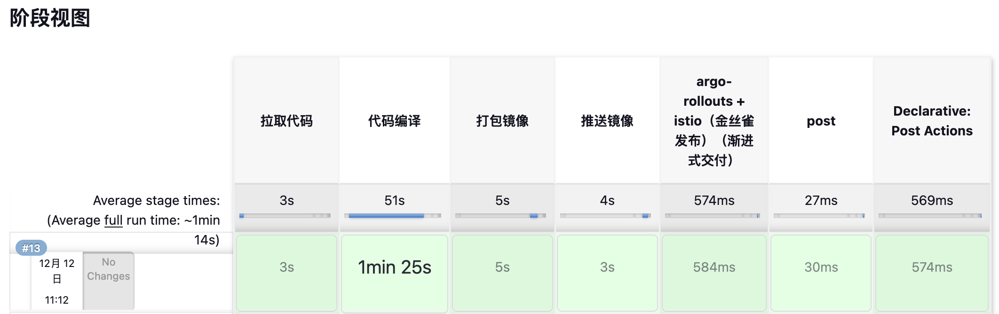
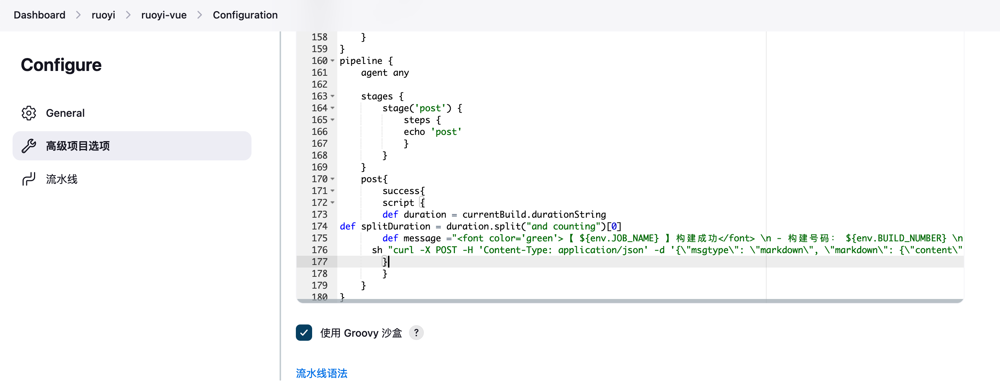
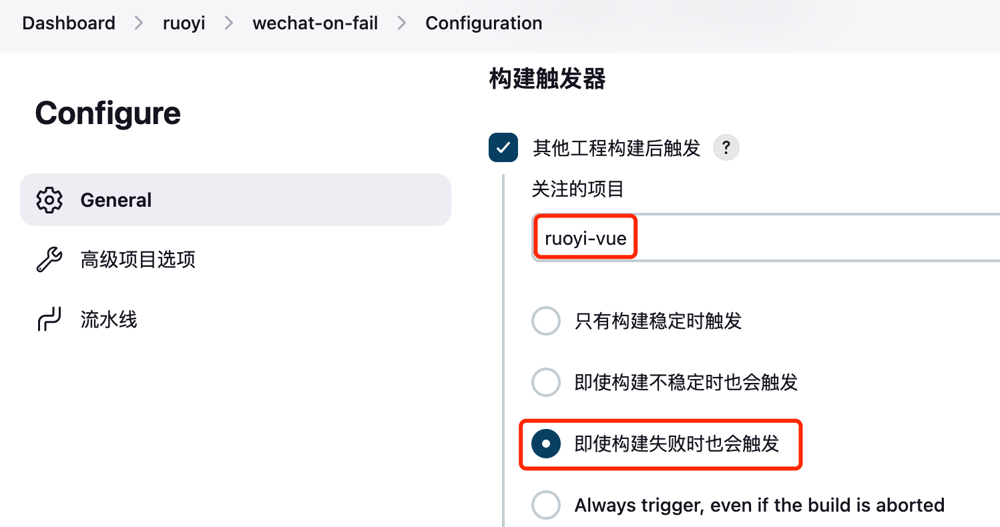

# Jenkins 企业微信对接

{: .no_toc}

## 目录

{: .no_toc .text-delta }


1. TOC
{:toc}

## 基础准备：为群聊开启机器人

在群聊的下列位置添加群机器人（电脑或手机端均支持此功能）：



添加完成后记录 webhook 地址（注意此地址千万不要外泄）：



## 初阶：通过企业微信插件来实现通知

### 安装企业微信对接插件

在 Jenkins 插件管理>Available 中搜索 wechat，安装 Qy Wechat Notification Plugin：



在流水线的最后添加下列内容：

```yaml
// 前面是完整的 podtemplate，在所有 } 结束之后添加下面的内容
// 流水线脚本详见[ https://blog.halfcoffee.com/docs/cloudnative/k8s/jenkins]

pipeline {
    agent any

    stages {
        stage('post') {
            steps {
            echo 'post'
            }
        }
    }
    post{
        success{
                qyWechatNotification failNotify: true, webhookUrl: 'https://qyapi.weixin.qq.com/cgi-bin/webhook/send?key=b13e-bd29-aa1e74c65787', moreInfo:'成功'
        }
        failure{
                qyWechatNotification failNotify: true, webhookUrl: 'https://qyapi.weixin.qq.com/cgi-bin/webhook/send?key=b13e-bd29-aa1e74c65787', moreInfo:'失败'
        }
    }
}

```

测试结果如下，在企业微信中可以收到项目构建成功或者失败的基本消息：




## 高阶：通过 curl 自定义发送的内容

Jenkins 企业微信对接插件能发送的功能很有限，于是自己尝试用 curl 来调用 webhook 来发送消息，只需在流水线的最后添加下列内容，将 webhook 地址更改为自己的地址即可：


```yaml
// 前面是完整的 podtemplate，在所有 } 结束之后添加下面的内容
// 流水线脚本详见[ https://blog.halfcoffee.com/docs/cloudnative/k8s/jenkins]

pipeline {
    agent any

    stages {
        stage('post') {
            steps {
            echo 'post' 
            }
        }
    }
    post{
        success{
        script {
        def duration = currentBuild.durationString
def splitDuration = duration.split("and counting")[0]
        def message ="<font color='green'>【 ${env.JOB_NAME} 】构建成功~😄</font> \n > 构建号码： ${env.BUILD_NUMBER} \n > 持续时间： ${splitDuration} \n > 执行人： ${currentBuild.buildCauses.shortDescription} \n > [查看控制台](${env.BUILD_URL})"
      sh "curl -X POST -H 'Content-Type: application/json' -d '{\"msgtype\": \"markdown\", \"markdown\": {\"content\": \"${message}\"}}' https://qyapi.weixin.qq.com/cgi-bin/webhook/send?key=b13e-bd29-aa1e74c65787"    
        }

        }
        failure{
        script {
        def duration = currentBuild.durationString
def splitDuration = duration.split("and counting")[0]
        def message ="<font color='red'>【 ${env.JOB_NAME} 】构建失败！😭</font> \n > 构建号码： ${env.BUILD_NUMBER} \n > 持续时间： ${splitDuration} \n > 执行人： ${currentBuild.buildCauses.shortDescription} \n > [查看控制台](${env.BUILD_URL})"
      sh "curl -X POST -H 'Content-Type: application/json' -d '{\"msgtype\": \"markdown\", \"markdown\": {\"content\": \"${message}\"}}' https://qyapi.weixin.qq.com/cgi-bin/webhook/send?key=b13e-bd29-aa1e74c65787"    
        }
        }
    }
}
```

效果如下：



最后一个通告对应的阶段视图如下，前面 5 个阶段均为 podtemplate 的 stage，最后两个是发送成功或失败消息的 stage：



## 如何与 Podtemplate 联动

在测试时发现，如果将 pipeline 内容放在 podtemplate，只有前面的 podtemplate 执行成功才会执行后面的 pipeline，这会导致实际上只有成功的警告才会发送到企业微信，解法有两种：

- 全部使用 pipeline，不使用 podtemplate
- 在原始流水线中通过 pipeline 加入成功的告警，再新建一个流水线，进行失败的告警

下面使用第二种进行演示：

主流水线内容如下，添加了 pipeline，仅在成功时告警：



新建一个流水线，设置在上面的流水线执行完后触发：



Pipeline 使用下面的脚本，脚本会获取 ruoiy-vue 上一次构建的状态，如果查找到 FAILURE 则退出，然后后面的 post 再发送构建失败的警告。

```shell
pipeline {
    agent any

    stages {
        stage('post') {
            steps {
            sh '''
            curl https://jenkins.halfcoffee.com/job/ruoyi/job/ruoyi-vue/lastBuild/api/json | grep '"result":"FAILURE"' && exit 1
            '''
            }
        }
    }
    post{
        failure{
        script {
        def duration = currentBuild.durationString
def splitDuration = duration.split("and counting")[0]
        def message ="<font color='red'>【ruoyi-vue】构建失败！😭</font> \n  > [查看控制台](https://jenkins.halfcoffee.com/job/ruoyi/job/ruoyi-vue/lastBuild/)"
      sh "curl -X POST -H 'Content-Type: application/json' -d '{\"msgtype\": \"markdown\", \"markdown\": {\"content\": \"${message}\"}}' https://qyapi.weixin.qq.com/cgi-bin/webhook/send?key=b13e-bd29-aa1e74c65787"    
        }
        }
    }
}
```

