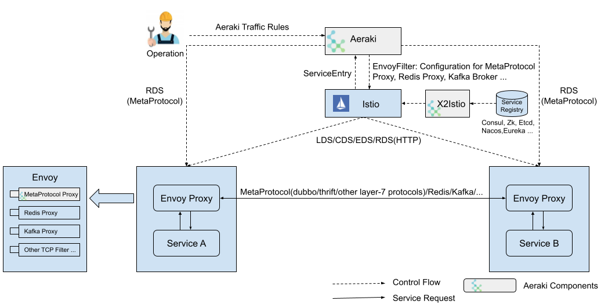
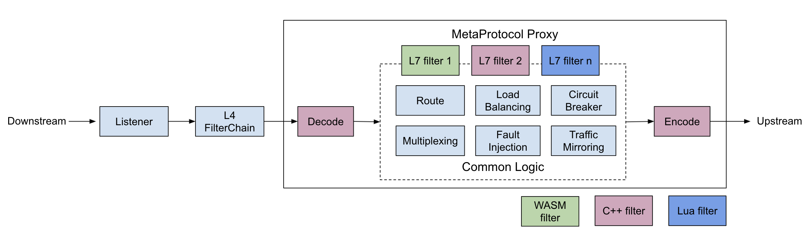

{: .no_toc}

## 目录

{: .no_toc .text-delta }


1. TOC
{:toc}

# Dubbo 与 Istio 对接

## Aeraki Mesh

Aeraki 用于解决 Istio 仅支持 HTTP 协议的问题，通常在企业中会有非 HTTP 的传统微服务用到的一些协议，比如 Dubbo，Thrift 等。

- 控制面：Aeraki 和 Istio 共同作为控制面，通过 xDS 控制面标准接口下发 MetaProtocol Proxy 所需的配置信息；

- 数据面：Aeraki Mesh 的 MetaProtocol Proxy 是个数据面七层代理通用框架，其中自带了 Dubbo codec(Meta-Dubbo)；

- 注册表对接：Dubbo2Istio 可以连接 Dubbo 服务注册表，将其中注册的 Dubbo 服务转换为 ServiceEntry，自动同步到 Istio 中，Dubbo2Istio 支持 ZooKeeper，Nacos，Etcd 三种类型的 Dubbo 服务注册表，支持 Dubbo interface 级别的服务发现和治理。




### MetaProtocol Proxy

MetaProtocol Proxy 用于实现七层协议的通用逻辑框架：负载均衡、熔断、动态路由、消息头修改，本地/全局限流、请求指标上报、调用跟踪等；

此框架下只需要数百行代码（在 Decode 和 Encode 位置）即可支持一个新的协议；

提供基于 C++、WASM、Lua 的 L7 Filter 扩展点，灵活实现自定义协议处理逻辑，比如认证授权等。



### 通过 Dubbo2istio 进行服务注册

1：在部署 deploy 时，通过环境变量的形式，将上述变量传递给 pod，应用在启动时会获得这些信息然后进行注册；

```yaml
kind: Deployment
metadata:
  name: dubbo-sample-provider-v2
  labels:
    app: dubbo-sample-provider
spec:
  selector:
    matchLabels:
      app: dubbo-sample-provider
  replicas: 1
  template:
    metadata:
      labels:
        app: dubbo-sample-provider
        version: v2
    spec:
      containers:
        - name: dubbo-sample-provider
          image: aeraki/dubbo-sample-provider
          imagePullPolicy: Always
          env: # 设置 AERAKI_META 相关的环境变量
            - name: AERAKI_META_APP_NAMESPACE
              valueFrom:
                fieldRef:
                  fieldPath: metadata.namespace
            - name: AERAKI_META_APP_SERVICE_ACCOUNT
              valueFrom:
                fieldRef:
                  fieldPath: spec.serviceAccountName
            - name: AERAKI_META_WORKLOAD_SELECTOR
              value: "dubbo-sample-provider"     # The deployment must have a label: app:dubbo-sample-provider
            - name: AERAKI_META_APP_VERSION
              value: v2
```

2：应用中将 namespace、Service account、version、workload selector 作为自定义参数注册到注册中心；

应用侧配置：

```xml
      <dubbo:application name="dubbo-sample-provider">
      <dubbo:parameter key="aeraki_meta_app_namespace" value="${AERAKI_META_APP_NAMESPACE}" />
      <dubbo:parameter key="aeraki_meta_app_service_account" value="${AERAKI_META_APP_SERVICE_ACCOUNT}" />
      <dubbo:parameter key="aeraki_meta_app_version" value="${AERAKI_META_APP_VERSION}" />
      <dubbo:parameter key="aeraki_meta_workload_selector" value="${AERAKI_META_WORKLOAD_SELECTOR}" />
    </dubbo:application>
```

3：dubbo2istio 自动同步 dubbo 注册表，生成 istio 的 ServiceEntry 以及 endpoint 信息。

或者手动编写 ServiceEntry，通过 workloadselector 来定义服务（静态配置下将不支持外部的服务，仅支持 k8s Pod）

```yaml
apiVersion: networking.istio.io/v1alpha3
kind: ServiceEntry
metadata:
  name: dubbo-demoservice
  namespace: meta-dubbo
  annotations:
    interface: org.apache.dubbo.samples.basic.api.DemoService
spec:
  hosts:
    - org.apache.dubbo.samples.basic.api.demoservice
  ports:
    - number: 20880
      name: tcp-metaprotocol-dubbo
      protocol: TCP
  workloadSelector:
    labels:
      app: dubbo-sample-provider
  resolution: STATIC
```


### 服务发现

直接在服务调用时，填写 Service Entry 的域名。


# 参考文档

[https://www.zhaohuabing.com/post/2021-09-27-aeraki/](https://www.zhaohuabing.com/post/2021-09-27-aeraki/)

[https://www.aeraki.net/zh/docs/v1.x/tutorials/dubbo/](https://www.aeraki.net/zh/docs/v1.x/tutorials/dubbo/)
