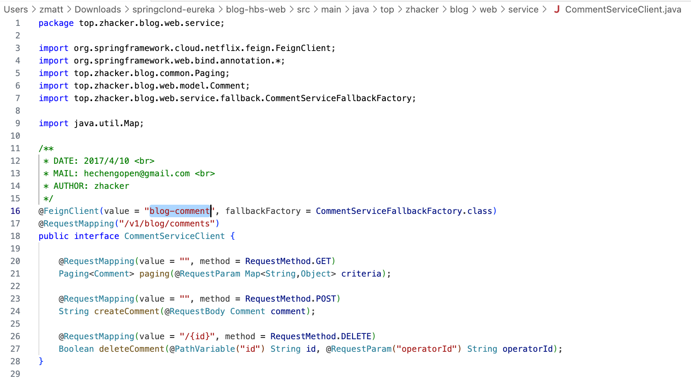

## 应用架构发展

JEE：Java 平台企业版，此架构下将企业级软件分为三个层级：

- Web 层：负责与用户交互或者对外提供接口

- 业务逻辑层：流程处理、计算处理模块

- 数据存取层：将业务逻辑层的结果持久化

JEE 下将 80% 通用的与业务无关的逻辑和流程封装在应用服务器的模块化组件中，通过配置的形式给应用使用。另外 20% 实现应用的专用逻辑。

JEE 典型的架构：

- Client --> Web 容器 --> EJB 容器 -数据存储 ORM-> 数据库

此架构下，各个模块的运维管理独立，包括前端 UI 研发、后端应用逻辑研发和 DBA（ORM团队）。

## SpringCloud 微服务体系组件

- 注册中心：Eureka，Consul

- RPC 框架：Feign+Ribbon 

- API 网关：Zuul，Gateway

- 熔断、限流：Hystrix

- 链路监控：Zipkin，Seluth

- 消息中间件集成：Stream

- 契约测试：Contract

## SpringCloud Alibaba 微服务技术栈

- 注册中心：Nacos
- RPC 框架：Dubbo
- 分布式事务：seata
- 熔断、限流：Sentinel
- API 网关：APIX？
- MQ：RocketMQ

## SpringCloud Alibaba + 国内开源组件

- Apollo（携程开源的 Spring Cloud Config）
- CAT（大众点评开源 Zipkin、Seluth）
- Prometheus
- ELK
- Spring Cloud Gateway（Nginx+Lua、Kong、Zuul、自研 API 网关）

## 注册中心

### 作用

存放和调度服务，微服务中的通讯录，记录服务和服务地址的映射关系。

如果没有注册中心，则每个服务调用彼此时需要在代码中写死被调用端的 IP，手动操作且不便于扩展。

### 对比

| 特性                                  | Eureka      | Nacos                      | Consul            | Zookeeper |
| ------------------------------------- | ----------- | -------------------------- | ----------------- | --------- |
| C、A、P（一致性、可用性、分区容错性） | AP          | CP+AP                      | CP                | CP        |
| 健康检查                              | Client 心跳 | Client 心跳/TCP/HTTP/MySQL | TCP/HTTP/gRPC/Cmd | KeepAlive |
| 雪崩保护                              | 有          | 有                         | 无                | 无        |
| 自动注销实例                          | 支持        | 支持                       | 不支持            | 支持      |
| 访问协议                              | HTTP        | HTTP/DNS                   | HTTP/DNS          | TCP       |
| 监听支持                              | 支持        | 支持                       | 支持              | 支持      |
| 多数据中心                            | 支持        | 支持                       | 支持              | 不支持    |
| 跨注册中心同步                        | 不支持      | 支持                       | 支持              | 不支持    |
| Spring Cloud 集成                     | 支持        | 支持                       | 支持              | 支持      |

## Nacos 中的概念

Service：一个个服务，比如订单、商品目录

instance：提供服务的一个个实例，可以是 Pod、VM 等

namespace：服务于同一个业务的多个服务，也可以是一个技术团队。

Nacos 的几个工作任务：

- 服务注册：服务实例上线时，连接到 Nacos 通告自己的 IP 和端口
- 心跳检查：Nacos 定期检测心跳，在实例故障后将其从注册表里摘除
- 服务查询：Consumer 访问 Nacos 来通过 Open API 获取 Provider 的服务实例列表。Client 也会定期从 Nacos 来获取最新的服务实例列表。Client 也可以监听某些服务的状态，在出现下线时 Nacos 通知 Client 快速切换。

## 一个 SpringCloud 微服务示例

此项目是一个微服务化的博客，除数据库外多个模块都部署在 k8s 内部，通过部署在 k8s 内的 eureka 进行服务发现。

一些和网络相关的设置：

- 没有使用 k8s 自己的 svc，服务间调用直接使用 Pod IP（待验证，在 Eureka 中注册的服务显示为 hostname，底层应该使用 IP 通信，而非 hostname）
- Java 程序中直接定义好了访问服务的名称，不会像 k8s 一样通过环境变量来动态传递到容器中
- Eureka 通过 NodePort 暴露到外部进行管理，集群内通过 headless Service 暴露
- blog-hbs-web 作为 Gateway 对外暴露

[https://github.com/Linux-kubernetes-k8s/springclond-eureka](https://github.com/Linux-kubernetes-k8s/springclond-eureka)

[https://www.bilibili.com/video/BV1aN4y1G7Bf/?spm_id_from=333.337.search-card.all.click&vd_source=d620370f560737fbbd5e4605d9c4c1eb](https://www.bilibili.com/video/BV1aN4y1G7Bf/?spm_id_from=333.337.search-card.all.click&vd_source=d620370f560737fbbd5e4605d9c4c1eb)
