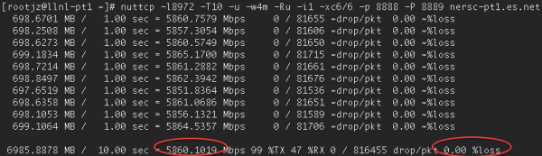
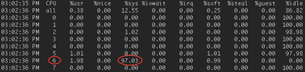
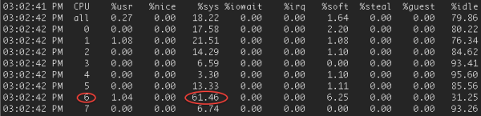

## 目录
{: .no_toc .text-delta }

1. TOC
{:toc}

## docker image下载

```shell
docker image pull mlabbe/iperf3

#离线保存使用
docker image save mlabbe/iperf3 -o iperf3.tar
```

离线包：

[iperf3.tar](/output/iperf3.tar)

## 使用

### docker run

通过 docker run 运行一个 iperf3 server，需要通过外部 iperf3 连接或者新开一个容器来连接测试

```shell
docker run --restart=unless-stopped --name=iperf3 -d -p 5201:5201/tcp -p 5201:5201/udp mlabbe/iperf3
```


运行一个 Client 来直接连接到上述 server 容器的 IP 进行测试

```shell
#获取 iperf3 server 的 IP
docker ps | grep iperf | awk '{print $1}
docker inspect XXX  | grep IPAddress

#连接到容器 IP 
docker run -it --rm --name=iperf3-client  mlabbe/iperf3 -c 172.17.0.3

Connecting to host 172.17.0.3, port 5201
[  5] local 172.17.0.4 port 38575 connected to 172.17.0.3 port 5201
[ ID] Interval           Transfer     Bitrate         Retr  Cwnd
[  5]   0.00-1.00   sec  2.01 GBytes  17.2 Gbits/sec  1407    899 KBytes
[  5]   1.00-2.00   sec  2.43 GBytes  20.9 Gbits/sec    0    899 KBytes
[  5]   2.00-3.00   sec  3.38 GBytes  29.0 Gbits/sec  1407    510 KBytes
[  5]   3.00-4.00   sec  3.04 GBytes  26.1 Gbits/sec  460    655 KBytes
[  5]   4.00-5.00   sec  3.13 GBytes  26.9 Gbits/sec  491   1.30 MBytes
[  5]   5.00-6.00   sec  2.89 GBytes  24.8 Gbits/sec  1584    979 KBytes
[  5]   6.00-7.00   sec  2.80 GBytes  24.1 Gbits/sec  1036   1.21 MBytes
[  5]   7.00-8.00   sec  2.67 GBytes  22.9 Gbits/sec  617   1.49 MBytes
[  5]   8.00-9.00   sec  2.01 GBytes  17.2 Gbits/sec  1181    614 KBytes
[  5]   9.00-10.00  sec  3.71 GBytes  31.9 Gbits/sec  1473    363 KBytes
- - - - - - - - - - - - - - - - - - - - - - - - -
[ ID] Interval           Transfer     Bitrate         Retr
[  5]   0.00-10.00  sec  28.1 GBytes  24.1 Gbits/sec  9656             sender
[  5]   0.00-10.01  sec  28.1 GBytes  24.1 Gbits/sec                  receiver

```


```shell
#或者连接到 Host 映射的地址
docker run -it --rm --name=iperf3-client  mlabbe/iperf3 -c 192.168.43.132

Connecting to host 192.168.43.132, port 5201
[  5] local 172.17.0.4 port 33843 connected to 192.168.43.132 port 5201
[ ID] Interval           Transfer     Bitrate         Retr  Cwnd
[  5]   0.00-1.00   sec  1.07 GBytes  9.18 Gbits/sec    0   1.62 MBytes
[  5]   1.00-2.00   sec   958 MBytes  8.03 Gbits/sec    0   1.87 MBytes
[  5]   2.00-3.00   sec   346 MBytes  2.90 Gbits/sec    1   1.87 MBytes
[  5]   3.00-4.00   sec   808 MBytes  6.78 Gbits/sec   99   1.87 MBytes
[  5]   4.00-5.00   sec  1.06 GBytes  9.09 Gbits/sec  137   1017 KBytes
[  5]   5.00-6.00   sec  1.04 GBytes  8.91 Gbits/sec  240    375 KBytes
[  5]   6.00-7.01   sec   792 MBytes  6.57 Gbits/sec   59    277 KBytes
[  5]   7.01-8.00   sec   919 MBytes  7.77 Gbits/sec  100    387 KBytes
[  5]   8.00-9.01   sec   419 MBytes  3.50 Gbits/sec  198    393 KBytes
[  5]   9.01-10.00  sec   714 MBytes  6.03 Gbits/sec  135    512 KBytes
- - - - - - - - - - - - - - - - - - - - - - - - -
[ ID] Interval           Transfer     Bitrate         Retr
[  5]   0.00-10.00  sec  8.00 GBytes  6.87 Gbits/sec  969             sender
[  5]   0.00-10.02  sec  8.00 GBytes  6.85 Gbits/sec                  receiver


UDP 测试：
# docker run -it --rm --network=host --name=iperf3-server mlabbe/iperf3 iperf3 -c 10.10.50.51 -u -b0 -l20k
warning: UDP block size 20480 exceeds TCP MSS 1448, may result in fragmentation / drops
Connecting to host 10.10.50.51, port 5201
[  5] local 10.10.50.52 port 41537 connected to 10.10.50.51 port 5201
[ ID] Interval           Transfer     Bitrate         Total Datagrams
[  5]   0.00-1.00   sec   820 MBytes  6.88 Gbits/sec  41970
[  5]   1.00-2.00   sec   609 MBytes  5.11 Gbits/sec  31190
[  5]   2.00-3.00   sec   671 MBytes  5.62 Gbits/sec  34330
[  5]   3.00-4.00   sec   654 MBytes  5.48 Gbits/sec  33470
[  5]   4.00-5.00   sec   638 MBytes  5.35 Gbits/sec  32670
[  5]   5.00-6.00   sec   618 MBytes  5.19 Gbits/sec  31660
[  5]   6.00-7.00   sec   615 MBytes  5.16 Gbits/sec  31480
[  5]   7.00-8.00   sec   610 MBytes  5.11 Gbits/sec  31210
[  5]   8.00-9.00   sec   494 MBytes  4.14 Gbits/sec  25270
[  5]   9.00-10.00  sec   523 MBytes  4.39 Gbits/sec  26780
- - - - - - - - - - - - - - - - - - - - - - - - -
[ ID] Interval           Transfer     Bitrate         Jitter    Lost/Total Datagrams
[  5]   0.00-10.00  sec  6.10 GBytes  5.24 Gbits/sec  0.000 ms  0/320030 (0%)  sender
[  5]   0.00-10.04  sec  5.64 GBytes  4.82 Gbits/sec  0.023 ms  24546/320030 (7.7%)  receiver
```


使用 -V 显示更多信息：

```shell
[root@Rancher-02 ~]# docker run -it --rm --network=host --name=iperf3-server mlabbe/iperf3 iperf3 -c 10.10.50.51  -b0 -V -u -t 2
iperf 3.7
Linux Rancher-02 4.4.217-1.el7.elrepo.x86_64 #1 SMP Fri Mar 20 08:57:17 EDT 2020 x86_64
Control connection MSS 1448
Setting UDP block size to 1448
Time: Mon, 11 May 2020 03:38:39 UTC
Connecting to host 10.10.50.51, port 5201
      Cookie: bbbqcgtmvjie3nl7tl2sybkeuk75i6efkhea
[  5] local 10.10.50.52 port 40723 connected to 10.10.50.51 port 5201
Starting Test: protocol: UDP, 1 streams, 1448 byte blocks, omitting 0 seconds, 2 second test, tos 0
[ ID] Interval           Transfer     Bitrate         Total Datagrams
[  5]   0.00-1.00   sec   338 MBytes  2.84 Gbits/sec  245080
[  5]   1.00-2.00   sec   140 MBytes  1.17 Gbits/sec  101430
- - - - - - - - - - - - - - - - - - - - - - - - -
Test Complete. Summary Results:
[ ID] Interval           Transfer     Bitrate         Jitter    Lost/Total Datagrams
[  5]   0.00-2.00   sec   479 MBytes  2.01 Gbits/sec  0.000 ms  0/346510 (0%)  sender
[  5]   0.00-2.04   sec   464 MBytes  1.91 Gbits/sec  0.005 ms  10639/346410 (3.1%)  receiver
CPU Utilization: local/sender 65.0% (5.8%u/59.2%s), remote/receiver 2.4% (0.4%u/2.0%s)

iperf Done.

```

## 参数说明

-c 连接到 server

-s 作为server 启动，默认使用 5201 端口

-u 使用UDP(默认使用TCP)

-t 测试时间，默认10s

-p 指定其他端口

-P 线程数

-M 调整 TCP/SCTP maximum segment size (MTU - 40 bytes)

 -b, --bitrate，设置目标速率 bits/sec (0 表示不限制 unlimited)，默认 UDP 为 1 Mbit/sec，TCP 无限制。例如 （1000M，或者 0 ）

-V 显示详细的数据

-d debug 模式

-A CPU affinity，

-l 读写缓存的大小，默认 TCP 为 128KB，UDP 默认根据路径的 MTU 动态协商，如果协商失败默认使用 1460

-w window size/socket buffer 大小，默认 iperf 使用操作系统的默认值。默认 TCP 会自动进行调整。对于 UDP，默认的 UDP buffer size 非常小，因此测不出很高的性能（常见的现象是丢包多），在 macos 和 FreeBSD 下默认 UDP buffer 为 9216 字节，在 Centos 7.3上默认为 212992 字节，ESnet （创造 iperf3 的公司）建议在测试 UDP 时将 buffer 改为 4M。在 client 端调整此值时会同步发送给 server，双方均使用此值进行传输。

*注，一篇帖子中说到有时候改 -w 可能不生效，需要同步修改操作系统级别的 buffer，例如通过 sysctl 设置 maximum socket buffer size。*


## 测试优化

如果按照默认的参数进行测试，可能会发现10G的但是 TCP 和 UDP 性能都一般，这时候就需要通过调整参数来达到满意的效果。

经测试带宽一般和下面几个因素有关：

1、线程数：一般单线程性能可以低于多线程，测试发现通常 4 个线程可以测到较好的结果，在往上会提高 CPU 利用率，反倒降低性能。

2、CPU 利用率：如果测试发现 CPU 利用率较高，则限制带宽的因素可能是这个，CPU 利用率和 CPU 性能以及线程数有关系。

3、缓存大小：如果在进行 TCP 测试时，TCP 会自动将大包拆分为小包来发送，所以使用较大的读写 buffer 可以减少系统调用，提高测试带宽，此参数可以通过 -l （小写的 L ）来调整。UDP 协议不会对大包进行拆分，所以最大不能超过 path MTU。

4、MTU： 在10G网络上测试 UDP，大的 MTU 可以获得更高的性能，使用 Jumbo frame 可以减少发包率，因为同样多的数据，大的 MTU 传输的包少，因此可以减少 CPU 处理次数。


### UDP调优

在 iperf3 东家的网站上有篇讲 UDP 调优的帖子，下面是原文的翻译：

在 10G 网络中进行 UDP 测试时，如果不进行参数调整很难达到线速。影响的因素有：

- 使用 jumbo frame：使用 MTU 9000 时性能会有 4~5 倍提升。
- 包大小：数据包大小=MTU-包头大小时性能最佳，例如 MTU=9000，使用 IPv4 时，包大小=8972。
- socket buffer size：默认的 socket buffer size 不够大，一般建议调整为 4M。
- 核心选择：测试 10G UDP 时 CPU 可能会成为瓶颈，所以需要选择合适的 core 来进行测试。

**命令参考**

```shell
   nuttcp -l8972 -T30 -u -w4m -Ru -i1 -xc4/4 10.10.50.51
   iperf3 -l8972 -T30 -u -w4m -b0 -A 4,4  -c 10.10.50.51
   numactl -C 4 iperf -l8972 -T30 -u -w4m -b10G -c 10.10.50.51
```


可以进行多次测试找到使用哪个 core 的性能更好。

或者利用 `mpstat -P ALL 1`找到哪个 Core 在进行 NIC 中断处理，然后使用同一个 CPU Socket 中的其他 Core。

在进行 UDP 测试时，nuttcp 可以获得更好的性能。需要使用 7.1 以上版本。


即使做完了上述所有的调整，有可能性能依然上不去，这个就和 CPU 有关系了，例如 2.9GHz 的主频可以测到 10G 线速，但是 2.5G 的 CPU 只能测到 5.9G。使用 40G 网卡时 2.9GHz 的 CPU 可以测到 22G。


现代很多处理器的方向为更多核心，较低的主频，这种处理器很适合虚拟化业务和较多的低负载应用。但是单stream 的性能却收益于少核心，高主频。


如果想使用两个 UDP 流进行带宽测试，可以用下列命令：

```shell
nuttcp -i1 -xc 2/2 -Is1 -u -Ru -l8972 -w4m -p 5500 remotehost & \
nuttcp -i1 -xc 3/3 -Is2 -u -Ru -l8972 -w4m -p 5501 remotehost & \
```


如果在进行了上述所有的调整后性能依然上不去，可以再看看 CPU 是不是成为了瓶颈，例如使用 nuttcp 测试时看到 99%TX，则代表发送端的 CPU 利用率到达了 99%。



如果去 Server 端使用 `mpstat -P ALL 1`查看核心的利用率，可以看到核心 6 使用率高达 97%。



Client 端的使用率稍低，61%



### 网卡调优

默认 linux rx/tx descriptor 为 256，因为早期网卡只支持这个值，目前驱动不会自动检测此值（包括 e1000 和 intel 的 10G 驱动）。

```
[user@perfsonar ~]# ethtool -g eth2
Ring parameters for eth2:
Pre-set maximums:
RX:          4096
RX Mini:     0
RX Jumbo:    0
TX:          4096
Current hardware settings:
RX:          256
RX Mini:     0
RX Jumbo:    0
TX:          256
```

将下列配置加入此配置文件中`/etc/modprobe.conf `：

```shell
alias eth0 e1000
  options e1000 RxDescriptors=4096,4096 TxDescriptors=4096,4096
#文中假设驱动为 e1000，可以通过  ethtool -i eth0 获取网卡驱动型号
```

或者可以使用下列命令自动在/etc/rc.local 中添加配置

```shell
ethtool -G eth0 rx 4096 tx 4096
```

使用 `ethtool -g eth0` 来进行检查。

## 附件

安装 mpstat：

```shell
yum install sysstat
```

```shell
apt-get install sysstat
```


调整 Linux maximum socket buffer size（wmem和rmem，默认为 124,928）

```shell
echo 'net.core.wmem_max=12582912' >> /etc/sysctl.conf
echo 'net.core.rmem_max=12582912' >> /etc/sysctl.conf
```


调整 TCP socket buffer 值（最小、默认、最大）

```shell
echo 'net.ipv4.tcp_rmem= 10240 87380 12582912' >> /etc/sysctl.conf
echo 'net.ipv4.tcp_wmem= 10240 87380 12582912' >> /etc/sysctl.conf
```


## 参考资料

[https://hub.docker.com/r/mlabbe/iperf3/](https://hub.docker.com/r/mlabbe/iperf3/)

[http://blog.gqylpy.com/gqy/24779/](http://blog.gqylpy.com/gqy/24779/)

[https://www.es.net/assets/Uploads/201007-JTIperf.pdf](https://www.es.net/assets/Uploads/201007-JTIperf.pdf)

[https://github.com/esnet/iperf/issues/495](https://github.com/esnet/iperf/issues/495)

[https://software.es.net/iperf/invoking.html#iperf3-manual-page](https://software.es.net/iperf/invoking.html#iperf3-manual-page)

[http://fasterdata.es.net/network-tuning/udp-tuning/](http://fasterdata.es.net/network-tuning/udp-tuning/)