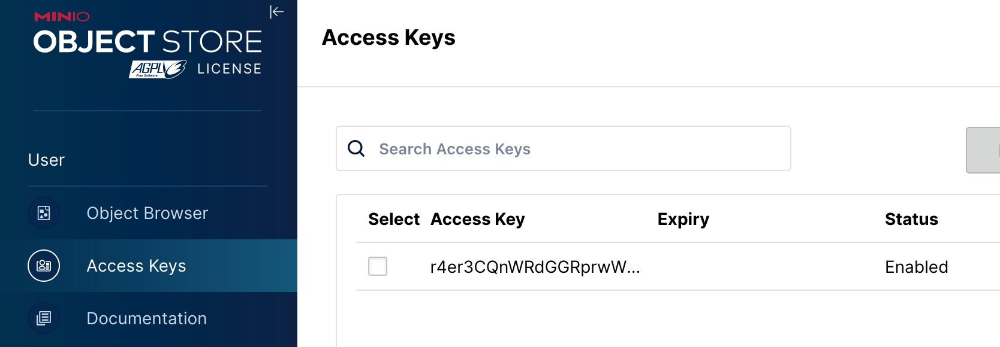
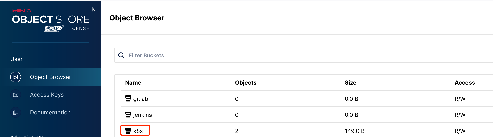
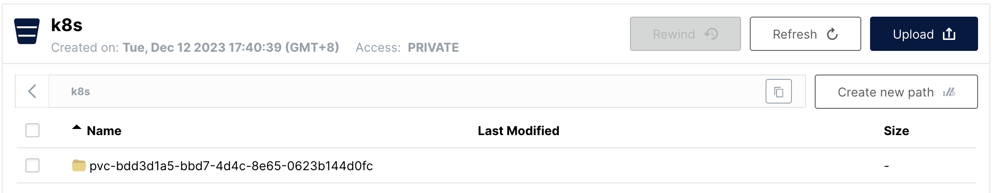

# 通过 S3 CSI 对接 Minio

{: .no_toc}

## 目录

{: .no_toc .text-delta }

1. TOC
{:toc}

## 参考文档

[https://github.com/ctrox/csi-s3](https://github.com/ctrox/csi-s3)


## 部署细节

minio 上添加好了 access key 和 bucket：





准备下列 secret 配置：

```shell
apiVersion: v1
kind: Secret
metadata:
  namespace: kube-system
  name: csi-s3-secret
  namespace: kube-system
stringData:
  accessKeyID: r4er3CQnWRdGGRprwWkh
  secretAccessKey: dfrI1zbWJxJhktfUlDlTv8h4bz1YyxDHRA0glS8K
  endpoint: http://10.10.50.16:9000
# 对于 Minio，region 需要留空，设置为 "" 即可
  region: ""
```

部署其他文件：

```shell
git clone https://github.com/ctrox/csi-s3.git

cd csi-s3
cd deploy/kubernetes
kubectl create -f provisioner.yaml
kubectl create -f attacher.yaml
kubectl create -f csi-s3.yaml
```

自定义 storageclass

```shell
cat > storageclass.yaml << EOF
kind: StorageClass
apiVersion: storage.k8s.io/v1
metadata:
  name: csi-s3
provisioner: ch.ctrox.csi.s3-driver
parameters:
  # specify which mounter to use
  # can be set to rclone, s3fs, goofys or s3backer
  mounter: s3fs
  # 默认 csi 针对每个 volume 都会创建一个 bucket。也可以预先在 minio 上创建好 bucket，然后在下面指定
  bucket: k8s
  csi.storage.k8s.io/provisioner-secret-name: csi-s3-secret
  csi.storage.k8s.io/provisioner-secret-namespace: kube-system
  csi.storage.k8s.io/controller-publish-secret-name: csi-s3-secret
  csi.storage.k8s.io/controller-publish-secret-namespace: kube-system
  csi.storage.k8s.io/node-stage-secret-name: csi-s3-secret
  csi.storage.k8s.io/node-stage-secret-namespace: kube-system
  csi.storage.k8s.io/node-publish-secret-name: csi-s3-secret
  csi.storage.k8s.io/node-publish-secret-namespace: kube-system

EOF

kubectl apply -f storageclass.yaml
```

## pvc 部署测试

```shell
cd csi-s3/deploy/kubernetes/examples
kubectl apply -f pvc.yaml
```

验证：

```shell
[root@k8s-m01 ~]# kubectl get pvc
NAME         STATUS   VOLUME                                     CAPACITY   ACCESS MODES   STORAGECLASS   AGE
csi-s3-pvc   Bound    pvc-bdd3d1a5-bbd7-4d4c-8e65-0623b144d0fc   5Gi        RWO            csi-s3         10m
```

minio 上看到 pvc 目录：




## 一个小问题

测试时发现 PVC 和 PV 均创建成功，但是给 pod 挂载时报：

```shell
Events:
  Type     Reason              Age    From                     Message
  ----     ------              ----   ----                     -------
  Normal   Scheduled           3m26s  default-scheduler        Successfully assigned ruoyi/test-pod to k8s-w01
  Warning  FailedAttachVolume  76s    attachdetach-controller  AttachVolume.Attach failed for volume "pvc-87024db5-411c-4c88-b88d-cdc52be24dea" : Attach timeout for volume k8s/pvc-87024db5-411c-4c88-b88d-cdc52be24dea
  Warning  FailedMount         67s    kubelet                  Unable to attach or mount volumes: unmounted volumes=[nfs-pvc], unattached volumes=[kube-api-access-7dxv4 nfs-pvc]: timed out waiting for the condition
```

查了下 github 上有相同的 issue：

[https://github.com/ctrox/csi-s3/issues/80#issuecomment-1527451694](https://github.com/ctrox/csi-s3/issues/80#issuecomment-1527451694)

## 另一个小问题

挂载成功后，目录无法写入，需要将默认 storageclass 中的 mounter 从 rclone 更改为 s3fs

```
touch: cannot touch '/var/lib/www/html/hello_world': Input/output error
```


[https://github.com/ctrox/csi-s3/issues/65](https://github.com/ctrox/csi-s3/issues/65)
