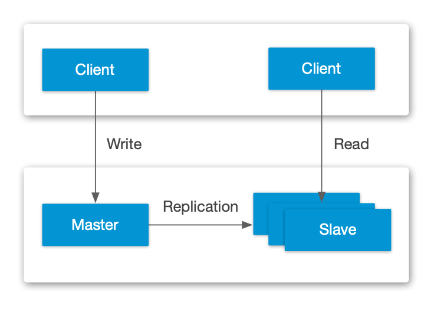
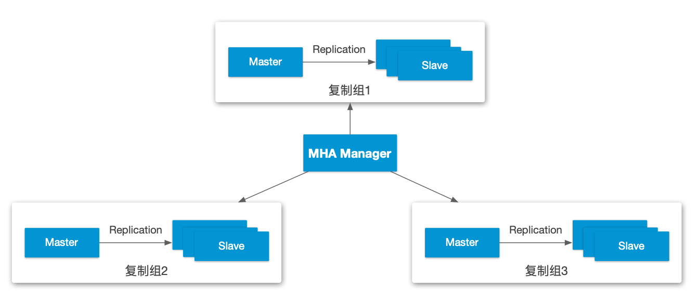

{: .no_toc}

## 目录

{: .no_toc .text-delta }

1. TOC
{:toc}

# MySQL 高可用的一些方案

- 主从架构：读写分离，此方式成本低易于部署，可以通过增加从库来减少读写压力。但存在主库单点故障以及同步写延迟问题。这种部署模式下可以加入 haproxy 或者 keepalived，在 master 故障后切换到 slave

- MySQL + DRDB：通过DRBD基于block块的复制模式，快速进行双主故障切换
- MySQL Cluster：官方出品的MySQL集群架构。
- MySQL + MHA：安装部署简单，不影响现有架构，自动监控和故障转移，数据一致性有保障，故障切换方式可使用手动或自动多向选择，适应范围大

- MySQL + MMM：Master-Master Replication Manager for MySQL，主主复制管理器。是关于mysql主主复制配置的监控、故障转移和管理的一套可伸缩的脚本套件（在任何时候只有一个节点可以被写入），这个套件也能基于标准的主从配置的任意数量的从服务器进行读负载均衡，所以你可以用它来在一组居于复制的服务器启动虚拟ip，除此之外，它还有实现数据备份、节点之间重新同步功能的脚本。
  MySQL本身没有提供replication failover的解决方案，通过MMM方案能实现服务器的故障转移，从而实现mysql的高可用。

  此方案特点：

  1、安全、稳定性较高，可扩展性好

  2、 对服务器数量要求至少三台及以上

  3、 对双主（主从复制性要求较高）

  4、 同样可实现读写分离

# MySQL 集群概述

集群模式下 MySQL 共有三种节点：

- 管理节点：又称管理服务器，主要负责管理和监控数据节点和 SQL 节点，存放集群配置文件和集群日志文件。管理节点可以启动、重启或者关闭某个节点。其他节点从管理节点检索配置数据，当数据节点有新事件时就把事件信息发送给管理节点并写入集群日志。
- 数据节点：负责存储数据。
- sql 节点(API node)：进行 sql 操作。

三种节点的启动顺序依次为：管理节点、数据节点、SQL 节点

# 参考资料

[https://www.zhihu.com/question/21307639](https://www.zhihu.com/question/21307639)

[https://mp.weixin.qq.com/s/MidwY1J2mk2-NetjTWPTvw](https://mp.weixin.qq.com/s/MidwY1J2mk2-NetjTWPTvw)