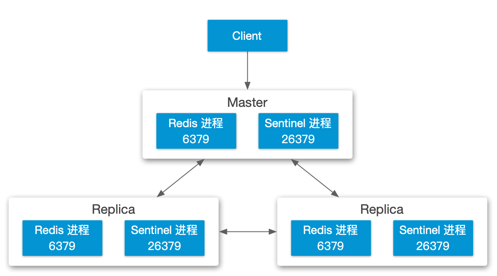
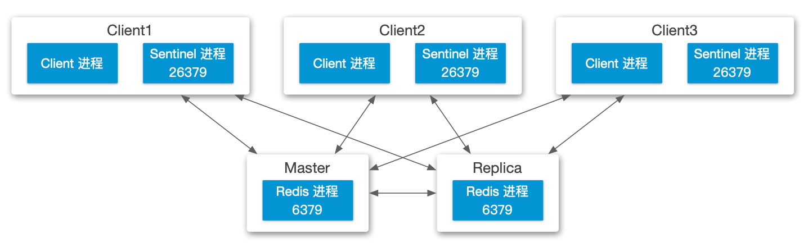
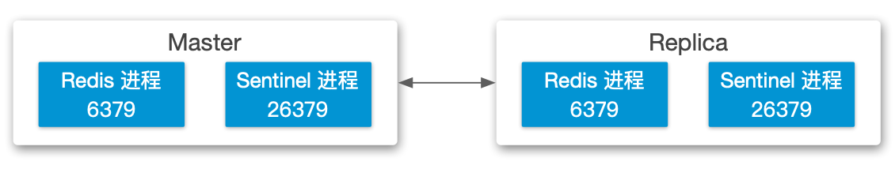
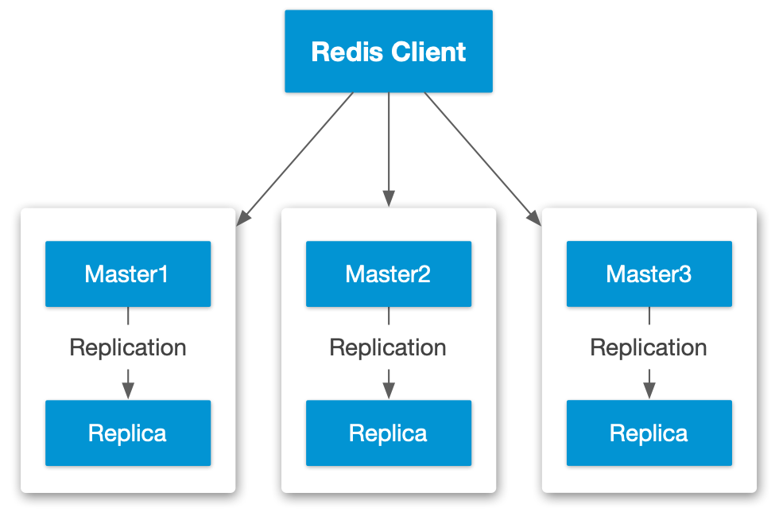
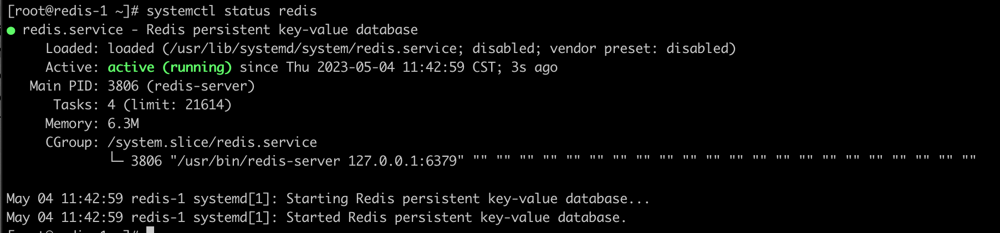
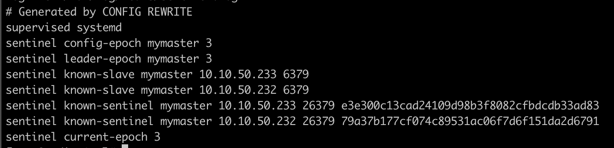

## 目录

{: .no_toc .text-delta }


1. TOC
{:toc}


# 什么是 Redis

开源内存数据库，可用作 key-value 数据库、缓存等。目标是提供高速读写访问。

Redis 是 REmote DIctionary Server 的缩写。


单节点下 Redis 支持多个逻辑数据库，默认提供 16 个逻辑数据库，但是此值可以调整，每个逻辑数据库用 index 标识，从 0 开始。

Redis 是个单线程数据存储，所有读写都走一个 pipeline。


# Redis 高可用的一些方案

## 哨兵模式 Redis Sentinel

哨兵模式主要解决的问题：

- 监控：持续性监控 Master 和 Replica 是否按照预期工作
- 通知：通知系统管理员发生节点故障，或者调用 API 来进行通知
- 自动故障切换：检测到 Master 故障时，将其中一个 Replica 提升为 Master。应用程序会被通告让其使用新的 Master IP
- 配置提供商（Configuration Provider）：Sentinel 为 Client 提供服务发现功能，Client 先连接到 Sentinel 获取指定服务的 Master 节点地址，如果发生故障切换，Sentinel 通告新的地址给 Client

Sentinel 使用 Quorum 机制，因此为了保证故障切换，Sentinel 数量需要为奇数。

一般 Sentinel 部署需要下列组件（其中 Sentinel 可以独立部署，也可以和 Redis 节点一起部署）：

- 1 个 Master 节点
- 1 或多个 Replica 节点
- 1 或多个 Sentinel 节点


### 最常见三节点哨兵模式

Quorum=2



### Sentinel 和 Client 在一起的部署模式

Quorum=2




### 最简哨兵模式部署架构

（强烈不推荐使用！无法应对脑裂）

Quorum=1



### 脑裂应对

在三节点典型的部署模式下，如果发生脑裂，假如 Master 和 Client 刚好在一个网络中，这时 Client 依然继续进行写操作，则等网络恢复后，则原来的 Master 数据可能丢失（因为已经有新的 Master，网络恢复后旧 Master 会成为 Replica 节点）。为了避免此问题，可以调整下列参数：

```shell
min-replicas-to-write 1
# Master 至少需要将写入请求发给一个 Replica，否则不接受来自 Client 的写入
min-replicas-max-lag 10
# 多长时间未从 Replica 未收到 ack，超过此时间则认为无法访问到 Replica
```


### NAT 对于 Sentinel 的影响

- 影响 Sentinel 自动发现其他 Sentinel 功能：Sentinel 会使用自身监听的 IP 和端口对外发送 Hello 包进行宣告，如果网络中使用 NAT，Sentinel 无法感知此变化，因此给其他 Sentinel 发送未过 NAT 的 IP，此 IP 有可能无法被外部访问

解决方法：设置 sentinel announce IP 和 port

```shell
sentinel announce-ip <ip>
sentinel announce-port <port>
```


- Master 的 INFO 输出中会记录 Replica 的地址和端口，地址等于建立 TCP 连接的 remote address，而端口是 Replica 在握手时宣告的（在此情况下，remote address 正确，但 port 可能不正确） 
- Sentinel 同样使用 Master 的 INFO 输出来获取 Replica 地址+端口，所以网络中存在 NAT 会影响 Sentinel 和 Replica 的通信，造成无法完成故障切换

解决方法：设置 1 对 1 端口映射


## 集群模式

Redis Cluster 模式下可以自动将数据存放在多个 Redis 节点中，并提供一定程度的高可用。



### 数据分片

在集群模式下，Redis 使用 hash slot 来进行负载分发，每个集群有 16384 个 slot（这也决定了集群规模上限为 16384，但通常建议最大 1000 个节点），每个 Redis Client 使用 [Key distribution model](https://redis.io/docs/reference/cluster-spec/#key-distribution-model) 来计算 hash，进而决定连接哪个 Redis 节点。

集群中的每个 Redis 节点会负责一部分 hash slot，例如：

- Node A contains hash slots from 0 to 5500.
- Node B contains hash slots from 5501 to 11000.
- Node C contains hash slots from 11001 to 16383.

Hash slot 可以动态分配（通过 resharding 或者 rebalance 操作），比如集群中新增一个节点 D 后，可能会从 ABC 三个节点中抽取一部分 hash slot 分配给 D。进行重新分配的操作不会影响集群。

在集群模式下，每个 Redis 只允许单个逻辑数据库工作，即编号为 0 的数据库。

### hash tags

给 key 分配相同的 tag，这样所有相关 key 都会被分配到同一个 hash slot。（计算 key 的 hash 时，会使用 hash tag，因此相关 tag 的 key 会被分到相同的 hash slot）

例如 `app1{user:123}.mykey1` 和 `app1{user:123}.mykey2` 会使用同一个 hash slot。

### Master-replica 模型

为了保证每个 subset 的高可用，Redis 使用 master-replica 模型，即同一组 hash slot 会有一个 master 和一到多个 replica 节点。

比如集群有三个 Master 节点 A B C 分别负责一部分 hash slot，可以为这三个节点配置 A1 B1 C1 三个 replica。

### 网络

默认 Redis 使用 6379 端口提供服务，Redis Cluster 则使用 16379 端口作为 cluster bus port。可通过 `cluster-port`来覆写此配置。Redis 通过 cluster bus 来进行故障检测，配置变更，故障切换等。

集群模式下节点间使用 Heartbeat and gossip messages 来进行存活性检测。


## 两种高可用模式对比

| 功能                      | Redis Sentinel | Redis Cluster | 备注                                                   |
| ------------------------- | -------------- | ------------- | ------------------------------------------------------ |
| Multiple Logical Database | Yes            | No            | 普通模式的 Redis 提供 16 个逻辑数据库                  |
| 一致性保证                | No             | No            | 可能存在写入请求丢失                                   |
| 水平扩展                  | No             | Yes           | Cluster 最大 1000 节点，线性扩展                       |
| 复制                      | Yes            | Yes           | 均支持异步复制                                         |
| Sharding                  | No             | Yes           | Cluster 使用 Hash Slot                                 |
| 故障切换                  | Yes            | Yes           |                                                        |
| 通知 API                  | Yes            | No            |                                                        |
| Multi-key Operations      | Yes            | No            | 在 Cluster 模式下，如果所有 key 属于同一个 Node 时支持 |
| 使用 replica 扩展读操作   | Yes            | Yes           |                                                        |
| Publish/Subscribe         | Yes            | Yes           | Cluster 提供更丰富的功能                               |


Sentinel 相比 Cluster 模式适用于中小规模，架构简单，占用的资源相对低，但扩展性也弱。

一般 Redis 并发 10w 左右，所以 Cluster 模式可以支持更大的并发。

异步复制：两种模式均使用异步复制，因此会存在数据丢失，Redis 本身不保证[数据一致性](https://redis.io/docs/manual/scaling/#redis-cluster-consistency-guarantees)


# Redis 安装

直接通过 yum 安装：

```shell
yum install redis
```

安装完成后，系统会自动包含 redis-server, redis-sentinel, redis-cli, redis-benchmark 等包。

 

## 单节点配置

修改 /etc/redis.conf 文件，将 `daemonize no` 改为`daemonize yes`

启动并检查 redis 服务

```shell
systemctl start redis
systemctl status redis
```




查看 redis 进程：

```shell
ps -ef | grep redis
```

查看监听端口 6379：

```shell
netstat -ltnp | grep redis
# 系统需要安装 net-tools 才能使用 netstat
```

通过 redis-cli 查看 redis 内容：

```shell
redis-cli

keys *
```

结果返回 `(empty list or set)`


通过 redis-cli 创建并查看 redis 内容：

```shell
redis-cli

set name test
# set <key> <value>

get name
# get <key>
```

结果返回 name 的值： `test`


## 哨兵模式

此处仅实例三节点模式：


三个节点 IP 规划如下

```
RedisLB-HAProxy: 10.10.50.230
Redis-1 Master: 10.10.50.231
Redis-2 Replica1: 10.10.50.232
Redis-3 Replica2: 10.10.50.233
```

Redis-1 配置文件 `/etc/redis.conf`（仅贴出了主要配置）

```conf
bind 10.10.50.231
protected-mode no
daemonize yes
```

Redis-2/3 配置文件 `/etc/redis.conf`（仅贴出了主要配置）

```conf
bind 10.10.50.232
protected-mode no
daemonize yes
slaveof 10.10.50.231 6379
```


Redis-1 Sentinel 配置文件 `/etc/redis-sentinel.conf`（仅贴出了主要配置）

```shell
bind 10.10.50.231
protected-mode no
port 26379
sentinel monitor mymaster 10.10.50.231 6379 2
# 最后的 2 为 Quorum 值
sentinel down-after-milliseconds mymaster 5000
# 5s 后将 master 标记为 Down
sentinel failover-timeout mymaster 10000
```

Redis-2/3 Sentinel 配置文件 `/etc/redis-sentinel.conf`（仅贴出了主要配置）

```shell
bind 10.10.50.232
protected-mode no
port 26379
sentinel monitor mymaster 10.10.50.231 6379 2
sentinel down-after-milliseconds mymaster 5000
sentinel failover-timeout mymaster 10000
```


分别启动三个节点的 redis 和 redis-sentinel 服务：

主节点启动日志：

```
6750:C 04 May 16:14:06.491 # oO0OoO0OoO0Oo Redis is starting oO0OoO0OoO0Oo
6750:C 04 May 16:14:06.491 # Redis version=4.0.14, bits=64, commit=00000000, modified=0, pid=6750, just started
6750:C 04 May 16:14:06.491 # Configuration loaded
6750:C 04 May 16:14:06.491 * supervised by systemd, will signal readiness
6750:M 04 May 16:14:06.491 * Increased maximum number of open files to 10032 (it was originally set to 1024).
                _._
           _.-``__ ''-._
      _.-``    `.  `_.  ''-._           Redis 4.0.14 (00000000/0) 64 bit
  .-`` .-```.  ```\/    _.,_ ''-._
 (    '      ,       .-`  | `,    )     Running in standalone mode
 |`-._`-...-` __...-.``-._|'` _.-'|     Port: 6379
 |    `-._   `._    /     _.-'    |     PID: 6750
  `-._    `-._  `-./  _.-'    _.-'
 |`-._`-._    `-.__.-'    _.-'_.-'|
 |    `-._`-._        _.-'_.-'    |           http://redis.io
  `-._    `-._`-.__.-'_.-'    _.-'
 |`-._`-._    `-.__.-'    _.-'_.-'|
 |    `-._`-._        _.-'_.-'    |
  `-._    `-._`-.__.-'_.-'    _.-'
      `-._    `-.__.-'    _.-'
          `-._        _.-'
              `-.__.-'

6750:M 04 May 16:14:06.492 # Server initialized
6750:M 04 May 16:14:06.492 # WARNING overcommit_memory is set to 0! Background save may fail under low memory condition. To fix this issue add 'vm.overcommit_memory = 1' to /etc/sysctl.conf and then reboot or run the command 'sysctl vm.overcommit_memory=1' for this to take effect.
6750:M 04 May 16:14:06.492 # WARNING you have Transparent Huge Pages (THP) support enabled in your kernel. This will create latency and memory usage issues with Redis. To fix this issue run the command 'echo never > /sys/kernel/mm/transparent_hugepage/enabled' as root, and add it to your /etc/rc.local in order to retain the setting after a reboot. Redis must be restarted after THP is disabled.
6750:M 04 May 16:14:06.492 * DB loaded from disk: 0.000 seconds
6750:M 04 May 16:14:06.492 * Ready to accept connections

```

Replica 启动日志：

```
15558:M 04 May 16:15:28.818 * DB loaded from disk: 0.000 seconds
15558:M 04 May 16:15:28.818 * Ready to accept connections
15558:S 04 May 16:15:39.031 * Before turning into a slave, using my master parameters to synthesize a cached master: I may be able to synchronize with the new master with just a partial transfer.
15558:S 04 May 16:15:39.031 * SLAVE OF 10.10.50.231:6379 enabled (user request from 'id=3 addr=10.10.50.231:32895 fd=7 name=sentinel-38cd6aec-cmd age=10 idle=0 flags=x db=0 sub=0 psub=0 multi=3 qbuf=0 qbuf-free=32768 obl=36 oll=0 omem=0 events=r cmd=exec')
15558:S 04 May 16:15:39.031 # CONFIG REWRITE executed with success.
15558:S 04 May 16:15:39.840 * Connecting to MASTER 10.10.50.231:6379
15558:S 04 May 16:15:39.840 * MASTER <-> SLAVE sync started
15558:S 04 May 16:15:39.840 * Non blocking connect for SYNC fired the event.
15558:S 04 May 16:15:39.840 * Master replied to PING, replication can continue...
15558:S 04 May 16:15:39.841 * Trying a partial resynchronization (request 067456b8ca737f76e8e720ab82276e7882debfc0:1).
15558:S 04 May 16:15:39.841 * Full resync from master: 6049c175258a520eead7664ea9bf82d8d7b3eda3:0
15558:S 04 May 16:15:39.841 * Discarding previously cached master state.
15558:S 04 May 16:15:39.861 * MASTER <-> SLAVE sync: receiving 192 bytes from master
15558:S 04 May 16:15:39.861 * MASTER <-> SLAVE sync: Flushing old data
15558:S 04 May 16:15:39.861 * MASTER <-> SLAVE sync: Loading DB in memory
15558:S 04 May 16:15:39.861 * MASTER <-> SLAVE sync: Finished with success
```

Replica 加入主节点的日志：

```
6750:M 04 May 16:15:39.838 * Slave 10.10.50.232:6379 asks for synchronization
6750:M 04 May 16:15:39.838 * Partial resynchronization not accepted: Replication ID mismatch (Slave asked for '067456b8ca737f76e8e720ab82276e7882debfc0', my replication IDs are '75629cbaf14b784641d9de9b3ba41d0fa2b9c80a' and '0000000000000000000000000000000000000000')
6750:M 04 May 16:15:39.838 * Starting BGSAVE for SYNC with target: disk
6750:M 04 May 16:15:39.839 * Background saving started by pid 6836
6836:C 04 May 16:15:39.839 * DB saved on disk
6836:C 04 May 16:15:39.839 * RDB: 0 MB of memory used by copy-on-write
6750:M 04 May 16:15:39.858 * Background saving terminated with success
6750:M 04 May 16:15:39.858 * Synchronization with slave 10.10.50.232:6379 succeeded
```


启动完成后 sentinel 的配置文件会被自动修改：




### 测试

通过 `redis-cli`进行简单的访问测试：

```shell
redis-cli -h 10.10.50.233
# 正常会得到 PONG 返回值
PONG
```


在 Master 创建一个 key，并在 Slave 进行读取：

```shell
# 创建 key1，值为 value1
redis-cli -h 10.10.50.231 set key1 value1

# 从 Replica 可以读取到值
redis-cli -h 10.10.50.232 get key1
redis-cli -h 10.10.50.233 get key1
```


如果在 Replica 上进行 set 操作，会提示`(error) READONLY You can't write against a read only slave.`


### 查看同步状态

通过 `redis-cli`查看同步状态：

- 主节点：`redis-cli -h 10.10.50.231 info replication`

```shell
role:master
connected_slaves:2
# 已有两个 Slaves
slave0:ip=10.10.50.232,port=6379,state=online,offset=121774,lag=1
slave1:ip=10.10.50.233,port=6379,state=online,offset=121774,lag=0
master_replid:d6bdb9c23d50cbac27056cebe6a46590f6079282
master_replid2:7bfc8390eccd427dd622ef79680589edb4c2888e
master_repl_offset:122052
second_repl_offset:38450
repl_backlog_active:1
repl_backlog_size:1048576
repl_backlog_first_byte_offset:19953
repl_backlog_histlen:102100
```


- Replica 节点：`redis-cli -h 10.10.50.232 info replication`

```shell
role:slave
master_host:10.10.50.231
master_port:6379
master_link_status:up
master_last_io_seconds_ago:0
master_sync_in_progress:0
slave_repl_offset:157040
slave_priority:100
slave_read_only:1
connected_slaves:0
master_replid:d6bdb9c23d50cbac27056cebe6a46590f6079282
master_replid2:7bfc8390eccd427dd622ef79680589edb4c2888e
master_repl_offset:157040
second_repl_offset:38450
repl_backlog_active:1
repl_backlog_size:1048576
repl_backlog_first_byte_offset:19953
repl_backlog_histlen:137088
```

### 查看 Sentinel 状态

通过下列命令查看 Sentinel 的状态：

```shell
[root@redis-1 ~]# redis-cli -h 10.10.50.231 -p 26379 info sentinel
# Sentinel
sentinel_masters:1
sentinel_tilt:0
sentinel_running_scripts:0
sentinel_scripts_queue_length:0
sentinel_simulate_failure_flags:0
master0:name=mymaster,status=ok,address=10.10.50.233:6379,slaves=2,sentinels=3
```

通过下列命令查看指定 Sentinel 节点的详细信息：

```shell
[root@redis-1 ~]# redis-cli -h 10.10.50.231 -p 26379 sentinel master mymaster
 1) "name"
 2) "mymaster"
 3) "ip"
 4) "10.10.50.233"
 5) "port"
 6) "6379"
 7) "runid"
 8) "c25a5d65b8ffdcd4871a0d979ddc700e3b8d3b1f"
 9) "flags"
10) "master"
11) "link-pending-commands"
12) "0"
13) "link-refcount"
14) "1"
15) "last-ping-sent"
16) "0"
17) "last-ok-ping-reply"
18) "829"
19) "last-ping-reply"
20) "829"
21) "down-after-milliseconds"
22) "5000"
23) "info-refresh"
24) "8304"
25) "role-reported"
26) "master"
27) "role-reported-time"
28) "469536"
29) "config-epoch"
30) "4"
31) "num-slaves"
32) "2"
33) "num-other-sentinels"
34) "2"
35) "quorum"
36) "2"
37) "failover-timeout"
38) "10000"
39) "parallel-syncs"
40) "1"
```

查看 redis slaves 信息：

```shell
[root@redis-1 ~]# redis-cli -h 10.10.50.231 -p 26379 sentinel slaves mymaster
1)  1) "name"
    2) "10.10.50.232:6379"
    3) "ip"
    4) "10.10.50.232"
    5) "port"
    6) "6379"
    7) "runid"
    8) "3546a4cabcdd1cf6f3d8041bfa122668933edcca"
    9) "flags"
   10) "slave"
   11) "link-pending-commands"
   12) "0"
   13) "link-refcount"
   14) "1"
   15) "last-ping-sent"
   16) "0"
   17) "last-ok-ping-reply"
   18) "1017"
   19) "last-ping-reply"
   20) "1017"
   21) "down-after-milliseconds"
   22) "5000"
   23) "info-refresh"
   24) "8736"
   25) "role-reported"
   26) "slave"
   27) "role-reported-time"
   28) "510217"
   29) "master-link-down-time"
   30) "0"
   31) "master-link-status"
   32) "ok"
   33) "master-host"
   34) "10.10.50.233"
   35) "master-port"
   36) "6379"
   37) "slave-priority"
   38) "100"
   39) "slave-repl-offset"
   40) "22695"
2)  1) "name"
    2) "10.10.50.231:6379"
    3) "ip"
    4) "10.10.50.231"
    5) "port"
    6) "6379"
    7) "runid"
    8) "f005e9922e503aa2e06e6f2a862635588a5a6259"
    9) "flags"
   10) "slave"
   11) "link-pending-commands"
   12) "0"
   13) "link-refcount"
   14) "1"
   15) "last-ping-sent"
   16) "0"
   17) "last-ok-ping-reply"
   18) "1017"
   19) "last-ping-reply"
   20) "1017"
   21) "down-after-milliseconds"
   22) "5000"
   23) "info-refresh"
   24) "8736"
   25) "role-reported"
   26) "slave"
   27) "role-reported-time"
   28) "510217"
   29) "master-link-down-time"
   30) "0"
   31) "master-link-status"
   32) "ok"
   33) "master-host"
   34) "10.10.50.233"
   35) "master-port"
   36) "6379"
   37) "slave-priority"
   38) "100"
   39) "slave-repl-offset"
   40) "22695"
```

查看 Sentinel Slaves 信息：

```shell
[root@redis-1 ~]# redis-cli -h 10.10.50.231 -p 26379 sentinel sentinels mymaster
1)  1) "name"
    2) "79a37b177cf074c89531ac06f7d6f151da2d6791"
    3) "ip"
    4) "10.10.50.232"
    5) "port"
    6) "26379"
    7) "runid"
    8) "79a37b177cf074c89531ac06f7d6f151da2d6791"
    9) "flags"
   10) "sentinel"
   11) "link-pending-commands"
   12) "0"
   13) "link-refcount"
   14) "1"
   15) "last-ping-sent"
   16) "0"
   17) "last-ok-ping-reply"
   18) "599"
   19) "last-ping-reply"
   20) "599"
   21) "down-after-milliseconds"
   22) "5000"
   23) "last-hello-message"
   24) "1149"
   25) "voted-leader"
   26) "?"
   27) "voted-leader-epoch"
   28) "0"
2)  1) "name"
    2) "e3e300c13cad24109d98b3f8082cfbdcdb33ad83"
    3) "ip"
    4) "10.10.50.233"
    5) "port"
    6) "26379"
    7) "runid"
    8) "e3e300c13cad24109d98b3f8082cfbdcdb33ad83"
    9) "flags"
   10) "sentinel"
   11) "link-pending-commands"
   12) "0"
   13) "link-refcount"
   14) "1"
   15) "last-ping-sent"
   16) "0"
   17) "last-ok-ping-reply"
   18) "599"
   19) "last-ping-reply"
   20) "599"
   21) "down-after-milliseconds"
   22) "5000"
   23) "last-hello-message"
   24) "1342"
   25) "voted-leader"
   26) "?"
   27) "voted-leader-epoch"
   28) "0"
```


### 负载均衡

在哨兵模式下，可以为集群配置负载均衡，对外仅暴露 LB 地址。因为读写的负载均衡方式不一致，因此需要用不同端口做一区分，比如读使用 6379，写使用 6380：

- 读操作负载配置：哨兵模式下每个节点都可以读数据，因此只需要配置基本的负载即可。
  - 负载均衡算法：Round Robin
  - 协议：TCP
  - 健康检查：发送 `PING`，检查返回值是否为`PONG`
  - Backend Server：每个 Redis 节点的 6379 端口
- 写操作负载配置：
  - 负载均衡算法：First （第一个可用的 Server）
  - 协议：TCP
  - 健康检查：发送 `info replication`，检查返回值是否包含 `role:master`
  - Backend Server：每个 Redis 节点的 6379 端口


HAProxy 配置示例：

```shell
global
    log         127.0.0.1 local2
    chroot      /var/lib/haproxy
    pidfile     /var/run/haproxy.pid
    user        haproxy
    group       haproxy
    daemon
    maxconn     4000

defaults
    mode                    tcp
    log                     global
    option                  tcplog
    option                  dontlognull
    retries                 3
    timeout http-request    5s
    timeout queue           1m
    timeout connect         5s
    timeout client          1m
    timeout server          1m
    timeout http-keep-alive 5s
    timeout check           5s
    maxconn                 3000

frontend redis-read
    bind *:6379
    default_backend         redis-online

frontend redis-write
    bind *:6380
    default_backend         redis-master

backend redis-online
    mode  tcp
    balance     roundrobin
    option tcp-check
    tcp-check comment PING\ phase
    tcp-check send PING\r\n
    tcp-check expect string +PONG
    tcp-check comment QUIT\ phase
    tcp-check send QUIT\r\n

    server  redis-1 10.10.50.231:6379 check inter 1s
    server  redis-2 10.10.50.232:6379 check inter 1s
    server  redis-3 10.10.50.233:6379 check inter 1s

backend redis-master
    mode  tcp
    balance  first
    option tcp-check
    tcp-check comment role\ check
    tcp-check send info\ replication\r\n
    tcp-check expect string role:master
    tcp-check comment QUIT\ phase
    tcp-check send QUIT\r\n

    server  redis-1 10.10.50.231:6379 check inter 1s
    server  redis-2 10.10.50.232:6379 check inter 1s
    server  redis-3 10.10.50.233:6379 check inter 1s
```


*其中 tcp-check 中的 “\” 用于标记后面的空格，“\r”表示回车（CR），“\n”表示新行（LF），一般组合使用*


查看 HAProxy 的日志，可以看到 redis-master backend 中的 redis-2 和 redis-3 为 Down，这为正常现象：

```shell
journalctl -u haproxy

May 04 17:15:46 redis-haproxy haproxy[2734]: [WARNING]  (2734) : Server redis-master/redis-2 is DOWN, reason: Layer7 timeout, info: " at step 2 of tcp-check (expect string 'role:master')", check duration: 5000ms. 2 active and 0 backup servers left. 0 sessions active, 0 requeued, 0 remaining in queue.
May 04 17:15:47 redis-haproxy haproxy[2734]: [WARNING]  (2734) : Server redis-master/redis-3 is DOWN, reason: Layer7 timeout, info: " at step 2 of tcp-check (expect string 'role:master')", check duration: 5001ms. 1 active and 0 backup servers left. 0 sessions active, 0 requeued, 0 remaining in queue.
```


配置完成后进行访问测试：
```shell
# 获取 key1 的值：
redis-cli -h 10.10.50.230 get key1
# 正常返回
"value1"

# 添加 key2:value2
redis-cli -h 10.10.50.230 -p 6380 set key2 value2
# 操作完成
OK

# 获取 key2 的值：
redis-cli -h 10.10.50.230 get key2
```

### 故障切换

此处对 Master 节点直接进行关机操作来模拟故障。

故障完成后按照上个章节内容进行测试，发现读写访问均可以正常完成。


根据 info replication 查看到 233 节点为 master，与日志中的信息一致：

```
redis-cli -h 10.10.50.233 info replication
# Replication
role:master
connected_slaves:1
slave0:ip=10.10.50.232,port=6379,state=online,offset=983870,lag=0
master_replid:4e1f6c12833299cd16afcbbfe67f8b544d60456e
master_replid2:d6bdb9c23d50cbac27056cebe6a46590f6079282
master_repl_offset:983870
second_repl_offset:932282
repl_backlog_active:1
repl_backlog_size:1048576
repl_backlog_first_byte_offset:41837
repl_backlog_histlen:942034
```


Redis-2 的 `/var/log/redis/sentinel.log`日志：

```shell
15564:X 04 May 17:31:47.665 # +sdown master mymaster 10.10.50.231 6379
15564:X 04 May 17:31:47.665 # +sdown sentinel 38cd6aecdce84ff6725fdedc9e608ee90b619eb2 10.10.50.231 26379 @ mymaster 10.10.50.231 6379
15564:X 04 May 17:31:48.081 # +new-epoch 4
15564:X 04 May 17:31:48.081 # +vote-for-leader e3e300c13cad24109d98b3f8082cfbdcdb33ad83 4
15564:X 04 May 17:31:48.764 # +odown master mymaster 10.10.50.231 6379 #quorum 2/2
15564:X 04 May 17:31:48.764 # Next failover delay: I will not start a failover before Thu May  4 17:32:08 2023
15564:X 04 May 17:31:49.194 # +config-update-from sentinel e3e300c13cad24109d98b3f8082cfbdcdb33ad83 10.10.50.233 26379 @ mymaster 10.10.50.231 6379
15564:X 04 May 17:31:49.194 # +switch-master mymaster 10.10.50.231 6379 10.10.50.233 6379
15564:X 04 May 17:31:49.194 * +slave slave 10.10.50.232:6379 10.10.50.232 6379 @ mymaster 10.10.50.233 6379
15564:X 04 May 17:31:49.194 * +slave slave 10.10.50.231:6379 10.10.50.231 6379 @ mymaster 10.10.50.233 6379
15564:X 04 May 17:31:54.225 # +sdown slave 10.10.50.231:6379 10.10.50.231 6379 @ mymaster 10.10.50.233 6379
```

Redis-2 的 `/var/log/redis/redis.log`日志：

```shell
15558:S 04 May 17:31:49.194 # Connection with master lost.
15558:S 04 May 17:31:49.194 * Caching the disconnected master state.
15558:S 04 May 17:31:49.194 * SLAVE OF 10.10.50.233:6379 enabled (user request from 'id=30 addr=10.10.50.233:53421 fd=8 name=sentinel-e3e300c1-cmd age=4344 idle=0 flags=x db=0 sub=0 psub=0 multi=3 qbuf=139 qbuf-free=32629 obl=36 oll=0 omem=0 events=r cmd=exec')
15558:S 04 May 17:31:49.194 # CONFIG REWRITE executed with success.
15558:S 04 May 17:31:49.909 * Connecting to MASTER 10.10.50.233:6379
15558:S 04 May 17:31:49.909 * MASTER <-> SLAVE sync started
15558:S 04 May 17:31:49.909 * Non blocking connect for SYNC fired the event.
15558:S 04 May 17:31:49.909 * Master replied to PING, replication can continue...
15558:S 04 May 17:31:49.909 * Trying a partial resynchronization (request d6bdb9c23d50cbac27056cebe6a46590f6079282:932282).
15558:S 04 May 17:31:49.910 * Successful partial resynchronization with master.
15558:S 04 May 17:31:49.910 # Master replication ID changed to 4e1f6c12833299cd16afcbbfe67f8b544d60456e
15558:S 04 May 17:31:49.910 * MASTER <-> SLAVE sync: Master accepted a Partial Resynchronization.
```


Redis-3 的 `/var/log/redis/sentinel.log`日志：

```shell
3455:X 04 May 17:31:48.031 # +sdown master mymaster 10.10.50.231 6379
3455:X 04 May 17:31:48.031 # +sdown sentinel 38cd6aecdce84ff6725fdedc9e608ee90b619eb2 10.10.50.231 26379 @ mymaster 10.10.50.231 6379
3455:X 04 May 17:31:48.086 # +odown master mymaster 10.10.50.231 6379 #quorum 2/2
3455:X 04 May 17:31:48.086 # +new-epoch 4
3455:X 04 May 17:31:48.086 # +try-failover master mymaster 10.10.50.231 6379
3455:X 04 May 17:31:48.087 # +vote-for-leader e3e300c13cad24109d98b3f8082cfbdcdb33ad83 4
3455:X 04 May 17:31:48.088 # 79a37b177cf074c89531ac06f7d6f151da2d6791 voted for e3e300c13cad24109d98b3f8082cfbdcdb33ad83 4
3455:X 04 May 17:31:48.142 # +elected-leader master mymaster 10.10.50.231 6379
3455:X 04 May 17:31:48.142 # +failover-state-select-slave master mymaster 10.10.50.231 6379
3455:X 04 May 17:31:48.233 # +selected-slave slave 10.10.50.233:6379 10.10.50.233 6379 @ mymaster 10.10.50.231 6379
3455:X 04 May 17:31:48.233 * +failover-state-send-slaveof-noone slave 10.10.50.233:6379 10.10.50.233 6379 @ mymaster 10.10.50.231 6379
3455:X 04 May 17:31:48.333 * +failover-state-wait-promotion slave 10.10.50.233:6379 10.10.50.233 6379 @ mymaster 10.10.50.231 6379
3455:X 04 May 17:31:49.111 # +promoted-slave slave 10.10.50.233:6379 10.10.50.233 6379 @ mymaster 10.10.50.231 6379
3455:X 04 May 17:31:49.111 # +failover-state-reconf-slaves master mymaster 10.10.50.231 6379
3455:X 04 May 17:31:49.200 * +slave-reconf-sent slave 10.10.50.232:6379 10.10.50.232 6379 @ mymaster 10.10.50.231 6379
3455:X 04 May 17:31:50.149 * +slave-reconf-inprog slave 10.10.50.232:6379 10.10.50.232 6379 @ mymaster 10.10.50.231 6379
3455:X 04 May 17:31:50.149 * +slave-reconf-done slave 10.10.50.232:6379 10.10.50.232 6379 @ mymaster 10.10.50.231 6379
3455:X 04 May 17:31:50.225 # -odown master mymaster 10.10.50.231 6379
3455:X 04 May 17:31:50.225 # +failover-end master mymaster 10.10.50.231 6379
3455:X 04 May 17:31:50.225 # +switch-master mymaster 10.10.50.231 6379 10.10.50.233 6379
3455:X 04 May 17:31:50.225 * +slave slave 10.10.50.232:6379 10.10.50.232 6379 @ mymaster 10.10.50.233 6379
3455:X 04 May 17:31:50.225 * +slave slave 10.10.50.231:6379 10.10.50.231 6379 @ mymaster 10.10.50.233 6379
3455:X 04 May 17:31:55.293 # +sdown slave 10.10.50.231:6379 10.10.50.231 6379 @ mymaster 10.10.50.233 6379
```

Redis-3 的 `/var/log/redis/redis.log`日志：

```shell
3573:M 04 May 17:31:48.334 # Setting secondary replication ID to d6bdb9c23d50cbac27056cebe6a46590f6079282, valid up to offset: 932282. New replication ID is 4e1f6c12833299cd16afcbbfe67f8b544d60456e
3573:M 04 May 17:31:48.334 # Connection with master lost.
3573:M 04 May 17:31:48.334 * Caching the disconnected master state.
3573:M 04 May 17:31:48.334 * Discarding previously cached master state.
3573:M 04 May 17:31:48.334 * MASTER MODE enabled (user request from 'id=11 addr=10.10.50.233:39753 fd=11 name=sentinel-e3e300c1-cmd age=4329 idle=0 flags=x db=0 sub=0 psub=0 multi=3 qbuf=0 qbuf-free=32768 obl=36 oll=0 omem=0 events=r cmd=exec')
3573:M 04 May 17:31:48.334 # CONFIG REWRITE executed with success.
3573:M 04 May 17:31:49.916 * Slave 10.10.50.232:6379 asks for synchronization
3573:M 04 May 17:31:49.916 * Partial resynchronization request from 10.10.50.232:6379 accepted. Sending 440 bytes of backlog starting from offset 932282.
```


### 认证配置

**4.0 版本：**

Redis 配置（三个节点相同）：

```shell
protected-mode yes
# 设置 replication 秘钥
masterauth "SuperS3cr3tP455"
requirepass SuperS3cr3tP455
```

Sentinel 配置（三个节点相同）：

```shell
protected-mode yes
sentinel auth-pass mymaster SuperS3cr3tP455
```

配置完成后，需要使用`-a`参数指定密码才能访问 redis：

```shell
redis-cli -h 10.10.50.231 -a SuperS3cr3tP455 info replication
```

相应的，HAProxy 的健康检查需要修改（仅贴出改动部分）：

```shell
backend redis-online
   tcp-check send AUTH\ SuperS3cr3tP455\r\nPING\r\n

backend redis-master
   tcp-check send AUTH\ SuperS3cr3tP455\r\ninfo\ replication\r\n
```

或者双行（仅贴出改动部分）：

```shell
backend redis-online
   tcp-check send AUTH\ SuperS3cr3tP455\r\n
   tcp-check send PING\r\n
   
backend redis-master
   tcp-check send AUTH\ SuperS3cr3tP455\r\n
   tcp-check send info\ replication\r\n
```


**6.0 版本(未验证)：**

Redis 配置（三个节点相同）：

```shell
protected-mode yes
# 设置 replication 秘钥
masterauth SuperS3cr3tP455
# 在 6.0 以上版本中，默认用户不具备某些 replication 权限，因此建议使用单独的 Replication 用户
masteruser masteruser
# 设置 user ACL, 下面配置允许 masteruser 使用所有命令，启用此用户（on），将密码添加给此用户
user masteruser +@all on >SuperS3cr3tP455
```

Sentinel 配置（三个节点相同）：

```shell
# 从 6.0 版本开始，当 redis 使用了 ACL 后，需要为 Sentinel 配置下列信息
protected-mode yes
sentinel auth-pass mymaster SuperS3cr3tP455
sentinel auth-user mymaster masteruser
```


## 集群模式


6 个节点 IP 规划如下：

```
Redis Master01: 10.10.50.234
Redis Master02: 10.10.50.235
Redis Master03: 10.10.50.236
Redis Replica01: 10.10.50.237
Redis Replica02: 10.10.50.238
Redis Replica03: 10.10.50.239
```

本环境使用 redis6 搭建：

```shell
yum install -y redis6

[root@redis-1 ~]# redis-server -v
Redis server v=6.2.7 sha=00000000:0 malloc=jemalloc-5.1.0 bits=64 build=2684f51f1480c21b
```


Redis Master01 配置文件 `/etc/redis.conf`（仅贴出了主要配置）

```shell
bind 10.10.50.234
protected-mode no
daemonize yes
cluster-enabled yes
# 多长时间后认为节点故障
cluster-node-timeout 5000
# 提升 Redis 持久性，更好应对意外断电带来的数据丢失
appendonly yes
```

其他节点的配置与 Master01 类似，不需要像哨兵模式一样配置 slaveof，可以使用 sed 来进行主要配置的替换：

```shell
sed -i 's/appendonly no/appendonly yes/g' /etc/redis/redis.conf
sed -i 's/protected-mode yes/protected-mode no/g' /etc/redis/redis.conf
sed -i 's/daemonize no/daemonize yes/g' /etc/redis/redis.conf
sed -i 's/\# cluster-enabled yes/cluster-enabled yes/g' /etc/redis/redis.conf
sed -i 's/\# cluster-node-timeout 15000/cluster-node-timeout 5000/g' /etc/redis/redis.conf
sed -i 's/bind 127.0.0.1/bind 10.10.50.235/g' /etc/redis/redis.conf


systemctl enable redis
systemctl start redis
ps -ef | grep redis
yum install -y net-tools
netstat -ltnp | grep redis
```

配置完成后检查每个节点的服务正常，端口正常：

```shell
[root@redis-1 ~]# ps -ef | grep redis
redis      12115       1  0 13:59 ?        00:00:00 /usr/bin/redis-server 10.10.50.234:6379 [cluster]


[root@redis-1 ~]# netstat -ltnp | grep redis
tcp        0      0 10.10.50.234:6379       0.0.0.0:*               LISTEN      12115/redis-server
tcp        0      0 10.10.50.234:16379      0.0.0.0:*               LISTEN      12115/redis-server
```


### 启用集群

通过 `redis-cli --cluster create 10.10.50.234:6379 10.10.50.235:6379 10.10.50.236:6379 10.10.50.237:6379 10.10.50.238:6379 10.10.50.239:6379 --cluster-replicas 1`启用集群：

```shell
[root@redis-1 ~]# redis-cli --cluster create 10.10.50.234:6379 10.10.50.235:6379 10.10.50.236:6379 10.10.50.237:6379 10.10.50.238:6379 10.10.50.239:6379 --cluster-replicas 1
>>> Performing hash slots allocation on 6 nodes...
Master[0] -> Slots 0 - 5460
Master[1] -> Slots 5461 - 10922
Master[2] -> Slots 10923 - 16383
Adding replica 10.10.50.238:6379 to 10.10.50.234:6379
Adding replica 10.10.50.239:6379 to 10.10.50.235:6379
Adding replica 10.10.50.237:6379 to 10.10.50.236:6379
M: 8aabe934824da9c6860967833c8dcc7ec0b31e1a 10.10.50.234:6379
   slots:[0-5460] (5461 slots) master
M: f9368e155f6dcefd6e04b8562b9078833694faeb 10.10.50.235:6379
   slots:[5461-10922] (5462 slots) master
M: b0ec762ea5240553d29b5f18a21c10b329a4ef28 10.10.50.236:6379
   slots:[10923-16383] (5461 slots) master
S: c3714caf6e5edbd44ab53bcf3251c8091fb5e3f8 10.10.50.237:6379
   replicates b0ec762ea5240553d29b5f18a21c10b329a4ef28
S: b55ec43e4b5d709426dfa84eb9207d976bdc9e6a 10.10.50.238:6379
   replicates 8aabe934824da9c6860967833c8dcc7ec0b31e1a
S: 941efc9d0a0cee4def824940b8654820e59e3c8e 10.10.50.239:6379
   replicates f9368e155f6dcefd6e04b8562b9078833694faeb
Can I set the above configuration? (type 'yes' to accept): yes
>>> Nodes configuration updated
>>> Assign a different config epoch to each node
>>> Sending CLUSTER MEET messages to join the cluster
Waiting for the cluster to join

>>> Performing Cluster Check (using node 10.10.50.234:6379)
M: 8aabe934824da9c6860967833c8dcc7ec0b31e1a 10.10.50.234:6379
   slots:[0-5460] (5461 slots) master
   1 additional replica(s)
M: f9368e155f6dcefd6e04b8562b9078833694faeb 10.10.50.235:6379
   slots:[5461-10922] (5462 slots) master
   1 additional replica(s)
M: b0ec762ea5240553d29b5f18a21c10b329a4ef28 10.10.50.236:6379
   slots:[10923-16383] (5461 slots) master
   1 additional replica(s)
S: 941efc9d0a0cee4def824940b8654820e59e3c8e 10.10.50.239:6379
   slots: (0 slots) slave
   replicates f9368e155f6dcefd6e04b8562b9078833694faeb
S: b55ec43e4b5d709426dfa84eb9207d976bdc9e6a 10.10.50.238:6379
   slots: (0 slots) slave
   replicates 8aabe934824da9c6860967833c8dcc7ec0b31e1a
S: c3714caf6e5edbd44ab53bcf3251c8091fb5e3f8 10.10.50.237:6379
   slots: (0 slots) slave
   replicates b0ec762ea5240553d29b5f18a21c10b329a4ef28
[OK] All nodes agree about slots configuration.
>>> Check for open slots...
>>> Check slots coverage...
[OK] All 16384 slots covered.
```


### 测试

查看集群信息：

```shell
[root@redis-1 ~]# redis-cli -c -h 10.10.50.237 cluster info
cluster_state:ok
cluster_slots_assigned:16384
cluster_slots_ok:16384
cluster_slots_pfail:0
cluster_slots_fail:0
cluster_known_nodes:6
cluster_size:3
cluster_current_epoch:6
cluster_my_epoch:3
cluster_stats_messages_ping_sent:519
cluster_stats_messages_pong_sent:504
cluster_stats_messages_meet_sent:1
cluster_stats_messages_sent:1024
cluster_stats_messages_ping_received:504
cluster_stats_messages_pong_received:520
cluster_stats_messages_received:1024
```

查看集群节点信息：

```shell
[root@redis-1 ~]# redis-cli -c -h 10.10.50.237 cluster nodes
8aabe934824da9c6860967833c8dcc7ec0b31e1a 10.10.50.234:6379@16379 master - 0 1683528027000 1 connected 0-5460
f9368e155f6dcefd6e04b8562b9078833694faeb 10.10.50.235:6379@16379 master - 0 1683528026000 2 connected 5461-10922
b0ec762ea5240553d29b5f18a21c10b329a4ef28 10.10.50.236:6379@16379 master - 0 1683528027552 3 connected 10923-16383
c3714caf6e5edbd44ab53bcf3251c8091fb5e3f8 10.10.50.237:6379@16379 myself,slave b0ec762ea5240553d29b5f18a21c10b329a4ef28 0 1683528026000 3 connected
b55ec43e4b5d709426dfa84eb9207d976bdc9e6a 10.10.50.238:6379@16379 slave 8aabe934824da9c6860967833c8dcc7ec0b31e1a 0 1683528027953 1 connected
941efc9d0a0cee4def824940b8654820e59e3c8e 10.10.50.239:6379@16379 slave f9368e155f6dcefd6e04b8562b9078833694faeb 0 1683528027000 2 connected
```

检查集群：

```shell
[root@redis-1 ~]# redis-cli --cluster check  10.10.50.234:6379
10.10.50.234:6379 (8aabe934...) -> 13 keys | 5461 slots | 1 slaves.
10.10.50.235:6379 (f9368e15...) -> 12 keys | 5462 slots | 1 slaves.
10.10.50.236:6379 (b0ec762e...) -> 19 keys | 5461 slots | 1 slaves.
[OK] 44 keys in 3 masters.
0.00 keys per slot on average.
>>> Performing Cluster Check (using node 10.10.50.234:6379)
M: 8aabe934824da9c6860967833c8dcc7ec0b31e1a 10.10.50.234:6379
   slots:[0-5460] (5461 slots) master
   1 additional replica(s)
M: f9368e155f6dcefd6e04b8562b9078833694faeb 10.10.50.235:6379
   slots:[5461-10922] (5462 slots) master
   1 additional replica(s)
M: b0ec762ea5240553d29b5f18a21c10b329a4ef28 10.10.50.236:6379
   slots:[10923-16383] (5461 slots) master
   1 additional replica(s)
S: 941efc9d0a0cee4def824940b8654820e59e3c8e 10.10.50.239:6379
   slots: (0 slots) slave
   replicates f9368e155f6dcefd6e04b8562b9078833694faeb
S: b55ec43e4b5d709426dfa84eb9207d976bdc9e6a 10.10.50.238:6379
   slots: (0 slots) slave
   replicates 8aabe934824da9c6860967833c8dcc7ec0b31e1a
S: c3714caf6e5edbd44ab53bcf3251c8091fb5e3f8 10.10.50.237:6379
   slots: (0 slots) slave
   replicates b0ec762ea5240553d29b5f18a21c10b329a4ef28
[OK] All nodes agree about slots configuration.
>>> Check for open slots...
>>> Check slots coverage...
[OK] All 16384 slots covered.
```


通过 set 和 get 连接到**任意节点**进行测试：

```shell
[root@redis-1 ~]# redis-cli -c -h 10.10.50.234 set key1 value1
OK
[root@redis-1 ~]# redis-cli -c -h 10.10.50.234 get key1
"value1"
[root@redis-1 ~]# redis-cli -c -h 10.10.50.237 get key1
"value1"
[root@redis-1 ~]# redis-cli -c -h 10.10.50.237 set key2 value2
OK
[root@redis-1 ~]# redis-cli -c -h 10.10.50.237 get key2
"value2"
```


如果先登录到一个 replica 节点进行 set，可以看大请求会被重定向到相应的 master 节点中：

```shell
[root@redis-1 ~]# redis-cli -c -h 10.10.50.237
10.10.50.236:6379> set key3 value3
-> Redirected to slot [935] located at 10.10.50.234:6379
OK
10.10.50.234:6379> get key3
"value3"

10.10.50.234:6379> set key4 value4
-> Redirected to slot [13120] located at 10.10.50.236:6379
OK

10.10.50.236:6379> set key5 value5
-> Redirected to slot [9057] located at 10.10.50.235:6379
OK
```


### 故障切换

通过 ` redis-cli -h 10.10.50.235 debug segfault` 将 235 节点设为故障，此节点的服务会立即停止。

```shell
[root@redis-2 ~]# redis-cli -h 10.10.50.235 debug segfault
Error: Server closed the connection
```


之后通过 `consistency-test.rb` 进行访问测试(详见[这里](https://github.com/antirez/redis-rb-cluster/blob/master/consistency-test.rb))，可以发现请求会中断约 5s，之后自动恢复：

```
429790 R (0 err) | 429790 W (0 err) |
434092 R (0 err) | 434092 W (0 err) |
Writing: Too many Cluster redirections? (last error: MOVED 10369 10.10.50.235:6379)
435979 R (0 err) | 435978 W (1 err) |
Reading: Too many Cluster redirections? (last error: MOVED 6018 10.10.50.235:6379)
Writing: Too many Cluster redirections? (last error: MOVED 6018 10.10.50.235:6379)
435980 R (1 err) | 435979 W (2 err) |
Reading: Too many Cluster redirections? (last error: MOVED 8672 10.10.50.235:6379)
Writing: Too many Cluster redirections? (last error: MOVED 8672 10.10.50.235:6379)
Reading: Too many Cluster redirections? (last error: MOVED 10070 10.10.50.235:6379)
Writing: Too many Cluster redirections? (last error: MOVED 10070 10.10.50.235:6379)
435981 R (3 err) | 435980 W (4 err) |
Reading: Too many Cluster redirections? (last error: MOVED 7380 10.10.50.235:6379)
Writing: Too many Cluster redirections? (last error: MOVED 7380 10.10.50.235:6379)
435990 R (4 err) | 435989 W (5 err) |
Reading: Too many Cluster redirections? (last error: MOVED 9104 10.10.50.235:6379)
Writing: Too many Cluster redirections? (last error: MOVED 9104 10.10.50.235:6379)
435992 R (5 err) | 435991 W (6 err) |
Reading: Too many Cluster redirections? (last error: MOVED 6101 10.10.50.235:6379)
Writing: Too many Cluster redirections? (last error: MOVED 6101 10.10.50.235:6379)
435993 R (6 err) | 435992 W (7 err) |
Reading: Too many Cluster redirections? (last error: MOVED 5514 10.10.50.235:6379)
Writing: Too many Cluster redirections? (last error: MOVED 5514 10.10.50.235:6379)
435993 R (7 err) | 435992 W (8 err) |
Reading: CLUSTERDOWN The cluster is down
Writing: CLUSTERDOWN The cluster is down
Reading: CLUSTERDOWN The cluster is down
Writing: CLUSTERDOWN The cluster is down
436001 R (785 err) | 436000 W (786 err) |
439232 R (1158 err) | 439231 W (1159 err) |
443685 R (1158 err) | 443684 W (1159 err) |
```


查看 Cluster 信息时，会看到 235 节点是 fail 状态：

```
redis-cli -h 10.10.50.234 cluster nodes
f9368e155f6dcefd6e04b8562b9078833694faeb 10.10.50.235:6379@16379 master,fail - 1683529620176 1683529617662 2 disconnected
b0ec762ea5240553d29b5f18a21c10b329a4ef28 10.10.50.236:6379@16379 master - 0 1683529698561 3 connected 10923-16383
941efc9d0a0cee4def824940b8654820e59e3c8e 10.10.50.239:6379@16379 master - 0 1683529697053 7 connected 5461-10922
b55ec43e4b5d709426dfa84eb9207d976bdc9e6a 10.10.50.238:6379@16379 slave 8aabe934824da9c6860967833c8dcc7ec0b31e1a 0 1683529698059 1 connected
8aabe934824da9c6860967833c8dcc7ec0b31e1a 10.10.50.234:6379@16379 myself,master - 0 1683529696000 1 connected 0-5460
c3714caf6e5edbd44ab53bcf3251c8091fb5e3f8 10.10.50.237:6379@16379 slave b0ec762ea5240553d29b5f18a21c10b329a4ef28 0 1683529696551 3 connected
```


# 参考文档

[https://www.baeldung.com/redis-sentinel-vs-clustering](https://www.baeldung.com/redis-sentinel-vs-clustering)

[https://medium.com/@amila922/redis-sentinel-high-availability-everything-you-need-to-know-from-dev-to-prod-complete-guide-deb198e70ea6](https://medium.com/@amila922/redis-sentinel-high-availability-everything-you-need-to-know-from-dev-to-prod-complete-guide-deb198e70ea6)

[https://redis.io/docs/management/sentinel/](https://redis.io/docs/management/sentinel/)

[https://redis.io/docs/management/scaling/](https://redis.io/docs/management/scaling/)

[https://redis.io/docs/reference/cluster-spec/](https://redis.io/docs/reference/cluster-spec/)

[https://severalnines.com/blog/redis-high-availability-architecture-sentinel/](https://severalnines.com/blog/redis-high-availability-architecture-sentinel/)

[https://cbonte.github.io/haproxy-dconv/1.7/configuration.html](https://cbonte.github.io/haproxy-dconv/1.7/configuration.html)
