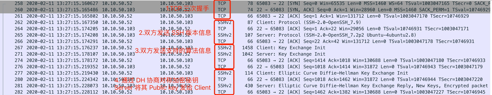

# 这是一个关于信任的故事

很久以来一直搞不清楚为什么要做证书，在做 VPN 的时候需要 VPN，做 Horizon view 的时候需要，做 vSphere 的时候也需要。之前请教过总监这个问题，他的解答如下：
证书是用来证明你的身份的，证书不可以被伪造所以很安全。证书有客户端证书和服务器证书，服务器证书用于用户来确认服务器的真实性，客户端证书用于服务器确定终端的真实性。

记住以上内容，就明确了证书的用途，但是还差底层原理的解析，本文将整理汇总几个经典的关于证书的文章，全面介绍证书。

# 起源

每个人的过去总会有很多隐秘的事，学时的恋爱，内心的小想法，而任何时候，这些秘密都应该藏在心底，藏在两个人之间。为了保守秘密，我们可能会给自己的日记加上密码锁；为了私密地和另一个人交谈，我们甚至会用一种只有我们懂的“语言“来交流。

这便是我们每个人能碰到的最早的与**保密**相关的故事。保密的目的在于保守秘密，不让别人知道属于我们隐秘的故事。

保密的方式可以是将内容整个加锁（密码锁），也可以是将文字本身加密（另一种语言）。对应到应用中，前者可能是文件加锁；后者则是通过特定算法来加密。

然而事实是，以上保密手段并不是绝对可靠，还记得初中最经常做的事便是帮别人开密码锁，迷你机械密码锁一般都比较简单，通过触觉、听觉不断转动转盘便可发现规律，最终打开密码锁。

语言的加密也很简单，无非是用特殊字符替换掉 A、B、C、D等，或者将字母进行顺序变换，使得写出来的东西别人一眼看不懂。如果能掌握规律，很容易破解出来。

如果要使得密码锁变得难以破解，有以下方法：机械密码锁使用更加复杂的内部构造，使得通过触觉，听觉不能获取锁的原理；除此之外，可以让密码锁有更多的转盘，让密码暴力猜解变得更难；另外，还应当有防暴力的手段，就像电影中保险箱中都会有块防钻孔玻璃一样，一旦检测到暴力破解，则锁死系统。对应到应用中，前者便是对加密程序的加固，使得加密程序不能被反编译，进而让别人无法猜到加密的原理；中间则是增加密码长度，避免密码猜解；最后就是密码尝试的次数限制。

如果要使得文本加密变得难以破解，可以在加密算法中加入扰乱的因素，例如本来只有26个字母，我们可以新增两个字母，让字母表有28个字母，然后随机假定两个字母是扰乱因子，随机写在我们的密文中。或者我们可以写5个不等的数字，然后将写好的信的每5个字母为一组，每组的每个字母按照数字循环累加，例如：5个数字分别为 1，3，4，7，9，信的内容为 i love you，则最终加密后会变为 j oscn zrr，这样的加密方式不再有恒定的规律，随着 5 个数字的不同，加密结果也不同，除非知道这组数字是什么，否则很难解密。

为了好玩，用 python 写了这样的一个加密/解密器，程序如下：

这样的加密足够安全，但唯一的问题是密钥可能被泄露。随着应用的广泛，密钥管理变成一件难事。

# 安全地分发密钥

如果是两个人之间沟通还好，放在现在的世界里，每天我们可能要去访问大量的网站，比如微博，微信，手机银行。在这种场景下，我们很难像两个人之间沟通一样，悄悄线下约定好密码，然后再加密传输。我们需要一种简单、安全的办法让服务器和我们之间**自动协商出密码**，同时保证密码不泄露。

目前最常用的方式是通过非对称加密算法进行协商过程的加密，再去协商共享秘钥，使用协商出来的共享秘钥进行数据的加密。

非对称加密的美在于加密和解密用的密钥不一样，这种加密有以下优点：

1. 公钥（public key）和私钥（private key）是一一对应的关系，有一把公钥就必然有一把与之对应的、独一无二的私钥，反之亦成立。
2. 所有的（公钥, 私钥）对都是不同的。
3. 用公钥可以解开私钥加密的信息，反之亦成立。
4. 同时生成公钥和私钥应该相对比较容易，但是从公钥推算出私钥，应该是很困难或者是不可能的。

非对称加密算法的应用比较多，常见的 SSH、SSL、TLS 均会使用这类算法。以 SSH 为例，其工作流程如下：

1、SSH Client 向 SSH Server 发起连接请求，TCP 三次握手建立连接

2、SSH Client 向 SSH Server 发送其 SSH 版本，SSH Server 返回 SSH 版本信息

3、SSH Server 向 SSH Client 发送其支持的算法列表，SSH Client 返回其支持的算法列表。列表中包含：非对称加密的算法(host-key-algorithms)、Client-->Server 及 Server-->Client 支持的对称加密算法、HMAC 校验算法、压缩算法、语言等等。Client 需要选取双方均支持的算法并继续。

4、SSH Client 及 Server 通过 ECDH 密钥交换算法协商出共享密钥，大致过程如下：

（1）Client 生成 ephemeral key pair；发送SSH_MSG_KEX_ECDH_INIT 报文（内含ephemeral public key）

（2）Server 验证收到的 ephemeral public key 是合规的；Server 生成  ephemeral key pair ；Server 通过算法计算**共享密钥**；Server 生成并签署 exchange hash；发送 SSH_MSG_KEX_ECDH_REPLY 报文（内含 Server public key、Server ephemeral public key、exchange hash 的签名）

（3）Client 收到 ephemeral public key，并验证其是合规的；*验证收到的 public key 是属于服务器的（利用 Server 提供的 SSH Public key，一般此步骤会提示用户是否信任 Server）*；计算**共享密钥**；生成 exchange hash；验证 Server 发过来的 exchange hash 的签名。

- 其中 exchange hash (H) 由下列值进行哈希计算得出：Client identification（V_C）、Server identification（V_S）、Client 的 SSH_MSG_KEXINIT 报文负荷（I_C）、Server 的 SSH_MSG_KEXINIT 报文负荷（I_S）、Server 的 public key（K_S）、Client 的 ephemeral public key（Q_C）、Server 的 ephemeral public key（Q_S）、共享密钥（K）

(参考资料：https://tools.ietf.org/html/rfc5656#page-6)

5、Server 验证 Client 身份，一般是使用 Client 提供的密码来验证其身份（或者将 Client 的公钥加入 .ssh/authorized_keys 中。无论哪种方式，双方都应该开启对应的认证方式，Linux 默认开启 password、RSA、publickey 三类认证方式）

6、连接成功建立

下图为抓取的前四个阶段的包，后面的因为加密没办法查看细节的内容。

上述步骤比较复杂，但也比较安全，整个过程中**共享秘钥并未直接通过网络传递**，而是双方通过各种信息计算出来的，里面用于计算共享密钥的 ephemeral public key 也是随机生成的，并不会长久保存在服务器和客户端。唯一不安全的因素便是文中标斜的那句话：通过收到的 public key 验证服务器的身份。

如何验证身份认证呢？一般有三种办法：

1、我们事先记录了要连接 Server 的 public key 的信息，当再次连接时很容易确定要连接的服务器是不是真实的。（类似于现实中我们双方很熟悉，我很清楚你的签名是什么样子）

2、用户第一次收到 public key，默认连接的确实是真实的服务网，将其加入信任列表。（类似于我按照正确的门牌号找到了你，但是我们是初次见面（我默认认为我找对了人），你提供了你的签名，未来看到同样的签名我就认为是你写的）

3、借助第三方权威认证机构，验证 Server 提供的 public key 是否真的是该 Server 的。（人太多认不过来，我现在要求所有给我发消息的人先去公安办实名认证，然后将认证信息和签名一同给我，我才认可你）

一般 SSH 都是使用第二种，而事实更安全的方式便是第三种，这就迎来了证书、签名、证书颁发机构等技术。

# 数字签名

