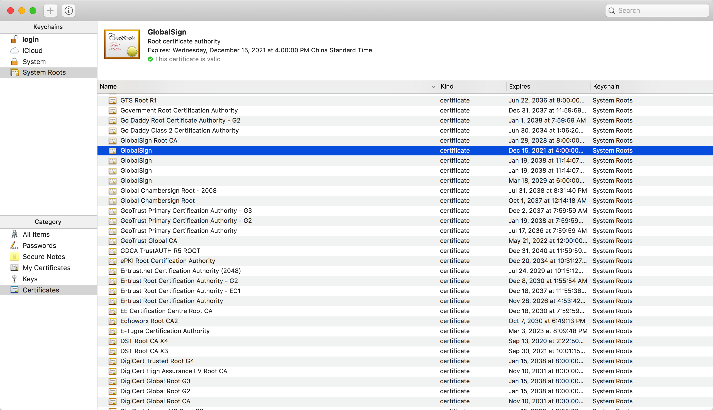
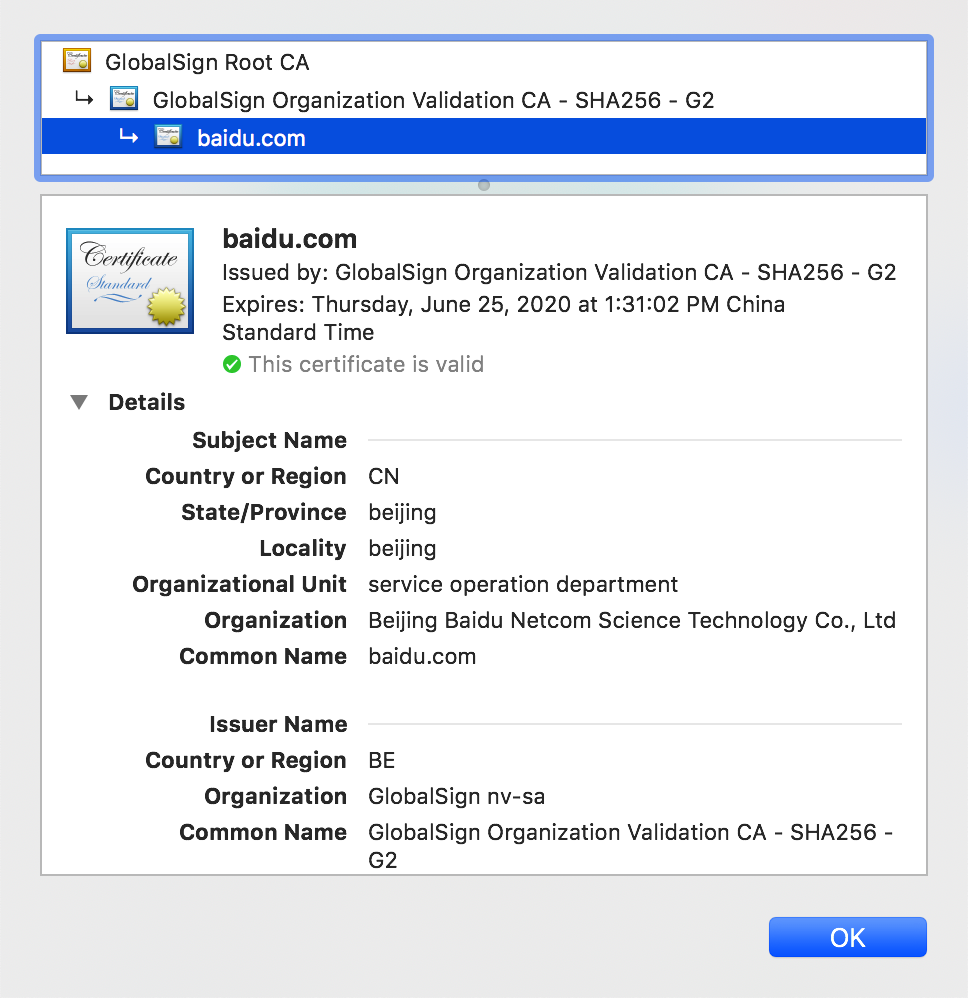

changelog：

20200216：写完第一版，补充概览

# 概览

写完第一版的时候，算是弄清楚证书和非对称加密算法的关系了，本文总结如下：

在数字化世界里，安全始终是第一位，为了保证安全就必须做到以下三点：

1、确认对端的身份：在连接对端时，需要有手段确认对方身份，防止钓鱼网站或者中间人攻击；

2、传输加密：传输时不得以明文传输，防止他人窃听；

3、信息完整性校验：确保信息经过传输后未被他人篡改。

对应到解决方案：

1、数字证书：借助权威中立机构进行认证（CA），在每次访问对端时要求对方提供数字证书（CA签发的公钥），如果数字证书确实是由受信 CA 签发的，且证书中的主体信息和访问的主体一致（网站域名），则认可对端的身份；

2、加密：最常见的方式是利用 Diffe Hellman 密钥交换方法，双方协商出一个对称加密共享密钥。一般每个会话会有不同的密钥。

3、数字签名：使用非对称加密算法生成的私钥对信息摘要（原始信息的哈希值）进行加密，对端收到后使用非对称加密算法生成的公钥进行解密，查看收到的信息和信息摘要是否一致。如果一致则表示数据未经篡改。

其实之前一直困扰我的是数字证书有公钥和私钥，非对称加密又有公钥和私钥，但实际上数字证书=公钥+CA信息+CA签名+数字签名，私钥=非对称加密的私钥。

非对称加密算法实际上有两种用途：一种是各种资料宣称的加密，一种是用于数字签名。而实际上用途最多的是数字签名，前者几乎看不到。

# 这是一个关于信任的故事

很久以来一直搞不清楚为什么要做证书，在做 VPN 的时候需要 VPN，做 Horizon view 的时候需要，做 vSphere 的时候也需要。之前请教过总监这个问题，他的解答如下：
证书是用来证明你的身份的，证书不可以被伪造所以很安全。证书有客户端证书和服务器证书，服务器证书用于用户来确认服务器的真实性，客户端证书用于服务器确定终端的真实性。

记住以上内容，就明确了证书的用途，但是还差底层原理的解析，本文将整理汇总几个经典的关于证书的文章，全面介绍证书。

# 起源

每个人的过去总会有很多隐秘的事，学时的恋爱，内心的小想法，而任何时候，这些秘密都应该藏在心底，藏在两个人之间。为了保守秘密，我们可能会给自己的日记加上密码锁；为了私密地和另一个人交谈，我们甚至会用一种只有我们懂的“语言“来交流。

这便是我们每个人能碰到的最早的与**保密**相关的故事。保密的目的在于保守秘密，不让别人知道属于我们隐秘的故事。

保密的方式可以是将内容整个加锁（密码锁），也可以是将文字本身加密（另一种语言）。对应到应用中，前者可能是文件加锁；后者则是通过特定算法来加密。

然而事实是，以上保密手段并不是绝对可靠，还记得初中最经常做的事便是帮别人开密码锁，迷你机械密码锁一般都比较简单，通过触觉、听觉不断转动转盘便可发现规律，最终打开密码锁。

语言的加密也很简单，无非是用特殊字符替换掉 A、B、C、D等，或者将字母进行顺序变换，使得写出来的东西别人一眼看不懂。如果能掌握规律，很容易破解出来。

如果要使得密码锁变得难以破解，有以下方法：机械密码锁使用更加复杂的内部构造，使得通过触觉，听觉不能获取锁的原理；除此之外，可以让密码锁有更多的转盘，让密码暴力猜解变得更难；另外，还应当有防暴力的手段，就像电影中保险箱中都会有块防钻孔玻璃一样，一旦检测到暴力破解，则锁死系统。对应到应用中，前者便是对加密程序的加固，使得加密程序不能被反编译，进而让别人无法猜到加密的原理；中间则是增加密码长度，避免密码猜解；最后就是密码尝试的次数限制。

如果要使得文本加密变得难以破解，可以在加密算法中加入扰乱的因素，例如本来只有26个字母，我们可以新增两个字母，让字母表有28个字母，然后随机假定两个字母是扰乱因子，随机写在我们的密文中。或者我们可以写5个不等的数字，然后将写好的信的每5个字母为一组，每组的每个字母按照数字循环累加，例如：5个数字分别为 1，3，4，7，9，信的内容为 i love you，则最终加密后会变为 j oscn zrr，这样的加密方式不再有恒定的规律，随着 5 个数字的不同，加密结果也不同，除非知道这组数字是什么，否则很难解密。

# 对称加密与非对称加密

其实上述的过程都属于对称加密，对称加密意味着加密和解密使用的密钥是一致的。这就存在密码泄露的风险，也存在被破解的风险。

在加密学中有另一种算法叫非对称加密，非对称加密的美在于加密和解密用的密钥不一样，这种加密有以下优点：

1. 公钥（public key）和私钥（private key）是一一对应的关系，有一把公钥就必然有一把与之对应的、独一无二的私钥，反之亦成立。
2. 所有的（公钥, 私钥）对都是不同的。
3. 用公钥可以解开私钥加密的信息，反之亦成立。
4. 同时生成公钥和私钥应该相对比较容易，但是从公钥推算出私钥，应该是很困难或者是不可能的。

非对称加密相对对称加密的特点是**更加安全**，但是**性能更差**，所以实际应用中并不会完全使用此加密算法进行加密，一般非对称加密有两种用途：

1、用公钥加密，用私钥解密（当前安全领域实际很少这样用）

2、用私钥签名，用公钥验证（例如 SSH 中会生成 id_rsa.pub 和 id_rsa 秘钥对，id_rsa.pub 需要发给对方做验证）

有了以上关于加解密的基础知识，继续往下看。

# 安全地分发密钥

如果是两个人之间沟通还好，放在现在的世界里，每天我们可能要去访问大量的网站，比如微博，微信，手机银行。在这种场景下，我们很难像两个人之间沟通一样，悄悄线下约定好密码，然后再加密传输。我们需要一种简单、安全的办法让服务器和我们之间**自动协商出密码**，同时保证密码不泄露。

有种较为理想的方式是通过非对称加密算法进行协商过程的加密，再去协商共享秘钥，使用协商出来的共享秘钥进行数据的加密；或者，单纯利用非对称加密算法的特性辅助共享密钥的协商；甚至，直接使用某种安全的共享密钥协商方式（ Diffie–Hellman key exchange）。

SSH 便使用了第二种方式，其后端用了 Diffie–Hellman key exchange 方法，SSH 工作流程如下：

1、SSH Client 向 SSH Server 发起连接请求，TCP 三次握手建立连接

2、SSH Client 向 SSH Server 发送其 SSH 版本，SSH Server 返回 SSH 版本信息

3、SSH Server 向 SSH Client 发送其支持的算法列表，SSH Client 返回其支持的算法列表。列表中包含：非对称加密的算法(host-key-algorithms)、Client-->Server 及 Server-->Client 支持的对称加密算法、HMAC 校验算法、压缩算法、语言等等。Client 需要选取双方均支持的算法并继续。

4、SSH Client 及 Server 通过 ECDH 密钥交换算法协商出共享密钥，大致过程如下：

（1）Client 生成 ephemeral key pair；发送SSH_MSG_KEX_ECDH_INIT 报文（内含ephemeral public key）

（2）Server 验证收到的 ephemeral public key 是合规的；Server 生成  ephemeral key pair ；Server 通过算法计算**共享密钥**；Server 生成并签署 exchange hash；发送 SSH_MSG_KEX_ECDH_REPLY 报文（内含 Server public key、Server ephemeral public key、exchange hash 的签名）

（3）Client 收到 ephemeral public key，并验证其是合规的；*验证收到的 public key 是属于服务器的（利用 Server 提供的 SSH Public key，一般此步骤会提示用户是否信任 Server）*；计算**共享密钥**；生成 exchange hash；验证 Server 发过来的 exchange hash 的签名。

- 其中 exchange hash (H) 由下列值进行哈希计算得出：Client identification（V_C）、Server identification（V_S）、Client 的 SSH_MSG_KEXINIT 报文负荷（I_C）、Server 的 SSH_MSG_KEXINIT 报文负荷（I_S）、Server 的 public key（K_S）、Client 的 ephemeral public key（Q_C）、Server 的 ephemeral public key（Q_S）、共享密钥（K）

(参考资料：https://tools.ietf.org/html/rfc5656#page-6)

5、Server 验证 Client 身份，一般是使用 Client 提供的密码来验证其身份（或者将 Client 的公钥加入 .ssh/authorized_keys 中。无论哪种方式，双方都应该开启对应的认证方式，Linux 默认开启 password、RSA、publickey 三类认证方式）

6、连接成功建立

下图为抓取的前四个阶段的包，后面的因为加密没办法查看细节的内容。

上述步骤比较复杂，但也比较安全，整个过程中**共享秘钥并未直接通过网络传递**，而是双方通过各种信息计算出来的，里面用于计算共享密钥的 ephemeral public key 也是随机生成的，并不会长久保存在服务器和客户端。唯一不安全的因素便是文中标斜的那句话：**通过收到的 public key 验证服务器的身份**。

如何验证身份认证呢？一般有三种办法：

1、我们事先记录了要连接 Server 的 public key 的信息，当再次连接时很容易确定要连接的服务器是不是真实的。（类似于现实中我们双方很熟悉，我很清楚你的身份）

2、用户第一次收到 public key，默认连接的确实是真实的服务网，将其加入信任列表。（类似于我按照正确的门牌号找到了你，但是我们是初次见面（我默认认为我找对了人），你提供了你的身份证明，未来看到同样的身份证明我就认为是你写的）

3、借助第三方权威认证机构，验证 Server 提供的 public key 是否真的是该 Server 的。（人太多认不过来，我现在要求所有给我发消息的人先去公安办实名认证，然后将认证信息与数据一同给我，我才认可你）

一般 SSH 都是使用第二种，而事实更安全的方式是第三种。为了实现第三种，需要理解如下的技术：数字签名、数字证书和证书颁发机构。

# 数字签名

一句话总结：**数字签名是为了防止信息被恶意篡改，数字签名不能解决身份认证问题**。

有一个很经典的文章讲述数字签名，此处直接引用：

[http://www.youdzone.com/signature.html](http://www.youdzone.com/signature.html) 及 [https://morven.life/notes/the_digital_signature_and_digital_certificate/](https://morven.life/notes/the_digital_signature_and_digital_certificate/)

1、小张通过非对称加密算法生成了一个秘钥对，将其公钥公开发给了小黑、小王、小李

2、小王通过小张的公钥对信息进行加密，然后传递给小张。小张则利用配对的私钥进行解密，查看明文的信息。

在此过程中，被发送的加密信息可能被小黑获取，但是小黑没有小张的私钥，无法解密，所以只能看到密文，并没有实际意义。

3、为了更进一步加强信息的安全性和准确性，小张可以对待传递的信息加上“数字签名”。数字签名在这里的作用主要是防止信息在发出去后被篡改，其实现原理如下：

大家都知道哈希的特点是可以将任意大小的数据算成固定位数的字符串，几乎无法逆向算出原始数据，且原始数据哪怕发生 1bit 的变化，最终的运算结果也是千差万别，因此用于数据完整性校验再好不过。同时为了防止传输时信息摘要被修改，可以使用非对称加密对其进行加密。

最终，小张会将密文与数字签名一同发给小王， 小王收到后解开密文和数字签名，计算明文的信息摘要，再和收到的数字签名做对比，如果两者一致则表示收到的信息确实是没经过篡改，可信的。

4、但事情还没结束，小黑技术比较厉害，想恶意破坏小王和小张的对话，他认为小张小王之间的通讯是足够安全，很难篡改，但并非绝对安全。

假设小黑在一切会话开始之前就假装自己是小张，将自己的公钥分发给小王，而小王以为收到的公钥就是小张的（实际是小黑的），便用这个公钥进行加密，最终结果是小王一直在和小黑通讯。

为了解决这个问题，需要从一开始就建立完整的信任机制，保证小王拿到的确实是小张的公钥。

# 数字证书和证书颁发机构

解决以上问题的方法很简单，在系统中加入第三方具有公信力的机构，未来如果要确认一个身份，直接找这个机构查验即可。这种机制很类似于我们的身份证。身份证即是数字证书，公安即是证书颁发机构。

前面的例子说了，不安全的原因在于**小王没办法确定拿到的公钥是不是小张的**，那么数字证书首先要做的就是建立公钥和身份的关系。通常的解决方法是：直接由个人提供身份描述信息，证书用途等信息，证书颁发机构通过这些信息生成公钥证书+私钥，公钥证书包含公钥的内容和 CA 的签名，私钥则是和被认证的公钥匹配的私钥。

证书颁发机构（CA，Certification Authority）大致有两类：

一类是全球公认的；一类是企业内部自己搭建的，只在企业范围内使用的。

前者因为全球公认，所有浏览器会将这些 CA 的证书（根证书）安装在系统中，如果发现访问的网站是由这些 CA 签发的，则信任这些网站的证书。下图是 macos 自带的一些证书：

访问网站时，也可以看到网站使用的证书是由谁签发的。（下例中签发机构便是上图选中的那个 CA）

如果企业内部使用，则可以自己搭建 CA 服务器，或者使用软件（例如 OpenSSL 和 cfssl ）来创建 CA 根证书，为 Server 或者 Client 颁发证书。

通过 CA 申请证书时需要填写很多信息，一般将这个申请称作CSR（certificate signing request），CSR 通常需要包含以下信息：

- CN（Common name）: 填写 FQDN，例如 ***.halfcoffee.com**

- O（Organization/Bussiness name）：一般写公司名，例如 Wikimedia Foundation, Inc.

- OU（Organization Unit/Department name）：部门，例如 IT、HR 等

- L（Town/City）:城市，例如上海

- ST（Province，Region，county，State）：所在省份、地区，例如上海

- C（Country）：二位数的国家代码，例如 CN

- MAIL：邮箱地址
- 签名算法：一般是 RSA 2048 
- 证书用途：可以是客户端认证、服务器认证、数字签名、加密等等

*注，在部分文档中说到通过 CA 申请时需要提供待签名的公钥，实际上我在测试时并不需要，CA 会直接生成一对非对称加密秘钥给用户。*

数字证书则包含下列内容：

- 主体身份信息：其实就是签名 CSR 中填写的一些信息，表示证书给谁用，他的信息是什么；
- 主体的公钥：数字证书是给公钥签名的，所以必须提供主体的公钥（或者由 CA 生成）；
- CA 名称：标识这个数字证书是谁签发的；
- CA 签名：单纯标识数字证书是谁签发的并不安全，所以需要添加数字签名，防止伪造。
- 证书签名：CA 使用自己的私钥给证书主体的公钥进行签名
- 有效期：证书的有效期
- 签名算法：一般是 RSA 2048 

数字证书使用时逻辑一般如下：

1、先创建 CA，CA 会生成一个非对称加密秘钥，自己为自己的公钥进行签名，形成根证书。

2、证书主体（假设为服务器）创建 CSR（CSR 中包含服务器的公钥），向 CA 请求证书。

3、CA 用自己的私钥对主体的公钥（及主体信息等内容）进行签名，在证书上附上自己的信息及自己的签名。

4、证书主体拿到 CA 签发的证书，将其配置在其 web 服务器中，使用此证书做服务器身份验证及加密。

5、客户端安装 CA 的根证书

6、客户端通过 HTTPS 访问服务器，服务器返回了由 CA 签发的证书，客户端读取此证书，发现此证书是由 CA 签发的，在本地查找此 CA 的根证书，通过 CA 根证书验证服务器返回的证书是否真的是此 CA 签发的，同时通过 CA 根证书解密证书的内容，查看证书签名是否和证书的主体信息一致。

7、验证无问题后，双方开始通讯

其他内容目前本文不涉及：CA 的详细功能、CA 架构、X509、证书编码等。这些内容均可在最后一份参考资料中查看到。未来有空会增加到此文章。

参考资料：

[https://zhuanlan.zhihu.com/p/56663184](https://zhuanlan.zhihu.com/p/56663184)

[https://morven.life/](https://morven.life/)

[https://morven.life/notes/the_pki_and_digital_certificate/](https://morven.life/notes/the_pki_and_digital_certificate/)

[https://en.wikipedia.org/wiki/Certificate_signing_request](https://en.wikipedia.org/wiki/Certificate_signing_request)

[https://www.jscape.com/blog/an-overview-of-how-digital-certificates-work](https://www.jscape.com/blog/an-overview-of-how-digital-certificates-work)

[https://sites.google.com/site/ddmwsst/digital-certificates#TOC-Certificate-Purposes](https://sites.google.com/site/ddmwsst/digital-certificates#TOC-Certificate-Purposes)