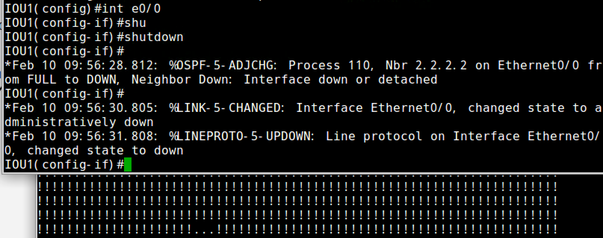
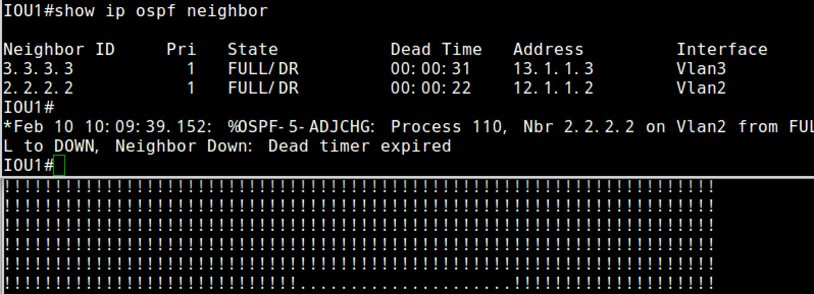

## OSPF 的 Hello、Dead 时间

ospf 有多种网络类型，此处只谈比较常用的MA网络，广播类型。

默认OSPF hello 时间为10s，Dead 时间为40s(4倍的hello时间)。

Hello 时间表示多久发一次Hello包，在邻居建立完成后，每个Hello时间会给邻居发送Hello包来表示自己还是存活的。

Dead 时间表示多久内未收到邻居的Hello包，就将邻居标记为Down，这样ospf的网络会重新收敛，以前从邻居收到的路由信息将会不可用。

## 一个实验

拓扑图如下：

这是一个简单的路由结构，所有接口为三层口。我们测试在这种结构下，IOU1的E0/0挂掉后，IOU4与IOU1的通信中断时间。

基础配置完成后，能在IOU4上看到两条到IOU1的等价路由，调整选路，让其优先走24.1.1.2。

       IOU4#show ip route 
    Codes: L - local, C - connected, S - static, R - RIP, M - mobile, B - BGP
           o - ODR, P - periodic downloaded static route, H - NHRP, l - LISP
           + - replicated route, % - next hop override
    
          1.0.0.0/32 is subnetted, 1 subnets
    O        1.1.1.1 [110/21] via 34.1.1.3, 00:00:10, Ethernet0/1
                     [110/21] via 24.1.1.2, 00:00:00, Ethernet0/0

       IOU4#show ip route 
    Codes: L - local, C - connected, S - static, R - RIP, M - mobile, B - BGP
           o - ODR, P - periodic downloaded static route, H - NHRP, l - LISP
           + - replicated route, % - next hop override
    
          1.0.0.0/32 is subnetted, 1 subnets
    O        1.1.1.1  [110/21] via 24.1.1.2, 00:00:00, Ethernet0/0

在IOU4 上长 ping IOU1，当断开IOU1 的E0/0后(模拟端口故障)，实际丢包约5秒左右，从系统提示可以看到检测到链路down之后，ospf协议立刻进行了收敛

这样的收敛速度在大部分场景下是可以接受的，应用角度来说用户不会察觉到网络出过问题。

## 实验二

下面我们在上面的环境中，引入三层交换机常见的一种路由连接模式，即物理接口是Access或者Trunk二层模式，而在交换机上配置SVI（交换机虚拟端口）进行三层通信，拓扑如下图：

在IOU4 上长 ping IOU1，当断开IOU1 的E0/0后(模拟端口故障)，实际丢包约42秒左右，从系统提示可以看到检测到链路down之后，邻居状态依然正常，只有等40S后系统提示邻居Dead，路由才收敛，网络通信才正常。

## 小结

从以上两个实验就可以看出，在有交换机的场景下，OSPF的收敛时间可能会达40秒以上，原因就是OSPF路由认为的拓扑变动是接口down，而在有SVI的场景下，SVI 始终是双 UP 状态，ospf只能依靠Hello包和Dead时间确定邻居存活状态，然后重新计算路由。

为了加快这样配置时ospf收敛时间，则需要修改接口的Hello和Dead值(例如修改为1，3，即端口故障后4~5秒内可以完成路由收敛)，这样做的问题可能有增大网络开销（时间单位内发送Hello包多了），或者网络抖动（网络故障时间刚好大于Dead时间时）。

最后，在将 OSPF 应用于虚拟网络时，则应当将 OSPF Hello Dead 尽量调小，一般最小为 1 和 4，或者如果虚拟网络设备支持  BFD，可以搭配 BFD 进行邻居的检测，以此加快 OSPF 的收敛。

