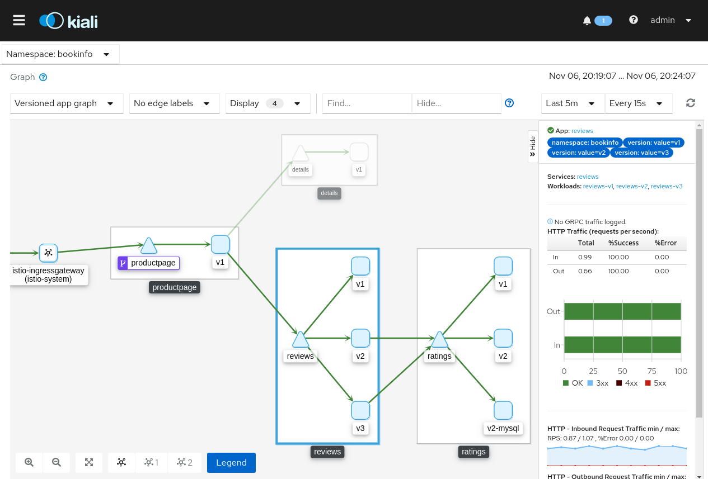
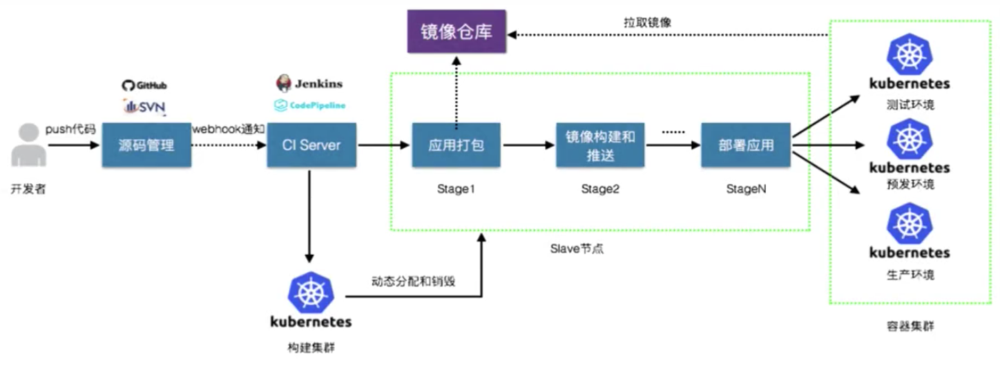
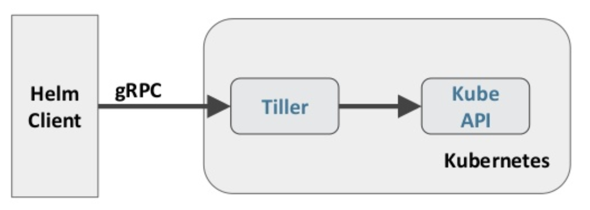

# 20220423

上海疫情已经一个多月了，眼看过了清明，将要5.1，天天在家做饭的日子已经持久了一个多月。

听着自己零散的音乐收藏，从90年代跳到现代，再回到19世纪，思绪乱飞。

这些周每周都有一种独有的心情，不带重样。工作的忙碌使得身心疲乏，晚上很累又睡不着，于是开始设法去掉那些影响心情的事，比如做实验。更多的时间来写公众号，看剧，一部接一部。

有时候实验做多了，会感觉自己成为了QA，专为公司产品排BUG，最头疼一次，一个产品安装30几遍，VM的编号都到了11x，那是至暗的三天，之后再也不想碰那个东西。虽然最后发现只是一个产品兼容性问题，但这种过程的无助和沮丧深深印入脑中。

清明花了些时间学了下ToDoList一年前就列出的项目，看了几十篇文档，做了一大堆PPT，一个产品功能算是了解清楚了，没那么难，但值了，这样的时间很快乐。

最近身边有两位朋友换了工作，这样的变化始终会影响到我的心情，工作日和三个人聊了聊工作，结论是，如果不跳出圈子就尝试去屏蔽不开心的事，或者跳出圈子。后来淡定下来后，想想还是在圈子里待着，还有事情做，还有价值，虽然不一定适合长期发展，但是，长期会发生什么，谁又知道呢？

关于个人发展上，朋友怂恿我往SA转，他对SA的定义就是，站在客户的角度来做架构设计，这是一个SA基本的素养，卖产品则是一种很低端的工作。某些时候真的很认同SA的工作，也有些向往，可以极大拓展自己的知识面，成为一个架构师，但和南区一个同事聊完之后，换位子有时候真的有风险，风险主要在于人，即使一份工作需要SA这样的人，并不意味着每日的工作就是做架构设计，零碎的基础项目也得做，给上面的报告也得做，相比之下，二线拿到的活好歹是一线过滤掉的，可以轻松和简单不少。另外，SA虽然好，但这就像爬山，已经身处半山腰，风景已经可以了，要不要再费力往上爬，或许需要一些更强的刺激和外力。

听到一首SecretGarden和90年代的抒情歌曲，就觉得现在很难有以前那样的心境，现在好浮躁，周内工作日的时候，唯一用来消遣的东西是爽剧和FPS游戏，FPS过于沉迷，一气之下决定卸载了游戏，现在第三周，偶尔玩一玩，似乎已经没了这个习惯，更多注意力放到了爽剧之上。

今天看了部《别惹佐汉》，好久没看过这么爽快的喜剧了，片中好多有趣的小细节，导演脑洞可以。上次看爽片还是《像素大战》，这类电源虽然评分低，但相当能活跃死气沉沉的疫情。

自从停了做实验，偶尔还会碰到其他人做实验遇到问题，忍不住想上去远程支持。帮老板在两天内解决了三个问题，毫不意外，都是bug，对我的处理效率感到满意，但印证了我曾经的总结：“当环境搭不好的时候，一定是产品问题”。

# 20211210

一晃半年又过去了，过去半年发生了太多，经历过腰疼不止，生活空虚无望；也经历了咳嗽不止，夜不能眠；有些时候又过于无聊，沉迷于游戏。

说说近期的一些事情，11月底到12月工作上的事情很少很少了，基本不见客户，剩下的时间全部都可以用来处理内部的事情，学新产品，做实验，写文档输出。

和team成员参加一个hol竞赛，目测可能是global no1，在参赛前还想着能有多难，一个人也搞得定，实际比赛的时候发现，还是有些产品的冷门功能不是谁都清楚的，还好一个评委为我们指导了两道题，让我们100%交卷。对于个人来说，是有些泼冷水，让我看到了自己的弊端。

最近领导和我谈了很多，希望我可以成为team的主力成员之一，有些受宠若惊，也有些惧怕，凭我的性格，一件事情我只有在有把握的情况下去做，很害怕做超出自己力所能及的事，比如high level的演讲，看了那么多前辈去讲，我很难做到，我目前只能做到深入的讲，很详细的知识输出。

# 20210307

上海连续一个月的阴雨天，在这种天气下很难保持一颗乐观的心，每天早起唯一的安慰是可以做个吐司喝杯咖啡。

自从过年完后很少有工作的状态，除非是有些必须要在某时间点完成的工作，例如文档和交流。年后的股市火热，或许有些太过于投入了，好在现在冷静了下来。

时间长了，会觉得周末索然无趣，想要做些不一样的东西，比如打开未看完的书。看了柴静讲卢安可的那个章节，很多故事都挺好，只是需要将作者的一些点点线线飘絮的思想给联系起来。

最近看了很多短剧，一半是和 Netflix 有关，有纪录片，有外文的轻喜剧，每看一个剧都会安利一座城市，甚至会让我忽略潜意识中的一些偏见，例如疫情中的意大利，例如黑人居多的法国。

每个古老的发达城市都是有自己独特的一面，是一种深入在生活每个角落的文化的遗留。很想真的去实地感受一下。

《意大利制造》让我想起之前看的《morning glory》，每个处在自己行业的年轻人都真的是很热爱这个行业，了解它的背景，做足了功课，有敬仰的前辈和仰慕的对象，每次见到前辈，都如和历史或者一种神的存在对话，这些人是真的在某些方面改变了世界的人。

《艾米丽在巴黎》，更加娱乐一些，同作为年轻人，也会遇到一些文化冲突，例如想给公司带来创新的文化，但并不会受太多人待见，但剧没有体现出来的一点是，在带来创新的同时，年轻人可能会带来浮躁，这些浮躁可能并不会其他人，但对于自己的发展未必是好事，结果可能是被更加不受待见，最终孤立，更被磨平棱角。

虽然在基金上浮亏了很多，好在工作上竟然一笔笔的意外收获，销售老板和技术老板同时嘉奖。未来要回归工作狂模式，要不然对不起大家的期待。

昨天教练说我压抑的太多，以至于放松的时候只能摊着，想静静，True，but，对于工作，没做过的事情对我是焦虑又有收获的，重复的事情则是对我基本功的一次次考量，就如现在写东西，是对思维的一个整理，也是一种不错的宣泄，听着圣桑的钢琴协奏曲，感觉良好。

# 20200716

中午11点，听着西贝柳斯的 Op.69 No.2，2分53秒的小提琴醉了。

上周是大起大落的一周，这周持续。

周二出门被交警抓住未走人行道，处罚。

周三得到面试结果，谈薪资，不知道哪里触动了HR的弦，说了非常难听的一些话，曾经只有一个人这样说过我，现在她还在黑名单中，我们的结束就是那么干脆。

半夜睡不着，反复思考到底自己想要什么，怎么和HR再谈一次，思考的越多，思考到的东西越多，一旦换了工作，我的工作强度必然会上升，现在稳定的生活会被打破，虽然大家都说是个很好的转SE的机会，但我竟然有点不想转了，已经有点安逸，以及想开，就像曾经出来一样。最后又想到无论如何，工资还是要谈上去，就凭两点：1、一旦进去，下次涨薪会在两年后，2、因为HR的一些话，我不谈高心里就会一直有根刺，未来某一天就会爆发，于是，定了一个比昨天下午想的高一丁点的标准。

成不成事，再看。当前，一个大石头终于放下，足够畅快。

# 20200710

这一周绝对算得上一生难忘的大起大落的时刻。

A股大涨，纯基金收入单日2w+，然后接着每天1%左右的收益，眼看着牛市要来，整体收益率已经到了20%，年化收益率高于预期的太多。

周三晚上官宣要被SUSE收购了，一晚上没睡好，心里各种掺杂了各种感情，半夜参加All hands，听suse讲他的背景，有点心凉，一家处于上升期的公司突然要被一家低调的公司收购，前途未知。

周四听了其他人的评价，稍微心安一点，与其说是被收购，不如说是战略合作，重点是Rancher是核心，SUSE是辅助。

但是，一旦合并，免不了人员调整，曾经想着可能会被干掉或者发生其他什么事情，目前看人是不会走，只是会变得像大公司一样标准化，对于人员的变化就是分工更为明确，我现在不是SE，未来绝对成不了SE，也不会做SE的事，对于个人发展会是一个问题。

晚上和XX吃饭，经过这两天，我都忘记我有多么的恨他，各种毛病分分钟惹炸人，工作上，是单纯的无法配合工作，因为，你写的文档他会重写，你干活赶不上他的速度，他干完了，交流上，他是绝对的权威，容不得一点指点。好吧，那我就安静的不说话，思考学习，看着你干活。

本想聊聊深的话题，关于修养，我想说有修养的人可以在各种场景下安然处事，一时语塞，想不出合适的表述方法，于是问他有没有考虑过生死，他立即炸锅，不想谈。然后我说可以面对很底层到很高层，他说我可以，我曾经做过很”卑微“的事情，你绝对想不到的事情。我已经觉得，以后没什么好谈的了。

# 20200701

没想到另一个面试来的如此快，周三告知，约在周五。

一次性三个人面试，均是技术面，紧张，不知道怎么准备。

找已经在那个位子的朋友求经，给我指导了下面试的内容，有些自己并不清楚，看来只能临时抱佛脚，像之前一样写下来再慢慢稳固。

基于过去，面试的重点会是 NSX 和 AVi，NSX-T 目前最不熟悉的是和容器的集成、大二层、多数据中心方案，Avi 基本只是入门，出去讲还差很多。

其次，overlay 相关的技术，Trill、EVPN等，传统网络技术路由、交换、BGP、MPLS-VPN 等。

然后容器网络相关的，flannel、calico 等。

那么，还是先从最熟悉的NSX准备起，然后 Avi，然后 BGP，然后 EVPN，最后了解其他网络插件。

NSX 3.0的手册翻一遍，容器集成的文档要写完喽，Avi 还好写过两篇，应该可以应付面试。

## K8s 扁平网络

k8s 网络模型称为扁平网络，扁平网络有以下两个特点：

- 每个 POD 有自己的独立 IP
- 每个 POD 可以和其他所有 node 上的 POD 直接通信，中间不经过 NAT

此模型使得 POD 可以像虚拟机或者物理机一样，进行端口分配、命名、服务发现、负载均衡、应用配置、迁移等。使用网络策略可以限制 POD 间的访问。

此模型比较灵活，支持不同的网络架构和环境。

## CNI 插件

CNI 插件包含两种类型：

CNI Network plugins：创建/删除每个 pod 的网络接口，并将网络接口连接到其他网络功能。

CNI IPAM plugins：在 pod 创建/删除时分配/取消分配 IP 地址。取决于网络插件，这里的分配可能是分配一个地址或者完整的 CIDR，或者从底层的公有云提供商申请 IP 地址并分配给 POD。

## Overlay 网络

Overlay 网络是在已有的一套网络上再构建一套网络。在k8s中，overlay 网络用于提供 pod 到 pod 间的通信，对应的 underlay 就是 node 之间的物理网络连接。对于 Underlay 网络来说，它并不知道 Overlay 的存在。

使用 overlay 可以减少对底层网络的依赖。比如上层使用 vxlan 进行 overlay 封装时，underlay 可以是任意设备组成的 IP 网络。

overlay 的缺点有：

- 少量的性能损耗：解封装会占用少量 CPU，额外多出来的包头会减少真实可以传输的包大小，所以相比不使用 overlay，传输同样的数据量需要更多的报文
- 在集群外 POD IP 不可路由

## 集群外部与 POD 的访问

- 非路由：

在这种模式下，POD 通过 SNAT 去往外部，但是外部无法直接和 POD 通信，需要借助 Service 或者 Ingress。

- 可路由：

在这种模式下，POD 可以直接和集群外的 IP 直接通信，不经过 SNAT。使用这种方案有以下好处：

1. 避免 SNAT，方便集成安全解决方案，方便排错和查看日志。

2. 某些应用需要外部可以直接访问到 POD，不能经过 service 或者 ingress

但这种方式要求 POD IP 在环境中唯一，会占用大量的 IP 网段

## Calico

Calico 有两种后端：BGP、VXLAN。

### Calico CNI Network Plugin

使用 veth pair 将 pod 网络连接到主机的网络命名空间。

### Calico CNI IPAM plugin

为 POD 分配地址

### 跨网段的 overlay

在标准的 vxlan 和 IPIP 基础上，calico 还支持跨网段模式：对于每个网段，underlay 网络作为一个 L2 网络，同一个网段内传输数据不会进行封装，所以性能=非overlay网络。如果需要跨网段传输，再进行 overlay 封装。

## Flannel

Flannel Host-gw 后端，每个节点均有一个 CIDR，然后通过静态路由的方式让所有主机上的容器可以相互通信。如果用于虚拟化环境，需要开启伪传输模式。限制是需要所有主机在同一个网段，且网络多的时候路由条目会比较多。

Flannel UDP 后端，只有在操作系统的 VXLAN 不可用时再使用，一般用于调试。

参考资料：

[https://docs.projectcalico.org/networking/determine-best-networking](https://docs.projectcalico.org/networking/determine-best-networking)

## NSX-T 3.0

VMware 的软件解决方案可以用于构建下一代策略驱动的数据中心。

NSX intelligence 类似于之前的 Application Rule Manager，用于展示服务之间的访问关系，方便进行微分段策略的配置。vRNI 则主要偏向于端到端的展示，包含物理网络、SD-WAN等，适合于 day2 的运维和排错。

GENEVE 包头为8字节，64位，其中 VNI 为 24bit，和VXLAN一致。端口6081。

VXLAN 包头 50 位，VNI 也是 24。标准端口为8472，部分实现使用4789。

## NCP

组件：

kubelet：k8s组件，负责pod的创建，监控，重启等任务，调用 CNI 插件控制网络相关的配置。

NSX  CNI 插件：完成 NSX node agent 和 kubelet 之间通信转换。通过 unix socket 和 node agent 通信

NSX Node agent：DaemonSet，负责POD IP/Mac/VLAN 获取和创建

NSX kube-proxy：负责service 负载均衡等的配置，同时也负责 node agent 和 hyperhus 之间的通信。

工作流程：

1. NCP 监听 API server，获取 POD 创建事件
2. 用户创建 POD
3. NCP 获取到这个创建通知
4. NCP 和 NSX manager 通信创建 Logical-port，包含 IP、MAC、VLAN、LIF，为 LIF  添加 k8s 的 label。
5. LCP 根据 logical port 创建 LP
6. 主机上的 hyperbus 进程从 LCP 获取到 Container IF 信息，例如ID、IP、MAC、VLAN等。
7. kubelet 监控到需要创建pod，调用 CNI 进行网络相关配置，这些配置最终发给 node agent
8. node agent 完成 ovs 创建，pod ip 创建连接等。

# 20200628

很久没有静下来思考了，看看日期，竟然已经过去了一个月，这一个月我竟然还没有做到第二点。

或许因为生活中每天多了健身这件事，其余的事情已经不那么重要，每天固定的状态，早起上班，比较困然后玩手机，中午吃饭，午休，下午3~4个小时的工作时间，吃晚饭，回家锻炼，写日报，睡觉。竟然有点适应这样的生活，比较规律，但也比较累。

健身的时候，和教练聊着聊着发现他原来也喜欢咖啡，于是两人相约做首冲，不得不说黑围裙就是很专业，首冲手法和网上说的不一样，一下子就可以点出来我的问题在哪里，原来平时自己冲的都是有点过萃，有不好的东西掺杂了进去。

回到工作，端午节的前一天团建，说是团建，不如说深夜打气会，站在销售的层面，我们每个人都不够努力，销售想办法从几个角度希望我们能理解当前公司的状态，然而，至少三个技术竟然没有get到点，这是个非常可怕的事情，努力和上进并不是一件东西，努力是把眼前的事情做的更好，上进是思考着怎么做的更好，面对公司的现状，我们需要更多的上进，如销售所说，最终希望看到的是，每个技术或者销售都能知道对方每天在干嘛，能替对方做简报。

端午三天，每天睡到12+，晚上将近1点睡着，自律性有点太差了，白天状态也不行，不想学习，不知道有什么事情可以让我开心过完每一天，看电影打游戏只能短暂的麻痹自己，过后还是悔恨，晚上就有点打鸡血的状态，很想放松，然后又很晚，像极了大学的时候吧。

今天学到几个售前的原则：

- 没合同不许提前项目启动；
- 没预算不许poc
- 如果不是为了帮客户立项，不许给客户写成堆成堆的材料。

漂亮的原则。

# 20200524

刚写完周报，吃完饭，为了周报整整愁了1天半，最后还是老板的指点有用。项目目标不仅是要把事做好，还要把关系做好，把人带进去，前两件事做的差不多了，接下来就花时间带人。

晚上看了人鬼情未了，婚后感触比之前多了很多，会很能理解失去另一半费感觉，赶紧抱紧了她。

最近坚持健身，私教不便宜，但确实学到了东西，而且之前关于身体的一些误解也没有了，好像健身后精力也好了一些。

目前唯一遗憾的就是学习没有其他人积极，内心告诉自己这就是自己的节奏，但还是忍不住和别人比较。

# 20200508

感觉今天是很久以来最压抑的一天，在这天拿到了离职的工资单，在这天，被客户的自我打败了。

辛辛苦苦一年，UR最高，最终年终奖只有52%，不知道在哪个环节被克扣了，发了朋友圈，前同事说：给你拿全的。或许在她那边，是为我说了一些话，但是最终，仍然没有避免被砍的命运。

# 20200416

来到了新公司，整体感觉不错，大家很团结，很有激情。不过项目上还是会有一些问题，经常遇到客户的challenge。

依然放不下vmw的一些东西，想着花空余时间学学未来可能用得到的东西。

另外云原生的东西真的是多，需要花很多时间来做实验。

# 20200312

早上在路上看了两篇赵昂的《在人生拐角处》，第二次看这本书，第一次还是2017年，这本书在任何觉得职业选择迷茫的时候都应该看看，书中有太多关于自己的影子，例如完美主义、吃着自己的看着别人碗里的。

最近关于完美主义的做法就是从不完美开始，重点在于不被完美的思想怔住，先去执行，然后再优化。就像互联网的小步慢跑一样，快速的更新迭代。

早上看着书，想写一篇“分手”的文章，写写这两年关于一些东西的思考，现在仅仅依稀记得要写快速迭代，思想退化了等等，其他真是想不起来，哎每次都是这样，灵感就在一瞬间，再次就很难记得细节。

# 20200311

决定再仔细做完两个项目。

总结出了两套做项目的方法：

- Excel 表格用于收集数据还是很方便的，可以快速做出硬件兼容性结果，黄色表示兼容但需要调整、红色表示不兼容、绿色表示兼容。然后以 Excel 为大纲，可以较快的完成 word 版本的文档。

- 快速梳理一份 PPT 版本的交付物大纲，客户确认后再去调研，每个设计项目都会有对应的调研的情况，等这个调研结束，结合之前做好的 PPT 讨论稿模板可以快速的输出最终 PPT 讨论稿，一切确认完毕后就可以写 word 版本的或者直接实施。

关于项目管理，无话可说，要从头学起。

# 20200310

拿到offer，不算理想，但能接受。

在接到通知的时候，更多的是紧张、迷茫，不知道选择是否正确，不知道要不要迈出这一步。

和朋友聊了近一个小时，结论是一切还是由我决定。

又找前辈聊了会，顿时想清楚了。他的两句话直接点醒了我：

- 作为技术，最重要的是技术，无论你去哪里，我相信你可以很认真的踏实的学到东西，就像你现在对一些产品和解决方案的仔细程度，这点相比公司有些 SE 好太多了；
- 还是以前说的，要往前走，除非你真的喜欢现在的交付的职位。不过我觉得交付做久了思想会钝化，会不想去接触新的东西。

有这两句话就足够了。

想了想，曾经一切的收获从来都不是通过一次面试或者一个定级决定的，我已经有过很低的起点，已经有过看淡收入的那段时间，这次，相比以往已经好太多了，可以知足了。

# 20200306

在看《自卑与超越》，想弄一个博客：Steps（脚步），记录过去的每一步。

已经很难想起来为什么自己曾经会去想做一些事情，或者想做哪些事情。

有时候觉得自己已经想的很清楚了，回归初心，还是想自私一把，完成未完成的梦想。结果被《自卑与超越》中生命的意义批判的不行。

书中提到人生必须面临的三个约束：1、人类生活在地球，共享资源，资源是有限的；2、人类必须和其他人接触交流，避免不了社会关系；3、人类是两性的。

因为以上三个约束，引申出三个问题：

1、怎样才能让人类获得永存；

2、在茫茫人海中，如何给自己定位，才能达到与人合作、共同发展的目的；

3、如何自我调整，适应人类有两种性别。

书中总结，人生的意义即对整体做出贡献。

晚上因为职业的选择睡不好觉，觉得有必要看看过去一年多所有不开心的事情的个数和天数，然后未来可以在 Excel 表格中做按时记录的心情色块，绿色表示开心，黄色表示无感知，红色表示差，一年汇总下来，可以记录整个工作对于一年的影响。

从2018年12月到2020年3月，总计通宵次数29天，说多不多，说少不少...

# 20200303

没有想到还有一次面试，和 CTO 的面试，不得不快速学完 k8s 生态的东西了。

## Devops

一种重视软件开发人员和 IT 运维人员之间沟通合作的文化。通过自动化软件交付和架构变更的流程，来使得构建、测试、发布软件能够更加快捷、频繁和可靠。

Devops 不止是个技术上的问题，更多是流程、管理甚至公司架构的问题。

## 云原生

云原生有利于各组织在公有云、私有云和混合云等新型动态环境中，构建和运行可弹性扩展的应用。云原生的代表技术包括容器、服务网格、微服务、不可变的基础设施和声明式 API。

这些技术可以构建容错性好，易于管理和便于观察的松耦合系统，结合可靠的自动化手段，云原生技术使得工程师可以轻松对系统做出频繁和可预测的重大变更。

## 关于 Service Mesh

Service Mesh 需要解决服务多以及服务间复杂的调用。也就是说只有大量的上微服务时才需要。

Service Mesh 一般采用 Sidecar 的结构，Sidecar 可以在不改变原有业务代码（不关心代码的实现语言），通过代理的方式完成微服务之间的互访。

Service Mesh 有以下特点：

- 应用程序间通信的中间层
- 轻量级网络代理
- 应用程序无感知
- **解耦应用程序的重试（超时）、监控、追踪和服务发现**

Service Mesh 其实可以理解为一个 k8s 服务发现（Service）的功能的替代品（升级）。

k8s 中利用 kube-proxy 来实现应用容器对外的服务发布，实现不同 node 上 pod 间的互访，kube-proxy 实际上的原理是在每个 node 上配置 iptables 规则，有一个服务，便会有对应的很多规则，在大规模下性能会较差。另外单纯一个服务暴露出来，调用也是手工的方式，可以说 k8s 的 service 是和 pod 一样的基础的存在，还未上升到 Deployment 这样级别的易用和自动化。另外 service 也不能很好地支持蓝绿发布、金丝雀发布按流量比例发布等。

Service mesh 会将 k8s 作为服务注册机构，在控制层面生成数据层面的配置，然后数据平面以 sidecar 的形式在 pod 中注入代理容器，拦截 pod 内业务容器的流量。

两者对比看，service 需要让 pod 把流量发给 node 节点，然后再进行处理，service mesh 则在 pod 刚发出流量时便进行流量的处理。

## Istio

Istio 是 service mesh 的一种实现形式，其官方定义是：An open platform to connect, manage, and secure microservices。

Istio 包含两层：

- 数据平面：Envoy（sidecar 代理）
- 控制层：Pilot、Mixer

其中 Envoy 有以下功能：

1. 动态服务发现
2. 负载均衡
3. TLS termination
4. HTTP/2 和 gRPC 代理
5. 熔断 circuit breaker：允许创建出对故障（延迟）容忍性高的应用（在互联网系统中，服务提供方（upstream）因访问压力过大而响应变慢或失败，服务发起方（downstream）为了保护系统整体的可用性，可以临时暂停对服务提供方的调用，这种牺牲局部，保全整体的措施就叫做熔断。https://www.kubernetes.org.cn/5556.html）熔断主要是无感的处理服务异常并保证不会发生级联甚至雪崩的服务异常。
6. 健康检查
7. 流量分割（traffic shifting）
8. 故障注入（在服务间人为插入故障，检测不同微服务之间是否能检测到故障，用于解决不同业务部门开发的服务检测时间不一致导致的服务异常问题 https://istio.io/docs/tasks/traffic-management/fault-injection/）
9. 监控指标
10. 流量镜像

Pilot 有以下功能：配置 Envoy，提供服务发现，流量管理（AB测试，金丝雀部署），异常控制（超时、重试、熔断）等。

Mixer：执行访问控制，使用测量，利用 Envoy 和其他服务收集监控到的数据。

Citadel：通过内置身份和凭证管理，提供服务和用户的身份验证。

可以通过 kiali 来进行 service mesh 的可视化：

https://istio.io/docs/tasks/observability/kiali/

## CI/CD

CI/CD 包含三个词：

- 持续集成：一种软件项目管理方法，依据资产库（源码、库类）的变更自动完成编译、测试、部署和反馈。**要求自动构建，自动检测变更，有反馈机制，纯净的构建环境。**

- 持续交付：频繁地将软件的新版本交付给 QA 或者用户，供评审尽早发现生产环境中存在的问题。

- 持续部署：代码通过评审后，自动部署到生产环境。

## Jenkins

目前国内大部分的私有软件项目会使用 Jenkins 进行 CI。

特点：

- 开源，认知广泛，有1000+ 插件
- 能够继承端到端的 CI 工具链
- Java 开发工具占比 60%
- 中国开发者白皮书调查占比 70%，CI 市场占比 70% 以上
- 2017最欢迎的 CI 工具

一个 CICD 的步骤：

1、开发者 push 代码到 SVN/Git 等源码管理库

2、源码管理平台发送 webhook 通知，给 CI server（Jenkins）

3、Jenkins 通过 k8s 自动分配一个构建节点（ slave 节点用于执行 job） 

4、Slave 完成应用打包，并将应用包推送到镜像仓库。

5、部署应用（从镜像仓库中拉取镜像）

需要注意的是在以上任何一个步骤如果出现问题，必须有通知机制，可以是邮件通知。

Jenkins 架构：

Master：提供 web 接口让用户来管理 job 和 slave，默认 8080 端口登录。

Slave：运行 job，不同的 job 可以用相同的配置，也可以用不同的配置。

连接方式：

1、Master 主动通过 SSH 连接 Slave

2、JNLP 的方式（Slave 主动访问 Master），使用 50000 端口

Jenkins 工作流：

1、部署 Master 节点，可以通过容器来部署，需要进行端口映射（8080 和 50000），需要映射 Host 的 /var/jenkins_home 文件夹到容器。

2、部署 Slave 节点，需要映射 SSH 端口，将 Docker 的 /var/run/docker.sock 映射到容器。

3、在 Master 将 Master 设为不可运行 job（执行者数量为0）；添加 Slave 节点，并设置可以并行运行的任务数，设置 Slave 节点的**标签**用于调度 job 时使用。

4、安装 CloudBees Docker build and Publish 插件

5、创建 job，设置构建的参数：源码编译的命令

6、设置推送到镜像仓库的参数：利用已有的 Dockerfile 创建并推送到 Docker registry

7、设置自动部署的参数：关联已有的 k8s 集群，指定部署使用的 yaml 文件（此文件需要预先写好）

## Helm

Helm 是 k8s 的包管理工具，类似于 yum、apt 等，可以快速查找、下载、安装软件包。

分为：

- Tiller：helm的服务端，部署于kubernetes内，Tiller接受helm的请求，并根据chart生成kubernetes部署文件（helm称为release），然后提交给 Kubernetes 创建应用。Tiller 还提供了 Release 的升级、删除、回滚等一系列功能。

- Helm：client 端，是个 CLI 工具，用于本地开发、管理 chart。

使用 Helm 的原因：

如果学过 k8s ，会发现 k8s 中有很多资源对象，用于解决各种问题，例如 pod 用来部署多个容器组成的一个服务，Deployment 利用 replicaset 部署一组高可用无状态的应用，service 提供服务发布，PV 和 PVC 提供持久化存储，secret 提供敏感登录信息，configmap 提供配置参数。即使简单部署一个 web、app、db 就需要配置上述各种对象，整个过程显然很复杂，而且部署完成后很难去维护（单纯维护 yaml ？？），Helm 就是为了解决这些问题，使得企业可以快速部署应用。

Helm 的一些概念：

Chart： helm的软件包，采用tar格式，其中包含运行一个应用所需的所有镜像/依赖/资源定义等，还可能包含kubernetes集群中服务定义。

release：使用 helm install 在 k8s 中部署 chart 称为 release。

Repoistory： Helm chart 的仓库，Helm 客户端通过 HTTP 协议来访问存储库中 chart 的索引文件和压缩包

**创建release**

- helm 客户端从指定的目录或本地tar文件或远程repo仓库解析出chart的结构信息
- helm 客户端指定的 chart 结构和 values 信息通过 gRPC 传递给 Tiller
- Tiller 服务端根据 chart 和 values 生成一个 release
- Tiller 将install release请求直接传递给 kube-apiserver

**删除release**

- helm 客户端从指定的目录或本地tar文件或远程repo仓库解析出chart的结构信息
- helm 客户端指定的 chart 结构和 values 信息通过 gRPC 传递给 Tiller
- Tiller 服务端根据 chart 和 values 生成一个 release
- Tiller 将delete release请求直接传递给 kube-apiserver

**更新release**

- helm 客户端将需要更新的 chart 的 release 名称 chart 结构和 value 信息传给 Tiller
- Tiller 将收到的信息生成新的 release，并同时更新这个 release 的 history
- Tiller 将新的 release 传递给 kube-apiserver 进行更新

参考资料：https://www.jianshu.com/p/4bd853a8068b

http://www.imooc.com/article/291355

# 20200301

一个半的周末做了家务，为了发泄一周以来积攒的压力，玩了 10+ 小时的游戏，以至于每晚睡觉都会梦到。

周五的时候和朋友说要慢慢地实现“享受生活”，但真的不知道当前的状态怎样算，怎样改变，一方面会觉得工作压力太大需要发泄，一方面又觉得宣泄会浪费时间。整体来看，还是像以前一样过于急性子，总是想以较短的时间完成更多的事情，结果只能是很累，很想玩，消极。

对了，周五的 AWS 面试以失败告终，总结原因有两点：1、没想到一面就是技术面，面试官很专业的直接问工作和技能背景，很显然我不达标，一丁点都不达标。2、问的关于新技术的问题和行业的问题欠积累，例如哪些用户是公有云用户，属性怎样的，各行各业的人如何用 Docker （仅用 Docker 而非 k8s）的等等。其实这样也好，少个选择，就可以一条路走下去。知道了 AWS 架构师需要什么，未来也可以慢慢积累。

学习东西还是要做更多的实验，通过实验可以有三种收获：1、单纯对于理论知识的巩固，2、验证功能和特性，更容易记住，3、验证的方法未来可以用于排错。

# 20200220

接到电话周五周六值守，从去年 9 月算起，共计 12 次。

前三天静心学“完”了 SD-WAN，至少在一定程度上可以干活，估计没空再写设计方案了，回头有空了慢慢整理到这里。其实很想把之前在西安做的那个广域网的项目写好，还是拾不起笔。

下午饭后犯困，早起的缺点就是这样，可是就是不想睡觉，导致下午就这样昏昏沉沉过去，在累的时候还是要休息不能拖着。

## k8s快速入门

完成第一面，给我10天时间学习 k8s。接到这个任务的时候心理还是有点难过，因为我发现自己并不喜欢“被迫”学习，平时最佳的学习状态是自己随心去学习的，就像写公众号等等。另外总觉得 k8s 的生态过于庞大，无从下手，朋友推荐看《k8s权威指南》这本书，但总觉得这本书不够畅快，从很早的k8s特性讲到1.14版本的，或许是一个好的参考书，但是看了后总觉得空空的，知道k8s能干啥，但是具体怎样是最佳实践并未提。

细想了下，觉得10天学好一个东西的唯一方法是目标驱动学习，目标是胜任那个岗位，那么学习路径就应该以这个为标准。

和基础架构一样，交付大致涉及需求沟通、方案设计、实施三个阶段。

要清楚的沟通好需求不难，难在我们双方都不明确最终的目标，例如“我要建立一个容器云”这样的目标。我想对于相当一部分企业应该都会是这种想法，先有一个方向，然后再探索如何去建。

所以，**第一个阶段，要花点时间来在社区里看看一些大厂和成功案例是如何去做的，牵扯到哪些技术，有哪些重点问题要解决。记录下这一切。**

第二个阶段方案设计，通常方案设计又有下列部分：

1、需求描述和背景概述，这个第一部分就需要理清楚，在这里写出来。或者从售前的文档中拿到。

2、整体设计，这个也可以依赖于售前的部分，需要增加设计原则

3、细节的设计，从目前了解到的，细节设计又包含：**组件选型**（包含 Docker 、镜像仓库、部署组件（RKE）、k8s管理（Rancher）、存储选型、网络插件、DNS、负载均衡、安装包管理、监控、日志收集、认证授权、租户隔离），其中选型需要包含版本号，组件之间的对比以及设计原则，**搭建**（需要考虑高可用、周边系统的依赖、限制等），**运维**（升级、扩容），**使用**（常见操作的描述），**服务治理**（istio等），**业务如何容器化**（这个可能不会包含在方案中）

4、相关文档的参考附件，例如常见问题排错

第三个阶段实施，更多的是做好项目管理，按照最终定好的设计方案来实施即可。

其实这样看下来要学习的东西好像没多少，更多的是需要对比，实验。

再回到工作，除了实施，肯定也会有一部分交流的工作，这个就必须有前瞻性，需要了解行业的发展并且能传递思想。要做到这个，基础概念的理解要精确，知识要广，对社区足够了解。

梳理清了上述的东西，再慢慢一点去写。

### 背景知识

**为什么要使用容器，有什么优势，存在什么问题。**

关于容器有一个比较好的比喻，就是集装箱对于运输业带来的变革。在没有集装箱之前，一些交易品都是根据自己的形态去装箱的，比如苹果用框子，米面用袋子。在买卖东西的时候要经历“收获>装框/袋>运输到渡口>渡口集中再次装船>船运输到目的地>目的地卸载>运输到批发的地方>批发转零售”，在整个过程中没换一次工具很可能需要再次装箱/卸载，这在效率上并不高，安全性上很差，很可能在装卸的过程中以及运输的过程中有人偷交易品。

后来有了集装箱，使用现代化的运输工具货车、火车、货轮这些，一切变得简单。我们只需要一次性在源产地封好集装箱，中间无论使用什么样的运输工具都可以安全地被送达目的地。

集装箱为何会让一切变得简单，有以下两个特点：1、标准，2、安全

其实容器最大的特征也是这样。Docker 公司一直说自己的容器可以做到 build、ship、run anywhere，build 就类似于集装箱装箱，有标准的集装箱规格；因为容器很标准，所以可以用任意的符合容器标准的工具 ship、run 也是因为容器的标准化，可以运行在任意地方。

这时候很多人会想到，那和虚拟机有什么不同吗？虚拟机也可以做到标准化啊？

主要优势有以下三点：

1、容器更加轻量：虚拟机的底层（hypervisior）是比较轻量，但是上面要跑业务必须有 host os，这个就是一个完整的操作系统，体积巨大，相比之下，软件漏洞也会更多（从漏洞层面上看容器会比虚拟机安全）；

2、利用率高、性能高：没有了 host os 这一层，容器直接跑在操作系统上，相当于操作系统的一个进程，性能接近原生；

3、快速扩缩：从一个容器镜像启动容器非常快速。

当然容器也有一些问题：

1、隔离性，容器使用 namespace 来进行进程隔离，相比虚拟机隔离性会差一点，尤其是网络方面

2、服务端的安全性，Docker 服务端需要使用 root 权限运行，一旦有人拿到了 root 权限，就可以管理所有容器资源，（相比之下虚拟机则更安全，hypervisior 被攻破虚拟机依然无法登陆，hypervisior 也可以提供底层数据加密功能防止 vmdk 拷贝），需要有比较好的手段防止 root 登陆。新版本的 namespace 可以让非 root 用户运行具有 root 权限的容器。

3、管理，一开始学习 Docker 的时候会觉得挺简单的，创建、运行什么的，但是会发现并不适合于生产环境。可以说 Docker 就等于一个 hypervisior，缺少很多高级的特性，例如多台主机的管理、高可用、扩缩容、升级等，这就需要容器管理平台。

### 为什么需要k8s，有什么优势，存在什么问题。

当前个人对于 k8s 的理解还比较片面，总结如下：

Docker 是挺好用，可以完美的解决软件的封装，使用 Docker 后再也不需要担心软件开发人员测试好的软件在运维部署的时候无法顺利上线，也可以加快软件的交付和上线速度。

但是企业应用中单纯的开发和上线并不能满足要求，做基础架构的人最担心的是应用能够稳定安全地运行，这样高可用可运维就变得格外重要，Docker 显然并不能完美解决这些问题，这时候就需要容器编排工具的出现。

在初学 k8s 的时候，有个概念很吸引人：

Deployment：你可以通过 Deployment 定义一组高可用的应用，设置该应用应该运行的副本数量，k8s 会自动根据设定的数量来调整工作负载；同时，如果想要增加应用性能，只需修改副本数量；如果想要升级应用，也很简单，只需修改 image 的版本，k8s 会自动完成平滑升级。

看完这个技术，瞬间感觉光这一项就可以替代虚拟化中很多功能：虚拟机模板、vRops 性能监控、vCO 流程工具，原来虚拟化需要各种组件配合完成的东西被 k8s 极其简单的一个功能就可以替代，而且如此接地气。

当然，k8s 这一项功能并不足以支撑所有类型的业务，为此和 Deployment 类似的资源还有：Job、Statefulset、DaemonSet 等，分别用于部署批量任务、有状态化的应用和 Daemon 类业务。

同时，为了运维好 k8s ，k8s 开放了很多接口，可以集成认证、网络、存储、监控等第三方插件，甚至于，k8s 自己的一些功能也可以被替代（例如控制器）。

同时结合 k8s 自身的功能和第三方插件，可以看到 k8s 可以实现的几乎无所不能，远远大于虚拟化可以带来的东西。

那么 k8s 的问题呢？个人觉得最大的挑战在于“难”。虽然一开始看书感觉好像挺简单，但稍微深入时就会发现底层和细节的东西太多。

要完成性能优化，就必须同时熟悉Linux、Docker、k8s 自己的组件，以及用的第三方插件例如网络、存储、监控等插件，光是熟悉这些就得花很多时间。

或者有时候单纯根据环境选择一个“最佳设计”，也会很难，曾经有个人花了一副 k8s 生态圈的思维导图，里面牵扯的项目有上百个，要在这上百个（且有可能半途被淘汰掉）的项目中选择合适的项目会非常困难。

# 20200216

周末玩了一天游戏+看剧，周日直到下午快四点才能静下心来继续写东西。

早上种了种花，过程挺美好，吃完早餐，喝完咖啡，太阳暖暖的。但始终为“浪费”掉了2个小时而惋惜。

## 讲东西2

继续上次的讲东西。

其实我只有在 17 年中的时候才到了必须逼迫自己去讲东西的地步，那时候要来上海，岗位的大部分工作就是讲东西，准确的说，是讲产品。在此之前，其实有段时间可能比较自我膨胀（自信），和售前一起见客户都会比较急着突出自己，讲一些东西。

再回到17年中，换了工作后第一份任务便是，学会讲 NSX。然后找同事要了几份 NSX PPT，页数不多的那种很 General 的，然后一页页的过，在每一页下面写备注（内心OS），最后看完整份 PPT，就知道哪些不懂，或者和自己之前的理解是否有差异，是否需要重新编排目录等等。

当真自己对着电脑录像去讲的时候，会发现并不容易，很容易卡顿，不知道说什么内容。好在多联系几遍，总会记住自己的备注，顺利讲下去。

不记得第一次参加的市场活动是在哪里了，应该是10月份在西安？那时候讲师只有两位，按照前辈的会议纪要，我要了三个话题去准备，都是偏技术方向的，产品最佳实践，troubleshooting 等等。现场还有几个前同事在，不知道有没有带来额外的压力，最终也算顺利讲完了。

那次之后，会觉得其实讲东西的压力并不会太大，不会紧张到颤抖，只要进入那个状态，基本就可以以很快的速度讲完，中间也不会卡顿。

后来一年多，差不多参加了20多场市场活动或者代理商培训，小小总结了下，有两种比较好的开讲方式：

1、提问：针对代理商，可以让每个人自我接受，熟悉你的听众。通过这种方式，大概率可以减缓紧张，然后也利于会议议程的介绍（例如售前多，那么介绍议程时会更多讲架构，如果销售，则更多是场景。另外也可以了解下大家有没有其他什么特别想听的，可以在会议休息时加入等等）

2、讲故事：这个是从 COE 学来的，COE 老大每次的 PPT 页数很少，不会超过20页，而其中 1/3~1/2 是和话题无直接关系的 PPT，但是当你听着听着，你会觉得好像是有关系的。无论关系大不大，这些 PPT 都是很好的容易吸引别人注意力的开始，让大家沉浸在整个放松的氛围中。那么要讲好故事则少不了素材的收集，很可惜一年前我立下 flag 要收集资料，到现在也没收集和整理。

为了缓解紧张，还有两个方式：

1、认识到人无完人：说来意外，有次全国销售大会，分会场邀请了北京 BU 的资深架构师讲一个东西，茶歇期间我去请教问题，我简单介绍我是写 XX 公众号的，喜欢他做的视频等等，然后询问他关于视频的一些细节。结果我发现他开始紧张了，头上冒汗，脸略红，然后想了一下和我说，这个部分我是故意没有去放在视频里，因为视频的目的是宣传，实施的细节真的遇到项目时再去谈就可以，这样放视频里反倒会被友商揪小辫子。通过这个事我可以看到即使大家都追捧的专家也会有紧张的时候（我现在依然不知道为何，因为只是面对面的请教问题而已），也看到了专家如何圆话来消解别人的问题（质疑）。每每想到这件事，心理都会觉得安心。

2、在会场，我就是专家，在讲的内容上，我就是权威：在我专注的产品上，我会有强迫性的变得比别人强，所以在准备材料时不会将自己不懂的东西放在里面，贴的东西也是有理有据。在市场会议时，其实很少有人会提出质疑，所以通常可以有“我是专家，我说了算”这样的心态不必紧张。但偶尔还是有些强迫症提出质疑，通常我的对待方式是硬怼，直到那次领导在，他接过话筒说：“时间有限，这个咱们会后再聊”。虽然针对这些问题我心里有数，然现在觉得还是领导的方式更加好，一旦冲突发生时很容易出意外，所以化解冲突的最佳方式是不要冲突，正所谓退一步海阔天空（我好小就背下了这句话，在很多事上都很怂...）。

再回去，到讲东西的内容。

印象深刻的有北京那个 BU 架构师讲产品 PK，同事讲大规模资源优化，COE 讲安全，讲 IOT，同事讲 SDDC 转型，同事讲高校的安全。

综合来说这些印象深刻的都有如下特点：

1、真的懂要讲的内容：讲一个东西时，越懂，则越能写出重点的东西，甚至可以说来自心灵的东西，这样最容易引起别人的共鸣。如果能得到别人的认可，那内容就很容易被别人吸收。

2、自信：自信的目的不是不紧张，而是用你的气势告诉对方我讲的就是“真理”，以及气势上压倒对方，给别人洗脑。

3、能讲：真的能讲的人，一肚子墨水，不管 PPT 几页，随便可以讲 30分钟、1小时、2小时，估计只有见得多才能有满肚子的故事吧。

4、炫：PPT 的面子也同样重要，美也是有很大吸引力的，当你的 PPT 只有满篇文字，没人会感兴趣。当你的 PPT 看着就色彩不搭，别人同样会认为你不专业。目前并不知道如何做到炫，未来有空了再补充这部分的知识。

暂时就想到这么多，应该开始去排计划了。

# 20200214

初到vmw时，大概一周或者一个月，明显地感觉到了不适应，并不是不适应工作，而是不适合氛围。

那时候想应该像《思科九年》一样，写下针对这份工作的所见所闻，一年，两年，三年，未来或许会是个有趣的故事，然而始终无法提笔写下第一个字。

现在时间是2020年2月14，哈，情人节，从 1.23 休假到现在，将近一个月在家待，花了两周时间学习 k8s，花了三周时间纠结要不要换工作，深度的思考过所失所得，然而想法却一直不坚定，和故友聊了两个小时，听了听他的故事，谈到曾经同事说过的一句话：“当你不知道怎么走的时候，向前走总不会错，走着走着就有方向了”，在很多时候这句话是有效的，但走着走着难免会想多，再次迷失方向。于是想在此写下每次思考的概要，或许，积累的多了，就可以从根本分析为何会迷失，到底自己想要什么，到底自己害怕什么。顺便，写下后也不用再为同样的问题思考，或者基于思考1.0思考出2.0版本，慢慢的进步。

## 关于工作

就职于 vmw 的交付团队，在某种意义上说，我是内推进去的，很多人是内推进去的，大公司应该就是这样，用人的第一原则不是看你有多牛，而是有多可信。

在正式加入之前，和产品 BU 以及 SE 参加过诸多的客户会，培训会，有些甚至有 vmw 顶级技术团队 COE 参加的。论讲东西的能力，不得不说我所在的部门是底层的，这是我的第一感觉。

第二感觉是死板，还记得我发过一个朋友圈，说想象力比知识更为重要，然后一个来自思科的同事调侃说工作不允许我们想象，我回想象力可以用在很多地方，他又说他还以为软件公司会灵活一些。每个做技术的多多少少都会有点强迫症，而在某些时候这会和工作互斥，因为你的工资是公司给的，公司的钱是从客户拿到的，公司给你钱是来买你的时间，那么如何利用时间就是公司和客户说了算，vmw 交付和很多外企一样都是按时收费，这样的问题是必须在有限的时间内做完客户需要你做完的活，结果可能是：你需要花一天做完一份巡检，你需要花两个通宵完成一套系统的升级，你需要花两天做完一个项目实施，你可以花一周做完测试，很显然，无论怎么安排，再也不会像集成商一样按照 milestone 形式进行项目。有个很恰当的故事，就是小时候讲的拣了芝麻丢了西瓜，对于个人发展而言，并不是我期望的结果。事实是，一年过去了，我始终认为我在实施细节上做的很好，但是沟通能力没有上升，设计能力没有上升，写作能力没有上升，演讲能力下降，解决方案熟悉度下降，总结就是我成功地成了一名富士康的组装工，我可以看到最新的 iPhone，可以摸到最新的 iPhone，但始终那不是我的。

第三，可能是要上升到公司和文化层面了，外企始终是外企，高管均是国外的，风格和国内有较大差别，最激烈的一个碰撞便是如何看待合规这件事，其次还有市场及文化的差异，举个例子，微信好用，大家都在用，但是老外可能更加偏好邮件，这就是文化差异，带来的问题就是公司产品的定位是以国外市场为参照的，放在国内水土不服。从一开始做 vmware 开始，很多人诟病某些产品的 UI 和架构，现在依然未能解决，然后再到一些细节的东西例如警告，vmware 的始终做不到国产的接地气，还是老土的邮件通知，还时不时存在问题。vmw 的产品思维=适应于开箱即用的具备各种功能的产品，而很多开源产品（和国产）的思维是=KISS，够用即可，漂亮即可，思维不一致，收益便不一致。

最后，人员的安排，不喜欢的有两点，人员过于少，产品/解决方案过于多（细分领域过多），作为原厂交付理论上来说应该最懂自己的产品，然而实际是最懂的是产品 BU，或者也该熟悉解决方案（抱歉做的最多的是大家都会的方案，新兴技术很少有机会做方案甚至项目），其结果便是看似人员水平可以，但一旦有细分的领域的工作，都是临时抱佛脚，就不说交付质量了，能做完不会投诉已经是万吉。

这些会改变吗？我持怀疑态度。

一个同事去年8月离职，到现在没有替补，反倒我成了他曾经项目的替补。

那么工作真的一无是处吗？不完全是。

每次看到 advisory 的文档，我就知道了差距，每次和 Senior 的同事聊一聊对某些东西的理解，就看到了自己的差距，有差距就有上升空间，有榜样就可以学，好像是很简单，但是...

## 心情决定了你做的事，还是你做的事决定了你的心情

从 2018 年写公众号，在此之前写过两个博客，第一个网易博客已经被历史淘汰，独立博客在公众号发布后停滞不前，这里写的东西更多是给自己看。心情最大起大落的时候应该是写公众号那段时间，从公众号发布周期、文风、草稿就可以看到平时心情的一些变化。

阶段1：2018.11~2019.3 我需要慢一点

刚来公司，接到了一个曾经做过售前的项目，项目有难度我知道，但没想到交付也是我，每天极度压力的情况下想要做好项目，然后得了带状疱疹，前前后后两个月遵医嘱：静养。也就是这样几件事，让我觉得我对工作太过上心，严重影响到身心。

阶段2：2019.3~2019.4 按部就班

一年来做的最久的项目，项目难度？全国唯一，还好我只参与过售前，售后设计和沟通都是其他同事完成，我就安静的做一个测试员，做好标准的文档。实施场地并不咋样，装修的同时施工，吃饭也只能在室外，而且价格很贵，但是，我可以10点到场，4点离场，只要不影响项目进度。

阶段3：2019.5~2019.6 生无可恋

这或许是一年中最忙的一个月吧，赶上了国家的安全加固行动，客户手舞脚乱，能想到的厂家都叫过去加固，单纯从产品角度而言，加固其实很简单，然而为了好看必须尝试做好面子活，现状分析、解决方案、实施一个不能少，就这样，出了一份加固指南。vmw 自己也有安全产品， 几个销售乘机推销了进去，进去是进去了，当真的要用好的时候并不是几天能搞定的，规模在那里摆着，销售和 SE 并不知道，最终，出了初版的方案，通过这件事大家都知道干这种活急不得。

阶段4：2019.7~2019.8 考证期

一个多月，考了5个证，以至于到最后闲下来的时候觉得空虚。

阶段5： 2019.9~2019.11 只要牵扯到割接，必定是无休止的加班

其实某些时候庆幸公司的政策让客户少用我们，但有时候又想要是能干时间长一点，晚上不加班该多好。从那时起，一位同事走了，好多加班，严重的鼻炎，感觉自己处在消极的边缘，感觉自己太廉价，感觉需要奋斗。

然而，最后变成了愤青。就像现在的状态。

阶段6：2020.1~2020.2 舍与得

当真细细的做了一个职业规划后，发现自己最想要的无非就三点：成就感、薪资、工作生活平衡。

如果给当前的工作评个分：成就感 2 成（满分至少是从头至尾接触过一个项目的方方面面）；薪资 4 成（满分为当前的 Double）；生活工作平衡 5 成（满分为 0 点后不加班，灵活工作时）。

看过去一年，我的初心可能是积累，但不知不觉对事的态度就发生了变化，现在坚信是工作影响了心情，心情导致效率低下，遇事消极。

消极事件1：薪资，应该是8月份左右吧，像是打开了新世界的大门，同龄的人竟然可以是我的 2 倍工资，但问题是，我并不知道怎么去谈，我并不认为我的水平和贡献可以比得上部门其他人，我唯一能想到的是我是同样的（甚至更加）辛苦，叫苦有用吗？或许有，但决不会到我期待的水平。

消极事件2：培训，抱抱不平的还有曾经错失一个培训，原因很简单，满员了。但问题在于当时我还会以为我是主要负责那个产品的，结果被现实打脸，最终10月份才勉强自己学了部分知识，以至于现在对那个产品还有偏见（他确实不好），都不想再碰到。其实公司鼓励个人在线培训，但始终提不起兴趣参加这种培训。

消极事件3：不懂技术的 PM，做技术的些许有些矫情，想要被别人重视着，即使最差，也要被尊重着。而当前的最差状态是：通宵两个晚上，第三天白天值守。PM 并不懂我们干活的辛苦，不懂客户的着急，始终的安排是谁空谁上。

消极事件4：不太懂技术的客户，不懂技术我们乙方才有生意，但当你发现对接的人员很无所谓的样子的时候，一切都是失去意义，努力≠收获，反倒可能变成质疑，认真工作≠认可，反倒会变成为啥没做XX。然而并无任何途径宣泄此类事情。

也会有些开心的时刻：太阳出来了，耀阳的感觉真舒服，一杯咖啡下肚，开始写作。一个脚本测试通过了，赶紧写下文章分享出来。早醒了，吃完早餐，还可以再看一个小时的书。看完一部钟爱的电影，回味无穷。

心情好像是需要环境的影响？

## 重要的事

我告诉朋友：我去年一年跑了 30 多个客户，做过一份 DR 设计，一份 FW 方案，一份 SDDC 设计，写了一堆脚本，做过非常细致的测试报告，认为自己没有收获。朋友说这样一年的项目质量很不错了。

这时，我意识到可能问题在于我，我的要求太多了。

这时，我想到了两点：1. 向内思考，考虑我关心的，可以让我开心的，觉得有价值的，设法舍弃或者重(chong)视一些事情，减弱自己的心里抵触。2. 整理，这篇文章便是其一，除此之外，需要列一个大纲，能看到进步的去学习，慢慢补充并发到 wiki。

思想会随着认知和环境改变，这是从工作以来认识到的问题。

曾经我是一个开源爱好者，现在成了商业的拥抱者，结果可能又变成开源拥抱者。

对待价值和时间，也一直在变。

曾经会觉得开放是最大的价值，现在虽然也会分享一些知识，但是收敛很多，因为越觉得重要越需要花时间研究避免错误，或者单纯因为太过重要以至于要防止滥用。

刚就业时觉得我可以两三年就精通一些东西，然后出国，结果上家公司待了将近三年时间，还觉得自己很多不足。关于那时的状态已经记忆模糊，但是从我曾经依依不舍的心情看，当时应该挺开心吧，可以得到一些人的认可。

其实如果再往内看，无非是想追求这些事：

**1、开阔的视野，去一些别人不曾踏足的地方和领域，做一些常人并不会去做的事，特立独行（或许有点强迫症的意思吧）**

**2、过自己的生活，像写作、分享、咖啡、晒太阳、美食、大自然，这些都是值得追求的，可以让自己快乐的事，如果可以坚持那会是件美事**

**3、支撑前两者的建筑，也就是金钱，这或许是当前一起的源泉，为了这个要放弃很多东西，因为似乎只有专业才能赚钱，为了专业只能无休止的学习，周内学，周末学，睡着也想学，唯有起床时不想学。身边的诱惑又太多了，很难做到金钱看淡。关于这点，实在想不出解决方法（可以平衡的那个点）。**

那么我讨厌的事？

薪资：这个必须找老板谈，没有其他办法，能想到的是先去谈未来的工作规划，说出自己的一些迷茫，不喜欢的地方。

培训：如果换个角度，培训无非是可以用工作时间去心安理得地去学习，从以往经验看，培训必然重要，但最重要的是学很多遍，然后做很多遍实验，最佳的状态可能是17年那段时间吧，疯狂做实验。

PM？？还是有懂的PM，只能是避开雷区。

不懂技术的客户：这应该是牵扯到了个人休养了，有些人就是可以坦然面对别人的差评，在这方便我还很差，很差，或许多读书有用？

## 如何安排

从过往情况看，很难做每天的时间安排，一周的勉强可以安排好，那么未来所有安排必须是按周来的，而且要有足够的buffer。

- **something is better than nothing:**

**现在写一些东西总想尽善尽美，导致一篇文章可能花了几个月还没写完，那么为了高效利用时间必须抛弃这个恶习，慢慢来，比如先写一个1.0版本，可以有错误，可以不够完整，但框架要有，目标要有，未来可以持续改善（或许不经意间就碰到了类似的东西，完善了这个空缺），绝对不能揪住一个东西不放。**

- **及时输出：**

**目前会有两种输出：word 和 PPT，但目前发现 PPT 的虽然当时花了很多力气写但是时间长了并不能记住内容，因此需要有配套的文字版的描述，或者在 PPT 下面写详细的内心 OS**

- **最容易，必须解决的事情放在第一位：**

**以前会有这样的问题，明明一件事没有完成，却去写了公众号，做了无关紧要的实验，这样的时刻应该变少，变成工作上没任何问题，再去学习（享受）其他的**

- **先搞定近处的东西：**

**知识一定是学不完的，应该先搞定手头需要的，再看远方的，基于这点，是时候先搞定自己专业的玩意了，要相信无论是否换工作，只要认真都是值得的，都可以有收获。**

- **远近穿插？**

**但是又想，近处的东西只对当下有用，未来怎么办？？每周还是得花时间看远方，包括思考、总结、学习，或许可以在这里记录下每周的大小事件，要不，从现在开始？**

- **向大师学习**

**孔子说的很多，思考和学习要结合，纯思考容易陷入自我满足，并不能提升，所以要多看大师的PPT，不放过任何细节。**

## 讲东西

听 BU SE 讲 vRops，哎，怎么说，有点沾沾自喜了，因为这个 SE 实在是太死板，真的是在讲产品，这样对于应用好无价值，vRops 是个好东西，但是我觉得最重要的是用的人，而不是工具有多好。

（插入一个民意调查，苹果电脑的标签）

举个例子我喜欢用苹果，苹果信仰，但是对于熟悉windows的人来说苹果一无所事，他们会觉得装win发热严重，电池续航一般，不轻，不防水，性能差。如果装苹果系统，连软件都找不到，鼠标也超差。

那么我为何觉得好？

因为我用原生的macos，这样不发热、续航久、触摸板超好用，这就是苹果对于我的核心价值。软件则是需要妥协的，mac下有些很优秀的软件，例如现在用习惯的OmniGraffle，但也有些无法解决的，比如工作中难免用到 windows based的软件，只能用虚拟机解决，虽然方案不佳，但够用。

再回到 vRops，核心问题根本不是你的产品好不好，功能牛不牛，也不是产品定位问题，而是**供求关系**。

我需要的核心东西例如续航、高清屏幕、触摸板，苹果完美，所以我需要用苹果。

别人需要高性能+鼠标+很多自己习惯的APP，不喜欢折腾，他就用不好苹果，因此他不需要苹果。

就是如此简单。

那么回到 vRops，正确的做法应该是先找人，再去讲，而且应该讲故事和应用，而不是讲功能。

这里的应用不是指 vRops 能干什么，如果对应到电脑，能干什么就等同于说设备性能多好了。应用是指其他的客户用这个来做什么，得到了什么样的收益，而不是产品有哪些功能，可以得到什么，看似两者讲的是同一个东西，但是前者的代入感会比后者强，前者更像一个解决方案，后者则是干巴巴的技术白皮书。

## 第三选择

在提升自己的同时，提升别人的眼界。

最近偶尔在樊登读书上听到《第三选择》这本书，开头大概是说第三选择指“双赢”，后面说到很多案例，表面看与第三选择无关，但实际上千丝万缕，例如性气冲冲找老板涨工资：如果老板没涨，那么他赢；如果涨了，那么你赢；这里的第三选择是老板先静下心来缓和气氛，方式是让员工讲述自己的故事，这一方面可以看到员工底层的诉求，一方面也可以缓和情绪，最终的第三结果可能是，涨了工资，员工同时也答应更加努力地干更多的事，对于双方而言都有收获。

在一个朋友教我配色之前，我只能说别人的配色都好赞，但是当你掌握一定工具和方法后，自己也可以做出非常漂亮的东西，这种成就感远大于欣赏别人带来的兴奋。最佳的状态是和别人一起提升，这里不存在竞争，只有更好的合作。

# 20200214 周记

说写就写：

本周一一大早就想，手头有个 SDWAN的培训文档，不如学习完吧，结果恰好同事说周三需要协助客户去做 SDWAN，内心有点开心，又有点虚，因为从来没接触过。

周一下午听了大师的应用优化，看到了人和人的差别，看到了自己的差距，PPT能力、细节的思考、大局视角，他是10，我是0，毫不夸张。突然，有点不舍，在这里，有这么多资源可以学习。但是从来没学过，还是要反思，应该把学习别人 PPT 当成一件必须做的事，放在每周！

周二，消极的听了一天的培训，发现部门的advisory是比Senior的高很多，坚信不能继续走这条老路，Advisory才是目标。继续写证书相关的，勉强搞清楚了 SSH 原理，算是有些收获吧。

周三，继续看证书，真的在证书上花的时间太多了，网上的信息不准确的太多了，希望我的理解是正确的把。晚上去干活，简直是灰暗的回忆，我并不知道他们怎么割接，要做哪些事，要测试什么，而且我就没碰过sdwan，更何谈给别人支持，越想越生气。

周四，听了别人关于巡检工具的东西，发现外面好玩的东西还是很多的。和朋友聊天等了两个小时，感觉大家过的都比我好，很知足，开始有点怀疑自己。一天去加班，结果取消了，半路返回。疯狂的休息，看了源代码，两集9号密室，满足。

周五，先写个大纲吧，我需要知道什么，需要熟悉什么，所有未来工作需要的东西，全部写下来。写当前的东西，把积累了几周的思考的东西全部写下来，定好。

