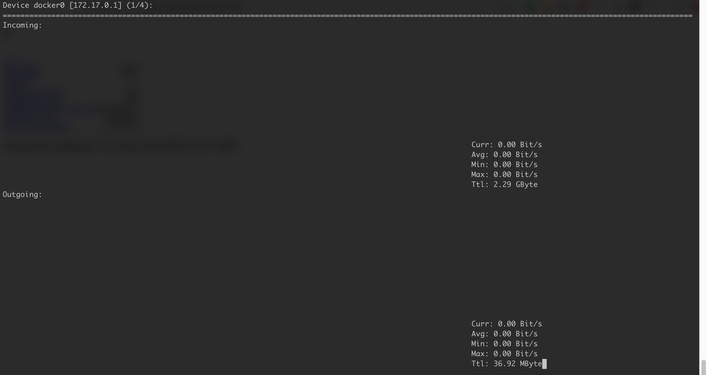

# Linux 网络流量查看

## 目录
{: .no_toc .text-delta }

1. TOC
{:toc}

## ifstat：Centos minimal 安装自带

```shell
#设置统计过去5s的平均值，此设置会在后台开一个 ifstat 进程，如果需要修改应该先 killall ifstat，再使用新参数执行。
ifstat ens192 -d 5

#通过 watch -n 1（秒）来刷新
watch -n 1 ifstat ens192 -p
```


## nload

```bash
yum install nload
```

可以按左右键选择接口。




# 参考资料

[https://www.zhihu.com/question/19862245](https://www.zhihu.com/question/19862245)