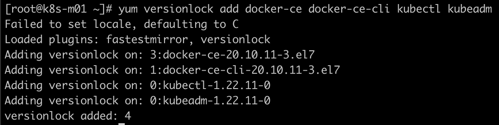

# centos 软件包管理

## 目录
{: .no_toc .text-delta }

1. TOC
{:toc}

## 包命名格式

默认centos下软件包命名格式为：

软件包名称-软件包版本号：

例如：kernel-lt-devel-4.4.217-1.el7.elrepo.x86_64

其中 kernel-lt-devel 为软件包名称，后面的则为版本号。

## 安装指定版本的软件包

```bash
yum install <package_name>-<version_info>
```

## 添加内核源

```shell
rpm -import https://www.elrepo.org/RPM-GPG-KEY-elrepo.org
rpm -Uvh http://www.elrepo.org/elrepo-release-7.0-2.el7.elrepo.noarch.rpm

#更新
yum makecache
yum update

#在上述源中搜索kernel
yum --disablerepo="*" --enablerepo="elrepo-kernel" list available

Loaded plugins: fastestmirror
Loading mirror speeds from cached hostfile
 * elrepo-kernel: mirrors.tuna.tsinghua.edu.cn
Available Packages
kernel-lt-doc.noarch                                                          4.4.219-1.el7.elrepo                                             elrepo-kernel
kernel-lt-headers.x86_64                                                      4.4.219-1.el7.elrepo                                             elrepo-kernel
kernel-lt-tools.x86_64                                                        4.4.219-1.el7.elrepo                                             elrepo-kernel
kernel-lt-tools-libs.x86_64                                                   4.4.219-1.el7.elrepo                                             elrepo-kernel
kernel-lt-tools-libs-devel.x86_64                                             4.4.219-1.el7.elrepo

#安装最新稳定版本内核
yum -y --enablerepo=elrepo-kernel install kernel-lt.x86_64 kernel-lt-devel.x86_64 
```

## 下载内核

指定 --downloadonly 参数来下载内核，如果系统已经安装内核，可以用 reinstall 替换 install。

```shell
yum reinstall --enablerepo=elrepo-kernel kernel-lt.x86_64 kernel-lt-devel.x86_64  --downloadonly --downloaddir=/root/
```


## 离线安装指定版本内核

```shell
[root@centos1 kernel]# ls
kernel-lt-4.4.217-1.el7.elrepo.x86_64.rpm  kernel-lt-devel-4.4.217-1.el7.elrepo.x86_64.rpm

#安装内核
yum install kernel-lt-4.4.217-1.el7.elrepo.x86_64.rpm  kernel-lt-devel-4.4.217-1.el7.elrepo.x86_64.rpm

   
[root@centos1 kernel]# rpm -qa | grep kernel
kernel-3.10.0-1062.18.1.el7.x86_64
kernel-lt-devel-4.4.219-1.el7.elrepo.x86_64
kernel-lt-4.4.219-1.el7.elrepo.x86_64
kernel-lt-devel-4.4.217-1.el7.elrepo.x86_64
kernel-tools-3.10.0-1062.18.1.el7.x86_64
kernel-3.10.0-1062.el7.x86_64
kernel-tools-libs-3.10.0-1062.18.1.el7.x86_64
kernel-lt-4.4.217-1.el7.elrepo.x86_64
```


## 查看已安装的内核

```shell
rpm -qa | grep kernel
kernel-3.10.0-1062.18.1.el7.x86_64
kernel-lt-4.4.219-1.el7.elrepo.x86_64
kernel-lt-devel-4.4.217-1.el7.elrepo.x86_64
kernel-lt-devel-4.4.219-1.el7.elrepo.x86_64
kernel-tools-3.10.0-1062.18.1.el7.x86_64
kernel-3.10.0-1062.el7.x86_64
kernel-tools-libs-3.10.0-1062.18.1.el7.x86_64
kernel-lt-4.4.217-1.el7.elrepo.x86_64
```


## 修改默认内核版本

### 查看内核启动顺序

默认内核按照安装顺序，新安装的排在最前

```bash
awk -F\' '$1=="menuentry " {print $2}' /etc/grub2.cfg

CentOS Linux (4.4.214-1.el7.elrepo.x86_64) 7 (Core)
CentOS Linux (3.10.0-693.el7.x86_64) 7 (Core)
CentOS Linux (0-rescue-7c86a0e687ff40e6b877d8a0edf3a4fc) 7 (Core)
```

> 内核排序为：0，1，2...

### 更改内核启动顺序

```bash
sed -i 's/GRUB_DEFAULT=saved/GRUB_DEFAULT=0/g' /etc/default/grub
grub2-mkconfig -o /boot/grub2/grub.cfg
reboot
```


## 查看一个软件的所有版本

```shell
# 通过下列命令查看kubeadm版本号：
yum list kubeadm --showduplicates|sort -r

# 安装指定版本：
yum install -y kubeadm-1.19.11-0 --disableexcludes=kubernetes
```


## 搜索某个软件包含在哪个软件包中

```shell
whereis kubelet
> kubelet: /usr/bin/kubelet
rpm -qf /usr/bin/kubelet
> kubelet-1.22.11-0.x86_64
```


## 固定软件版本

```shell
# 安装 versionlock
yum install yum-plugin-versionlock -y

# 将某些软件的版本固定
yum versionlock add docker-ce docker-ce-cli kubectl kubeadm

# 查看已锁定版本的软件
yum versionlock list
yum versionlock status

# 删除已锁定的版本
yum versionlock del kubectl kubeadm
yum versionlock del kube*
```



## 删除软件

```shell
yum remove <package_name>-<version_info>
```


## 清理缓存

-v 表示显示详情

```shell
yum clean all -v
yum -y clean all --enablerepo='*'
```

