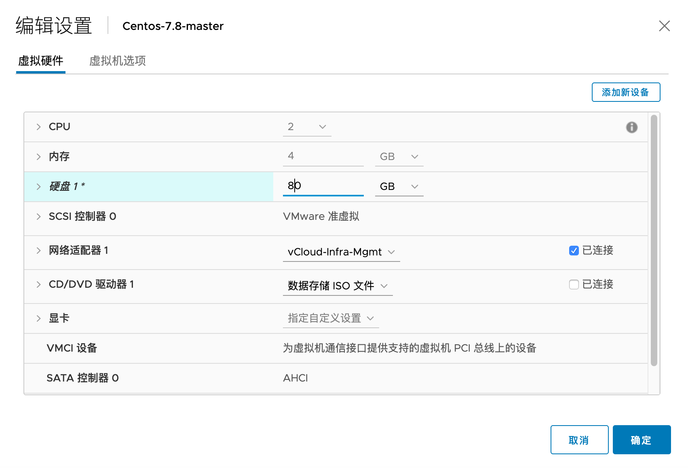
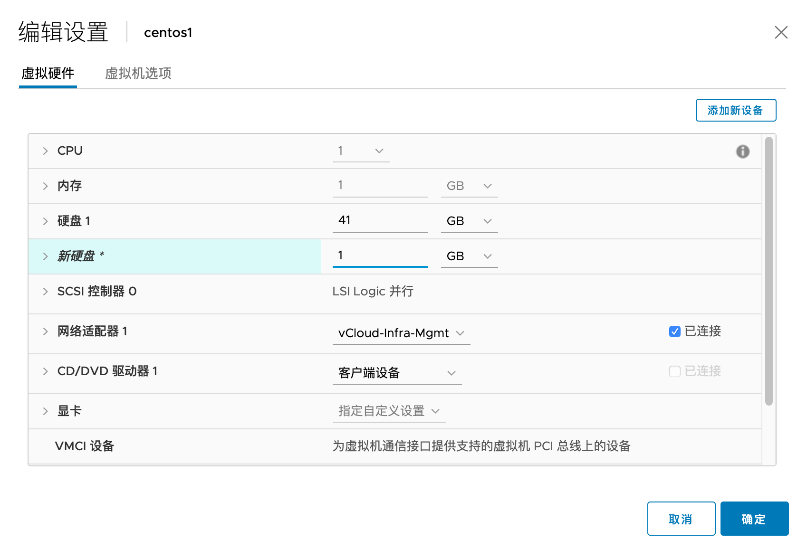

# centos 在线扩盘的几种方式

## 目录
{: .no_toc .text-delta }

1. TOC
{:toc}

## 扩展已有磁盘大小

这种方式一般适用于虚拟化环境，在虚拟化环境中可以直接编辑虚拟机已有 vmdk 的大小，之后可以将磁盘新增的空间加到已有分区或者 lvm。

### 重新扫描磁盘

```shell
#扩展前分区只有 32G 左右
[root@centos1 ~]# fdisk -l

Disk /dev/sda: 32.2 GB, 32212254720 bytes, 62914560 sectors
```

在虚拟化环境中扩大原有磁盘的大小：



运行下列命令查看有哪些 SCSI 设备，下图中 scsi0 为硬盘，scsi2 为 CD rom

```
cat /proc/scsi/scsi | egrep -i 'Host:'
Host: scsi0 Channel: 00 Id: 00 Lun: 00
Host: scsi2 Channel: 00 Id: 00 Lun: 00
```

可以运行下列命令进一步确认 scsi 号和设备的关联关系


```shell
#查看所有 scsi 
ls /sys/class/scsi_device/
0:0:0:0/ 2:0:0:0/

cat /sys/class/scsi_device/0\:0\:0\:0/device/model
Virtual disk

cat /sys/class/scsi_device/2\:0\:0\:0/device/model
VMware SATA CD00
```

运行下列命令扫描

```shell
echo "- - -" > /sys/class/scsi_host/host0/scan
echo 1 > /sys/class/scsi_device/0\:0\:0\:0/device/rescan
```

三个横杠("-  -  -") 表示扫描所有，实际三个参数分别为：Channel、 SCSI target ID、LUN。

```shell
echo "c t l" >  /sys/class/scsi_host/host0/scan
```

- `host0` 表示 HBA number
- `c` 表示 HBA 的 channel
- `t` 表示 SCSI target ID
- `l` 表示 LUN.


```shell
#扫描后，检测到 sda 已经为 75G
[root@centos1 ~]# fdisk -l

Disk /dev/sda: 75.2 GB, 75161927680 bytes, 146800640 sectors
```

### 扩展方式1：扩展已有分区大小

这种方式的步骤大致是：

- 删除root分区的分区表
- 新建并扩展root分区
- （如有LVM时）将新分区加到 LVM

#### 删除并扩展root分区

```shell
[root@centos1 ~]# fdisk /dev/sda
Welcome to fdisk (util-linux 2.23.2).

Changes will remain in memory only, until you decide to write them.
Be careful before using the write command.

#按p查看当前的配置，可以看到/dev/sda2的End sector为62914559.
Command (m for help): p

Disk /dev/sda: 75.2 GB, 75161927680 bytes, 146800640 sectors
Units = sectors of 1 * 512 = 512 bytes
Sector size (logical/physical): 512 bytes / 512 bytes
I/O size (minimum/optimal): 512 bytes / 512 bytes
Disk label type: dos
Disk identifier: 0x000a6d05

   Device Boot      Start         End      Blocks   Id  System
/dev/sda1   *        2048     2099199     1048576   83  Linux
/dev/sda2         2099200    62914559    30407680   8e  Linux LVM

#删除分区2，即删除root分区
Command (m for help): d
Partition number (1,2, default 2): 2
Partition 2 is deleted

#再次输入p查看到root分区已被删除
Command (m for help): p

Disk /dev/sda: 75.2 GB, 75161927680 bytes, 146800640 sectors
Units = sectors of 1 * 512 = 512 bytes
Sector size (logical/physical): 512 bytes / 512 bytes
I/O size (minimum/optimal): 512 bytes / 512 bytes
Disk label type: dos
Disk identifier: 0x000a6d05

   Device Boot      Start         End      Blocks   Id  System
/dev/sda1   *        2048     2099199     1048576   83  Linux

#新建root分区
Command (m for help): n
Partition type:
   p   primary (1 primary, 0 extended, 3 free)
   e   extended
#分区为主分区（p）
Select (default p): p
#分区号码，使用2（和之前一样）
Partition number (2-4, default 2): 2
First sector (2099200-146800639, default 2099200):
Using default value 2099200
Last sector, +sectors or +size{K,M,G} (2099200-146800639, default 146800639):
#这里默认会使用最大，保持默认即可。如果想增加一定的容量，可以使用“+10G”来表示
Using default value 146800639
Partition 2 of type Linux and of size 69 GiB is set
#查看设置正确
Command (m for help): p

Disk /dev/sda: 75.2 GB, 75161927680 bytes, 146800640 sectors
Units = sectors of 1 * 512 = 512 bytes
Sector size (logical/physical): 512 bytes / 512 bytes
I/O size (minimum/optimal): 512 bytes / 512 bytes
Disk label type: dos
Disk identifier: 0x000a6d05

   Device Boot      Start         End      Blocks   Id  System
/dev/sda1   *        2048     2099199     1048576   83  Linux
/dev/sda2         2099200   146800639    72350720   83  Linux
#输入w保存配置
Command (m for help): w
The partition table has been altered!

Calling ioctl() to re-read partition table.

WARNING: Re-reading the partition table failed with error 16: Device or resource busy.
The kernel still uses the old table. The new table will be used at
the next reboot or after you run partprobe(8) or kpartx(8)
Syncing disks.
```

以上配置仅更改了分区表，但kernel还不知道变化，输入下列命令更新。

```shell
 partprobe /dev/sda
```


#### 将新的分区加入 LVM

如果系统也配置了LVM，可以将扩展后的分区直接加到 LVM。

*注：如果有 LVM，则其实可以直接用扩展方式2来加到 LVM，此处只是为了验证能够将已扩容的分区加到 LVM。*

查看当前 LVM 的 PV：

```shell
#看到当前大小为29G
[root@centos1 ~]# vgdisplay
  --- Volume group ---
  VG Name               centos
  System ID
  Format                lvm2
  Metadata Areas        1
  Metadata Sequence No  3
  VG Access             read/write
  VG Status             resizable
  MAX LV                0
  Cur LV                2
  Open LV               2
  Max PV                0
  Cur PV                1
  Act PV                1
  VG Size               <29.00 GiB
  PE Size               4.00 MiB
  Total PE              7423
  Alloc PE / Size       7423 / <29.00 GiB
  Free  PE / Size       0 / 0
  VG UUID               BApJNK-AIO9-yDpp-t2Vw-wipP-3tOE-JNl19W

```

通过 pvresize 扩大 pv

```shell
[root@centos1 ~]# pvresize /dev/sda2
  Physical volume "/dev/sda2" changed
  1 physical volume(s) resized or updated / 0 physical volume(s) not resized
  
[root@centos1 ~]# pvdisplay
  --- Physical volume ---
  PV Name               /dev/sda2
  VG Name               centos
  PV Size               <69.00 GiB / not usable 2.00 MiB
  Allocatable           yes
  PE Size               4.00 MiB
  Total PE              17663
  Free PE               10240
  Allocated PE          7423
  PV UUID               hZ9peQ-vZ1n-MB4s-yX8Q-7wJU-Ige4-vREydQ

```

查看当前 lv 大小

```shell
[root@centos1 ~]# lvdisplay
  --- Logical volume ---
  LV Path                /dev/centos/root
  LV Name                root
  VG Name                centos
  LV UUID                8SF0dP-erOz-kjb2-Nb8P-YhvB-4CWk-IcsYdd
  LV Write Access        read/write
  LV Creation host, time centos1, 2020-04-15 02:58:58 -0400
  LV Status              available
  # open                 1
  LV Size                <26.00 GiB
  Current LE             6655
  Segments               1
  Allocation             inherit
  Read ahead sectors     auto
  - currently set to     8192
  Block device           253:0
```

通过 lvextend 扩展 lv大小，命令格式为：`lvextend LV-name PV-name`

```shell
[root@centos1 ~]# lvextend /dev/centos/root /dev/sda2
  Size of logical volume centos/root changed from <26.00 GiB (6655 extents) to <66.00 GiB (16895 extents).
  Logical volume centos/root successfully resized.
  
#也可以通过lvresize调整lv大小
lvresize /dev/centos/root /dev/sda2
```

运行 `xfs_growfs /dev/mapper/centos-root`扩展 xfs 分区

```shell
[root@centos1 ~]# xfs_growfs /dev/mapper/centos-root
meta-data=/dev/mapper/centos-root isize=512    agcount=4, agsize=1703680 blks
         =                       sectsz=512   attr=2, projid32bit=1
         =                       crc=1        finobt=0 spinodes=0
data     =                       bsize=4096   blocks=6814720, imaxpct=25
         =                       sunit=0      swidth=0 blks
naming   =version 2              bsize=4096   ascii-ci=0 ftype=1
log      =internal               bsize=4096   blocks=3327, version=2
         =                       sectsz=512   sunit=0 blks, lazy-count=1
realtime =none                   extsz=4096   blocks=0, rtextents=0
data blocks changed from 6814720 to 17300480

#df -h 看到 root 分区已成功扩展
[root@centos1 ~]# df -h
Filesystem               Size  Used Avail Use% Mounted on
/dev/mapper/centos-root   66G   14G   53G  20% /

```


### 扩展方式2：新建分区并加入lvm

步骤：

- fdisk 新建分区
- 创建新的 pv
- 通过 vgextend 将 PV 添加到 LV
- 通过 lvextend /dev/centos/root /dev/sdb1 扩展 LV
- 通过 xfs_growfs 扩展分区


通过 fdisk 来新建分区，步骤略。

使用下列命令让 kernel 获取新的分区信息。

```shell
partprobe /dev/sda
```

使用 pvcreate 创建新的 pv。

```shell
[root@localhost ~]# pvcreate /dev/sda3

[root@localhost ~]# pvdisplay
  --- Physical volume ---
  PV Name               /dev/sda2
  VG Name               centos
  PV Size               39.51 GiB / not usable 3.00 MiB
  Allocatable           yes (but full)
  PE Size               4.00 MiB
  Total PE              10114
  Free PE               0
  Allocated PE          10114
  PV UUID               xJdFEK-6xzI-sZtX-q2YU-hqf4-BrvO-SOPWEh

  "/dev/sda3" is a new physical volume of "1.00 GiB"
  --- NEW Physical volume ---
  PV Name               /dev/sda3
  VG Name
  PV Size               1.00 GiB
  Allocatable           NO
  PE Size               0
  Total PE              0
  Free PE               0
  Allocated PE          0
  PV UUID               ZKlIdm-xKKr-mWTA-alN3-xgck-EPim-nKMrbU
```

通过 `vgextend` 将 /dev/sda3 pv 添加到 vg centos，命令格式为：`vgextend VG-name PV-name`，其中 VG-name 可以通过 `vgdisplay` 查看。

```shell
[root@localhost ~]# vgextend centos /dev/sda3
  Volume group "centos" successfully extended
```

通过 lvresize 将 pv 加到 lv。命令格式为`lvextend LV-name PV-name`

```shell
[root@localhost ~]# lvresize /dev/centos/root /dev/sda3
  Extending logical volume root to 38.47 GiB
  Logical volume root successfully resized
```

运行 `xfs_growfs /dev/mapper/centos-root`扩展 xfs 分区

```bash
[root@centos1 ~]# xfs_growfs /dev/mapper/centos-root
```


## 新增磁盘并将其添加到 LVM

这种方式相当于给 Linux 添加了一块新的物理硬盘，物理环境或者虚拟化环境均支持。

需要使用 LVM 才能扩展已有的挂载点。


1.我们测试为虚拟机直接新增一块硬盘。



### 扫描磁盘

```shell
[root@localhost ~]# echo "- - -" > /sys/class/scsi_host/host30/scan
#扫描到新的磁盘 /dev/sdb
[root@localhost ~]# fdisk -l
Disk /dev/sdb: 1073 MB, 1073741824 bytes, 2097152 sectors
Units = sectors of 1 * 512 = 512 bytes
Sector size (logical/physical): 512 bytes / 512 bytes
I/O size (minimum/optimal): 512 bytes / 512 bytes

```

### 创建新分区

使用 fdisk 创建新分区 /dev/sdb1，命令描述见上文其他案例

```shell
[root@localhost ~]# fdisk /dev/sdb
Welcome to fdisk (util-linux 2.23.2).

Changes will remain in memory only, until you decide to write them.
Be careful before using the write command.

Device does not contain a recognized partition table
Building a new DOS disklabel with disk identifier 0xe4495073.

Command (m for help): n
Partition type:
   p   primary (0 primary, 0 extended, 4 free)
   e   extended
Select (default p): p
Partition number (1-4, default 1):
First sector (2048-2097151, default 2048):
Using default value 2048
Last sector, +sectors or +size{K,M,G} (2048-2097151, default 2097151):
Using default value 2097151
Partition 1 of type Linux and of size 1023 MiB is set

Command (m for help): w
The partition table has been altered!

Calling ioctl() to re-read partition table.
Syncing disks.
```

### 扫描新的分区表

```shell
[root@localhost ~]# partprobe /dev/sdb
```

### 将分区添加到 lv

```shell
[root@localhost ~]# pvcreate /dev/sdb1
  Physical volume "/dev/sdb1" successfully created
[root@localhost ~]# vgextend centos /dev/sdb1
  Volume group "centos" successfully extended
[root@localhost ~]# lvresize /dev/centos/root /dev/sdb1
  Extending logical volume root to 39.47 GiB
  Logical volume root successfully resized
```

### 扩展文件系统

运行 `xfs_growfs /dev/mapper/centos-root`扩展 xfs 分区

```shell

[root@localhost ~]# xfs_growfs /dev/mapper/centos-root
meta-data=/dev/mapper/centos-root isize=256    agcount=5, agsize=2456064 blks
         =                       sectsz=512   attr=2, projid32bit=1
         =                       crc=0
data     =                       bsize=4096   blocks=10346496, imaxpct=25
         =                       sunit=0      swidth=0 blks
naming   =version 2              bsize=4096   ascii-ci=0 ftype=0
log      =internal               bsize=4096   blocks=4797, version=2
         =                       sectsz=512   sunit=0 blks, lazy-count=1
realtime =none                   extsz=4096   blocks=0, rtextents=0
[root@localhost ~]# df -h
Filesystem               Size  Used Avail Use% Mounted on
/dev/mapper/centos-root   40G  1.4G   39G   4% /
```


## ext4 扩展

如果 Linux 直接将一个磁盘挂在了某路径，没有对磁盘进行分区，例如 :

```shell
[root@Docker-host ~]# cat /etc/fstab

#
# /etc/fstab
# Created by anaconda on Tue Jul 21 11:22:37 2020
#
# Accessible filesystems, by reference, are maintained under '/dev/disk'
# See man pages fstab(5), findfs(8), mount(8) and/or blkid(8) for more info
#
/dev/mapper/centos-root /                       xfs     defaults        0 0
/dev/sdd /nextcloud                      ext4     defaults        0 0
```

此时只需要扩容磁盘，然后运行下列命令即可：

```shell
resize2fs /dev/sdd
```

# 参考资料

[https://linoxide.com/linux-how-to/add-new-disk-centos-7-without-rebooting/](https://linoxide.com/linux-how-to/add-new-disk-centos-7-without-rebooting/)

[https://www.golinuxcloud.com/extend-resize-primary-partition-non-lvm-linux/](https://www.golinuxcloud.com/extend-resize-primary-partition-non-lvm-linux/)