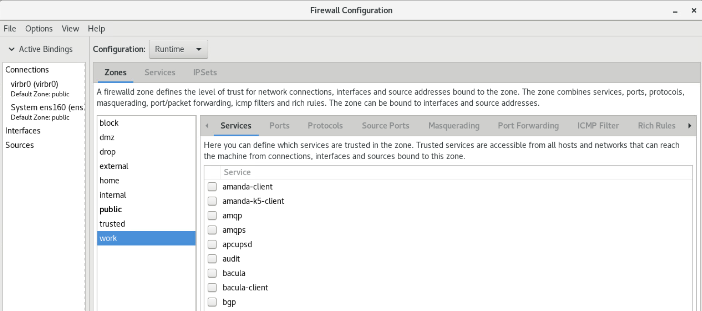

# centos 图形化的 iptables 工具

## 目录
{: .no_toc .text-delta }

1. TOC
{:toc}

## CentOS 安装图形界面

如果 CentOS 之前安装的是 minimum，则需要提前安装 GUI 才能使用下列工具：

```shell
yum groupinstall "GNOME Desktop" "Graphical Administration Tools" -y
```

安装完后，通过`startx`命令来启动图形界面。

## firewall-config

```shell
yum install firewall-config
# 启动 firewalld
systemctl start firewalld
```



## cockpit

cockpit 是个 Linux web 管理工具，集成了简单的 firewalld 配置工具，使用逻辑和上面的 firewall-config 一致。

```shell
yum install -y cockpit
systemctl start cockpit
systemctl enable cockpit
```

默认防火墙只放行 DHCPv6 和 SSH，为了让外部能够访问 cockpit，需要放行 9090 端口：


默认 cockpit 使用 9090 端口，可以修改下列文件，改为其他端口：

```
vi /usr/lib/systemd/system/cockpit.socket
```

## 和 Docker 一起使用的注意事项

启动 firewalld 后会删除 Docker 相关的 iptables 规则，此时需要重启 Docker 进程。

默认 Docker 会设置在 firewalld 之后启动，这样可以保证 Docker 的 chain 不受 firewalld 启动影响。经过测试，还是要让 docker 延迟启动，这样 -d 的容器才能正常运行。具体配置方法如下：

```shell
 # 修改 docker.service，在 execstart 前加上 ExecStartPre=/usr/bin/sleep 30
 vi /usr/lib/systemd/system/docker.service
 ExecStartPre=/usr/bin/sleep 30
 ExecStart=/usr/bin/dockerd -H fd:// --containerd=/run/containerd/containerd.sock
```


## 使用 ufw 管理 iptables

ufw 全称 uncomplicated Firewall，在 Ubuntu 系的系统重默认安装，也提供相应的图形化工具 gufw，是一个简化版的 iptables 配置工具，相比 iptables 管理非常简单。

在 CentOS 中可以在 epel 源中找到，但是此源中并不提供 gufw，需要自行编译安装。

```shell
yum install -y epel-release
yum install -y gufw
```

