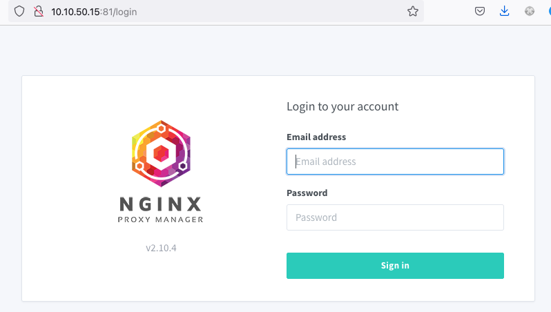
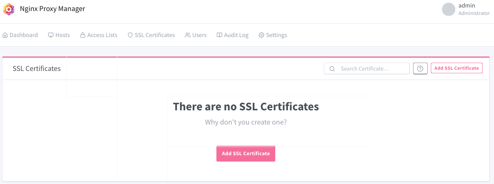
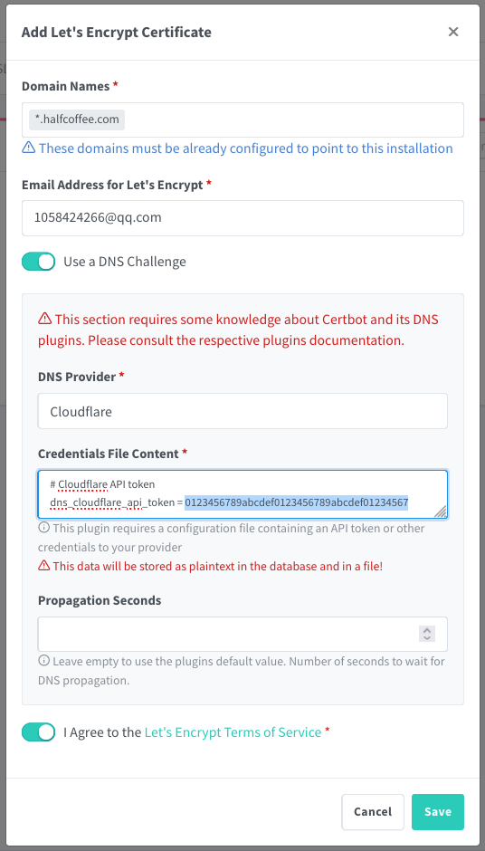
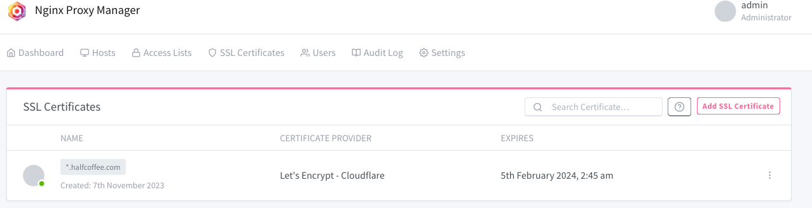
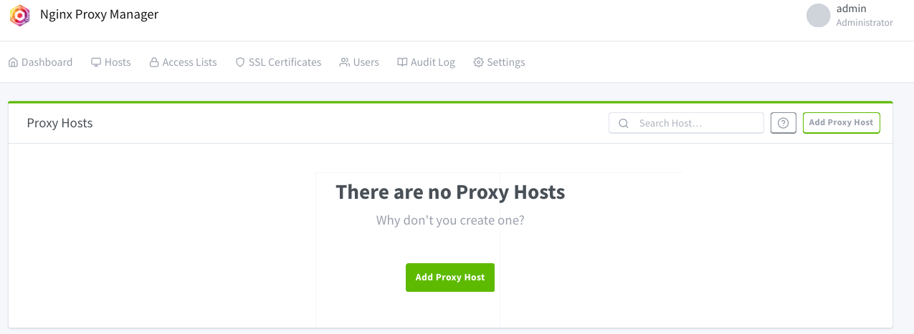
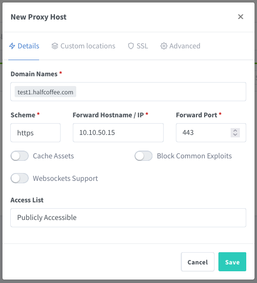
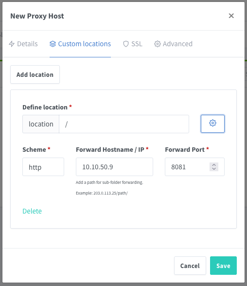
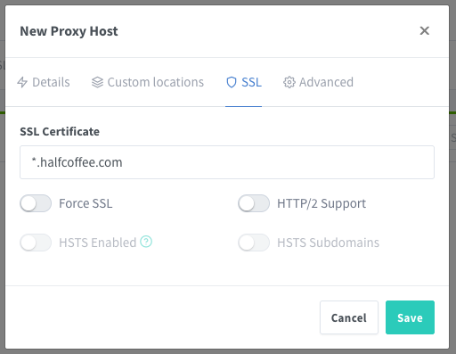
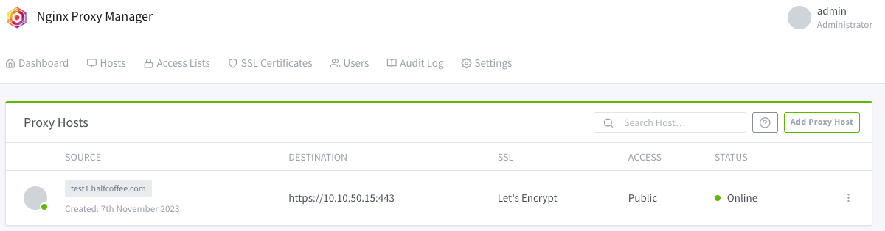
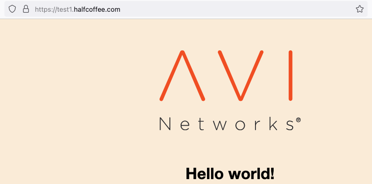

# centos 安装 NPM

## 目录
{: .no_toc .text-delta }

1. TOC
{:toc}

## 概述

NPM 全称 Nginx Proxy Manager，是一个易用的图形化 Nginx 反向代理管理工具。NPM 支持通过 let's encrypt 自动获取证书，可以减少证书管理工作。下面尝试部署一个 npm，并做一个简单的负载均衡。


## 安装

参考文档：[https://nginxproxymanager.com/guide/#quick-setup](https://nginxproxymanager.com/guide/#quick-setup)


安装 Docker：

```shell
yum install -y yum-utils
yum-config-manager --add-repo https://download.docker.com/linux/centos/docker-ce.repo
yum update
yum install -y docker-ce docker-compose-plugin
systemctl enable docker && systemctl start docker
```

部署 npm：

```shell
cd /root/npm
cat >docker-compose.yml <<EOF
version: '3.8'
services:
  app:
    image: 'jc21/nginx-proxy-manager:latest'
    restart: unless-stopped
# 如果要使用 stream 功能（L4 转发），建议直接使用 host 网络模式，如没这个需求可以只做端口映射
    privileged: true
    network_mode: host
#    ports:
#      - '80:80'
#      - '81:81'
#      - '443:443'
    volumes:
      - /root/npm/data:/data
      - /root/npm/certs:/etc/letsencrypt
EOF

docker compose up -d
```

验证安装（使用 81 端口登录管理）：



默认登录信息如下：

```shell
Email:    admin@example.com
Password: changeme
```

## 配置证书

在下列位置添加证书：



证书写通配符证书，使用 DNS Challenge，服务商使用 Cloudflare（我的 DNS 解析托管给了 Cloudflare）：



之后系统会自动申请号证书



## 配置服务











访问测试：



相应的 NPM 日志：

```shell
# cat /root/npm/data/logs/proxy-host-1_access.log
[07/Nov/2023:03:56:40 +0000] - 200 200 - GET https test1.halfcoffee.com "/img/logo.svg" [Client 10.10.52.200] [Length 3752] [Gzip -] [Sent-to 10.10.50.15] "Mozilla/5.0 (Macintosh; Intel Mac OS X 10.15; rv:109.0) Gecko/20100101 Firefox/119.0" "https://test1.halfcoffee.com/"
[07/Nov/2023:03:56:40 +0000] - 200 200 - GET https test1.halfcoffee.com "/img/favicon.ico" [Client 10.10.52.200] [Length 4286] [Gzip -] [Sent-to 10.10.50.15] "Mozilla/5.0 (Macintosh; Intel Mac OS X 10.15; rv:109.0) Gecko/20100101 Firefox/119.0" "https://test1.halfcoffee.com/"
```

