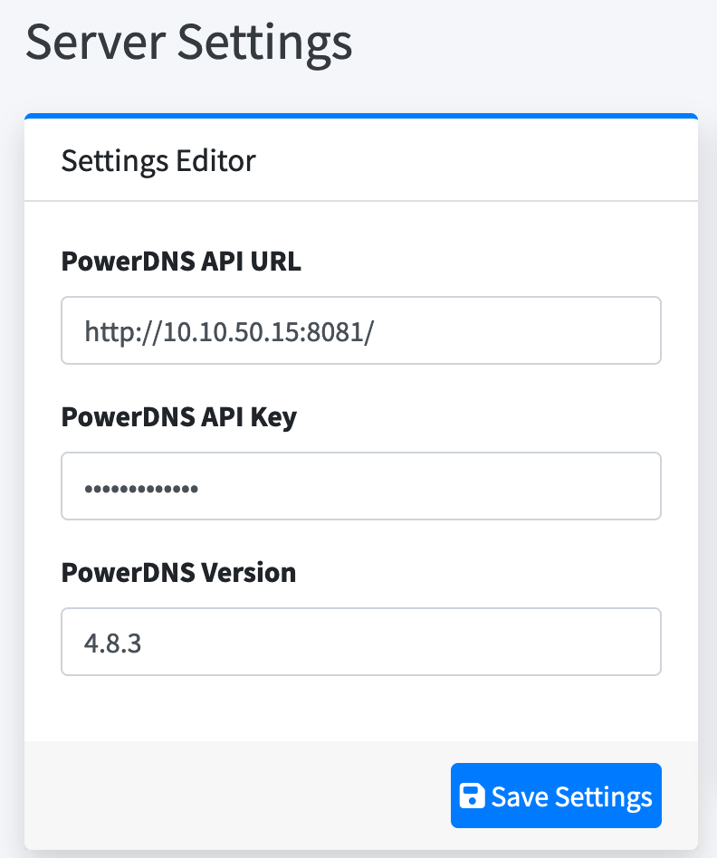
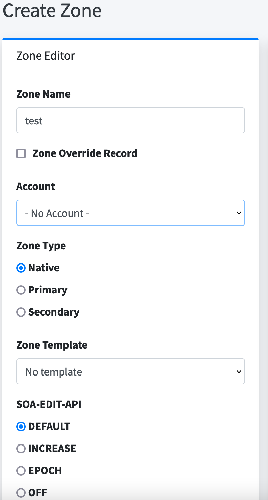
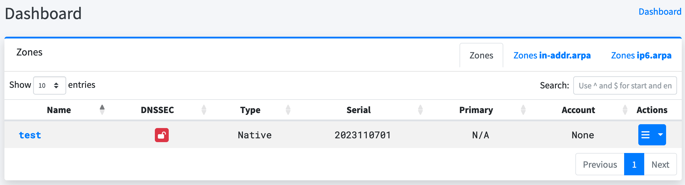
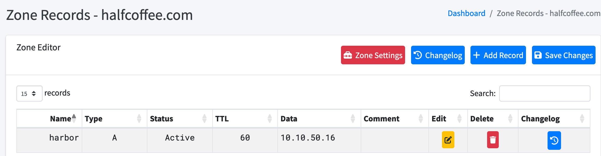

# centos 容器化安装 PowerDNS

## 目录

{: .no_toc .text-delta }

1. TOC

{:toc}

## 系统基本配置

为了避免防火墙影响，建议先进行下列设置：

```shell
# 禁用防火墙
systemctl stop firewalld
systemctl disable firewalld
setenforce 0
sed -i 's/^SELINUX=enforcing$/SELINUX=permissive/' /etc/selinux/config
```

## PowerDNS Authoritative Server 及 PowerDNSAdmin 安装

完整安装脚本如下：

```shell
mkdir -p /root/pdns/db
mkdir -p /root/pdns/run
mkdir -p /root/pdns/admindb
chmod o+w /root/pdns/run
chmod o+w /root/pdns/db
chmod o+w /root/pdns/admindb

cd /root/pdns
cat >pdns.conf <<EOF
local-address=0.0.0.0
local-port=53

# 启用 api 服务
webserver-port=8081
webserver-address=0.0.0.0
webserver-allow-from=10.0.0.0/8,172.16.0.0/12,192.168.0.0/16
api=yes
api-key=ae8y89346taeg
webserver-password=ae8y89346taeg
log-dns-queries=yes
log-dns-details=yes
# 默认为 3，需要调整成 6 才能看到请求日志
loglevel=6


launch=gsqlite3
gsqlite3-database=/var/lib/powerdns/pdns.sqlite3

dnsupdate=yes
allow-dnsupdate-from=127.0.0.0/8,10.0.0.0/8,172.16.0.0/12,192.168.0.0/16
enable-lua-records=yes
default-soa-content=ns1.@ hostmaster.@ 0 10800 3600 604800 3600
EOF

wget https://raw.githubusercontent.com/PowerDNS/pdns/rel/auth-4.8.x/modules/gsqlite3backend/schema.sqlite3.sql
sqlite3 db/pdns.sqlite3 < schema.sqlite3.sql
chmod o+w /root/pdns/db/pdns.sqlite3

cat >docker-compose.yml <<EOF
version: "3"
services:
  pdns:
    image: powerdns/pdns-auth-48
    ports:
      - 8081:8081
      - mode: host
        protocol: udp
        published: 53
        target: 53
      - mode: host
        protocol: tcp
        published: 53
        target: 53
    user: "1000:1000"
    volumes:
      - /root/pdns/pdns.conf:/etc/powerdns/pdns.conf
      - /root/pdns/run:/var/run/pdns
      - /root/pdns/db:/var/lib/powerdns
  pdnsadmin:
    image: powerdnsadmin/pda-legacy:latest
    ports:
      - 9191:80
    depends_on:
      - pdns
    environment:
      - SECRET_KEY='a-very-secret-key'
    volumes:
      - /root/pdns/admindb:/data
EOF

docker compose up -d
```

## PowerDNSAdmin 对接

上面的 docker compose 会同时安装好 powerdnsadmin，默认使用 9191 端口登录。首次登录需要先注册账号。


接着在 setting 中和上面部署的 powerdns 做对接（使用 api key）：



创建 zone 进行测试：



创建完成后在 Dashborad 中可以看到



## 设置区域和 A 记录



DNS 解析测试：

```
zmatt@zmatt9ML85 ~ % nslookup
> server 10.10.50.15
Default server: 10.10.50.15
Address: 10.10.50.15#53
> harbor.halfcoffee.com
Server:		10.10.50.15
Address:	10.10.50.15#53

Name:	harbor.halfcoffee.com
Address: 10.10.50.16
```


## 增加 pdns-recursor

在测试时发现 pdns 不支持 forward，查询发现需要再部署 pdns-recursor，于是做了下列变动：

```shell
cat >/root/pdns/pdns-recursor.conf <<EOF
allow-from=10.0.0.0/8,172.16.0.0/12,192.168.0.0/16,127.0.0.1/24
local-address=0.0.0.0
local-port=53
# 访问 pdns 时使用 host ip，pdns 要做端口映射
forward-zones-recurse=halfcoffee.com=10.10.50.15:54,corp.local=10.10.50.6:53,.=223.5.5.5;223.6.6.6
dnssec=off
# 排错日志开关
trace=on
EOF

cat >/root/pdns/pdns.conf <<EOF
local-address=0.0.0.0
# 和 recursor 同时部署时，DNS 需要使用 54 端口，避免冲突
local-port=54
webserver-port=8081
webserver-address=0.0.0.0
webserver-allow-from=10.0.0.0/8,172.16.0.0/12,192.168.0.0/16
api=yes
api-key=ae8y89346taeg
webserver-password=ae8y89346taeg
log-dns-queries=yes
log-dns-details=yes
loglevel=6

launch=gsqlite3
gsqlite3-database=/var/lib/powerdns/pdns.sqlite3

dnsupdate=yes
allow-dnsupdate-from=127.0.0.0/8,10.0.0.0/8,172.16.0.0/12,192.168.0.0/16
#forward-dnsupdate=yes
enable-lua-records=yes
default-soa-content=ns1.@ hostmaster.@ 0 10800 3600 604800 3600
EOF

cat >docker-compose.yml <<EOF
version: "3"
services:
  pdns-recursor:
    image: powerdns/pdns-recursor-48
    restart: unless-stopped
# 使用特权模式运行 recursor，默认暴露 54 端口（在上面的配置文件中定义了）
    privileged: true
    network_mode: host
    user: "0:0"
    volumes:
      - /root/pdns/pdns-recursor.conf:/etc/powerdns/recursor.conf
      - /root/pdns/run-recursor:/var/run/pdns-recursor
  pdns:
    image: powerdns/pdns-auth-48
    restart: unless-stopped
# pdns 使用 54 端口，同时将 tcp 和 udp 映射出去
    ports:
      - 8081:8081
      - 54:54/udp
      - 54:54/tcp
    user: "1000:1000"
    volumes:
      - /root/pdns/pdns.conf:/etc/powerdns/pdns.conf
      - /root/pdns/run:/var/run/pdns
      - /root/pdns/db:/var/lib/powerdns
  pdnsadmin:
    image: powerdnsadmin/pda-legacy:latest
    restart: unless-stopped
    ports:
      - 9191:80
    depends_on:
      - pdns
    environment:
      - SECRET_KEY='a-very-secret-key'
    volumes:
      - /root/pdns/admindb:/data
 EOF 
```


### 最终测试

分别使用 nslookup 测试内网两个域名（对应两个内网 DNS Server） 和外网域名的解析，均正常：

```shell
zmatt@zmatt9ML85 ~ % nslookup
> server 10.10.50.15
Default server: 10.10.50.15
Address: 10.10.50.15#53
> harbor.halfcoffee.com
Server:		10.10.50.15
Address:	10.10.50.15#53

Non-authoritative answer:
Name:	harbor.halfcoffee.com
Address: 10.10.50.16
> nsx.corp.local
Server:		10.10.50.15
Address:	10.10.50.15#53

Non-authoritative answer:
Name:	nsx.corp.local
Address: 10.10.50.111
> www.baidu.com
Server:		10.10.50.15
Address:	10.10.50.15#53

Non-authoritative answer:
www.baidu.com	canonical name = www.a.shifen.com.
Name:	www.a.shifen.com
Address: 180.101.50.188
Name:	www.a.shifen.com
Address: 180.101.50.242
>
```


## 碰到的问题记录

- recursor 的 forward-zones 不生效：如果目标 DNS 服务器是自建的，建议关闭 dnssec，详见上面的配置文件
- recursor 即使调高日志级别也看不到转发日志：需要开启 trace 功能才能看到，详见上面的配置文件
- pdns 不能看到客户的请求日志：需要同时开启 log-dns-queries 和调整 log level 为 6
- 使用 docker compose 部署 pdns-as 和 recursor 时，两者通信有问题，在日志中发现 recursor 会使用 docker 172.25.x.x 来访问 pdns-as，而 pdns-as 容器自身的 ip 不固定，得用主机端口映射来访问，这会造成两个容器不通，最终的解法是 recursor 直接使用 host network，pdns-as 映射主机网络，两个容器直接通过 host network 通信

## 配置参考文件

 在 pdns 容器中会有下列内置的 `pdns.conf` 配置文件，可以当做参考查看可配置项。

`/etc/powerdns/pdns.conf-dist`

为方便查看也上传到了本站：

 [pdns.conf-dist.txt](../../../output/pdns.conf-dist.txt) 

recursor 参数说明如下：

 [recursor.conf-dist.txt](../../../output/recursor.conf-dist.txt) 

## 参考文档

[https://dmachard.github.io/posts/0010-powerdns-dnsdist-docker/](https://dmachard.github.io/posts/0010-powerdns-dnsdist-docker/)
