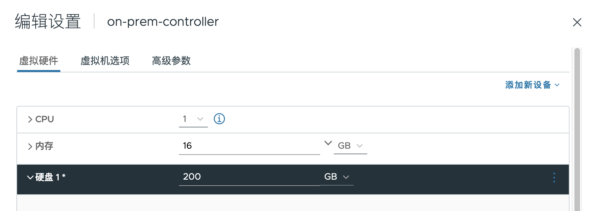

# Ubuntu 在线扩盘

## 目录
{: .no_toc .text-delta }

1. TOC
{:toc}

## 扩展已有磁盘大小

这种方式一般适用于虚拟化环境，在虚拟化环境中可以直接编辑虚拟机已有 vmdk 的大小，之后可以将磁盘新增的空间加到已有分区或者 lvm。

扩展前磁盘大小 50G，sda3 只有 48.2G

```shell
root@ubuntu:~# fdisk -l

Disk /dev/sda: 50 GiB, 53687091200 bytes, 104857600 sectors
Disk model: Virtual disk
Units: sectors of 1 * 512 = 512 bytes
Sector size (logical/physical): 512 bytes / 512 bytes
I/O size (minimum/optimal): 512 bytes / 512 bytes
Disklabel type: gpt
Disk identifier: 7F9F6180-639F-4735-AC8A-0ACB2A1E6D44

Device       Start       End   Sectors  Size Type
/dev/sda1     2048      4095      2048    1M BIOS boot
/dev/sda2     4096   3719167   3715072  1.8G Linux filesystem
/dev/sda3  3719168 104857566 101138399 48.2G Linux filesystem
```

**进行下列操作前，请先为虚拟机做快照！！**

在虚拟化环境中扩大原有磁盘的大小，增加到 200 G：



运行下列命令查看有哪些 SCSI 设备，下图中 scsi32 为硬盘，scsi2 为 CD rom

```shell
cat /proc/scsi/scsi | egrep -i 'Host:'
Host: scsi2 Channel: 00 Id: 00 Lun: 00
Host: scsi32 Channel: 00 Id: 00 Lun: 00
```

可以运行下列命令进一步确认 scsi 号和设备的关联关系


```shell
#查看所有 scsi 
ls /sys/class/scsi_device/
2:0:0:0  32:0:0:0

cat /sys/class/scsi_device/32\:0\:0\:0/device/model
Virtual disk

cat /sys/class/scsi_device/2\:0\:0\:0/device/model
VMware SATA CD00
```

运行下列命令扫描（修改硬盘大小后使用此命令扫描）

```shell
echo 1 > /sys/class/scsi_device/32\:0\:0\:0/device/rescan
```

运行下列命令扫描（给 VM 添加新硬盘后使用此命令扫描）

```shell
echo "- - -" > /sys/class/scsi_host/host32/scan
```


```shell
#扫描后，检测到 sda 已经为 200G
[root@centos1 ~]# fdisk -l

GPT PMBR size mismatch (104857599 != 419430399) will be corrected by write.
The backup GPT table is not on the end of the device. This problem will be corrected by write.

Disk /dev/sda: 200 GiB, 214748364800 bytes, 419430400 sectors
Disk model: Virtual disk
Units: sectors of 1 * 512 = 512 bytes
Sector size (logical/physical): 512 bytes / 512 bytes
I/O size (minimum/optimal): 512 bytes / 512 bytes
Disklabel type: gpt
Disk identifier: 7F9F6180-639F-4735-AC8A-0ACB2A1E6D44

Device       Start       End   Sectors  Size Type
/dev/sda1     2048      4095      2048    1M BIOS boot
/dev/sda2     4096   3719167   3715072  1.8G Linux filesystem
/dev/sda3  3719168 104857566 101138399 48.2G Linux filesystem
```

### 扩展方式1：扩展已有分区大小

这种方式的步骤大致是：

- 删除root分区的分区表
- 新建并扩展root分区
- （如有LVM时）将新分区加到 LVM

#### 删除并扩展root分区

```shell
root@ubuntu:~# fdisk /dev/sda

Welcome to fdisk (util-linux 2.34).
Changes will remain in memory only, until you decide to write them.
Be careful before using the write command.

GPT PMBR size mismatch (104857599 != 419430399) will be corrected by write.
The backup GPT table is not on the end of the device. This problem will be corrected by write.
#按 p 查看当前的配置，可以看到/dev/sda3的End sector为419430400
Command (m for help): p

Disk /dev/sda: 200 GiB, 214748364800 bytes, 419430400 sectors
Disk model: Virtual disk
Units: sectors of 1 * 512 = 512 bytes
Sector size (logical/physical): 512 bytes / 512 bytes
I/O size (minimum/optimal): 512 bytes / 512 bytes
Disklabel type: gpt
Disk identifier: 7F9F6180-639F-4735-AC8A-0ACB2A1E6D44

Device       Start       End   Sectors  Size Type
/dev/sda1     2048      4095      2048    1M BIOS boot
/dev/sda2     4096   3719167   3715072  1.8G Linux filesystem
/dev/sda3  3719168 104857566 101138399 48.2G Linux filesystem

#删除分区 3，即删除root分区
Command (m for help): d
Partition number (1-3, default 3):

Partition 3 has been deleted.

#新建root分区
Command (m for help): n
Partition number (3-128, default 3):
First sector (3719168-419430366, default 3719168):
#这里默认会使用最大，保持默认即可。如果想增加一定的容量，可以使用“+10G”来表示
Last sector, +/-sectors or +/-size{K,M,G,T,P} (3719168-419430366, default 419430366):
#分区号码，使用3（和之前一样）
Created a new partition 3 of type 'Linux filesystem' and of size 198.2 GiB.
Partition #3 contains a LVM2_member signature.

# 保留 lvm 的 signature，非常重要！
Do you want to remove the signature? [Y]es/[N]o: n
#查看设置正确
Command (m for help): p

Disk /dev/sda: 200 GiB, 214748364800 bytes, 419430400 sectors
Disk model: Virtual disk
Units: sectors of 1 * 512 = 512 bytes
Sector size (logical/physical): 512 bytes / 512 bytes
I/O size (minimum/optimal): 512 bytes / 512 bytes
Disklabel type: gpt
Disk identifier: 7F9F6180-639F-4735-AC8A-0ACB2A1E6D44

Device       Start       End   Sectors   Size Type
/dev/sda1     2048      4095      2048     1M BIOS boot
/dev/sda2     4096   3719167   3715072   1.8G Linux filesystem
/dev/sda3  3719168 419430366 415711199 198.2G Linux filesystem
#输入w保存配置
Command (m for help): w
The partition table has been altered.
Syncing disks.
```

以上配置仅更改了分区表，但kernel还不知道变化，输入下列命令更新。

```shell
 partprobe /dev/sda
```


#### 将新的分区加入 LVM

如果系统也配置了LVM，可以将扩展后的分区直接加到 LVM。

查看当前 LVM 的 PV：

```shell
#看到当前大小为48G
root@ubuntu:~# vgdisplay
  --- Volume group ---
  VG Name               ubuntu-vg
  System ID
  Format                lvm2
  Metadata Areas        1
  Metadata Sequence No  4
  VG Access             read/write
  VG Status             resizable
  MAX LV                0
  Cur LV                1
  Open LV               1
  Max PV                0
  Cur PV                1
  Act PV                1
  VG Size               48.22 GiB
  PE Size               4.00 MiB
  Total PE              12345
  Alloc PE / Size       12345 / 48.22 GiB
  Free  PE / Size       0 / 0
  VG UUID               26Hlwh-RWrE-KTiP-juWl-J3FF-f7HV-llefz1
```

通过 pvresize 扩大 pv

```shell
root@ubuntu:~# pvresize /dev/sda3
  Physical volume "/dev/sda3" changed
  1 physical volume(s) resized or updated / 0 physical volume(s) not resized
  
root@ubuntu:~#  pvdisplay
  --- Physical volume ---
  PV Name               /dev/sda3
  VG Name               ubuntu-vg
  PV Size               <198.23 GiB / not usable 2.98 MiB
  Allocatable           yes
  PE Size               4.00 MiB
  Total PE              50745
  Free PE               38400
  Allocated PE          12345
  PV UUID               kmPW5f-JsMr-0plS-mfhd-MXZB-SG7w-51fzqj
```

查看当前 lv 大小

```shell
root@ubuntu:~# lvdisplay
  --- Logical volume ---
  LV Path                /dev/ubuntu-vg/ubuntu-lv
  LV Name                ubuntu-lv
  VG Name                ubuntu-vg
  LV UUID                rQwVJr-fcBV-DFdQ-eR2S-Pvsw-2h1l-daLQEC
  LV Write Access        read/write
  LV Creation host, time ubuntu-server, 2023-02-21 10:09:26 +0000
  LV Status              available
  # open                 1
  LV Size                48.22 GiB
  Current LE             12345
  Segments               1
  Allocation             inherit
  Read ahead sectors     auto
  - currently set to     256
  Block device           253:0
```

通过 lvextend 扩展 lv大小，命令格式为：`lvextend LV-name PV-name`

```shell
root@ubuntu:~# lvextend  /dev/ubuntu-vg/ubuntu-lv /dev/sda3
  Size of logical volume ubuntu-vg/ubuntu-lv changed from 48.22 GiB (12345 extents) to 198.22 GiB (50745 extents).
  Logical volume ubuntu-vg/ubuntu-lv successfully resized.
  
#也可以通过lvresize调整lv大小
lvresize /dev/ubuntu-vg/ubuntu-lv /dev/sda3
```

## ext4 扩展

此处 lv 使用的是 ext4 格式分区，可以用下列命令扩展分区：

```shell
root@ubuntu:~# resize2fs /dev/mapper/ubuntu--vg-ubuntu--lv
resize2fs 1.45.5 (07-Jan-2020)
Filesystem at /dev/mapper/ubuntu--vg-ubuntu--lv is mounted on /; on-line resizing required
old_desc_blocks = 7, new_desc_blocks = 25
The filesystem on /dev/mapper/ubuntu--vg-ubuntu--lv is now 51962880 (4k) blocks long.
```

## 检查

通过 df 查看 / 分区已经成功扩展

```shell
root@ubuntu:~# df -h
Filesystem                         Size  Used Avail Use% Mounted on
udev                                16G     0   16G   0% /dev
tmpfs                              3.2G  1.3M  3.2G   1% /run
/dev/mapper/ubuntu--vg-ubuntu--lv  195G   15G  173G   8% /
tmpfs                               16G     0   16G   0% /dev/shm
tmpfs                              5.0M     0  5.0M   0% /run/lock
tmpfs                               16G     0   16G   0% /sys/fs/cgroup
/dev/sda2                          1.8G  106M  1.5G   7% /boot
/dev/loop0                          62M   62M     0 100% /snap/core20/1611
/dev/loop1                          68M   68M     0 100% /snap/lxd/22753
/dev/loop2                          47M   47M     0 100% /snap/snapd/16292
tmpfs                              3.2G     0  3.2G   0% /run/user/1000
/dev/loop3                          64M   64M     0 100% /snap/core20/2182
```


# 参考资料

[https://linoxide.com/linux-how-to/add-new-disk-centos-7-without-rebooting/](https://linoxide.com/linux-how-to/add-new-disk-centos-7-without-rebooting/)

[https://www.golinuxcloud.com/extend-resize-primary-partition-non-lvm-linux/](https://www.golinuxcloud.com/extend-resize-primary-partition-non-lvm-linux/)