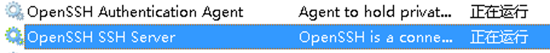
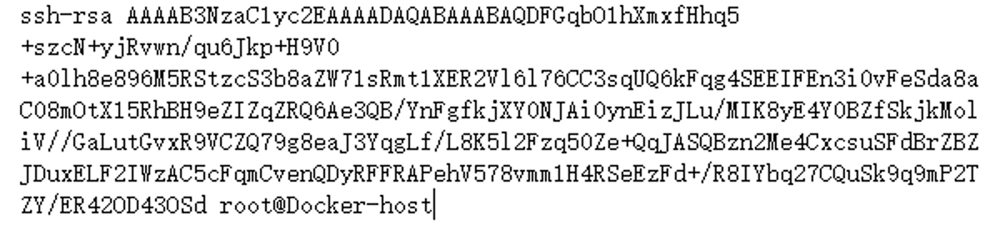

# Windows SSH 安装及免密登录


{: .no_toc}

## 目录

{: .no_toc .text-delta }


1. TOC
{:toc}

## 安装 openssh

下载链接：

[https://github.com/PowerShell/Win32-OpenSSH/releases](https://github.com/PowerShell/Win32-OpenSSH/releases)

我使用的是 [openssh-win64-v9.4.0.0.msi](https://github.com/PowerShell/Win32-OpenSSH/releases/download/v9.4.0.0p1-Beta/OpenSSH-Win64-v9.4.0.0.msi)

安装完毕后，系统会自动配置好下列 service 并自动启动：



通过 SSH client  登陆正常。


## 免密登陆设置

在用户目录（此处是 user\administrator）下创建 `.ssh\authorized_keys` 文件，填入 client 的 `id_rsa.pub`，需要注意不能换行。



之后修改 ` C:\ProgramData\ssh\sshd_config` 文件：

```shell
# 启用公钥登陆
PubkeyAuthentication yes

# administrator 用户同样使用 authorized_keys 进行免密登陆（默认是 __PROGRAMDATA__/ssh/administrators_authorized_keys）
Match Group administrators
       AuthorizedKeysFile ~/.ssh/authorized_keys
```

测试：

```shell
[root@Docker-host]# ssh administrator@10.10.50.6
Microsoft Windows [版本 6.3.9600]
(c) 2013 Microsoft Corporation。保留所有权利。

administrator@DNS C:\Users\Administrator>exit
Connection to 10.10.50.6 closed.
```

## 排错

如果修改了配置后不知道是否生效，或者登陆有问题，可以使用下列方式进行测试：

```shell
# 停掉 sshd
net stop sshd 

# 手动启用 sshd，指定修改后的配置文件，开启 debug 记录
sshd.exe -f C:\ProgramData\ssh\sshd_config -d 
```

