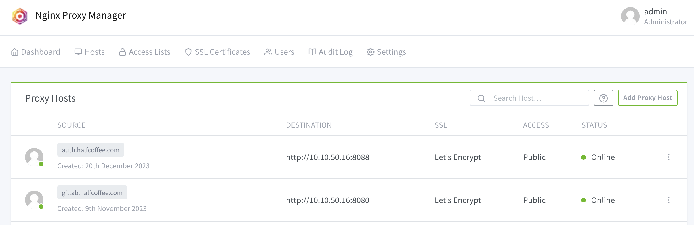

# 我的 Homelab

{: .no_toc}

## 目录

{: .no_toc .text-delta }

1. TOC
{:toc}

> 本文简单介绍下我的 Homelab 基本情况，包括软件和硬件分享。

## 硬件环境

自己开始折腾各种测试环境应该有十多年了，在大学时学 Linux 时就开始用虚拟机，后来学网络又是各种模拟器，再到后来工作后开始用专用机器跑虚拟机，做各种实验，再到后来，各种技术层出不穷，架构也变得愈加复杂，一台机器似乎不够了，于是开始换成迷你机，这样可以多台并行跑，比原来台式机省地方。再到后来，做 Tanzu、VCF 的一些实验时发现三台小主机都似乎不够，于是直接搞了个洋垃圾 E5 工作站...

到现在，硬件大概有这么些：

**计算资源：**

- E5 工作站：
  - 双路 E5 2697v2 + 384 G内存 + 2*2T SSD + 3060Ti（显卡是偶尔拿来跑 AI 的）
  - Windows/ESXi 双系统，主用 Windows 娱乐，偶尔跑大型实验会切到 ESXi
- 两台 NUC10FNH 迷你机： 
  - i7-10710U + 64G 内存 + 2T SSD，这个小机器稍微调整下 BIOS，跑起来声音很小，非常适合 7*24 开机（我就这么干的）
  - ESXi 系统，大部分实验都在这两台机器做，不用的虚拟机就关掉，有些常见的服务尽量放在同一台 VM（比如 DHCP、DNS 等）
- 一台 J3455 工控机：
  - 8G 内存+2T SSD，无风扇设计，本来是拿来做软路由的，后来发现性能不行，就拿来跑虚拟化了，也是 7*24 小时。
  - 装了网盘（nextcloud）、音乐仓库（Ampache）、NAS（Openfiler）等软件，很稳定

**存储：**

- 机器内全部本地存储，重要数据会通过软件来做备份
- 会在一些机器上开 NFS、SMB 等服务，方便其他设备使用（很多 Android、IOS 下第三方 App 都支持直接挂网盘，很方便）
- 对于一些必须要用共享存储的实验，直接用 Linux 搭建一个专门的 NFS

**网络设备：**

- 8 口 TP-link 小交换机，可网管，支持 VLAN 功能
- TP-link WiFi，主要来做无线网桥（网关在软路由上，后面软件部分会详细介绍）
- Palo Alto Networks 的 PA-440，公司发的防火墙，开了很多安全功能，也开了 VPN 方便远程接入管理

## 软件环境

**基础架构：**

- vSphere 全家桶：NUC、J3455 都装了 ESXi，其中一台上跑了 vCenter 来做统一管理
- Windows Server1：提供 DNS、DHCP、下载机、远程管理机等功能
- Windows Server2：提供域控、LDAP、DNS 等功能
- Linux1：提供 DNS（是的，我有三台 DNS Server）、Nginx 反向代理服务
- Linux2：提供 Gitlab、Harbor、Keycloak 等云原生常用到的服务，全部使用 Nginx 做代理挂证书
- Mikeotik RouterOS：软路由，支持各种路由协议，很轻量也很好用
- 公网域名：自己有个长期持有的公网域名，拿来做 DDNS、博客域名、测试等，有了公网域名后申请公信证书也会很方便。目前域名托管在 Cloudflare 上

接下来展开讲讲我目前在用的一些软件：

### NPM

此 NPM 不是 node.js 的那个 npm 包管理器哈，全称是 [nginx proxy manager](https://nginxproxymanager.com)，一个很简单的 Nginx Web 配置管理器，省去了手动改 Nginx 的麻烦。

我以容器形式把 NPM 部署在 Linux 上（使用 host 网络模式），同时支持 L4 的代理（Stream）和 L7 的代理。

NPM 有个非常好用的功能，它可以和 Cloudflare 对接，然后调用 Let's Encrypt 的接口来申请公信证书，还支持自动续期。

申请好通配符证书后可以直接挂给应用去使用，也可以下载证书文件在其他环境中用，很方便。

在我的环境里，Harbor、Gitlab、Keycloak 等全部都用 NPM 做反向代理，同时挂载证书，用起来很舒畅。

### PowerDNS

主 DNS 服务器，当时选择用这个 DNS 主要是看下来 Web 管理还算方便，虽然搭建过程有些难。

也是容器化部署，一个 PowerDNS 需要三个服务：

- PowerDNS Admin ：提供 Web 管理功能
- PowerDNS Authoritative Server：提供 DNS 解析服务
- PowerDNS Recursor：提供 DNS 转发器功能

### Mikeotik RouterOS

一个极其轻量的 ROS，只需要 1C，512M 内存，但是性能很好，已经作为主网关运行了很多年。

用过的功能：

- VLAN 支持，三层 SVI 口
- OSPF、BGP 对接
- IPsec VPN、L2VPN
- DHCP、静态地址绑定
- 各种 NAT

### Windows Server

Windows Server 用习惯了后还是很易用的，尤其是预控管理功能和 DNS 功能。

我也拿 Windows Server 来做 DHCP 服务器，主要是为了针对不同电脑（mac 地址）下发不同的 DHCP 地址，然后根据不同的 DHCP 地址做策略路由（在 PA-440 上做）。

Windows 本身软件生态又很全面，各种常用软件都可以装上，临时当台 Windows 用用。

### Keycloak

最早是做容器时发现有客户在用这个软件实现 SSO，最近亲测了下，对于标准 OIDC 和 SAML 协议的支持很不错，上手很快。

简单测试了下 Gitlab SSO 对接（用 Gitlab 做认证源）、Windows AD 对接、GlobalProtect VPN 对接（PaloAlto 的 VPN 客户端），都非常好使。

### Ollama

一个极简的跑大模型的软件，安装简单，可以直接下载大模型在本地运行，也提供 API，可以和其他应用做集成。

之前还测试了另一个功能更强大的软件 LM Studio，但是对老旧硬件支持一般。

### GlobalProtect VPN

以前在 VMware 工作的时候，连接公司网络就是用的 GlobalProtect VPN，现在来到了生成 GlobalProtect 的公司，刚好用公司发的 PA-440 搭起了 VPN，方便远程接入家里的 Homelab。

远程接入后，还能利用 PA-440 的网络和安全能力来做其他很多事情。

### Cloudflare

严格来说这不是个软件，但是真的好用，很多 Cloudflare 的服务都是免费的，比如 DNS 管理、CDN、Worker（Serverless 服务）等。

之前一直用 Godaddy 的 DNS 管理，但后来发现服务不咋稳定，于是切换到了 Cloudflare。

Cloudflare 本身的产品能力和文档都比较好，做 DDNS（我自己是用社区脚本实现的）、Let's Encrypt 集成都有现成工具用起来很方便。

### Nextcloud

私有化部署的网盘，使用容器部署，个人资料都放在这里，也支持多终端同步功能，用下来要比 Onedrive 等商业网盘更快捷，还没有功能限制。

插件比较多，比如可以内嵌 Note、PDF 阅读器、视频播放器、下载器、视频转码器、Office 等，可按个人喜欢自行安装。

网盘本身在内网，有时候会临时开放到互联网方便访问资源，这时候又害怕被攻击，于是前面挂了个 WAF... 以前在 VMware 的时候用 Avi，现在在 PA 用 Prisma Cloud，虽然环境不大但保护要足...

## 后续

有了基础环境后，做很多测试效率都会比较高，比如现在在新司经常要做各种网络和安全测试：

- 需要搭建一套 SASE 环境，或者 SD-WAN 环境：底层网络环境都具备了，可以快速划很多 VLAN，用软路由搭建出复杂的网络环境。（底层用 vSphere 也使得事情变得很简单）
- 需要测试 XDR：现有的 Windows、Linux、容器环境直接装 Agent，开测
- 需要测 PA 防火墙：现有的 Windows 直接暴露在公网，防火墙透明检测各种安全威胁

... ... 

只有想不到没有做不到，只是实验做多了，腰要废...
