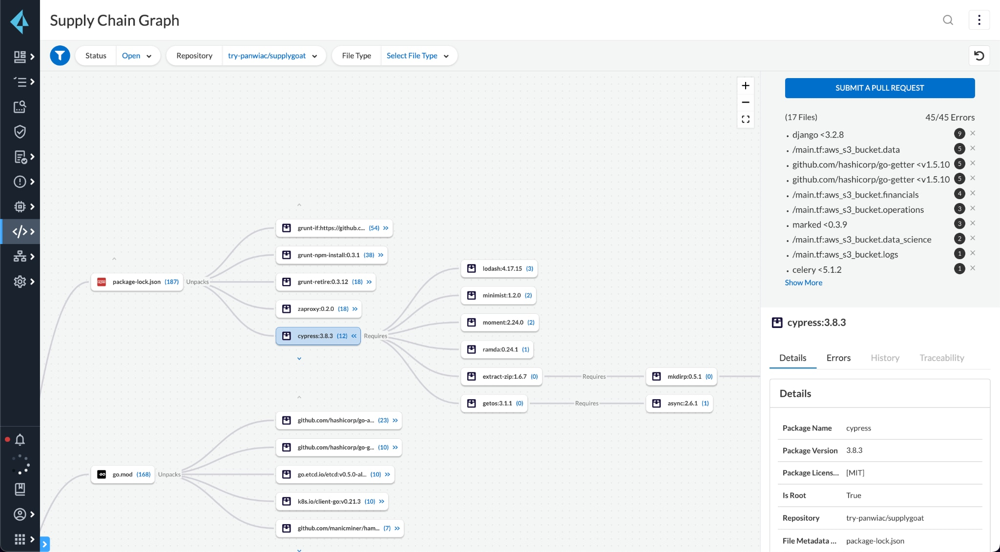
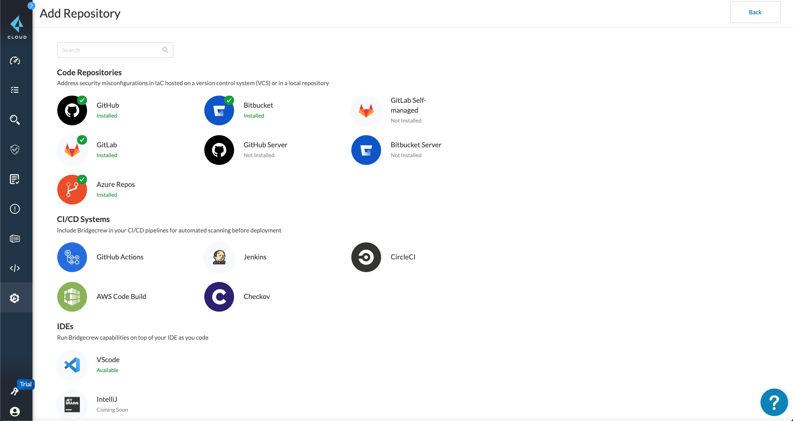
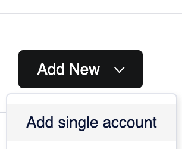
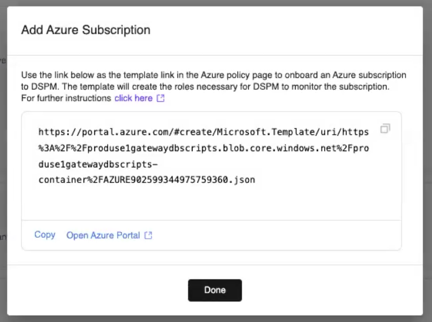

# Prisma Cloud

{: .no_toc}

## 目录

{: .no_toc .text-delta }

1. TOC
{:toc}

# Prisma Cloud

Prisma Cloud 是 PA 面向市场的云原生安全平台（CNSP），为应用、数据和整个云原生技术栈提供完整的安全性和合规性。

## CSPM 云安全态势管理 

云安全的首要任务是对部署的每个资源具有全面的可视性，同时要能确保配置的合规性。

Prisma Cloud 除了合规性和配置管理之外，还接入了基于漏洞情报的风险识别。具体有以下功能：

- 可视性、合规性和监管
  - 云资产盘点
  - 配置评估（运行时）
  - 合规性监控及报告
  - IaC 扫描（IDE、SCM 供应链管理及 CI/CD 流水线平台）

- 威胁检测
  - 用户和实体行为分析 User And Entity Behavior Analytics
  - 基于 API 的网络流量可视性、分析和异常检测
  - 自动调查和响应
- 数据安全（AWS）
  - 数据分类
  - 恶意软件扫描
  - 数据监管

## 云工作负载保护 CWPP

将安全集成到 CICD、注册中心、运行时中。

具体有以下功能：

- 主机安全
  - 漏洞管理
  - 运行时安全
  - 合规性管理
  - 访问控制
- 容器安全
  - 漏洞管理
  - 运行时安全
  - 合规性管理
  - 访问控制
  - Git 存储库扫描（静态代码扫描？）
- 无服务安全
  - 漏洞管理
  - 运行时安全
  - 合规性管理
  - 访问控制
- Web 应用及 API 安全
  - OWASP top 10 安全防护
  - API 保护

## 云网络安全

容器级别的微分段、流量检测日志，七层威胁防御：

- 网络可视化和异常检测（类似于 NSX Intelligence？）
- 基于身份的微分段
- 云原生防火墙

## 云基础架构权限管理

跨越 IaaS 和 PaaS 自动检测并修复身份和访问风险。可以自动发现云环境下的人员和机器身份，分析权限、角色和策略。提供：

- 权限可视性
- IAM 监管
- 自动响应
- 用户和实时行为分析（UEBA）

## 代码安全

供应链安全的背景：现代化应用通常使用敏捷开发，有大量的 CICD 流水线，但是伴随着应用生命周期缺少安全或者使用单一的安全手段，没有体系。

*下图中同时会包含 IaC(例如 TF)、开源软件包、Image 的清单：*

包含的模块：

- 供应链安全（合并了 Cider Security）
  - 供应链依赖图，发现包的依赖关系和调用关系
  - 发现依赖包中的漏洞（SCA）
  - IaC 安全
  - VCS （版本控制系统，例如 Git，Bitbucket）安全，例如双因子检测，SSO 等。设置代码合并规则，避免未授权或者代码注入的发生
  - 镜像库安全，持续检测 image 漏洞，避免未授信的 image 进入环境中
  - CICD 安全，避免使用不安全的命令或者 beta 的功能，移除硬编码的 secret
  - 持续的 IAM 控制
  - SBOM 管理

- [Software Composition Analysis ](https://www.paloaltonetworks.com/blog/prisma-cloud/prisma-cloud-announces-software-composition-analysis/)(SCA) 解决开源组件的漏洞问题，传统的 SCA 方案只是去扫描使用的组件，很少检测组件依赖的其他组件，缺少上下文的连接，比如和 IaC、k8s、CICD 综合在一起来管理安全
  - 检测漏洞：检测依赖包是否有漏洞（通过 [Checkov](https://www.checkov.io/) 与 IDE 集成，在开发阶段就提示软件漏洞；可以和 Github 集成，发现漏洞，提示修复的版本，阻止 CD）
  - 生成 SBOM（软件物料清单），方便追踪变动，防止篡改
  - License 合规性检查

- [Secret Scanning](https://www.paloaltonetworks.com/blog/prisma-cloud/new-secrets-and-api-security/) 密钥扫描
  - 发现仓库中的密钥，包括提交历史中的密钥
  - 自动发现 API key，加密密钥，OAuth token，证书等多种密钥，通过特征识别，覆盖范围广
  - 支持检测自动生成的密钥

- IaC 安全
  - 基于开源的 Checkov
  - 检查 IaC 中的误配置，比如是否满足 HIPAA，CIS 和 PCI 规范

## 收购来的产品

[2018 RedLock](https://techcrunch.com/2018/10/03/palo-alto-networks-to-acquire-redlock-to-beef-up-cloud-security/?guccounter=1&guce_referrer=aHR0cHM6Ly93d3cuZ29vZ2xlLmNvbS8&guce_referrer_sig=AQAAANDmyKEYxzOUdT7JUAKnI5szwu1dtmWTb4pkEJXYgoV_ugGyjVRXZfM8it_OCnewM-84xXosQI4cJ-3Pd_6-u-D45y3KudhEg5BxIBZTR-ZMN0byv02imsux118xjlg8DN7P9pCR0PMpxXdt4MjnVMicP5-lW9fiXXyMgw39bqg1)：云威胁防御，有点类似 CSPM，解决误配置导致的云安全事件发生，比如 S3 泄露

- 账户扫描
- 合规性
- 类搜索引擎的检索（查找资源）

[2018 Evident](https://www.paloaltonetworks.com/company/press/2018/palo-alto-networks-announces-intent-to-acquire-evident-io)：公有云基础架构安全及合规性保障

- 减少攻击面
- 支持 AWS 和 Azure 的风险识别

[2019 PureSec](https://www.paloaltonetworks.com/company/press/2019/palo-alto-networks-completes-acquisition-of-puresec)：无服务安全

- 无服务的漏洞管理
- 权限管理
- 运行时安全防护

[2019 Twistock](https://www.paloaltonetworks.com/company/press/2019/palo-alto-networks-completes-acquisition-of-twistlock)：容器安全

- 漏洞管理
- 合规性保证
- 运行时安全

[2022 年 12 月 Cider 安全](https://www.paloaltonetworks.com/company/press/2022/palo-alto-networks-completes-acquisition-of-cider-security)：AppSec 及供应链安全

[2023 Dig Security](https://www.paloaltonetworks.com/company/press/2023/palo-alto-networks-completes-acquisition-of-dig-security)： DSPM数据安全 

# DSPM

使用场景：

- 敏感数据发现：发现数据中的敏感资产，发现影子资产
- 减少数据风险：修复数据权限问题，减少数据暴露，优化云开支
- 合规：保证配置满足合规法案，态势管理
- 数据访问治理：映射访问关系和权限
- DDR：数据流动监控、防数据窃取、防恶意软件

前面四个主要是静态的防护，DDR 则是动态的防护。

扫描周期：

- 数据库 30 天扫描一次（通常里面的内容安全级别不会频繁变化），进行扫描前先会检查有没有 <72 小时的 snapshot，然后对 snapshot 进行扫描

- S3 12 小时扫描一次（一个 bucket 中有 2500 个扫描上限，如果有更多对象就使用 Sampling）

最多会部署 10 台 VM 来扫描数据。

## onboard AWS

在 Prisma Cloud > 数据安全的首选项中对接云。

账户权限需求见：[https://docs.dig.security/docs/aws-permissions](https://docs.dig.security/docs/aws-permissions)

右上角添加“Add Single Account”：

复制链接在浏览器中打开（需要提前登录 AWS 账号），系统会自动加载创建 stack 的配置：

同意后创建 Stack 即可：

创建完成：

返回 DSPM 可以看到账户已经对接完成：

一段时间后，Discovery 状态会变为 Active：

部署上面的 Terraform 会创建下列三个 Role：

- DigSecurityOrchestratorRole：运行一些资源，比如 EC2
- DigSecurityReadOnlyRole：读取 Metadata
- DigSecurityScannerRole：获取数据

部署完成后，在 CloudTrail 中可以看到相应的事件：

## onboard Azure

在添加时，需要先添加 Single Subscription（部署一个 Orchestrator Account），然后才能添加 Tenant。

添加时输入 Azure 租户 ID（添加完成后需要跳到新的页面进行验证）：

Azure 会用到下列四个 Role：

- OrchestratorRole：运行一些资源，比如 EC2
- ReadOnlyRole：读取 Metadata
- ScannerRole：获取数据
- Subscription Orchestrator role：扫描以及分析数据集

