# Zabbix 对接

{: .no_toc}

## 目录

{: .no_toc .text-delta }


1. TOC
{:toc}

# 防火墙侧配置

如果 Zabbix 通过 NGFW 带外管理口获取数据，则需要确保管理口的 SNMP 功能开启。

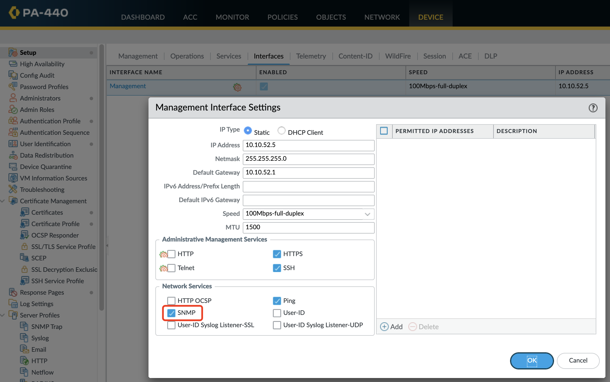

如果 Zabbix 通过 NGFW 带内管理口获取数据，则需要确保接口使用的 Interface Mgmt Profile 开启 SNMP 功能。

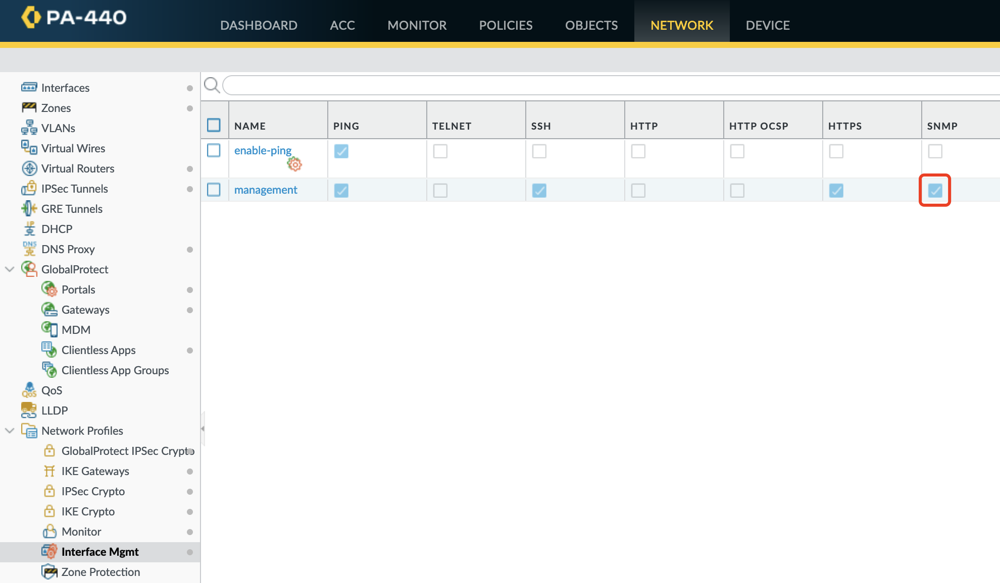

# Zabbix 侧配置

## Docker 部署

```shell
git clone https://github.com/zabbix/zabbix-docker.git
cd zabbix-docker
docker compose up -d
```

部署完成后，使用 `Admin/zabbix` 登录。

## 导入模板

官方的模板链接如下：

[https://www.zabbix.com/integrations/palo_alto_networks](https://www.zabbix.com/integrations/palo_alto_networks)


建议安装下列两个Template：

[https://github.com/zabbix/community-templates/tree/main/Network_Devices/Palo_Alto/template_palo_alto_with_64-bit_counters_(snmpv2)](https://github.com/zabbix/community-templates/tree/main/Network_Devices/Palo_Alto/template_palo_alto_with_64-bit_counters_(snmpv2))

[https://github.com/zabbix/community-templates/tree/main/Network_Devices/Palo_Alto/template_palo_alto_firewall](https://github.com/zabbix/community-templates/tree/main/Network_Devices/Palo_Alto/template_palo_alto_firewall)


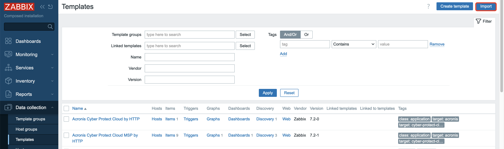

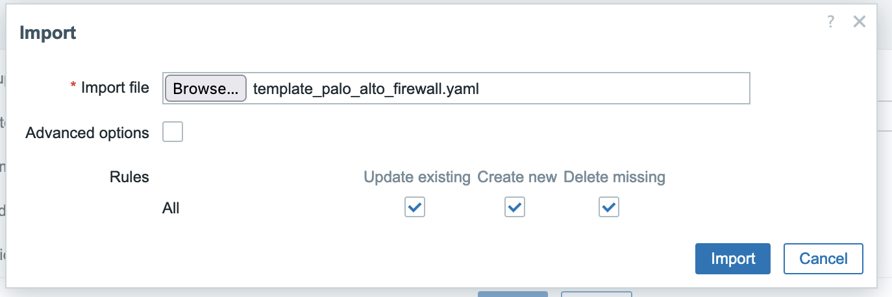

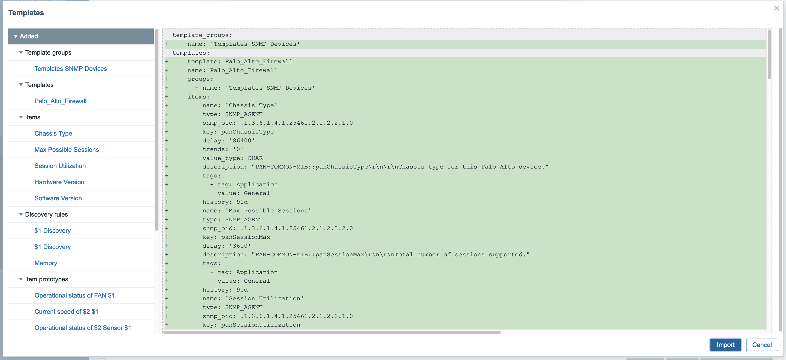

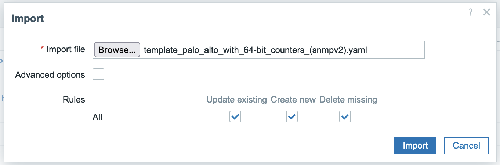

### 创建 Template Group

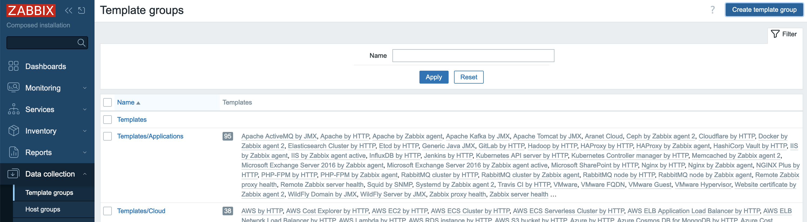

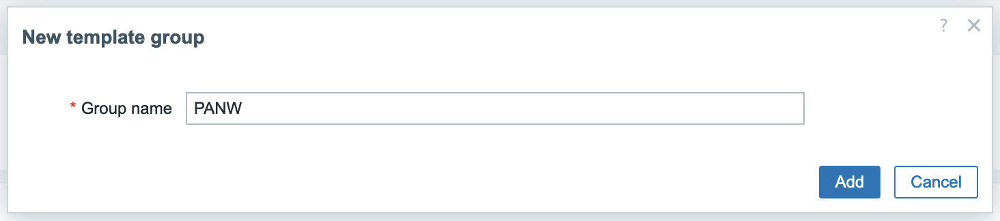

修改导入模板的 Template Group（点击右侧 Template 名称进行修改）：


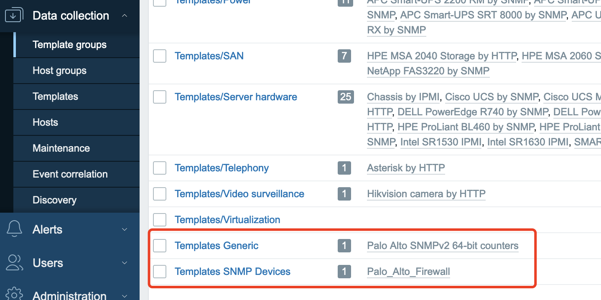

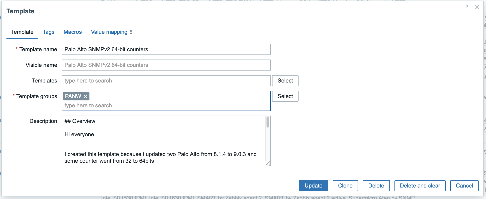

修改完毕后：

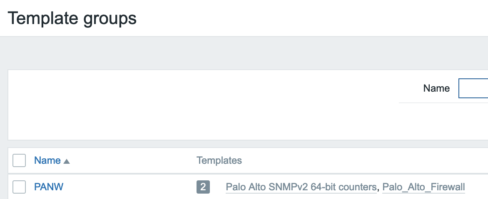

## 添加 Host Group

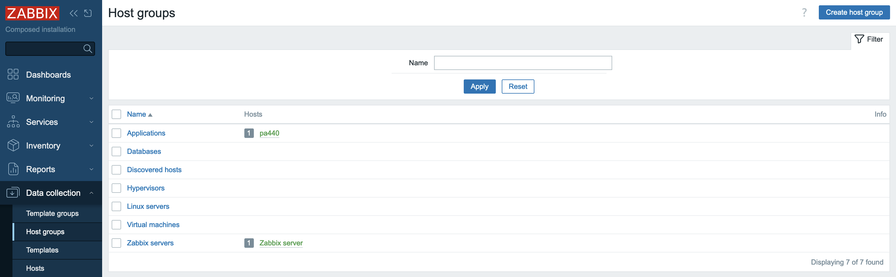

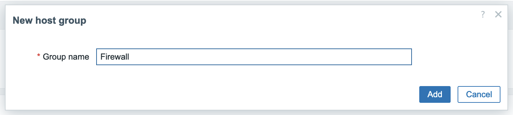

## 添加 Host

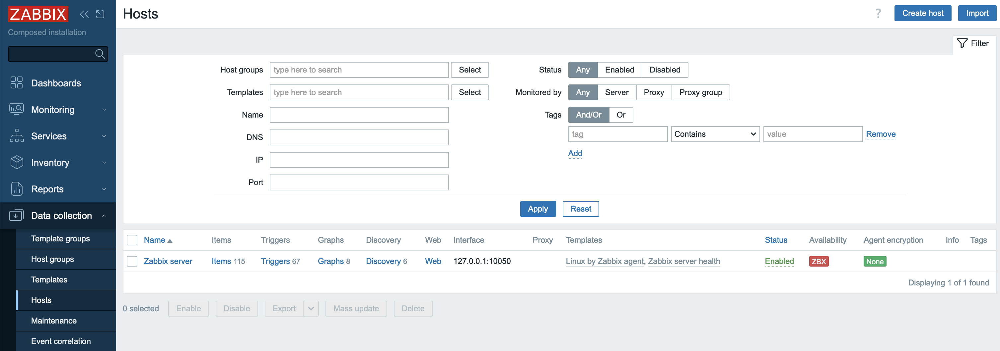


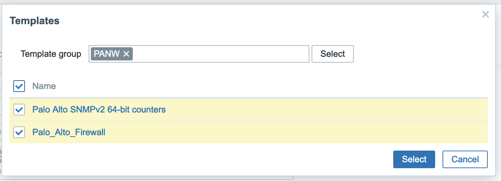

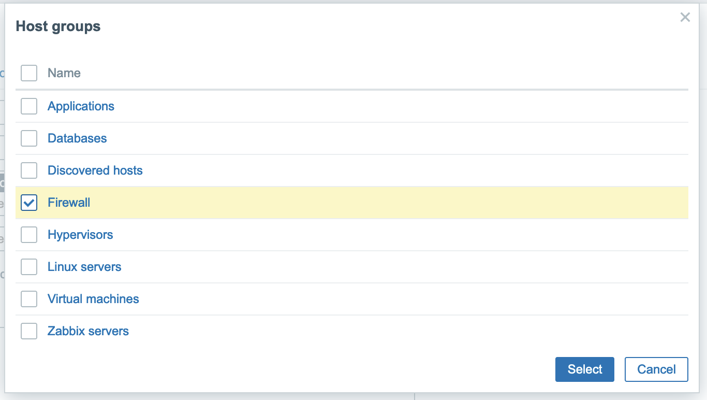

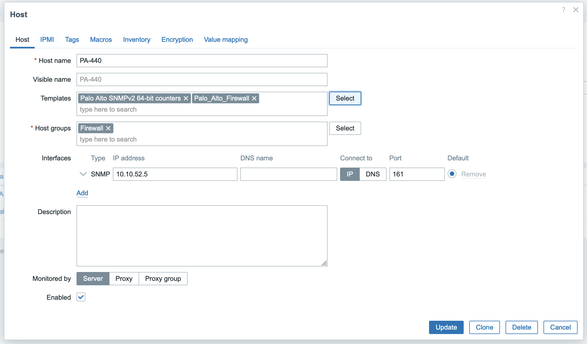

## 数据查看

在下列位置可以查看设备的数据或者图表：

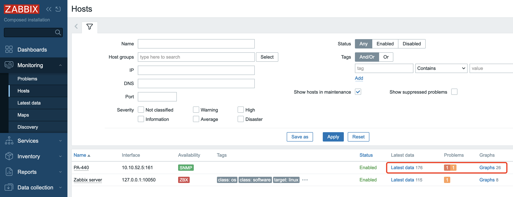

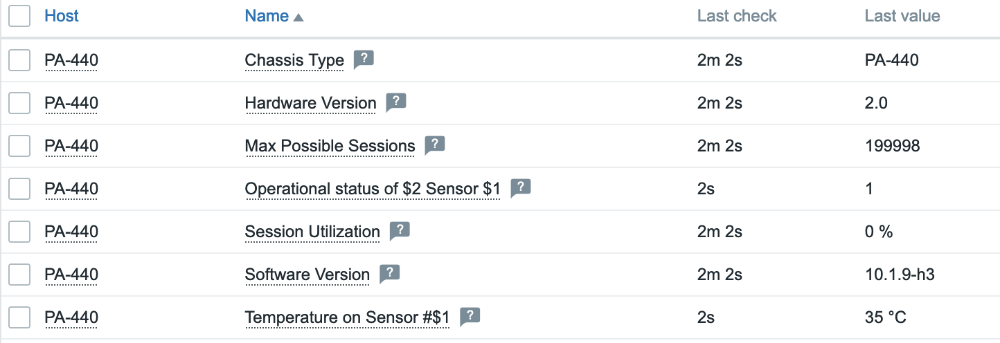

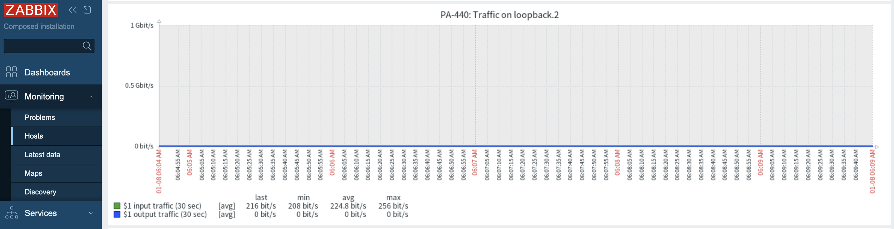
