# Prisma Cloud/Model Security CI/CD 集成

{: .no_toc}

## 目录

{: .no_toc .text-delta }


1. TOC
{:toc}

# 依赖环境准备

## Minio 配置

Minio 用于提供 S3 服务，存放模型文件。

在 Minio 中已经预先创建好了 bucket 并上传了模型文件：

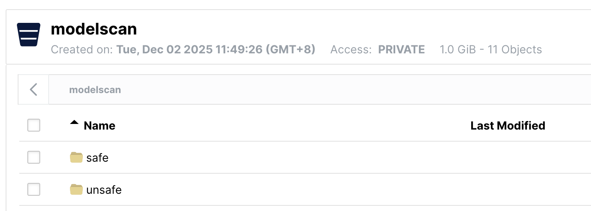

创建 Minio 访问秘钥：

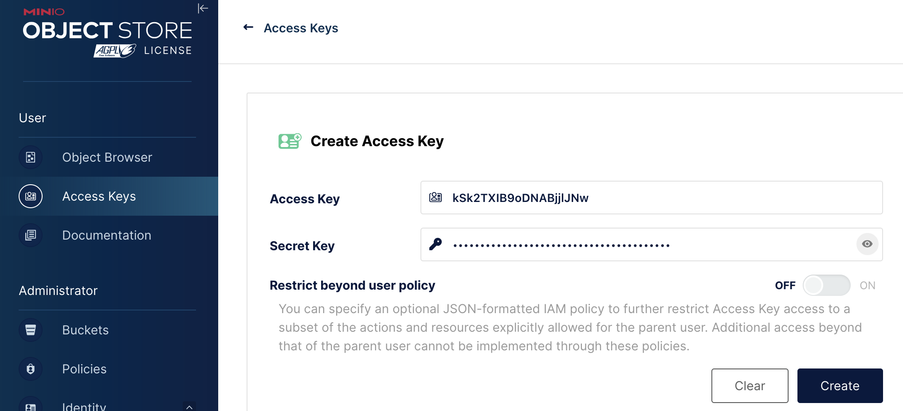

## Harbor 配置

在 Harbor 中设置独立的仓库，存放流水线需要用到的 image：

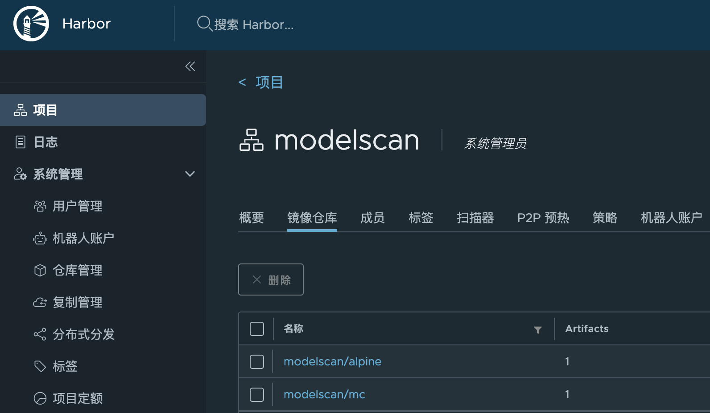

下载流水线必要的 image 并上传到私有仓库

```shell
docker pull minio/mc 
docker pull alpine 
docker pull dyadin/model-security 
docker tag minio/mc harbor.halfcoffee.com/modelscan/mc
docker tag alpine  harbor.halfcoffee.com/modelscan/alpine
docker tag dyadin/model-security harbor.halfcoffee.com/modelscan/model-security
docker push harbor.halfcoffee.com/modelscan/mc
docker push harbor.halfcoffee.com/modelscan/alpine
docker push harbor.halfcoffee.com/modelscan/model-security
```

### 私有仓库拉取镜像（可选）

如果镜像仓库需要秘钥才能拉取镜像，需要在 Jenkins 中将 Harbor 的用户名密码添加到 Credentials 中。

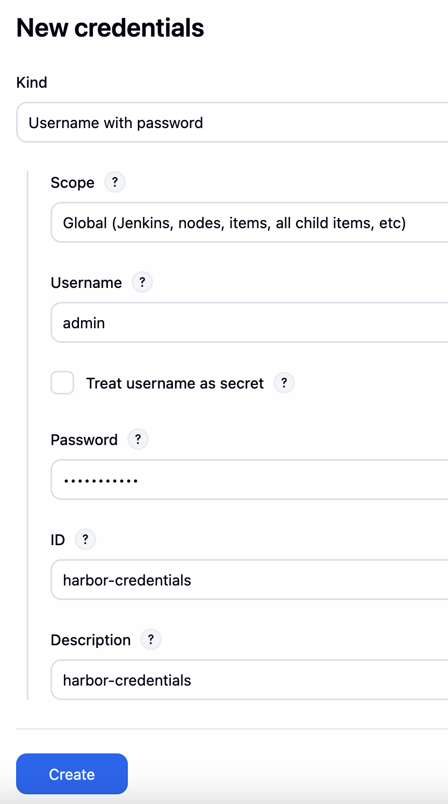

然后在指定 docker image 时设置需要登录：

```shell
            agent { 
                docker { 
                    image 'harbor.halfcoffee.com/modelscan/mc'
                    registryCredentialsId 'harbor-credentials'
                    args '--entrypoint=""' 
                }
            }
```


# Jenkins 安装

## 镜像准备（可选）

默认 Jenkins 不含比较新的 blueocean、docker-workflow 插件，需要[参考此文章](https://www.jenkins.io/doc/book/installing/docker/)来构建自定义 image，将这些包加入其中：

```shell
cat > Dockerfile << EOF
FROM jenkins/jenkins:jdk21
USER root
RUN apt-get update && apt-get install -y lsb-release ca-certificates curl && \
    install -m 0755 -d /etc/apt/keyrings && \
    curl -fsSL https://download.docker.com/linux/debian/gpg -o /etc/apt/keyrings/docker.asc && \
    chmod a+r /etc/apt/keyrings/docker.asc && \
    echo "deb [arch=$(dpkg --print-architecture) signed-by=/etc/apt/keyrings/docker.asc] \
    https://download.docker.com/linux/debian $(. /etc/os-release && echo \"$VERSION_CODENAME\") stable" \
    | tee /etc/apt/sources.list.d/docker.list > /dev/null && \
    apt-get update && apt-get install -y docker-ce-cli && \
    apt-get clean && rm -rf /var/lib/apt/lists/*
USER jenkins
RUN jenkins-plugin-cli --plugins "blueocean docker-workflow json-path-api"

EOF
docker build . -t dyadin/jenkins-blueocean:jdk21
```

已经基于 jdk21 版构建的成品镜像如下：

```shell
dyadin/jenkins-blueocean:jdk21
```


## 容器化部署 Jenkins

部署 Jenkins 需要两个容器：

- Jenkins-blueocean：Jenkins 主镜像，默认 8080 端口用于 web 访问，50000 用于客户端连接
- Jenkins-docker：Jenkins 流水线需要用到 Docker in Docker，此容器即负责此任务。

```shell
# 基础环境准备
mkdir jenkins
cd jenkins

# 创建 Docker compose 文件

cat > docker-compose.yaml << EOF

services:

  jenkins-docker:
    image: docker:dind
    container_name: jenkins-docker
    privileged: true
    networks:
      jenkins:
        aliases:
          - docker     
    environment:
      DOCKER_TLS_CERTDIR: /certs
    volumes:
      - jenkins-docker-certs:/certs/client
      - jenkins-data:/var/jenkins_home
    ports:
      - "2376:2376"
    restart: unless-stopped
    extra_hosts:
      - "harbor.halfcoffee.com:10.10.50.16"
  jenkins-blueocean:
    image: dyadin/jenkins-blueocean:jdk21
    container_name: jenkins-blueocean
    restart: on-failure
    networks:
      - jenkins
    environment:
      DOCKER_HOST: tcp://docker:2376
      DOCKER_CERT_PATH: /certs/client
      DOCKER_TLS_VERIFY: 1
    ports:
      - "8080:8080"
      - "50000:50000"
    volumes:
      - jenkins-data:/var/jenkins_home
      - jenkins-docker-certs:/certs/client:ro
    depends_on:
      - jenkins-docker

networks:
  jenkins:
    name: jenkins

volumes:
  jenkins-data:
  jenkins-docker-certs:
  
EOF

# 启动 Jenkins
docker compose up -d
```

细节说明：

- 在新版的 Docker in Docker 下，如果使用 TCP 连接默认会开启证书验证，所以需要将 DinD 的证书挂载给 Jenkins（此处使用了共享卷，DinD 生成证书，Jenkins 直接以只读权限调用）
- 环境中使用了私有化部署 Harbor，为了使得 DinD 正常解析域名，可以在 Docker compose 中添加 `extra_hosts`参数来手动设置解析。

## 初始化 Jenkins

启动后用下列命令获得 admin 密码：

```
docker logs -f jenkins-blueocean
```

示例：

```shell
[LF]> Jenkins initial setup is required. An admin user has been created and a password generated.
[LF]> Please use the following password to proceed to installation:
[LF]>
[LF]> 19773f183f894ffc9c5693aadb6
[LF]>
[LF]> This may also be found at: /var/jenkins_home/secrets/initialAdminPassword
```

打开 Jenkins web 管理页：`http://<jenkins-ip>:8080 ` 然后使用上述密码登录：

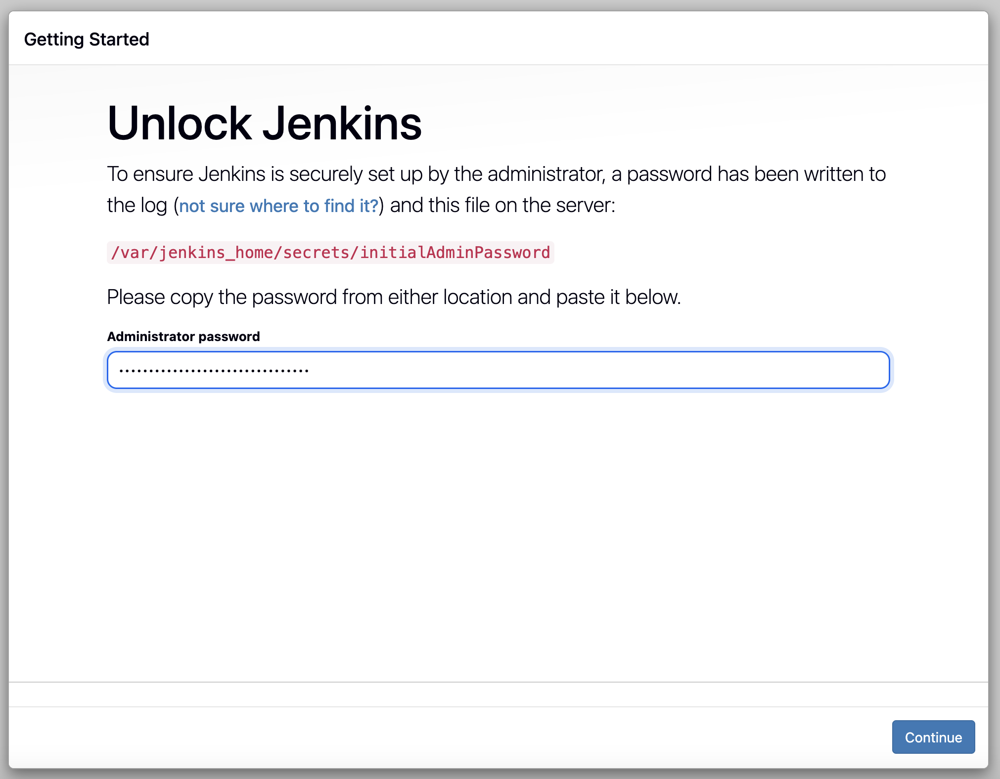

安装推荐的插件：

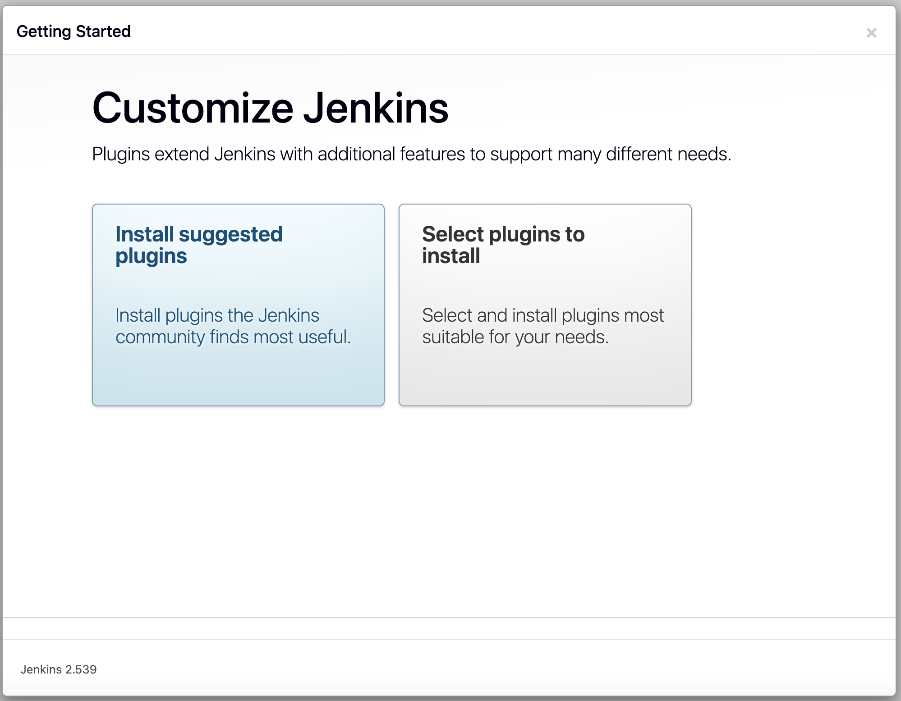

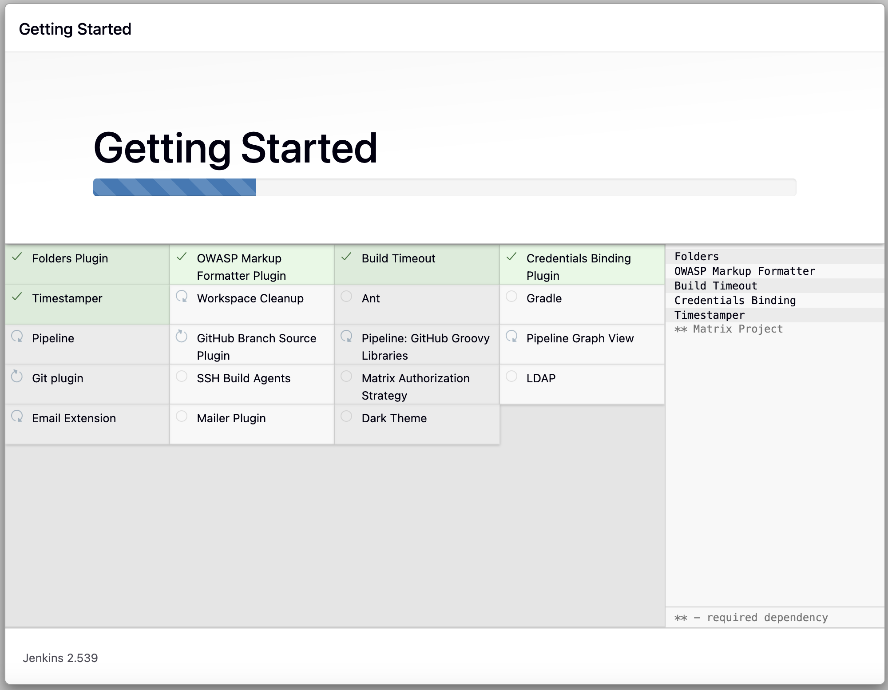

设置 Admin 用户：

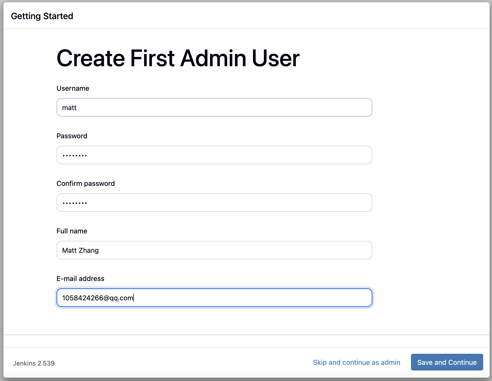

设置默认 URL（以实际为准进行配置）：

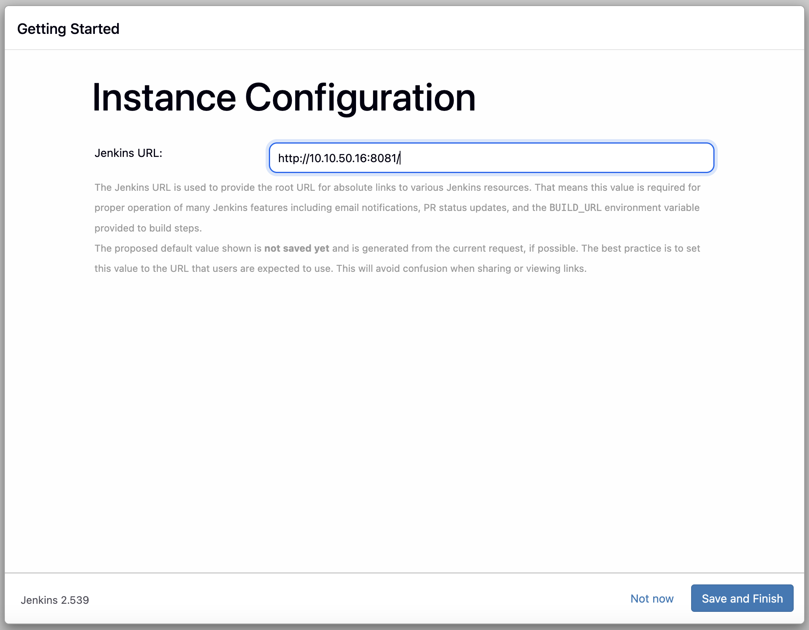


在此位置可以添加额外的 Plugin：

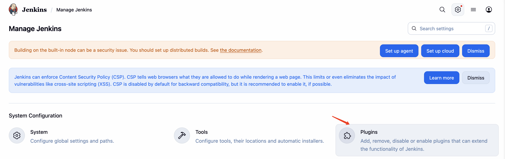

常见插件介绍如下：

- Localization: Chinese (Simplified)
- Git、Git Parameter：拉取 Git 仓库中的代码
- GitLab：集成 Gitlab，通过 webhook 触发构建，将构建状态返回给 Gitlab
- Config FIle Provider：用于创建 kubeconfig 文件，使得 Jenkins 可以连接到 k8s 集群
- SSH Agent （build）：通过 ssh 远程执行命令
- Stage View：一步步的执行过程视图
- Role-based Authorization Strategy
- kubernetes：Kubernetes 对接
- docker：Docker 对接
- skip-certificate-check：禁用证书检查
- Artifact Manager on S3：与 S3 存储对接（兼容 Minio）


## 流水线创建

新建 Item

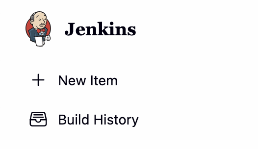

设置名称，类型选择 Pipeline：

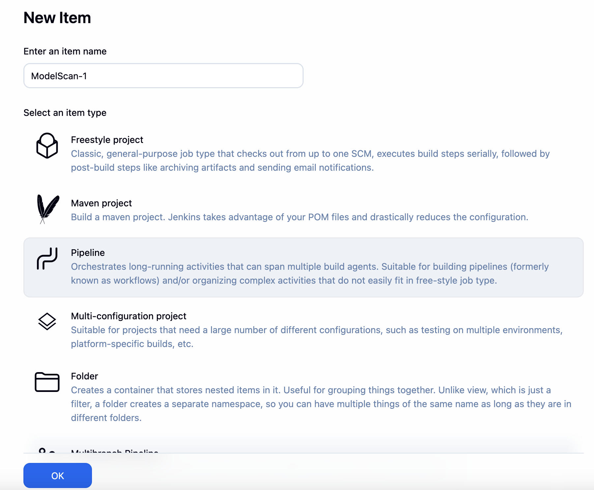

在 Pipeline 中填写下列配置。配置共有下列运行阶段：

- Hello：Hello World，此步骤可删除
- Download-Models：通过 Monio 的 mc 客户端容器从 Minio 拉去 S3 中存放的模型目录
- List-Models：使用 `ls -l`查看拉取的模型文件，方便排错，此步骤可删除
- Scan-Models：使用

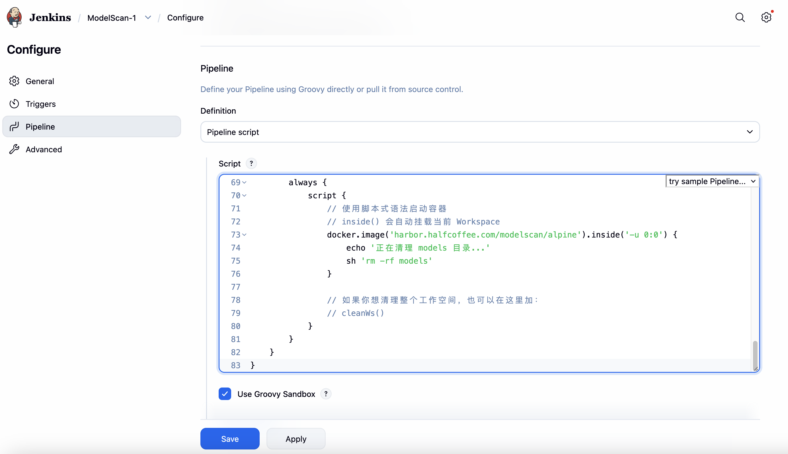

```groovy
pipeline {
    agent none
    environment {
        MINIO_HOST = 'http://10.10.50.16:9000'
        MINIO_ACCESS_KEY = 'XXXX'
        MINIO_SECRET_KEY = 'XXXX'
        MODEL_SECURITY_CLIENT_ID = 'model-scan@XXXX.iam.panserviceaccount.com'
        MODEL_SECURITY_CLIENT_SECRET = 'XXXX'
        TSG_ID = 'XXXX'
        SECURITY_GROUP_UUID = 'b4b56577-7793-41e1-a718-b6aaf12708f1'
    }

    stages {
        stage('Hello') {
            steps {
                echo 'Hello World'
            }
        }

        stage('Download-Models') {
            agent { 
                docker { 
                    image 'minio/mc'
                    args '--entrypoint=""' 
                    reuseNode true
                }
            }
            environment {
                HOME = '.'
            }
            steps {
                sh '''
                  mc alias set minio ${MINIO_HOST} ${MINIO_ACCESS_KEY} ${MINIO_SECRET_KEY}
                  mc mb --ignore-existing minio/modelscan
                  mc cp --recursive minio/modelscan/safe models/
                  ls -l models/*
                '''
            }
        }
        stage('Scan-Models') {
            agent {
                docker {
                    image 'dyadin/model-security'
                    reuseNode true
                }
            }
            environment {
                MODEL_SECURITY_CLIENT_ID     = "${MODEL_SECURITY_CLIENT_ID}"
                MODEL_SECURITY_CLIENT_SECRET = "${MODEL_SECURITY_CLIENT_SECRET}"
                TSG_ID                       = "${TSG_ID}"
            }
            steps {
                sh """
                  model-security \
                    --base-url https://api.sase.paloaltonetworks.com/aims \
                    scan \
                    --security-group-uuid "${SECURITY_GROUP_UUID}" \
                    --model-path models \
                    --model-uri 's3://10.10.50.16:9000/modelscan/models' \
                    --model-name "production-classifier" \
                    --model-author "ml-team" \
                    --model-version "v2.1"
                """
            }
        }
    }
post {
        cleanup {
            node('') {
                sh 'rm -rf models || true'
            }
        }
    }
}
```


## 密钥存储优化（可选）

上面的流水线中密钥直接存储在 Pipeline 文件中，这种做法通常不安全，建议将其放在全局的 Credentials 中存储。

配置示例如下：

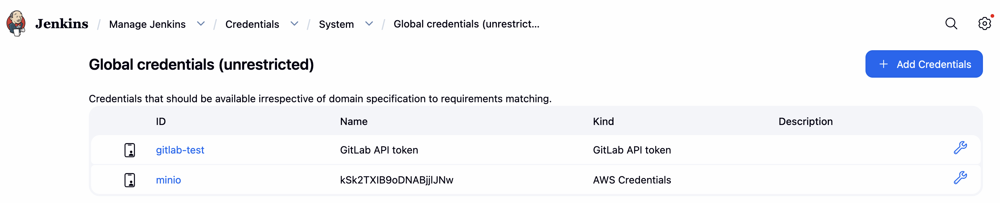

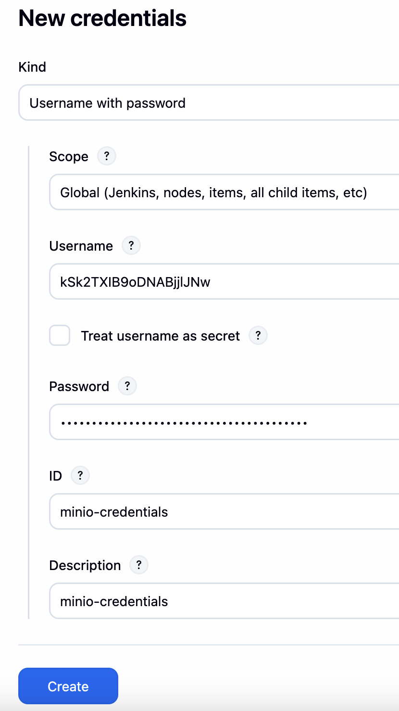

之后在 Pipeline 中调用即可：

```shell
...
            steps {
                // 使用 withCredentials 注入 MinIO 凭证
                withCredentials([usernamePassword(credentialsId: 'minio-credentials', usernameVariable: 'MINIO_ACCESS_KEY', passwordVariable: 'MINIO_SECRET_KEY')]) {
                    sh '''
                      mc alias set minio ${MINIO_HOST} ${MINIO_ACCESS_KEY} ${MINIO_SECRET_KEY}
                      mc mb --ignore-existing minio/modelscan
                      mc cp --recursive minio/modelscan/safe models/
                    '''
                }
```

使用同样的办法存储 model security 的凭据信息：

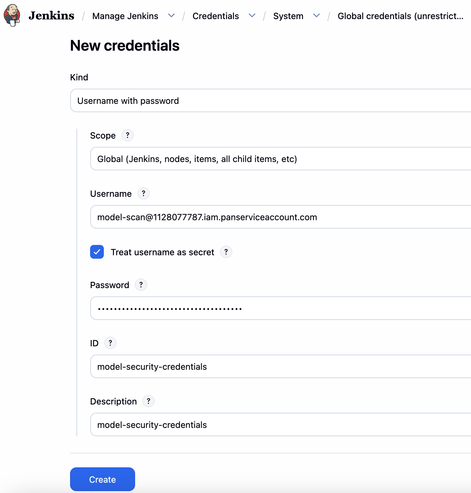

最终的 Pipeline 如下：

```groovy
pipeline {
    agent none
    environment {
        MINIO_HOST = 'http://10.10.50.16:9000'
        TSG_ID = '1128077787'
        REGISTRY_URL = 'https://harbor.halfcoffee.com'
        MODELS_FOLDER= 'modelscan/unsafe'
        // Bucketname/foldername, also can be bucketname alone
    }

    stages {
        stage('Hello') {
            steps {
                echo 'Hello World'
            }
        }

        stage('Download-Models') {
            agent { 
                docker { 
                    image 'harbor.halfcoffee.com/modelscan/mc'
                    registryUrl "${REGISTRY_URL}"
                    registryCredentialsId 'harbor-credentials'
                    args '--entrypoint=""' 
                }
            }
            environment {
                HOME = '.'
            }
            steps {
                withCredentials([usernamePassword(credentialsId: 'minio-credentials', usernameVariable: 'MINIO_ACCESS_KEY', passwordVariable: 'MINIO_SECRET_KEY')]) {
                    sh '''
                      mc alias set minio ${MINIO_HOST} ${MINIO_ACCESS_KEY} ${MINIO_SECRET_KEY}
                      mc mb --ignore-existing minio/modelscan
                      mc cp --recursive minio/${MODELS_FOLDER} models/
                      ls -l models/*
                    '''
                }
            }
        }
        stage('Scan-Models') {
            agent {
                docker {
                    image 'harbor.halfcoffee.com/modelscan/model-security'
                    registryUrl "${REGISTRY_URL}"
                    registryCredentialsId 'harbor-credentials'
                }
            }
            steps {
                withCredentials([usernamePassword(credentialsId: 'model-security-credentials', usernameVariable: 'MODEL_SECURITY_CLIENT_ID', passwordVariable: 'MODEL_SECURITY_CLIENT_SECRET')]) {
                    sh """
                      model-security \
                        --base-url https://api.sase.paloaltonetworks.com/aims \
                        scan \
                        --security-group-uuid b4b56577-7793-41e1-a718-b6aaf12708f1 \
                        --model-path models \
                        --model-uri 's3://${MINIO_HOST}/modelscan/models' \
                        --model-name "production-classifier" \
                        --model-author "ml-team" \
                        --model-version "v2.1"
                    """

                }
            }
        }
    }

    post {
        cleanup {
            node('') {
                sh 'rm -rf models || true'
            }
        }
    }
}
```

## 邮件告警（可选）

如果使用 QQ 邮箱，参考此方法设置授权码：

https://wx.mail.qq.com/list/readtemplate?name=app_intro.html#/agreement/authorizationCode

所需的细节配置如下：

```shell
SMTP_SERVER=smtp.qq.com
SMTP_PORT=587
SMTP_USERNAME=XXX@qq.com
SMTP_PASSWORD=XXX
SMTP_USE_TLS=true
```

在 Jenkins 中设置发送人：

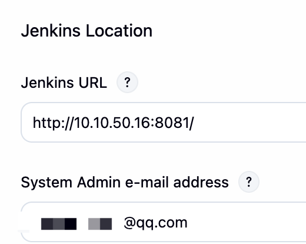

在 Jenkins 的 Extended E-mail Notification 中设置相应的值：

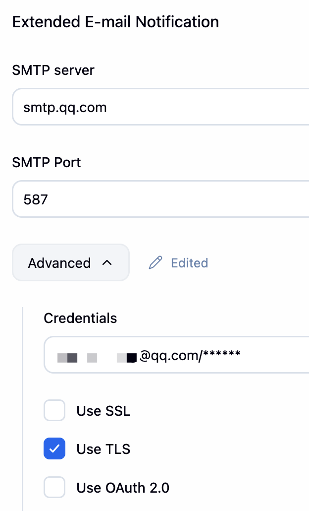

同时 Document Type 设置为 HTML

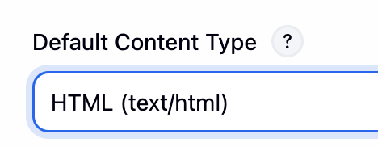

最终的 Pipeline 如下：

```groovy
pipeline {
    agent none
    environment {
        MINIO_HOST = 'http://<>MINIO_IP>:9000'
        TSG_ID = 'YOUR_TSG_ID'
        REGISTRY_URL = 'https://<registry-url>'
        MODELS_FOLDER= 'modelscan/unsafe'
        // Bucket name/folder name, also can be bucket name alone
        EMAIL_RECIPIENTS = '<sender-email@example.com>' 
        SECURITY_GROUP_UUID = 'YOUR_SECURITY_GROUP_UUID'
    }

    stages {
        stage('Hello') {
            steps {
                echo 'Hello World'
            }
        }

        stage('Download-Models') {
            agent { 
                docker { 
                    image '<registry-url>/modelscan/mc'
                    registryUrl "${REGISTRY_URL}"
                    registryCredentialsId 'harbor-credentials'
                    args '--entrypoint=""' 
                }
            }
            environment {
                HOME = '.'
            }
            steps {
                withCredentials([usernamePassword(credentialsId: 'minio-credentials', usernameVariable: 'MINIO_ACCESS_KEY', passwordVariable: 'MINIO_SECRET_KEY')]) {
                    sh '''
                      mc alias set minio ${MINIO_HOST} ${MINIO_ACCESS_KEY} ${MINIO_SECRET_KEY}
                      mc mb --ignore-existing minio/modelscan
                      mc cp --recursive minio/${MODELS_FOLDER} models/
                      ls -l models/*
                    '''
                }
            }
        }
        stage('Scan-Models') {
            agent {
                docker {
                    image '<registry-url>/modelscan/model-security'
                    registryUrl "${REGISTRY_URL}"
                    registryCredentialsId 'harbor-credentials'
                }
            }
            steps {
                withCredentials([usernamePassword(credentialsId: 'model-security-credentials', usernameVariable: 'MODEL_SECURITY_CLIENT_ID', passwordVariable: 'MODEL_SECURITY_CLIENT_SECRET')]) {
                    sh """
                    model-security \
                        --base-url https://api.sase.paloaltonetworks.com/aims \
                        scan \
                        --security-group-uuid "${SECURITY_GROUP_UUID}" \
                        --model-path models \
                        --model-uri 's3://10.10.50.16:9000/modelscan/models' \
                        --model-name "production-classifier" \
                        --model-author "ml-team" \
                        --model-version "v2.1" | tee scan_results.log 2>&1
                    """
                    sh '''
                    echo "Scan completed. Results saved to scan_results.log"
                    '''
                    
                    // Obtain Access Token
                    sh '''
                    ACCESS_TOKEN=\$(curl -s -d "grant_type=client_credentials&scope=tsg_id:${TSG_ID}" \
                        -u "${MODEL_SECURITY_CLIENT_ID}:${MODEL_SECURITY_CLIENT_SECRET}" \
                        -H "Content-Type: application/x-www-form-urlencoded" \
                        -X POST https://auth.apps.paloaltonetworks.com/oauth2/access_token | \
                        grep -oP '"access_token":\\s*"\\K[^"]+')
                    
                    echo "Access token obtained"
                    
                    # Extract UUID from scan_results.log
                    SCAN_UUID=$(grep -oP '"uuid":\\s*"\\K[^"]+' scan_results.log | head -1)
                    
                    if [ -n "\$SCAN_UUID" ] && [ -n "\$ACCESS_TOKEN" ]; then
                        echo "Fetching violations for scan UUID: \$SCAN_UUID"
                        curl -s -X GET "https://api.sase.paloaltonetworks.com/aims/data/v1/scans/\${SCAN_UUID}/rule-violations?skip=0&limit=100" \
                        -H "Authorization: Bearer \$ACCESS_TOKEN" \
                        -H "Content-Type: application/json" | jq '.' > scan_violations.json
                        echo "Violations saved to scan_violations.json"
                    else
                        echo "Could not retrieve scan UUID or access token" > scan_violations.json
                    fi
                    '''
                }
            }
        }
    }

    post {
        always {
            node('') { 
                script {
                    if (fileExists('scan_results.log')) {
                        def log = readFile('scan_results.log')
                        // Parse the JSON content from the log
                        def evalOutcome = sh(
                          script: """
                               grep -oP '"eval_outcome":\\s*"\\K[^"]+' scan_results.log || echo "Unknown Status"
                           """,
                        returnStdout: true
                    ).trim()
                        emailext (
                            subject: "Model Security Scan - Build #${env.BUILD_NUMBER} - ${evalOutcome ?: 'Unknown Status'}",
                            to: "${EMAIL_RECIPIENTS}",
                            attachmentsPattern: 'scan_results.log,scan_violations.json',
                            mimeType: 'text/html',
                            body: """
                                <h3>Build Info</h3>
                                <ul>
                                    <li>Status: <strong>${evalOutcome ?: 'Unknown Status'}</strong></li>
                                    <li>Build Number: ${env.BUILD_NUMBER}</li>
                                    <li>Build URL: <a href="${env.BUILD_URL}">${env.BUILD_URL}</a></li>
                                </ul>
                                <h3>Scan result</h3>
                                <pre>${log.take(5000)}</pre>
                                <p><em>Please see the attachments for complete logs.</em></p>
                            """
                        )
                    }
                }
            }
        }
        cleanup {
            node('') {
                sh 'rm -rf models scan_results.log scan_violations.json || true'
            }
        }
    }
}
```


# Gitlab 安装

## Gitlab 初始化

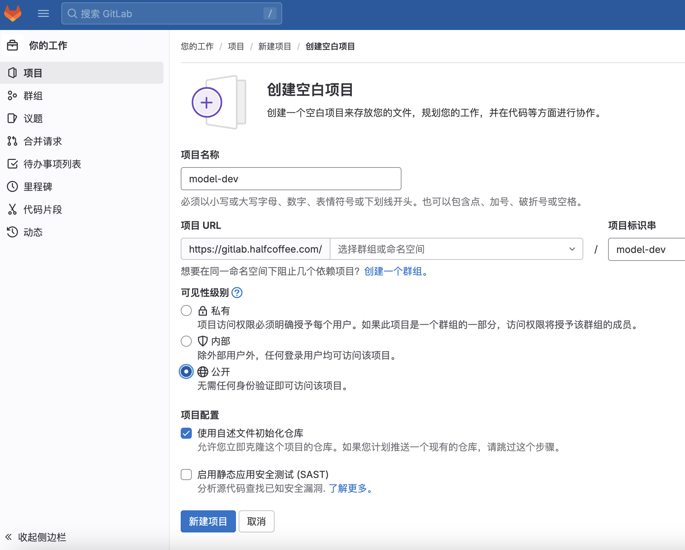

为项目设置令牌：

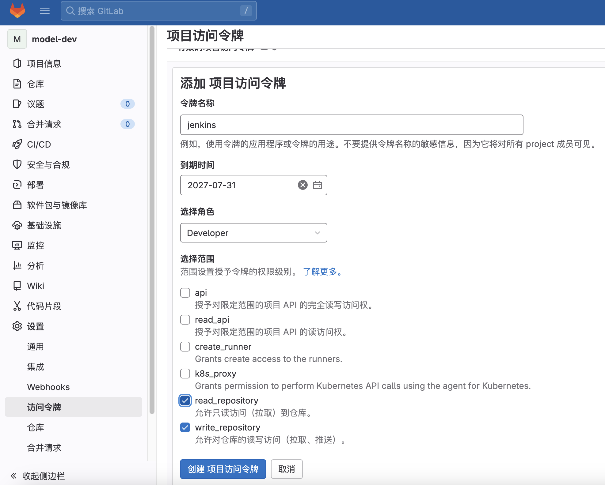


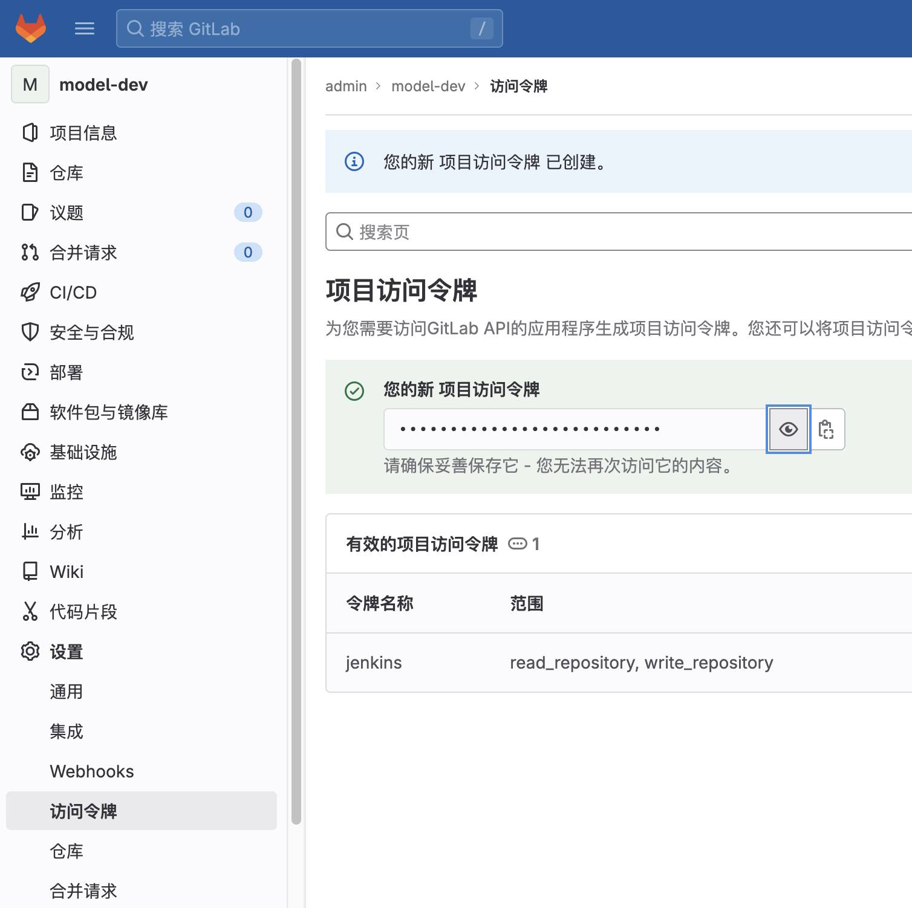


### Jenkins 对接 Gitlab（可选）

#### 设置全局令牌

在下列位置设置全局令牌，方便 Jenkins 对接。

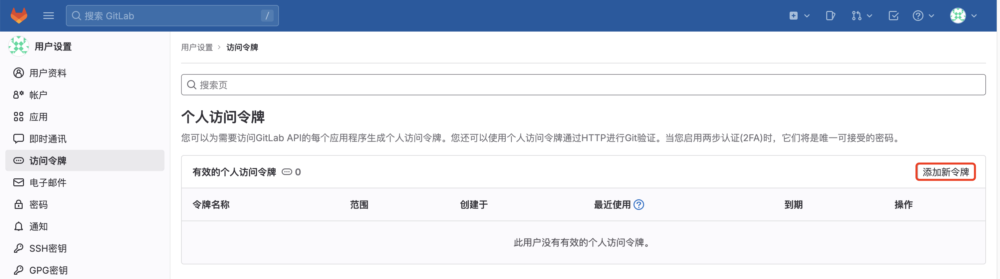

设置名称和权限：

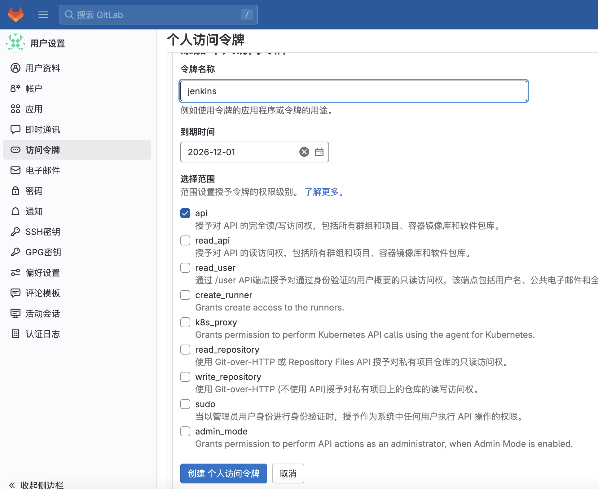


#### Jenkins侧配置

在 Jenkins 的下列位置设置 Gitlab 对接`http://<jenkins-ip>:8080/manage/configure#gitlab`


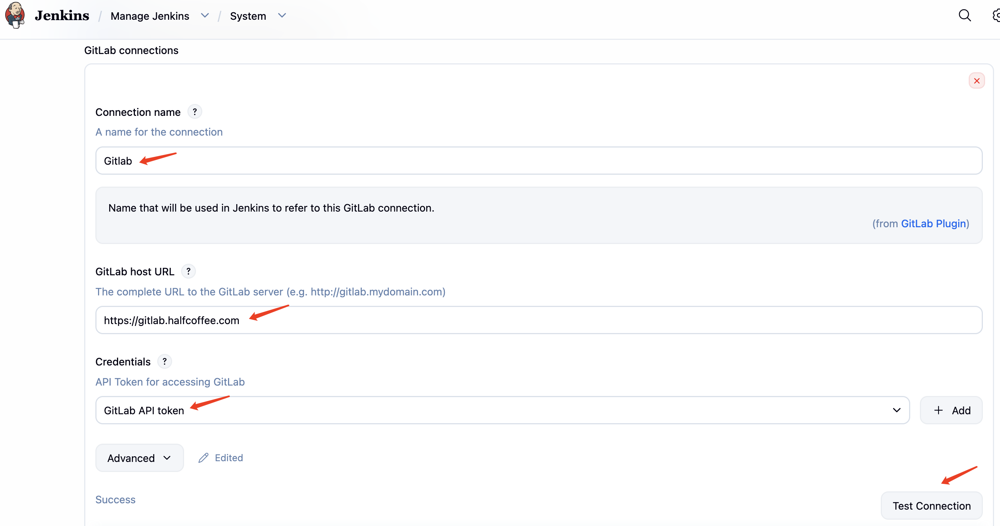


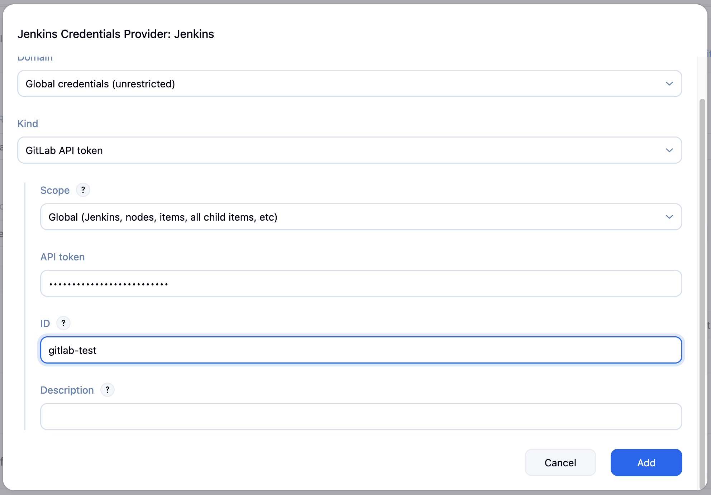


