# GlobalProtect 细节配置

{: .no_toc}

## 目录

{: .no_toc .text-delta }

1. TOC
{:toc}

 *看到这个标题，外企老司机可能都知道我想讲什么，其他小伙伴则可能感觉很陌生。*

# GlobalProtect 需要认证两次的问题  

## 问题描述

配置完 GlobalProtect 后，初次连接时都需要输入两遍用户名和密码。

## 解决办法

默认 GlobalProtect 有两个组件：Portal 和 Gateway，两个组件都需要经过认证，如果不做任何额外配置，则 Portal 和 Gateway 即使用同一个认证源，也需要分别认证。解决办法是在 Portal 认证完成后，让 Portal 生成 Auth Cookie，然后 Gateway 使用此 Cookie 进行认证。这样对于用户来说便可以实现仅做一次认证。（后端其实还会做两次）

## 具体配置

Portal具体配置：

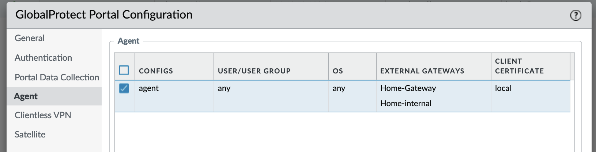

仅勾选“Generate cookie for authentication override”，加密证书使用一个私信的证书（已经提前导入到FW中）

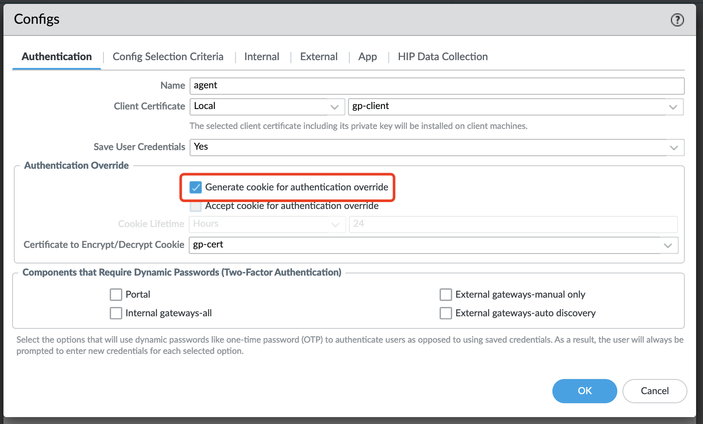

Gateway具体配置截图：

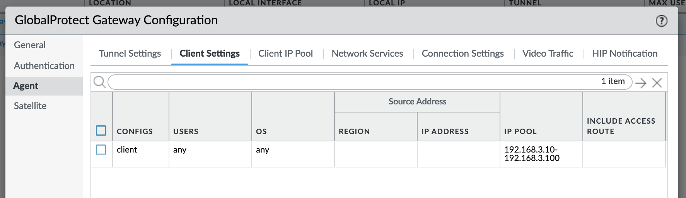

仅勾选“Accept cookie for authentication override”，解密证书使用一个私信的证书（已经提前导入到FW中）

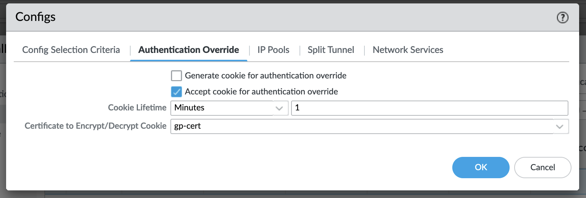

参考文档：

[https://live.paloaltonetworks.com/t5/general-articles/nominated-discussion-global-protect-authentication-happened-two/ta-p/518325](https://live.paloaltonetworks.com/t5/general-articles/nominated-discussion-global-protect-authentication-happened-two/ta-p/518325)

# 对接 Windows AD 进行用户认证

**前提条件：NGFW的管理口可以与LDAP/AD进行通信。**

## 添加 LDAP Server Profile

在下列位置添加 LDAP Server Profile：

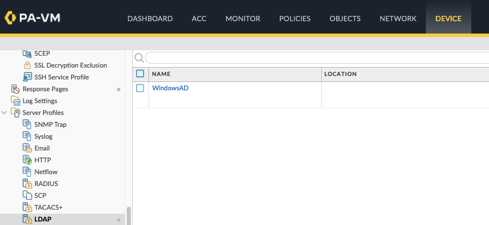

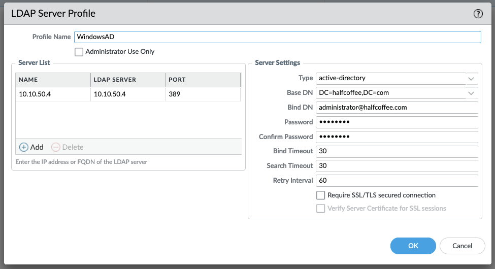

## 设置 Authentication Profile

在下列位置添加Authentication Profile：

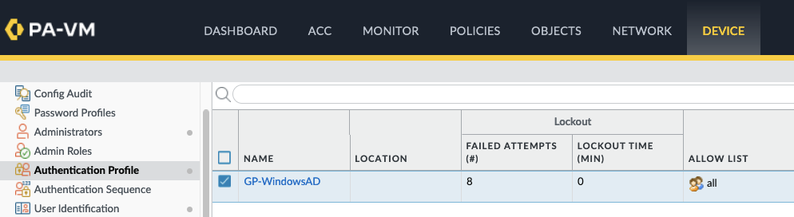

修改 Username Modifier 为 %USERINPUT%@%USERDOMAIN% 

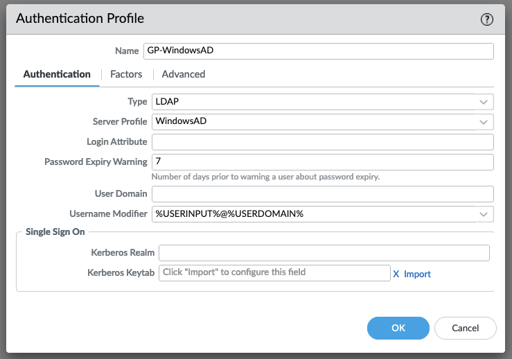

Allow list 设置 All：

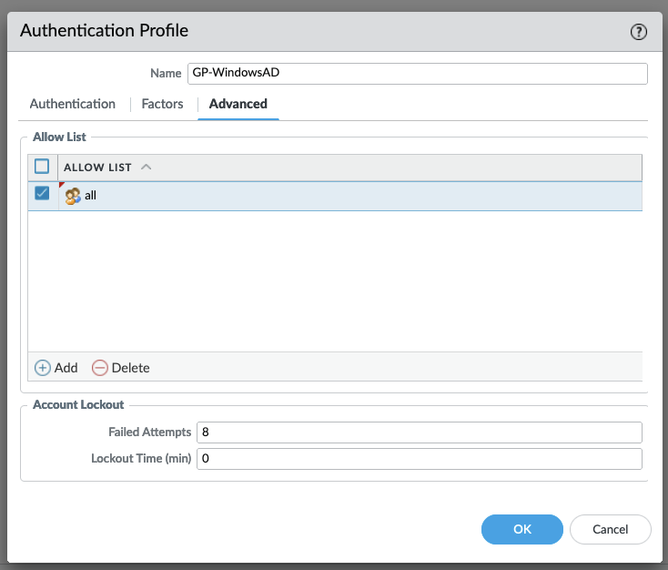

## 认证测试

客户端使用 AD用户可以进行认证，在防火墙中可以看到经过 LDAP 认证成功的日志：

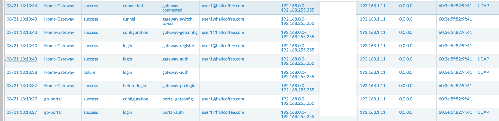

# 通过非管理口连接 LDAP

默认防火墙会使用管理口与 LDAP/AD 通信，在某些时候管理网和 AD 可能不在一个网络中，此时可以指定通信接口及 IP，具体配置位置如下：

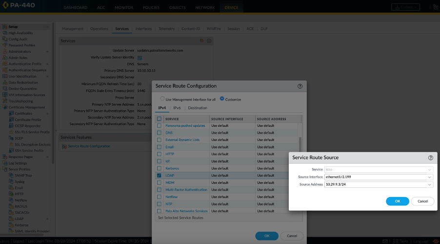

# Prisma Access 与 LDAP 对接

## Windows AD对接实现身份认证

配置前提：

需要通过RN或者SC打通Prisma Access到On-prem Windows AD的通信，否则无法进行认证。

### 添加Server Profile

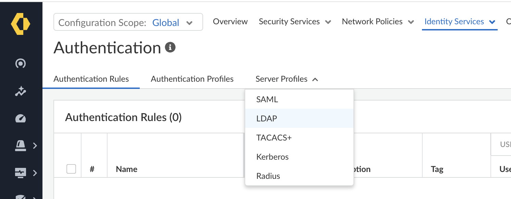

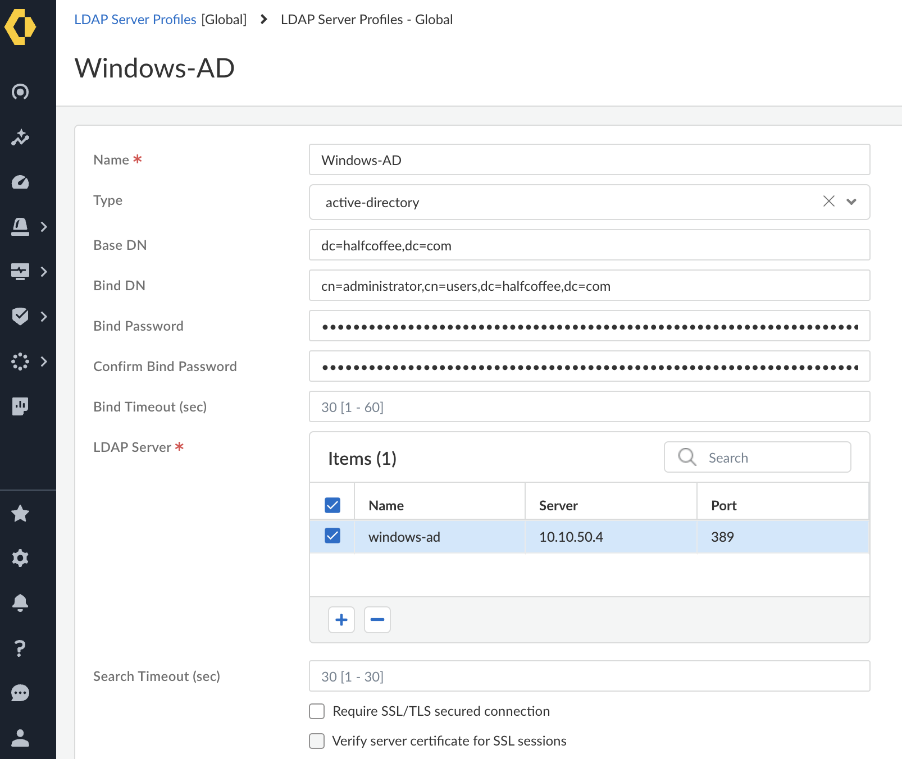

### 创建相应的Authentication Profile

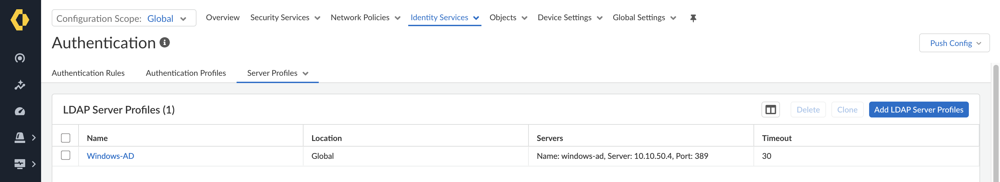

关联LDAP:

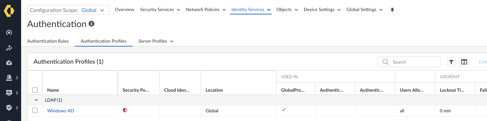

点开Show Advanced Options，添加**短域名**，其他保持默认配置：

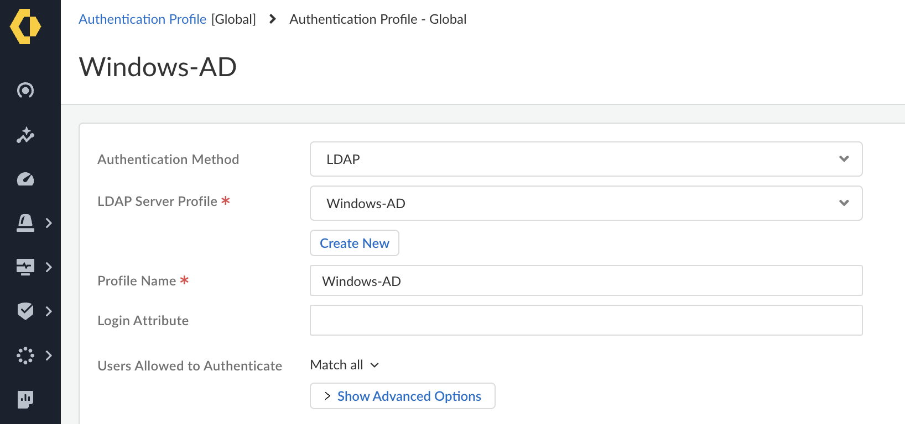

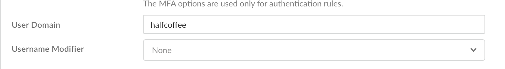 

### 用户认证测试

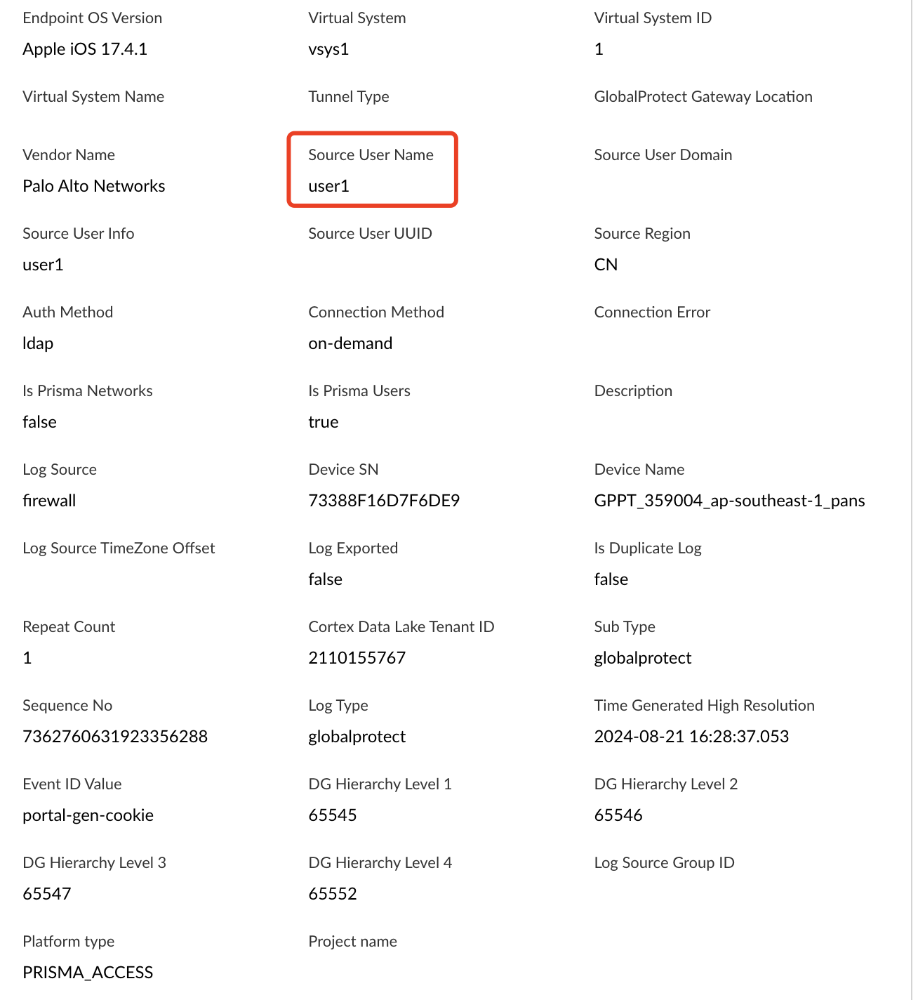

## 企业微信对接分析

搞了很久，没有很好地方式来做企业微信和 GP 的对接，总结下难点和思路：

- 企业微信用的不是标准的 SAML 或者 OIDC，不会提供 metadata，所以没有办法以原生的方式来对接
- 市面上有两个开源的 SSO 系统可以和企业微信对接，但是配置上都有些问题
  - Keycloak + 别人编写的企业微信插件。这种方式安装插件有点难度，需要自己编译插件...
  - Maxkey：自带企业微信集成，集成后可以用，但是 Maxkey 的 SMAL 对接有些反人类（菜单太多不知道填哪些，必选项不填都能保存...），搞不定

项目记录：

Keycloak 企业微信插件 1 号（需要 mvn 编译）：

https://github.com/Shuaihu-gitOrganization/keycloak-social-provider-work-wechat/tree/master

Keycloak 企业微信插件 2 号（需要 mvn 编译）：

https://github.com/potterhe/keycloak-services-social-wechatwork

Keycloak 企业微信插件 3 号（需要 mvn 编译）：

https://github.com/Jeff-Tian/keycloak-services-social-wechatwork?tab=readme-ov-file
