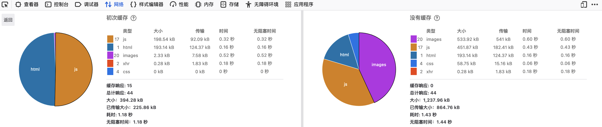

# Prisma Access 5.0 新功能介绍

{: .no_toc}

## 目录

{: .no_toc .text-delta }

1. TOC
{:toc}

## 概要

Prisma Access 5.0 于 2023 年 11 月正式发布。在此大版本更新中，产品引入了 App Acceleration、Remote Browser Isolation、SCM 统一管理等功能，具体的 Feature 清单详见：

[https://docs.paloaltonetworks.com/prisma-access/release-notes/5-0/prisma-access-about/new-features](https://docs.paloaltonetworks.com/prisma-access/release-notes/5-0/prisma-access-about/new-features)

下面我们详细介绍一些核心功能。

## App Acceleration

### Why App Acceleration？

如果要问 SASE 方案中有哪些挑战，那良好的用户体验一定位列其中，Prisma Access 架构下，可以让任意用户、任意设备安全地接入网络，访问企业 On-prem 的资源和各类 SaaS 服务，在大规模部署中，因为用户分散在各处，而每个用户可能使用不同的移动设备，接入不同的网络，而这些差异化配置可能使得不同用户有不同的访问体验。

而在另一方面，企业的业务系统也逐渐变得复杂，各类 Web、视频、语音、IoT 系统分布在各处，而不同性质的业务对于网络的开销、延迟有着不一样的需求，如何让应用以最优的方式交付给用户变得尤为重要。

为了简化 SASE 架构中用户访问体验管理，Prisma Access 在 2.0 版本引入了 ADEM 功能（Autonomous Digital Experience Management），ADEM 是一项综合**实时用户数据**和**模拟数据**的监控方案，ADEM 可以让管理员以图形化的方式知晓任意用户的访问情况，并帮助管理员快速定位可能影响用户访问体验的问题。

ADEM 会从三个维度对访问情况进行鉴定：

- 终端监控：比如终端上 CPU 及内存资源的使用情况，WiFi 质量、延迟等情况
- 合成监控：定期主动发送流量进行探测，记录访问路径中发现的问题，比如某一时间段的拥堵等
- 真实用户流量监控：基于真实的用户请求记录性能数据，比如应用响应速度等

ADEM 可以帮助管理员发现并解决很多基础架构侧的问题，但很难管理到终端以及应用侧的问题，于是有了 App Acceleration 这一特性。

### 何为 App Acceleration

在一个完整的访问会话中，请求可以分为三段：

- 终端侧：从用户终端发出到网关

- 传输侧：从网关发出到互联网

- 应用侧：从互联网侧接收请求，应用处理并响应请求

中间传输侧由 Prisma SASE 提供高速的访问连接，而终端侧以及应用侧很多时候不可控，于是访问问题可能发生在这两侧。

**App Acceleration 可以分别从 Client 端和 App 端两侧进行访问加速，以此提升用户访问体验**。

在具体的实现上，Client 侧和 App 侧使用不同的技术加速，我们分开说明：

### Client 侧加速

不知道大家使用迅雷等下载软件时有没有注意过一个现象，经常在下载文件时，初始的下载速度都挺慢，随着时间推移慢慢涨到一个峰值，然后再下降一些稳定下来，这背后的工作机制实际上是一个很基础的网络特性：**TCP 滑动窗口**，TCP 这一设置可以很好地避免网络拥塞，减少丢包，但这也会造成一定程度的“访问慢”的问题。

试想一下，如果应用在发包时，可以直接以最高速度传输，而省略掉 TCP 的“滑动”，那势必可以提升网络速度（此处是提升单位时间内可传输的数据量，而非降低传输延迟）。

App Acceleration 在 Client 侧的加速，就利用了类似的原理，前面提到 ADEM 可以分析每个会话的访问情况，如果基于这些访问数据进行实时计算，便可以实现对每个会话实时的 TCP 优化，用户体验会得到大幅的提升。

### App 侧加速

网站访问加速不是什么新奇的技术，常年混迹于 IT 行业的老司机肯定听说过 CDN、广域网加速等技术，一个网站会由很多元素组成，有些元素是静态的，比如图片、文件、CSS 等，有些内容则是计算生成的，无论 CDN 还是广域网加速器，其背后的原理都很简单：**对静态资源进行缓存，就近传输或者减少源站传输**。

*（下图为使用缓存和不使用缓存时访问时间对比）*

两种技术都有各自的限制：

- 广域网加速器需要配对使用，通常只能用在分支和总部互联段，如果用户通过互联网接入，则不能享受广域网加速的特性
- CDN 依赖于应用提供商，用户不能根据自身需求随意增加 CDN 节点（比如一些海外 SaaS 在国内可能并没有 CDN 节点，用户每次请求必须回到海外源站）；CDN 资源并不是实时更新的，用户看到最新的资源会有一定延迟

App Acceleration 则使用一种创新的加速技术：**Cache-less 加速**，其工作原理有些类似 CDN，也是预先将资源加载到用户就近的站点，但 Cache-less 并不像 Cache 一样有 Aging time，而是根据用户行为实时将所需的资源预先加载到 Prisma Access 边缘节点，在用户真实进行访问时快速将所需的资源交付给用户。

举个简单的例子：

- 用户 1 是 Sales 人员，登录 Salesforce，后台会自动先将 Salesforce 主页的内容进行预加载，用户登录后便可快速看到主页的内容；通常 Sales 会在 Salesforce 中查看项目，于是系统可能自动将项目相关的静态资源进行预加载。

这时候你可能会问，系统如何预测用户要访问哪些资源？

这背后实际上会**基于真实用户的访问进行机器学习**，有了 AI 的加持，系统自然能够准确地预测用户行为，进而做出更好的访问优化。

### 总结

在使用了 App Acceleration 的两端加速技术后，用户整体访问速度会有 1~4 倍的提升， 而且对于共享 WiFi 等低质量网络环境有更高的容忍性。

下面展示一个具体的测试数据，在用户远程访问云端的文件共享时，文件传输速度最大得到了 4 倍的提升。

## Remote Browser Isolation

增强 Web 访问安全一直是企业安全建设的重中之重，在 Web 访问保护中，也有两个部分需要防护：

- Web 应用本身的保护：保证 Web 网站免受 XSS、SQL 注入、CSRF 等攻击
- 用户侧保护：避免用户访问钓鱼网站、挂马网站，保证终端的安全

我们重点看看用户侧的保护。

网络安全以及终端安全无法 100% 保证用户安全，大部分攻击可能来自于访问恶意网站/被攻击的网站，通常只需要一次成功的攻击，整个终端可能被攻破，进而进入内网影响到其他设备。
