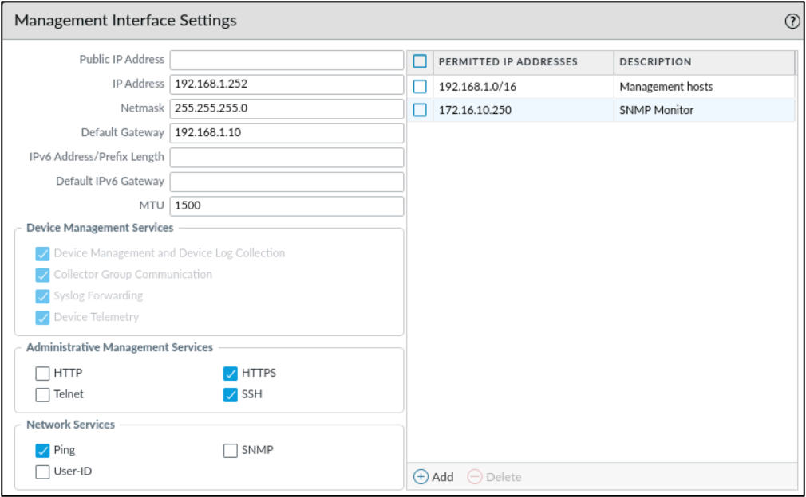
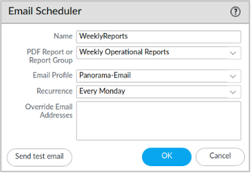

# Panorama 管理

{: .no_toc}

## 目录

{: .no_toc .text-delta }


1. TOC
{:toc}

## Panorama 可以干什么？

Panorama 是 Paloalto 防火墙的统一管理工具，通过 Panorama 可以实现下列功能：

- 配置 template 和 device group，将配置批量推送到多个位置的防火墙，支持差异化配置
- 从防火墙收集数据进行分析和展示
- 统一收集防火墙的日志（日志也可以交给专门的日志服务器，或者 Panorama Log Collector Mode）
- 推送软件更新、内容包更新、License 信息
- 可以将 Panorama 配置为统一的 User-ID 信息源，从多个防火墙收集 user-IP 映射信息，并将其同步到所有设备（[User-ID Redistribution](https://docs.paloaltonetworks.com/panorama/9-1/panorama-admin/panorama-overview/user-id-redistribution-using-panorama)）


单个 Panorama 最大可以管理 5000 台防火墙。

Panorama 的管理 IP 只能是静态 IP，**不支持 DHCP**，默认会配置为 192.168.1.1。


**Panorama 部署模式：**

- [物理设备](https://www.paloaltonetworks.com/apps/pan/public/downloadResource?pagePath=/content/pan/en_US/resources/datasheets/panorama-centralized-management-datasheet)：M-200、M-300、M-600、M-700 等硬件
- 虚拟设备：在虚拟化中部署，可以是私有云或者公有云（安装包可以在 CSP 中下载）


**Panorama 运行模式：**

- Panorama Mode：默认模式，管理+日志功能
- Log Collector Mode：仅收集日志
- Management Mode：仅进行管理

## Panorama 初始化

**两种 License：**

- Device Management License：最多可以管理多少设备，有 25、100、1000 三种 license
- Support License：软件更新、Content Update（App-ID、URL 库等）


**新设备需要通过 CSP 激活，有两种方式：**

- 联网激活，设备从 License server 获取 License key
- 非联网环境，从 CSP 下载 License 文件，上传到设备中


如果用户购买了新的 Panorama Feature，系统会给用户发一个 authorization code，通过此 authorization code 即可激活新功能。


在完成注册后，建议先升级 Panorama 以及 Dynamic update 到推荐的版本。升级软件需要重启，一般需要 5+ 分钟。


同时建议参照下列文章设置定期的 Panorama Dynamic update：

[https://knowledgebase.paloaltonetworks.com/KCSArticleDetail?id=kA10g000000ClaECAS](https://knowledgebase.paloaltonetworks.com/KCSArticleDetail?id=kA10g000000ClaECAS)


### 基础 Service 配置



## Panorama Plugin

用于和其他环境集成，比如：

- 统一管理 Prisma Access（Cloud Services）
- 管理 Paloalto SD-WAN
- 对接 Docker、Kubernetes 环境
- 对接 AWS 等云环境
- 连接其他 Panorama （Panorama Interconnect）


## 通过 Panorama 管理防火墙

### 将防火墙添加到Panorama

在 Panorama 中添加 Device：


**在 Panorama 中 Commit to Panorama。**


接着，在防火墙中配置 Panorama：

返回防火墙管理页，在下列界面设置 Panorama 信息，如果 Panorama 是主备模式，需要同时填写两台 Panorama 的 IP。


**之后在防火墙中 Commit 配置**。


### 配置变更

Panorama 及 PAN-OS 都有 Management 和 Data Plane：

- Management Plane：保存 candidate config，即当前用户做的一些变更
- Data Plane：保存 Running/active config


在 Panorama 中有三个操作：

- Commit to panorama：配置保存到 Panorama 的 data plane
- Push to devices：将配置推送到 Device 的 Data plane
- Commit and push：同时将配置保存到 Management 及 Data Plane


**冲突避免：**

Panorama Enterprise admin 和 FW Local admin 都可以 push 配置，默认会启用“Merge with device candidate config”，所以配置最终会合并。如果取消勾选，则 Panorama 覆盖 Local 的配置。


### Auto rollback

如果在 Panorama 下发了配置导致防火墙无法连接到 Panorama，则防火墙 **默认 10 秒后**会自动进行配置回滚。(该配置在防火墙的 Mangement 菜单中)


### 为新防火墙克隆已有设备的配置

假如要进行防火墙替换，需要将旧防火的配置迁移到新的防火墙。


操作步骤：

- 添加防火墙
- 从旧设备导入配置到 Template
- 修改配置
- Commit & push 配置到设备中


### 添加已有的防火墙

已有防火墙已经有很多配置，需要添加到 Panorama 进行统一管理。步骤与上面的类似，需要导入设备配置（放在 Template 中），进行编辑后再推送。


导入完成后，在相应的 Device Group 中即可看到防火墙上已有的配置：


推送时，需要选择 Force Template Values，覆盖设备已经有配置。

### 备份管理


### Dynamic updates

Panorama 以及防火墙均需要 dynamic updates，因为 Panorama 的配置需要基于 dynamic updates 中的特征库进行。

通过 Panorama，可以设置定期为防火墙更新 Dynamic updates：


## Templates 及 Device Group

默认 Panorama 没有类似于 PA 防火墙的 Policy & Objects 以及 Networks & Device 配置页面，可以通过在 Panorama 配置 Template 以及 Device Group 来启用这些配置。


## Templats

在 Template 下，支持配置下列元素：

**Networks：**

- 接口配置、IP 地址
- Zone
- Virtual Routers
- IPsec、GRE 等

**Device：**

- Auth profile
- Service profile
- 设备证书
- User-ID
- HA 配置
- 角色等


在复杂的环境中，不同位置的设备可能需要不同的配置，于是需要多个 Template，比如：

- Global Template：全局通用的配置
- Shanghai Template：特定地区的配置，比如不同的 syslog server
- Beijing Template：特定地区的配置，比如不同的 syslog server


### Template stack

为了简化 Template 的下发，多个 Template 可以聚合成 Template Stack，比如：

- Shanghai Template Stack：包含 Global Template+Shanghai Template
- Beijing Template Stack：包含 Global Template+Beijing Template


每个 Template 最多可以包含 8 个 Template。全局最大可以有 1024 个 Template Stack。


在一个 Template Stack 中，多个 Template 有生效顺序，**最上面的优先**，所以应该将特定设备的 Template 放在通用 Template 上方。


一个详细的示例：


### 推送配置

点击 Panorama 的 Push 后，可以点击“Edit Selections”选择要将配置推送哪些 Device 或者 Device Group（Device Group 介绍见下个章节）：


推送配置时，有两个选项可以调整“Merge with Device Candidate Config”（与设备上未push的配置进行合并） 以及“Force Template Values”（强制用 Template 中的值替换设备中的配置）：


### Template Variables

对于不同位置的设置，其网络配置可能有差异，比如接口的 IP 等，如果使用不同 Template 来区分这些配置，则可能需要数个 Template。

Template Variables 特性可以将这些差异化配置设置成变量，然后通过 csv 导入变量在不同设备上的值，最后在配置 Template 时统一调用。


参考文档：

[https://docs.paloaltonetworks.com/panorama/11-1/panorama-admin/manage-firewalls/manage-templates-and-template-stacks/import-and-overwrite-existing-template-stack-variables](https://docs.paloaltonetworks.com/panorama/11-1/panorama-admin/manage-firewalls/manage-templates-and-template-stacks/import-and-overwrite-existing-template-stack-variables)


具体配置步骤如下：

1、在 Templates>Template Stack 中申明变量（比如设置一个接口 IP）：


2、设置变量名称以及默认值（默认值可以留空）


3、在 Panorama>Templates>Template Group 中批量导出变量为 csv 文件，修改 csv 文件内容后再将其导入：


## Device Group

Device Group 下，支持配置下列元素：

**Policies：**

- 安全策略
- NAT 策略
- PBF 策略
- Decryption 策略
- Authentication 策略等

**Objects：**

- Address
- Application & Application Group
- Global Protect
- Service & Service Group


默认全局有个 Shared Group，所有的 Device Group 必须在 Shared Group 内。

一个设备只能属于一个 Device Group，设备可以从一个 Group 移动到另一个 Group。


全局最多 1024 个 Device Group，Device Group 最多可以创建四个层级（不含 Shared），下面是一个层级利用示例：


### 引用模板

某些情况下设备还未被加入 Panorama，管理员想预先设置一些规则，此时可以使用 Template 来定义 Zone 的配置，然后在 Device Group 中引用该 Template，这样就可以来定义防火墙规则。


### Objects 管理

添加 Address 对象：


添加 Log Forwarding 策略：


当一个对象标记为“Shared”后，则所有其他 Device Group 都能看到此对象：


### 防火墙规则管理

在 Panorama 管理下防火墙规则的执行顺序：

- 父 Device Group 规则会被继承到子 Device Group
- 父 Device Group 的规则优先于子 Group 中的规则
- Pre rules 总是优先于 Post rules
- FW 本地规则总是在 Panorama 推送的 Pre rules 之后，在 Post rules 之前被执行（即夹在中间）


在 Global Device Group 添加一个规则，会被**自动继承到子 Device Group 中**。

比如在 Global-DG 添加规则：


会继承到子 Chicago-DG：


直接登录防火墙，可以看到规则被自动添加到已有的规则前面：


规则由上至下执行（**父 Device Group 的规则优先于子 Group**）


**Pre rules 总是优先于 Post rules**：


**FW 本地规则总是在 Panorama 推送的 Pre rules 之后，在 Post rules 之前**：


所有规则在一起的执行顺序（可以通过策略下面的 Preview Rules查看所有规则在一起的顺序）：

- Global-DG pre rules : blck-bad-ips
- Chicago-DG pre rules : Allow-syslog-server
- FW local rules : deny-printer-access-users
- Chicago-DG post rules
- Global-DG post rules
- Default rules


### Policy Rulebase Settings

通过 Policy Rulebase Settings 可以调整设置防火墙策略时，哪些选项是强制必填的。


比如勾选“Require description on policies”，强制让用户输入规则的描述，方便未来管理：


做完上述配置后，用户在配置防火墙规则时，Description 会变为必填项：


## 日志

防火墙有两种日志类型

- **System/configuration log**：所有未穿越防火墙的流量
  - 比如在 IPsec 隧道中，如果 Phase-1 或者 Phase-2 协商失败，则日志会出现 System Log 中
- **Traffic log**：所有穿越了防火墙的流量
  - 比如 IPsec 隧道建立完成后，但是因为缺少路由，访问不通


日志默认保存在防火墙上，但防火墙本身存储空间有限，因此通常需要将日志转发到外部：

- 发送到 Panorama：如果 Panorama 是 HA 主备部署，则日志需要同时发给两台 Panorama
- 发送到 CDL：发送到云端 Cortex Data Lake 服务
- 发送到其他外部 Syslog 服务器、SNMP 服务器等


两个设置日志转发的位置：

- Log setting（在 Device 页面）：用于转发 System log
- Log Forwarding profile（在 Objects 页面）：用于转发 Traffic log


下图为配置 System log 转发的位置：


下图为将日志转发到 Panorama：


### 将 Panorama 日志转发到外部

额外地，可以将 Panorama 的日志转发到外部进行存储或分析。

1、在下列位置“Panorama>Server Profiles>Syslog”设置 Server Profile：


2、在“Panorama>Log Settings”中设置日志转发：


### 日志查看器的基本使用

在 Monitor 页面中，可以按照日志类型查看各类日志。


如果需要过滤，可以直接点击相应的元素（比如 Source 及 Destination IP）进行过滤：


也可以点击右上角的添加图标，通过 Log Filter 设置过滤：


日志可以被导出为 csv 格式，通过外部编辑器查看：


## 报告

### 查看和导出报告

同防火墙一样，Panorama 可以导出报告，默认系统有很多预设报告，点击后选择时间即可查看或导出。


也可以在下列位置设置自定义报告：


按照需求设置完成后点击“Run Now”可以立即查看并导出自定义的报告：


### 系统内置的每日报告

系统默认每天会生成一个综合报告，在下列位置可以获取到：


如果想自定义这个综合报告，可以在下列位置添加新的 Summary Report（设置完后需要等待 24 小时才可以看到的新的报告）：


### 定期报告及导出

可以设置 Report Group，将多个预设/自定义的 Report 放在一起，然后定期导出。

在 Panorama>PDF Reports>Report Group 中新增 Group：


在 Panorama>PDF Reports>Email Scheduler 中新增定时通过邮件发送 PDF 报告：



## 账户管理

### 本地账户

如果环境中只有少数几个管理员，可以使用 Panorama 的本地账户来进行认证和授权。

具体配置位置如下：


在添加新用户时有两个菜单可以控制管理员可访问的范围以及角色：

**Administrator Type：**

- Dynamic：可管理 Panorama 以及 Panorama 管理的防火墙
- Custom Panorama Admin：创建自定义 Admin Role，限制其可使用的功能
- Device Group and Template Admin：可管理指定的 Device Group、Template 


**Admin Role：**默认有三个角色，但可以根据需求自定义

- Superuser：最高权限的管理员，可控制所有东西
- Superuser（read only）：只读权限
- Panorama administrator：仅可管理 Panorama，不能管理 Panorama 下的防火墙


### 外部认证源

在大规模部署时，可能需要和外部身份认证源对接，简化授权管理。此时需要进行三项配置：

**Server Profile：**

- 定义外部认证服务器的信息，比如 IP、Server 名、Server 类型等

**Authentication profile**：

- 定义域名、SSO 细节配置、账户锁定策略等

**Authentication sequence**（可选）：

- 如果有多个 Authentication Profile，可以用此配置设置认证优先级


## 排错相关

### 连接状态

在 Panorama>Managed Devices>Summary 中查看设备状态：


命令行中：

```shell
show devices all
```


在防火墙侧查看连接状态：


命令行中：

```shell
show panorama-status
```


### FW 到 Panorama 的防火墙规则

如果防火墙通过带内接口访问 Panorama，需要放行防火墙到 Panorama 的流量，可以使用防火墙内置的 panorama application 来定义防火墙规则：


### 查看 Push 失败原因

在右下角的 Tasks 中可以查看规则 Commit and Push 的状态：


### 常用命令

```shell
ping count 5 source 10.10.50.125 host 10.10.50.15
```


```shell
tcpdump filter "host 10.10.50.15"
```


