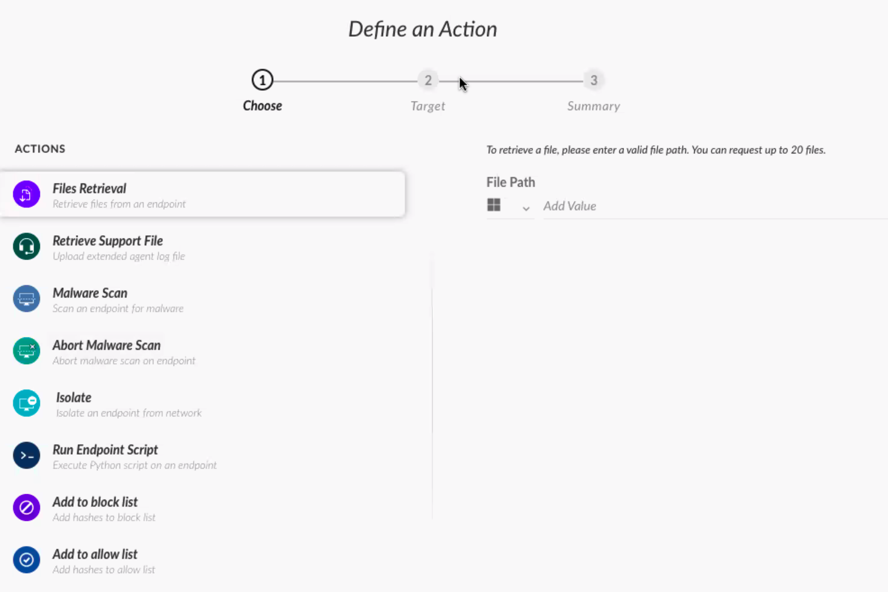

# XDR

{: .no_toc}

## 目录

{: .no_toc .text-delta }


1. TOC
{:toc}

## XDR 组件

### XDR Instance

云端的管理组件，提供 Endpoint 管理、事件调查、事件响应

### XDR Agent

部署在终端的软件，支持 On-prem 或者云端的主机。

功能：

- 阻止威胁，保护终端

- 将事件上传到 XDR 进行分析


# 恶意软件保护

## 各种威胁类型及防护


## 定期扫描

默认在具备 XDR 基于运行行为的检测后，可以不使用传统的定期扫描，但是 XDR 也支持定期扫描。


在日志中，定期扫描的恶意文件会标记为 Scanned，initial by 是空的。


## 手动扫描

用户也可以在文件浏览器中启动手动扫描“Scan with Cortex XDR”


# 漏洞保护 Exploit Prevention

## 漏洞类型

- 应用程序漏洞：
  - 利用应用的漏洞，执行一系列的漏洞利用操作，获得到达内核的途径
  - 一般是到达内核的桥梁
  - 较容易阻止 0day 漏洞利用
- 内核漏洞：
  - 利用内核本身的漏洞
  - 直接去尝试访问内核
  - 很难防范


## 进程的虚拟地址空间（virtual address space）

进程的虚拟地址空间通常包括以下几个部分：

1. **代码段（Text Segment）**：也称为可执行代码段，包含进程的可执行指令。在这个段中，存储了程序的机器语言指令，用于执行程序的逻辑。
2. **数据段（Data Segment）**：包含已初始化的全局变量、静态变量和常量。这些变量在程序运行时保持不变。
3. **堆（Heap）**：用于动态分配内存空间，通常在堆中通过malloc()、calloc()、realloc()等函数动态分配内存。
4. **栈（Stack）**：用于存储局部变量、函数参数、返回地址以及函数调用时的上下文信息。栈是一种后进先出（LIFO）的数据结构。
5. **共享库区域（Shared Libraries Area）**：包含共享库和动态链接库（DLL）等共享的代码和数据，多个进程可以共享这些库，减少内存占用。
6. **内核空间（Kernel Space）**：用于存储操作系统内核的代码和数据结构，用户进程无法直接访问内核空间。

这些部分构成了进程的虚拟地址空间，每个部分在内存中有不同的地址范围，通过内存管理单元（MMU）和操作系统的虚拟内存管理来实现地址空间的映射和管理。不同的操作系统和架构可能会有一些细微的差异，但通常这些部分是构成进程虚拟地址空间的基本组成部分。

## 攻击手段

### 缓冲区溢出 Buffer overflow 

当程序向一个固定大小的缓冲区写入超过其容量的数据时，多余的数据会溢出到相邻的内存区域，覆盖那里存储的数据或者控制信息。攻击者可以利用这种情况来修改程序的执行路径，执行恶意代码或者获取敏感信息。

缓冲区溢出漏洞通常是由于程序员未正确验证输入数据的长度或者缺乏对缓冲区边界的检查而导致的。

为了防止缓存区溢出攻击，程序员应该采取一些措施，如使用安全的编程语言、正确验证和限制输入数据的长度、使用安全的函数来处理字符串操作等。安全意识培训和代码审查也是预防 buffer overflow 漏洞的重要措施。


### 通过 NOP Sled 增强缓冲区溢出攻击

**NOP sled**，也称为 **NOP slide** 或 **NOP ramp**，是一种在计算机安全领域使用的技术，用于在软件漏洞利用中引导程序执行。它由一系列 **NOP**（No-Operation）指令组成，这些指令没有实际操作，只是占用内存空间。

NOP sled 的工作原理如下：

1. 攻击者首先确定程序中存在漏洞，该漏洞允许攻击者控制程序的执行流。
2. 攻击者在漏洞附近注入一段恶意代码，例如 shellcode。
3. 在 shellcode 之前，攻击者插入一个 NOP sled。
4. 攻击者利用漏洞将程序的返回地址指向 NOP sled。
5. 程序执行 NOP sled 中的指令，直到遇到 shellcode。
6. 程序执行 shellcode，从而让攻击者控制程序。

NOP sled 的主要作用是：

- **增加攻击的成功率：** 由于 NOP sled 的存在，即使返回地址发生轻微偏移，程序仍然可以找到 shellcode 并执行。
- **隐藏恶意代码：** NOP sled 使得恶意代码更难被发现和分析。

### ROP攻击

ROP（Return-Oriented Programming）攻击是一种高级的计算机安全攻击技术，用于利用程序内已存在的代码片段（称为"gadgets"）来构建恶意代码执行路径，从而绕过传统的内存保护机制，实现对系统的攻击。

在 ROP 攻击中，**攻击者不会像传统的代码注入攻击那样直接向内存中注入完整的恶意代码**。相反，攻击者会利用程序本身已有的代码片段，如函数的返回指令等，将这些片段组合成一系列执行路径，以执行恶意操作，比如执行系统调用、修改数据或者启动其他恶意代码。

ROP 攻击的主要特点包括：

1. **无需注入新代码**：攻击者利用程序已有的代码片段，而不是向内存中注入新的恶意代码。
2. **绕过内存保护**：通过构建合适的代码执行路径，攻击者可以绕过数据执行保护（DEP）和代码签名等传统的内存保护机制。
3. **利用代码重用**：ROP 利用程序已有的代码片段，通过组合这些片段来构建攻击载荷，从而实现攻击目的。
4. **难以检测**：由于 ROP 攻击利用合法的程序代码片段，使得其在传统的恶意代码检测技术中难以被发现。

为了防范 ROP 攻击，安全专家采取了多种防御措施，包括使用堆栈保护技术（如堆栈金丝雀）、地址空间布局随机化（ASLR）、执行流程完整性（Control Flow Integrity）等技术，以增强系统的安全性，防止受到 ROP 攻击的威胁。

### DEP Circumvention（DEP绕过）

DEP Circumvention（DEP绕过）指的是攻击者利用各种技术手段绕过系统的DEP保护，成功执行恶意代码。

DEP 绕过技术通常需要攻击者利用系统或应用程序中的漏洞，以在受保护的内存区域中执行恶意代码。

一些常见的DEP绕过技术包括：

1. **Return-Oriented Programming (ROP)**：通过构建代码片段的执行路径，攻击者可以绕过DEP保护，利用程序内已有的代码片段执行恶意操作。
2. **Code Reuse Attacks**：类似于ROP，攻击者可以重用程序中的代码片段，以执行恶意操作而不受DEP的限制。
3. **Just-In-Time (JIT) Spraying**：攻击者可以利用浏览器或插件等技术，在内存中放置大量可执行代码，通过JIT编译器执行这些代码，从而绕过DEP。
4. **Memory Corruption Exploits**：攻击者可以利用内存损坏漏洞，修改内存中的指针或函数指针，以执行恶意代码。

为了防范DEP绕过攻击，安全专家通常建议结合使用其他安全技术，如地址空间布局随机化（ASLR）、堆栈保护（stack canaries）、执行流程完整性（Control Flow Integrity）等，以提高系统的整体安全性，并减少DEP绕过攻击的成功率。

## 防护手段

### Stack Canaries 缓存区溢出防护

Stack canaries（堆栈金丝雀）是一种用于防止缓冲区溢出攻击的安全机制。在程序执行期间，堆栈金丝雀是一种特殊的数值或标记，被插入到函数的栈帧中，位于函数返回地址之前。当函数执行完毕时，系统会检查这个值是否被修改，如果发现被修改，就会意识到栈已经受到破坏，可能发生了缓冲区溢出攻击。

如果程序中的缓冲区溢出攻击试图修改堆栈中的数据，包括覆盖堆栈金丝雀，系统就会检测到这种异常情况，并采取相应的防御措施，例如终止程序执行或者触发警报。

通过使用堆栈金丝雀，程序可以在运行时检测到潜在的缓冲区溢出攻击，从而提高程序的安全性。这种技术已经被广泛用于许多操作系统和编程语言中，作为一种重要的安全措施，帮助防止恶意攻击者利用缓冲区溢出漏洞来执行恶意代码。

### DEP

数据执行预防（Data Execution Prevention，简称 DEP）是一项安全功能，旨在防止恶意软件利用缓冲区溢出等漏洞执行恶意代码。DEP工作原理是将内存区域标记为不可执行，这样即使攻击者成功将恶意代码注入到这些区域，系统也会拒绝执行它们。

DEP 技术的主要目标是防止缓冲区溢出攻击，其中攻击者试图向程序的缓冲区写入超出其分配内存范围的数据，以覆盖关键数据结构或返回地址，并最终执行恶意代码。DEP 可以有效地减少这类攻击的成功率，提高系统的安全性。

### ASLR - 防止 ROP

地址空间布局随机化（ASLR，Address Space Layout Randomization）是一种计算机安全技术，旨在增加操作系统和应用程序的安全性，防止恶意攻击者利用已知的内存布局信息进行攻击。

ASLR 的主要原理是在系统启动时随机化操作系统和应用程序的内存布局，包括堆、栈、共享库、内核和其他内存区域的地址分配。通过随机化内存布局，ASLR 使得攻击者难以准确地预测系统中各个组件的内存地址，从而增加了攻击者成功利用漏洞进行攻击的难度。

尽管 ASLR 技术可以有效地增加系统的安全性，但并非绝对安全，因为存在一些攻击技术可以部分绕过 ASLR 的保护。因此，建议在使用 ASLR 的同时，结合其他安全措施，如堆栈保护（stack canaries）、数据执行防止（DEP）等，以提高系统的整体安全性。

## XDR 漏洞保护模块 EPM

| 攻击类型（漏洞利用手段）     | 防护模式（EPM）               |
| ---------------------------- | ----------------------------- |
| Heap Spray                   | Memory Limit Heap Spray check |
| JIT Spray                    | JIT Mitigation                |
| ROP                          | ROP Mitigation                |
| 利用 OS 函数                 | DLL 安全                      |
| DEP Circumvention（DEP绕过） | UASLR                         |


漏洞利用防护流程：

- 用户打开恶意文件
- XDR 将 EPM 注入到进程中（可以在进程浏览器中看到调用了 XDR DLL 库）
- 漏洞利用，EPM 阻止，进程停止
- Agent 报告此事件，dump Memory


# Cortex XDR Action

响应的类别：

- 针对攻击的响应

  - 隔离、终结进程
  - 隔离终端
  - EDL

- 进一步分析

  - Live Terminal

- 维护

  - 卸载，升级

  

针对不同类型的 Endpoint 可以进行的操作：

- 对于进程和文件：终结进程、隔离文件
- 对于终端设备：隔离设备，进行 Live Terminal
- 网络设备：在 NGFW 上配置 EDL




# 排错


## 通用排错步骤

1. 先确定问题确实存在
2. 收集数据：收集系统日志、配置以及最近所做的变更
3. 假设：尽可能列出导致问题的原因，这些原因需要能够可验证
4. 减少假设：使用“分而治之”的思路逐个排除假设
5. 找到 root cause


## cytool 工具

Windows 下位于“C:\Program Files\Palo Alto Networks\Traps”中。

可以使用 `cytool option parameter ` 来查看一些信息，比如：

```shell
cytool runtime query
```


## Agent 配置数据

持久性数据库保存在： `%PROGRAMDATA%\Cyvera\LocalSystem\Persistence ` 中，key-value 数据库。

hash-verdict 缓存保存在  `%PROGRAMDATA%\Cyvera\LocalSystem\wfcache `。

注册表位置：`HKEY_LOCAL_MACHINE\SYSTEM\Cyvera`

在注册表中会有其他配置，比如 trusted signer 保存在 `Policy\Organization\Settings\TrustedPublishers`

## Agent 日志

日志路径：`%PROGRAMDATA%\Cyvera\Logs\trapsd.log`

## TechSupport 文件获取

可以在管理控制台或者 Agent Console 上获取 Tech Support 文件。


- **控制台上位置：**Endpoint>Retrive Support File>等待生成后 Download File

- **Agent 位置**：直接打开 Agent Console，在右下角点击 Generate Support File
- **cytool 生成**：`cytool log collect`


在终端上生成的日志保存在 `C: \Users\Student\AppData\Roaming\PaloAltoNetworks\Traps\support\logs_d6e64e96-1648-4200-9378-e35f98e783a4.zip`
