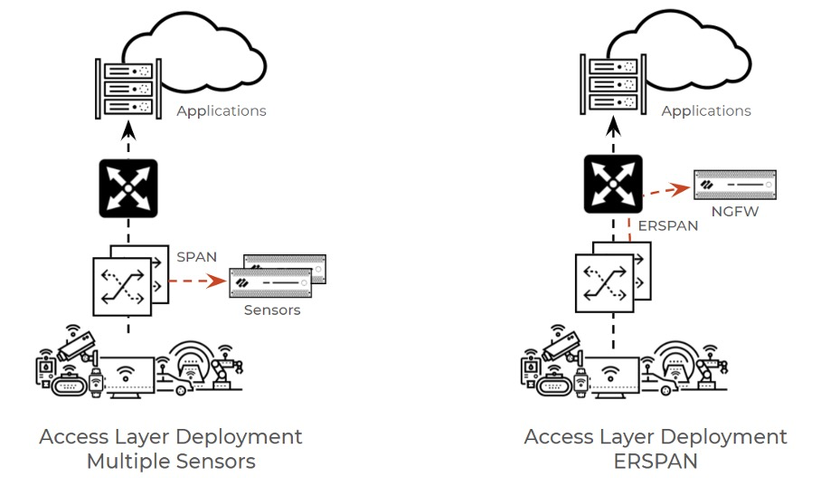

# CDSS

{: .no_toc}

## 目录

{: .no_toc .text-delta }

1. TOC
{:toc}

## Advanced DNS Security

Why：

- 根据 Unit42 调查，85% 的 malware 会借用 DNS 进行 C2 通信，DNS 可被用于数据提取、C2、DDoS 等

解决的问题：

- 对 DNS 流量进行实时的探测，检测 DNS 请求和回应流量中的异常/恶意流量
- 防止到恶意域名的访问（先本地检测，再云端检测）
- 避免 DNS 劫持、DNS 误配置、DNS 隧道、DNS 缓存中毒等问题
- DNS 影子资产发现：发现并控制企业中 DNS 的配置和流量

优势：

- 传统 DNS 安全通常依赖于日志，以及事后分析，DNS Security 则可以实时进行威胁发现和阻断
- 可以无缝接入网络中，不需要调整 DNS 架构
- DNS 的流量通常很大，所以很难基于日志去分析
- 具备自动学习功能，可建立 DNS 基线，或者手动创建 DNS 流量 Profile

传统方案：

- SWG：SWG 通常只关心 Web 安全，不会聚焦 DNS 安全，而安全建设需要从多个层面建立深度防御
- 独立的可进行 DNS 保护的方案：比如 IPS、Web 安全、CASB 等，这些方案各有侧重点，如果想全方位保护 DNS 可能需要多个独立的方案
- 基于防火墙的保护：通常会有域名黑名单，但是黑名单通常覆盖有限；同时也比较难防护复杂的攻击技术
- 基于 DNS Server 的防护，比如 DDI：通过过滤 DNS Server 侧的请求来实现，但是不能解决 Client 侧 DNS 配置错误/被篡改的问题

### 对于 DoT 和 DoH 的支持

DoH：DNS over HTTPS

- 可以通过 App-ID 识别 DoH 流量，进而阻止 DoH 流量（需要解密）

DoT：DNS over TLS

- 执行解密，然后配置 DNS 安全策略

## IoT

IOT 功能如何跟踪设备？

需要通过设备的 MAC+IP 地址。优先使用 MAC+IP（MAC 用于区分设备，IP 用于识别流量）。如果设备使用的静态 IP，而且无法采集到 MAC/IP 映射关系，则可以使用设备 IP 作为唯一标识：

| **Traffic Type** | **Device Type** | **Unique Identifier** | **Note**                                                     |
| ---------------- | --------------- | --------------------- | ------------------------------------------------------------ |
| L2               | DHCP            | Device MAC            | Device MAC from DHCP or ARP traffic                          |
| L2               | Static IP       | Device MAC            | Device MAC from ARP traffic                                  |
| L3               | DHCP            | Device MAC            | Real-time IP/MAC binding from,DHCP traffic (inline or TAP)DHCP Relay AgentSNMP CrawlingDHCP Server Log Ingestion |
| L3               | Static IP       | Device IP             | Need input from user                                         |

### 通过 DHCP 获取 MAC/IP 绑定

- 监听 DHCP 流量：通过 inline 部署或者流量镜像（SPAN/RSPAN/ERSPAN）的方式，看到 DHCP 请求和响应的包（建议监听 DHCP Server 侧，这样简单一些，而且可以看到所有 DHCP 请求和响应）
  - Inline 部署限制条件会多一些，要求 DHCP relay、DHCP 请求流量能够经过防火墙
  - 流量镜像部署则需要看环境是否支持，比如 DHCP Client 和 Server 都在虚拟化内时可能比较难做镜像

- DHCP Server Log（PAN-OS 10.2），[获取 DHCP Server 日志](https://docs.paloaltonetworks.com/iot/iot-security-admin/get-started-with-iot-security/firewall-deployment-for-dhcp-visibility/use-dhcp-server-logs-to-increase-device-visibility)：
  - 支持 InfoBlox、Windows、Linux、Cisco 等

- DHCP Relay Agent：将 NGFW 作为 Secondary DHCP Server，所以会有一份 DHCP 流量 copy 发送给防火墙

### 通过 ARP 获取 MAC/IP 绑定

- ARP：通过 SPAN 或者 NGFW 作为网关（SVI 口）接入网络中，这样便可学到所有设备的 ARP 请求和响应
  - 优点：支持静态 IP 的环境（设备最终通信始终会用到 ARP）

### 其他方式

- SNMP 查询：
  - 通过 CDP/LLDP 等发现邻居的设备
  - 通过 SNMP 查询设备上的 ARP 表
- 其他网管工具：IPAM、Cisco Prime、Cisco ISE、Cisco DNA Center 等

### 静态 IP 

如果无法采集到 MAC/IP 映射关系，则可以使用设备 IP 作为唯一标识，支持导入单个 IP 或者 IP 范围。

系统也支持使用 AI 分析流量来判断一个设备是否使用静态 IP。

### 部署模式

- 理想的部署架构：

防火墙可以同时监控到东西向和南北向的流量，进行相应的隔离和安全过滤。

- 在接入层做 SPAN/ERSPAN：可以最大程度上获取到 IOT 设备的流量，但是配置复杂度高，灵活性差：

- 在汇聚层做 SPAN 或者 Inline 部署：比较均衡的一种方案

- 分别在南北向边界以及 DC 边界部署防火墙：可能会失去对一些二层流量的监控

### IoT 部署时的调研问题

1. 当前的硬件防火墙位置在哪里？
2. 网络架构
   1. 网络架构怎样的？核心-汇聚-接入？IoT 设备的网关在哪里？
   2. IoT 设备通信路径是怎样的？（比如管理端是在私有云还是公有云？）
   3. 分支有没有 IoT 设备？有多少园区和分支，之间如何互联？
3. DHCP 架构是怎样的？
   1. 集中式的 DHCP 服务器？设备/VM 放在哪里？
   2. 分布式的 DHCP 服务器？（比如使用交换机来做 DHCP）
