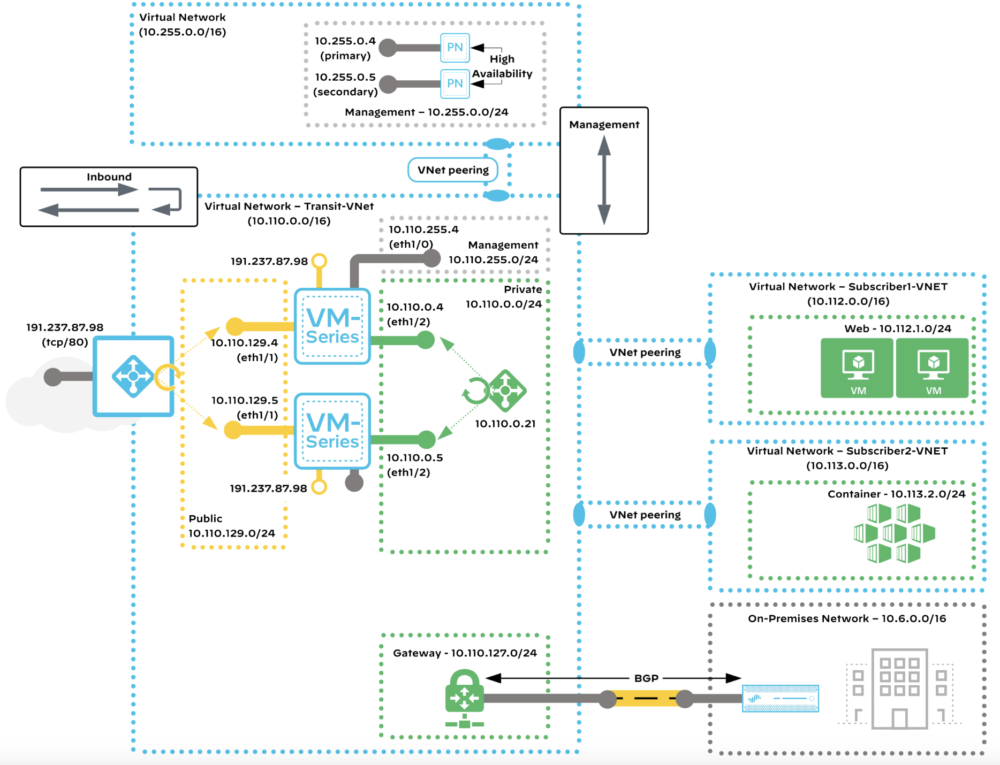
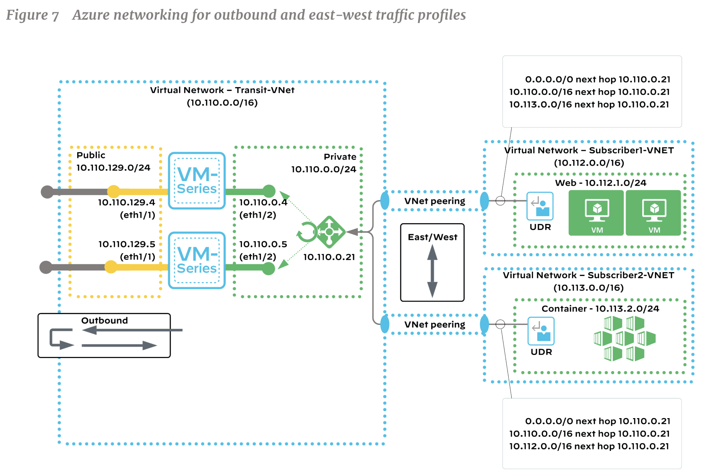

# VM-Series

{: .no_toc}

## 目录

{: .no_toc .text-delta }

1. TOC
{:toc}

## VM-Series

每个 Scaling Group 最大可以有 16 个 VM 防火墙。

每个业务 VPC 有 Transit endpoint 来将流量发送给 Transit Gateway。

## Flow Resiliency 

### Azure 上的 VNet 设计

https://www.paloaltonetworks.com/apps/pan/public/downloadResource?pagePath=/content/pan/en_US/resources/guides/azure-transit-vnet-deployment-guide-common-firewall-option

东西向流量

