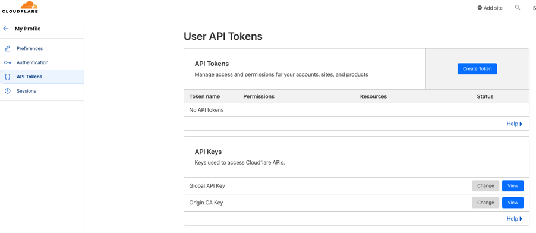

# 通过 Certbot+Cloudflare 自动申请证书


{: .no_toc}

## 目录

{: .no_toc .text-delta }


1. TOC
{:toc}

## 前提准备

最近把自建的 Nextcloud 网盘放在了互联网，于是打算搞个证书保证外网的访问安全，和同事聊了一圈，发现有个非常方便的工具叫 certbot 可以完美实现这个需求，certbot 具体使用逻辑如下：

- 自己一定要有一个公网域名，比如我在 Godaddy 购买了域名，然后把 DNS 解析交给 Cloudflare 来实现
- 在 Cloudflare 申请一个 token，用于 API 调用来进行 DNS 操作
- 在 Linux 上安装 certbot，调用 Cloudflare 接口自动验证域名，然后到 let's encrypt 申请证书


certbot 相比 cert-manager、acme-companion 等方案灵活性高，可以用来为未联网的系统申请证书。

## 申请证书具体操作

1、Linux 安装 certbot 和 Cloudflare 对接的组件：

```shell
yum install -y certbot certbot-dns-cloudflare
```

2、准备 Cloudflare token

在 Cloudflare 的 Profile 中创建 API token：



将 token 写入配置文件：

```shell
 cat > /root/nextcloud/cloudflare.ini <<EOF
 xxxxxxxxxxxxxxxxxxxxxxx
 EOF
```

3、通过 certbot 生成证书（初次运行需要按照提示输入邮箱等信息）：

```shell
certbot certonly --dns-cloudflare --dns-cloudflare-credentials /root/nextcloud/cloudflare.ini -d cloud.halfcoffee.com
# certonly 表示申请证书
# dns-cloudflare 指定 DNS 服务商为 Cloudflare
# dns-cloudflare-credentials 指定 token 文件位置
```

最终证书会保存在`/etc/letsencrypt/live/cloud.halfcoffee.com/` 中：

- cert.pem：证书文件
- privkey.pem：私钥

参考文档：

https://certbot-dns-cloudflare.readthedocs.io/en/stable/index.html

## 续签证书

在初次创建完证书后，certbot 会在  `/etc/letsencrypt/renewal/cloud.halfcoffee.com.conf` 中保存之前的配置，包括域名、token 文件等，内容如下：

```shell
# renew_before_expiry = 30 days
version = 1.11.0
archive_dir = /etc/letsencrypt/archive/cloud.halfcoffee.com
cert = /etc/letsencrypt/live/cloud.halfcoffee.com/cert.pem
privkey = /etc/letsencrypt/live/cloud.halfcoffee.com/privkey.pem
chain = /etc/letsencrypt/live/cloud.halfcoffee.com/chain.pem
fullchain = /etc/letsencrypt/live/cloud.halfcoffee.com/fullchain.pem

# Options used in the renewal process
[renewalparams]
authenticator = dns-cloudflare
account = xxxx
dns_cloudflare_credentials = /root/nextcloud/cloudflare.ini
manual_public_ip_logging_ok = None
server = https://acme-v02.api.letsencrypt.org/directory
```

直接使用 `certbot renew` 即可更新所有证书，默认只有在过期 30 天前时才会更新：

```shell
# certbot renew
Saving debug log to /var/log/letsencrypt/letsencrypt.log

- - - - - - - - - - - - - - - - - - - - - - - - - - - - - - - - - - - - - - - -
Processing /etc/letsencrypt/renewal/cloud.halfcoffee.com.conf
- - - - - - - - - - - - - - - - - - - - - - - - - - - - - - - - - - - - - - - -
Cert not yet due for renewal

- - - - - - - - - - - - - - - - - - - - - - - - - - - - - - - - - - - - - - - -
The following certificates are not due for renewal yet:
  /etc/letsencrypt/live/cloud.halfcoffee.com/fullchain.pem expires on 2024-01-28 (skipped)
No renewals were attempted.
- - - - - - - - - - - - - - - - - - - - - - - - - - - - - - - - - - - - - - - -
```


## 设置定期任务自动更新

脚本参考内容如下：

```shell
cat>>/root/nextcloud/deploy-new-cert.sh<<'EOF'
#!/bin/bash

# 将生成的证书复制给网盘的 nginx proxy 使用
cp /etc/letsencrypt/live/cloud.halfcoffee.com/cert.pem /nextcloud/certs/halfcoffee.com.crt
cp /etc/letsencrypt/live/cloud.halfcoffee.com/privkey.pem /nextcloud/certs/halfcoffee.com.key

# 重启网盘，让新证书生效
docker-compose -f /root/nextcloud/docker-compose.yml down
docker-compose -f /root/nextcloud/docker-compose.yml up -d
EOF
chmod +x /root/nextcloud/deploy-new-cert.sh
```


设置 crontab 每 30 天更新一次证书：

```bash
# crontab -e
0 8 */30 * * certbot renew --deploy-hook "bash /root/nextcloud/deploy-new-cert.sh"
```

